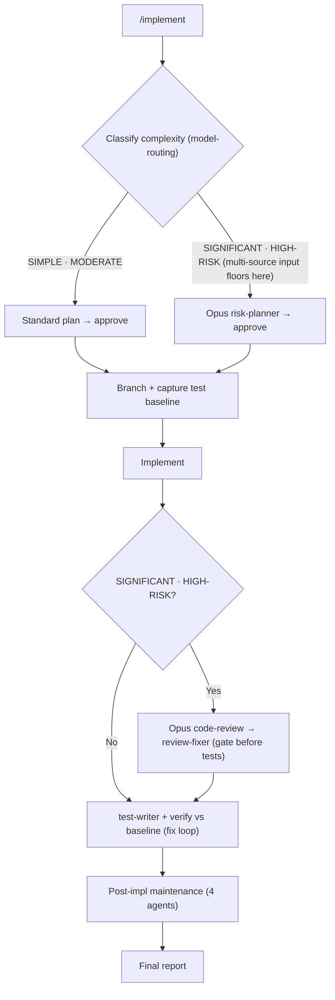

---
tags:
  - tasks-exclude
---
# dev-workflows Documentation-Consistency Refresh Implementation Plan

> **For agentic workers:** REQUIRED SUB-SKILL: Use superpowers:subagent-driven-development (recommended) or superpowers:executing-plans to implement this plan task-by-task. Steps use checkbox (`- [ ]`) syntax for tracking.

**Goal:** Make the dev-workflows README, repo-root CLAUDE.md, and model-routing SKILL.md accurately reflect the plugin as shipped (20 commands / 30 agents / 9 Opus gates / 13 model-routing consumers / full reference-doc catalog), replace the drift-prone `/implement` per-phase graph with a coarse one, wire the 4 orphan handoff citations, and bump to v2.30.0.

**Architecture:** In-place documentation edits across README.md (Tasks 1–5), CLAUDE.md (Task 6), SKILL.md (Task 7), 4 agent files (Task 8), and the two manifests + CHANGELOG (Task 9). Behavior-neutral except Task 8 (4 additive handoff citations). No command *body* is edited.

**Tech Stack:** Markdown, mermaid (v11), JSON manifests. NO test framework — every task's "test" is **structural verification** (`grep`, `python3 -c 'import json,...'`, `git diff`).

## Global Constraints

- **Version:** bump `dev-workflows` 2.29.0 → **2.30.0** in `plugins/dev-workflows/.claude-plugin/plugin.json` (line 3) **and** `.claude-plugin/marketplace.json` (line 12), lock-step (Task 9 only).
- **Count-strings byte-identical:** the spelled-out **"Twenty"** (commands) and **"Thirty"** (agents / "Thirty reusable subagents") already appear correctly in both manifests and must stay byte-identical — do NOT alter them. The README's wrong **"Twenty-six"** is corrected *to* **"Thirty"** (Task 1); it was never a valid count string.
- **Sibling plugins untouched:** `dt-style-guide` (0.2.2) and `obsidian-llm-wiki` (0.3.1) get a **0-line diff** in both files.
- **Command bodies untouched:** no file under `plugins/dev-workflows/commands/` is edited. `/vuln`, `/upgrade`, and all 20 command files stay byte-identical.
- **No new command / agent / hook** — file counts stay 20 commands / 30 agents.
- **Commit named files only** — `git add <explicit paths>`, never `git add -A`/`.`.
- **Commit trailer** on every commit, exactly: `Co-Authored-By: Claude Opus 4.8 (1M context) <noreply@anthropic.com>`.
- **Do NOT hand-commit** the vault spec/plan — the Obsidian vault is auto-backed-up by Obsidian Git.
- **README edit discipline (Tasks 1–5):** all five modify `plugins/dev-workflows/README.md` and MUST run **sequentially**. Anchor every `Edit` on a **unique current string** shown in the task, never a line number — earlier tasks shift line numbers.
- **No husky/prettier hook** in this repo — commit normally.
- Repo root: `/workspace/ihudak-claude-plugins`. Run all `git`/`grep` with `cd /workspace/ihudak-claude-plugins && …` (bash cwd resets between calls).

---

### Task 1: README — Agents section (findings #1, #2, #3)

**Files:**
- Modify: `plugins/dev-workflows/README.md` — the `## Agents` section (intro line, agents table, closing paragraph)

**Interfaces:**
- Consumes: nothing.
- Produces: an accurate Agents section. Later README tasks anchor on other sections.

- [ ] **Step 1: Fix the Agents intro count and Opus count**

Replace this exact line (the `## Agents` intro):

```
Twenty-six reusable subagents (invoked internally by the commands). The six Opus-backed reviewers/planners are pinned; the rest have no fixed pin — their tier is assigned per the model-routing policy (mechanical → Sonnet, synthesis/review → Opus).
```

with:

```
Thirty reusable subagents (invoked internally by the commands). The nine Opus-backed reviewers/planners are pinned; the rest have no fixed pin — their tier is assigned per the model-routing policy (mechanical → Sonnet, synthesis/review → Opus).
```

- [ ] **Step 2: Add the four missing agent rows**

The current table lists 26 rows (`risk-planner` … `api-guideline-reviewer`) and is missing `ard-reviewer`, `idea-reader`, `readiness-reviewer`, `vi-reviewer`. Insert these four rows into the table. Put the three Opus reviewers next to the other Opus reviewers (immediately after the `design-reviewer` row) and `idea-reader` among the per-routing agents (immediately after the `jira-reader` row). Rows to add after `design-reviewer`:

```
| `vi-reviewer` | Opus | Value-Increment reviewer for `/create-vi` — validates the VI against `references/vi-format.md`: mandatory-spine completeness, testable acceptance criteria, scope/success-metric clarity, and hollow-prose / filler (MAJOR). Verdict: PASS / PASS WITH RECOMMENDATIONS / BLOCK. |
| `ard-reviewer` | Opus | Architecture-decision-record reviewer for `/create-ard` — checks each `AD-N` has a concrete Binds/Prevents/Rule, grounding findings cite real `file:line`, the cross-repo map is coherent, and open questions are surfaced. Verdict: PASS / PASS WITH RECOMMENDATIONS / BLOCK. |
| `readiness-reviewer` | Opus | Readiness reviewer for `/ready` — verifies the Jira status against the actual ARD/spec/design artifacts and returns a SUPPORTED / PARTIAL / NOT-SUPPORTED readiness verdict. Read-only; never sets Jira status. |
```

Row to add after `jira-reader`:

```
| `idea-reader` | per routing | Read-only ingester for `/idea` — auto-detects the source type (inline prompt, markdown file with followed wikilinks/images, community post, or exported RFE Jira ticket) and returns a provenance-tagged normalization. Never writes files. |
```

- [ ] **Step 3: Fix the closing paragraph's "six Opus gates"**

Replace this exact sentence fragment in the paragraph after the table:

```
so the six Opus gates (`risk-planner`, `code-review`, `doc-reviewer`, `epic-reviewer`, `spec-reviewer`, `design-reviewer`) run on Opus automatically, with no caller-side `model` override or file-path reference.
```

with:

```
so the nine Opus gates (`risk-planner`, `code-review`, `doc-reviewer`, `epic-reviewer`, `spec-reviewer`, `design-reviewer`, `vi-reviewer`, `ard-reviewer`, `readiness-reviewer`) run on Opus automatically, with no caller-side `model` override or file-path reference.
```

- [ ] **Step 4: Verify**

```bash
cd /workspace/ihudak-claude-plugins
grep -c "Twenty-six" plugins/dev-workflows/README.md          # expect 0
grep -c "Thirty reusable subagents" plugins/dev-workflows/README.md   # expect >=1
grep -c "the nine Opus" plugins/dev-workflows/README.md        # expect 1
grep -Ec '^\| `(vi-reviewer|ard-reviewer|readiness-reviewer|idea-reader)`' plugins/dev-workflows/README.md  # expect 4
grep -c "the six Opus gates" plugins/dev-workflows/README.md   # expect 0
# table row count for agents (rows between the header separator and the closing paragraph) should be 30:
awk '/^\| Agent \| Model/{f=1;next} f&&/^\|-/{next} f&&/^\|/{c++} f&&/^$/{f=0} END{print c}' plugins/dev-workflows/README.md   # expect 30
```

- [ ] **Step 5: Commit**

```bash
cd /workspace/ihudak-claude-plugins
git add plugins/dev-workflows/README.md
git commit -m "docs(dev-workflows): correct README Agents section (30 agents, 9 Opus gates, +4 rows)

Co-Authored-By: Claude Opus 4.8 (1M context) <noreply@anthropic.com>"
```

---

### Task 2: README — Commands table + classification framing (findings #5, #6, and the discovered README classification paragraph)

**Files:**
- Modify: `plugins/dev-workflows/README.md` — the `## Commands` table (rows) and the classification paragraph beneath it.

**Interfaces:**
- Consumes: Task 1 done (sequential README discipline).
- Produces: a Commands table covering all 20 commands with one `/document` row; accurate classification framing.

- [ ] **Step 1: Merge the duplicate `/document` rows**

There are two `/document` rows. Row A (the first, comprehensive, covering both modes) begins `| \`/document <JiraID \| jira-export-dir \| description [saas\|managed]>\` |`. Row B (the second, Jira-mode-only duplicate) begins `| \`/document <VI-KEY \| jira-export-dir> [focus-Epic-KEY] [saas\|managed]\` |` and sits immediately after the `/docs-profile` row.

(a) In **Row A**, add `[focus-Epic-KEY]` to the signature — change the command cell from:

```
| `/document <JiraID \| jira-export-dir \| description [saas\|managed]>` |
```

to:

```
| `/document <JiraID \| VI-KEY \| jira-export-dir \| description> [focus-Epic-KEY] [saas\|managed]` |
```

(b) **Delete Row B entirely** (the whole `| \`/document <VI-KEY \| jira-export-dir> [focus-Epic-KEY] [saas\|managed]\` | (Jira mode) Jira-driven feature documentation. … never an API call). |` line).

- [ ] **Step 2: Add the 8 missing command rows**

After the `/design` row (the last current row, before the blank line preceding `**Next-step guidance.**`), append these 8 rows:

```
| `/ready <VI-KEY \| Epic-KEY \| jira-export-dir>` | Status-anchored readiness gate (QA). Reads the Jira status (the source of truth — never a custom field) and **verifies** it against the actual ARD / specification / design artifacts, returning a `SUPPORTED` / `PARTIAL` / `NOT-SUPPORTED` verdict via the Opus `readiness-reviewer`. Read-only — never sets Jira status. |
| `/feedback <text>` | Log a manual note about the plugin itself (`origin: manual`), tied to no command. Part of the session-feedback improvement loop; persisted specs-first per `references/feedback-emission.md`. |
| `/prompt <text>` | Capture a corrective interaction (a command produced something wrong; you fix it) as Friction + verbatim prompt + Resolution (`origin: prompt`), then act on the correction directly. |
| `/prompt-brainstorm <text>` | Same capture as `/prompt`, then hand off to `superpowers:brainstorming`. |
| `/prompt-grill-me <text>` | Same capture as `/prompt`, then grill the fix **inline** — a bounded one-question-at-a-time interrogation following the embedded grilling technique. Self-contained; no plugin dependency. |
| `/statusline` | Install the plugin's multi-line, truecolor status line into `~/.claude/settings.json` (idempotent; backs up any existing script + block). **Run this first.** Also enables the Option-B cost cross-check. |
| `/api-guideline-reviewer` | Standalone review command — reviews OpenAPI specification files against Dynatrace REST API + IAM permission naming guidelines. |
| `/guideline-reviewer` | Standalone review command — reviews Dynatrace app code and UI against the Dynatrace Experience Standards (GUIDElines). |
```

- [ ] **Step 3: Fix the stale classification paragraph**

Replace this exact sentence (the opening of the classification paragraph beneath the table):

```
Six of the seven dev-workflows commands — `/implement`, `/document` (both modes), `/epics`, `/release-notes`, `/specify`, and `/design` — classify tasks as SIMPLE / MODERATE / SIGNIFICANT / HIGH-RISK before acting (`/document` direct mode only ever lands SIMPLE or MODERATE; `/document` Jira mode is typically SIGNIFICANT; `/specify` Phase 1.5 is typically MODERATE; `/design` Phase 1.5 scales grill/section/review depth and gates the model tier). `/docs-profile` runs at a fixed SIGNIFICANT (no per-task classification). The three code-oriented commands (`/implement`, `/vuln`, `/upgrade`) also:
```

with:

```
Most pipeline commands classify tasks as SIMPLE / MODERATE / SIGNIFICANT / HIGH-RISK before acting via the `model-routing` skill — `/implement`, `/document` (both modes), `/epics`, `/release-notes`, `/idea`, `/create-vi`, `/create-ard`, `/specify`, `/design`, and `/ready` (`/document` direct mode only ever lands SIMPLE or MODERATE; `/document` Jira mode is typically SIGNIFICANT; `/specify` Phase 1.5 is typically MODERATE; `/design` Phase 1.5 scales grill/section/review depth and gates the model tier). `/docs-profile` runs at a fixed SIGNIFICANT (no per-task classification). The three code-oriented commands (`/implement`, `/vuln`, `/upgrade`) also:
```

- [ ] **Step 4: Verify**

```bash
cd /workspace/ihudak-claude-plugins
grep -c "^| \`/document" plugins/dev-workflows/README.md          # expect 1 (merged)
grep -Ec '^\| `(/ready|/feedback|/prompt|/prompt-brainstorm|/prompt-grill-me|/statusline|/api-guideline-reviewer|/guideline-reviewer)' plugins/dev-workflows/README.md   # expect 8
grep -c "Six of the seven" plugins/dev-workflows/README.md       # expect 0
grep -c "Most pipeline commands classify" plugins/dev-workflows/README.md   # expect 1
# every command file now appears at least once as a table row:
for c in $(ls plugins/dev-workflows/commands/*.md | xargs -n1 basename | sed 's/.md//'); do grep -q "^| \`/$c" plugins/dev-workflows/README.md || echo "MISSING ROW: /$c"; done   # expect no output
```

- [ ] **Step 5: Commit**

```bash
cd /workspace/ihudak-claude-plugins
git add plugins/dev-workflows/README.md
git commit -m "docs(dev-workflows): complete README Commands table (+8 rows, merge /document) + fix classification framing

Co-Authored-By: Claude Opus 4.8 (1M context) <noreply@anthropic.com>"
```

---

### Task 3: README — Reference-docs catalog (finding #7)

**Files:**
- Modify: `plugins/dev-workflows/README.md` — the `## Reference docs` bullet list.

**Interfaces:**
- Consumes: Tasks 1–2 done.
- Produces: a catalog with a bullet (or dir-bullet) for every file under `references/`.

- [ ] **Step 1: Re-derive the authoritative gap**

```bash
cd /workspace/ihudak-claude-plugins/plugins/dev-workflows
# every reference file:
find references -type f \( -name '*.md' -o -name '*.yml' -o -name '*.yaml' -o -name '*.txt' \) | sort > /tmp/ref-all.txt
# already catalogued (grep the backtick-quoted paths in the catalog):
sed -n '/## Reference docs/,/## Architecture (ARD) consumption/p' README.md | grep -oE 'references/[^`]+' | sort -u > /tmp/ref-cat.txt
# the dir-bullets `references/api-guidelines/`, `references/guidelines/`, `references/handoff/`, and (from the Dependencies section) prose links cover their subtrees — treat any file under a catalogued `*/` dir as covered.
```

The expected uncatalogued top-level set (verify against the diff; ~18): `ard-format.md`, `ard-resolution.md`, `context-management.md`, `dependencies.md`, `design-format.md`, `escalation-rules.md`, `grilling-technique.md`, `idea-format.md`, `jira-input-resolution.md`, `next-phase-offer.md`, `pre-lint.md`, `session-hygiene.md`, `specification-format.md`, `vi-format.md`, `workflow-states.md`, `dynatrace-docs/docs-profile-schema.md`, `dynatrace-docs/docs-profile.default.yml`, `dynatrace-docs/frontmatter-guidelines.md`. (Files under `references/handoff/`, `references/api-guidelines/`, `references/guidelines/`, and `references/model-routing/` are already covered by their dir-bullet or an existing bullet — do NOT add per-file bullets for those.)

- [ ] **Step 2: Add the missing bullets**

Insert these bullets into the `## Reference docs` list. Group the VI-creation-flow authoring formats and cross-cutting SSOTs together (after the existing `references/model-routing/classification.md` bullet), and the three `dynatrace-docs/` files beside the existing `dynatrace-docs/` bullets:

```
- `references/idea-format.md` — the lean one-page `idea.md` format authored by `/idea`
- `references/vi-format.md` — the Value-Increment format (mandatory spine + adapt-in menu) authored by `/create-vi`
- `references/ard-format.md` — the ARD format (`AD-N: Binds/Prevents/Rule`) authored by `/create-ard`
- `references/specification-format.md` — the org-standard `specification.md` format authored by `/specify`
- `references/design-format.md` — the engineering `design.md` format authored by `/design`
- `references/ard-resolution.md` — most-specific-first ARD resolution (per-area → Epic-level → inherited VI-level) consumed by `/design`, `/implement`, `/specify`, `/epics`
- `references/grilling-technique.md` — the embedded bounded one-question-at-a-time grilling SSOT (used by `/idea`, `/create-vi`, `/specify`, `/design`, `/prompt-grill-me`)
- `references/next-phase-offer.md` — the role-aware next-step routing graph (PM → PA → PE → Team) emitted at the end of every pipeline command
- `references/session-hygiene.md` — the prepare-checkpoint + role-aware `/compact` vs `/clear` suggestion + `/rename` aid (guidance-only)
- `references/context-management.md` — mid-run context-window guidance cited by `/implement`
- `references/pre-lint.md` — the deterministic advisory pre-reviewer grep checks (universal + per-artifact)
- `references/escalation-rules.md` — when a run halts on a plugin gap or an unmounted repo, how to escalate
- `references/jira-input-resolution.md` — the shared Jira-input grammar front-end (JiraID / imported-dir / prompt) resolution
- `references/workflow-states.md` — the readiness rubric + Jira-status → phase mapping consumed by `/ready`
- `references/dependencies.md` — recommended companions (`superpowers`, `dt-style-guide`) + the external `jira-workitem-import` importer; every relationship is convention + runtime-resolve + graceful fallback
- `references/dynatrace-docs/docs-profile-schema.md` — the `.dev-workflows/docs-profile.yml` schema written by `/docs-profile`
- `references/dynatrace-docs/docs-profile.default.yml` — the built-in dynatrace-docs default profile used when a repo has none
- `references/dynatrace-docs/frontmatter-guidelines.md` — dynatrace-docs frontmatter rules (description length, content-type enum, i18n-priority) applied by `/document` (Jira mode)
```

- [ ] **Step 3: Verify**

```bash
cd /workspace/ihudak-claude-plugins/plugins/dev-workflows
# every top-level reference .md (excluding covered dir subtrees) is now catalogued:
for f in ard-format ard-resolution context-management dependencies design-format escalation-rules grilling-technique idea-format jira-input-resolution next-phase-offer pre-lint session-hygiene specification-format vi-format workflow-states; do grep -q "references/$f.md" README.md || echo "MISSING: $f"; done   # expect no output
for f in docs-profile-schema.md docs-profile.default.yml frontmatter-guidelines.md; do grep -q "references/dynatrace-docs/$f" README.md || echo "MISSING: $f"; done   # expect no output
```

- [ ] **Step 4: Commit**

```bash
cd /workspace/ihudak-claude-plugins
git add plugins/dev-workflows/README.md
git commit -m "docs(dev-workflows): catalog all reference docs in README

Co-Authored-By: Claude Opus 4.8 (1M context) <noreply@anthropic.com>"
```

---

### Task 4: README — coarse-replace the `/implement` graph (spec §5)

**Files:**
- Modify: `plugins/dev-workflows/README.md` — the ` ```mermaid ` block under `## `/implement` workflow` (keep the heading, keep the prose and `/vuln`+`/upgrade` "Additionally" table after it).

**Interfaces:**
- Consumes: Tasks 1–3 done.
- Produces: a coarse, drift-resistant `/implement` graph; the `#implement-workflow` anchor still resolves.

- [ ] **Step 1: Replace the mermaid block only**

Under the `## `/implement` workflow` heading there is a ` ```mermaid ` … ` ``` ` block whose first content line is `flowchart TD` followed by `    A["User runs /implement ...`. Read the current block, then replace the **entire fenced mermaid block** (from the opening ` ```mermaid ` through its matching closing ` ``` `) with exactly this (keep the `## `/implement` workflow` heading line above it and all prose below it unchanged):

````

````

- [ ] **Step 2: Verify**

```bash
cd /workspace/ihudak-claude-plugins
grep -c 'User runs /implement' plugins/dev-workflows/README.md   # expect 0 (old graph gone)
grep -c 'Phase 0: Load' plugins/dev-workflows/README.md          # expect 0
grep -c 'Classify complexity (model-routing)' plugins/dev-workflows/README.md   # expect 1 (new graph)
grep -c "^## \`/implement\` workflow" plugins/dev-workflows/README.md   # expect 1 (heading + anchor kept)
grep -c 'Fix CVEs: research' plugins/dev-workflows/README.md     # expect 1 (the /vuln prose table kept)
# there must be exactly one Phase-N-free /implement mermaid block; confirm no "Phase " token remains in it:
awk '/^## `\/implement` workflow/{f=1} f&&/^```mermaid/{m=1} m&&/Phase [0-9]/{print "STALE PHASE NODE"} f&&/^## Agents/{f=0}' plugins/dev-workflows/README.md   # expect no output
```

Then confirm the new block parses as mermaid v11 (same validator the `## Workflow overview` graph passes) — visually inspect for balanced quotes/brackets; the controller may paste it into a mermaid live renderer if unsure.

- [ ] **Step 3: Commit**

```bash
cd /workspace/ihudak-claude-plugins
git add plugins/dev-workflows/README.md
git commit -m "docs(dev-workflows): replace stale /implement per-phase graph with a coarse decision-shape graph

Co-Authored-By: Claude Opus 4.8 (1M context) <noreply@anthropic.com>"
```

---

### Task 5: README — scattered staleness (findings #9, #11, #12)

**Files:**
- Modify: `plugins/dev-workflows/README.md` — three scattered spots (Session-feedback "eleven", preload-context hook row, `## Workflow overview` ready-edge).

**Interfaces:**
- Consumes: Tasks 1–4 done.
- Produces: the last README fixes.

- [ ] **Step 1: #9 — "eleven" → "twelve" and add `/ready`**

Replace this exact fragment (in the Session-feedback "Automatic." bullet):

```
The end-of-run maintenance phase of all eleven workflow commands
  (`/implement`, `/document`, `/epics`, `/vuln`, `/upgrade`, `/release-notes`,
  `/specify`, `/design`, `/idea`, `/create-vi`, `/create-ard`) projects
```

with:

```
The end-of-run maintenance phase of all twelve workflow commands
  (`/implement`, `/document`, `/epics`, `/vuln`, `/upgrade`, `/release-notes`,
  `/specify`, `/design`, `/idea`, `/create-vi`, `/create-ard`, `/ready`) projects
```

- [ ] **Step 2: #11 — preload-context `/docs-profile` wording**

In the `preload-context` hook row, the phrase `Matches \`/implement\`, \`/document\`, \`/docs-profile\`, \`/epics\`, …` wrongly lists `/docs-profile` under "Matches". Change the opening of that cell from:

```
Matches `/implement`, `/document`, `/docs-profile`, `/epics`, `/release-notes`, `/vuln`, `/upgrade` (with at least one non-flag argument), then routes:
```

to:

```
Matches `/implement`, `/document`, `/epics`, `/release-notes`, `/vuln`, `/upgrade` (with at least one non-flag argument), then routes:
```

(The tail of the cell already says `silent pass-through for /document (direct mode) and /docs-profile` — leave that; `/docs-profile` is genuinely not matched by the regex.)

- [ ] **Step 3: #12 — `/ready` mermaid edge label in `## Workflow overview`**

In the `## Workflow overview` mermaid block, replace the edge line:

```
    ready -. verifies spec+design .-> implement
```

with:

```
    ready -. verifies ARD/spec/design .-> implement
```

- [ ] **Step 4: Verify**

```bash
cd /workspace/ihudak-claude-plugins
grep -c "all eleven workflow commands" plugins/dev-workflows/README.md    # expect 0
grep -c "all twelve workflow commands" plugins/dev-workflows/README.md    # expect 1
grep -c 'Matches `/implement`, `/document`, `/docs-profile`' plugins/dev-workflows/README.md   # expect 0
grep -c 'verifies ARD/spec/design' plugins/dev-workflows/README.md        # expect 1
grep -c 'verifies spec+design' plugins/dev-workflows/README.md            # expect 0
```

- [ ] **Step 5: Commit**

```bash
cd /workspace/ihudak-claude-plugins
git add plugins/dev-workflows/README.md
git commit -m "docs(dev-workflows): fix scattered README staleness (twelve feedback cmds, preload-context, /ready edge)

Co-Authored-By: Claude Opus 4.8 (1M context) <noreply@anthropic.com>"
```

---

### Task 6: CLAUDE.md — model-routing list + relationships diagram (findings ##4a, #10)

**Files:**
- Modify: `/workspace/ihudak-claude-plugins/CLAUDE.md` — the model-routing "must load" paragraph (~lines 100–104), the `## dev-workflows workflow relationships` code block (~lines 112–135), and the `## Key invariants` section (~lines 137–190).

**Interfaces:**
- Consumes: nothing from README tasks (different file).
- Produces: CLAUDE.md reflects all 13 model-routing consumers and the 6 VI-creation commands.

- [ ] **Step 1: ##4a — fix the model-routing consumer list**

Replace this exact sentence:

```
All top-level commands that dispatch helper agents (`/implement`, `/document`,
`/epics`, `/release-notes`, `/vuln`, `/upgrade`) must load and follow this file at the
start of every invocation. Standalone review commands (`/api-guideline-reviewer`
and `/guideline-reviewer`) are exempt.
```

with:

```
All pipeline commands that invoke the `model-routing` skill (`/implement`, `/document`,
`/epics`, `/release-notes`, `/vuln`, `/upgrade`, `/docs-profile`, `/idea`, `/create-vi`,
`/create-ard`, `/specify`, `/design`, `/ready`) must load and follow this file at the
start of every invocation. The standalone review commands (`/api-guideline-reviewer`,
`/guideline-reviewer`) and the feedback / utility commands (`/feedback`, `/prompt`,
`/prompt-brainstorm`, `/prompt-grill-me`, `/statusline`) are exempt.
```

- [ ] **Step 2: #10 — add the 6 VI-creation dispatch lines to the relationships diagram**

The relationships code block (inside the triple-backtick fence under `## dev-workflows workflow relationships`) lists command→agent chains ending with `/upgrade …`, then a shared-agent tree (` └── …`), then `/api-guideline-reviewer` / `/guideline-reviewer`. Insert these 6 lines **immediately after the `/upgrade …` line and before the shared-agent tree** (the first ` └── test-baseliner …` line). First **verify each chain against its command file** (`grep -n "subagent_type\|Task tool\|dispatch\|reviewer" plugins/dev-workflows/commands/<cmd>.md`) and adjust arrows to match; the expected shape is:

```
/idea                → idea-reader → (embedded grilling) → write idea.md
/create-vi           → (embedded grilling) → [vi-reviewer@Opus] → write VI + relocate idea.md
/create-ard          → [ls $REPOS_PATH → code-scanner×N (confirmed set, parallel, cap 4)] → (embedded grilling) → [ard-reviewer@Opus] → write ARD
/specify             → jira-reader → (embedded grilling) → [spec-reviewer@Opus] → write specification.md
/design              → (embedded grilling, challenges spec) → [design-reviewer@Opus] → write design.md
/ready               → jira-reader + Jira status read → verify ARD/spec/design → [readiness-reviewer@Opus] → SUPPORTED/PARTIAL/NOT-SUPPORTED → impl-maintenance + emit-auto
```

- [ ] **Step 3: #10 — add the 6 agents to the shared-agent tree**

Immediately after the existing ` └── jira-reader … ` line in the shared-agent tree, append:

```
                      └── vi-reviewer         (used by /create-vi)                       @Opus
                      └── ard-reviewer        (used by /create-ard)                      @Opus
                      └── spec-reviewer       (used by /specify)                         @Opus
                      └── design-reviewer     (used by /design)                          @Opus
                      └── readiness-reviewer  (used by /ready)                           @Opus
                      └── idea-reader         (used by /idea)
```

- [ ] **Step 4: #10 — add a concise VI-creation invariants block**

At the end of the `## Key invariants` section (after the `/release-notes` invariants block, before `## Test-writing requirement for code changes`), add:

```
Key invariants for the VI-creation flow (`/idea`, `/create-vi`, `/create-ard`, `/specify`, `/design`, `/ready`):

- Each authoring command is gated by its own Opus reviewer (`vi-reviewer`, `ard-reviewer`, `spec-reviewer`, `design-reviewer`; `/ready` by `readiness-reviewer`); `/idea` has no reviewer — its bounded grill is the gate
- The embedded grill is **bounded** (≤5 questions; `--deep` on `/idea` relaxes it); leftover gaps become capped `[NEEDS CLARIFICATION]` markers + logged assumptions
- VI / ARD / `specification.md` / `design.md` are written under `$SPECS_PATH/specifications/<KEY>-<slug>/`; `/idea` writes `idea.md` under `$VAULT_PATH` (pre-VI-Key)
- `/create-ard` grounds on mounted repos it discovers (`$REPOS_PATH` listing + theme→repo proposal + confirm/mount-or-descope); it never reads PRs
- `/ready` is **read-only** — it verifies the Jira status against the ARD/spec/design and never sets status
- `/design`, `/implement`, `/specify`, `/epics` respect the applicable ARD via `references/ard-resolution.md`; an `AD-N` Rule violated without a recorded "ARD deviation" is a reviewer BLOCKER
```

- [ ] **Step 5: Verify**

```bash
cd /workspace/ihudak-claude-plugins
grep -c "invoke the \`model-routing\` skill" CLAUDE.md          # expect 1
grep -c "/create-vi\`, " CLAUDE.md                               # >=1 (in the new list)
for a in vi-reviewer ard-reviewer spec-reviewer design-reviewer readiness-reviewer idea-reader; do grep -q "$a" CLAUDE.md || echo "MISSING agent: $a"; done   # expect no output
grep -c "Key invariants for the VI-creation flow" CLAUDE.md      # expect 1
for c in /idea /create-vi /create-ard /specify /design /ready; do grep -q "^$c " CLAUDE.md || echo "MISSING diagram line: $c"; done   # expect no output
```

- [ ] **Step 6: Commit**

```bash
cd /workspace/ihudak-claude-plugins
git add CLAUDE.md
git commit -m "docs(dev-workflows): refresh CLAUDE.md model-routing list (13) + extend relationships diagram to VI-creation flow

Co-Authored-By: Claude Opus 4.8 (1M context) <noreply@anthropic.com>"
```

---

### Task 7: SKILL.md — model-routing consumer list (finding ##4b)

**Files:**
- Modify: `plugins/dev-workflows/skills/model-routing/SKILL.md` — the frontmatter `description:` field (line 3).

**Interfaces:**
- Consumes: nothing.
- Produces: the skill's own description names all 13 consumers.

- [ ] **Step 1: Fix the description**

Replace this exact frontmatter line:

```
description: Load the dev-workflows task-complexity classification rules and model fallback chain. Invoked by `/implement`, `/vuln`, `/upgrade`, `/document` (Jira mode), and `/epics` at their classification step, because slash-command bodies cannot expand ${CLAUDE_PLUGIN_ROOT} themselves.
```

with:

```
description: Load the dev-workflows task-complexity classification rules and model fallback chain. Invoked at the classification step by the 13 pipeline commands (`/implement`, `/document`, `/epics`, `/release-notes`, `/vuln`, `/upgrade`, `/docs-profile`, `/idea`, `/create-vi`, `/create-ard`, `/specify`, `/design`, `/ready`), because slash-command bodies cannot expand ${CLAUDE_PLUGIN_ROOT} themselves.
```

- [ ] **Step 2: Verify**

```bash
cd /workspace/ihudak-claude-plugins
grep -c "the 13 pipeline commands" plugins/dev-workflows/skills/model-routing/SKILL.md   # expect 1
grep -c "/create-vi\`" plugins/dev-workflows/skills/model-routing/SKILL.md                 # >=1
# frontmatter still valid (single description line, closing --- present):
sed -n '1,6p' plugins/dev-workflows/skills/model-routing/SKILL.md
```

- [ ] **Step 3: Commit**

```bash
cd /workspace/ihudak-claude-plugins
git add plugins/dev-workflows/skills/model-routing/SKILL.md
git commit -m "docs(dev-workflows): correct model-routing SKILL.md consumer list (13 commands)

Co-Authored-By: Claude Opus 4.8 (1M context) <noreply@anthropic.com>"
```

---

### Task 8: Wire the 4 orphan handoff citations (finding #8 + consistency guard)

**Files:**
- Modify: `plugins/dev-workflows/agents/code-scanner.md`, `agents/diff-summarizer.md`, `agents/impl-maintenance.md`, `agents/jira-reader.md`.

**Interfaces:**
- Consumes: nothing.
- Produces: the 4 agents each cite their handoff schema, matching the wired sibling pattern.

**Pattern (verbatim from the wired sibling `agents/upgrade-planner.md:14`):** the citation is the **first body line after the agent's `# <name> — <title>` H1 heading** (H1, blank line, then the citation line):

```
Read `${CLAUDE_PLUGIN_ROOT}/references/handoff/<name>.md` for the exact input/output document format.
```

- [ ] **Step 1: Consistency guard — compare each handoff `## Output` with the agent's inline `## Output`**

```bash
cd /workspace/ihudak-claude-plugins/plugins/dev-workflows
for a in code-scanner diff-summarizer impl-maintenance jira-reader; do
  echo "===== $a ====="; echo "--- agent ## Output ---"; sed -n '/^## Output/,/^## /p' agents/$a.md;
  echo "--- handoff ## Output ---"; sed -n '/^## Output/,/^## /p' references/handoff/$a.md;
done
```

For each agent, confirm the handoff file's `## Output` does not **contradict** the agent's inline `## Output` (field names, structure, status-code set). Expected default: they are consistent (overlapping, not conflicting). **If they genuinely contradict**, do NOT silently rewrite — align the handoff file to the agent's *current shipped* behavior with a minimal edit, and note the reconciliation in the task report. If they merely differ in detail (handoff has Input + Status-codes the agent omits), that is expected — no edit.

- [ ] **Step 2: Add the citation to `agents/code-scanner.md`**

Add, as the first body line after the `# code-scanner …` H1 (H1 / blank / citation):

```
Read `${CLAUDE_PLUGIN_ROOT}/references/handoff/code-scanner.md` for the exact input/output document format.
```

- [ ] **Step 3: Add the citation to `agents/diff-summarizer.md`**

```
Read `${CLAUDE_PLUGIN_ROOT}/references/handoff/diff-summarizer.md` for the exact input/output document format.
```

- [ ] **Step 4: Add the citation to `agents/impl-maintenance.md`**

```
Read `${CLAUDE_PLUGIN_ROOT}/references/handoff/impl-maintenance.md` for the exact input/output document format.
```

- [ ] **Step 5: Add the citation to `agents/jira-reader.md`**

```
Read `${CLAUDE_PLUGIN_ROOT}/references/handoff/jira-reader.md` for the exact input/output document format.
```

- [ ] **Step 6: Verify**

```bash
cd /workspace/ihudak-claude-plugins/plugins/dev-workflows
for a in code-scanner diff-summarizer impl-maintenance jira-reader; do
  grep -q "references/handoff/$a.md\` for the exact input/output document format" agents/$a.md && echo "$a OK" || echo "$a MISSING";
done   # expect 4× OK
# citation sits right after the H1 (line with "# <name>"), within the first ~5 lines of body:
for a in code-scanner diff-summarizer impl-maintenance jira-reader; do awk 'NR<=6 && /references\/handoff\//{print FILENAME": "NR}' agents/$a.md; done
```

- [ ] **Step 7: Commit**

```bash
cd /workspace/ihudak-claude-plugins
git add plugins/dev-workflows/agents/code-scanner.md plugins/dev-workflows/agents/diff-summarizer.md plugins/dev-workflows/agents/impl-maintenance.md plugins/dev-workflows/agents/jira-reader.md
git commit -m "feat(dev-workflows): wire the 4 orphan handoff schema citations into their agents

Co-Authored-By: Claude Opus 4.8 (1M context) <noreply@anthropic.com>"
```

---

### Task 9: Manifests + CHANGELOG — bump to 2.30.0

**Files:**
- Modify: `plugins/dev-workflows/.claude-plugin/plugin.json` (line 3, version), `.claude-plugin/marketplace.json` (line 12, dev-workflows version), `plugins/dev-workflows/CHANGELOG.md` (new entry at top).

**Interfaces:**
- Consumes: Tasks 1–8 done (this is the release commit).
- Produces: v2.30.0 lock-step + changelog.

- [ ] **Step 1: Bump `plugin.json`**

Change `"version": "2.29.0",` → `"version": "2.30.0",` in `plugins/dev-workflows/.claude-plugin/plugin.json`. Do NOT touch the `description` (its "Twenty"/"Thirty" strings and command/agent enumeration are already correct).

- [ ] **Step 2: Bump `marketplace.json`**

Change the **dev-workflows** entry's `"version": "2.29.0",` → `"version": "2.30.0",` at line 12 of `.claude-plugin/marketplace.json`. Do NOT touch the sibling entries (`dt-style-guide` 0.2.2 at ~line 24, `obsidian-llm-wiki` 0.3.1 at ~line 36) or the dev-workflows description.

- [ ] **Step 3: Add the CHANGELOG entry**

Insert this block immediately after the header lines (before `## [2.29.0] — 2026-07-13`) in `plugins/dev-workflows/CHANGELOG.md` (em-dash U+2014 in the date, matching prior entries):

```
## [2.30.0] — 2026-07-13

### Changed

- **Documentation-consistency refresh.** README, repo-root CLAUDE.md, and the `model-routing` SKILL.md were brought in line with the plugin as shipped: the README Agents section now says **Thirty** subagents and **nine** Opus gates (added `vi-reviewer`, `ard-reviewer`, `readiness-reviewer`, `idea-reader` rows); the Commands table covers all 20 commands (one merged `/document` row + 8 previously-undocumented commands) with corrected classification framing; the Reference-docs catalog lists the ~18 SSOTs added since v2.14; and the `model-routing` consumer list is corrected to the **13** commands that invoke it (in CLAUDE.md and the skill's own description).
- **CLAUDE.md relationships diagram** extended to the six VI-creation-flow commands (`/idea`, `/create-vi`, `/create-ard`, `/specify`, `/design`, `/ready`) and their agents, with a concise VI-creation invariants block.
- The stale `## /implement workflow` per-phase mermaid graph was **replaced** with a coarse decision-shape graph (no Phase-N nodes) that no longer drifts when a phase is inserted.

### Added

- The four handoff-schema references (`code-scanner`, `diff-summarizer`, `impl-maintenance`, `jira-reader`) are now cited by their agents, matching the wired sibling pattern.

### Notes

- No new command, agent, or hook — counts unchanged (Twenty slash commands / Thirty reusable subagents). Docs + one additive agent citation each; no command body changed.

```

- [ ] **Step 4: Verify**

```bash
cd /workspace/ihudak-claude-plugins
python3 -c "import json;print(json.load(open('plugins/dev-workflows/.claude-plugin/plugin.json'))['version'])"   # expect 2.30.0
python3 -c "import json;d=json.load(open('.claude-plugin/marketplace.json'));print([(p['name'],p['version']) for p in d['plugins']])"   # dev-workflows 2.30.0; dt-style-guide 0.2.2; obsidian-llm-wiki 0.3.1
grep -c "Twenty slash commands" plugins/dev-workflows/.claude-plugin/plugin.json .claude-plugin/marketplace.json   # unchanged (1 each)
grep -c "Thirty reusable subagents" plugins/dev-workflows/.claude-plugin/plugin.json .claude-plugin/marketplace.json   # unchanged (1 each)
grep -c "## \[2.30.0\]" plugins/dev-workflows/CHANGELOG.md   # expect 1
# no-regression: siblings + all command bodies byte-identical vs main
git fetch -q origin 2>/dev/null || true
git diff --stat main -- plugins/dt-style-guide plugins/obsidian-llm-wiki plugins/dev-workflows/commands   # expect NO output
```

- [ ] **Step 5: Commit**

```bash
cd /workspace/ihudak-claude-plugins
git add plugins/dev-workflows/.claude-plugin/plugin.json .claude-plugin/marketplace.json plugins/dev-workflows/CHANGELOG.md
git commit -m "chore(dev-workflows): bump to 2.30.0 + CHANGELOG (doc-consistency refresh)

Co-Authored-By: Claude Opus 4.8 (1M context) <noreply@anthropic.com>"
```

---

## Whole-branch verification (after all tasks)

```bash
cd /workspace/ihudak-claude-plugins
# 1. no command body touched, siblings untouched:
git diff --stat main -- plugins/dev-workflows/commands plugins/dt-style-guide plugins/obsidian-llm-wiki   # expect empty
# 2. counts still 20 / 30:
echo "commands=$(ls plugins/dev-workflows/commands/*.md | wc -l) agents=$(ls plugins/dev-workflows/agents/*.md | wc -l)"   # 20 / 30
# 3. no stale /impl: residue introduced anywhere:
grep -rn "/impl:" plugins/dev-workflows README.md CLAUDE.md 2>/dev/null   # expect empty
# 4. both manifests parse and are lock-step at 2.30.0 (Task 9 verify)
# 5. every reference file catalogued; every command has a README row; every agent has a table row (Tasks 2,1,3 verify)
```

## Notes for the executor

- **Model routing:** Tasks 1–5, 7, 9 are mechanical transcription of exact text → cheapest tier. Task 6 (CLAUDE.md diagram, verify-arrows-against-command-files) and Task 8 (consistency guard) carry judgment → mid-tier. The final whole-branch review → most capable (Opus).
- **README sequencing:** Tasks 1→2→3→4→5 all edit README.md; run strictly in order and re-anchor on the unique strings shown (line numbers drift).
- **The one discovered addition beyond the spec's explicit finding list:** the README classification paragraph fix in Task 2 Step 3 ("Six of the seven …" → "Most pipeline commands …"). It is the same defect class as finding #4 (stale model-routing-consumer statement). Flag it in the final report so the maintainer can veto if unwanted.
