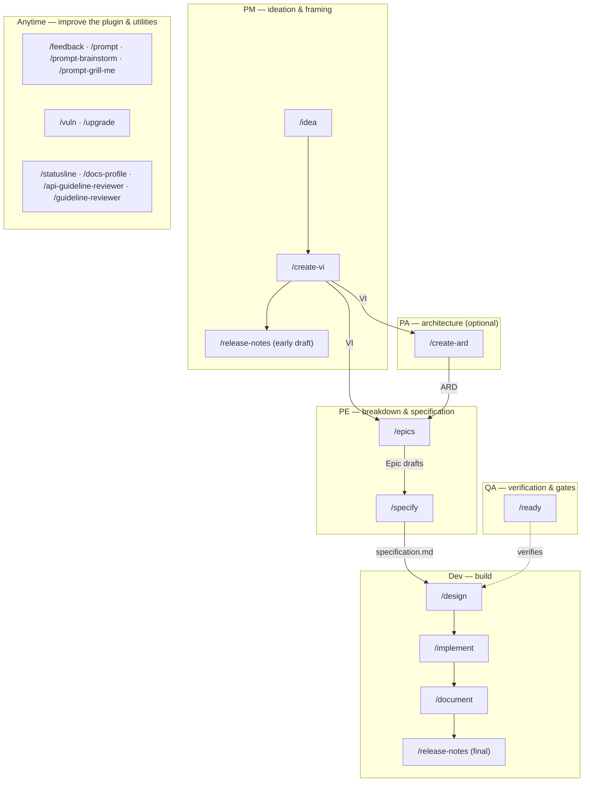

---
tags:
  - tasks-exclude
---

# Workflow role-graph Implementation Plan

> **For agentic workers:** REQUIRED SUB-SKILL: Use superpowers:subagent-driven-development (recommended) or superpowers:executing-plans to implement this plan task-by-task. Steps use checkbox (`- [ ]`) syntax for tracking.

**Goal:** Add a role-annotated workflow-overview graph to the dev-workflows README, correct the stale command count, de-stale the repo-root CLAUDE.md `/impl:*` taxonomy, and reconcile `/specify` to the PE role — shipped as dev-workflows v2.27.0.

**Architecture:** Pure documentation + one role-label correction. Four independently-reviewable tasks, each ending in a commit of named files only. No runtime behavior changes; no new command/agent.

**Tech Stack:** Markdown, mermaid (already used by the `/implement` diagram), JSON manifests. NO test framework — verification is structural (grep, `python3 -c json.load`, `git diff --stat`).

## Global Constraints

- **Repo:** `/workspace/ihudak-claude-plugins`. All paths below are absolute.
- **Version bump:** dev-workflows `2.26.0` → `2.27.0` in BOTH `plugins/dev-workflows/.claude-plugin/plugin.json` (line 3) and `.claude-plugin/marketplace.json` (line 12, dev-workflows entry). **Note the `.claude-plugin/` nesting — there is no `plugin.json` directly under `plugins/dev-workflows/` and no `marketplace.json` at the repo root.**
- **Siblings untouched:** dt-style-guide stays `0.2.2` (marketplace line 24), obsidian-llm-wiki stays `0.3.1` (marketplace line 36); both sibling plugin dirs are 0-line diff.
- **Manifest count-strings BYTE-IDENTICAL:** the `"description"` strings in plugin.json (line 4) and marketplace.json (line 13) — which open "Twenty slash commands — …", enumerate "Thirty reusable subagents (…)", and end "four hooks (…)" — must NOT change (no command/agent added or removed). Only the `"version"` lines change.
- **Counts unchanged:** 20 commands, 30 agents.
- **`dt-doc-fixer` is a real `dt-style-guide` agent** — do NOT remove it. The spec's note calling it non-existent was mistaken. Task 2 de-stales *command names only* and preserves every agent reference verbatim.
- **Commit named files only — NEVER `git add -A`.**
- **Commit trailer EXACTLY** (last line of every commit message body):
  `Co-Authored-By: Claude Opus 4.8 (1M context) <noreply@anthropic.com>`
- **No husky/prettier hook exists in this repo** (that hook belongs to the docs repo). Commit normally.
- Work on a branch off `main` (e.g. `ivgu/NOISSUE-workflow-role-graph`); do not commit on `main`.

---

### Task 1: README — `## Workflow overview` section + line-3 count fix

**Files:**
- Modify: `/workspace/ihudak-claude-plugins/plugins/dev-workflows/README.md` (line 3; insert a new section before `## Session feedback` at line 35)

**Interfaces:**
- Produces: the `## Workflow overview` section that Task 3 leaves untouched (Task 3 edits a different region — the `/specify` command-table row at line 20).

- [ ] **Step 1: Fix the stale count on line 3**

Replace the exact line-3 string:

```
Twelve workflow slash commands for idea refinement, VI authoring, architecture, structured implementation, one-shot doc edits, docs-repo profile scanning, Jira-driven feature documentation, Epic drafting, specification authoring, engineering design authoring, release-notes drafting, vulnerability remediation, and dependency upgrades — with Opus-backed risk planning, post-implementation code review, test regression detection, and prose-style / Opus doc review gates.
```

with:

```
Twenty slash commands spanning idea refinement, VI authoring, architecture (ARD), Epic drafting, specification authoring, engineering design, readiness gating, structured implementation, one-shot doc edits, docs-repo profile scanning, Jira-driven feature documentation, release-notes drafting, vulnerability remediation, and dependency upgrades — plus API and UI guideline reviewers and feedback/prompt/statusline utilities — with Opus-backed risk planning, post-implementation code review, test regression detection, and prose-style / Opus doc review gates.
```

- [ ] **Step 2: Insert the `## Workflow overview` section before `## Session feedback`**

Find this exact boundary (lines 33–35):

```
`/implement` adds test-writing (Phase 3.5) between implementation and review, then verifies the baseline.

## Session feedback
```

Replace it with (the prose line + the whole new section + the `## Session feedback` heading):

````
`/implement` adds test-writing (Phase 3.5) between implementation and review, then verifies the baseline.

## Workflow overview

The commands form a role-based pipeline. Each role has a starting command and hands a concrete artifact to the next role. `/idea → /create-vi` (PM) opens it; `/document` + `/release-notes` (Dev) close it.



| Role | Starts with | Consumes | Produces → where it lands |
|------|-------------|----------|---------------------------|
| **PM** | `/idea`, `/create-vi <KEY>`, `/release-notes <VI>` | a prompt / community post / RFE; then a refined `idea.md` + a JIRA-KEY | `<KEY>_ValueIncrement.md` in `$SPECS_PATH/specifications/<KEY>-<slug>/` (idea.md relocated in); an early release-notes draft in the vault; paste-to-Jira → re-import to `$VAULT_PATH/jira-products/<KEY>/` |
| **PA** *(optional)* | `/create-ard <VI> [<Epic>]` | the VI (and Epic) | `<VI>_ARD.md` / `<EPIC>-<area>_ARD.md` in the same specs feature folder |
| **PE** | `/epics <VI>`, `/specify <VI> [<Epic>]` | the VI (+ ARD, existing Epics) | Epic drafts in `$VAULT_PATH/jira-drafts/<VI-KEY>/`; `specification.md` on the specs-repo main (branch + PR) |
| **Dev** | `/design <VI> <Epic>`, `/implement <VI> <Epic>`, `/document <VI>`, `/release-notes <VI>` | the `specification.md` (+ ARD); `design.md`; the code repos | `design.md` on the specs-repo main; code + PR in `$REPOS_PATH`; product docs in the docs repo; the final release-notes draft in the vault |
| **QA** | `/ready <VI \| Epic>` (+ the Opus reviewer gate embedded in every authoring/build command) | the Jira status + the ARD / spec / design artifacts | a `SUPPORTED` / `PARTIAL` / `NOT-SUPPORTED` verdict — read-only; sets no status |

**Sources of truth & artifact homes**

- **Jira** is the source of truth for workflow *status*. The external `jira-workitem-import` tool imports the ticket tree into `$VAULT_PATH/jira-products/<KEY>/`; the plugin reads status but **never sets it**.
- **`$SPECS_PATH/specifications/<KEY>-<slug>/`** — the shared, team-visible home for the VI, ARD, `specification.md`, and `design.md`.
- **`$VAULT_PATH`** — your personal store: `Projects/<area>/<slug>/idea.md`, the imported `jira-products/` tree, `jira-drafts/<VI-KEY>/` Epic drafts, and release-notes drafts.
- **`$REPOS_PATH`** — the code clones (`/implement` works on branches + PRs here); product documentation is written into the external **docs repo**.
- **Plugin-generated artifacts live in the specs repo.** Feedback, cost, and follow-up files are written under `<VI-dir>/dev-workflows/` in `$SPECS_PATH` — `<KEY>-feedback.md`, `cost/<sid8>.md`, and `<KEY>-followups.md`. **Committing and pushing these alongside the specs is expected and encouraged** — team-visible feedback and cost transparency is the point, not clutter.

**Cross-cutting commands (any time)**

- **Plugin improvement — please use these.** `/feedback` logs a note about the plugin itself; `/prompt`, `/prompt-brainstorm`, and `/prompt-grill-me` turn a correction you just made into logged feedback plus a fix. This is how the plugin keeps getting better — run them whenever something felt off, on any command.
- **Standalone maintenance.** `/vuln` (CVE remediation) and `/upgrade` (dependency / runtime upgrades) run on their own, outside the VI pipeline.
- **Setup & repo tooling.** `/statusline` (install the status line — run this first), `/docs-profile` (bootstrap a docs repo's profile), `/api-guideline-reviewer` and `/guideline-reviewer` (Dynatrace API / UI compliance reviews).

*Legend: **Dev** is the plugin's "Team" lane; **QA** denotes verification and quality gates, not an artifact-authoring role; `/release-notes` appears twice because it serves a PM early draft (from the VI alone) and a Dev final draft (grounded in the merged PR diffs).*

## Session feedback
````

- [ ] **Step 3: Structural verification**

Run (cwd `/workspace/ihudak-claude-plugins/plugins/dev-workflows`):

```bash
grep -c 'Twelve' README.md                 # expect 0
grep -c '^## Workflow overview' README.md  # expect 1
grep -c '```mermaid' README.md             # expect 2 (existing /implement + new overview)
grep -c '<KEY>-feedback.md' README.md      # expect >=1 (artifact-home note present)
for c in /idea /create-vi /create-ard /epics /specify /design /implement /document /release-notes /ready /vuln /upgrade /feedback /prompt /prompt-brainstorm /prompt-grill-me /statusline /docs-profile /api-guideline-reviewer /guideline-reviewer; do grep -q -- "$c" README.md || echo "MISSING $c"; done   # expect no MISSING lines
```

Expected: `Twelve`→0, `## Workflow overview`→1, mermaid fences→2, artifact note present, and every command named somewhere in the README.

- [ ] **Step 4: Commit**

```bash
cd /workspace/ihudak-claude-plugins
git add plugins/dev-workflows/README.md
git commit -m "docs(dev-workflows): add workflow-overview role graph; fix command count

Add a mermaid role-graph (PM/PA/PE/Dev/QA) + annotation table +
sources-of-truth/artifact-home note + cross-cutting-commands subsection.
Correct the stale 'Twelve' lead to 'Twenty'.

Co-Authored-By: Claude Opus 4.8 (1M context) <noreply@anthropic.com>"
```

---

### Task 2: Repo-root CLAUDE.md — de-stale the `/impl:*` taxonomy

**Files:**
- Modify: `/workspace/ihudak-claude-plugins/CLAUDE.md` (lines ~100–202)

**Interfaces:**
- Consumes: nothing from Task 1.
- Produces: nothing consumed later.

Apply the rename map — command names only; **every agent name (including `dt-doc-fixer`, `doc-fixer`, etc.) stays verbatim**:
`/impl:code` & `/impl` → `/implement` · `/impl:docs` (one-shot) → `/document` (direct mode) · `/impl:jira:docs` → `/document` (Jira mode) · `/impl:docs:profile` → `/docs-profile` · `/impl:jira:epics` → `/epics` · `/impl:jira:release-notes` → `/release-notes`.

- [ ] **Step 1: Read the block first**

Read `/workspace/ihudak-claude-plugins/CLAUDE.md` lines 85–210 to confirm the current text matches the find-strings below before editing.

- [ ] **Step 2: Model-routing reference paragraph (lines 100–104)**

Replace:

```
All top-level commands that dispatch helper agents (`/impl`, `/impl:docs`,
`/impl:jira:*`, `/vuln`, `/upgrade`) must load and follow this file at the
```

with:

```
All top-level commands that dispatch helper agents (`/implement`, `/document`,
`/epics`, `/release-notes`, `/vuln`, `/upgrade`) must load and follow this file at the
```

- [ ] **Step 3: Source-truth reference sentence (line 108)**

Replace the substring:

```
the escalation protocol when Jira and source disagree (Phase 5.8 in `/impl:jira:docs`).
```

with:

```
the escalation protocol when Jira and source disagree (Phase 5.8 in `/document` (Jira mode)).
```

- [ ] **Step 4: Rewrite the workflow-relationships diagram (fenced block, lines 112–136)**

Replace the entire fenced code block content (everything between the opening ```` ``` ```` on line 112 and the closing ```` ``` ```` on line 136) with:

```
/implement           → [Pre-Phase 2 scale assessment] → (multi-source? → [jira-reader → code-scanner×N (parallel, cap 4)] → synthesis) → [risk-planner@Opus plan critique] → [code-review@Opus] → review-fixer → test-writer → tests → impl-maintenance
/document (direct)   → [doc-reviewer] → [doc-fixer] → impl-maintenance
/docs-profile        → scans docs repo → writes/refreshes .dev-workflows/docs-profile.yml + CLAUDE.md guidance → PR
/document (Jira)     → jira-reader → [diff-summarizer×N (parallel)] → [doc-location-finder] → [doc-planner] → [discrepancy-escalation (Phase 5.8)] → writing → [docs-style-checker → dt-style-checker fallback] → [doc-fixer] → [doc-reviewer] → [doc-fixer] → impl-maintenance
/epics               → jira-reader → [code-scanner×N (parallel, optional)] → writing → [dt-style-checker] → [doc-fixer] → [epic-reviewer@Opus] → [doc-fixer] → impl-maintenance
/release-notes       → jira-reader → [diff-summarizer×N (parallel, optional)] → [release-notes-writer] → [dt-style-checker → dt-doc-fixer (optional)] → write draft (paste into Jira)
/vuln                → vuln-research → vuln-fixer → [code-review@Opus] → review-fixer → tests → impl-maintenance
/upgrade             → upgrade-planner → upgrade-executor → [code-review@Opus] → review-fixer → tests → impl-maintenance
                      └── test-baseliner      (used by upgrade-executor, vuln-fixer, and /implement)
                      └── test-writer        (used by /implement only)
                      └── risk-planner       (used by /implement plan critique)
                      └── code-review        (used by /implement, /vuln, /upgrade)
                      └── doc-reviewer       (used by /document)
                      └── doc-fixer          (used by /document, /epics, /release-notes)
                      └── doc-location-finder (used by /document Jira mode)
                      └── doc-planner        (used by /document Jira mode)
                      └── docs-style-checker (used by /document Jira mode)
                      └── epic-reviewer      (used by /epics)
                      └── code-scanner       (used by /epics and /implement multi-source fan-out)
                      └── jira-reader        (used by /document, /epics, /release-notes, and /implement multi-source fan-out)
/api-guideline-reviewer → standalone command; reviews OpenAPI specs against Dynatrace REST API + IAM guidance
/guideline-reviewer     → standalone command; reviews code/UI against Dynatrace Experience Standards
```

(The obsolete `/impl → dispatcher / help page` line is dropped — `/impl` no longer exists. `dt-doc-fixer` is preserved on the `/release-notes` line.)

- [ ] **Step 5: Invariants-block headings and inline references (lines 147–202)**

Apply these exact replacements:

- Line 147: `Key invariants for `/impl:code` specifically:` → `Key invariants for `/implement` specifically:`
- Line 157: `Key invariants for `/impl:docs`:` → `Key invariants for `/document` (direct mode):`
- Line 163: `- Mixed code + docs changes must use `/impl:code` instead` → `- Mixed code + docs changes must use `/implement` instead`
- Line 165: `Key invariants for `/impl:jira`:` → `Key invariants for `/document` (Jira mode) and `/epics`:`
- Line 167: `- Subcommand dispatch is explicit: `/impl:jira:docs`, `/impl:jira:epics`; bare `/impl:jira` must dispatch intentionally` → `- `/document` (Jira mode) and `/epics` are distinct top-level commands, each invoked explicitly`
- Line 184: `Key invariants for `/impl:jira:release-notes`:` → `Key invariants for `/release-notes`:`
- Line 195: `Any `/impl:code` (or `/impl`) invocation that touches source code **must**` → `Any `/implement` invocation that touches source code **must**`
- Line 202: `- Docs-only changes (`/impl:docs`) are exempt from this requirement` → `- Docs-only changes (`/document`) are exempt from this requirement`

- [ ] **Step 6: Sweep for any straggler and verify**

Run (cwd `/workspace/ihudak-claude-plugins`):

```bash
grep -nE '/impl\b' CLAUDE.md    # expect NO output (0 matches; /implement etc. do not match)
grep -c 'dt-doc-fixer' CLAUDE.md  # expect 1 (preserved)
```

If `grep -nE '/impl\b'` prints any line, apply the rename map to it (it is a straggler outside the enumerated range) and re-run until it returns nothing. `/implement`, `/impl` inside other words, etc. — the regex `/impl\b` matches only bare `/impl` and `/impl:*`, never `/implement`.

- [ ] **Step 7: Commit**

```bash
cd /workspace/ihudak-claude-plugins
git add CLAUDE.md
git commit -m "docs: de-stale /impl:* taxonomy in repo-root CLAUDE.md

Rename the retired /impl:code, /impl:docs, /impl:jira:* colon-taxonomy to
the current flat commands (/implement, /document, /docs-profile, /epics,
/release-notes) across the workflow diagram, model-routing/source-truth
references, and invariants blocks. Command names only; agent references
(incl. dt-doc-fixer) unchanged.

Co-Authored-By: Claude Opus 4.8 (1M context) <noreply@anthropic.com>"
```

---

### Task 3: Reconcile `/specify` to the PE role

**Files:**
- Modify: `/workspace/ihudak-claude-plugins/plugins/dev-workflows/commands/specify.md` (lines 3, 9, ~419)
- Modify: `/workspace/ihudak-claude-plugins/plugins/dev-workflows/README.md` (command-table row, line 20)
- Modify: `/workspace/ihudak-claude-plugins/plugins/dev-workflows/references/workflow-states.md` (line 20)
- Verify (edit only if a stray PM tag is found): `/workspace/ihudak-claude-plugins/plugins/dev-workflows/references/next-phase-offer.md`

**Interfaces:**
- Consumes: the `## Workflow overview` graph from Task 1 already places `/specify` under PE; this task makes the rest of the docs agree. Label correction only — no workflow step, gate, or output changes.

- [ ] **Step 1: `commands/specify.md` frontmatter (line 3)**

Replace the substring `specification-authoring workflow (PM phase).` with `specification-authoring workflow (PE phase).` (this `(PM phase)` occurs only on line 3).

- [ ] **Step 2: `commands/specify.md` body (line 9)**

Read line 9 to confirm, then replace the substring:

```
`/specify` is the **PM-phase specification-authoring** workflow — phase 1 of the PM→Dev pipeline
```

with:

```
`/specify` is the **PE-phase specification-authoring** workflow — the specification step of the PM→PA→PE→Dev pipeline
```

- [ ] **Step 3: `commands/specify.md` flow label (~line 419)**

Read lines 413–425. The label `The end-to-end PM flow:` frames the pipeline `/specify` sits in. Since `/specify` is now PE, replace `The end-to-end PM flow:` with `The end-to-end flow:`. If the surrounding text genuinely describes a PM-only sub-flow (not the whole pipeline), leave it and note that in the report instead.

- [ ] **Step 4: `README.md` command-table row (line 20)**

Replace the substring `Jira-driven specification authoring (PM phase).` with `Jira-driven specification authoring (PE phase).` (do NOT touch the `/idea` or `/create-vi` rows — those are correctly PM).

- [ ] **Step 5: `references/workflow-states.md` VI ladder (line 20)**

Replace the exact row:

```
| Use cases defined | PM | /create-vi (+ optional /specify <VI>) | VI with user stories / use cases; optional VI-level specification.md |
```

with:

```
| Use cases defined | PM | /create-vi | VI with user stories / use cases |
```

(The `Ready for Implementation | PE→Team | /epics, /specify, /design` row already owns `/specify` — unchanged.)

- [ ] **Step 6: Verify `references/next-phase-offer.md`**

```bash
cd /workspace/ihudak-claude-plugins/plugins/dev-workflows
grep -n '/specify' references/next-phase-offer.md | grep -i 'PM'   # expect NO output
```

All `/specify` edges already sit under the `**PE — breakdown & specification**` header. If the grep prints a line that tags a `/specify` edge as PM, fix that line; otherwise make no change to this file.

- [ ] **Step 7: Structural verification**

```bash
cd /workspace/ihudak-claude-plugins/plugins/dev-workflows
grep -c 'PM phase' commands/specify.md      # expect 0
grep -c 'PM-phase' commands/specify.md      # expect 0
grep -c 'PM→Dev' commands/specify.md        # expect 0
grep 'specification authoring' README.md    # confirm the /specify row reads "(PE phase)"
grep -n 'Use cases defined' references/workflow-states.md   # confirm no "/specify" in that row
```

- [ ] **Step 8: Commit**

```bash
cd /workspace/ihudak-claude-plugins
git add plugins/dev-workflows/commands/specify.md plugins/dev-workflows/README.md plugins/dev-workflows/references/workflow-states.md
# add next-phase-offer.md ONLY if Step 6 required an edit:
# git add plugins/dev-workflows/references/next-phase-offer.md
git commit -m "docs(dev-workflows): reconcile /specify to the PE role

/specify authors the engineering specification at both VI and Epic scope
— a Product Engineer artifact. Correct the legacy '(PM phase)' label in the
command, the README table, and workflow-states.md to match next-phase-offer.md
(already PE) and the command's own role: pe cost attribution. No behavior change.

Co-Authored-By: Claude Opus 4.8 (1M context) <noreply@anthropic.com>"
```

---

### Task 4: Version bump to v2.27.0 + CHANGELOG

**Files:**
- Modify: `/workspace/ihudak-claude-plugins/plugins/dev-workflows/.claude-plugin/plugin.json` (line 3)
- Modify: `/workspace/ihudak-claude-plugins/.claude-plugin/marketplace.json` (line 12)
- Modify: `/workspace/ihudak-claude-plugins/plugins/dev-workflows/CHANGELOG.md` (new entry at top)

**Interfaces:**
- Consumes: all prior tasks' changes (the CHANGELOG entry summarizes them).

- [ ] **Step 1: Bump plugin.json**

In `plugins/dev-workflows/.claude-plugin/plugin.json`, replace line 3 `  "version": "2.26.0",` with `  "version": "2.27.0",`. Do NOT touch line 4 (the `"description"` count-string).

- [ ] **Step 2: Bump marketplace.json**

In `.claude-plugin/marketplace.json`, replace the dev-workflows entry's version line 12 `      "version": "2.26.0",` with `      "version": "2.27.0",`. Do NOT touch line 13 (the `"description"`), and do NOT touch the sibling version lines 24 (`0.2.2`) / 36 (`0.3.1`).

- [ ] **Step 3: Add the CHANGELOG entry**

In `plugins/dev-workflows/CHANGELOG.md`, insert immediately after line 5 (the `Versions follow semver at the plugin level.` line) and its following blank line, before the existing `## [2.26.0] — 2026-07-12` heading:

```
## [2.27.0] — 2026-07-13

### Added

- **`## Workflow overview`** in `README.md` — a mermaid role-graph (PM / PA / PE / Dev / QA lanes) of the idea→VI→ARD→Epics→spec→design→implement→document→release-notes pipeline, an annotation table (role · starting command · consumes · produces), a "Sources of truth & artifact homes" note (including where feedback / cost / follow-up files land in the specs repo, and that committing them is expected), and a "Cross-cutting commands" subsection surfacing `/feedback`, `/prompt*`, `/vuln`, `/upgrade`, and the setup / review utilities.

### Changed

- **`/specify` is labelled PE, not PM**, everywhere — `commands/specify.md`, the `README.md` command table, and `references/workflow-states.md` — matching `references/next-phase-offer.md` (already routed under PE) and the command's own `role: pe` cost attribution. No behavior change.
- Repo-root `CLAUDE.md` — de-staled the retired `/impl:*` colon-taxonomy (`/impl:code`, `/impl:docs`, `/impl:jira:*`, …) to the current flat commands (`/implement`, `/document`, `/docs-profile`, `/epics`, `/release-notes`) across the workflow-relationships diagram, the model-routing / source-truth references, and the per-command invariants blocks.
- Corrected the stale "Twelve workflow slash commands" lead in `README.md` to "Twenty …".

```

- [ ] **Step 4: Structural verification**

```bash
cd /workspace/ihudak-claude-plugins
python3 -c "import json; json.load(open('plugins/dev-workflows/.claude-plugin/plugin.json'))" && echo PLUGIN_OK
python3 -c "import json; json.load(open('.claude-plugin/marketplace.json'))" && echo MARKET_OK
grep '"version"' plugins/dev-workflows/.claude-plugin/plugin.json          # expect 2.27.0
grep -n '"version"' .claude-plugin/marketplace.json                        # expect 2.27.0 (line 12), 0.2.2 (24), 0.3.1 (36)
grep -c 'Twenty slash commands' plugins/dev-workflows/.claude-plugin/plugin.json   # expect 1 (count-string intact)
grep -c '## \[2.27.0\]' plugins/dev-workflows/CHANGELOG.md                 # expect 1
```

Also confirm the two `"description"` count-strings are byte-identical to before (only version lines changed):

```bash
git diff plugins/dev-workflows/.claude-plugin/plugin.json .claude-plugin/marketplace.json | grep '^[-+]' | grep -i 'description'   # expect NO output
```

- [ ] **Step 5: Commit**

```bash
cd /workspace/ihudak-claude-plugins
git add plugins/dev-workflows/.claude-plugin/plugin.json .claude-plugin/marketplace.json plugins/dev-workflows/CHANGELOG.md
git commit -m "chore(dev-workflows): release v2.27.0

Workflow-overview graph, command-count fix, CLAUDE.md /impl:* de-stale,
and /specify → PE reconciliation.

Co-Authored-By: Claude Opus 4.8 (1M context) <noreply@anthropic.com>"
```

---

## Final whole-branch verification (before finishing the branch)

```bash
cd /workspace/ihudak-claude-plugins
git diff --stat main...HEAD
# Expect ONLY: plugins/dev-workflows/README.md, CLAUDE.md,
#   plugins/dev-workflows/commands/specify.md,
#   plugins/dev-workflows/references/workflow-states.md,
#   plugins/dev-workflows/.claude-plugin/plugin.json,
#   .claude-plugin/marketplace.json,
#   plugins/dev-workflows/CHANGELOG.md
#   (+ references/next-phase-offer.md ONLY if Task 3 Step 6 needed it)
git diff main...HEAD -- plugins/dt-style-guide plugins/obsidian-llm-wiki   # expect EMPTY (siblings byte-identical)
grep -nE '/impl\b' CLAUDE.md          # expect nothing
grep -c 'Twelve' plugins/dev-workflows/README.md   # expect 0
grep -c 'PM phase' plugins/dev-workflows/commands/specify.md   # expect 0
```

The whole-branch review runs on the most capable model scaled to the diff (this is a small docs diff — Sonnet is sufficient), with the Global Constraints above as its attention lens.

## Self-review notes

- **Spec coverage:** A (overview section) → Task 1 Step 2; B (line-3 count) → Task 1 Step 1; C (CLAUDE.md de-stale) → Task 2; D (/specify → PE) → Task 3; E (version bump + CHANGELOG) → Task 4. All covered.
- **Spec correction recorded:** `dt-doc-fixer` is a real agent — Task 2 preserves it (spec's removal note was mistaken). Flagged in Global Constraints.
- **Placeholder scan:** none — every edit shows exact find/replace strings.
- **Path corrections applied:** manifests under `.claude-plugin/`; CHANGELOG uses `## [x.y.z] — date`.
