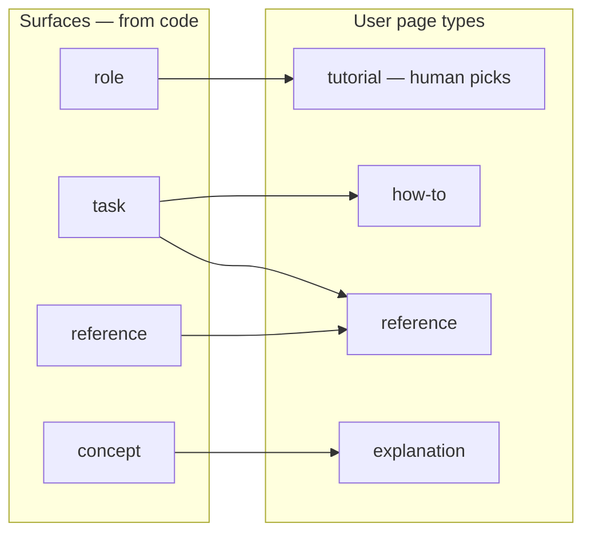
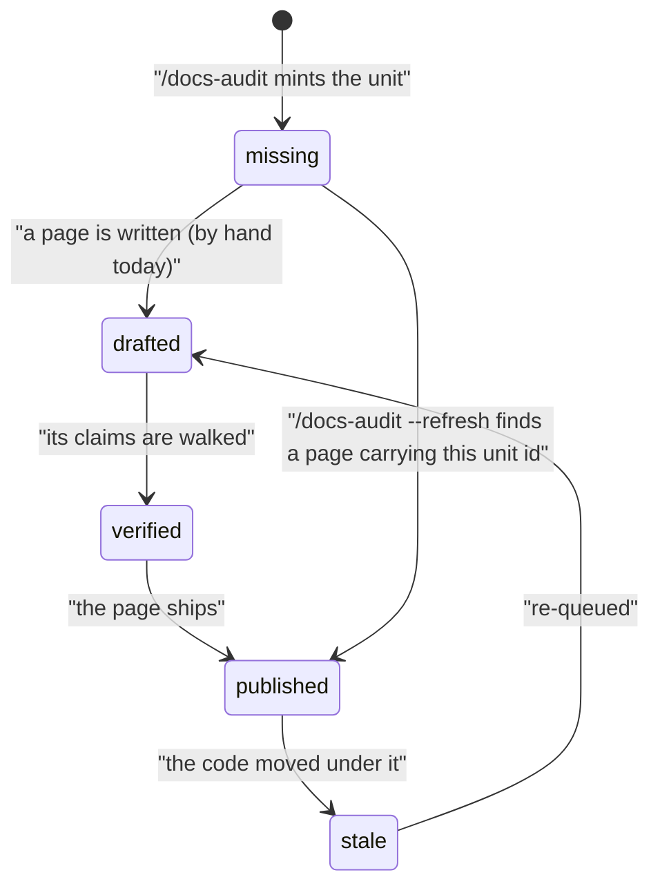
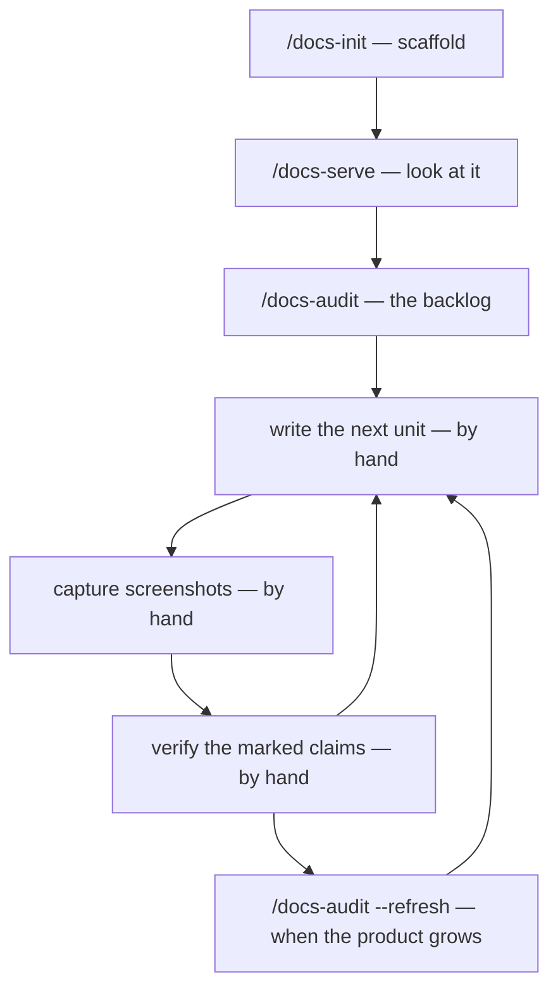

# Documentation-workflow family — Increment 2 (the audit) Implementation Plan

> **For agentic workers:** REQUIRED SUB-SKILL: Use superpowers:subagent-driven-development (recommended) or superpowers:executing-plans to implement this plan task-by-task. Steps use checkbox (`- [ ]`) syntax for tracking.

**Goal:** Ship `/docs-audit` in `docs-workflows`, so a scaffolded documentation repository gains a coverage grid and a prioritised backlog derived from the product's own code — and ship the route page that tells a person what to do with that backlog, by hand, today.

**Architecture:** One new slash command and three new agents in `plugins/docs-workflows/`, backed by three new reference files under `plugins/docs-workflows/references/docs-audit/` carrying the frozen contracts (the coverage model, the backlog schema, the evidence and walkthrough contracts). The command orchestrates; the references hold what it writes. One existing contract gains a field — `docs-profile-schema.md`'s source-repo set — and `/docs-init` starts writing it. Four new `docs/` pages plus a route page that documents the whole procedure, automated steps and manual ones alike.

**Tech Stack:** Markdown command, agent and reference bodies (no executable code in this repo beyond `scripts/*.sh|py|mjs`). The *audited output* is a YAML backlog written into a documentation repository; it is authored as a schema inside a reference file, not executed here.

**Spec:** `docs/superpowers/specs/2026-08-29-docs-workflow-family-design.md` — §5, §8.1, §8.2, §8.3, §11, §14, §15.2. Read it with this plan; the plan argues from it.

**Predecessor:** `docs/superpowers/plans/2026-09-09-docs-family-increment-1-scaffold.md` — its `## Scope` section declares what increment 2 owns, and its `## Follow-ups` section leaves this increment one debt (check 9's `eleven`).

**Verification model:** This repository has **no unit tests**. Its test suite is the CI gates in `.github/workflows/validate-catalog.yml`. Every task below states which gate proves it, how to make that gate go **red first**, and the exact command to run. That is the TDD cycle here, and it is a real one: `check-docs.sh` fails on a command with no docs page, an agent missing from the inventory, a count sentence that drifted, a `choices:` array with the wrong arity, a core reference cited by path, or a command absent from `docs/workflow.md`'s mermaid diagram.

**Run the gates as one `&&` chain and read the chain's own exit code** — `.github/workflows/validate-catalog.yml`'s `run:` steps are the authoritative list, in order. A wrapper's exit status is 0 either way; read the printed value. Mermaid needs `npm ci --prefix scripts/mermaid --ignore-scripts --no-audit --no-fund` once per checkout.

---

## Scope: this is increment 2 of 2 for Spec 1

| Increment | Commands | Ends with | Plan |
|---|---|---|---|
| **1 — the scaffold** (shipped) | `/docs-init`, `/docs-brand`, `/docs-serve` | A docs repo that builds, serves, lints, and carries a profile | `2026-09-09-docs-family-increment-1-scaffold.md` |
| **2 — the audit** (this plan) | `/docs-audit` | A prioritised backlog, a coverage grid, and a written procedure for working through it | this file |

**What this increment owns:** `/docs-audit`; the agents `docs-auditor`, `ia-planner` and `docs-audit-reviewer`; the frozen contracts §5 (coverage model), §8.1 (backlog schema), §8.2 (evidence contract) and §8.3 (walkthrough spec); the profile's source-repo set field; four new `docs/` pages; the route page `docs/docs-workflow.md`; and check 9's `eleven`, which increment 1 deliberately left owing.

**What it does not own:** `/docs-write`, `/docs-capture`, `/docs-verify` (Spec 2) and `/docs-drift` with `drift-detector` (Spec 3). Everything in spec §12 is contract-only and stays that way. **Nothing shipped in increment 1 is removed or narrowed by this increment.**

---

## The route page, and why it ships here rather than with Spec 2

The increment-1 plan assigned `docs/docs-workflow.md` to this increment on the grounds that it "states the eight-command procedure of §14 and is meaningless while three commands exist". After this increment four of those eight exist, so the obvious reading is to defer it again.

**That reading was put to the operator and rejected, for a reason that is now this plan's:** a person who runs `/docs-audit` ends up holding a prioritised backlog with no stated way to act on it. Deferring the page optimises against writing a claim with an expiry date — this repository has retired eleven of those — and pays for it with a deliverable that dead-ends.

**Both constraints are satisfiable at once, and the resolution is the page's governing rule:**

> **Every step of the procedure is documented as what a person actually does today.** A step with a command names the command. A step without one — turning a backlog unit into a written page, capturing the screenshots a how-to needs, walking a claim to confirm it — is written out as the **manual** procedure, in enough detail to follow. A command that will later automate that step is named as a *future convenience*, never as an instruction, and never in a sentence that reads as though the reader could run it now.

This is strictly more useful than the deferred page would have been. `/docs-init` is one command and a prompt; *"you have forty backlog units — here is how one becomes a published page"* is the part that genuinely needs explaining, and it is the part no command will ever fully remove.

**Diagrams are part of the deliverable, not decoration.** Five mermaid diagrams are specified in the tasks below: the family procedure (route page), the backlog unit's status lifecycle (`docs-backlog.md`), the coverage grid's two axes (`docs-coverage-model.md`), `/docs-audit`'s own phase flow added to `docs/workflow.md`, and the plugin README's four-command flow. Each earns its place by showing something a paragraph states worse.

---

## Global Constraints

Copied verbatim from the spec, from `CLAUDE.md`, and from the increment-1 plan. Every task's requirements implicitly include this section.

**Packaging and reachability**

- The family ships from `plugins/docs-workflows/`. Do not place anything in `dev-workflows`.
- `docs-workflows` declares exactly `["workflows-core", "prose-style"]`. **Never dispatch a `dev-workflows` agent** — `code-review` and `review-fixer` are unreachable (D25). The review gate here is `docs-audit-reviewer`, this plugin's own.
- A `workflows-core` reference is cited `workflows-core:<name>` and loaded with `Skill(skill: "workflows-core:reference", args: "<name>")`, **never by path**. Every command and agent that cites one carries this preamble verbatim, as its first paragraph after the frontmatter:
  > **Core references.** A citation of the form `workflows-core:<name>` names a shared reference in the `workflows-core` plugin. Load it with `Skill(skill: "workflows-core:reference", args: "<name>")` — never by path: `${CLAUDE_PLUGIN_ROOT}` resolves to this plugin, which does not carry it.
- This plugin's **own** references are reached as `${CLAUDE_PLUGIN_ROOT}/references/<path>` and keep that form. Check 16 relation 5 fails a *core* reference cited by path and says nothing about an own-plugin one.
- **Do not repeat the retired claim** that slash-command bodies cannot expand `${CLAUDE_PLUGIN_ROOT}`. It was verified false in a live run (spec §20 row 3; `CLAUDE.md`).

**Authoring rules**

- Every `choices:` array is an `AskUserQuestion` call: **2–4 options, never an authored "Other"** (`workflows-core:escalation-rules` §0). Check 12 gates arity; its parser is bracket-matched and quote-aware. Where a candidate set is unbounded — a repository listing, a tutorial-candidate list — print the candidates as **prose** and keep the array fixed-arity over the *disposition*, resolving a typed answer against the list just printed (`workflows-core:epic-picker` *The cap*). This is the trap `/docs-audit` is most likely to fall into; see Task 6.
- Requirement IDs are the bracketed `[PREFIX#N]` form, never dash-separated (`check-id-grammar.sh`).
- **Every mermaid block must parse.** Quote any node or edge label containing `[ ] ( ) { } |` or `#` — `-->|"earns a how-to"|`, never bare. This family's sibling shipped five broken labels and a person found them on GitHub. Run `node scripts/mermaid/check-mermaid.mjs --root .` after every diagram edit.
- **No page under `docs/` may name the marketplace or the container repo** (check 10); `getting-started.md` is the single pinned exception.
- **No tracker name in any text file** without a `<!-- vendor-token-ok: <why> -->` marker (check 13).

**Counting**

- **Re-derive every count against the tree; never copy one from this plan or from the spec.** Both carried stale numbers before. The derivations: `ls plugins/docs-workflows/commands/*.md | wc -l`, the same over `agents/`, `find plugins/docs-workflows/references -type f | wc -l`, `find plugins/docs-workflows/docs -name '*.md' | wc -l`.
- **Measured at plan time, for orientation only — verify before using:** commands 6, agents 8, reference files 18, docs pages 15.
- `docs/reference/agents.md` writes its count as a **word**; `docs/reference/references.md` writes its as a **numeral**. That asymmetry decides which gate changes are needed — see Task 5.
- Every task that moves a count fixes its sentence in the same task, so the gates are green at every commit. That is what makes the task boundaries real rather than decorative.

**Behaviour**

- `/docs-audit` **writes no documentation content.** Its output is a backlog and a coverage grid (spec §16).
- A unit is **never silently deleted** on `--refresh`. One whose surface vanished is marked `blocked_by: [surface-removed]` and reported — a surface disappearing from a scan is as likely to be a scan failure as a real removal (spec §11 Phase 5).
- An unresolved scan theme is **named**, never flattened into a gap: a gap asserts absence, an unresolved theme asserts only that the scan could not tell (`workflows-core:model-routing/classification` §8.5).
- Findings are triaged by the **orchestrator** before anything is applied (`workflows-core:finding-triage`); there is no backlog fixer and the orchestrator applies survivors itself, exactly as `/docs-init` does with `docs-scaffold-reviewer` (D25).

---

## Two questions this plan settles that the spec left open

Both are named in the spec as unsettled, so they are settled here rather than discovered mid-task.

**1. Tutorial selection is a marked section of the backlog, not an interactive picker** (spec §18 question 1). `ia-planner` writes its proposed tutorial candidates into a `tutorial_candidates:` block in `docs-backlog.yml`, and the human picks by editing the file. Three reasons, in order of weight:

- **The harness cannot render the alternative.** `AskUserQuestion` caps at four options, and the candidate set is one journey per role — unbounded by construction. An interactive picker would need the overflow rule `workflows-core:epic-picker` *The cap* holds by review alone, for a set no static check can see. The backlog has no such cap.
- **The procedure already puts the operator in this file.** Spec §14 step 3 has them reading the top twenty units and correcting the `priority_reason` on each. Picking tutorials there adds no new interaction.
- **Hand-editing the backlog is already a sanctioned act**, not a workaround: spec §5.4 entry path 5 establishes it, and the file is tracked and reviewed in a pull request.

**2. `/docs-init` writes the source-repo set, not only `/docs-audit`.** The spec says only that "persisting it is increment 2's job" and that `/docs-audit` records it "where absent", which leaves open whether `/docs-init` also writes it. It does, for three reasons: `/docs-init` Phase 2 step 1 already confirms the set with the operator, so the data is in hand and re-asking is a second prompt for one answer; a profile written by this release then carries the field from day one, making `/docs-audit`'s prompt the exception rather than the rule, which is what §11 Phase 0's "where absent" implies; and `/docs-init` Phase 2's current paragraph saying *nothing* persists it is an expiry-date claim this increment must rewrite anyway (Task 8's sweep). `/docs-audit` still prompts and records where the field is absent — a repository profiled by `/docs-profile`, or scaffolded before this release.

---

## File Structure

**New — `plugins/docs-workflows/references/docs-audit/`** (3 files; the bulky, stable contracts the command and agents execute)

| File | Holds | Spec |
|---|---|---|
| `coverage-model.md` | Surface kinds and how each is derived; the Diátaxis crossing; the four prioritisation signals and the churn guard; the five entry paths; the definition of done | §5 |
| `backlog-format.md` | `.dev-workflows/docs-backlog.yml` in full — `sources[]`, `surfaces[]`, `units[]`, `tutorial_candidates[]`, `coverage`, `threshold`; the unit status lifecycle; why surfaces and units are separate tables | §8.1 |
| `evidence-contract.md` | The evidence interface and its three kinds (`code`, `walkthrough`, `artifact`); the marked-claim rule; the walkthrough spec and its v1 checklist execution | §8.2, §8.3 |

**New — `plugins/docs-workflows/agents/`** (3 files)

| File | Does |
|---|---|
| `docs-auditor.md` | Enumerates `surfaces[]` from the scanned repos, with `volatility` from `git log` density |
| `ia-planner.md` | Crosses surfaces with the types each earns, applies the four prioritisation signals, proposes tutorial candidates |
| `docs-audit-reviewer.md` | Opus review gate over the written backlog — four dimensions (spec §11 Phase 5.5) |

**New — `plugins/docs-workflows/commands/docs-audit.md`** — the orchestrator, Phases 0–6 per spec §11.

**New — `plugins/docs-workflows/references/handoff/`** — `docs-auditor.md`, `ia-planner.md` (the two agents with a structured return the command parses; the reviewer's return shape lives in its own body, as `docs-scaffold-reviewer`'s does).

**New — `plugins/docs-workflows/docs/`** (5 pages)

| Page | Covers |
|---|---|
| `commands/docs-audit.md` | Synopsis, when to use it, prerequisites, phases, gates, outputs, failure modes |
| `reference/docs-coverage-model.md` | §5, with the coverage-grid diagram |
| `reference/docs-backlog.md` | §8.1, with the unit status-lifecycle diagram |
| `reference/docs-evidence.md` | §8.2 and §8.3 |
| `docs-workflow.md` | **The route page** — the ordered procedure, manual steps written out, with the family diagram |

**Modified**

| File | Change |
|---|---|
| `references/docs-profiles/docs-profile-schema.md` | Gains the source-repo set field and its rules |
| `commands/docs-init.md` | Phase 2 writes the field; Phase 6 records it; three expiry-date claims rewritten |
| `references/docs-workflow/scaffold-tree.md` | Two expiry-date claims rewritten (the Vale domain seed) |
| `references/docs-workflow/repo-resolution.md` | One expiry-date claim rewritten (`/docs-audit` now consumes `resolve-docs-repo`) |
| `references/docs-profiles/frontmatter-guidelines.md` | Three expiry-date claims rewritten (`type`, `unit` now have a writer) |
| `agents/docs-scaffold-reviewer.md` | One expiry-date claim rewritten (the `accept.txt` domain seed) |
| `docs/README.md`, `docs/workflow.md`, `README.md` | Index membership (check 15), the "I want to…" rows, the diagram |
| `docs/reference/agents.md`, `docs/reference/references.md` | Inventories and counts |
| `scripts/check-docs.sh` | Check 9's agent alternation gains `eleven`, plus a fixture-growing selftest case |
| `plugins/workflows-core/references/cost-emission.md` | §7 row for `/docs-audit` (check 8 fails in both directions) |
| `CLAUDE.md`, `CHANGELOG.md`s, `plugin.json`, `marketplace.json` | Release |

---

## Task 1: The coverage model

**Files:**
- Create: `plugins/docs-workflows/references/docs-audit/coverage-model.md`
- Create: `plugins/docs-workflows/docs/reference/docs-coverage-model.md`
- Modify: `plugins/docs-workflows/docs/reference/references.md` (inventory row + count)
- Modify: `plugins/docs-workflows/docs/README.md` (Reference section link — check 3 needs the new page reachable)

**Interfaces:**
- Produces: the surface-kind vocabulary (`role|task|concept|reference|service|decision|release`), the audience/type vocabulary (`user`: `tutorial|how-to|reference|explanation`; `engineering`: `architecture|decision|runbook|api-reference`), and the four prioritisation signal names. Tasks 2, 4, 5 and 6 all consume these; **nothing re-states them**.
- Consumes: nothing. This is the first file of the increment and the vocabulary root.

**Gate that proves it:** check 4 (reference-file inventory, both directions), check 9 (`references.md`'s count sentence), check 3 (no page unreachable from `docs/README.md`), check 1 (links and anchors resolve), and the mermaid gate.

**Red first:** create the reference file alone and run `./scripts/check-docs.sh --root .` — it fails check 4 with the new file unlisted, and check 9 on the count. That failure is the proof the gate covers this file.

- [ ] **Step 1: Write `references/docs-audit/coverage-model.md`**

Sections, in order, each derived from spec §5 rather than paraphrased loosely:

1. **`## 1. Why a denominator`** — `/docs-audit` cannot list what is missing without one, and it builds it from code. Two sentences.
2. **`## 2. Surfaces`** — the seven kinds as a table (`kind | derived from | feeds`), verbatim in substance from spec §5.1. Plus the sentence that roles are a coverage **dimension**, not a nice-to-have, and why walkthroughs are role-scoped.
3. **`## 3. Page types`** — the Diátaxis rule stated at exactly one level: it is the page `type` and nothing else. **Both halves, because they are one rule and a reader who takes only the first mis-builds the nav:** the quadrant discipline governs what a page *is*; the reader sees a product-shaped portal. It is **not** the navigation (D15), **not** the folder tree, and **not** a per-surface quota. Then the grid: coverage is `(surface, audience, type)` cells, each `exists | missing | stale`.
4. **`## 4. Tutorials do not automate`** — three of the four user quadrants are derivable from code and the fourth is not. The audit *proposes* candidates; a human picks. State it plainly rather than pretending otherwise, and cite this plan's settled question 1 for *how* the human picks (the marked backlog section).
5. **`## 5. Prioritisation`** — the four signals with their weights: blocks the primary journey (highest), role breadth, evidence availability, volatility **inverted**. Then the guard (D7) in full: volatility only ever *ranks* and can never *exclude*; a high-volatility surface scoring high on signal 1 is written, with its `type` biased away from step-by-step toward `explanation` and `reference`, recorded as `churn_adapted: true` with the reason, so the choice is visible rather than silent.
6. **`## 6. How a unit enters the backlog`** — one unit is one page; a surface is a thing in the product. Units are created by crossing a surface with the types it **actually earns** — not a mechanical cross-product. The worked example: `order-placement`, a `task` surface, earns a `how-to` and probably a `reference`; it does **not** earn an `architecture` page. Then the five entry paths as a table, with the first three marked automatic. Then path 5's consequence in full: a hand-written unit either attaches to an existing surface (drift covers it) or declares `surface: null` with hand-given `evidence`, in which case drift cannot tell when it goes stale and it relies on `review_by` alone — an acceptable trade, and the audit reports the count of `surface: null` units so it never grows unnoticed.
   **One cell of §5.4's table is over check 6's cap.** Row 5 (*A human editing `docs-backlog.yml`*) is **231 characters** in the spec; check 6 fails any cell over **200** in `docs/`, the plugin README and the repo README. Re-cut it when the table lands on the docs page — measure before writing, as the increment-1 release had to after hitting exactly this on `agents.md`. It is the only over-cap cell in the sections this increment copies from; the rest were measured and pass.

7. **`## 7. Definition of done`** — the blockquote: *Done = every backlog unit at or above a chosen priority threshold has a published page, and every claim on those pages is either evidence-backed or visibly marked.* Then: `coverage` reports the fraction per `(audience, type)` cell; "we wrote a lot of docs" is not a completion criterion.
8. **`## 8. Hard rules`** — NEVER re-derive the surface kinds or the type vocabulary in a command or agent body; cite this file. NEVER let volatility exclude a surface. NEVER cross-product a surface with all four quadrants. NEVER report coverage green over units nothing verified.

Carry the **Core references** preamble as the first paragraph after the title (check 16 relation 3, since §5's prose cites `workflows-core:model-routing/classification` §8 for the scan fan-out).

- [ ] **Step 2: Write `docs/reference/docs-coverage-model.md`**

The human-facing page. Same substance, shaped as documentation rather than as an instruction: what a surface is, what a unit is, how the two differ and why the backlog keeps them in separate tables, what the four signals mean for what gets written first, and what "done" means here.

Carries **the coverage-grid diagram**. Quote every label containing a bracket:

````

````

Keep it to the user axis — the engineering axis is a second, smaller diagram or a table; a diagram showing all seven surfaces against all eight types is a mesh nobody reads.

- [ ] **Step 3: Update the inventory and the counts — plural, and one of them is a trap**

Add the row to `docs/reference/references.md` and move its count sentence. **Re-derive it** — `find plugins/docs-workflows/references -type f | wc -l` — and write what you counted. That file writes its total as a **numeral**, so no gate widening is needed for it.

**`references.md` also carries a per-subtree count that check 4 greps and matches exactly, in both directions** (`` `<dir>/` \(([0-9]+)\) `` against `find references/<dir> -name '*.md' | wc -l`). Today it reads `` `docs-workflow/` (4) ``, `` `docs-profiles/` (5) `` and `` `handoff/` (2) ``. This task creates a **new** subtree, `docs-audit/`, so it needs a **new line of its own** — it does not join `docs-workflow/`. Task 4 moves `handoff/` from `(2)` to `(4)`.

**And `references.md:3` is an arithmetic paragraph, not a count** — it reads "five named individually, plus 5 + 2 + 4 = 11 markdown pages across the three subtrees — 5 + 11 = 16 accounted for, against 18 files on disk", plus "the four in `docs-workflow/`". **Every term in it moves, and check 9 gates only the first matching sentence per file** (it takes `head -1` of its grep), so the rest goes stale silently. Re-do the arithmetic and write what you counted.

Add a Reference-section link in `docs/README.md` so check 3 can reach the new page.

- [ ] **Step 4: Run the gates**

```bash
./scripts/check-docs.sh --root . && node scripts/mermaid/check-mermaid.mjs --root .
```

Expected: both green. Read the printed values.

- [ ] **Step 5: Commit**

```bash
git add plugins/docs-workflows/references/docs-audit/coverage-model.md \
        plugins/docs-workflows/docs/reference/docs-coverage-model.md \
        plugins/docs-workflows/docs/reference/references.md \
        plugins/docs-workflows/docs/README.md
git commit -m "feat(docs-workflows): the coverage model — surfaces, page types, the four signals"
```

---

## Task 2: The backlog schema and the evidence contract

**Files:**
- Create: `plugins/docs-workflows/references/docs-audit/backlog-format.md`
- Create: `plugins/docs-workflows/references/docs-audit/evidence-contract.md`
- Create: `plugins/docs-workflows/docs/reference/docs-backlog.md`
- Create: `plugins/docs-workflows/docs/reference/docs-evidence.md`
- Modify: `plugins/docs-workflows/docs/reference/references.md`, `plugins/docs-workflows/docs/README.md`

**Interfaces:**
- Consumes: Task 1's surface-kind and type vocabularies. Cite `${CLAUDE_PLUGIN_ROOT}/references/docs-audit/coverage-model.md`; never restate them.
- Produces: the exact field names of `docs-backlog.yml`. Tasks 4, 5 and 6 write and read these; a field renamed here after those tasks land is a four-file change.

**Gate:** checks 1, 3, 4, 9, plus mermaid.

- [ ] **Step 1: Write `references/docs-audit/backlog-format.md`**

The schema in full, as a fenced YAML block, from spec §8.1 — `schema_version`, `generated_at`, `generated_by`, `sources[]`, `surfaces[]`, `units[]`, `coverage`, `threshold` — **plus the `tutorial_candidates[]` block this plan's settled question 1 adds**, which the spec's block does not carry:

```yaml
tutorial_candidates:                  # ia-planner proposes; a human picks by editing this block
  - role: customer
    journey: [order-placement, payment, order-tracking]   # surface ids, in order
    rationale: "shortest path through the three highest-priority customer tasks"
    picked: false                     # a human sets this true; /docs-audit --refresh then mints its unit
```

Then, section by section:

- **Why surfaces and units are separate tables** — one surface spawns several units across quadrants, and drift is detected per surface then fans out to its units. A flat list would either duplicate the evidence per unit or lose the fan-out. `sources[].ref` is what makes drift computable at all, and it is the same idea as `prep.scanned_ref` in `workflows-core:read-only-repos`.
- **The unit status lifecycle** — `missing | drafted | verified | published | stale`, with who moves each transition and which of them exist today. **State plainly that only `missing` and `published` have a writer in this increment** (`/docs-audit` mints `missing`; `--refresh` marks `published` where a page carries the unit id): `drafted` and `verified` are written by Spec 2's commands and `stale` by Spec 3's, and until those ship a human moves a unit by editing the file. Write this as the shipped truth, not as a promise.
- **`blocked_by`** — an open list. `[surface-removed]` is the one value this increment writes, on `--refresh`, and a unit is **never silently deleted**.
- **`coverage` counts `published` units, and that definition is already load-bearing.** Per `(audience, type)` cell, the fraction is *that cell's units which have reached `published`* over its total — **not** units whose page merely exists. Task 1's `coverage-model.md` §7 now says so, because the hard rule forbidding coverage from reporting green over unverified work cites §7 for exactly this and would otherwise over-claim it. Define it identically here; two files disagreeing about what a coverage fraction counts is how a grid reports done over prose nobody checked. *(This is also why `drafted → published` is not a legal transition in the lifecycle above: that missing edge is the mechanism, and the coverage definition is what makes it visible.)*
- **Where the file lives, stated rather than left to the reader.** The spec writes `.dev-workflows/docs-backlog.yml` with no root named, which has two readings that differ for a `site/`-in-a-monorepo layout: the resolved docs directory, or its git work-tree top level. **It is the git top level**, matching the one home `docs-profile-schema.md` pins for the profile and for `docs-serve.state.json`. One repository has one backlog, however many content roots it publishes. *(Checked: the scaffold gitignores only `/.dev-workflows/docs-serve.state.json`, deliberately not the directory, "because that directory also holds `docs-profile.yml`, which is committed" — so a **tracked** backlog there is what the design assumes.)*
- **`visibility` and `page_path` are not independent, and the spec's schema implies they are.** Spec §8.6 calls `visibility` the key "the two-build split reads"; **the shipped split does not read it — it decides by path**, a page being internal because it sits under `docs/internal/` (`references/docs-workflow/visibility.md` §1, and `frontmatter-guidelines.md` says so outright). So a unit carrying `visibility: internal` whose `page_path` falls outside `docs/internal/` **ships publicly**, and nothing in the build objects. State the invariant here — `visibility: internal` ⇒ `page_path` under the internal tree — and make it `docs-audit-reviewer` dimension 2's business (Task 5), since it is a relationship between two fields that no single-field check can see.
- **Hard rules** — NEVER delete a unit; NEVER write a `coverage` figure not derived from the `units[]` table in the same run; NEVER mint a unit id that collides with one already in the file; NEVER write `page_path` for a page that does not exist; NEVER write a `page_path` that contradicts the unit's `visibility`.

- [ ] **Step 2: Write `references/docs-audit/evidence-contract.md`**

From spec §8.2 and §8.3:

- **The interface, with two implementations** — the four-row table (`Template`, `Evidence source`, `A claim is resolved by`, `Drift signal`) crossed with `audience: user` and `audience: engineering`.
- **The third kind, `artifact`** — a claim whose source is neither code nor observation but a committed document (a `/release-notes` draft under `$SPECS_PATH`, an ARD, a design doc). It records the path **and the commit it was read at**, so drift can tell a re-worded draft from an unchanged one.
- **The hard rule** — a marked claim never becomes prose fact by default. It is either confirmed by a verification pass or it ships visibly marked. This is what prevents the backlog reporting green on prose nobody checked. Marked claims reuse the `[NEEDS CLARIFICATION]` vocabulary `/idea` already establishes; individual sentences are **not** tracked.
- **The walkthrough spec** — the YAML block from §8.3 in full (`walkthrough` header, `preconditions`, `steps[]` with `n`/`action`/`target`/`expect`, `captures[]` with `slot`/`after_step`/`shows`). The action vocabulary is closed: `navigate|click|type|select|wait`.
- **v1 execution** — rendered as a numbered checklist; per step a human answers `confirmed` / `differs` / `blocked`, and **`differs` records the actual observed text**, which turns a walkthrough into a correction rather than a red X. Results are written back as `result:` on each step. **v2 is a driver executing the identical file — no format change.** Say that the v1 checklist is what ships and what a person does by hand today, since `/docs-verify` is Spec 2's.

- [ ] **Step 3: Write `docs/reference/docs-backlog.md`**

The human-facing page: what the file is, where it lives (`.dev-workflows/docs-backlog.yml` in the docs repo), that it is **tracked and reviewed in a pull request**, that hand-editing it is normal and sanctioned, and what each block means. Carries **the status-lifecycle diagram**:

````

````

Below it, say in prose which transitions have a command behind them today and which a person makes by editing the file. A diagram that implies five automated transitions where two exist is the expiry-date claim in picture form.

- [ ] **Step 4: Write `docs/reference/docs-evidence.md`**

The human-facing page for the evidence contract and the walkthrough: what counts as evidence for a user page versus an engineering one, what a marked claim looks like on the page, and how to walk a checklist by hand — including that `differs` is recorded with the observed text.

- [ ] **Step 5: Inventory, counts, links, gates, commit**

Two rows in `docs/reference/references.md`, count re-derived; two links in `docs/README.md`. Then:

```bash
./scripts/check-docs.sh --root . && node scripts/mermaid/check-mermaid.mjs --root .
git add plugins/docs-workflows/references/docs-audit/ plugins/docs-workflows/docs/
git commit -m "feat(docs-workflows): the backlog schema, the evidence contract, the walkthrough spec"
```

---

## Task 3: The profile records the source-repo set

**Files:**
- Modify: `plugins/docs-workflows/references/docs-profiles/docs-profile-schema.md`
- Modify: `plugins/docs-workflows/commands/docs-init.md` (Phase 2 step 1, Phase 6, Phase 8.5 report line)
- Modify: `plugins/docs-workflows/references/docs-profiles/docs-profile.default.yml` if it carries a worked example this field belongs in

**Interfaces:**
- Produces: `source_repos[]` — the field `/docs-audit` Phase 0 reads as its coverage denominator.
- Consumes: nothing new.

**Gate:** check 9 (`docs-profile-schema.md` is a reference file, already counted — no count moves here), check 1, and `./scripts/check-docs.sh --root .` generally. **This task moves no inventory**, which is why it is small and separate: it is a contract change, and a contract change that rides along with an agent is a contract change nobody reviewed.

- [ ] **Step 1: Add the field to the schema**

In the worked-example YAML block, after `repo:`:

```yaml
source_repos:                         # the code repositories this portal documents — /docs-audit's coverage denominator
  - { name: example-api,    path: /workspace/example-api,    origin: "git@github.com:acme/example-api.git" }
  - { name: example-webapp, path: /workspace/example-webapp, origin: "git@github.com:acme/example-webapp.git" }
```

Then the field rule, in `## Field rules`, saying all of:

- **Optional.** A profile without it is valid; `/docs-audit` then confirms the set with the operator and records it.
- **`path` is absolute and may not resolve on another machine.** It is a hint, not an identity: a consumer that cannot find `path` re-resolves by `origin` slug under `${REPOS_PATH:-/workspace}`, the way every other consumer in this family matches a clone, and asks only when that fails too. **This is the field's one real hazard** — a profile is committed and travels to machines whose workspace is laid out differently, so a consumer that trusted `path` alone would break for the second person who cloned the repo.
- **`origin` is optional** (a clone with no remote has none), and a repository with neither a resolvable `path` nor an `origin` is reported, never silently dropped from the denominator — a denominator that quietly shrinks makes coverage go *up*.
- **Nothing here is a write target.** Every consumer reads these repositories read-only (`workflows-core:read-only-repos`).

- [ ] **Step 2: `/docs-init` Phase 2 step 1 — persist what it already confirmed**

Rewrite the paragraph that currently reads *"**Nothing persists it.** No profile field records a source-repo set and Phase 6 writes none; persisting it is `/docs-audit`'s concern when that command ships…"*. It is an expiry-date claim and the capability has landed.

The replacement says: the confirmed set is used by this run **and recorded** in the profile Phase 6 writes, as `source_repos[]`, so `/docs-audit` reads a denominator rather than re-asking. The *"None for now"* answer records no field, and `/docs-audit` then asks — keep that option's text as it stands; it is still a real answer.

- [ ] **Step 3: `/docs-init` Phase 6 — write the field**

Add the `source_repos[]` bullet to Phase 6's list, between `repo.name` and `spaces[]`, naming the schema as the authority and stating that the set is Phase 2 step 1's confirmed one, with `origin` taken from `git -C <repo> remote get-url origin` where the clone has one and omitted where it does not. Where Phase 2 confirmed none, the key is **omitted** rather than written empty — an empty list asserts "documents nothing", which is a different claim from "nobody said yet".

- [ ] **Step 4: `/docs-init` Phase 8.5 — the report line**

The report's `Source repos:` line currently ends *"(used by this run only — no profile field records it)"*. Rewrite to state where it was recorded, or that it was not and why.

- [ ] **Step 5: Gates and commit**

```bash
./scripts/check-docs.sh --root .
git add plugins/docs-workflows/references/docs-profiles/ plugins/docs-workflows/commands/docs-init.md
git commit -m "feat(docs-workflows): the profile records the source-repo set /docs-audit needs as a denominator"
```

**Note for the sweep in Task 8:** three of `/docs-init`'s expiry-date claims are fixed here. Four more sites remain, in four other files. Task 8 counts the whole set; do not assume this task closed it.

---

## A third question this plan settles, which the spec did not see

**`code-scanner` confirms themes; it does not discover them — so the seed theme set is `/docs-audit`'s to derive.**

Spec §11 Phase 2 dispatches `code-scanner` per repo and Phase 3 has `docs-auditor` produce `surfaces[]` from what comes back. Read against the agent's actual contract (`workflows-core:references/handoff/code-scanner.md`), that hands off a question the spec never answers: **`code-scanner` takes `capability_themes[]` as an input and returns a `capability_map[]` classifying each supplied theme `present | partial | absent | error` with evidence paths.** It answers *"is this theme here, and where"*. It does not answer *"what is here"*. On a cold audit there is no PRD, no specification and no prior theme list — so nothing supplies the themes, and a literal implementation of Phase 2 dispatches a scanner with an empty input.

**The resolution, and it is a small one because §5.1 already contains the answer:** the seven **surface kinds** are the seed themes. §5.1's *derived from* column is written as exactly the phrase a scanner needs — "the authorisation model (roles, permissions, policy objects)", "routes, controller actions, UI flows, forms", "domain models, the ubiquitous language in the code, state machines", and so on. `/docs-audit` Phase 2 hands those seven as `capability_themes[]`; each scanner returns where in its repo each kind of thing lives; `docs-auditor` then **reads those evidence paths** and enumerates the individual surfaces within each kind.

Two properties make this the right shape rather than a workaround. The themes are **fixed and derived from a reference**, so no run invents its own and two runs over the same tree ask the same question. And a `classification: absent` is a real answer with a use: a product with no authorisation model earns no `role` surfaces, and the audit records that rather than reporting a gap it cannot fill.

**What this does not change:** the fan-out policy, the cap of 4, the `prep` block, the round-2 rule, and `EMPTY`/`PARTIAL`/`DIRTY_TREE` handling are all unchanged — this is what to put in the input field, not a new dispatch pattern.

---

## Task 4: `docs-auditor` and `ia-planner`

**Files:**
- Create: `plugins/docs-workflows/agents/docs-auditor.md`
- Create: `plugins/docs-workflows/agents/ia-planner.md`
- Create: `plugins/docs-workflows/references/handoff/docs-auditor.md`
- Create: `plugins/docs-workflows/references/handoff/ia-planner.md`
- Modify: `plugins/docs-workflows/docs/reference/agents.md` (two rows + count), `docs/reference/references.md` (two rows + count)

**Why these two are one task:** they are a pipeline — `ia-planner` consumes `docs-auditor`'s `surfaces[]` verbatim — so their two handoff contracts have to agree field for field. Split across two reviews, the second reviewer sees a consumer whose producer it cannot check.

**Interfaces:**
- Consumes: Task 1's surface-kind and type vocabularies (cited, never restated) and Task 2's backlog field names.
- Produces: `surfaces[]` and `units[]` + `tutorial_candidates[]`, in the shapes Task 2's `backlog-format.md` fixes. `/docs-audit` (Task 6) assembles them into the file; **neither agent writes the backlog** — one produces, one plans, the orchestrator writes.

**Gate:** check 4 (agent and reference inventories, both directions), check 9 (`agents.md`'s count — a **word**, and 8 → 10 stays inside the existing alternation; Task 5 is where it breaks), check 17 (**neither agent gets `Task` in its tool list**, so neither needs the NEVER-dispatch rule — and must not carry one, since check 17 asserts the reverse direction too), check 16 (the loader preamble on any file citing a core reference).

**Red first:** create `docs-auditor.md` alone, run `./scripts/check-docs.sh --root .`, watch check 4 fail on the unlisted agent and check 9 on the count.

- [ ] **Step 1: Write `agents/docs-auditor.md`**

Frontmatter: `name`, `description`, `model: sonnet` (enumeration against supplied evidence paths is mechanical; the judgement is `ia-planner`'s and the review is Opus), `tools: ["Read", "Glob", "Grep", "Bash"]`. **No `Task`.**

Body:
- The **Core references** preamble verbatim.
- **What it does:** takes the `capability_map[]` entries a batch of `code-scanner` runs returned, reads the evidence paths each names, and enumerates the individual surfaces within each kind — per `${CLAUDE_PLUGIN_ROOT}/references/docs-audit/coverage-model.md` §2, which is the authority on the seven kinds and is **not restated here**.
- **Inputs** (refuse without them): the `capability_map[]` per repo with its `prep` block; the repo paths; `${CLAUDE_PLUGIN_ROOT}/references/docs-audit/coverage-model.md`. **State the read-failure rule in this agent's own words**: an unreadable **evidence** input is a hard stop and is never regenerated by other means; an unreadable **context** input degrades to absent and the output records the degradation.

  **Do not cite `dev-workflows:context-management` for this, and this is not a style preference.** That file lives in `dev-workflows`; `docs-workflows` declares only `["workflows-core", "prose-style"]`, an agent crosses a plugin boundary for free but **a reference does not**, and the loader serves `workflows-core`'s corpus alone. A citation would send a reader to a file they cannot open — the same defect the spec's §13.1 already caught twice, in the entries for `accessibility.md` and for `code-review`/`review-fixer`, and missed a third time for this one. Restating the two tiers costs two sentences.
- **How it reads:** at `prep.scanned_ref`, never at the working tree — `git -C <repo> show <scanned_ref>:<path>` on a read-only mount (`workflows-core:read-only-repos`). A line number is meaningful only with the ref it was read at.
- **`volatility`:** `git log --since=<window> --format=%H -- <the surface's evidence paths> | wc -l`, bucketed `high|medium|low`. **State the window and the thresholds in the handoff file, once** — two agents disagreeing about what "high" means is how a signal stops meaning anything. On a read-only mount `git log` still works; where it fails, `volatility: unknown`, which the prioritiser treats as `medium` and says so.
- **Hard rules:** NEVER invent a surface with no evidence path behind it — a surface built on a path that does not exist is a hallucinated surface and `docs-audit-reviewer` dimension 1 exists to catch it. NEVER enumerate a surface from a theme whose `classification` is `absent`. NEVER assign page types — that is `ia-planner`'s. NEVER write any file.

- [ ] **Step 2: Write `references/handoff/docs-auditor.md`**

Input and output blocks. Output is `surfaces[]` exactly as `backlog-format.md` fixes it (`id`, `kind`, `title`, `roles[]`, `evidence[]`, `volatility`), plus a `status: OK | PARTIAL | NO_SURFACES` and an `unresolved[]` list carrying any theme the scan could not settle — **named, never flattened into a gap.** The volatility window and thresholds live here.

- [ ] **Step 3: Write `agents/ia-planner.md`**

Frontmatter: `model: opus` — this is the judgement step. Assigning a surface the types it earns, and ranking on four signals, is the reasoning whose output steers every later page; the spec classifies the whole command SIGNIFICANT for this reason. `tools: ["Read", "Glob", "Grep"]`. **No `Task`.**

Body:
- The preamble; then: takes `surfaces[]`, returns `units[]` and `tutorial_candidates[]`.
- **Type assignment** per `coverage-model.md` §3 and §6 — the types a surface **actually earns**, never a cross-product. Carry §6's worked example as the calibration.
- **Prioritisation** per §5's four signals, with a written `priority_reason` per unit **that contains the signals it claims** — `docs-audit-reviewer` dimension 3 checks exactly that, so a reason reading "important" is a finding by construction.
- **The churn guard** (D7): volatility ranks, never excludes; a high-volatility surface high on signal 1 is written with its `type` biased toward `explanation`/`reference`, recorded `churn_adapted: true` with the reason.
- **`visibility` defaults from `audience`** (D12) and is settable independently.
- **Tutorial candidates:** proposed into `tutorial_candidates[]` with `picked: false`. **Never asks a question** — this agent has no user. The human picks by editing the backlog (this plan's settled question 1).
- **Hard rules:** NEVER mint a unit whose `surface` is not in the supplied `surfaces[]`. NEVER mint two units for the same `(surface, audience, type)` cell — dimension 4 checks it. NEVER write a `priority_reason` that does not name the signals it rests on. NEVER write any file.

- [ ] **Step 4: Write `references/handoff/ia-planner.md`**

Input `surfaces[]`; output `units[]` + `tutorial_candidates[]` + `status`. Field names from `backlog-format.md`, cited not copied.

- [ ] **Step 5: Inventories, counts, gates, commit**

Two rows in `agents.md` and two in `references.md`, counts re-derived. **Keep every table cell under 200 characters** — check 6, and increment 1's release hit exactly this on `agents.md`.

```bash
./scripts/check-docs.sh --root .
git add plugins/docs-workflows/agents/ plugins/docs-workflows/references/handoff/ plugins/docs-workflows/docs/
git commit -m "feat(docs-workflows): docs-auditor enumerates surfaces, ia-planner types and ranks them"
```

---

## Task 5: `docs-audit-reviewer`, and check 9 learns `eleven`

**Files:**
- Create: `plugins/docs-workflows/agents/docs-audit-reviewer.md`
- Modify: `plugins/docs-workflows/docs/reference/agents.md` (row + count 10 → 11)
- Modify: `scripts/check-docs.sh` (check 9's agent alternation + a fixture-growing selftest case)

**This is the task the increment-1 plan left owing**, in as many words: *"`eleven` is not taught to check 9's agent alternation. Increment 2 needs it and owes the fixture-growing selftest case that proves the word converts."*

**Interfaces:**
- Consumes: the backlog `docs-audit` wrote, plus `surfaces[]`/`units[]` as written.
- Produces: findings only. **No fixer** — the orchestrator triages and applies survivors itself (D25, as `/docs-init` does).

**Gate:** check 9 — and this task's whole point is that it **fails before the script is changed**, which is the red-first proof.

- [ ] **Step 1: Red first — prove the gate is missing the word**

Land the agent file and write `eleven agents` into `agents.md`, then:

```bash
./scripts/check-docs.sh --root . ; echo "EXIT=$?"
```

Expect a check 9 failure on the agents count: the alternation at `scripts/check-docs.sh` (the `_one "agents"` line) runs `one|two|…|ten|twenty-one|thirty-four|ninety-eight|[0-9]+` and `eleven` matches none of them, so the claimed count reads as absent rather than as eleven. **Record the exact failure text before fixing it** — that text is the evidence this task's gate change was needed.

- [ ] **Step 2: Teach the word, in both places it must be known**

Add `eleven` to the `_one "agents"` alternation, and confirm `_word2num` maps it to 11. **Check whether the sibling alternations need it too** — a plugin crossing ten agents, reference files, commands, hooks, skills or environment variables meets the same wall. Widen only what this increment reaches, and say in the script's comment which alternations were left alone and why: **a widening is measured before it is taken** in this repository, and "while I am here" is not a measurement.

- [ ] **Step 3: The fixture-growing selftest case**

`--selftest` asserts the exit code *and which check fired*. A case that only proves `eleven` is **rejected** somewhere proves nothing about conversion. So the case must be a **passing** one: a fixture whose agents directory holds eleven agents and whose `agents.md` says `eleven agents`, asserting the gate stays **green**. That is the only shape that proves the word converts rather than merely being tolerated — the increment-1 plan named this requirement and it is not negotiable.

```bash
./scripts/check-docs.sh --selftest ; echo "EXIT=$?"
```

Expect `SELFTEST PASS` and one more `ok` line than before. **Read both numbers.**

- [ ] **Step 4: Write `agents/docs-audit-reviewer.md`**

Frontmatter: `model: opus` (D17 — every artefact-writing command in this family passes a high-tier gate, and the backlog steers every later page, so a wrong one is expensive and silent). `tools: ["Read", "Glob", "Grep", "Bash"]`. **No `Task`.**

Body, modelled on `docs-scaffold-reviewer.md`, which is the shape this family has already reviewed and shipped:

- Preamble; what it reviews and what it never reviews (it reads the backlog, never page prose — that is `doc-reviewer`'s, over a different diff).
- **Inputs, refused if absent:** the written backlog; the repo paths with their `scanned_ref`s; `coverage-model.md` and `backlog-format.md`. Refuse to review a backlog without the refs — dimension 1 checks paths *at a ref*, and checking them against the working tree is a different and weaker claim.
- **Why the checklist is fixed rather than the reviewer's judgement** — the same argument `docs-scaffold-reviewer` makes: most dimensions assert a relationship *between two artefacts*, which a reviewer reading one hunk at a time cannot see.
- **The four dimensions**, spec §11 Phase 5.5, each with the evidence it is given:
  1. **Every surface resolves** — each `evidence[].path` exists at the recorded ref. `git -C <repo> cat-file -e <ref>:<path>` is the check, and it is the one sanctioned `Bash` use. A surface on a path that does not exist is a hallucinated surface.
  2. **Types fit their surface, and `visibility` agrees with `page_path`** — a `role` surface does not become a tutorial; an `api-reference` unit has an actual endpoint behind it. **And a unit carrying `visibility: internal` has a `page_path` under the internal tree** (Task 2's invariant): the shipped two-build split decides by **path**, not by the frontmatter key, so a mismatch here ships an internal page publicly and no build objects. It is a relationship between two fields, which is why it belongs to a reviewer rather than to a per-field check.
  3. **Every `priority_reason` supports its `priority`** — the stated reason must *contain the signals it claims*. "Blocks the primary journey" is checkable against the roles and tasks enumerated; an unsupported reason is a finding.
  4. **No unit orphaned or duplicated** — every unit names a surface that exists, and no two units cover the same `(surface, audience, type)` cell.
- **Verdict:** `PASS` / `PASS WITH RECOMMENDATIONS` / `BLOCK`, on the severity schema `BLOCKER` / `MAJOR` / `MINOR` / `NIT`. A dimension not applicable is stated as `"N/A — reason"`, never omitted.
- **Output shape** — the exact markdown block, as `docs-scaffold-reviewer` gives one.
- **Hard rules:** NEVER modify a file. NEVER re-run the scan. NEVER return `PASS` with a `BLOCKER` standing. NEVER invent a fifth dimension — assign to the closest and say so. NEVER judge whether a *page* is good; this reviewer never opens one.

- [ ] **Step 5: Gates and commit**

```bash
./scripts/check-docs.sh --selftest && ./scripts/check-docs.sh --root .
git add plugins/docs-workflows/agents/docs-audit-reviewer.md plugins/docs-workflows/docs/reference/agents.md scripts/check-docs.sh scripts/fixtures/
git commit -m "feat(docs-workflows): docs-audit-reviewer, and check 9 learns eleven"
```

---

## Task 6: `/docs-audit`

**Files:**
- Create: `plugins/docs-workflows/commands/docs-audit.md`
- Create: `plugins/docs-workflows/docs/commands/docs-audit.md`
- Modify: `plugins/docs-workflows/docs/README.md`, `plugins/docs-workflows/README.md`, `plugins/docs-workflows/docs/workflow.md` (check 15 — all three listing surfaces, **and the mermaid diagram**, asserted separately from the page)
- Modify: `plugins/workflows-core/references/cost-emission.md` §7 (check 8 fails in both directions)

**Interfaces:**
- Consumes: everything Tasks 1–5 produced.
- Produces: `.dev-workflows/docs-backlog.yml` in the resolved docs repo.

**Gate:** checks 4, 9 (commands 6 → 7, a **word** — `seven` is already in the alternation), 12 (`choices:` arity), 15 (index membership + the diagram), 8 (the cost row), 16 (loader contract), plus mermaid.

- [ ] **Step 1: Frontmatter and signature**

`name: docs-audit`; a description that is a **stable capability blurb, never a changelog**; `allowed-tools: Read Write Edit Bash Glob Grep Task Skill`.

**Signature:** `/docs-audit [<docs-repo-path>] [--audience user|engineering|both] [--refresh] [--threshold <n>]`

- [ ] **Step 2: Phase 0 — Resolve**

Flags stripped first, before any positional token is read — **including `--audience` and `--threshold` together with the token after each**, or the value is read as the docs-repo path. Then `resolve-docs-repo` from `${CLAUDE_PLUGIN_ROOT}/references/docs-workflow/repo-resolution.md` §1 — **the signal-positive form** (D23; §4 of that file says why the two forms are opposite, and this command adopts §1, not §2). Report which rung answered.

Then `specs-preflight` (`workflows-core:specs-repo-git` §3), inline, as early as `$SPECS_PATH` is known.

Then the **source repos**: read `source_repos[]` from the profile (Task 3). Where the field is absent, confirm the set with the operator and **record it**, printing the candidates as **prose** with a fixed-arity array over the disposition — `${REPOS_PATH:-/workspace}` is unbounded, so an array sized to it is a tool call the harness rejects at five clones. Copy `/docs-init` Phase 2 step 1's shape exactly; it solved this already.

- [ ] **Step 3: Phase 1 — Model routing**

**SIGNIFICANT** — a cross-cutting synthesis of every scanned repository whose output steers every later page. A wrong backlog has a large blast radius. Record the `model_routing` block, with `review_model` pinned to the Opus chain regardless (D17/D20).

- [ ] **Step 4: Phase 2 — Scan**

The seven surface kinds as `capability_themes[]`, taken from `coverage-model.md` §2 (this plan's settled question 3 — **do not re-derive the phrasing here; the reference owns it**). `code-scanner` **refuses to run without `repo_path`, at least one `capability_themes` entry, and a `context`**, so the dispatch supplies a `context` too: three to five sentences saying this is a documentation coverage audit and that the scan is looking for where each kind of thing lives, not for a defect. Dispatch per repo in a **single response**, capped at 4 concurrent (`workflows-core:model-routing/classification` §8 — **cite that file by name, not a bare `§8.5`**, which also resolves to the spec's *own* §8.5 on profile additions).

Record each `prep.scanned_ref` into `sources[]`. Handle the status codes rather than assuming `OK`: `REPO_MISSING`, `REFRESH_BLOCKED` and `DIRTY_TREE` escalate per `workflows-core:escalation-rules`; `EMPTY` means this repo contributes no surfaces and is **reported**, not dropped silently; `PARTIAL` carries at least one theme in `error` and those themes go to the unresolved list.

One narrow **round 2** seeded with round 1's verified anchors for an inconclusive theme (`classification` §8.5, cap 4, no round 3). A theme still unresolved after round 2 is **named in the output**, never flattened into a gap.

**§8.5 is opt-in, and adopting it takes an edit in `workflows-core` as well as a sentence here.** That section carries an explicit *Opt-in* paragraph — "a shared procedure a caller adopts by saying so in its own body" — whose consumer list names `/idea` (Phase 2.6) and `/implement` (Phase 1.7) and nobody else. So an agent that loads §8.5 from this phase today finds a section stating it does not apply. Two edits close it: **this phase says outright that `/docs-audit` adopts §8.5**, and **§8.5's own consumer list gains `/docs-audit`**. The second is a `workflows-core` file, which no per-plugin sweep recipe would reach — it rides with Task 6's other three `workflows-core` edits at step 10b and with that plugin's version bump in Task 8. *(Found by Task 1's review, which traced the citation rather than checking that it resolved — a §-existence check passes here, because the section exists and says something true about somebody else.)*

- [ ] **Step 4b: Phase 2.5 — the `$SPECS_PATH` read, which §11 has no phase for**

**Two of the seven surface kinds do not come from a code repository at all**, and spec §11's phases dispatch only `code-scanner` (a code clone) and `docs-grounder` (`$DOCS_PATH`). §5.1 sources the `decision` surface from "ADRs and ARDs already present in the specs repo" and the `release` surface from "`/release-notes` drafts under `$SPECS_PATH`, grouped by release version" — and the shipped tree has **already committed this command to that read**: `references/docs-workflow/scaffold-tree.md` says `/docs-audit` "is to enumerate a `release` surface per major version from those drafts". Without this phase, either two kinds silently never appear or an executor invents a dispatch.

So: a **read-only** pass over `$SPECS_PATH`, enumerated rather than scanned — `release-notes.md` files and ARDs under the specifications tree, at the folder shapes `workflows-core:specs-repo-git` §2.1 fixes. Read-only is load-bearing: this command writes nothing into `$SPECS_PATH` but its own bookkeeping, through `commit-artifacts` alone. A `$SPECS_PATH` that resolves to nothing is a **skip with a stated reason**, not a failure — a product documented from a code repo with no specs tree still earns its other five kinds.

- [ ] **Step 4c: `docs-grounder` — ruled out, with the reason recorded**

Spec §11 Phase 2 says "optionally dispatch `docs-grounder` against `$DOCS_PATH`, advisory". **This plan rules that `/docs-audit` is not a docs-grounding consumer**, because `workflows-core:docs-grounding` has exactly two consumption modes and neither fits: **grill-rank** reorders challenges into a grill's gap list, and this command runs no grill; **writer-attach** attaches a digest to an artifact being authored as prose, and this command authors none — it writes a backlog. Existing documentation *is* read by this command, but through Phase 5's reconcile, which opens the docs repo directly and matches pages to units by their `unit:` key. That is not grounding.

**Record the reason in the command body**, as the other non-consumers do, so it is not re-litigated on the strength of the docs repo this command obviously opens. `workflows-core:docs-grounding`'s consumer list and `CLAUDE.md`'s "nine commands" sentence therefore **do not move** — which is the cheaper outcome and the honest one.

- [ ] **Step 5: Phases 3 and 4 — the two agents**

Dispatch `docs-auditor`, then `ia-planner` with what it returned. Neither writes a file.

- [ ] **Step 6: Phase 5 — Reconcile**

On `--refresh`: match existing pages to units by the page's `unit:` frontmatter key, mark them `published`, leave unmatched units `missing`, compute `coverage`. **A unit is never silently deleted** — one whose surface vanished is marked `blocked_by: [surface-removed]` and reported. Report the count of `surface: null` units, so the class §5.4 path 5 creates never grows unnoticed.

- [ ] **Step 7: Phase 5.5 — Review gate**

Dispatch `docs-audit-reviewer` at Opus with the four dimensions' evidence. **Triage before applying anything** (`workflows-core:finding-triage`): verify each finding at the location it names, dismiss with a reason that disposes of that finding's own claim, carry survivors only, report every dismissal. **No fixer** — the orchestrator applies survivors itself, bound by the patch gate, and surfaces a survivor it cannot safely patch. A BLOCKER neither fixed nor overridden stops the run. **No re-review cycle.** Copy `/docs-init` Phase 7.5's wording; it is the same disposition and the family should state it once per command in the same terms.

- [ ] **Step 8: Phase 6 — Write, report, emitter tail**

Write `.dev-workflows/docs-backlog.yml`. Print the coverage grid and the top N units with their reasons. Then the report, then the standard tail: `impl-maintenance` → feedback → follow-ups → cost → `commit-artifacts`, exactly as `/docs-init` Phases 9–11 do.

`emit-cost` takes a **fixed** `phase`/`role` pair, and **check 8 fails in both directions**, so `workflows-core:cost-emission` §7 gains its row in this same commit.

**The `### Next step` offer** names what a person does with the backlog — and points at the route page (Task 7). It carries **no `<merge-clause>`**: this run's deliverable is the docs repository, it runs neither `handoff-to-main` nor `require-on-main`, and no `$SPECS_PATH` gate reads what it wrote. State that, as `/docs-init` does.

- [ ] **Step 9: Write `docs/commands/docs-audit.md`**

The established page shape: synopsis, when to use it, prerequisites, phases, gates, outputs, failure modes. **Every claim derived from the command body** — the synopsis from the argument-parsing phase, the phases from its `## Phase` headings, the gates from its reviewer dispatch. The restructure that created this convention found six defects in a README that had been asserting them for releases.

- [ ] **Step 10: Index membership — all three surfaces plus the diagram**

`docs/README.md`, the plugin `README.md`, **and `docs/workflow.md`'s mermaid diagram**, which check 15 asserts separately from the page because prose below a diagram is where a command lands when someone adds it in a hurry.

- [ ] **Step 10b: The three registration surfaces outside this plugin**

Each of these fails a gate or leaves a shared authority wrong, and **none of them lives under `plugins/docs-workflows/`** — which is exactly why they get their own step rather than being folded into the one above.

1. **`plugins/workflows-core/scripts/command-namespaces.json`** — check 4's `check_namespace_map` asserts this file against the tree's per-plugin command inventory **in both directions**. Its `"docs-workflows"` array today holds exactly the six shipped commands; `"docs-audit"` joins it, in sorted position. **This is a `workflows-core` file, a plugin the increment-1 plan listed as "not touched"** — the assumption does not survive a new command, and missing it turns the build red at this task with an error that names a file nothing in this plan otherwise mentions.
2. **`plugins/workflows-core/references/cost-emission.md` §7** — the attribution row for `/docs-audit`'s fixed `phase`/`role` pair. Check 8 fails in **both** directions, so the row and the `emit-cost` call must land in the same commit. `/docs-init` and `/docs-brand` already have rows; copy their shape. `docs-workflows` is already in `COST_PLUGIN_RELS`, so no list moves.
3. **`plugins/workflows-core/references/finding-triage.md`** — its attachment table is a **closed enumeration of reviewer→fixer pairs**, and it has no `docs-audit-reviewer` row. Add one, and extend the no-fixer paragraph that today names `/docs-init`, standalone `/docs-brand`, `/prd-proposal` and `/brd-proposal`. **Those two groups differ on re-review** — the proposal commands fix inline, `/docs-init` has no re-review cycle at all — so state which this command follows rather than leaving a reader to infer it from the nearest neighbour. It follows `/docs-init`: no fixer, no re-review.

Re-derive the triage consumer set afterwards with the recipe `CLAUDE.md` names — `grep -l finding-triage plugins/*/commands/*.md plugins/*/agents/*.md` — and check the new row against what it returns.

- [ ] **Step 11: Gates and commit**

```bash
./scripts/check-docs.sh --root . && node scripts/mermaid/check-mermaid.mjs --root .
git add plugins/ 
git commit -m "feat(docs-workflows): /docs-audit — the coverage grid and the prioritised backlog"
```

---

## Task 7: The route page — the procedure a person actually follows

**Files:**
- Create: `plugins/docs-workflows/docs/docs-workflow.md`
- Modify: `plugins/docs-workflows/docs/README.md` ("I want to…" rows + a link to the route page)
- Modify: `plugins/docs-workflows/README.md` (the family diagram — four commands, not three)

**Interfaces:**
- Consumes: every command page and reference page this increment and increment 1 wrote. It links to them; it does not restate them.
- Produces: nothing other tasks read.

**Why this task is late in the plan and not early:** it links to four pages that do not exist until Tasks 1, 2 and 6 land, and check 1 resolves links. Written first, it fails the gate on every one of them.

**Gate:** check 1 (links and anchors resolve), check 3 (reachable from `docs/README.md`), check 10 (names no marketplace or container repo), and the mermaid gate.

**Precedent to copy, and the one thing not to copy from it:** `plugins/product-workflows/docs/brd-workflow.md` does exactly this job for the BRD route. Copy its shape. **Do not link to it** — it lives in another plugin, and a cross-plugin relative link resolves to nothing (check 1) while a full URL trips check 10's identity quarantine. It is a pattern, not a sibling.

- [ ] **Step 1: Write the opening and the standing rule**

Open with what the page is for: a family of commands with no stated order is a family nobody finishes. Then, immediately and in the reader's own interest, **the honesty rule as a visible statement rather than an implicit one**:

> Four of the steps below have a command. The rest you do by hand, and this page says how. Where a command is planned that will automate a manual step, it is named at the end of that step as *what will change later* — nothing on this page asks you to run something that is not installed.

A reader who meets a command name mid-procedure and cannot run it concludes their install is broken. One sentence up front prevents that for the whole page.

- [ ] **Step 2: Write the procedure — the three phases of §14**

**Once, to stand the portal up:**

1. `/docs-init` — confirm the code repos, approve the branding, review and merge the pull request. You have a site that builds, lints and serves, with an empty skeleton.
2. `/docs-serve` — open it. Seeing the empty portal is what makes the rest concrete.
3. `/docs-audit` — the first real decision point. Read the top twenty units and the `priority_reason` on each; correct the ones that are wrong, **because everything downstream obeys this file**. Pick the tutorial candidates by setting `picked: true` in `tutorial_candidates[]` (this plan's settled question 1).

**Then, repeatedly, until the coverage threshold is met — by hand today:**

4. **Write the next unit.** Take the highest-priority `status: missing` unit. Its `type` tells you the shape (a `how-to` is steps; an `explanation` is prose; a `reference` is a table), its `surface`'s `evidence[]` tells you which files to read, and `docs-evidence.md` tells you what may be asserted from them. Create the page under the section its surface belongs to, with the frontmatter `docs-frontmatter` specifies — **including `unit: <its id>`, which is the link in both directions** — mark any claim you could not ground with `[NEEDS CLARIFICATION]`, and set the unit's `status: drafted` and `page_path`. *(`/docs-write` will automate this step.)*
5. **Capture what a how-to or tutorial needs.** A sequence of screens is not derivable from routes, so this step exists whether or not a command runs it. Follow the unit's walkthrough if one is written; otherwise walk the flow yourself in a real environment, screenshot each step the page describes, and save each under `images.root` at one path per slot — a replacement overwrites, never lands beside the old file under a new name. Keep each under `images.max_bytes`; CI fails the build otherwise. *(`/docs-capture` will automate this step.)*
6. **Verify the marked claims.** For a user page, walk the steps in a real environment and answer each `confirmed` / `differs` / `blocked` — **and where it differs, write down what you actually saw**, which turns the walkthrough into a correction rather than a red X. For an engineering page, re-read the code at the recorded ref. A claim that survives becomes prose; one that does not stays marked. Then `status: verified`, and `published` when the page ships. *(`/docs-verify` will automate this step.)*

**Then, on a cadence:**

7. **Re-audit when the product gains a surface** — a new integration, a new role, a new release: `/docs-audit --refresh`, so the denominator grows with the product rather than freezing at day one.
8. **Watch for rot the code does not show.** `review_by` in a page's frontmatter is the calendar backstop: a page can go wrong with no code change at all — a renamed product, a changed process. Sort by it and re-read what has aged. *(`/docs-drift` will watch the evidence side of this; the calendar side stays a human judgement either way.)*

- [ ] **Step 3: Write the honest expectations paragraph**

From spec §14's closing: `reference` and `explanation` units ground almost entirely from code and need little human input; `how-to` units draft from code and **require** a capture; `tutorial` units need a human to choose the journey first, then a capture. So the realistic order — and the order the prioritiser produces on its own — front-loads reference and explanation, which is also where a reader with no documentation at all gets the most immediate value.

- [ ] **Step 4: The family diagram**

````

````

**The diagram must show the manual steps as manual.** A diagram of eight boxes that all look alike is the expiry-date claim in picture form — a reader counts eight commands. Labelling three of them *"by hand"* is what makes the picture agree with the page.

- [ ] **Step 5: `docs/README.md` rows and the plugin README diagram**

Add to the "I want to…" table: *work out what documentation is missing* → `/docs-audit`; *know what to do with the backlog it wrote* → the route page. Update the *"see how the six commands fit together"* row's count — re-derive it.

Update `plugins/docs-workflows/README.md`'s diagram from increment 1's three-command flow to four, and replace its "the audit and iteration stages arrive next" sentence: the audit has arrived, the iteration stage has not.

- [ ] **Step 6: Gates and commit**

```bash
./scripts/check-docs.sh --root . && node scripts/mermaid/check-mermaid.mjs --root .
git add plugins/docs-workflows/docs/ plugins/docs-workflows/README.md
git commit -m "docs(docs-workflows): the route page — the procedure, including the parts no command runs yet"
```

---

## Task 8: The expiry-date sweep, then release

**Files:** the sweep set below, plus `plugins/docs-workflows/CHANGELOG.md`, `plugins/docs-workflows/.claude-plugin/plugin.json`, `.claude-plugin/marketplace.json`, `CLAUDE.md`, and any sibling plugin whose changelog or docs name this family.

**The sweep is the first half and it is not optional.** `CLAUDE.md`: *a note saying a feature does not ship is a claim with an expiry date, and one left standing beside the now-shipped feature is its own defect.* This increment ships the feature thirteen sentences say is coming.

- [ ] **Step 1: Count the set before touching it**

```bash
grep -rn 'docs-audit' plugins/ --include=*.md | grep -v CHANGELOG | wc -l
grep -rln 'docs-audit' plugins/ --include=*.md | grep -v CHANGELOG
```

**Measured at plan time: 13 sites across 6 files** — `commands/docs-init.md` (4), `references/docs-profiles/frontmatter-guidelines.md` (3), `references/docs-workflow/scaffold-tree.md` (4), `agents/docs-scaffold-reviewer.md` (1), `references/docs-workflow/repo-resolution.md` (1). Re-derive; Task 3 already closed three of `docs-init.md`'s.

**Sweep by the claim's *subject*, not by the correction's wording** — the subject here is `/docs-audit` and the things it was said to be going to do (append the Vale domain vocabulary, read `type`, write `unit`, adopt `resolve-docs-repo`, classify SIGNIFICANT). A sibling stating the old claim shares the subject and not your new phrasing. Count the literal string again after the edits, **wrap-insensitively** — collapse whitespace in the file *and* in the pattern — and check the after-count against what you intended.

**A second subject, and it is not reachable from the first: the source-repo set.** Task 3 made the profile record it, which falsifies every sentence saying nothing does. That population shares no vocabulary with `/docs-audit`, so the grep above cannot see it. **Four sites found and deliberately left standing by Task 3, all under `plugins/docs-workflows/`** — re-derive rather than trusting the list: `docs/commands/docs-init.md`, `commands/docs-brand.md`, `docs/commands/docs-brand.md`, and `CHANGELOG.md`. The sharpest is the `docs/` page for the very command Task 3 changed, which is the surface an operator acts on.

**And one behavioural divergence Task 3 introduced, which is a defect rather than a stale sentence:** `/docs-brand` Phase 2's rung 2 stops being a pass-through the moment a `/docs-init`-written profile carries `source_repos[]`, while that command's own prose still describes the rung as inert. Behaviour and command body now disagree. Fix the body against what the rung actually does — not the reverse.

**Also owed here if Task 6 did not take it:** `docs-profile-schema.md`'s header consumer list reads "`/document`, `/docs-serve` and `/docs-brand` read it" and does not name `/docs-audit`. Task 3 correctly left it — naming a command that did not exist yet would have been a forward claim in a file governing what runs today — so confirm Task 6 added it and add it here if not.

- [ ] **Step 2: Rewrite each site against what shipped**

Each becomes a statement about a command that exists, read out of `/docs-audit`'s own phases rather than assumed. **A sentence that named the absence as its *reason* needs a new reason, not a deletion** — `scaffold-tree.md` §7's Vale seed is the case: its reason for seeding only the scaffold's own words was that no command extracted domain nouns yet. That reason is gone; the new one is that the scaffold must pass its own lint gate before any audit has run, which is still true and still bounds the seed.

**Then read each edited paragraph end to end.** A phrase hit disposes of the whole paragraph, not the sentence your term matched — one sweep on this repository landed in the right paragraph, read the sentence its own term matched, found it true, and left two falsified sentences beside it.

- [ ] **Step 3: Run the exclusivity probe as its own axis**

`only when`, `is the only`, `nothing else`, `and no other`, `only ever` — across `plugins/docs-workflows/`. This is where a falsified claim hides when it names none of the vocabulary the change introduced. It was missing through six task reviews on an earlier branch and two Important findings survived to the whole-branch review because of it.

- [ ] **Step 4: Versions and changelogs**

**Two plugins ship here, not one.** `docs-workflows` takes a **minor** bump (new command, new agents, new references — additive, nothing removed). **`workflows-core` takes a patch bump and its own changelog entry**, because Task 6 step 10b edits three of its files: `scripts/command-namespaces.json`, `references/cost-emission.md` and `references/finding-triage.md`. Shipping a changed plugin at an unchanged version is how a machine keeps serving the old content while the change looks like it did not land — `CLAUDE.md`'s update section names that exact symptom, and an installed `workflows-core` is what every other plugin here depends on. *(This was missed in the plan's first draft and found by the pre-flight conflict scan; the increment-1 plan's "workflows-core: not touched" assumption does not survive a new command.)*

Re-derive each current version from its own `plugin.json` rather than assuming it. Write each changelog entry against what shipped; **do not write a count into one that the tree will move** (`CHANGELOG.md` is excluded from the gates by filename, which exempts a *quotation* of a retired form and nothing else — a count goes stale in an entry exactly as it does in a command).

Keep `plugin.json` and `marketplace.json` descriptions in step and **under 1024 characters** — `validate-catalog.py` fails the build above it and warns above 900, and it rejects the **whole catalog**, so one over-long blurb breaks every plugin here. The new capability **replaces** wording; it never appends.

**Both blurbs currently carry an inventory count — "eighteen reference files" — and Task 1 already falsified it.** Do not simply bump the number. `CLAUDE.md` says a blurb is *a stable capability blurb, never a changelog*, and a reference-file count is neither a capability nor stable: it moves on every increment, nothing gates it (`validate-catalog.py` checks length, not truth), and it has now been wrong at some point in two consecutive releases. **Drop the count from both blurbs** and let the wording describe what the plugin does, which is what a person installing it is reading for. The per-plugin inventory sentences that *are* gated live under `docs/`, where check 9 keeps them honest. Freeing those characters also buys budget against the 1024 cap for the capability this increment adds.

*(Found at Task 1: the implementer flagged the blurbs as outside its four files, and a check confirmed both carry the stale figure. Recorded here so the next increment does not re-add a count to a blurb.)*

- [ ] **Step 3b: The prose counts check 9 *cannot* see**

**Check 9 takes `head -1` of its grep per file, so only the *first* matching sentence in a file is gated.** Every later one goes stale silently, and this increment falsifies at least seven of them. Measured at plan time — re-derive, do not trust the line numbers:

| File | What it says |
|---|---|
| `docs/reference/agents.md` | a *second* "the **eight** agents above…" further down (line 3 is the gated one) |
| `docs/README.md` | "ships **6** slash commands, **8** agents, **18** reference files and **2** hooks" — only its skills clause is gated, by a *different* assertion |
| `docs/README.md` | "the **six** commands" and "the **eight** agents", three more times |
| `README.md` (plugin) | "The **six** commands as one diagram" |
| `docs/getting-started.md` | "how the **six** commands fit together" |
| `docs/reference/session-cost.md` | "**Four** commands emit a cost entry" → five (this one *is* gated) |
| `docs/reference/references.md` | the arithmetic paragraph — Task 1 re-does it; check it again here |

Find them by **subject**, not by the wording of any one site: grep for the *numbers themselves* beside the nouns (`commands`, `agents`, `reference files`, `hooks`) across `plugins/docs-workflows/`, then read each hit. A green `check-docs.sh` proves the first sentence per file, and nothing more.

- [ ] **Step 5: `CLAUDE.md`, and the one shared authority outside it**

**Nothing gates any number in `CLAUDE.md`** — re-derive each against the tree and write what you counted, stating the command you ran. The sentences this increment falsifies, measured at plan time:

- The `docs-workflows` paragraph: "**six** slash commands" → seven, with `/docs-audit` in the list; "**eight** subagents (…)" → **eleven**, with `docs-auditor`, `docs-audit-reviewer` and `ia-planner` inserted **alphabetically** into the parenthetical; "**eighteen** reference files (**sixteen** markdown pages plus two data files)" → both move.
- The per-plugin docs-page sentence: "`docs-workflows` carries **15** — `README.md`, `getting-started.md` and `workflow.md`, **6** command pages and **6** reference pages" → 20, and the shape changes: the route page makes it **four** top-level pages, 7 command pages, 9 reference pages.
- The model-routing paragraph: "**Twenty-five** commands invoke the `workflows-core:model-routing` skill" → twenty-six, and "**five** of `docs-workflows`'s **six**" → six of seven (Phase 1 pins SIGNIFICANT).
- The workflow map: a `/docs-audit` line; `code-scanner`'s "used by" list gains it; `impl-maintenance (used by **24** of the **31** commands…)` → 25 of 32.
- The `specs-repo-git` bullet: "the **twenty-eight** commands that write into `$SPECS_PATH` — every one of the family's **thirty-one** except…" → 29 of 32, and "**fourteen** of the twenty-eight callers resolve or run inside an implementation repository" → fifteen of twenty-nine (this command scans code clones read-only, which is the criterion that already puts `/document`, `/docs-init` and `/docs-brand` in that half — **do not re-derive it from write access**, which gives a different answer and contradicts the stated criterion). Use the bullet's own recipe: ``grep -l 'commit-artifacts` entry point' plugins/*/commands/*.md``.
- The emitter-tail bullet: "All **twenty-eight** in-scope commands…".
- **Not the `docs-grounding` bullet** — Task 6 ruled this command out as a consumer, so its "nine commands" sentence and the reference's own list both stand. Check that ruling held before leaving them alone.

**Outside `CLAUDE.md`: `workflows-core:next-phase-offer`.** Its "Not pipeline nodes" paragraph enumerates exactly `/docs-init`, `/docs-brand` and `/docs-serve`; `/docs-audit` joins it. **Check 11 remains outside the `/docs-*` family** — re-tested on this tree, and the scope paragraph still names only the two `/product-workflows:` globs — so the merge clause here is carried by discipline, and this command's documented *absence* of one is the thing to write.

- [ ] **Step 6: The full gate chain, read by its printed value**

```bash
{ python3 scripts/validate-catalog.py --selftest && \
python3 scripts/validate-catalog.py && \
./scripts/check-id-grammar.sh --selftest && \
./scripts/check-id-grammar.sh --root . && \
./scripts/check-docs.sh --selftest && \
./scripts/check-docs.sh --root . && \
python3 "$(find plugins -type f -name session-cost.py)" --selftest && \
node scripts/mermaid/check-mermaid.mjs --selftest && \
node scripts/mermaid/check-mermaid.mjs --root . ; } > gates.log 2>&1
echo "GATES_EXIT=$?"
grep -c '^ok' gates.log; grep -c 'SELFTEST PASS' gates.log; grep 'PASS: all' gates.log
```

**The two Python gates run as `python3 <path>`, not `./<path>`** — neither `.py` carries the executable bit in this repository, so the `./` form exits **126** on the first line and never reaches a check. `.github/workflows/validate-catalog.yml` is the authority on every invocation here; an earlier draft of this plan copied the `./` form from the increment-1 plan and was corrected only by running it. Note also that `validate-catalog.py` takes **no `.` argument** in CI, and that `session-cost.py` is **discovered** rather than hardcoded, because the cost subsystem moves between plugins as the marketplace is split.

Read `GATES_EXIT`, the `ok` count, the `SELFTEST PASS` count and the mermaid `PASS:` line. **A pipe or a wrapper makes the invocation's own status 0 either way** — one round read a red build as green five times before catching it, and this plan's own first run of the chain reported `MERMAID_EXIT=0` off a `tail` while node had crashed.

**Baseline measured on this branch at the plan commit, for comparison rather than assertion:** `GATES_EXIT=0`, **198** `ok`, **5** `SELFTEST PASS`, `PASS: all 36 mermaid blocks in 580 tracked markdown files`. The mermaid block count rises to **41** as the five diagrams land (the plan's own examples are quadruple-fenced and are deliberately not parsed); the `ok` count rises by one with Task 5's fixture-growing case. Re-derive both endpoints rather than asserting these.

- [ ] **Step 7: Commit**

```bash
git add -A -- plugins/ CLAUDE.md .claude-plugin/
git commit -m "release(docs-workflows): the audit increment — /docs-audit, three agents, the frozen contracts"
```

---

## Self-review

Run against the spec with fresh eyes, per the writing-plans checklist, **after the freshness pass is folded in**.

**1. Spec coverage.** Every increment-2 section maps to a task:

| Spec | Task | Spec | Task |
|---|---|---|---|
| §5 coverage model | 1 | §11 Phase 3 `docs-auditor` | 4 |
| §8.1 backlog schema | 2 | §11 Phase 4 `ia-planner` | 4 |
| §8.2 evidence contract | 2 | §11 Phase 5.5 review gate | 5, 6 |
| §8.3 walkthrough spec | 2 | §11 Phases 0–2, 5, 6 | 6 |
| §8.5 `source_repos[]` | 3 | §14 the procedure | 7 |
| §8.6 `type`/`unit` now written | 3, 8 | §15.2 docs pages | 1, 2, 6, 7 |
| §18 q1 tutorial UX | settled above, built in 4 | §15.4 counts | every task, plus 8 |

Spec 2's (`/docs-write`, `/docs-capture`, `/docs-verify`) and Spec 3's (`/docs-drift`, `drift-detector`) are out of scope and stay contract-only.

**2. Placeholder scan.** No "TBD", no "add appropriate error handling", no "similar to Task N".

**3. Name consistency.** The agents are `docs-auditor`, `ia-planner`, `docs-audit-reviewer` throughout. The reference paths are `references/docs-audit/{coverage-model,backlog-format,evidence-contract}.md` throughout. The profile field is `source_repos[]` throughout. The backlog fields are spec §8.1's, plus `tutorial_candidates[]`.

**4. Count arithmetic, re-derived rather than carried.** Commands 6 → 7 (Task 6). Agents 8 → 10 (Task 4) → 11 (Task 5). Reference files 18 → 19 (Task 1) → 21 (Task 2) → +2 handoff files (Task 4). Docs pages 15 → 16 (Task 1) → 18 (Task 2) → 19 (Task 6) → 20 (Task 7). Cost-emitting commands +1 (Task 6). **Every one of these is an orientation figure measured at plan time; each task re-derives its own endpoints.**
