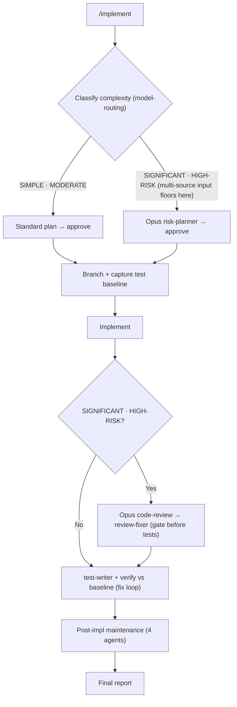

# Design — dev-workflows Documentation-Consistency Refresh (v2.30.0)

**Date:** 2026-07-13
**Effort:** AI-First line 82 (priority `[1]`) — "`/impl` graph … is it now outdated? … Any other documentation inconsistencies?"
**Target repo:** `/workspace/ihudak-claude-plugins`, plugin `dev-workflows`
**Version:** 2.29.0 → **2.30.0**
**No test framework** — structural verification only (grep, `python3 -c json.load`, `git diff`).

---

## 1. Goal

Make the dev-workflows **README**, the repo-root **CLAUDE.md**, and the **model-routing SKILL.md** accurately reflect the plugin as shipped, and replace the drift-prone per-phase `/implement` graph with a durable one.

Concretely, the docs must state the true, current facts:

- **20 commands / 30 agents** (README's Agents section currently says "Twenty-six")
- **9 Opus-pinned agents** (README says "six")
- **13 commands invoke the model-routing skill** (CLAUDE.md says 6; SKILL.md says 5)
- the full current **reference-doc catalog** (~18 files exist but are uncatalogued)
- every command and agent appears in the README's tables
- the CLAUDE.md relationships diagram covers the 6 VI-creation-flow commands

## 2. Background — how we got here

Line 82 named one suspected-stale artifact (the `/implement` graph) and asked "any other documentation inconsistencies?" A read-only audit of the whole plugin plus direct verification found the graph is indeed stale **and** that the README/CLAUDE.md/SKILL.md broadly lagged the ~15 commands/agents shipped since ~v2.14. Two decisions were made up front:

- **Scope = Full refresh** — fix all HIGH + MEDIUM + LOW findings, including wiring the 4 orphan handoff citations and extending the CLAUDE.md relationships diagram.
- **Graph = Coarse replace** — replace the per-phase `/implement` mirror with a small decision-shape graph that does not enumerate Phase-N boxes (so it cannot drift when a phase is inserted).

**Root-cause framing for the graph:** the `## /implement workflow` section was an ~80-line hand-maintained mermaid *mirror* of `commands/implement.md`. Because `implement.md` is the always-current source of truth for its own phases, any mirror drifts — and this one already had (missing **Phase 0.5** Readiness pre-flight from v2.24.0 and **Phase 1.8** Resolve applicable ARD from v2.18.0). Patching the two missing nodes would only reset the clock; a coarse graph that shows the *shape* but not the phase numbers removes the drift source.

## 3. Verified facts (pinned)

- `commands/*.md` = **20** (matches the spelled-out "Twenty" in manifests — correct, keep).
- `agents/*.md` = **30** (matches "Thirty" in plugin.json / marketplace.json / CLAUDE.md — correct, keep).
- Agents with `^model: opus` frontmatter = **9**: `code-review`, `risk-planner`, `doc-reviewer`, `epic-reviewer`, `spec-reviewer`, `design-reviewer` (the six the README names) **plus** `vi-reviewer`, `ard-reviewer`, `readiness-reviewer` (the three it omits).
- Commands that **invoke** the model-routing skill (`Skill tool, skill: "dev-workflows:model-routing"`) = **13**: `implement`, `document`, `epics`, `release-notes`, `vuln`, `upgrade`, `docs-profile`, `idea`, `create-vi`, `create-ard`, `specify`, `design`, `ready`. (`/feedback` merely lists `model-routing` as a feedback-category value — it does **not** invoke the skill.)
- The 4 orphan handoff files (`references/handoff/{code-scanner,diff-summarizer,impl-maintenance,jira-reader}.md`, 64–75 lines each, each with `## Input` + `## Output` + `## Status codes`) are cited **nowhere**, unlike the 6 wired sibling handoff files. Sibling citation pattern (verbatim shape): `Read \`${CLAUDE_PLUGIN_ROOT}/references/handoff/<name>.md\` for the exact input/output document format.`

## 4. Findings → dispositions

| # | Finding | Sev | Fix |
|---|---------|-----|-----|
| 1 | README:267 "Twenty-six reusable subagents" | HIGH | → **"Thirty"** |
| 2 | README Agents table missing 4 rows | HIGH | add `ard-reviewer`, `idea-reader`, `readiness-reviewer`, `vi-reviewer` |
| 3 | README:267,298 "six Opus … gates" | HIGH | → **"nine"**, add `vi-reviewer`, `ard-reviewer`, `readiness-reviewer` to the named list |
| 4 | model-routing consumer list stale in CLAUDE.md (6) + SKILL.md (5) | HIGH | → the full **13** in both |
| 5 | README Commands table has two `/document` rows | MED | merge into one row (direct + Jira mode inline) |
| 6 | README Commands table covers 12 / 20 | MED | add rows for the 8 missing commands |
| 7 | README Reference-docs catalog missing ~18 files | MED | add a bullet for every uncatalogued reference file |
| 8 | 4 orphan handoff files | MED | **wire** the sibling citation into the 4 agents (+ consistency guard, §6) |
| 9 | README:106 "eleven workflow commands" omits `/ready` | MED | → **"twelve"**, add `/ready` |
| 10 | CLAUDE.md relationships diagram + invariants omit the 6 VI-creation cmds | MED | extend (§7) |
| 11 | README:305 preload-context row lists `/docs-profile` under "Matches" | LOW | reword — the hook does **not** match `/docs-profile` |
| 12 | README:71 mermaid edge `ready … verifies spec+design` | LOW | relabel → "verifies ARD/spec/design" |
| — | `## /implement workflow` per-phase graph | — | **coarse replace** (§5) |

**Exact lists (pinned):**

- **#6 — 8 missing command rows:** `/ready`, `/feedback`, `/prompt`, `/prompt-brainstorm`, `/prompt-grill-me`, `/statusline`, `/api-guideline-reviewer`, `/guideline-reviewer`.
- **#7 — uncatalogued reference files** (authoritative gap = `find references` minus the current catalog; ~18): `ard-format.md`, `ard-resolution.md`, `context-management.md`, `dependencies.md`, `design-format.md`, `escalation-rules.md`, `grilling-technique.md`, `idea-format.md`, `jira-input-resolution.md`, `next-phase-offer.md`, `pre-lint.md`, `session-hygiene.md`, `specification-format.md`, `vi-format.md`, `workflow-states.md`, `dynatrace-docs/docs-profile-schema.md`, `dynatrace-docs/docs-profile.default.yml`, `dynatrace-docs/frontmatter-guidelines.md`. The plan re-derives this set by the same diff at implementation time; each new bullet is slotted under the catalog's existing grouping (top-level, `dynatrace-docs/`, etc.).

## 5. Coarse `/implement` graph (replaces lines ~171–254)

The `## /implement workflow` heading stays (so the existing `#implement-workflow` anchor keeps resolving). The prose note beneath it (`/document` / `/epics` never run tests …) and the `/vuln` + `/upgrade` "Additionally" table are **kept as-is**. Only the mermaid block is replaced:



This preserves the genuinely useful information (two-track routing, the multi-source SIGNIFICANT floor, branch-before-edits, baseline capture, the review-gate-before-tests on the high track, the test/fix loop, maintenance, report) without enumerating individual Phase-N nodes. It must parse under mermaid v11 (same validator the `## Workflow overview` graph passes).

## 6. #8 — wire, don't delete (with a consistency guard)

The 4 orphan handoff files are **not redundant**: they are the two-sided contract SSOT (`## Input` + `## Output` + `## Status codes`), the same role played by the 4 already-wired sibling handoff files; the agents' inline `## Output` overlaps only the output half. Deleting them would make the plugin *less* uniform.

Fix: add the sibling one-liner citation to each of the 4 agents (`agents/code-scanner.md`, `agents/diff-summarizer.md`, `agents/impl-maintenance.md`, `agents/jira-reader.md`), placed near the top like the wired siblings.

**Guard:** before wiring, confirm each handoff file's `## Output` does not *contradict* the agent's inline `## Output`. If they have drifted, reconcile (align the handoff file to the agent's current behavior) rather than pointing the agent at stale guidance. This is the one place the effort inspects behavior, not just prose.

## 7. #10 — extend the CLAUDE.md relationships diagram

Add 6 dispatch lines to the `## dev-workflows workflow relationships` code block (after the existing command lines, before the shared-agent tree), and add the 6 corresponding agents to the shared-agent tree. Exact arrows are verified per command file when the plan is written; the shape is:

```
/idea       → idea-reader → (embedded grilling) → idea.md
/create-vi  → (embedded grilling) → [vi-reviewer@Opus] → VI + relocate idea.md
/create-ard → [ls repos → code-scanner×N (confirmed set)] → (embedded grilling) → [ard-reviewer@Opus] → ARD
/specify    → jira-reader → (embedded grilling) → [spec-reviewer@Opus] → specification.md
/design     → (embedded grilling) → [design-reviewer@Opus] → design.md
/ready      → jira-reader + status read → verify ARD/spec/design → [readiness-reviewer@Opus] → verdict → impl-maintenance + emit-auto
```

Shared-agent-tree additions: `vi-reviewer`, `ard-reviewer`, `spec-reviewer`, `design-reviewer`, `readiness-reviewer` (all `@Opus`), and `idea-reader`.

**Invariants section:** add a concise block for the VI-creation flow (or a short scope note) — enough that the section is no longer silently partial, without duplicating each command's own full contract. Depth kept modest: one short bullet list covering the shared invariants (embedded grilling bounded ≤5; Opus reviewer gate per authoring command; VI/ARD/spec/design written to `$SPECS_PATH`; `/ready` is read-only and sets no status).

## 8. Version & no-regression

- **Bump 2.29.0 → 2.30.0** in `plugin.json` and `marketplace.json`, lock-step. Justified by editing the runtime-consumed `skills/model-routing/SKILL.md` (#4) and 4 agent files (#8). Add a `## [2.30.0] — 2026-07-13` CHANGELOG entry above [2.29.0] (em-dash U+2014, matching prior entries).
- **Count-strings unchanged.** "Twenty" (commands) and "Thirty" (agents) stay byte-identical everywhere they already appear — no files are added or removed, we are only *documenting existing* ones. The README's wrong "Twenty-six" is corrected *to* "Thirty" (it was never a valid count string).
- **Command bodies untouched.** No `commands/*.md` file is edited — every command-facing fix lives in README / CLAUDE.md / SKILL.md. Therefore `/vuln`, `/upgrade`, and all 20 command files stay **byte-identical** — assert via `git diff`.
- **Sibling plugins untouched** — `dt-style-guide` (0.2.2) and `obsidian-llm-wiki` (0.3.1) get a 0-line diff.
- **#8 is the only behavioral surface** — 4 agents gain one citation line each, pointing at a schema that describes output they already produce. Additive; reviewed for no behavior change beyond "read your own contract."

## 9. Out of scope

- Any command *behavior* change (this is a docs/accuracy refresh).
- The `## Workflow overview` role-graph and role table (v2.27.0 — already current; only the LOW #12 edge label is touched).
- Restructuring or rewriting reference docs (only cataloguing them in README + reconciling the 4 handoff `## Output` sections if drifted).
- Sibling plugins.
- Deleting the 4 handoff files (rejected in favor of wiring — §6).

## 10. Task decomposition (for writing-plans)

Independent, mostly file-scoped units:

1. **README — Agents section** (#1, #2, #3): count, 4 rows, "nine" + 3 names.
2. **README — Commands table** (#5, #6): merge `/document`, add 8 rows.
3. **README — Reference-docs catalog** (#7): add ~18 bullets (re-derived by diff).
4. **README — `/implement` graph** (§5): replace the mermaid block only.
5. **README — misc** (#9, #11, #12): "twelve"+`/ready`; preload-context wording; `/ready` edge label.
6. **CLAUDE.md** (#4a, #10): model-routing list → 13; extend relationships diagram + agent tree + invariants note.
7. **SKILL.md** (#4b): model-routing list → 13.
8. **Handoff citations** (#8): 4 agent files + consistency guard.
9. **Manifests + CHANGELOG** (§8): bump to 2.30.0, CHANGELOG entry, count-string check.

Tasks 1–5 all touch README.md (sequence to avoid edit conflicts; each is a distinct, independently reviewable region). Task 9 runs last.

## 11. Verification strategy

- **Counts:** `grep -c` / `ls | wc -l` confirm README says "Thirty" agents and "nine" Opus gates; commands table + agents table each list all 20 / 30 (or an explicit pointer for the utility commands).
- **model-routing:** the 13-command set appears in CLAUDE.md and SKILL.md; the set matches `grep -rl 'skill: "dev-workflows:model-routing"' commands/*.md`.
- **Reference catalog:** `find references` minus the README catalog = ∅ (every reference file is catalogued or intentionally grouped under a `*/` dir bullet).
- **Handoff wiring:** each of the 4 agents contains the citation line; `## Output` sections reconciled.
- **Graph:** the coarse mermaid parses (mermaid v11); the `#implement-workflow` anchor still resolves (heading kept); no Phase-N node remains in the block.
- **No-regression:** `git diff` shows 0 lines in all command bodies, both sibling plugins, and any untouched agent; manifests parse at 2.30.0 via `python3 -c json.load`; no `/impl:` or bare `/impl ` residue introduced.

## 12. Assumptions

- The `## /implement workflow` heading text and its trailing prose + `/vuln`/`/upgrade` table are retained (only the mermaid block changes), so the `#implement-workflow` anchor the AI-First task links to still resolves.
- Editing `skills/model-routing/SKILL.md` (runtime-consumed) + agent files justifies the version bump, consistent with the v2.27.0 precedent (edited a runtime-consumed reference → bumped) vs the Setup-README precedent (pure README → no bump).
- The 6 VI-creation dispatch chains in §7 are drafts; exact arrows are confirmed against each command file during writing-plans.
