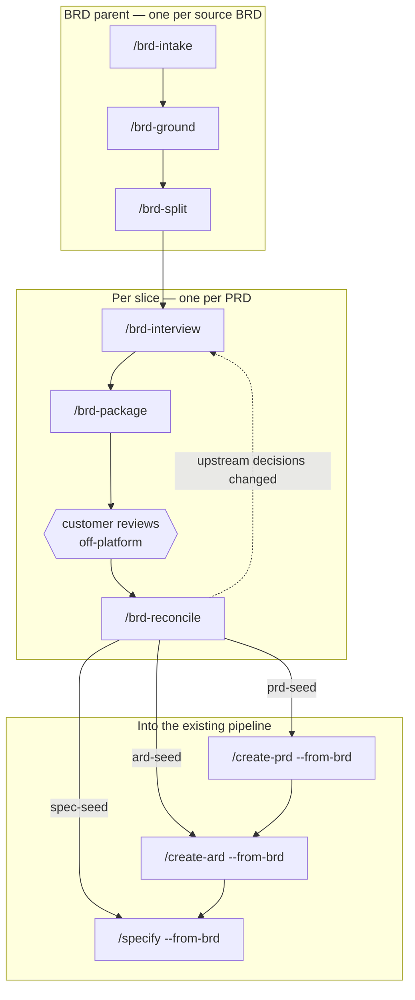

# Design: BRD → PRD workflow — grounding, decision discipline, and the customer review loop

**Date:** 2026-08-29
**Status:** Design approved in brainstorming; not implemented.
**Scope:** `plugins/dev-workflows` only

---

## 1. Problem

`dev-workflows` has one route into a PRD: `/idea → /create-prd`. It starts from an idea the PM
owns and can freely shape.

A large share of delivery work does not start there. It starts with a **BRD supplied by a
customer** — thirty-five pages, written by people who are not requirements engineers, containing
requirements that contradict each other, requirements that cannot be tested, requirements
premised on system behaviour that does not exist, and requirements that are really three
requirements wearing one number. The document cannot be implemented and cannot be safely
rejected: it is the customer's statement of what they are paying for.

Turning that into a PRD is not a writing task. Four distinct things have to happen, and the
order matters:

1. **The BRD's premises have to be checked against the code.** A BRD that says "the report shows
   who captured this measurement" is unimplementable if no write path in the system records an
   actor — and no amount of careful prose will reveal that.
2. **Design assets have to be reconciled against the text.** Exported frames routinely show
   fields the BRD never asked for, and omit fields it insists on.
3. **The decisions the document leaves open have to be sorted by who may answer them** — and
   most of them are not business decisions at all. The characteristic failure is a delivery team
   putting its own technical design choices to the customer as if they were business choices,
   which produces authoritative-looking answers to questions the customer was never equipped to
   decide.
4. **The customer has to review the result and their answers have to propagate** — including
   backwards into slices already packaged, and sideways into slices that depend on them.

None of this exists today. `code-scanner` is the nearest thing and it answers a different
question: *what capability exists for this theme?* rather than *is this specific claim true of
this specific commit?*

There is a second gap. A 35-page BRD is not one PRD. It is several, delivered in sequence, and
the ones delivered later depend on decisions made in the ones delivered first. Nothing in the
plugin represents "this PRD covers requirements 4, 7 and 12–19 of that BRD, and the rest remain
a live obligation".

This design adds a second route into the PRD, converging on the same `/create-prd` and the same
`prd-format.md` as the `/idea` route.

---

## 2. Scope and decomposition

Six new commands, three modified commands, six new agents, seven new references, a new
documentation page with its own diagram, six command pages, and four updated pages.

| Phase | Command | Ends with |
|---|---|---|
| Intake | `/brd-intake` | Requirement inventory, defect log, coverage ledger |
| Grounding | `/brd-ground` | Verified `CG`/`DG` findings against pinned commits |
| Slicing | `/brd-split` | Slice folders, every requirement allocated |
| Interview | `/brd-interview` | Decision register, `[G]`/`[V]`/`[C]` discipline enforced |
| Packaging | `/brd-package` | Self-review disposed, plugin-free customer bundle |
| *(external wait)* | | The customer reviews and returns one file |
| Reconciliation | `/brd-reconcile` | Customer decisions frozen, propagated, swept |
| Handoff | `/create-prd --from-brd` | A real PRD, gated by `prd-reviewer` |

### 2.1 Decomposition into increments

Too large for one implementation plan. Three increments, built in order, each independently
useful — which is the test that the split is real rather than cosmetic.

| Increment | Delivers | Useful on its own because |
|---|---|---|
| **1 — Parent-level grounding** | `/brd-intake`, `/brd-ground`, `/brd-split`, three references, three agents | A grounded BRD with a defect log, verified findings and a coverage ledger is worth having even if no customer loop is ever run |
| **2 — Decisions and the customer loop** | `/brd-interview`, `/brd-package`, `/brd-reconcile`, four references, three agents | Produces a reviewable package and ingests the answer; the seeds are written but not yet consumed |
| **3 — Handoff and documentation** | `--from-brd` on `/create-prd`, `/create-ard`, `/specify`; all documentation | Connects the route to the existing pipeline |

Increment 1 writes the artifacts increments 2 and 3 consume — the finding contract, the ledger,
and the altitude tag — so those three contracts are frozen here (§4, §5.1, §7) even though only
increment 1 writes them. Designing them later is the retrofit this decomposition exists to
avoid.

---

The pipeline spans **sessions and weeks**, with an external wait state in the middle. That is the
single constraint that shapes the command surface: one command per gate, each resumable, each
refusing to start until its predecessor's artifact landed on the specs default branch per
`references/phase-handoff.md`.

---

## 3. Decisions

| # | Decision | Rationale |
|---|---|---|
| D1 | **Extend `dev-workflows`; do not create a separate plugin.** | `${CLAUDE_PLUGIN_ROOT}` resolves per-plugin. A separate plugin cannot cite `prd-format.md`, `specs-repo-git.md`, `phase-handoff.md`, or the `model-routing` skill — it would have to vendor copies, and those copies would drift. The output of this route must be a PRD conforming to the *same* format authority the `/idea` route uses, not a copy of it. |
| D2 | **The route terminates by seeding `/create-prd`, not by authoring a PRD itself.** | One PRD author, one format authority, one Opus gate. A second PRD-authoring path would have to be kept in step with `/create-prd` forever. |
| D3 | **`--from-brd` freezes decisions: the grill may fill gaps but may not reopen an ID.** | The decisions arriving from this route carry customer sign-off in writing. A grill that re-litigates them manufactures a contradiction between the PRD and a document the customer has already agreed to. |
| D4 | **Do not relax `prd-format.md`'s no-implementation-detail rule.** | The rule is enforced by `prd-reviewer` and shared with the `/idea` route. More importantly, a PRD carrying transaction rules and row-grain contracts is an unreviewable document — which is the exact failure this workflow exists to escape. |
| D5 | **Route sub-product-altitude content into the ARD and the specification instead of discarding it, and track consumption.** | Downstream commands read *named artifacts*, not folder contents (§7.1). Detail left loose in the feature folder is read by nobody. The ARD is consumed by five commands via `ard-resolution.md`, so it is a real destination. |
| D6 | **`NOT-PROVABLE` is a first-class, final verdict.** | The characteristic failure of AI grounding is inferring a plausible mechanism and citing something adjacent to it. Making "cannot be established from the repository" a legitimate terminal answer is what prevents that. |
| D7 | **Grounding is not evidence until independently re-derived by a different agent.** | Checking a citation only proves the cited line exists. Re-deriving the claim is what catches a finding that is materially wrong about *where* something lives. |
| D8 | **`[G]` questions are never asked of a human.** | A question answerable from the code, put to a person, gets an answer based on their belief about the system rather than the system. That answer then becomes a requirement. |
| D9 | **`[V]` decisions never go to the customer as business questions.** | Delivery-side design choices dressed as business choices extract authority the customer never intended to give and cannot defend later. |
| D10 | **Dated snapshots are bannered, never rewritten.** | The self-review and the review prompt are records of what was asked on a given day. Rewriting them to match a later position falsifies the record the customer's review responds to. |
| D11 | **The source BRD is immutable.** | Defects are logged against it and amendments are recorded beside it. Editing the customer's document destroys the ability to say precisely what they gave us and what we changed. |
| D12 | **The customer half of the workflow assumes no plugin, no skills, and no MCP.** | We cannot require a customer to install anything. The bundle is plain markdown plus images and one self-contained prompt. |
| D13 | **The customer's reviewer writes exactly one new file and modifies nothing.** | Our copy of the bundle stays byte-identical to theirs, so every claim in the returned review is checkable against a known document. |
| D14 | **Free-text customer input never becomes a decision without operator confirmation.** | Normalising prose into a decision register is inference. Promoting inference to customer authority silently is the one way this workflow could fabricate a mandate. |
| D15 | **The parent BRD holds a coverage ledger; every requirement has a recorded fate.** | Without it, nothing detects a requirement that every slice quietly deferred — the failure a long BRD most invites. |
| D16 | **No real customer or vendor is named anywhere in the plugin.** | The roles are `customer` and `delivery team`. Any worked example ships synthetic. |

---

## 4. Artifact model

Two levels: the **BRD parent** (one per source BRD, not a PRD folder) and the **slice** (one per
PRD, each with its own Jira key).

```
$SPECS_PATH/specifications/
  <BRD-KEY>-<slug>/                      # parent — holds no PRD
    brd/
      source/<original BRD file(s)>      # verbatim, never edited (D11)
      brd-inventory.md                   # every requirement -> stable BRD-FR-NNN
      brd-defect-log.md                  # DEF-NNN + resolution
    coverage-ledger.md                   # one row per BRD-FR-NNN (D15)
    grounding/
      baselines.md                       # repo -> commit SHA, and how each was verified
      code-grounding.md                  # CG-NNN
      design-grounding.md                # DG-NNN
    slices.md                            # proposed/confirmed slices + rationale
  <SLICE-KEY>-<slug>/                    # a real dev-workflows PRD feature folder
    brd-link.md                          # parent key, claimed BRD-FR-NNN, inherited CG/DG IDs
    decisions.md                          # V-NNN, C-NNN, A-NNN
    prd-seed.md   ard-seed.md   spec-seed.md
    self-review-<YYYYMMDD>.md
    customer-review-prompt-<YYYYMMDD>.md
    customer-review-<YYYYMMDD>.md
    reconciliation-<YYYYMMDD>.md
    <SLICE-KEY>_<slug>.md                # the PRD, authored by /create-prd --from-brd
```

### 4.1 The coverage ledger

One row per `BRD-FR-NNN`:

| Field | Values |
|---|---|
| `id` | `BRD-FR-NNN` |
| `text` | verbatim requirement text (or its first sentence + a source anchor) |
| `disposition` | `covered-by: <SLICE-KEY>` / `deferred-to: <parent>` / `rejected: DEF-NNN` / `superseded-by: BRD-FR-NNN` / `unallocated` |
| `defects` | `DEF-NNN` list |
| `evidence` | `CG-NNN` / `DG-NNN` list |

`/brd-split` cannot complete while any row is `unallocated`. `/create-prd --from-brd` refuses a
slice whose `brd-link.md` claims a row not allocated to it.

### 4.2 Identifier namespaces

| Prefix | Meaning | Scope |
|---|---|---|
| `BRD-FR-NNN` | A requirement in the source BRD | parent |
| `DEF-NNN` | A defect in the BRD document | parent |
| `CG-NNN` / `DG-NNN` | A code / design grounding finding | parent |
| `V-NNN` | A delivery-team decision | slice |
| `C-NNN` | A customer decision | slice |
| `A-NNN` | An assumption asserted without evidence | slice |
| `SR-NNN` | A self-review finding | slice, per dated review |

IDs are never reused and never renumbered. A retired ID keeps its number with a terminal status.

---

## 5. The grounding engine

### 5.1 Finding contract

Every finding carries an ID, a verdict from a closed set, `file:line` evidence (or an explicit
statement of why none exists), a pinned commit, and an altitude tag (§7).

| Verdict | Meaning |
|---|---|
| `CONFIRMED` | The BRD premise holds, with evidence |
| `AMENDED` | Partly true; the finding states the correction |
| `REWRITTEN` | The premise is materially wrong; the finding replaces it |
| `FALSE-FRIEND` | A name, field or constant appears to support the premise and does not |
| `NOT-PROVABLE` | Cannot be established from the repository — a valid final answer (D6) |
| `SUPERSEDED` | Replaced by a later finding; the ID is retained |

`FALSE-FRIEND` earns a verdict of its own because it is the most dangerous class: a
plausibly-named constant or column that a reader will assume supports the requirement.

### 5.2 Baseline integrity is a gate

Before any finding is written, `/brd-ground` pins each repository to a commit SHA and proves the
working tree is clean **in content**, not merely in `git status`:

- `git -C <repo> rev-parse HEAD` — recorded in `baselines.md`
- `git -C <repo> diff --ignore-cr-at-eol --stat` — empty output required
- line-count comparison for any file `git status` reports as modified

A checkout can report hundreds of modified files that differ only in line endings. Without this
check, every `file:line` in the package is a citation into an unidentifiable snapshot. The check
is recorded as a finding with its own ID, and the same procedure is handed to the customer's
reviewer in the prompt (§8.2).

### 5.3 Design grounding

`design-grounder` reads an exported frame set (`design/<export-name>/` — images plus an index
file) and reconciles it against the BRD in four classes:

1. A frame shows a field the BRD never requires.
2. The BRD requires a field no frame shows.
3. A frame contradicts BRD text.
4. **A frame implies a capture the code cannot perform.** This class is why design grounding
   exists: it is where "the report shows who captured this" meets "no write path records an
   actor".

### 5.4 Derivation matrix (optional, `--derivation-matrix`)

Default on for reporting and data-centric BRDs. Every data element the BRD asks to display or
store gets a row naming its physical source, classed:

`EXISTS | DERIVED | NEW-CAPTURE | NEW-CONFIG | PARTNER | DEFERRED | DEPENDENCY`

This is what converts a vague report specification into a build list, and it is
implementation-altitude by construction (§7).

### 5.5 Verification

`grounding-verifier` runs as a separate pass, on a different agent, pinned to the §2 Opus chain.
It does **not** check citations. For each finding it independently re-derives the claim from the
repository and returns one of `agree | extend | contradict | unprovable`, with its own evidence.

A finding without a verifier verdict is not evidence. `/brd-interview` refuses to start until
every `CG`/`DG` finding carries one. Findings inherited from another team's report, or from an
earlier run of this workflow, are unverified by definition and must be re-derived.

---

## 6. Interview and the decision register

### 6.1 Tagging

Every question is tagged before it is asked, and the tag determines who may answer:

| Tag | Meaning | Who answers |
|---|---|---|
| `[G]` | Answerable from code or design grounding | **Nobody.** The command answers it from the findings (D8). |
| `[V]` | A delivery-side design decision | The delivery team, with recorded argumentation. Never routed to the customer (D9). |
| `[C]` | A genuine business decision | The customer, and only via the review package. |

A `[G]` that grounding cannot settle does not become a question: it becomes a `NOT-PROVABLE`
finding and is **re-tagged**, usually to `[V]`. An untaggable question is a defect in the
question — it is split until each part carries exactly one tag.

Rounds are resumable. A round closes only when every question in it has a disposition, and the
register records which round produced each decision.

### 6.2 Register shape

Each `V-NNN` / `C-NNN` carries:

```yaml
id: V-007
statement: <the decision, one sentence>
options_considered: [<option>, <option>, ...]
chosen: <option>
argumentation: |
  <why — mandatory>
evidence: [CG-012, DG-003]
altitude: product | architecture | implementation
status: open | decided | reopened | superseded | withdrawn
consumed_by: PRD | ARD | specification | none
round: 2
```

`argumentation` is mandatory. A decision without a recorded reason cannot be defended when the
customer challenges it weeks later, and cannot be safely reopened.

**Reopening is explicit.** A decision may be reopened only by a new finding or an incoming
customer decision, and the reopening records its cause. `withdrawn` is a first-class status so
that a withdrawn request (for instance a BRD amendment the customer's answer made unnecessary)
stops being asked for in customer-facing text.

**Assumptions get IDs.** `A-NNN` records something the package asserts without evidence. Every
open `A-NNN` is automatically surfaced in the customer review prompt. An assumption that never
reaches the customer is a liability disguised as a fact.

### 6.3 Self-review

`brd-package-reviewer` (§2 Opus chain, frontmatter-pinned) is instructed to attack the package,
not summarise it. Findings are `SR-NNN`; each requires a disposition:

`fixed | accepted-risk | escalated-to-customer | rejected-with-reason`

`/brd-package` will not build a bundle while any `SR` is undisposed. Every `accepted-risk`
finding is automatically listed in the prompt's "where to attack us hardest" section (§8.2).

---

## 7. Altitude routing

### 7.1 The constraint

Downstream commands read **named artifacts**, not folder contents:

| Command | What it actually reads |
|---|---|
| `/create-ard` | `commands/create-ard.md:67` — globs `<PRD>_*.md`, uses the file whose frontmatter is `issue_type: ValueIncrement` |
| `/design` | `commands/design.md:144` — reads the resolved `specification.md` fully |
| `/specify` | `commands/specify.md:90` — the merged PRD is "a grounding confirmation, not a new content source"; content comes from the Jira export |
| `/epics` | `commands/epics.md:9` — the PRD plus existing Epics, from the vault's Jira export |

A file left loose in the feature folder is read by nobody. Detail must therefore be routed into
an artifact that is consumed.

### 7.2 The router

Every finding and decision carries an `altitude`:

| Altitude | Seed file | Consumed by |
|---|---|---|
| `product` | `prd-seed.md` | `/create-prd --from-brd` |
| `architecture` | `ard-seed.md` | `/create-ard --from-brd` — and thence by `/epics`, `/specify`, `/design`, `/implement`, `/ready` via `ard-resolution.md` |
| `implementation` | `spec-seed.md` | `/specify --from-brd` |

`ard-format.md` already wants "Grounding findings (cite `file:line`)" and `AD#N` decisions with
Binds/Prevents/Rule. `CG`/`DG` findings and architecture-altitude decisions map onto that almost
one-to-one, which is why the ARD is the right destination rather than a compromise one.

### 7.3 Consumption tracking

Each finding and decision records `consumed_by`. `/brd-reconcile` and every command's final
report list everything still `none`. This makes "nothing was lost" checkable rather than hoped
for.

### 7.4 Profile default

The BRD route defaults to `--full`. That profile carries `## Functional requirements [FR#N]`,
`## API specification`, `## UX prototype / UI mockups`, `## Key deliverable & plan` and the
Contradictions Log — considerably more BRD-derived content has a legitimate *product-altitude*
home than `--hybrid` allows.

---

## 8. The customer loop

### 8.1 Plugin-free by construction (D12)

The bundle must work for a reviewer with a vanilla agent and nothing installed.

- **The prompt is self-contained.** No `${CLAUDE_PLUGIN_ROOT}` paths, no slash commands, no skill
  invocations, no MCP assumptions. The review schema is **inlined in full** by `/brd-package`,
  rendered from `references/customer-review-schema.md` at build time so the two cannot drift.
- **No harness-specific instructions.** Written in the vocabulary any agent has — "read the file
  named X", "search the repository for Y". The prompt states its assumed capability set in one
  line at the top so a reviewer on a weaker tool knows immediately what they cannot do.
- **The bundle is de-Obsidianised.** Wikilinks are rewritten to plain filename references on the
  way out; they resolve to nothing outside Obsidian and send a reviewer to a dead reference.
  Callouts are kept — they degrade to blockquotes anywhere. The bundle is plain markdown plus
  images, and nothing else.
- **Documents are located by filename search, not by path.** Paths drift the moment a bundle is
  extracted and renamed.

### 8.2 The prompt

Assembled from the package, never hand-written, in a fixed order:

1. Setup — what to put on the machine, the OS gotcha, what to do if the repositories cannot be
   obtained
2. What each package in the bundle is for (dependency packages marked *not for re-review*)
3. Documents to review
4. Code baselines, with SHAs, and the verification procedure from §5.2 as an instruction to run
5. The single most important claim to verify first
6. Review scope
7. The decisions the customer must make — each traceable to a `[C]` question or an open `A-NNN`
8. **Where to attack us hardest** — every open `A-NNN` and every `accepted-risk` `SR-NNN`
9. The required output file, its exact name, and the inlined schema
10. What this session cannot settle

### 8.3 Degradation tiers

The prompt tells the reviewer which tier they are in and what their §1 must then state:

| Tier | Reviewer has | Their review's evidence status |
|---|---|---|
| Full | commit-pinned repositories + documents | code claims independently verifiable |
| Partial | unpinned repositories (a `-master` archive) | code claims true of an unidentified snapshot — must be stated |
| Documents only | no repositories | no code claim independently verified — must be stated |

This is what makes a returned review honest about its own limits, and therefore readable.

### 8.4 Output contract (D13)

The prompt instructs the reviewer, at the top and again in the output section: **read the
bundle, write exactly one new file, modify nothing in the package.** An agent asked to review
documents will otherwise edit them.

Output filename: `<SLICE-KEY> Customer Review <YYYYMMDD>.md`. The prompt names where to save it
and states in one line that this file is the only thing to send back.

### 8.5 The delivery note

Short, under a hard length rule: what is attached, **which file is the prompt**, **which file
comes back**, and anything that must not sit buried inside a document. Not a per-file table.

### 8.6 Reconciliation

`/brd-reconcile <SLICE-KEY> @<path>` accepts the returned file from anywhere: it copies it into
the slice folder under the canonical name, commits it to the specs repo, and only then ingests.

- **Schema mode** — the file matches `customer-review-schema.md`; parsed directly.
- **Free-text mode** — `customer-review-reader` drafts the same schema from prose, and **every
  inferred decision must be confirmed by the operator before it becomes a `C-NNN`** (D14).

Then, in order: customer decisions land as frozen `C-NNN`; required corrections are applied;
superseded dated snapshots are bannered, not rewritten (D10); the defect log gains `resolution:`
rows; the coverage ledger is updated.

### 8.7 Propagation and the stale-reference sweep

Slices declare `depends-on: <SLICE-KEY>` in `brd-link.md`.

**Propagation.** When an upstream slice's decisions change, every dependent slice is swept for
decisions and findings citing a changed ID. Each is forced to a disposition:
`inherited-unchanged | reverted | reopened | withdrawn`.

**Stale cross-reference sweep.** After propagation, every artifact under the parent is searched
for the changed IDs *and* for prose asserting a now-superseded position. Updating a register
while a value document still states the old position is the characteristic failure of this
step; the sweep is not optional.

Output: `reconciliation-<YYYYMMDD>.md` — what changed, why, which IDs, and what still needs a
human.

---

## 9. Command contracts

Each command runs `specs-preflight` (`references/specs-repo-git.md` §3), classifies via the
`model-routing` skill, and ends with `handoff-to-main` (`references/phase-handoff.md` §2) offered
rather than automatic.

### 9.1 `/brd-intake <BRD-KEY> @<brd-file> [--sort-existing <dir>]`

**Preconditions:** `$SPECS_PATH` set.
**Produces:** `brd/source/`, `brd/brd-inventory.md`, `brd/brd-defect-log.md`,
`coverage-ledger.md` skeleton.

`<BRD-KEY>` is the key the BRD itself is tracked under — validated for shape only
(`^[A-Z][A-Z0-9_]*-\d+$`), never against Jira, exactly as `/create-prd` validates its key. It
names the parent folder and is **not** a PRD key: no PRD is ever written there.

Phases: resolve the parent folder → copy the BRD verbatim → `brd-reader` extracts
`BRD-FR-NNN` → the orchestrator classifies defects interactively (`ambiguity | conflict |
untestable | unsourced | duplicate | scope-leak`) → write the ledger with every row
`unallocated`.

`--sort-existing <dir>` ingests an existing hand-written package (as opposed to a raw BRD),
sorting its sections by altitude into the three seed files. This is the migration path for work
already done by hand.

### 9.2 `/brd-ground <BRD-KEY> [--slice <SLICE-KEY>] [--derivation-matrix|--no-derivation-matrix] [--no-design]`

**Preconditions:** intake artifacts on the specs default branch; `$REPOS_PATH` resolvable.
**Produces:** `baselines.md`, `code-grounding.md`, `design-grounding.md`.

The first run is parent-level and grounds the whole BRD. `--slice <SLICE-KEY>` re-runs the
grounding scoped to one slice after `/brd-split` — used when a new baseline has landed, or when
an upstream slice has shipped and the code has moved beneath a slice not yet packaged. A
re-run supersedes findings by ID rather than renumbering them (§4.2).

Phases: resolve repos by `git remote` slug (as `/epics` Phase 4 does) → **baseline integrity
gate** (§5.2) → fan out `code-grounder`, one per repo, ≤4 concurrent → `design-grounder` over the
frame set → `grounding-verifier` over every finding → write, with each finding's altitude tag.

Read-only against repositories throughout, per `references/read-only-repos.md`.

### 9.3 `/brd-split <BRD-KEY>`

**Preconditions:** every finding carries a verifier verdict.
**Produces:** `slices.md`, one slice folder per confirmed slice with `brd-link.md`, an updated ledger.

Proposes slices from the grounded picture — what is buildable, what is blocked, what depends on
what — then takes a Jira key per confirmed slice. Cannot complete while any ledger row is
`unallocated`; a row may be resolved as `deferred-to: <parent>`, which is an explicit choice, not
a silent omission.

### 9.4 `/brd-interview <SLICE-KEY> [--round N]`

**Preconditions:** the slice's ledger allocation is complete.
**Produces:** `decisions.md` (`V-NNN`, `A-NNN`), the `[C]` question set for packaging.

Generates the question set, tags every question, **answers every `[G]` from the findings without
asking**, puts `[V]` to the operator via `AskUserQuestion` one round at a time, and holds `[C]`
for the customer. Records argumentation for each `[V]`. Re-tags any `[G]` grounding could not
settle.

### 9.5 `/brd-package <SLICE-KEY> [--depends-on <SLICE-KEY>...]`

**Preconditions:** the interview's open rounds are closed.
**Produces:** `self-review-<date>.md`, `customer-review-prompt-<date>.md`, the delivery note, the
bundle manifest, and a de-Obsidianised bundle tree.

Phases: `brd-package-reviewer` → disposition of every `SR-NNN` (gate) → render the prompt with
the schema inlined → render the delivery note → assemble the bundle including any dependency
packages marked *not for re-review* → emit the repo→SHA table.

### 9.6 `/brd-reconcile <SLICE-KEY> @<review-file>`

**Preconditions:** a packaged slice.
**Produces:** `customer-review-<date>.md` (canonicalised), `reconciliation-<date>.md`, updated
register, ledger, defect log, and bannered snapshots; propagation dispositions in dependent slices.

---

## 10. Modified commands

| Command | Change |
|---|---|
| `/create-prd` | New `--from-brd <parent-BRD-folder>`. Reads `prd-seed.md` and `decisions.md` from the slice folder. The grill is restricted to gaps: it may fill anything the seed does not settle, and may **not** reopen a `V-NNN` or `C-NNN` (D3). Refuses if any ledger row the slice claims is unallocated. Defaults the profile to `--full`. Writes `brd_parent:` and `brd_slice:` into the PRD frontmatter. |
| `/create-ard` | New `--from-brd <parent-BRD-folder>`. Reads `ard-seed.md` plus the architecture-altitude findings; `CG`/`DG` findings seed the ARD's grounding-findings section, architecture decisions seed `AD#N`. Marks each consumed item `consumed_by: ARD`. |
| `/specify` | New `--from-brd <parent-BRD-folder>`. Reads `spec-seed.md`, including the derivation matrix. Marks each consumed item `consumed_by: specification`. |

`--from-brd` takes the **parent BRD folder** (`$SPECS_PATH/specifications/<BRD-KEY>-<slug>/`), not
the slice folder and not a file. The slice is identified by the command's own positional key.
Accept a bare `<BRD-KEY>` as shorthand and resolve it the way the other commands resolve feature
folders — by key-number, tolerating a stray `-`/`_` and a human-adjusted slug.

---

## 11. Agents

| Agent | Role | Model |
|---|---|---|
| `brd-reader` | Extract the `BRD-FR-NNN` inventory | §2.1 Sonnet chain, pinned — extraction is mechanical |
| `code-grounder` | Forensic per-repo grounding, ≤4 concurrent | No fixed pin; caller assigns, as `code-scanner` does |
| `design-grounder` | BRD ↔ design-frame reconciliation | No fixed pin; caller assigns |
| `grounding-verifier` | Independently re-derive findings | **§2 Opus, frontmatter-pinned** — it is a gate and exists to contradict us |
| `brd-package-reviewer` | Adversarial self-review → `SR-NNN` | **§2 Opus, frontmatter-pinned** — mirrors `prd-reviewer` |
| `customer-review-reader` | Parse schema mode / normalise free text | No fixed pin; the caller picks per mode |

All six are read-only with respect to code repositories.

---

## 12. References

**New:**

| File | Owns |
|---|---|
| `brd-format.md` | What a BRD is; the defect classes; the inventory contract |
| `grounding-format.md` | The finding contract, the verdict set, baseline integrity, the verification pass |
| `interview-tagging.md` | The `[G]`/`[V]`/`[C]` rule and its enforcement |
| `decision-register-format.md` | Register shape, statuses, altitude, `consumed_by`, reopening rules |
| `coverage-ledger-format.md` | Ledger rows and the allocation gate |
| `customer-review-schema.md` | The schema the customer's reviewer fills, rendered inline into the prompt |
| `bundle-packaging.md` | De-Obsidianising, degradation tiers, plugin-free rendering, the delivery note's length rule |

**Reused unchanged:** `specs-repo-git.md`, `phase-handoff.md`, `read-only-repos.md`,
`model-routing`, `grilling-technique.md`, `escalation-rules.md`, `prd-format.md`,
`ard-format.md`, `specification-format.md`, `prose-formatting.md`, `finding-triage.md`,
`cost-emission.md`, `feedback-emission.md`.

---

## 13. Documentation

`docs/brd-workflow.md` — its own page, with its own diagram:



Beneath the diagram, a **parameter table** — one row per command, required and optional
arguments spelled out, because users navigate the procedure from the diagram and must not have
to open six command pages to find that `--from-brd` takes the parent BRD folder:

| Command | Required | Optional | Notes |
|---|---|---|---|
| `/brd-intake` | `<BRD-KEY> @<brd-file>` | `--sort-existing <dir>` | `<BRD-KEY>` names the parent folder; it is not a PRD key |
| `/brd-ground` | `<BRD-KEY>` | `--slice <SLICE-KEY>`, `--derivation-matrix`, `--no-design` | Needs `$REPOS_PATH` |
| `/brd-split` | `<BRD-KEY>` | — | Takes one Jira key per slice |
| `/brd-interview` | `<SLICE-KEY>` | `--round N` | Resumable per round |
| `/brd-package` | `<SLICE-KEY>` | `--depends-on <SLICE-KEY>…` | Dependency packages ship *not for re-review* |
| `/brd-reconcile` | `<SLICE-KEY> @<review-file>` | — | The file may be anywhere; it is canonicalised |
| `/create-prd` | `<SLICE-KEY>` | `--from-brd <parent-BRD-folder>` | Decisions frozen; profile defaults to `--full` |
| `/create-ard` | `<SLICE-KEY>` | `--from-brd <parent-BRD-folder>` | Consumes `ard-seed.md` |
| `/specify` | `<SLICE-KEY>` | `--from-brd <parent-BRD-folder>` | Consumes `spec-seed.md` |

Also updated: six pages under `docs/commands/`; `docs/roles-and-phases.md` (the route is
PM-owned, with `/brd-ground` PM-initiated and PA/Dev-executed, and `[V]` answers in
`/brd-interview` sourced from PA/Dev); `docs/workflow.md` gains the second route into a PRD so
both appear in one picture; `README.md`; `CHANGELOG.md`; the marketplace description.

---

## 14. Non-goals

- **Live customer interviews.** The customer answers via the review package, not a call.
- **Internal-only mode.** The workflow assumes an external customer owns the BRD.
- **Writing to Jira.** As with the rest of the plugin, Jira status is read, never written.
- **Editing the customer's BRD.** Amendments are recorded; the source is immutable.
- **Replacing `code-scanner`.** Theme-based capability scanning stays; forensic grounding is
  additive.

---

## 15. Build order

1. References `grounding-format.md`, `brd-format.md`, `coverage-ledger-format.md` — the contracts
   everything else writes against.
2. `/brd-intake` + `brd-reader`.
3. `/brd-ground` + `code-grounder`, `design-grounder`, `grounding-verifier`.
4. `/brd-split`.
5. `interview-tagging.md`, `decision-register-format.md`, `/brd-interview`.
6. `customer-review-schema.md`, `bundle-packaging.md`, `/brd-package` + `brd-package-reviewer`.
7. `/brd-reconcile` + `customer-review-reader`.
8. `--from-brd` on `/create-prd`, then `/create-ard`, then `/specify`.
9. Documentation.

Steps 2–4 are independently useful without the rest: a grounded BRD with a defect log and a
coverage ledger is worth having even if the customer loop is never run.
