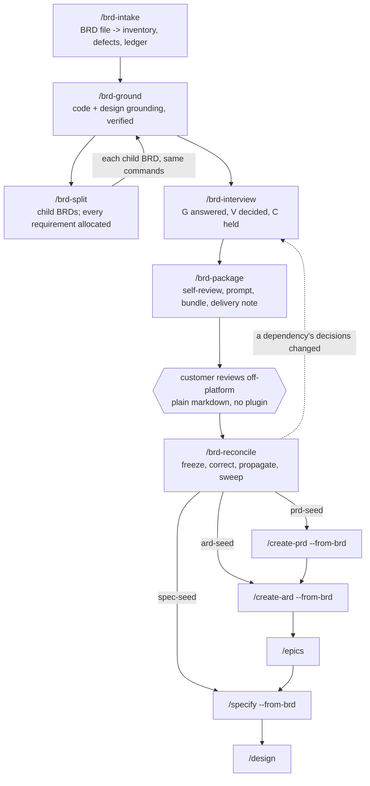

# Design: BRD → PRD workflow — grounding, decision discipline, and the customer review loop

**Date:** 2026-08-29
**Status:** Design approved in brainstorming; not implemented.
**Scope:** `plugins/dev-workflows` only

---

## 1. Problem

`dev-workflows` has one route into a PRD: `/idea → /create-prd`. It starts from an idea the PM
owns and can freely shape.

A large share of delivery work does not start there. It starts with a **BRD supplied by a
customer** — thirty-five pages, written by people who are not requirements engineers, containing
requirements that contradict each other, requirements that cannot be tested, requirements
premised on system behaviour that does not exist, and requirements that are really three
requirements wearing one number. The document cannot be implemented and cannot be safely
rejected: it is the customer's statement of what they are paying for.

Turning that into a PRD is not a writing task. Four distinct things have to happen, and the
order matters:

1. **The BRD's premises have to be checked against the code.** A BRD that says "the report shows
   who captured this measurement" is unimplementable if no write path in the system records an
   actor — and no amount of careful prose will reveal that.
2. **Design assets have to be reconciled against the text.** Exported frames routinely show
   fields the BRD never asked for, and omit fields it insists on.
3. **The decisions the document leaves open have to be sorted by who may answer them** — and
   most of them are not business decisions at all. The characteristic failure is a delivery team
   putting its own technical design choices to the customer as if they were business choices,
   which produces authoritative-looking answers to questions the customer was never equipped to
   decide.
4. **The customer has to review the result and their answers have to propagate** — including
   backwards into slices already packaged, and sideways into slices that depend on them.

None of this exists today. `code-scanner` is the nearest thing and it answers a different
question: *what capability exists for this theme?* rather than *is this specific claim true of
this specific commit?*

There is a second gap. A 35-page BRD is not one PRD. It is several, delivered in sequence, and
the ones delivered later depend on decisions made in the ones delivered first. Nothing in the
plugin represents "this PRD covers requirements 4, 7 and 12–19 of that BRD, and the rest remain
a live obligation".

This design adds a second route into the PRD, converging on the same `/create-prd` and the same
`prd-format.md` as the `/idea` route.

---

## 2. Scope and decomposition

Six new commands, three modified commands, six new agents, eight new references, a new
documentation page with its own diagram, six command pages, and four updated pages.

| Phase | Command | Ends with |
|---|---|---|
| Intake | `/brd-intake` | Requirement inventory, defect log, coverage ledger |
| Grounding | `/brd-ground` | Verified `[CG#n]`/`[DG#n]` findings against pinned commits |
| Slicing | `/brd-split` | Slice folders, every requirement allocated |
| Interview | `/brd-interview` | Decision register, `[G]`/`[V]`/`[C]` discipline enforced |
| Packaging | `/brd-package` | Self-review disposed, plugin-free customer bundle |
| *(external wait)* | | The customer reviews and returns one file |
| Reconciliation | `/brd-reconcile` | Customer decisions frozen, propagated, swept |
| Handoff | `/create-prd --from-brd` | A real PRD, gated by `prd-reviewer` |

### 2.1 Decomposition into increments

Too large for one implementation plan. Three increments, built in order, each independently
useful — which is the test that the split is real rather than cosmetic.

| Increment | Delivers | Useful on its own because |
|---|---|---|
| **1 — Grounding** | `/brd-intake`, `/brd-ground`, `/brd-split`, four references, four agents | A grounded BRD with a defect log, verified findings and a coverage ledger is worth having even if no customer loop is ever run |
| **2 — Decisions and the customer loop** | `/brd-interview`, `/brd-package`, `/brd-reconcile`, four references, two agents | Produces a reviewable package and ingests the answer; the seeds are written but not yet consumed |
| **3 — Handoff and documentation** | `--from-brd` on `/create-prd`, `/create-ard`, `/specify`; all documentation | Connects the route to the existing pipeline |

Increment 1 writes the artifacts increments 2 and 3 consume — the finding contract, the ledger,
and the altitude tag — so those three contracts are frozen here (§4, §5.1, §7) even though only
increment 1 writes them. Designing them later is the retrofit this decomposition exists to
avoid.

---

The pipeline spans **sessions and weeks**, with an external wait state in the middle. That is the
single constraint that shapes the command surface: one command per gate, each resumable, each
refusing to start until its predecessor's artifact landed on the specs default branch per
`references/phase-handoff.md`.

---

## 3. Decisions

| # | Decision | Rationale |
|---|---|---|
| D1 | **Extend `dev-workflows`; do not create a separate plugin.** | `${CLAUDE_PLUGIN_ROOT}` resolves per-plugin. A separate plugin cannot cite `prd-format.md`, `specs-repo-git.md`, `phase-handoff.md`, or the `model-routing` skill — it would have to vendor copies, and those copies would drift. The output of this route must be a PRD conforming to the *same* format authority the `/idea` route uses, not a copy of it. |
| D2 | **The route terminates by seeding `/create-prd`, not by authoring a PRD itself.** | One PRD author, one format authority, one Opus gate. A second PRD-authoring path would have to be kept in step with `/create-prd` forever. |
| D3 | **`--from-brd` freezes decisions: the grill may fill gaps but may not reopen an ID.** | The decisions arriving from this route carry customer sign-off in writing. A grill that re-litigates them manufactures a contradiction between the PRD and a document the customer has already agreed to. |
| D4 | **Do not relax `prd-format.md`'s no-implementation-detail rule.** | The rule is enforced by `prd-reviewer` and shared with the `/idea` route. More importantly, a PRD carrying transaction rules and row-grain contracts is an unreviewable document — which is the exact failure this workflow exists to escape. |
| D5 | **Route sub-product-altitude content into the ARD and the specification instead of discarding it, and track consumption.** | Downstream commands read *named artifacts*, not folder contents (§7.1). Detail left loose in the feature folder is read by nobody. The ARD is consumed by five commands via `ard-resolution.md`, so it is a real destination. |
| D6 | **`NOT-PROVABLE` is a first-class, final verdict.** | The characteristic failure of AI grounding is inferring a plausible mechanism and citing something adjacent to it. Making "cannot be established from the repository" a legitimate terminal answer is what prevents that. |
| D7 | **Grounding is not evidence until independently re-derived by a different agent.** | Checking a citation only proves the cited line exists. Re-deriving the claim is what catches a finding that is materially wrong about *where* something lives. |
| D8 | **`[G]` questions are never asked of a human.** | A question answerable from the code, put to a person, gets an answer based on their belief about the system rather than the system. That answer then becomes a requirement. |
| D9 | **`[V]` decisions never go to the customer as business questions.** | Delivery-side design choices dressed as business choices extract authority the customer never intended to give and cannot defend later. |
| D10 | **Dated snapshots are bannered, never rewritten.** | The self-review and the review prompt are records of what was asked on a given day. Rewriting them to match a later position falsifies the record the customer's review responds to. |
| D11 | **The source BRD is immutable.** | Defects are logged against it and amendments are recorded beside it. Editing the customer's document destroys the ability to say precisely what they gave us and what we changed. |
| D12 | **The customer half of the workflow assumes no plugin, no skills, and no MCP.** | We cannot require a customer to install anything. The bundle is plain markdown plus images and one self-contained prompt. |
| D13 | **The customer's reviewer writes exactly one new file and modifies nothing.** | Our copy of the bundle stays byte-identical to theirs, so every claim in the returned review is checkable against a known document. |
| D14 | **Free-text customer input never becomes a decision without operator confirmation.** | Normalising prose into a decision register is inference. Promoting inference to customer authority silently is the one way this workflow could fabricate a mandate. |
| D15 | **The parent BRD holds a coverage ledger; every requirement has a recorded fate.** | Without it, nothing detects a requirement that every slice quietly deferred — the failure a long BRD most invites. |
| D16 | **No real customer or vendor is named anywhere in the plugin.** | The roles are `customer` and `delivery team`. Any worked example ships synthetic. |
| D17 | **A slice is a BRD.** There is no lesser "slice" object: a slice runs the same commands, holds the same artifacts, can itself be sliced, and can depend on any other BRD at any level. | Two object types would mean two sets of commands, two sets of gates, and a rule for which applies. One recursive object costs nothing and expresses `008-01 -> 008`, `009 -> 008-01` and `009-01 -> 002` identically. |
| D21 | **Every identifier this workflow mints uses the house `[PREFIX#N]` form** — `[BR#n]`, `[DEF#n]`, `[CG#n]`, `[DG#n]`, `[VD#n]`, `[CD#n]`, `[AS#n]`, `[SR#n]`. | `scripts/check-id-grammar.sh` rejects the dash form, and `BRD-FR-001` trips it outright via its `-FR-001` substring. The rule's reason applies with extra force here: these documents are emailed to customers and pasted into trackers, where a dash-form ID auto-links to an unrelated ticket in any project sharing the prefix. |
| D19 | **Grounding findings carry a `horizon`, and a decision may not rest solely on one that a prerequisite will overturn.** | A finding is true of a pinned commit. When a prerequisite BRD is approved but unbuilt, some findings are true now and false after it ships. A decision resting on such a finding is built on ground that is about to move. Catching this by hand worked once and should not have to. |
| D20 | **A package whose prerequisite is not yet customer-reviewed may ship, loudly.** | Blocking would fully serialise delivery and let a slow customer stall everything downstream. Instead the delivery note and the customer prompt both name which prerequisite decisions are still provisional and which positions here depend on them — the customer is told what could still move. |
| D18 | **The rendered bundle is committed to the specs repo.** | It serves a git-capable customer directly and a zip-only customer via one command, and it is the permanent record of exactly what was sent — which is what makes D13's byte-identical property checkable months later. The cost is a derived duplicate in the repo. |

---

## 4. Artifact model

Two levels: the **BRD parent** (one per source BRD, not a PRD folder) and the **slice** (one per
PRD, each with its own Jira key).

```
$SPECS_PATH/specifications/
  <BRD-KEY>-<slug>/                      # a BRD at any level
    brd/
      source/<original BRD file(s)>      # verbatim, never edited (D11); markdown only
      brd-inventory.md                   # every requirement -> stable [BR#n]
      brd-defect-log.md                  # [DEF#n] + resolution
    coverage-ledger.md                   # one row per [BR#n] (D15)
    brd-link.md                          # parent key (if any), claimed [BR#n], depends-on
    grounding/
      baselines.md                       # repo -> commit SHA, and how each was verified
      code-grounding.md                  # [CG#n]
      design-grounding.md                # [DG#n]
    decisions.md                          # [VD#n], [CD#n], [AS#n]
    prd-seed.md   ard-seed.md   spec-seed.md
    slices.md                            # child BRDs, if this one was split
    self-review-<YYYYMMDD>.md
    customer-review-prompt-<YYYYMMDD>.md
    customer-review-<YYYYMMDD>.md
    customer-delivery-note-<YYYYMMDD>.md  # covering letter; NOT part of the bundle
    reconciliation-<YYYYMMDD>.md
    bundle-<YYYYMMDD>/                   # de-Obsidianised, plain markdown + images (D18)
    <BRD-KEY>_<slug>.md                  # the PRD, once /create-prd --from-brd has run
    <CHILD-KEY>-<slug>/                  # a slice: the same structure, recursively
```

A slice is the same object one level down (D17). It inherits `brd/source/` and its inventory
rows from its parent rather than re-intaking a document that does not separately exist;
everything from `/brd-ground` onwards runs at its own level. Only a BRD that has been through
`/create-prd --from-brd` holds a `<BRD-KEY>_<slug>.md`; a parent that was fully sliced normally
holds none.

### 4.1 The coverage ledger

One row per `[BR#n]`:

| Field | Values |
|---|---|
| `id` | `[BR#n]` |
| `text` | verbatim requirement text (or its first sentence + a source anchor) |
| `disposition` | `covered-here` / `covered-by: <CHILD-BRD-KEY>` / `deferred-to: <this BRD>` / `rejected: [DEF#n]` / `superseded-by: [BR#n]` / `unallocated` |
| `defects` | `[DEF#n]` list |
| `evidence` | `[CG#n]` / `[DG#n]` list |

`/brd-split` cannot complete while any row is `unallocated`. `/create-prd --from-brd` refuses a
BRD whose `brd-link.md` claims a row not allocated to it.

**PRD eligibility is read from the ledger, not decided in advance.** A BRD gets a PRD if and only
if at least one row is `covered-here`. If every row is `covered-by: <CHILD>` or `deferred-to`, the
BRD was fully sliced and holds no PRD of its own: `/create-prd` on it refuses and names the
children that do. This means slicing everything and slicing partially are both supported without
the operator having to declare which they are doing — the ledger records what happened and the
command reads it.

### 4.2 Identifier namespaces

| Prefix | Meaning | Scope |
|---|---|---|
| `[BR#n]` | A requirement in the source BRD | parent |
| `[DEF#n]` | A defect in the BRD document | parent |
| `[CG#n]` / `[DG#n]` | A code / design grounding finding | parent |
| `[VD#n]` | A delivery-team decision | slice |
| `[CD#n]` | A customer decision | slice |
| `[AS#n]` | An assumption asserted without evidence | slice |
| `[SR#n]` | A self-review finding | slice, per dated review |

IDs are never reused and never renumbered. A retired ID keeps its number with a terminal status.

`[VD#n]`, `[CD#n]`, `[AS#n]` and `[SR#n]` are scoped to one BRD at its own level; `[BR#n]`, `DEF`, `[CG#n]` and `[DG#n]` are
scoped to the BRD that owns the source document, and a slice cites its parent's.

### 4.3 Keys and addressing

Key grammar: `^[A-Z][A-Z0-9_]*(-\d+)+$` — `EPIC-008` and `EPIC-008-01` are both valid, to any
depth. Keys are validated for shape only and **never checked against Jira**: a BRD is a markdown
file in `$SPECS_PATH`, not a ticket.

Every command takes the full key and resolves it itself — there is no `--slice` flag. Resolution
walks `specifications/` and then one level deeper, matching by key-number and tolerating a stray
`-`/`_` and a human-adjusted slug, exactly as the existing feature-folder resolution does at the
top level. `EPIC-008-01` therefore resolves to
`specifications/EPIC-008-<slug>/EPIC-008-01-<slug>/` without the caller naming the path.

**This is the one place the design reaches outside its own commands.** `/create-prd`,
`/create-ard`, `/epics`, `/specify`, `/design` and `/ready` all resolve a PRD dir as flat
`specifications/<KEY>-<slug>/`, so a nested PRD is invisible to them today. Each needs the same
one-level-deep fallback: when the flat match fails, search `specifications/*/` before reporting
absent. Six commands touched, one shared rule — extracted into `references/brd-addressing.md` so
it is defined once (§12).

---

## 5. The grounding engine

### 5.1 Finding contract

Every finding carries an ID, a verdict from a closed set, `file:line` evidence (or an explicit
statement of why none exists), a pinned commit, an altitude tag (§7), and a **horizon** (§5.6).

| Verdict | Meaning |
|---|---|
| `CONFIRMED` | The BRD premise holds, with evidence |
| `AMENDED` | Partly true; the finding states the correction |
| `REWRITTEN` | The premise is materially wrong; the finding replaces it |
| `FALSE-FRIEND` | A name, field or constant appears to support the premise and does not |
| `NOT-PROVABLE` | Cannot be established from the repository — a valid final answer (D6) |
| `SUPERSEDED` | Replaced by a later finding; the ID is retained |

`FALSE-FRIEND` earns a verdict of its own because it is the most dangerous class: a
plausibly-named constant or column that a reader will assume supports the requirement.

### 5.2 Baseline integrity is a gate

Before any finding is written, `/brd-ground` pins each repository to a commit SHA and proves the
working tree is clean **in content**, not merely in `git status`:

- `git -C <repo> rev-parse HEAD` — recorded in `baselines.md`
- `git -C <repo> diff --ignore-cr-at-eol --stat` — empty output required
- line-count comparison for any file `git status` reports as modified

A checkout can report hundreds of modified files that differ only in line endings. Without this
check, every `file:line` in the package is a citation into an unidentifiable snapshot. The check
is recorded as a finding with its own ID, and the same procedure is handed to the customer's
reviewer in the prompt (§8.2).

### 5.3 Design grounding

`design-grounder` reads an exported frame set (`design/<export-name>/` — images plus an index
file) and reconciles it against the BRD in four classes:

1. A frame shows a field the BRD never requires.
2. The BRD requires a field no frame shows.
3. A frame contradicts BRD text.
4. **A frame implies a capture the code cannot perform.** This class is why design grounding
   exists: it is where "the report shows who captured this" meets "no write path records an
   actor".

### 5.4 Derivation matrix (optional, `--derivation-matrix`)

Default on for reporting and data-centric BRDs. Every data element the BRD asks to display or
store gets a row naming its physical source, classed:

`EXISTS | DERIVED | NEW-CAPTURE | NEW-CONFIG | PARTNER | DEFERRED | DEPENDENCY`

This is what converts a vague report specification into a build list, and it is
implementation-altitude by construction (§7).

### 5.5 Verification

`grounding-verifier` runs as a separate pass, on a different agent, pinned to the §2 Opus chain.
It does **not** check citations. For each finding it independently re-derives the claim from the
repository and returns one of `agree | extend | contradict | unprovable`, with its own evidence.

A finding without a verifier verdict is not evidence. `/brd-interview` refuses to start until
every `[CG#n]`/`[DG#n]` finding carries one. Findings inherited from another team's report, or from an
earlier run of this workflow, are unverified by definition and must be re-derived.

### 5.6 Prerequisites and the forward baseline

A BRD declares `depends-on: [<BRD-KEY>, ...]` in `brd-link.md`. Prerequisites are **not** limited
to a parent or sibling: a BRD may depend on any other BRD at any level (D17), which is how a
slice of one BRD depends on a slice of a different BRD.

Grounding therefore reads two things: the pinned commit, and the **frozen decisions of every
declared prerequisite**. It never reads speculation — only decisions already recorded in a
prerequisite's register. From that, each finding gets a horizon:

| `horizon` | Meaning |
|---|---|
| `current` | True of the pinned commit, and no declared prerequisite's decisions change it |
| `will-change` | True of the pinned commit, but a prerequisite decision makes it false once built — the finding **names that decision** |

The motivating shape: a finding says a mechanism does not exist, and a prerequisite BRD has
already decided to build exactly that mechanism. The finding is not wrong, and must not be
deleted — it is true of the code under review. It is simply not something to build a decision on.

**Prerequisite readiness** is reported by `/brd-ground` and again by `/brd-package`, per declared
prerequisite:

```
prerequisites: EPIC-008-01 — decisions frozen, customer-reviewed 2026-08-27, not yet built
               EPIC-002    — decisions frozen, NOT customer-reviewed
```

A prerequisite whose decisions are not yet frozen contributes no `will-change` horizons at all,
and is reported as such: there is nothing stable enough to ground against.

---

---

## 6. Interview and the decision register

### 6.1 Tagging

Every question is tagged before it is asked, and the tag determines who may answer:

| Tag | Meaning | Who answers |
|---|---|---|
| `[G]` | Answerable from code or design grounding | **Nobody.** The command answers it from the findings (D8). |
| `[V]` | A delivery-side design decision | The delivery team, with recorded argumentation. Never routed to the customer (D9). |
| `[C]` | A genuine business decision | The customer, and only via the review package. |

A `[G]` that grounding cannot settle does not become a question: it becomes a `NOT-PROVABLE`
finding and is **re-tagged**, usually to `[V]`. An untaggable question is a defect in the
question — it is split until each part carries exactly one tag.

Rounds are resumable. A round closes only when every question in it has a disposition, and the
register records which round produced each decision.

### 6.2 Register shape

Each `[VD#n]` / `[CD#n]` carries:

```yaml
id: [VD#7]
statement: <the decision, one sentence>
options_considered: [<option>, <option>, ...]
chosen: <option>
argumentation: |
  <why — mandatory>
evidence: [[CG#12], [DG#3]]
altitude: product | architecture | implementation
conditional_on: <BRD-KEY>/<decision-id>   # omitted unless the decision depends on a prerequisite
status: open | decided | reopened | superseded | withdrawn
consumed_by: PRD | ARD | specification | none
round: 2
```

`argumentation` is mandatory. A decision without a recorded reason cannot be defended when the
customer challenges it weeks later, and cannot be safely reopened.

**Reopening is explicit.** A decision may be reopened only by a new finding or an incoming
customer decision, and the reopening records its cause. `withdrawn` is a first-class status so
that a withdrawn request (for instance a BRD amendment the customer's answer made unnecessary)
stops being asked for in customer-facing text.

**A decision may not rest solely on a `will-change` finding** (D19). When every finding a decision
cites has `horizon: will-change`, `/brd-interview` refuses to close it and offers three ways out:

| Resolution | Recorded as |
|---|---|
| Re-base it on a `current` finding | the decision's `evidence` list changes |
| Make it explicitly conditional on the prerequisite | `conditional_on: <BRD-KEY>/<decision-id>` |
| Defer it until the prerequisite ships | `status: open`, with the blocking prerequisite named |

A `conditional_on` decision is automatically swept by `/brd-reconcile` when that prerequisite's
decisions change (§8.7) — the condition is what makes the propagation sweep able to find it.

**Assumptions get IDs.** `[AS#n]` records something the package asserts without evidence. Every
open `[AS#n]` is automatically surfaced in the customer review prompt. An assumption that never
reaches the customer is a liability disguised as a fact.

### 6.3 Self-review

`brd-package-reviewer` (§2 Opus chain, frontmatter-pinned) is instructed to attack the package,
not summarise it. Findings are `[SR#n]`; each requires a disposition:

`fixed | accepted-risk | escalated-to-customer | rejected-with-reason`

`/brd-package` will not build a bundle while any `[SR#n]` is undisposed. Every `accepted-risk`
finding is automatically listed in the prompt's "where to attack us hardest" section (§8.2).

---

## 7. Altitude routing

### 7.1 The constraint

Downstream commands read **named artifacts**, not folder contents:

| Command | What it actually reads |
|---|---|
| `/create-ard` | `commands/create-ard.md:67` — globs `<PRD>_*.md`, uses the file whose frontmatter is `issue_type: ValueIncrement` |
| `/design` | `commands/design.md:144` — reads the resolved `specification.md` fully |
| `/specify` | `commands/specify.md:90` — the merged PRD is "a grounding confirmation, not a new content source"; content comes from the Jira export |
| `/epics` | `commands/epics.md:9` — the PRD plus existing Epics, from the vault's Jira export |

A file left loose in the feature folder is read by nobody. Detail must therefore be routed into
an artifact that is consumed.

### 7.2 The router

Every finding and decision carries an `altitude`:

| Altitude | Seed file | Consumed by |
|---|---|---|
| `product` | `prd-seed.md` | `/create-prd --from-brd` |
| `architecture` | `ard-seed.md` | `/create-ard --from-brd` — and thence by `/epics`, `/specify`, `/design`, `/implement`, `/ready` via `ard-resolution.md` |
| `implementation` | `spec-seed.md` | `/specify --from-brd` |

`ard-format.md` already wants "Grounding findings (cite `file:line`)" and `AD#N` decisions with
Binds/Prevents/Rule. `[CG#n]`/`[DG#n]` findings and architecture-altitude decisions map onto that almost
one-to-one, which is why the ARD is the right destination rather than a compromise one.

### 7.3 Consumption tracking

Each finding and decision records `consumed_by`. `/brd-reconcile` and every command's final
report list everything still `none`. This makes "nothing was lost" checkable rather than hoped
for.

### 7.4 Profile default

The BRD route defaults to `--full`. That profile carries `## Functional requirements [FR#N]`,
`## API specification`, `## UX prototype / UI mockups`, `## Key deliverable & plan` and the
Contradictions Log — considerably more BRD-derived content has a legitimate *product-altitude*
home than `--hybrid` allows.

---

## 8. The customer loop

### 8.1 Plugin-free by construction (D12)

The bundle must work for a reviewer with a vanilla agent and nothing installed.

- **The prompt is self-contained.** No `${CLAUDE_PLUGIN_ROOT}` paths, no slash commands, no skill
  invocations, no MCP assumptions. The review schema is **inlined in full** by `/brd-package`,
  rendered from `references/customer-review-schema.md` at build time so the two cannot drift.
- **No harness-specific instructions.** Written in the vocabulary any agent has — "read the file
  named X", "search the repository for Y". The prompt states its assumed capability set in one
  line at the top so a reviewer on a weaker tool knows immediately what they cannot do.
- **The bundle is de-Obsidianised.** Wikilinks are rewritten to plain filename references on the
  way out; they resolve to nothing outside Obsidian and send a reviewer to a dead reference.
  Callouts are kept — they degrade to blockquotes anywhere. The bundle is plain markdown plus
  images, and nothing else.
- **Documents are located by filename search, not by path.** Paths drift the moment a bundle is
  extracted and renamed.

### 8.2 The prompt

Assembled from the package, never hand-written, in a fixed order:

1. Setup — what to put on the machine, the OS gotcha, what to do if the repositories cannot be
   obtained
2. What each package in the bundle is for (dependency packages marked *not for re-review*)
3. Documents to review
4. Code baselines, with SHAs, and the verification procedure from §5.2 as an instruction to run
5. The single most important claim to verify first
6. Review scope
7. The decisions the customer must make — each traceable to a `[C]` question or an open `[AS#n]`
8. **What could still move** — every declared prerequisite whose decisions are not yet
   customer-reviewed, and every position here that is `conditional_on` one of them (D20)
9. **Where to attack us hardest** — every open `[AS#n]` and every `accepted-risk` `[SR#n]`
10. The required output file, its exact name, and the inlined schema
11. What this session cannot settle

### 8.3 Degradation tiers

The prompt tells the reviewer which tier they are in and what their §1 must then state:

| Tier | Reviewer has | Their review's evidence status |
|---|---|---|
| Full | commit-pinned repositories + documents | code claims independently verifiable |
| Partial | unpinned repositories (a `-master` archive) | code claims true of an unidentified snapshot — must be stated |
| Documents only | no repositories | no code claim independently verified — must be stated |

This is what makes a returned review honest about its own limits, and therefore readable.

### 8.4 Output contract (D13)

The prompt instructs the reviewer, at the top and again in the output section: **read the
bundle, write exactly one new file, modify nothing in the package.** An agent asked to review
documents will otherwise edit them.

Output filename: `<BRD-KEY> Customer Review <YYYYMMDD>.md`. The prompt names where to save it
and states in one line that this file is the only thing to send back.

### 8.5 The delivery note

Short, under a hard length rule: what is attached, **which file is the prompt**, **which file
comes back**, and anything that must not sit buried inside a document. Not a per-file table.

### 8.6 Reconciliation

`/brd-reconcile <BRD-KEY> @<path>` accepts the returned file from anywhere: it copies it into
the BRD folder under the canonical name, commits it to the specs repo, and only then ingests.

- **Schema mode** — the file matches `customer-review-schema.md`; parsed directly.
- **Free-text mode** — `customer-review-reader` drafts the same schema from prose, and **every
  inferred decision must be confirmed by the operator before it becomes a `[CD#n]`** (D14).

Then, in order: customer decisions land as frozen `[CD#n]`; required corrections are applied;
superseded dated snapshots are bannered, not rewritten (D10); the defect log gains `resolution:`
rows; the coverage ledger is updated.

### 8.7 Propagation and the stale-reference sweep

Every BRD declares `depends-on: [<BRD-KEY>, ...]` in `brd-link.md` — naming any other BRD at
any level (D17).

**Propagation.** When a depended-on BRD's decisions change, every dependent BRD is swept for
decisions and findings citing a changed ID. Each is forced to a disposition:
`inherited-unchanged | reverted | reopened | withdrawn`.

Decisions carrying `conditional_on` (§6.2) are the sweep's first target and the reason the field
exists: they are the positions that were knowingly built on a prerequisite, and they must be
revisited whether or not they happen to cite a changed ID directly. Findings with
`horizon: will-change` are re-evaluated in the same pass — once the prerequisite is built and a
`--rebaseline` run has happened, they become `SUPERSEDED` by their re-grounded replacements.

**Stale cross-reference sweep.** After propagation, every artifact under the parent is searched
for the changed IDs *and* for prose asserting a now-superseded position. Updating a register
while a value document still states the old position is the characteristic failure of this
step; the sweep is not optional.

Output: `reconciliation-<YYYYMMDD>.md` — what changed, why, which IDs, and what still needs a
human.

---

## 9. Command contracts

Each command runs `specs-preflight` (`references/specs-repo-git.md` §3), classifies via the
`model-routing` skill, and ends with `handoff-to-main` (`references/phase-handoff.md` §2) offered
rather than automatic.

### 9.1 `/brd-intake <BRD-KEY> @<brd-file> [--sort-existing <dir>]`

**Preconditions:** `$SPECS_PATH` set.
**Produces:** `brd/source/`, `brd/brd-inventory.md`, `brd/brd-defect-log.md`,
`coverage-ledger.md` skeleton.

`<BRD-KEY>` names the BRD folder. Shape-validated per §4.3 only; never checked against Jira.

**The source must be markdown.** A PDF is rejected with a message saying so. Conversion is the
operator's step, deliberately: the source becomes immutable (D11) and every `[BR#n]` anchors
into it, so an unchecked machine conversion must not silently become the record of what the
customer asked for.

Phases: resolve the parent folder → copy the BRD verbatim → `brd-reader` extracts
`[BR#n]` → the orchestrator classifies defects interactively (`ambiguity | conflict |
untestable | unsourced | duplicate | scope-leak`) → write the ledger with every row
`unallocated`.

`--sort-existing <dir>` ingests an existing hand-written package (as opposed to a raw BRD),
sorting its sections by altitude into the three seed files. This is the migration path for work
already done by hand.

### 9.2 `/brd-ground <BRD-KEY> [--depends-on <BRD-KEY>…] [--derivation-matrix|--no-derivation-matrix] [--no-design] [--rebaseline]`

**Preconditions:** intake artifacts on the specs default branch; `$REPOS_PATH` resolvable.
**Produces:** `baselines.md`, `code-grounding.md`, `design-grounding.md`.

`--depends-on` declares a prerequisite and persists it to `brd-link.md`; it is additive, so
prerequisites accumulate across runs and can also be edited in the file directly. Grounding reads
each prerequisite's frozen decisions and assigns every finding a horizon (§5.6), then reports
prerequisite readiness.

Runs at whatever level its key names (D17): `/brd-ground EPIC-008` grounds the whole BRD,
`/brd-ground EPIC-008-01` grounds that slice against its own claimed requirements. `--rebaseline`
re-runs against moved code — when an upstream BRD has shipped and the ground beneath a
not-yet-packaged slice has changed. A re-run supersedes findings by ID rather than renumbering
them (§4.2), so every citation in an already-sent package still resolves.

Phases: resolve repos by `git remote` slug (as `/epics` Phase 4 does) → **baseline integrity
gate** (§5.2) → fan out `code-grounder`, one per repo, ≤4 concurrent → `design-grounder` over the
frame set → `grounding-verifier` over every finding → write, with each finding's altitude tag.

Read-only against repositories throughout, per `references/read-only-repos.md`.

### 9.3 `/brd-split <BRD-KEY>`

**Preconditions:** every finding carries a verifier verdict.
**Produces:** `slices.md`, one nested child-BRD folder per confirmed slice with its own
`brd-link.md`, **that child's `brd/brd-inventory.md` and `coverage-ledger.md`**, and an updated
parent ledger.

The child's inventory and ledger are written here because this is the only command holding both
the parent inventory and the allocation. A child has no source document of its own — it inherits
its parent's, so `/brd-intake` cannot run on it — and `/brd-ground` gates on exactly those two
files. Without them the loop dead-ends: `/brd-split` would recommend a command whose precondition
nothing could ever satisfy. The child's inventory is the subset of parent rows allocated
`covered-by: <CHILD-KEY>`, anchored to the parent's `brd/source/`; its ledger is one row per
claimed `[BR#n]`, seeded `unallocated` so the child's own split can run.

Proposes slices from the grounded picture — what is buildable, what is blocked, what depends on
what — then takes a key per confirmed slice and creates its folder *inside* this one (§4).

**Allocation is walked, not assumed.** The command cannot complete while any ledger row is
`unallocated`, and it presents each remaining row one at a time with five choices: **build here**
(`covered-here`), assign to a named child BRD (`covered-by`), defer to this BRD (`deferred-to`),
reject citing a `[DEF#n]`, or mark superseded by another `[BR#n]`. Deferring is a real allocation —
the point is that a requirement's fate is recorded, not that everything must be built.

`covered-here` is not an afterthought in that list: it is the only resolution that makes a BRD
PRD-eligible (§4.1), and a BRD nobody splits reaches it for every row. Without it the command
could never complete on an unsplit BRD, and `/create-prd --from-brd` could never become
eligible — allocation would deadlock.

**Every `brd-*` command's final report ends with the ledger line**, so the state is visible
without running anything:

```
ledger: 47 requirements — 31 covered, 12 deferred, 2 rejected, 2 unallocated
```

Re-running `/brd-split` on a fully-allocated BRD is a no-op that prints the ledger.

### 9.4 `/brd-interview <BRD-KEY> [--round N]`

**Preconditions:** this BRD's ledger allocation is complete.
**Produces:** `decisions.md` (`[VD#n]`, `[AS#n]`), the `[C]` question set for packaging.

Generates the question set, tags every question, **answers every `[G]` from the findings without
asking**, puts `[V]` to the operator via `AskUserQuestion` one round at a time, and holds `[C]`
for the customer. Records argumentation for each `[V]`. Re-tags any `[G]` grounding could not
settle.

**Rounds.** Round 1 is generated from the grounding; each later round holds the questions that
only became askable once the previous round was answered. With no flag, the command continues at
the first round holding undisposed questions, and when all are closed proposes a new round only
if findings or decisions have changed since the last one. `--round N` targets one round: resume
it if open, or re-open it if closed — recorded as a re-open with its cause, under the same rule
that governs reopening a decision (§6.2).

### 9.5 `/brd-package <BRD-KEY> [--depends-on <BRD-KEY>...]`

**Preconditions:** the interview's open rounds are closed.
**Produces**, all inside the BRD folder and committed via the normal handoff:

| Artifact | Purpose | In the bundle? |
|---|---|---|
| `self-review-<date>.md` | The adversarial pass and its dispositions | yes |
| `customer-review-prompt-<date>.md` | The self-contained prompt the customer pastes | yes |
| `bundle-<date>/` | De-Obsidianised plain markdown + images, plus a manifest | it *is* the bundle |
| `customer-delivery-note-<date>.md` | The covering letter | **no** — it is the email, not a package document |

`--depends-on` accepts any BRD key at any level (D17), so a slice depending on another BRD's
decisions and a BRD depending on a sibling BRD express identically. Named packages are copied
into the bundle marked *not for re-review*.

Phases: `brd-package-reviewer` → disposition of every `[SR#n]` (gate) → render the prompt with
the schema inlined → render the delivery note → assemble `bundle-<date>/` including dependency
packages → emit the repo→SHA table.

**Delivery, both ways.** The bundle is committed (D18), so a customer with repository access
pulls it. For everyone else the final report prints the absolute path and a ready-to-run archive
command. The delivery note is written to a file **and printed in full in the console report**,
so it can be pasted into an email without opening anything.

The note is held to a hard length rule and states only: which BRD this is, what is attached,
which repositories at which commits, **which file is the prompt**, **which file comes back**, any
prerequisite whose decisions are still provisional (D20), and anything else that must not sit
buried inside a document.

### 9.6 `/brd-reconcile <BRD-KEY> @<review-file>`

**Preconditions:** a packaged BRD.
**Produces:** `customer-review-<date>.md` (canonicalised), `reconciliation-<date>.md`, updated
register, ledger, defect log, and bannered snapshots; propagation dispositions in dependent BRDs.

---

## 10. Modified commands

| Command | Change |
|---|---|
| `/create-prd` | New `--from-brd`. Reads `prd-seed.md` and `decisions.md` from the resolved BRD folder. The grill is restricted to gaps: it may fill anything the seed does not settle, and may **not** reopen a `[VD#n]` or `[CD#n]` (D3). Refuses if any ledger row this BRD claims is unallocated, and refuses when the ledger shows no `covered-here` row (the BRD was fully sliced — it names the children instead). Defaults the profile to `--full`. Writes `brd_key:`, `brd_parent:` and `depends_on:` into the PRD frontmatter, so a PRD's prerequisites are visible to `/epics` and `/ready` without reading the BRD tree. |
| `/create-ard` | New `--from-brd`. Reads `ard-seed.md` plus the architecture-altitude findings; `[CG#n]`/`[DG#n]` findings seed the ARD's grounding-findings section, architecture decisions seed `AD#N`. Marks each consumed item `consumed_by: ARD`. |
| `/specify` | New `--from-brd`. Reads `spec-seed.md`, including the derivation matrix. Marks each consumed item `consumed_by: specification`. |

`--from-brd` is a **switch, not a path**: the positional key already identifies the BRD, and §4.3
resolves it. `/create-prd EPIC-008-01 --from-brd` reads that BRD folder's `prd-seed.md` and
`decisions.md`. A path may be given (`--from-brd <dir>`) for a BRD folder outside the normal
layout, but it is never required.

**Shared change — nested resolution.** Per §4.3, six commands (`/create-prd`, `/create-ard`,
`/epics`, `/specify`, `/design`, `/ready`) resolve a PRD dir as flat `specifications/<KEY>-<slug>/`
and cannot see a nested one. Each gains the same one-level-deep fallback, defined once in
`references/brd-addressing.md`. This is the only change this design makes to command behaviour
outside its own family, and it is additive: a flat key resolves exactly as it does today.

---

## 11. Agents

| Agent | Role | Model |
|---|---|---|
| `brd-reader` | Extract the `[BR#n]` inventory | §2.1 Sonnet chain, pinned — extraction is mechanical |
| `code-grounder` | Forensic per-repo grounding, ≤4 concurrent | No fixed pin; caller assigns, as `code-scanner` does |
| `design-grounder` | BRD ↔ design-frame reconciliation | No fixed pin; caller assigns |
| `grounding-verifier` | Independently re-derive findings | **§2 Opus, frontmatter-pinned** — it is a gate and exists to contradict us |
| `brd-package-reviewer` | Adversarial self-review → `[SR#n]` | **§2 Opus, frontmatter-pinned** — mirrors `prd-reviewer` |
| `customer-review-reader` | Parse schema mode / normalise free text | No fixed pin; the caller picks per mode |

All six are read-only with respect to code repositories.

---

## 12. References

**New:**

| File | Owns |
|---|---|
| `brd-format.md` | What a BRD is; the defect classes; the inventory contract |
| `grounding-format.md` | The finding contract, the verdict set, baseline integrity, the verification pass |
| `interview-tagging.md` | The `[G]`/`[V]`/`[C]` rule and its enforcement |
| `decision-register-format.md` | Register shape, statuses, altitude, `consumed_by`, reopening rules |
| `coverage-ledger-format.md` | Ledger rows and the allocation gate |
| `customer-review-schema.md` | The schema the customer's reviewer fills, rendered inline into the prompt |
| `bundle-packaging.md` | De-Obsidianising, degradation tiers, plugin-free rendering, the delivery note's length rule |
| `brd-addressing.md` | The key grammar, one-level-deep resolution, and the shared fallback the six existing commands adopt |

**Modified additively:** `phase-handoff.md` — its closed `prefix` vocabulary (`idea`, `prd`, `ard`,
`spec`, `design`, `ready`) gains **`brd`**, shared by all three `/brd-*` commands the way
`/create-prd` and `/update-prd` share `prd`. Its row B decides "is this my own in-progress branch?"
by testing that the branch's prefix is the caller's, so an unlisted value drops this family's
branches into row C, whose repair offer re-grounds the session on the un-amended copy. Reusing
`prd` is not an option — it would collide with `/create-prd --from-brd`'s branch on the same key.

`specs-repo-git.md` also needs `brd` — it carries its own independent copies of the same
six-prefix regex (§1.3, §2.2's plugin-owned-branch test, §3.3's G2 guard, and §3.5's branch-key
extraction that the B1–B4 disposition table depends on), plus a command list in §4.1. Without it,
`specs-preflight` cannot tell a `brd/<KEY>-<slug>` branch apart from an ordinary user branch: G2's
"leave it, stay on it" happens to produce the same outcome as B3 for a same-key resume, but a later
run for a *different* BRD key would stay parked on the stale branch under G2 rather than switching
to default under B4 — a real, if secondary, misbehavior distinct from `phase-handoff.md`'s row B/C
resume-time bug.

**Reused unchanged:** `read-only-repos.md`,
`model-routing`, `grilling-technique.md`, `escalation-rules.md`, `prd-format.md`,
`ard-format.md`, `specification-format.md`, `prose-formatting.md`, `finding-triage.md`,
`cost-emission.md`, `feedback-emission.md`.

---

## 13. Documentation

`docs/brd-workflow.md` — its own page, with its own diagram:



A BRD and a slice are the same object (D17), so the diagram has one loop rather than two lanes:
`/brd-split` produces child BRDs that re-enter at `/brd-ground`. A BRD that is fully sliced stops
at `split`; a BRD that is built continues to `interview`. `/brd-intake` runs only where a source
document exists — a child inherits its parent's.


Beneath the diagram, a **parameter table** — one row per command, required and optional
arguments spelled out, because users navigate the procedure from the diagram and must not have
to open six command pages to find that `--from-brd` takes the parent BRD folder:

| Command | Required | Optional | Notes |
|---|---|---|---|
| `/brd-intake` | `<BRD-KEY> @<brd-file>` | `--sort-existing <dir>` | Markdown only; a PDF is rejected. `<BRD-KEY>` names the folder, not a ticket |
| `/brd-ground` | `<BRD-KEY>` | `--depends-on <BRD-KEY>…`, `--rebaseline`, `--derivation-matrix`, `--no-design` | Any level. `--depends-on` persists to `brd-link.md`. Needs `$REPOS_PATH` |
| `/brd-split` | `<BRD-KEY>` | — | Walks every unallocated requirement; children nest inside |
| `/brd-interview` | `<BRD-KEY>` | `--round N` | No flag = continue the first open round; `N` resumes or re-opens one |
| `/brd-package` | `<BRD-KEY>` | `--depends-on <BRD-KEY>…` | Writes `bundle-<date>/` + prints the delivery note |
| `/brd-reconcile` | `<BRD-KEY> @<review-file>` | — | The file may be anywhere; it is canonicalised and committed |
| `/create-prd` | `<BRD-KEY>` | `--from-brd` | A switch, not a path. Decisions frozen; profile `--full`. Refuses a fully-sliced BRD |
| `/create-ard` | `<BRD-KEY>` | `--from-brd` | Consumes `ard-seed.md` |
| `/specify` | `<BRD-KEY>` | `--from-brd` | Consumes `spec-seed.md` |

Keys are resolved at any nesting depth (§4.3) — `EPIC-008-01` never needs a path.

Also updated: six pages under `docs/commands/`; `docs/roles-and-phases.md` (the route is
PM-owned, with `/brd-ground` PM-initiated and PA/Dev-executed, and `[V]` answers in
`/brd-interview` sourced from PA/Dev); `docs/workflow.md` gains the second route into a PRD so
both appear in one picture; `README.md`; `CHANGELOG.md`; the marketplace description.

---

## 14. Non-goals

- **Live customer interviews.** The customer answers via the review package, not a call.
- **Internal-only mode.** The workflow assumes an external customer owns the BRD.
- **Writing to Jira.** As with the rest of the plugin, Jira status is read, never written.
- **Editing the customer's BRD.** Amendments are recorded; the source is immutable.
- **Replacing `code-scanner`.** Theme-based capability scanning stays; forensic grounding is
  additive.

---

## 15. Build order

1. References `brd-addressing.md`, `grounding-format.md`, `brd-format.md`,
   `coverage-ledger-format.md` — the contracts everything else writes against.
2. `/brd-intake` + `brd-reader`.
3. `/brd-ground` + `code-grounder`, `design-grounder`, `grounding-verifier`.
4. `/brd-split`.
5. `interview-tagging.md`, `decision-register-format.md`, `/brd-interview`.
6. `customer-review-schema.md`, `bundle-packaging.md`, `/brd-package` + `brd-package-reviewer`.
7. `/brd-reconcile` + `customer-review-reader`.
8. The one-level-deep resolution fallback in the six existing commands (§10), then `--from-brd`
   on `/create-prd`, then `/create-ard`, then `/specify`.
9. Documentation.

Steps 2–4 are independently useful without the rest: a grounded BRD with a defect log and a
coverage ledger is worth having even if the customer loop is never run.
