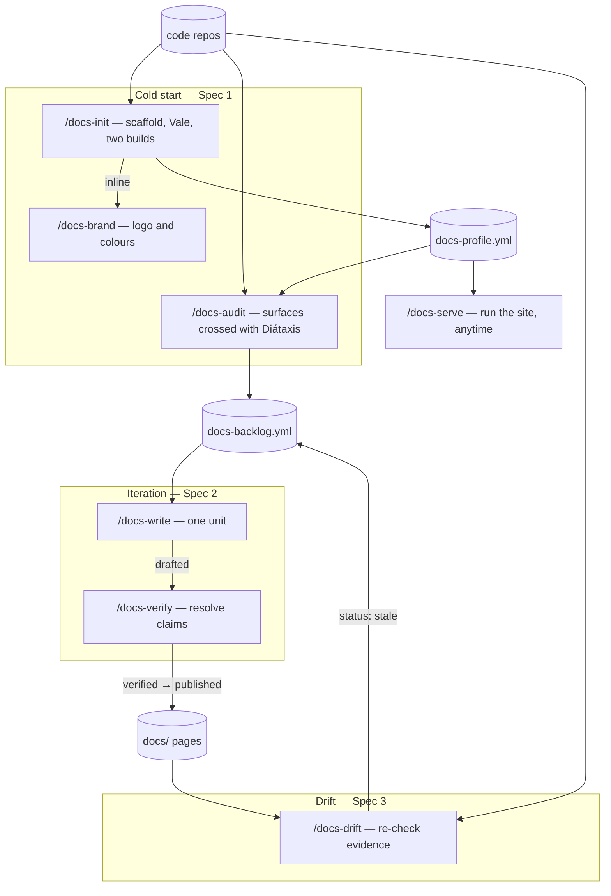
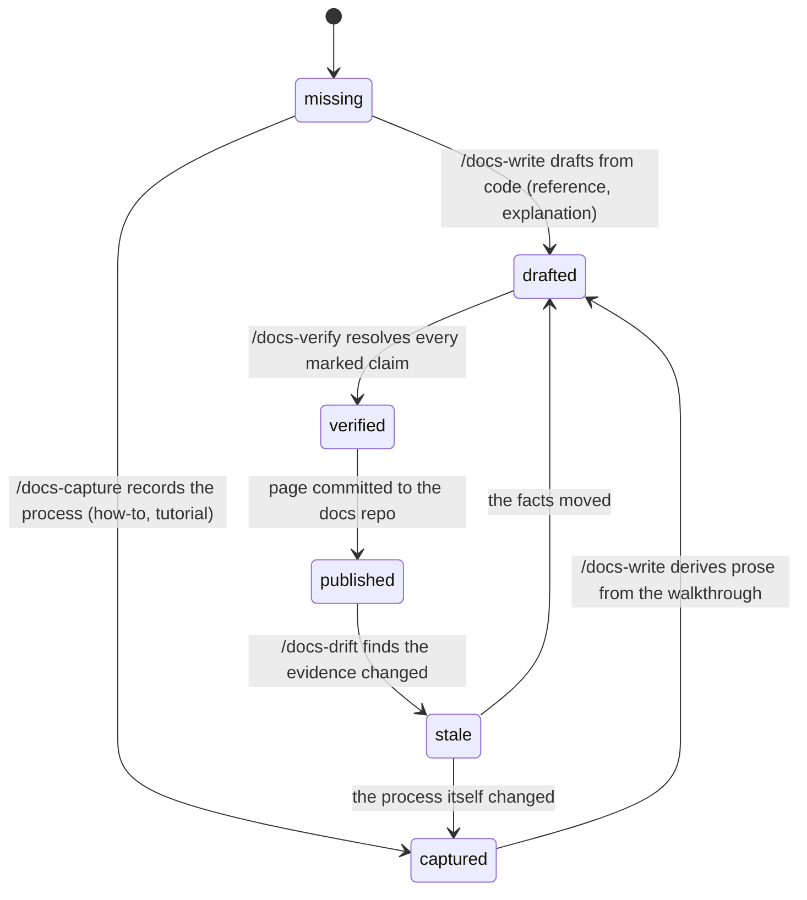
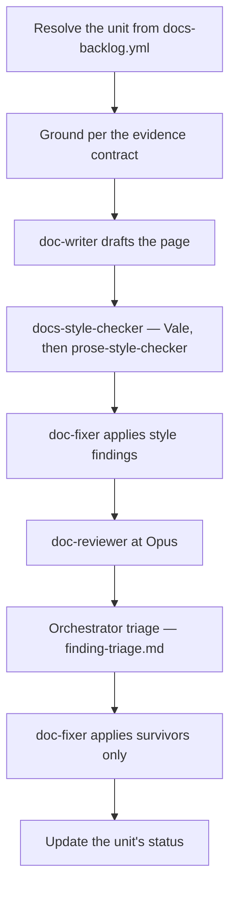

# Design: documentation-workflow family — cold start, iteration, drift

**Date:** 2026-08-29
**Status:** Design approved in brainstorming; not implemented. Spec 1 of 3 specified in full; Specs 2 and 3 specified as contracts only.
**Scope:** one plugin — provisionally `plugins/dev-workflows`, see the banner below

---

> ### ⚠ The home plugin is provisional
>
> This design places the family in `dev-workflows` (D1). A marketplace restructure is planned ahead of implementation — extracting a shared `workflows-core`, then splitting the remainder into `pm-workflows`, `dev-workflows` and `docs-workflows`. **If that lands first, the family is born in `docs-workflows` instead**, and four things here are re-derived rather than followed: **D1** (which plugin), **§13.3** (every inventory count), **§13.5** (which becomes a record of what was done rather than what is possible), and **§15** (the documentation deliverable, whose paths and counts all assume one plugin).
>
> **Everything else is independent of the packaging** and stands as written: the coverage model (§5), the four frozen contracts (§8), the visibility model (§9), the per-command designs (§6, §7, §10, §11), and the operating procedure (§14).
>
> Re-derive every count against the tree you are actually changing. This document has already carried a stale set once — written against 21 commands and 33 agents, while 27 and 39 were the reality by the time it was reviewed.

---

## 1. Problem

A large share of software projects have no product documentation at all, and the gap widens as the project grows: the surface to document expands faster than anyone's willingness to start, and by the time documentation is attempted nobody can say what should exist, in what order, or when it is finished.

`dev-workflows` already has a documentation surface, but every part of it assumes documentation **already exists**:

| Existing | What it assumes |
|---|---|
| `/document` Mode A | A PRD key, a Jira export, PR URLs, a docs repo, and a docs profile. It documents a **delta**. |
| `/document` Mode B | A specific edit the user already knows they want. |
| `/docs-profile` | A docs repo that already exists, to be **described**. |

Nothing answers the cold-start question: *there are no docs and no docs repo — what should exist, in what order do we write it, and how do we know when we are done?* That is a different shape of problem. It is inventory and prioritisation against a denominator derived from code, not diffing against a ticket.

The motivating case is a project with three git repositories (one specs, two code — a Rails backend and a React SPA), a Docker Compose dev stack, and a staging environment that can be walked under several roles. The workflow designed here must not be specific to it.

---

## 2. Scope and decomposition

Three specs, built in order. Each is independently useful, which is the test that the split is real rather than cosmetic.

| Spec | Commands | Ends with |
|---|---|---|
| **1 — Cold start** (this document, in full) | `/docs-init`, `/docs-brand`, `/docs-serve`, `/docs-audit` | A docs repo that builds and serves, and a prioritised backlog |
| **2 — Iteration engine** (contracts only) | `/docs-write`, `/docs-verify` | Pages published, claims confirmed, image slots filled |
| **3 — Drift** (contracts only) | `/docs-drift` | Stale pages detected and re-queued |

Spec 2 is largely a re-wiring of agents that already exist. Spec 3 is meaningless before pages exist. But Spec 1 **writes three artefacts that 2 and 3 consume** — the backlog, the evidence contract, and the walkthrough spec — so those three are frozen here (§8) even though only `/docs-audit` writes them in v1. Designing them later is the retrofit this decomposition exists to avoid.

---

## 3. Decisions

| # | Decision | Rationale |
|---|---|---|
| D1 | **Extend `dev-workflows`; do not create a `doc-workflows` plugin.** | The scaffold's output *is* `docs-profile.yml` — the schema `/docs-profile` writes and `/document` consumes. Splitting plugins separates a schema from one of its writers, and nothing catches the drift because each plugin's gates see only its own tree. `doc-fixer` is already shared by `/epics` and `/document`; `code-scanner` by six commands. And `finding-triage`, `gate-ledger`, `context-management`, `phase-handoff`, `specs-repo-git` cannot be safely duplicated. **Two of these three arguments were weakened by a later finding — see §13.5. The decision stands for this increment on packaging grounds, not on the impossibility grounds originally given.** |
| D2 | **One command family, `audience: user \| engineering` typed onto each backlog unit — not two pipelines.** | The audit is a single pass over the same code and yields both audiences' gaps at once; prioritisation is one backlog or it cannot answer "what is the next most valuable page". What differs by audience is not the pipeline but the **evidence contract** — template, evidence source, verification method, drift signal — so those become two implementations of one interface. |
| D3 | **User-doc evidence is code-first draft plus a human-executed verification walkthrough.** Browser automation is deferred, but the walkthrough is structured from day one so a driver is a runner, not a rewrite. | Screenshot capture is an asset-lifecycle problem, not a capture problem (see the existing images policy: CDN-hosted, immutable URLs, never refreshed in place). And most projects with no docs also have no seeded environment with per-role credentials — making browser grounding core would make the family unportable. |
| D4 | **The later screenshot/verification pass is `/docs-verify`, never `/document`.** | `/document` Mode A requires a PRD key, a Jira export and PR URLs; "add screenshots to the Roles page" is not a delta with a ticket behind it. Mode B has no role model, no grounding and no asset lifecycle. |
| D5 | **The backlog is a tracked file in the docs repo** (`.dev-workflows/docs-backlog.yml`), beside the profile. | Zero external dependencies, reviewable in a PR, git history is the progress record. Jira/GitHub projection is an optional emitter, never the source of truth. |
| D6 | **Coverage denominator = surfaces enumerated from code, crossed with Diátaxis.** | Without a denominator "what is missing" is a vibe. Three of the four Diátaxis quadrants are derivable from code; tutorials are not, and the design says so rather than pretending. |
| D7 | **Volatility de-prioritises but never excludes.** | Documenting a churning surface burns effort and trust; but a churning surface that blocks the primary journey still gets written — in a form that survives churn (concept and reference, not step-by-step screenshots). |
| D8 | **Generator: Material for MkDocs.** | Vale has no MDX parser, so an MDX generator means fighting JSX false positives for the life of the project. Material is pure Markdown, has first-class snippets (`pymdownx.snippets`), and expresses brand colour and logo as ~10 lines of config. The Node alternative, if ever wanted, is VitePress (Markdown-first); Docusaurus is ruled out. |
| D9 | **`/docs-init` picks the generator and nothing else in the family ever learns which one.** | `docs-profile.yml` already abstracts `commands.build`, `dev_servers.servers[].command`/`port`, and `spaces[].content_root`/`snippet_root`. The profile is the seam, which makes D8 far less irreversible than it looks. |
| D10 | **Engineering docs are a section of one site, not a second space.** | Shared snippets, shared search index, working cross-links. `spaces[]` remains available if a project ever needs a genuinely separate site. |
| D11 | **Visibility is a build decision, not a source decision: one source tree, two builds.** | `mkdocs.yml` (public, `exclude_docs` drops the internal prefix) and `mkdocs.internal.yml` (`INHERIT` + full nav). Two outputs, two deploy targets, two hostnames. |
| D12 | **`visibility` is its own unit field, defaulting from `audience` but independently settable.** | They genuinely diverge: API reference is engineering-audience and usually public; a runbook naming hostnames is not. Collapsing them is a quiet wrong default that leaks a year later. |
| D13 | **Vale is the deterministic pre-lint; `prose-style` is the semantic reviewer. Both, at different stations.** | `docs-style-checker` already runs `.vale.ini` as its primary rung with `prose-style-checker` as a complementary pass. `/docs-init` writing `.vale.ini` lights up the existing gate with no new wiring. |
| D14 | **`/docs-brand` is a standalone command *and* a phase of `/docs-init`.** | Rebrands happen; re-scaffolding to pick up a new logo is absurd. This dual shape is the pattern `/docs-profile` already uses (standalone, plus `--inline` from `/document` Phase 0 case (c)). |
| D15 | **The scaffold's navigation is product-shaped, not Diátaxis-shaped.** Diátaxis survives as the page **type** in frontmatter, not as the folder tree. | Diátaxis is an authoring discipline, not an information architecture. No product portal a reader recognises has "Tutorials / How-to / Reference / Explanation" as its top-level nav; they have *Discover*, *Get started*, *Guides*, *Reference*, *What's new*. Decoupling them costs nothing because **the coverage grid reads `type` from frontmatter** (§8.6), so the quadrant discipline is fully preserved while the nav is free to look like a product. |
| D16 | **Image hosting is a profile field with three supported policies (`in-repo`, `object-store`, `cdn`), and `in-repo` is the scaffold default.** | The CDN policy inherited from `/document` is one organisation's answer to a real cost — binaries in git are permanent, and a 200 KB screenshot revised twenty times is 4 MB of history nobody can reclaim — but it presumes CDN infrastructure most small teams do not have. Committing images beside the docs, as READMEs have always done, is legitimate. All three ship because their **rules** differ, not just their provider; the profile says which; the size budget (§8.4) is what keeps the default honest. External hosting buys deletability rather than cost, and owes a third visibility gate in return (§8.4). |
| D17 | **Every command in the family that writes an artefact passes a high-tier review gate, with triage and a fixer.** `/docs-serve` is the sole exemption and it writes no artefact. | The plugin's rule is that code and docs written by a command are reviewed by a high-tier model before they are trusted. `/docs-init` writes CI, `mkdocs.yml`, `.vale.ini` and CSS — that is code. `/docs-audit` writes the backlog every later run obeys. `/docs-verify` applies human confirmations to prose. `/docs-drift` marks pages stale. None of them are exempt because a sibling command has a gate. |
| D18 | **Page frontmatter is a fixed contract, and four of its fields are load-bearing for this family.** | `type`, `audience`, `visibility` and `unit` are what make the coverage grid, the two-build split and drift detection computable at all. The rest — `title`, `description`, `owners`, `creator`, `published`, `updated`, `readtime`, `order`, `changelog` — are the portal's own metadata. `docs-frontmatter` owns the schema; this family declares its four reserved keys (§8.6). |
| D19 | **Bookkeeping for a documentation run that has no PRD lands under `$SPECS_PATH/documentation/<docs-repo-slug>/`, not in the pending queue.** | The existing ladder parks a PRD-less cost entry as *pending*, awaiting reconciliation into a PRD directory. Documentation work frequently has no PRD and never will, so those entries would accumulate forever. The docs repo is this family's unit of attribution, exactly as the PRD directory is the pipeline's (§13.4). |
| D20 | **The review model is the Opus chain for every gated command, with no tiering by unit.** Classification still varies per unit and still drives the planning model; it never lowers the reviewer. | Settled by the operator against the cost: a mechanical-looking reference page is exactly where a wrong claim survives review, because it reads plausibly and nobody re-derives it. Cost is controlled by throughput (`--batch` caps, visible per-run cost emission), never by weakening the gate. |
| D21 | **A new page's default `owners` is its `creator`, until someone reassigns it.** | Accurate at write time, never blocks a write, and degrades honestly: an unmaintained page visibly names someone who has moved on, which is itself the signal to reassign. A single org-wide default would name the same owner on every page whether or not anyone is watching it, which is indistinguishable from no owner at all. `references/docs-profiles/default-owners.txt` is seeded with that convention rather than with a name. |
| D22 | **Process capture is its own command, `/docs-capture`, with two supported inputs and no video.** | A how-to or tutorial encodes a sequence a person performs, which no amount of code reading yields. That reverses the flow — capture first, prose derived from the capture — which is a different lifecycle position, a different input (a human performance, not a document) and a new state (`captured`). Folding it into `/docs-verify` would give one command two inputs, two outputs and two positions in the lifecycle; folding it into `/docs-write` would bury a human-interactive step inside the one command that must stay unattended for `--batch` to mean anything. **Video is rejected outright, not deferred** — scene-change keyframes land mid-transition and make worse screenshots than purpose-taken ones, a demo records one happy path while docs need the error states, and a recording captures incidentally what a screenshot captures deliberately. |

---

## 4. The family

| Command | Job | Reuses |
|---|---|---|
| `/docs-init` | Scaffold the docs repo: generator, Diátaxis skeleton, Vale, snippets, two builds, CI; emit `docs-profile.yml` | profile schema, `/docs-brand` inline |
| `/docs-brand` | Extract logo + rough colour scheme from the code repos and apply them | `references/guidelines/accessibility.md` |
| `/docs-serve` | Start/stop/status the docs server in the background; report a reachable URL | profile `dev_servers` |
| `/docs-audit` | Enumerate surfaces, cross with Diátaxis, write the prioritised backlog | `code-scanner`, `docs-grounder`, `jira-reader` (optional) |
| `/docs-write <unit>` | Ground → draft → style → review → publish one backlog unit *(Spec 2)* | `doc-writer`, `docs-style-checker`, `doc-fixer`, `doc-reviewer`, `finding-triage` |
| `/docs-capture <unit>` | Record how a process is actually performed, producing the walkthrough *(Spec 2)* | `code-scanner` for the skeleton |
| `/docs-verify <unit>` | Execute the walkthrough, record confirmations, fill image slots *(Spec 2)* | new |
| `/docs-drift` | Re-check pages against the evidence they were built from *(Spec 3)* | `code-scanner`, `diff-summarizer` |

**Four new agents** — `docs-auditor`, `ia-planner`, `drift-detector`, `docs-audit-reviewer`. Everything else already exists.

Every command that writes an artefact carries a review gate (D17):

| Command | Reviewer | Fixer | Why that reviewer |
|---|---|---|---|
| `/docs-init` | `code-review` @ Opus | `review-fixer` | Its output is `mkdocs.yml`, a CI workflow, `.vale.ini` and CSS — code, reviewed as code |
| `/docs-brand` | `code-review` @ Opus | `review-fixer` | Config and CSS, plus a contrast finding to adjudicate |
| `/docs-audit` | `docs-audit-reviewer` @ Opus | orchestrator applies | Spot-checks that surfaces resolve to real paths, that types fit, and that each `priority_reason` actually supports its rank |
| `/docs-write` | `doc-reviewer` @ Opus | `doc-fixer` | The existing documentation reviewer, unchanged |
| `/docs-capture` | `doc-reviewer` @ Opus | `doc-fixer` | Checks the derived walkthrough against the capture: no step invented, no step silently dropped |
| `/docs-verify` | `doc-reviewer` @ Opus | `doc-fixer` | Checks that the applied prose says what the human confirmed, and nothing more |
| `/docs-drift` | `docs-audit-reviewer` @ Opus | orchestrator applies | Same artefact as the audit; the claim under review is "this page is stale" |
| `/docs-serve` | — | — | Writes no artefact: a background process, a pidfile, a URL |

Findings are triaged by the orchestrator before any fixer sees them (`references/finding-triage.md`), every dismissal recorded with a reason that disposes of that finding's own claim.



Three stages sharing two artefacts, with one loop: drift closes back onto the backlog rather than running off the end. `docs-profile.yml` is what makes the generator choice invisible to everything downstream (D9); `docs-backlog.yml` is what makes "what next" and "are we done" answerable at all. `/docs-serve` hangs off the profile rather than sitting in a stage, because it is a utility available from the moment the repo is profiled — and it works on any profiled docs repo, including one this family never scaffolded.

---

## 5. The coverage model

`/docs-audit` cannot list what is missing without a denominator. It builds one from code.

### 5.1 Surfaces

Enumerated mechanically from the scanned repos:

| Surface kind | Derived from | Feeds |
|---|---|---|
| `role` | The authorisation model (roles, permissions, policy objects) | The role axis of every user unit |
| `task` | Routes, controller actions, UI flows, forms | **how-to** guides |
| `concept` | Domain models, the ubiquitous language in the code, state machines | **explanation** pages |
| `reference` | API endpoints, configuration keys, jobs, data schemas, CLI | **reference** pages |
| `service` | Deployables, containers, external integrations | engineering **architecture** pages |
| `decision` | ADRs and ARDs already present in the specs repo | engineering **decision** records |
| `release` | `/release-notes` drafts under `$SPECS_PATH`, grouped by release version | **What's new** pages: one per major version, plus its maintenance page |

Roles are a coverage **dimension**, not a nice-to-have: "what can a user in role R actually do" is the question user documentation exists to answer, and it is the reason walkthroughs are role-scoped.

### 5.2 Crossing with Diátaxis

Coverage is a grid of `(surface, audience, type)` cells, each `exists | missing | stale`.

- **user** types: `tutorial`, `how-to`, `reference`, `explanation`
- **engineering** types: `architecture`, `decision`, `runbook`, `api-reference`

Three of the four user quadrants are derivable from code. **Tutorials are not** — a tutorial is a curated primary journey per role. The audit *proposes* tutorial candidates (the shortest path through the highest-value tasks for each role) and a human picks. Stating this plainly is better than pretending the quadrant automates.

### 5.3 Prioritisation

Four signals, combined into a rank with a written `priority_reason` per unit:

1. **Blocks the primary journey** — can a user in role R accomplish the main thing at all without this page? Highest weight.
2. **Role breadth** — how many roles touch the surface.
3. **Evidence availability** — write first what can be grounded now. A page that cannot be verified is a page that ships wrong.
4. **Volatility, inverted** — measured from `git log` density per surface path over a trailing window. High churn lowers rank.

**Guard on signal 4 (D7):** volatility only ever *ranks*; it can never *exclude*. When a high-volatility surface also scores high on signal 1, the unit is written, but its `type` is biased away from step-by-step (`how-to` with screenshots) toward `explanation` and `reference`, which survive churn. The audit records this as `churn_adapted: true` with the reason, so the choice is visible rather than silent.

### 5.4 Definition of done

Documentation work has no natural end, so the family defines one:

> **Done** = every backlog unit at or above a chosen priority threshold has a published page, and every claim on those pages is either evidence-backed or visibly marked.

`coverage` in the backlog reports the fraction per `(audience, type)` cell. "We wrote a lot of docs" is not a completion criterion; a coverage grid with a threshold is.

---

## 6. `/docs-init`

**Signature:** `/docs-init [<docs-repo-path>] [--generator mkdocs-material] [--no-brand] [--public-only]`

Creates a documentation repository that builds, serves, lints, and is profiled. It never writes documentation content beyond a skeleton and its own explanatory stubs.

### Phase 0 — Resolve and validate

1. Resolve the target path (first token, else cwd). Resolve to absolute.
2. Run `specs-preflight` against `$SPECS_PATH` per `references/specs-repo-git.md`, as early as `$SPECS_PATH` is known.
3. The target must be a writable git work tree, or an empty/absent directory that the command offers to `git init`. A non-empty directory that is not a git work tree stops with `NOT_A_GIT_WORKTREE`.
4. **Refuse to scaffold over an existing docs repo.** If ≥ 1 docs signal is present (the `/document` Phase 0 signal set: a `*:start`/`*:build`/`*:lint`/`docs:*` script, `.docstack/`, `mkdocs.yml`, `docusaurus.config.js`, `antora.yml`, `.vale.ini`, `DOCUMENTATION-GUIDELINES.md`, or any `_snippets/`), stop and point at `/docs-profile` instead. Scaffolding is for cold start; describing an existing repo is a different command.

### Phase 1 — Model routing

Invoke the `model-routing` skill. `/docs-init` is **MODERATE**: it is mechanical scaffolding against a known template, and its output is reviewed as a PR. (Contrast `/docs-audit`, which is SIGNIFICANT.)

### Phase 2 — Source repos and toolchain preflight

1. Resolve the code repos to be documented: `ls ${REPOS_PATH:-/workspace}`, plus any explicitly named. Confirm the set with the user. This set is recorded in the profile and reused by `/docs-audit` and `/docs-drift`.
2. Run the toolchain check per `references/toolchain-preflight.md` for the tools the scaffold's own gates will need — `python3`/`pip` (or `uv`), `mkdocs`, `vale`, `git`. Prompt only when something required is missing, Cancel recommended.

### Phase 3 — Scaffold

The navigation is **product-shaped** (D15). Diátaxis lives in each page's `type:` frontmatter, which is what the coverage grid reads — so the tree looks like a documentation portal while the quadrant discipline stays fully intact.

```
mkdocs.yml                  # public build; strict: true; exclude_docs drops internal/
mkdocs.internal.yml         # INHERIT: mkdocs.yml + internal nav, builds everything
.vale.ini
docs/
  index.md                             # portal home
  discover/                            # "Discover <product>"
    index.md                           #   What is <product>          type: explanation
    how-it-works.md                    #   the mental model
    use-cases.md
    roles.md                           #   who does what             ← the role surface
    glossary.md                        #   terms, roles, integrations, primary workflows
    pricing.md                         #   optional: --with-pricing
  get-started/
    index.md                           #   quickstart                 type: tutorial
    requirements.md
    install.md
  guides/                              # task-oriented                type: how-to
  reference/                           #                              type: reference
    api/
    configuration.md
    cli.md
    data-model.md
    limits.md                          #   limits and quotas
    errors.md                          #   error codes
  integrations/                        # optional
  administration/                      # users and roles, security, SSO, billing
  troubleshooting/
    index.md
    faq.md
    known-issues.md
  whats-new/
    index.md                           #   release-notes hub
    v<MAJOR>/
      index.md                         #   the major release
      maintenance.md                   #   per-build fixes in that major
    deprecations.md                    #   end-of-life and end-of-support
  support.md
  internal/                            # engineering docs; excluded from the public build
    architecture/
    decisions/
    runbooks/
  _snippets/                           # pymdownx.snippets base_path
  assets/                              # logo, favicon, images
  stylesheets/extra.css
.dev-workflows/
  docs-profile.yml
.github/workflows/docs.yml             # build both, lint, and the two visibility gates
```

**Sections beyond the obvious, and why each is standard rather than decoration:**

| Section | Why every portal has it |
|---|---|
| **Glossary** | The single highest-leverage page in a new portal: it is what lets every other page stop re-explaining terms, and it seeds the Vale vocabulary (Phase 4) so product nouns stop being flagged as misspellings |
| **Roles** | A reader's first question is "which of these instructions are for me". It is also this family's coverage dimension (§5.1) |
| **Troubleshooting / FAQ / Known issues** | The highest-traffic pages on most portals and the main support-deflection surface |
| **Limits and quotas** | Routinely the single most-visited reference page, and the one most often missing |
| **Error codes** | The only page a reader arrives at by pasting a string from a log |
| **Administration** | Role-gated tasks that do not belong in user guides and are the first thing an evaluator looks for |
| **Deprecations / end-of-life** | Pairs with What's new, and `references/release-note-types.md` already requires an end-of-life date on every deprecation note — so the destination must exist |
| **Support** | How to reach a human; the escape hatch every other page implicitly promises |
| **Accessibility and security statements** | Increasingly a procurement requirement; scaffolded as stubs under `discover/` when `--with-compliance` is passed |

Each directory gets **one stub that states what belongs there and what does not**, carrying the section's default `type:` in its frontmatter. This is not filler: the commonest failure of a documentation tree is contributors putting explanation into how-to guides, and the stub is where that is prevented.

**"What's new" is fed, not written by hand.** `/docs-audit` enumerates a `release` surface per major version from the `/release-notes` drafts already sitting in `$SPECS_PATH`, and `/docs-write` renders the page from them (§8.2's `artifact` evidence kind). `references/release-note-types.md` supplies the section split inside each page — breaking changes, feature updates, fixes — because that reference already owns the destination map and the per-destination prose shape. Nothing is re-derived.

`mkdocs.yml` sets `strict: true` and:

```yaml
validation:
  nav:
    omitted_files: warn
    absolute_links: warn
```

so that a public page linking into `internal/` becomes a **build failure** rather than a broken link discovered later.

**`nav:` is generated, never hand-maintained.** MkDocs takes navigation order from `mkdocs.yml`, not from frontmatter, so an `order:` field would otherwise be decorative. `/docs-init` and `/docs-write` regenerate the `nav:` block by sorting each section's pages on their frontmatter `order`, then `title`. One source of truth, no extra plugin.

### Phase 4 — Vale

Writes `.vale.ini`:

```ini
StylesPath = styles
MinAlertLevel = suggestion
Packages = Google, write-good
Vocab = Project

[*.md]
BasedOnStyles = Vale, Google, write-good
```

then runs `vale sync` to download the packages, and seeds `styles/config/vocabularies/Project/accept.txt` from the domain nouns `/docs-audit` extracts for its `concept` surfaces (when the audit has already run; otherwise the file is created empty with a comment pointing at `/docs-audit`).

**Seeding the vocabulary is not a nicety.** Without it every product term is reported as a spelling error on day one and the team turns Vale off in week two.

`Packages` load in order with later entries overriding earlier ones, so a project package added later can override Google's rules without editing them.

### Phase 5 — Branding

Runs `/docs-brand --inline` (§7) unless `--no-brand`. Inline mode skips `/docs-brand`'s own preflight and PR steps and returns its result into this run's single PR.

### Phase 6 — Profile

Writes `.dev-workflows/docs-profile.yml` conforming to `references/docs-profiles/docs-profile-schema.md`, plus the three new fields in §8.5.

### Phase 7 — Verify the scaffold

The scaffold is not finished until it demonstrably works. In order:

1. `mkdocs build --strict -f mkdocs.yml` succeeds (public).
2. `mkdocs build --strict -f mkdocs.internal.yml` succeeds (internal).
3. `vale docs/` runs and returns (findings are informational at this stage; the run must not error on configuration).
4. The visibility gate (§9.3) passes against the public build output.

A failure at any step is reported and left unfixed rather than worked around; a scaffold that cannot build is not a scaffold.

### Phase 7.5 — Review gate

The scaffold is code — `mkdocs.yml`, a CI workflow, `.vale.ini`, `extra.css`, and a generated `nav:` — so it is reviewed as code (D17). Dispatch `code-review` at Opus over the written diff, triage its findings per `references/finding-triage.md`, and hand `review-fixer` the survivors only. A survivor that fails the patch gate is surfaced for a human decision rather than patched.

The reviewer is told what this diff is for, so its attention lands where the blast radius is: does the public build genuinely exclude `internal/`, does `strict` actually fail on a cross-boundary link, does the generated `nav:` list every scaffolded page exactly once, and does the CI workflow run both gates rather than only the build.

### Phase 8 — Finish

Branch, commit, and draft a PR message. Never pushes, never merges — same discipline as `/docs-profile`. Then the standard emitter tail: feedback → follow-ups → cost → `resume.md` → `commit-artifacts`, and exactly one `Specs repo:` line.

---

## 7. `/docs-brand`

**Signature:** `/docs-brand [<docs-repo-path>] [--from <code-repo-path>] [--inline]`

Extracts a logo and a rough colour scheme from the product's own code and applies them to the docs site. Expectations are deliberately modest: a mark and a primary/accent pair, not a design system.

### 7.1 Extraction

**Colour**, in precedence order, first hit wins and the source is recorded:

1. Tailwind config `theme.extend.colors` (`primary`, `brand`, or the first non-neutral entry)
2. CSS custom properties matching `--(color-)?(primary|brand|accent)`
3. A MUI `createTheme({ palette: { primary, secondary } })` call
4. `manifest.json` / `site.webmanifest` `theme_color`
5. SCSS/LESS variables matching `$(primary|brand|accent)`

**Logo**, preferring SVG over PNG, and larger over smaller: `public/`, `src/assets/`, `static/`, files matching `logo*`/`brand*`/`icon*`, `favicon.*`, and manifest `icons[]`.

### 7.2 Application

Material takes hex brand colours through a custom palette plus CSS variables — named palette colours do not accept hexes:

```yaml
theme:
  palette:
    primary: custom
  logo: assets/logo.svg
  favicon: assets/favicon.png
extra_css:
  - stylesheets/extra.css
```

```css
:root > * {
  --md-primary-fg-color:        #<primary>;
  --md-primary-fg-color--light: #<primary-light>;
  --md-primary-fg-color--dark:  #<primary-dark>;
  --md-accent-fg-color:         #<accent>;
}
```

Light and dark variants are derived from the primary when the source supplies only one value.

### 7.3 Honesty and accessibility

- **Never applies silently.** The command prints each extracted value with the file and line it came from, and asks to confirm. A wrong brand colour applied quietly is worse than no branding.
- **Contrast check.** The derived palette is checked against `references/guidelines/accessibility.md`; a primary that fails contrast on body text is reported as a finding with the measured ratio, not silently accepted. A brand colour that fails is still applied if the user confirms — it is their brand — but the finding is recorded in the PR message.
- **Copies, never links.** Logo assets are copied into `docs/assets/`; the docs build never reaches into a code repo at build time.

### 7.4 Review gate

`code-review` at Opus over the config and CSS diff, triaged, then `review-fixer` on survivors (D17). Standalone runs review their own diff; an `--inline` run from `/docs-init` contributes its diff to that command's Phase 7.5 review rather than running a second one.

---

## 8. Frozen contracts

These are written by Spec 1 and consumed by Specs 2 and 3. They are frozen here because they are the expensive things to change later.

### 8.1 `.dev-workflows/docs-backlog.yml`

```yaml
schema_version: 1
generated_at: 2026-08-29
generated_by: docs-audit
sources:                              # every repo scanned, at the ref scanned
  - { repo: example-webapp, path: /workspace/example-webapp, ref: <sha>, scanned_at: <iso8601> }
  - { repo: example-api,     path: /workspace/example-api,     ref: <sha>, scanned_at: <iso8601> }
surfaces:                             # the denominator, enumerated once
  - id: order-placement
    kind: task                        # role|task|concept|reference|service|decision
    title: "Place an order"
    roles: [customer, admin]
    evidence:
      - { repo: example-webapp, path: src/routes/orders/new.tsx }
      - { repo: example-api,     path: app/controllers/api/v2/orders_controller.rb }
    volatility: high                  # high|medium|low, from git log density
units:                                # what gets written; many units per surface
  - id: U-001
    surface: order-placement
    title: "Place an order"
    audience: user                    # user|engineering
    visibility: public                # public|internal — defaults from audience, set independently
    type: how-to                      # user: tutorial|how-to|reference|explanation
                                      # engineering: architecture|decision|runbook|api-reference
    roles: [customer]
    priority: 1
    priority_reason: "blocks primary journey; 2 roles; evidence available"
    churn_adapted: false
    status: missing                   # missing|drafted|verified|published|stale
    page_path: docs/guides/place-an-order.md   # assigned when written
    walkthrough: null                 # W-001 once composed
    blocked_by: []
coverage:
  user:        { tutorial: "0/2", how-to: "3/14", reference: "0/6", explanation: "1/5" }
  engineering: { architecture: "0/3", decision: "2/2", runbook: "0/4", api-reference: "0/1" }
threshold: 2                          # "done" = every unit with priority <= threshold is published
```

**Why surfaces and units are separate tables:** one surface spawns several units across quadrants, and **drift is detected per surface and then fans out to its units**. A single flat list would either duplicate the evidence per unit or lose the fan-out. `sources[].ref` is what makes drift computable at all, and it is the same idea as `prep.scanned_ref` in `references/read-only-repos.md`.

### 8.2 The evidence contract

The interface, with two implementations:

| | `audience: user` | `audience: engineering` |
|---|---|---|
| Template | Diátaxis quadrant | arc42/C4 section, MADR, runbook, generated API reference |
| Evidence source | Routes, views, i18n strings, plus a walkthrough | Code, config, ARDs and design docs from the specs repo |
| A claim is resolved by | **Observation** — a walkthrough step confirms it | **Code read** — delegated to `references/source-truth.md` |
| Drift signal | Behaviour change: routes, labels, flows | Structure change: interfaces, modules, dependencies |

A third evidence kind, `artifact`, covers a claim whose source is neither code nor observation but a committed document — a `/release-notes` draft under `$SPECS_PATH`, an ARD, a design doc. It records the path **and the commit it was read at**, so drift can tell a re-worded draft from an unchanged one.

A page records its sources in frontmatter. Individual sentences are **not** tracked; only claims that could not be verified are marked inline, reusing the `[NEEDS CLARIFICATION]` vocabulary `/idea` already establishes.

**The hard rule: a marked claim never becomes prose fact by default.** It is either confirmed by a verification pass or it ships visibly marked. This is what prevents the backlog reporting green on prose nobody checked.

### 8.3 The walkthrough spec

Structured from day one so that a browser backend is a runner rather than a rewrite (D3):

```yaml
walkthrough:
  id: W-001
  unit: U-001
  role: customer
  environment: docker | staging        # which environment it was written against
preconditions:
  - "catalog seeded"
  - "signed in as customer"
steps:
  - n: 1
    action: navigate                   # navigate|click|type|select|wait
    target: "/orders/new"
    expect: { kind: heading, text: "New order" }
  - n: 2
    action: click
    target: { label: "Add item" }
    expect: { kind: visible, label: "Item details" }
captures:
  - { slot: img-order-form, after_step: 2, shows: "the empty order form with the item panel open" }
```

**v1 execution:** rendered as a numbered checklist. Per step the human answers `confirmed` / `differs` / `blocked`, and **`differs` records the actual observed text**, which turns a walkthrough into a correction rather than a red X. Results are written back as `result:` on each step.

**v2 execution:** a driver executes the identical file. No format change.

### 8.4 Images and image slots

`captures[].slot` names a placeholder the writer leaves in the page; the verification pass produces the image and fills it. **Where that image then lives is a profile field, not a law** (D16):

| `images.policy` | How a slot is filled | Fits |
|---|---|---|
| `in-repo` *(scaffold default)* | The file is committed under `docs/assets/<section>/` and referenced by relative path. An updated screenshot **overwrites in place** — same path, new bytes | Most projects. No infrastructure, images version with the prose that describes them, a PR shows the new screenshot beside the text change |
| `object-store` | An S3-compatible bucket (S3, R2, Spaces, B2). The docs reference bucket URLs. Overwrite in place is allowed — enable bucket versioning — and a **third visibility gate** is required (below) | Projects that also carry video or large media, or that need an image to be **deletable** |
| `cdn` | The human uploads, supplies an immutable URL, and the docs edit is a URL swap. An image is **never refreshed in place**; every replacement is a new URL | Large portals where repository size and CDN delivery already matter |

Three policies rather than two because the **rules** differ, not merely the provider: mutability, who uploads, and what has to be gated.

**The bloat cost, sized honestly rather than asserted.** Binaries in git are permanent, and that is the real reason large docs organisations push images out. But at the scale this family targets the number is small: 150 screenshots at 150 KB, each revised three times over three years, is about 67 MB of permanent history. Git carries that without complaint. The horror stories come from portals with thousands of images revised continuously — which is precisely who already runs a CDN. **Sizing it matters, because an infrastructure decision taken against an imagined cost is how a small team acquires a bucket it then has to secure, back up, and pay attention to.**

**What external hosting actually buys, and it is not cost.** Object storage for this volume is effectively free either way — a few hundred screenshots is cents per month, and Cloudflare R2 charges no egress at all, which makes it a better choice than S3 for exactly this use. The real purchase is **deletability**: an image in a bucket can be removed, and an image in git cannot without rewriting history. That is not hypothetical — a screenshot taken against a real environment can capture a customer name, an internal hostname, a token in a URL bar. In-repo, discovering that later means a history rewrite. In a bucket it means a delete.

**What external hosting costs, in this design specifically.** The public/internal split (§9) is enforced by the build: `exclude_docs` drops `internal/` and the marker grep asserts on the built HTML. **A bucket has no notion of the two builds.** A public page referencing an internal screenshot leaks the image while both existing gates pass, because the leak is in the object store, not in the HTML. So `object-store` requires a third gate — every image URL in the public build must resolve to the public prefix, with internal media under a separate prefix or bucket. It also costs the PR review: a reviewer no longer sees the new screenshot beside the text change. Both are payable; neither is free.

So `in-repo` stays the default — the bloat maths does not justify infrastructure at this scale, and a portal with no screenshots is worse than one with a slightly heavy repository — while `object-store` is a supported, documented step up rather than something a project has to invent.

So `in-repo` ships as the default with the cost bounded rather than ignored:

- A **size budget** — 300 KB per image, checked in CI beside the visibility gates. Over budget fails with the offending file named.
- **Prefer SVG**, then optimised PNG; the write path runs an optimiser when one is on the toolchain and says so when it is not.
- **One path per slot** — a replacement overwrites; it never lands beside the old file under a new name. This is what actually keeps history bounded, and it is the rule the `cdn` policy has to invert.
- **`git-lfs` is named, not scaffolded.** It solves the size problem and introduces a checkout dependency for every contributor; a project can adopt it, and the profile records that it did.

`object-store` carries two obligations `in-repo` does not, both stated so a project adopting it does not discover them late: an **orphan sweep** (deleting a page does not delete its objects, and an unreferenced object is invisible and paid for forever), and the **third visibility gate** above.

Switching policy later is a profile edit plus a rewrite of the affected references, which `/docs-drift` can enumerate — so the default is reversible, not a trap.

### 8.5 Profile additions

Three optional fields, additive to `references/docs-profiles/docs-profile-schema.md`:

```yaml
generator: mkdocs-material            # informational; consumers still go through commands.*
builds:                               # two builds from ONE content root
  - { id: public,   config: mkdocs.yml,          command: "mkdocs build --strict -f mkdocs.yml",          out: site,          visibility: public }
  - { id: internal, config: mkdocs.internal.yml, command: "mkdocs build --strict -f mkdocs.internal.yml", out: site-internal, visibility: internal }
dev_servers:
  servers:
    - { space: docs, command: "mkdocs serve -a 0.0.0.0:8000", port: 8000, public_base_url: "http://localhost:8001" }
```

A fourth change is to an **existing** key rather than an addition: `images.policy` is a free-text sentence today, and becomes a small structured block so a consumer can act on it (D16):

```yaml
images:
  policy: in-repo | cdn                 # was a prose sentence
  root: docs/assets                     # in-repo only
  max_bytes: 307200                     # in-repo only; CI budget
```

**Why `builds:` rather than a second `spaces[]` entry:** `spaces[]` is defined by content-root ownership — "a page belongs to whichever entry's `content_root` prefixes its path". Two spaces sharing one root breaks that rule. Two builds over one root is a different axis and needs its own field.

`public_base_url` exists because a command running inside a container cannot infer the host's published port mapping (§10.2).

---

### 8.6 Page frontmatter

Every page carries YAML frontmatter. `docs-frontmatter` owns the schema and `references/docs-profiles/frontmatter-guidelines.md` states the rules; this family **declares four reserved keys it needs and does not otherwise touch the skill's territory** (D18, settling the open question this document originally carried on the point).

```yaml
---
title: Place an order                    # page title, also the nav label
description: How a customer builds and submits an order.   # one sentence; meta description and search snippet
type: how-to                             # RESERVED — Diátaxis or engineering type; the coverage grid reads this
audience: user                           # RESERVED — user | engineering
visibility: public                       # RESERVED — public | internal; the two-build split reads this
unit: U-001                              # RESERVED — the backlog unit; drift reads this
roles: [customer]                        # which product roles this page serves
owners: [i.gudak]                        # who maintains it; defaults to creator (D21)
creator: i.gudak                         # who first authored it
published: 2026-08-31                    # ISO date first published
updated: 2026-09-04                      # ISO date of the last substantive change
readtime: 4                              # minutes; computed, not hand-maintained
order: 20                                # sort within the section; generates nav:
tags: [orders, checkout]                 # search and tag index
status: published                        # draft | published
review_by: 2027-03-01                    # staleness backstop (§17)
evidence:                                # what this page's claims rest on
  - { kind: code, repo: example-webapp, path: src/routes/orders/new.tsx, ref: <sha> }
  - { kind: walkthrough, id: W-001 }
changelog:
  - { date: 2026-09-04, change: "Added the bulk-item path", author: i.gudak }
---
```

Four notes on fields that are not what they look like:

- **`readtime` is computed**, not typed: word count divided by ~200 wpm, refreshed on every write. A hand-maintained reading time is wrong within two edits.
- **`order` generates the nav** (§6 Phase 3). Without that, MkDocs takes order from `mkdocs.yml` and the field would be decorative.
- **`updated` is not in your list, and it earns its place**: readers trust a page by its last-changed date far more than by its publication date, and it is what a staleness sweep sorts on. `published` alone cannot distinguish a page written last week from one written in 2019.
- **`review_by` is the backstop for the rot `/docs-drift` cannot see** — a page can go wrong with no code change at all (a renamed product, a changed process). Drift watches evidence; `review_by` watches the calendar.

`changelog` and `owners` follow `references/docs-profiles/changelog-guidelines.md` and `default-owners.txt` — this family points at them and re-specifies neither.

## 9. Visibility

### 9.1 Model

One source tree, shared snippets, working cross-links. Two builds:

- **public** — `mkdocs.yml`, `exclude_docs` drops `internal/` (gitignore-style patterns, MkDocs 1.6+)
- **internal** — `mkdocs.internal.yml`, `INHERIT: mkdocs.yml` plus the internal nav, builds everything

Two outputs, two deploy targets, two hostnames. Separate hostnames rather than a protected path prefix: path-prefix protection is easy to misconfigure and fails open. Protection at the internal host is the project's own choice — basic auth at a reverse proxy, an SSO proxy, a private host, or a VPN. The family does not implement authentication; it produces two artefacts and states which is which.

### 9.2 Trap 1 — the dev server does not exclude

As of MkDocs 1.6, `exclude_docs` **does not apply to `mkdocs serve`**. Excluded pages still render locally. That is convenient for authoring and dangerous for verification: *what you see locally is not what ships*.

**Rule: visibility is never confirmed by looking at the dev server.** It is confirmed against built output only.

### 9.3 Trap 2 — snippets cross the boundary invisibly

An internal snippet included into a public page leaks its **content** even though every file sits in the correct directory. A path-based rule cannot catch this, because no path is wrong.

Therefore two CI gates, both on **built output**:

1. **Public build with `strict: true`** plus `validation.nav.*: warn` — a public page linking into `internal/` becomes a build failure. Free, and catches the link class completely.
2. **Marker grep over the public build output** — every file under `docs/internal/` and every internal snippet carries a marker comment; the gate fails if the marker appears anywhere in the public `site/` output. This catches snippet-level leakage that paths and links both miss.

Gate 2 is the same technique as verifying a history rewrite by grepping the resulting blobs: assert on the artefact, not on the intent.

---

## 10. `/docs-serve`

**Signature:** `/docs-serve [--internal] [--stop] [--status] [--build] [--port <n>]`

Profile-driven, so it works on any profiled docs repo — including one `/document` is working in, not only one `/docs-init` scaffolded.

### 10.1 Behaviour

1. Resolve the docs repo the same way `/document` Phase 0 does (cwd with signals → `$DOCS_PATH` → search `$REPOS_PATH` → ask).
2. Read `dev_servers` from the profile. `--internal` selects the internal build's server; default is public.
3. **Already-running detection** — if the port answers and the response identifies the docs site, report the existing URL and stop. Never start a second server.
4. **Port collision** — if the port is occupied by something else, pick the next free port, use it, and say so explicitly.
5. Start the command with Bash `run_in_background`.
6. **Poll for readiness** up to `dev_servers.readiness_timeout_seconds` (default 120), then print the URL.
7. Record the pid and port under `.dev-workflows/` so `--stop` and `--status` work across sessions.

`--build` runs the profile's build command and exits without serving. No separate `/docs-build` command: the pipeline already gates on the profile's build, and a flag is cheaper than a command.

### 10.2 Container reachability

Two rules, both learned from how containerised stacks actually behave:

- **Bind `0.0.0.0`, never `localhost`.** A server bound to the container's loopback is unreachable from the host, which is where the browser is.
- **Report the host-visible URL, not the in-container one.** From inside a container the command cannot infer the published port mapping, so it reports `public_base_url` from the profile when set, and otherwise reports the in-container URL **with an explicit caveat** naming the likely mismatch. It never silently prints a URL that will not open.

A port-shifted stack (a project whose Postgres and Redis are moved off the standard ports to coexist with another project's containers) is the normal case, not the exotic one; guessing the mapping would be wrong more often than right.

---

## 11. `/docs-audit`

**Signature:** `/docs-audit [--audience user|engineering|both] [--refresh] [--threshold <n>]`

### Phase 0 — Resolve

Docs repo and profile as above; `specs-preflight`; source repos from the profile's recorded set (confirm if absent).

### Phase 1 — Model routing

**SIGNIFICANT.** It is a cross-cutting synthesis of every scanned repository whose output steers every later `/docs-write` run — the same argument `/docs-profile` makes for itself. A wrong backlog has a large blast radius.

### Phase 2 — Scan

Dispatch `code-scanner` per repo in a **single response**, capped at 4 concurrent, per `classification.md` §8. Each scanner returns its `prep` block (`read_only`, `scanned_ref`, `ref_committed_at`, `head_divergence`) per `references/read-only-repos.md`; `scanned_ref` is recorded in `sources[]`.

Optionally dispatch `docs-grounder` against `$DOCS_PATH` and `jira-reader` when a Jira export exists, both advisory.

An inconclusive theme gets one narrow round 2 seeded with round 1's verified anchors (§8.5), and a theme still unresolved after round 2 is **named** in the output, never flattened into a gap — a gap asserts absence, an unresolved theme asserts only that the scan could not tell.

### Phase 3 — Enumerate surfaces (`docs-auditor`)

Produces the `surfaces[]` table per §5.1, including `volatility` from `git log` density per surface path.

### Phase 4 — Type and prioritise (`ia-planner`)

Crosses surfaces with Diátaxis per §5.2, applies the four prioritisation signals per §5.3 with a written `priority_reason` per unit, defaults `visibility` from `audience` (D12), and proposes tutorial candidates for human selection.

### Phase 5 — Reconcile with what exists

On `--refresh`, existing pages are matched to units and marked `published`; units with no page stay `missing`. Coverage is computed. **A unit is never silently deleted** — a unit that no longer has a surface is marked `blocked_by: [surface-removed]` and reported, because a surface disappearing from a scan is as likely to be a scan failure as a real removal.

### Phase 5.5 — Review gate

`docs-audit-reviewer` at Opus (D17). The backlog steers every later `/docs-write`, so a wrong backlog is expensive and silent. The reviewer checks four things and is given the evidence to check them against:

1. **Every surface resolves** — each `evidence[].path` exists at the recorded `ref`. A surface built on a path that does not exist is a hallucinated surface.
2. **Types fit their surface** — a `role` surface does not become a tutorial; an `api-reference` unit has an actual endpoint behind it.
3. **Every `priority_reason` supports its `priority`** — the stated reason must contain the signals it claims. "Blocks the primary journey" is checkable against the roles and tasks enumerated; an unsupported reason is a finding.
4. **No unit is orphaned or duplicated** — every unit names a surface that exists, and no two units cover the same `(surface, audience, type)` cell.

Findings are triaged by the orchestrator; the orchestrator applies survivors to the backlog itself, since there is no backlog fixer and one would add nothing.

### Phase 6 — Write and report

Writes `.dev-workflows/docs-backlog.yml`, prints the coverage grid and the top N units with reasons, then the standard emitter tail.

**`/docs-audit` writes no documentation content.** Its output is a backlog and a coverage grid.

---

## 12. Specs 2 and 3 — contracts only

### 12.1 `/docs-write <unit-id>` (Spec 2)

Deliberately boring; it is the existing chain with a new front-end:

```
resolve unit → ground (code-scanner / docs-grounder / ARDs per the evidence contract)
  → doc-writer → docs-style-checker (Vale + prose-style-checker) → doc-fixer
  → doc-reviewer @ Opus → orchestrator triage (finding-triage.md) → doc-fixer on survivors
  → write page → update unit status → emitter tail
```

**Unit selection, because typing forty ids by hand is its own reason to stop:**

- `/docs-write <unit-id>` — write that unit.
- `/docs-write --next` — take the highest-priority `missing` unit whose `blocked_by` is empty. This is the normal invocation; the backlog already knows what is next, so the operator should not have to.
- `/docs-write --batch <n>` — the next `n` units in priority order, capped, each through its own full gate. Confirmed once with the list of what it is about to write, then it grinds. Intended for a run of reference pages, not for tutorials.

Classification is usually MODERATE for a single unit. The one genuinely new gate:

> **A unit may not be marked `published` while it carries unconfirmed claims.** It goes to `verified` only after `/docs-verify` resolves them.

### 12.2 `/docs-capture <unit-id> [<capture-dir>]` (Spec 2)

Produces the walkthrough for a **process-shaped** unit — `how-to` and `tutorial` — which is the one thing no amount of code reading yields (D22). Fact-shaped units never run it.

**It does not start blank.** Phase 1 derives a skeleton from code: the route sequence, the form fields and their validation messages, and which roles can reach which screen. The human's job is to correct twelve guessed steps, not to describe a process from memory.

**Two inputs, selected by whether a directory is given:**

| Invocation | Mode | What you prepare |
|---|---|---|
| `/docs-capture U-001` | **Interactive** | Nothing. The command renders the skeleton and walks you through it step by step in the session, recording `confirmed` / `differs` / `blocked` with the observed text on `differs` |
| `/docs-capture U-001 ./captures/place-an-order/` | **Folder** | You perform the task once, screenshotting as you go, and write down what you did. Asynchronous — no agent waiting on you |

**The folder convention, documented because a convention nobody can look up is not one.** Preferred shape — a `capture.md` of numbered steps with images referenced inline, which is what a person writes anyway and is unambiguous about order and alignment:

```markdown
1. From the orders list, click **New order**.
   
2. Fill in the customer, then click **Add item**.
   
```

Tolerated fallback — numbered image filenames (`01-*.png`, `02-*.png`) plus an optional free-prose `notes.md`. The command then **proposes an alignment of notes to images and asks you to confirm it** rather than assuming one.

**Phase 3 reconciles the capture against the code skeleton, and the discrepancy is the point.** If the skeleton has five screens and the capture shows three, that is reported, not silently resolved: you may have skipped a step, or the code may carry a path you never use. Either is worth knowing, and neither is an error.

Screenshots supplied in folder mode land in the unit's image slots per `images.policy` (§8.4) — so one pass yields both the process and the images. The unit moves `missing → captured`; `/docs-write` then derives the prose from the walkthrough instead of from code.

`--role` overrides the role taken from the unit. Invoked on an uncaptured unit with no directory and no interactive session available, the command **prints the preparation instructions and stops** rather than guessing — the command teaches what to prepare.

### 12.3 `/docs-verify <unit-id>` (Spec 2)

**Two backends, matching the two implementations of the evidence contract (§8.2)** — one command, not two:

- **`audience: user`** — composes or loads the unit's walkthrough (§8.3), renders it as a checklist, records `confirmed`/`differs`/`blocked` per step with the observed text on `differs`, and collects image slots for CDN upload.
- **`audience: engineering`** — re-reads the claims against the code and the specs-repo artefacts they cite, delegating to `references/source-truth.md`. No walkthrough; the same status transition.

Both resolve marked claims and move the unit `drafted → verified`. v2 adds a browser driver behind the user backend, with no change to the file format.

**Reviewed, not trusted** (D17): the pass edits prose to match what a human confirmed, and the failure mode is editing *more* than was confirmed — turning "the button says Add item" into three sentences of invented behaviour. `doc-reviewer` at Opus checks the diff against the recorded confirmations, findings are triaged, `doc-fixer` applies survivors.

### 12.4 `/docs-drift` (Spec 3)

For each surface, diff `sources[].ref` → `HEAD` restricted to the surface's evidence paths, summarising via `diff-summarizer`. A non-empty diff marks that surface's units `stale` with the reason, and re-queues them. `sources[].ref` advances only when the resulting stale units have been re-verified — otherwise a drift run would erase the very evidence that a page is out of date.

`docs-audit-reviewer` at Opus reviews the staleness calls before they land (D17). The claim under review is "this page is stale", and both errors cost: a false positive re-queues work nobody needed, a false negative leaves a wrong page standing. The reviewer is handed the diff and the page and asked whether the change actually reaches anything the page asserts.

---

## 13. Integration and cost

### 13.1 Reused unchanged

`model-routing`, `specs-repo-git` (`specs-preflight` + `commit-artifacts`), `finding-triage`, `gate-ledger`, `context-management` read-failure tiers, `toolchain-preflight`, `read-only-repos`, `prose-formatting`, `cost-emission`, `feedback-emission`, `followup-emission`, `session-hygiene`, `doc-structure-conventions`, `source-truth`, `pre-lint`, `references/guidelines/accessibility.md`. Agents: `code-scanner`, `docs-grounder`, `jira-reader`, `diff-summarizer`, `doc-writer`, `doc-reviewer`, `doc-fixer`, `docs-style-checker`, `impl-maintenance`.

### 13.2 Changed

- `references/docs-profiles/docs-profile-schema.md` — three optional fields (§8.5) plus their field rules.
- New `references/docs-workflow/` directory holding the coverage model, the backlog schema, the evidence contract, and the walkthrough spec — kept self-contained so a later extraction to a separate plugin stays cheap (D1).

### 13.3 Gate impact, stated up front

Re-derived against the tree at `641981f` (dev-workflows 3.5.0), not against the numbers this document first carried — the repository gained the whole `/brd-*` route between the two.

| Inventory | Now | After the family |
|---|---|---|
| Commands | 27 | 35 |
| Agents | 39 | 43 |
| Reference files | 106 | 106 + `references/docs-workflow/*` |
| `docs/` pages | 41 | 54 |
| Skills | 2 | 2 |
| Hooks | 5 | 5 |

`scripts/check-docs.sh` runs **eleven** checks over 51 selftest cases and enforces six inventories in both directions plus the prose counts that mirror them; `scripts/check-id-grammar.sh` applies to the new reference files. The `plugin.json` and `marketplace.json` descriptions are capped at 1024 characters and are already tight: the new capability **replaces** wording, it never appends.

Check 11 gates `choices:` placeholders for the `/brd-*` family only, and `CLAUDE.md` records that its scope was deliberately not widened on evidence. This family is therefore **outside** that check — which means its offers must carry the `references/next-phase-offer.md` merge clause by discipline rather than by gate, and that is worth stating in the commands themselves rather than discovering later.

### 13.4 Where a documentation run's bookkeeping lands

Feedback and cost follow the existing ladders in `references/feedback-emission.md` and `references/cost-emission.md` unchanged **whenever a PRD is in scope** — a `/document` run against a PRD keeps writing under that PRD's directory, and nothing about it changes.

The gap is the run with no PRD, which for this family is the normal case. Today such a run resolves to `$SPECS_PATH/dev-workflows-feedback/<KEY-or-date>.md` for feedback, and for cost to **pending** — parked awaiting reconciliation into a PRD directory. Documentation work often has no PRD and never will, so those pending entries accumulate forever and reconcile against nothing.

**One new rung, inserted before pending** (D19):

```
$SPECS_PATH/documentation/<docs-repo-slug>/
  dev-workflows/
    cost/<sid8>.md
    feedback/<date>.md
```

`<docs-repo-slug>` comes from the resolved docs repo's git remote, or its directory name. Per-repo rather than one flat `docs/` bucket, because a person who documents two products must still be able to answer what documenting each one cost — which is exactly why the PRD-directory rung exists for the pipeline. The docs repo is this family's unit of attribution.

Three consequences worth stating because each is a place to get it wrong:

- **`references/specs-repo-git.md` §2.1 gains a fourth bounded path shape.** Staging stays enumeration-based; nothing else about the bookkeeping commit changes.
- **`references/cost-emission.md` §7 gains a row per new command** that hands `emit-cost` a fixed `phase`/`role` pair. `check-docs.sh` check 8 fails in both directions, so a row without a command is as red as a command without a row.
- **No new branch prefix is needed.** `specs-repo-git.md`'s seven-prefix authority (`^(idea|prd|ard|spec|design|ready|brd)/`) governs branches the plugin creates **in `$SPECS_PATH`**, and this family creates none there — its deliverables live in the docs repo, where it follows `/docs-profile`'s existing discipline of branch, commit, draft a PR, never push. `handoff-to-main` and `require-on-main` likewise do not apply, because no deliverable of this family is a `$SPECS_PATH` artefact.

### 13.5 If the family is later extracted: what the plugin system actually supports

D1 chose to extend rather than split, and part of its justification was that the shared invariants "cannot be safely duplicated". That premise was never verified against the plugin system, and checking it changes the picture. **Claude Code supports plugin dependencies natively**, so a shared core is a supported architecture rather than something to invent:

```json
{
  "name": "doc-workflows",
  "version": "1.0.0",
  "dependencies": [
    "dev-workflows-core",
    { "name": "prose-style", "version": "~0.3.0" }
  ]
}
```

Dependencies are declared in `.claude-plugin/plugin.json` or in the marketplace entry, resolved and **installed automatically**, reinstalled on reload or background update if missing, and constrained with semver ranges that Claude Code intersects across every plugin declaring them. `allowCrossMarketplaceDependenciesOn` in `marketplace.json` extends this across marketplaces.

**What crosses a plugin boundary, and what does not.** This is the distinction that decides the real cost of a split:

| Shared thing | Crosses today | Cost to move to a core plugin |
|---|---|---|
| **Agents** — `code-scanner`, `docs-grounder`, `code-grounder`, `design-grounder`, `doc-fixer`, `code-review`, `review-fixer`, `doc-reviewer` | **Yes.** `subagent_type: "<plugin>:<agent>"` already works — `/epics` and `/create-prd` invoke `prose-style:prose-style-checker` today | Change the prefix. Effectively zero |
| **Skills** — `model-routing` | **Yes.** `<plugin>:<skill>` via the Skill tool | Zero |
| **Reference files** — `cost-emission.md`, `feedback-emission.md`, `finding-triage.md`, `specs-repo-git.md`, `phase-handoff.md`, `release-note-types.md` | **No.** `${CLAUDE_PLUGIN_ROOT}` resolves to the *reading* plugin's own directory; a dependency guarantees installation, not file access | Each becomes a **skill wrapper** — the exact pattern `skills/model-routing/` already implements, invented here for a different reason (slash-command bodies cannot expand the variable) |
| **Hooks** | No | Each plugin ships its own; `${CLAUDE_PLUGIN_ROOT}` is correct as-is |

So the honest cost of a split is **not** duplicated invariants. It is one skill wrapper per shared reference, and the pattern for that already exists in this repository.

**Three caveats that would need handling, one of which is live in this repository right now:**

1. **Git tags matter only for *version-ranged* dependencies.** A bare-name dependency (`"dependencies": ["workflows-core"]`) tracks the latest available version and needs no tags at all. A ranged one (`{ "name": "workflows-core", "version": "~1.2.0" }`) is resolved by auto-update against "the highest compatible git tag", and this repository's only tag is `v1.3.0` while `dev-workflows` is at 3.5.0 — so a ranged dependency declared today would fail `no-matching-tag` immediately. **Start with bare names; adopt release tags at the point you want to pin.** Where every plugin ships from one repository at one commit, version skew is small enough that bare names are the honest default.
2. **A declared dependency is hard, not optional.** An unsatisfied, conflicting, or out-of-range dependency produces a named error (`dependency-unsatisfied`, `range-conflict`, `dependency-version-unsatisfied`, `no-matching-tag`) and **Claude Code disables the affected plugin**. That is better than silent degradation, but it is a different character from today's only cross-plugin relationship, where `prose-style` is optional and skipped gracefully. A core version conflict would take the whole family down at once.
3. **Two plugins to install**, and a core whose version must be compatible with every dependent simultaneously — the usual cost of a shared library, now with the version ranges to manage that implies.

**Where `/release-notes` lands, if the split happens.** It is the one command the documented role model does not resolve — PM drafts it early, Dev finalises it. It belongs in `docs-workflows`, for three reasons: the role assignment was driven by a tracker rule (a ticket's status could not advance without release notes) that no longer applies; the command already resolves clones under `$REPOS_PATH` for optional diff grounding, which `docs-workflows` needs anyway for `/document`; and under this design its drafts are the evidence behind every What's-new page (§5.1's `release` surface), so co-locating them makes that integration intra-plugin instead of a cross-plugin contract.

**Recommendation: keep D1 for this increment, and revisit after the family ships**, when the dependency surface is observed rather than predicted. Nothing in Spec 1 forecloses the split — the new references stay in `references/docs-workflow/`, so extraction is a `git mv` plus a manifest plus one skill wrapper per shared reference. What *would* foreclose it cheaply is scattering the family's references among the existing ones, which is why the own-directory rule in D1 is the part that matters most.

---

## 14. Operating procedure — from zero to a populated portal

The commands are the machine; this is the procedure a person follows, and it belongs in the shipped documentation (§15.2) because a family of eight commands with no stated order is a family nobody finishes.

**Once, to stand the portal up:**

1. **`/docs-init`** in an empty repo. Confirm the code repos to document; approve the branding it extracted; review and merge the PR. You now have a site that builds, lints, and serves, with an empty skeleton.
2. **`/docs-serve`** — open it. Seeing the empty portal is what makes the rest concrete.
3. **`/docs-audit`** — the first real decision point. It returns a coverage grid and a prioritised backlog. Read the top twenty units and the `priority_reason` on each; correct the ones that are wrong, because everything downstream obeys this file. Pick the tutorial candidates it proposes — that quadrant does not automate (§5.2).

**Then, repeatedly, until the coverage threshold is met:**

4. **`/docs-write --next`** — writes the highest-priority missing unit and leaves it `drafted`, with any claim it could not ground marked in place.
4b. **`/docs-capture --next`** for a `how-to` or `tutorial` unit — `/docs-write` will tell you when a unit needs it, and will not draft a process-shaped unit that has not been captured. Prepare either nothing (interactive) or a folder of screenshots plus a `capture.md` (§12.2). This is the step that cannot be automated away, and it is where the portal stops being derived from code and starts describing what people actually do.
5. **`/docs-verify --next`** — walk the marked claims. For a user page that is a role-scoped walkthrough against Docker or staging; for an engineering page it is a code re-read and you are barely involved. The unit becomes `verified`, then `published`.
6. Repeat. `/docs-write --batch <n>` grinds through a run of reference pages when the units are mechanical and similar.

**Then, on a cadence:**

7. **`/docs-drift`** after each release, or on a schedule. It re-queues what the code moved under. `review_by` (§8.6) catches the rot no diff can see.
8. **`/docs-audit --refresh`** when the product gains a surface — a new integration, a new role — so the denominator grows with the product rather than freezing at day one.

**What "as much as possible from the existing code" actually yields, stated honestly:** `reference` and `explanation` units ground almost entirely from code and need little human input. `how-to` units draft from code and *require* a capture, because a sequence of screens is not derivable from routes. `tutorial` units need a human to choose the journey first, then a capture. So the realistic order — and the order the prioritiser produces on its own — front-loads reference and explanation, which is also where a reader with no documentation at all gets the most immediate value.

---

## 15. Documentation deliverable

`scripts/check-docs.sh` fails the build until this is complete, so it is **part of the change, not a follow-up**. The checks that bite here are the command / agent / reference inventories in both directions, the six prose counts, the 200-character table-cell cap, and the identity quarantine — no page under `docs/` may name a marketplace or a container repo, `getting-started.md` being the single sanctioned exception.

Every claim on every new page is derived from **the thing that runs it**: a synopsis from the command's argument-parsing phase, phases from its `## Phase` headings, gates from its reviewer dispatch, the agent inventory from `agents/`. Not from this design document, which will drift from the implementation the moment the implementation starts.

### 15.1 Plugin README

The README is a role-indexed pointer table, not prose. The family adds one row and extends one:

| Role | Commands | What it does |
|------|----------|--------------|
| Docs | `/docs-init`, `/docs-audit`, `/docs-write`, `/docs-capture`, `/docs-verify`, `/docs-drift` | Scaffold a documentation repository, audit what is missing, then write, verify and maintain it one unit at a time. |

`/docs-brand` and `/docs-serve` join the existing *Anytime — maintenance* row beside `/docs-profile`, because both are utilities you reach for at any point rather than stages of the pipeline.

The README also carries **the family diagram from §4**, under a `## Documentation workflow` heading placed directly after the role table. A reader deciding whether this family is for them needs the shape before the command list; a table of seven command names does not convey that three of them form a loop. Every cell stays under 200 characters.

### 15.2 New `docs/` pages

Eight command pages under `docs/commands/` — `docs-init.md`, `docs-brand.md`, `docs-serve.md`, `docs-audit.md`, `docs-write.md`, `docs-capture.md`, `docs-verify.md`, `docs-drift.md` — each following the established page shape: synopsis, when to use it, prerequisites, phases, gates, outputs, failure modes.

`docs-capture.md` carries one section the others do not — **What to prepare** — spelling out both input modes, the `capture.md` shape with a worked example, the numbered-filename fallback, and what the command does when you give it neither. A capture convention nobody can look up is not a convention.

Four reference pages under `docs/reference/`, mirroring the new `references/docs-workflow/` directory:

| Page | Covers |
|---|---|
| `docs-coverage-model.md` | Surfaces, the Diátaxis crossing, the four prioritisation signals, the definition of done (§5) |
| `docs-backlog.md` | The backlog schema, the unit status lifecycle, why surfaces and units are separate tables (§8.1) |
| `docs-evidence.md` | The evidence contract and the walkthrough spec, including the marked-claim rule (§8.2, §8.3) |
| `docs-visibility.md` | The two-build model, both traps, and the two output-level gates (§9) |

**One route page, `docs/docs-workflow.md`** — the ordered walkthrough from §14, following the precedent of the existing `docs/brd-workflow.md`, which does exactly this for the BRD route. A family of eight commands needs a page that says which order to run them in; without it the per-command pages describe eight tools and no procedure.

`docs/README.md` gains rows in the "I want to…" table — *start documenting a project that has no docs* → `/docs-init`, `/docs-audit`; *write the next page* → `/docs-write`; *check the docs still match the code* → `/docs-drift`; *open the docs in a browser* → `/docs-serve`. `docs/workflow.md` gains the family as a fourth stage on the existing pipeline diagram, and `docs/roles-and-phases.md` gains the Docs role.

### 15.3 Which diagram lives where

| Diagram | Lives in | Why there |
|---|---|---|
| Family data flow (§4) | Plugin README, `docs/workflow.md`, `docs/reference/docs-coverage-model.md` | It is the only view that shows the three loops and the two shared artefacts |
| Unit status lifecycle (below) | `docs/reference/docs-backlog.md` | It is the schema's `status` enum, drawn — so it belongs beside the schema |
| `/docs-write` pipeline (below) | `docs/commands/docs-write.md` | Matches the per-command linear phase-chain convention already used by `idea.md`, `design.md`, `document.md` |

**Unit status lifecycle:**



The diagram now shows the two shapes of unit that §14 describes in prose: a fact-shaped unit goes straight to `drafted`, a process-shaped one must be `captured` first. A stale page returns to whichever of the two its staleness reached — a renamed field sends it back to `drafted`, a changed screen sequence sends it back to `captured`.

`drafted → published` is deliberately **not** a legal transition. That single missing edge is what stops the coverage grid reporting green on prose nobody checked, and it is the reason `verified` exists as a state rather than a boolean on the page.

**`/docs-write` pipeline** — the chain is almost entirely existing machinery, which is the point:



### 15.4 Counts to update in the same change

`check-docs.sh` cross-checks six inventories plus the cost-emitting set against prose counts scattered across the tree, and each must move together: commands 27 → 35, agents 39 → 43, reference files 106 → 106 plus `references/docs-workflow/*`, docs pages 41 → 54 (8 command pages, 4 reference pages, 1 route page). `CLAUDE.md`'s command list, agent list and workflow map are updated in the same commit, and every new command handing `emit-cost` a fixed `phase`/`role` pair needs its matching row in `references/cost-emission.md` §7 — check 8 fails in both directions.

**Do not copy these numbers forward without re-deriving them.** This document already carried a stale set once: it was written against a tree with 21 commands and 33 agents, and by the time it was reviewed the repository had 27 and 39. `CLAUDE.md` says it plainly — nothing gates any number written in prose, so re-derive against the tree you are actually changing.

---

## 16. Non-goals

- **No authentication implementation.** The family produces a public and an internal build; protecting the internal host is the project's infrastructure choice.
- **No hosting or deployment.** CI builds both outputs; where they are deployed is out of scope.
- **No browser automation in v1** (D3), and no screenshot capture. The walkthrough format is designed for it; the driver is not built.
- **No multi-product docs repo.** One product per docs repo, consistent with the existing simplification.
- **No second generator in v1** (D8/D9). The profile makes adding one a new template, not a rewrite.
- **No re-encoding of public style guides.** Vale packages are maintained by their owners; the scaffold references them.
- **`/docs-audit` writes no prose.**

---

## 17. Risks

| Risk | Mitigation |
|---|---|
| The audit produces a large, discouraging backlog | `threshold` plus the four prioritisation signals; the report leads with the top N and the coverage grid. `--next` means the operator never faces the full list to decide anything |
| **The scaffold ships and nobody writes** — the classic docs-project death | Four things attack it directly: `/docs-serve` in step 2 makes the empty portal real before any work is committed; `--next` removes the "what do I do now" decision entirely; the coverage grid turns progress into a number that moves; and §14 states the order so the project has a procedure rather than a toolbox |
| Diátaxis applied mechanically, producing four thin pages per surface | `ia-planner` assigns types per surface — not every surface earns all four quadrants — and `docs-audit-reviewer` check 2 fails a type that does not fit its surface |
| Volatility inversion permanently defers the hard parts | D7: ranks, never excludes. A high-value churning surface is written in a churn-resistant form with `churn_adapted: true` recorded, so the choice is visible |
| **Docs rot that drift cannot see** — a renamed product, a changed process, a page wrong with no code change | `review_by` in frontmatter is the calendar backstop; `/docs-audit --refresh` sweeps on `updated` and re-queues what has aged past its review date. Drift watches evidence, `review_by` watches time, and neither covers the other |
| **In-repo images bloat the repository** (D16's default) | A 300 KB per-image CI budget beside the visibility gates, SVG preferred, an optimiser run when available, and one path per slot so a replacement overwrites rather than accumulating. `git-lfs` is named as the escape hatch |
| **The release-notes harvest drifts** — a draft is edited after the page was written | The `artifact` evidence kind records the draft's path **and the commit it was read at**, so `/docs-drift` compares rather than guessing |
| **Review cost** — an Opus gate on every unit across a large backlog | Settled deliberately in favour of correctness (D20): the reviewer is never tiered down, because a mechanical-looking reference page is exactly where a wrong claim survives. The levers are throughput and visibility — `--batch` is capped and confirms its list first, and cost emission (§13.4) makes the spend visible per run rather than a month-end surprise |
| Internal content leaks into the public build | Two output-level gates (§9.3), asserting on built HTML rather than on source paths or contributor discipline |
| **The backlog and the pages disagree** — a second source of truth | `unit:` in frontmatter is the link in both directions. `/docs-audit --refresh` reconciles both ways and **never silently deletes a unit**: one whose surface vanished is marked `blocked_by: [surface-removed]` and reported, because a surface disappearing is as likely to be a failed scan as a real removal |
| **The generated `nav:` drifts from the files** | Nav is regenerated from frontmatter `order` on every write, and the public build already runs `strict: true` with `validation.nav.omitted_files: warn` — so a page missing from the nav fails the build rather than going quietly unreachable |
| 35 commands is a maintainability **and** discoverability problem | All nine docs commands share the `/docs-*` namespace; `docs/docs-workflow.md` gives the family one route page; the README role row gives it one entry point. The new references stay in their own directory so a later extraction is a move, not an untangling — revisit after Spec 2 |
| Python toolchain in a Ruby/Node shop is resented | The docs repo is a separate repo with its own toolchain; D9 keeps the generator choice reversible behind the profile, and VitePress is the named Node alternative |
| The backlog goes stale as a file | `/docs-drift` (Spec 3) is what keeps it live. Until Spec 3 ships, `--refresh` is manual and that limitation is stated rather than papered over |

## 18. Open questions

1. **Tutorial selection UX.** The audit proposes candidates and a human picks; whether that is an interactive prompt in `/docs-audit` or a marked section of the backlog to edit is unsettled.
2. **Jira/GitHub projection of the backlog** (D5's optional emitter) is named but not designed. Deferred until someone needs it.

*(Three questions this document originally carried are now settled and have moved into §3: whether `docs-frontmatter` should own the evidence block — D18; the acceptable review spend per unit — D20; and the default page owner — D21.)*
