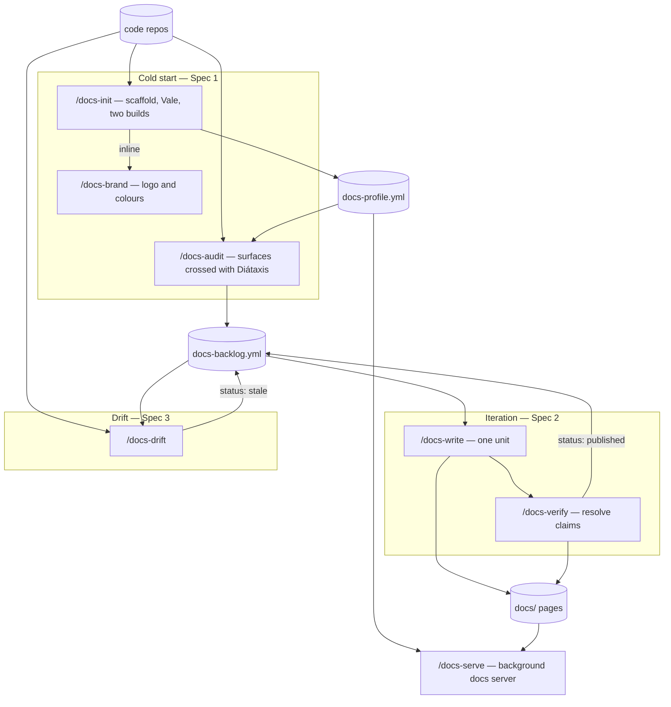
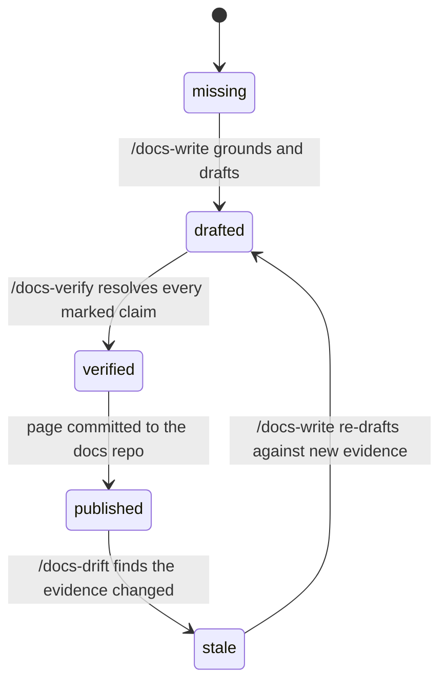
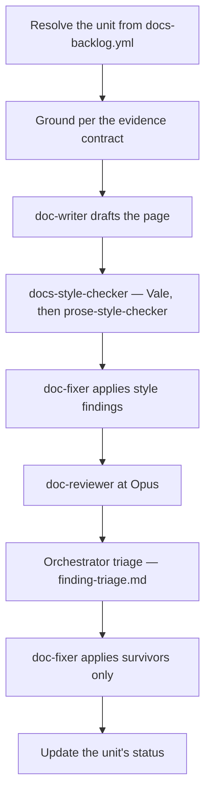

# Design: documentation-workflow family — cold start, iteration, drift

**Date:** 2026-08-29
**Status:** Design approved in brainstorming; not implemented. Spec 1 of 3 specified in full; Specs 2 and 3 specified as contracts only.
**Scope:** `plugins/dev-workflows` only

---

## 1. Problem

A large share of software projects have no product documentation at all, and the gap widens as the project grows: the surface to document expands faster than anyone's willingness to start, and by the time documentation is attempted nobody can say what should exist, in what order, or when it is finished.

`dev-workflows` already has a documentation surface, but every part of it assumes documentation **already exists**:

| Existing | What it assumes |
|---|---|
| `/document` Mode A | A PRD key, a Jira export, PR URLs, a docs repo, and a docs profile. It documents a **delta**. |
| `/document` Mode B | A specific edit the user already knows they want. |
| `/docs-profile` | A docs repo that already exists, to be **described**. |

Nothing answers the cold-start question: *there are no docs and no docs repo — what should exist, in what order do we write it, and how do we know when we are done?* That is a different shape of problem. It is inventory and prioritisation against a denominator derived from code, not diffing against a ticket.

The motivating case is a project with three git repositories (one specs, two code — a Rails backend and a React SPA), a Docker Compose dev stack, and a staging environment that can be walked under several roles. The workflow designed here must not be specific to it.

---

## 2. Scope and decomposition

Three specs, built in order. Each is independently useful, which is the test that the split is real rather than cosmetic.

| Spec | Commands | Ends with |
|---|---|---|
| **1 — Cold start** (this document, in full) | `/docs-init`, `/docs-brand`, `/docs-serve`, `/docs-audit` | A docs repo that builds and serves, and a prioritised backlog |
| **2 — Iteration engine** (contracts only) | `/docs-write`, `/docs-verify` | Pages published, claims confirmed, image slots filled |
| **3 — Drift** (contracts only) | `/docs-drift` | Stale pages detected and re-queued |

Spec 2 is largely a re-wiring of agents that already exist. Spec 3 is meaningless before pages exist. But Spec 1 **writes three artefacts that 2 and 3 consume** — the backlog, the evidence contract, and the walkthrough spec — so those three are frozen here (§8) even though only `/docs-audit` writes them in v1. Designing them later is the retrofit this decomposition exists to avoid.

---

## 3. Decisions

| # | Decision | Rationale |
|---|---|---|
| D1 | **Extend `dev-workflows`; do not create a `doc-workflows` plugin.** | The scaffold's output *is* `docs-profile.yml` — the schema `/docs-profile` writes and `/document` consumes. Splitting plugins separates a schema from one of its writers, and nothing catches the drift because each plugin's gates see only its own tree. `doc-fixer` is already shared by `/epics` and `/document`; `code-scanner` by six commands. And `finding-triage`, `gate-ledger`, `context-management`, `phase-handoff`, `specs-repo-git` cannot be safely duplicated. |
| D2 | **One command family, `audience: user \| engineering` typed onto each backlog unit — not two pipelines.** | The audit is a single pass over the same code and yields both audiences' gaps at once; prioritisation is one backlog or it cannot answer "what is the next most valuable page". What differs by audience is not the pipeline but the **evidence contract** — template, evidence source, verification method, drift signal — so those become two implementations of one interface. |
| D3 | **User-doc evidence is code-first draft plus a human-executed verification walkthrough.** Browser automation is deferred, but the walkthrough is structured from day one so a driver is a runner, not a rewrite. | Screenshot capture is an asset-lifecycle problem, not a capture problem (see the existing images policy: CDN-hosted, immutable URLs, never refreshed in place). And most projects with no docs also have no seeded environment with per-role credentials — making browser grounding core would make the family unportable. |
| D4 | **The later screenshot/verification pass is `/docs-verify`, never `/document`.** | `/document` Mode A requires a PRD key, a Jira export and PR URLs; "add screenshots to the Roles page" is not a delta with a ticket behind it. Mode B has no role model, no grounding and no asset lifecycle. |
| D5 | **The backlog is a tracked file in the docs repo** (`.dev-workflows/docs-backlog.yml`), beside the profile. | Zero external dependencies, reviewable in a PR, git history is the progress record. Jira/GitHub projection is an optional emitter, never the source of truth. |
| D6 | **Coverage denominator = surfaces enumerated from code, crossed with Diátaxis.** | Without a denominator "what is missing" is a vibe. Three of the four Diátaxis quadrants are derivable from code; tutorials are not, and the design says so rather than pretending. |
| D7 | **Volatility de-prioritises but never excludes.** | Documenting a churning surface burns effort and trust; but a churning surface that blocks the primary journey still gets written — in a form that survives churn (concept and reference, not step-by-step screenshots). |
| D8 | **Generator: Material for MkDocs.** | Vale has no MDX parser, so an MDX generator means fighting JSX false positives for the life of the project. Material is pure Markdown, has first-class snippets (`pymdownx.snippets`), and expresses brand colour and logo as ~10 lines of config. The Node alternative, if ever wanted, is VitePress (Markdown-first); Docusaurus is ruled out. |
| D9 | **`/docs-init` picks the generator and nothing else in the family ever learns which one.** | `docs-profile.yml` already abstracts `commands.build`, `dev_servers.servers[].command`/`port`, and `spaces[].content_root`/`snippet_root`. The profile is the seam, which makes D8 far less irreversible than it looks. |
| D10 | **Engineering docs are a section of one site, not a second space.** | Shared snippets, shared search index, working cross-links. `spaces[]` remains available if a project ever needs a genuinely separate site. |
| D11 | **Visibility is a build decision, not a source decision: one source tree, two builds.** | `mkdocs.yml` (public, `exclude_docs` drops the internal prefix) and `mkdocs.internal.yml` (`INHERIT` + full nav). Two outputs, two deploy targets, two hostnames. |
| D12 | **`visibility` is its own unit field, defaulting from `audience` but independently settable.** | They genuinely diverge: API reference is engineering-audience and usually public; a runbook naming hostnames is not. Collapsing them is a quiet wrong default that leaks a year later. |
| D13 | **Vale is the deterministic pre-lint; `prose-style` is the semantic reviewer. Both, at different stations.** | `docs-style-checker` already runs `.vale.ini` as its primary rung with `prose-style-checker` as a complementary pass. `/docs-init` writing `.vale.ini` lights up the existing gate with no new wiring. |
| D14 | **`/docs-brand` is a standalone command *and* a phase of `/docs-init`.** | Rebrands happen; re-scaffolding to pick up a new logo is absurd. This dual shape is the pattern `/docs-profile` already uses (standalone, plus `--inline` from `/document` Phase 0 case (c)). |

---

## 4. The family

| Command | Job | Reuses |
|---|---|---|
| `/docs-init` | Scaffold the docs repo: generator, Diátaxis skeleton, Vale, snippets, two builds, CI; emit `docs-profile.yml` | profile schema, `/docs-brand` inline |
| `/docs-brand` | Extract logo + rough colour scheme from the code repos and apply them | `references/guidelines/accessibility.md` |
| `/docs-serve` | Start/stop/status the docs server in the background; report a reachable URL | profile `dev_servers` |
| `/docs-audit` | Enumerate surfaces, cross with Diátaxis, write the prioritised backlog | `code-scanner`, `docs-grounder`, `jira-reader` (optional) |
| `/docs-write <unit>` | Ground → draft → style → review → publish one backlog unit *(Spec 2)* | `doc-writer`, `docs-style-checker`, `doc-fixer`, `doc-reviewer`, `finding-triage` |
| `/docs-verify <unit>` | Execute the walkthrough, record confirmations, fill image slots *(Spec 2)* | new |
| `/docs-drift` | Re-check pages against the evidence they were built from *(Spec 3)* | `code-scanner`, `diff-summarizer` |

Three new agents only — `docs-auditor`, `ia-planner`, `drift-detector`. Everything else already exists.



Read the diagram as three loops sharing two artefacts. `docs-profile.yml` is what makes the generator choice invisible to everything downstream (D9); `docs-backlog.yml` is what makes "what next" and "are we done" answerable at all. `/docs-serve` sits outside every loop because it is a utility, not a stage — it works on any profiled docs repo, including one this family never scaffolded.

---

## 5. The coverage model

`/docs-audit` cannot list what is missing without a denominator. It builds one from code.

### 5.1 Surfaces

Enumerated mechanically from the scanned repos:

| Surface kind | Derived from | Feeds |
|---|---|---|
| `role` | The authorisation model (roles, permissions, policy objects) | The role axis of every user unit |
| `task` | Routes, controller actions, UI flows, forms | **how-to** guides |
| `concept` | Domain models, the ubiquitous language in the code, state machines | **explanation** pages |
| `reference` | API endpoints, configuration keys, jobs, data schemas, CLI | **reference** pages |
| `service` | Deployables, containers, external integrations | engineering **architecture** pages |
| `decision` | ADRs and ARDs already present in the specs repo | engineering **decision** records |

Roles are a coverage **dimension**, not a nice-to-have: "what can a user in role R actually do" is the question user documentation exists to answer, and it is the reason walkthroughs are role-scoped.

### 5.2 Crossing with Diátaxis

Coverage is a grid of `(surface, audience, type)` cells, each `exists | missing | stale`.

- **user** types: `tutorial`, `how-to`, `reference`, `explanation`
- **engineering** types: `architecture`, `decision`, `runbook`, `api-reference`

Three of the four user quadrants are derivable from code. **Tutorials are not** — a tutorial is a curated primary journey per role. The audit *proposes* tutorial candidates (the shortest path through the highest-value tasks for each role) and a human picks. Stating this plainly is better than pretending the quadrant automates.

### 5.3 Prioritisation

Four signals, combined into a rank with a written `priority_reason` per unit:

1. **Blocks the primary journey** — can a user in role R accomplish the main thing at all without this page? Highest weight.
2. **Role breadth** — how many roles touch the surface.
3. **Evidence availability** — write first what can be grounded now. A page that cannot be verified is a page that ships wrong.
4. **Volatility, inverted** — measured from `git log` density per surface path over a trailing window. High churn lowers rank.

**Guard on signal 4 (D7):** volatility only ever *ranks*; it can never *exclude*. When a high-volatility surface also scores high on signal 1, the unit is written, but its `type` is biased away from step-by-step (`how-to` with screenshots) toward `explanation` and `reference`, which survive churn. The audit records this as `churn_adapted: true` with the reason, so the choice is visible rather than silent.

### 5.4 Definition of done

Documentation work has no natural end, so the family defines one:

> **Done** = every backlog unit at or above a chosen priority threshold has a published page, and every claim on those pages is either evidence-backed or visibly marked.

`coverage` in the backlog reports the fraction per `(audience, type)` cell. "We wrote a lot of docs" is not a completion criterion; a coverage grid with a threshold is.

---

## 6. `/docs-init`

**Signature:** `/docs-init [<docs-repo-path>] [--generator mkdocs-material] [--no-brand] [--public-only]`

Creates a documentation repository that builds, serves, lints, and is profiled. It never writes documentation content beyond a skeleton and its own explanatory stubs.

### Phase 0 — Resolve and validate

1. Resolve the target path (first token, else cwd). Resolve to absolute.
2. Run `specs-preflight` against `$SPECS_PATH` per `references/specs-repo-git.md`, as early as `$SPECS_PATH` is known.
3. The target must be a writable git work tree, or an empty/absent directory that the command offers to `git init`. A non-empty directory that is not a git work tree stops with `NOT_A_GIT_WORKTREE`.
4. **Refuse to scaffold over an existing docs repo.** If ≥ 1 docs signal is present (the `/document` Phase 0 signal set: a `*:start`/`*:build`/`*:lint`/`docs:*` script, `.docstack/`, `mkdocs.yml`, `docusaurus.config.js`, `antora.yml`, `.vale.ini`, `DOCUMENTATION-GUIDELINES.md`, or any `_snippets/`), stop and point at `/docs-profile` instead. Scaffolding is for cold start; describing an existing repo is a different command.

### Phase 1 — Model routing

Invoke the `model-routing` skill. `/docs-init` is **MODERATE**: it is mechanical scaffolding against a known template, and its output is reviewed as a PR. (Contrast `/docs-audit`, which is SIGNIFICANT.)

### Phase 2 — Source repos and toolchain preflight

1. Resolve the code repos to be documented: `ls ${REPOS_PATH:-/workspace}`, plus any explicitly named. Confirm the set with the user. This set is recorded in the profile and reused by `/docs-audit` and `/docs-drift`.
2. Run the toolchain check per `references/toolchain-preflight.md` for the tools the scaffold's own gates will need — `python3`/`pip` (or `uv`), `mkdocs`, `vale`, `git`. Prompt only when something required is missing, Cancel recommended.

### Phase 3 — Scaffold

Writes, at the repo root:

```
mkdocs.yml                  # public build; strict: true; exclude_docs drops internal/
mkdocs.internal.yml         # INHERIT: mkdocs.yml + internal nav, builds everything
.vale.ini
docs/
  index.md
  tutorials/                # Diátaxis skeleton, one stub per quadrant
  guides/
  reference/
  explanation/
  internal/                 # engineering docs; excluded from the public build
    architecture/
    decisions/
    runbooks/
  _snippets/                # pymdownx.snippets base_path
  assets/                   # logo, favicon, images
  stylesheets/extra.css     # brand CSS variables
.dev-workflows/
  docs-profile.yml
.github/workflows/docs.yml  # build both, lint, and the two visibility gates
```

Each Diátaxis directory gets **one stub page that explains what belongs there and what does not**. This is not filler: the single most common failure of a Diátaxis tree is contributors putting explanation into how-to guides, and the stub is where that is prevented.

`mkdocs.yml` sets `strict: true` and:

```yaml
validation:
  nav:
    omitted_files: warn
    absolute_links: warn
```

so that a public page linking into `internal/` becomes a **build failure** rather than a broken link discovered later.

### Phase 4 — Vale

Writes `.vale.ini`:

```ini
StylesPath = styles
MinAlertLevel = suggestion
Packages = Google, write-good
Vocab = Project

[*.md]
BasedOnStyles = Vale, Google, write-good
```

then runs `vale sync` to download the packages, and seeds `styles/config/vocabularies/Project/accept.txt` from the domain nouns `/docs-audit` extracts for its `concept` surfaces (when the audit has already run; otherwise the file is created empty with a comment pointing at `/docs-audit`).

**Seeding the vocabulary is not a nicety.** Without it every product term is reported as a spelling error on day one and the team turns Vale off in week two.

`Packages` load in order with later entries overriding earlier ones, so a project package added later can override Google's rules without editing them.

### Phase 5 — Branding

Runs `/docs-brand --inline` (§7) unless `--no-brand`. Inline mode skips `/docs-brand`'s own preflight and PR steps and returns its result into this run's single PR.

### Phase 6 — Profile

Writes `.dev-workflows/docs-profile.yml` conforming to `references/docs-profiles/docs-profile-schema.md`, plus the three new fields in §8.5.

### Phase 7 — Verify the scaffold

The scaffold is not finished until it demonstrably works. In order:

1. `mkdocs build --strict -f mkdocs.yml` succeeds (public).
2. `mkdocs build --strict -f mkdocs.internal.yml` succeeds (internal).
3. `vale docs/` runs and returns (findings are informational at this stage; the run must not error on configuration).
4. The visibility gate (§9.3) passes against the public build output.

A failure at any step is reported and left unfixed rather than worked around; a scaffold that cannot build is not a scaffold.

### Phase 8 — Finish

Branch, commit, and draft a PR message. Never pushes, never merges — same discipline as `/docs-profile`. Then the standard emitter tail: feedback → follow-ups → cost → `resume.md` → `commit-artifacts`, and exactly one `Specs repo:` line.

---

## 7. `/docs-brand`

**Signature:** `/docs-brand [<docs-repo-path>] [--from <code-repo-path>] [--inline]`

Extracts a logo and a rough colour scheme from the product's own code and applies them to the docs site. Expectations are deliberately modest: a mark and a primary/accent pair, not a design system.

### 7.1 Extraction

**Colour**, in precedence order, first hit wins and the source is recorded:

1. Tailwind config `theme.extend.colors` (`primary`, `brand`, or the first non-neutral entry)
2. CSS custom properties matching `--(color-)?(primary|brand|accent)`
3. A MUI `createTheme({ palette: { primary, secondary } })` call
4. `manifest.json` / `site.webmanifest` `theme_color`
5. SCSS/LESS variables matching `$(primary|brand|accent)`

**Logo**, preferring SVG over PNG, and larger over smaller: `public/`, `src/assets/`, `static/`, files matching `logo*`/`brand*`/`icon*`, `favicon.*`, and manifest `icons[]`.

### 7.2 Application

Material takes hex brand colours through a custom palette plus CSS variables — named palette colours do not accept hexes:

```yaml
theme:
  palette:
    primary: custom
  logo: assets/logo.svg
  favicon: assets/favicon.png
extra_css:
  - stylesheets/extra.css
```

```css
:root > * {
  --md-primary-fg-color:        #<primary>;
  --md-primary-fg-color--light: #<primary-light>;
  --md-primary-fg-color--dark:  #<primary-dark>;
  --md-accent-fg-color:         #<accent>;
}
```

Light and dark variants are derived from the primary when the source supplies only one value.

### 7.3 Honesty and accessibility

- **Never applies silently.** The command prints each extracted value with the file and line it came from, and asks to confirm. A wrong brand colour applied quietly is worse than no branding.
- **Contrast check.** The derived palette is checked against `references/guidelines/accessibility.md`; a primary that fails contrast on body text is reported as a finding with the measured ratio, not silently accepted. A brand colour that fails is still applied if the user confirms — it is their brand — but the finding is recorded in the PR message.
- **Copies, never links.** Logo assets are copied into `docs/assets/`; the docs build never reaches into a code repo at build time.

---

## 8. Frozen contracts

These are written by Spec 1 and consumed by Specs 2 and 3. They are frozen here because they are the expensive things to change later.

### 8.1 `.dev-workflows/docs-backlog.yml`

```yaml
schema_version: 1
generated_at: 2026-08-29
generated_by: docs-audit
sources:                              # every repo scanned, at the ref scanned
  - { repo: example-webapp, path: /workspace/example-webapp, ref: <sha>, scanned_at: <iso8601> }
  - { repo: example-api,     path: /workspace/example-api,     ref: <sha>, scanned_at: <iso8601> }
surfaces:                             # the denominator, enumerated once
  - id: order-placement
    kind: task                        # role|task|concept|reference|service|decision
    title: "Place an order"
    roles: [customer, admin]
    evidence:
      - { repo: example-webapp, path: src/routes/orders/new.tsx }
      - { repo: example-api,     path: app/controllers/api/v2/orders_controller.rb }
    volatility: high                  # high|medium|low, from git log density
units:                                # what gets written; many units per surface
  - id: U-001
    surface: order-placement
    title: "Place an order"
    audience: user                    # user|engineering
    visibility: public                # public|internal — defaults from audience, set independently
    type: how-to                      # user: tutorial|how-to|reference|explanation
                                      # engineering: architecture|decision|runbook|api-reference
    roles: [customer]
    priority: 1
    priority_reason: "blocks primary journey; 2 roles; evidence available"
    churn_adapted: false
    status: missing                   # missing|drafted|verified|published|stale
    page_path: docs/guides/place-an-order.md   # assigned when written
    walkthrough: null                 # W-001 once composed
    blocked_by: []
coverage:
  user:        { tutorial: "0/2", how-to: "3/14", reference: "0/6", explanation: "1/5" }
  engineering: { architecture: "0/3", decision: "2/2", runbook: "0/4", api-reference: "0/1" }
threshold: 2                          # "done" = every unit with priority <= threshold is published
```

**Why surfaces and units are separate tables:** one surface spawns several units across quadrants, and **drift is detected per surface and then fans out to its units**. A single flat list would either duplicate the evidence per unit or lose the fan-out. `sources[].ref` is what makes drift computable at all, and it is the same idea as `prep.scanned_ref` in `references/read-only-repos.md`.

### 8.2 The evidence contract

The interface, with two implementations:

| | `audience: user` | `audience: engineering` |
|---|---|---|
| Template | Diátaxis quadrant | arc42/C4 section, MADR, runbook, generated API reference |
| Evidence source | Routes, views, i18n strings, plus a walkthrough | Code, config, ARDs and design docs from the specs repo |
| A claim is resolved by | **Observation** — a walkthrough step confirms it | **Code read** — delegated to `references/source-truth.md` |
| Drift signal | Behaviour change: routes, labels, flows | Structure change: interfaces, modules, dependencies |

A page records its sources in frontmatter. Individual sentences are **not** tracked; only claims that could not be verified are marked inline, reusing the `[NEEDS CLARIFICATION]` vocabulary `/idea` already establishes.

**The hard rule: a marked claim never becomes prose fact by default.** It is either confirmed by a verification pass or it ships visibly marked. This is what prevents the backlog reporting green on prose nobody checked.

### 8.3 The walkthrough spec

Structured from day one so that a browser backend is a runner rather than a rewrite (D3):

```yaml
walkthrough:
  id: W-001
  unit: U-001
  role: customer
  environment: docker | staging        # which environment it was written against
preconditions:
  - "catalog seeded"
  - "signed in as customer"
steps:
  - n: 1
    action: navigate                   # navigate|click|type|select|wait
    target: "/orders/new"
    expect: { kind: heading, text: "New order" }
  - n: 2
    action: click
    target: { label: "Add item" }
    expect: { kind: visible, label: "Item details" }
captures:
  - { slot: img-order-form, after_step: 2, shows: "the empty order form with the item panel open" }
```

**v1 execution:** rendered as a numbered checklist. Per step the human answers `confirmed` / `differs` / `blocked`, and **`differs` records the actual observed text**, which turns a walkthrough into a correction rather than a red X. Results are written back as `result:` on each step.

**v2 execution:** a driver executes the identical file. No format change.

### 8.4 Image slots

`captures[].slot` names a placeholder the writer leaves in the page. The verification pass produces the image; the human performs the CDN upload and hands back a URL; the docs edit is a URL swap. This follows the existing image policy exactly: CDN-hosted, immutable URL, **an image is never refreshed in place** — every replacement is a new URL.

Deferring browser capture therefore does **not** mean pages ship imageless. It means the slot is declared by the writer and filled by the verification pass.

### 8.5 Profile additions

Three optional fields, additive to `references/docs-profiles/docs-profile-schema.md`:

```yaml
generator: mkdocs-material            # informational; consumers still go through commands.*
builds:                               # two builds from ONE content root
  - { id: public,   config: mkdocs.yml,          command: "mkdocs build --strict -f mkdocs.yml",          out: site,          visibility: public }
  - { id: internal, config: mkdocs.internal.yml, command: "mkdocs build --strict -f mkdocs.internal.yml", out: site-internal, visibility: internal }
dev_servers:
  servers:
    - { space: docs, command: "mkdocs serve -a 0.0.0.0:8000", port: 8000, public_base_url: "http://localhost:8001" }
```

**Why `builds:` rather than a second `spaces[]` entry:** `spaces[]` is defined by content-root ownership — "a page belongs to whichever entry's `content_root` prefixes its path". Two spaces sharing one root breaks that rule. Two builds over one root is a different axis and needs its own field.

`public_base_url` exists because a command running inside a container cannot infer the host's published port mapping (§10.2).

---

## 9. Visibility

### 9.1 Model

One source tree, shared snippets, working cross-links. Two builds:

- **public** — `mkdocs.yml`, `exclude_docs` drops `internal/` (gitignore-style patterns, MkDocs 1.6+)
- **internal** — `mkdocs.internal.yml`, `INHERIT: mkdocs.yml` plus the internal nav, builds everything

Two outputs, two deploy targets, two hostnames. Separate hostnames rather than a protected path prefix: path-prefix protection is easy to misconfigure and fails open. Protection at the internal host is the project's own choice — basic auth at a reverse proxy, an SSO proxy, a private host, or a VPN. The family does not implement authentication; it produces two artefacts and states which is which.

### 9.2 Trap 1 — the dev server does not exclude

As of MkDocs 1.6, `exclude_docs` **does not apply to `mkdocs serve`**. Excluded pages still render locally. That is convenient for authoring and dangerous for verification: *what you see locally is not what ships*.

**Rule: visibility is never confirmed by looking at the dev server.** It is confirmed against built output only.

### 9.3 Trap 2 — snippets cross the boundary invisibly

An internal snippet included into a public page leaks its **content** even though every file sits in the correct directory. A path-based rule cannot catch this, because no path is wrong.

Therefore two CI gates, both on **built output**:

1. **Public build with `strict: true`** plus `validation.nav.*: warn` — a public page linking into `internal/` becomes a build failure. Free, and catches the link class completely.
2. **Marker grep over the public build output** — every file under `docs/internal/` and every internal snippet carries a marker comment; the gate fails if the marker appears anywhere in the public `site/` output. This catches snippet-level leakage that paths and links both miss.

Gate 2 is the same technique as verifying a history rewrite by grepping the resulting blobs: assert on the artefact, not on the intent.

---

## 10. `/docs-serve`

**Signature:** `/docs-serve [--internal] [--stop] [--status] [--build] [--port <n>]`

Profile-driven, so it works on any profiled docs repo — including one `/document` is working in, not only one `/docs-init` scaffolded.

### 10.1 Behaviour

1. Resolve the docs repo the same way `/document` Phase 0 does (cwd with signals → `$DOCS_PATH` → search `$REPOS_PATH` → ask).
2. Read `dev_servers` from the profile. `--internal` selects the internal build's server; default is public.
3. **Already-running detection** — if the port answers and the response identifies the docs site, report the existing URL and stop. Never start a second server.
4. **Port collision** — if the port is occupied by something else, pick the next free port, use it, and say so explicitly.
5. Start the command with Bash `run_in_background`.
6. **Poll for readiness** up to `dev_servers.readiness_timeout_seconds` (default 120), then print the URL.
7. Record the pid and port under `.dev-workflows/` so `--stop` and `--status` work across sessions.

`--build` runs the profile's build command and exits without serving. No separate `/docs-build` command: the pipeline already gates on the profile's build, and a flag is cheaper than a command.

### 10.2 Container reachability

Two rules, both learned from how containerised stacks actually behave:

- **Bind `0.0.0.0`, never `localhost`.** A server bound to the container's loopback is unreachable from the host, which is where the browser is.
- **Report the host-visible URL, not the in-container one.** From inside a container the command cannot infer the published port mapping, so it reports `public_base_url` from the profile when set, and otherwise reports the in-container URL **with an explicit caveat** naming the likely mismatch. It never silently prints a URL that will not open.

A port-shifted stack (a project whose Postgres and Redis are moved off the standard ports to coexist with another project's containers) is the normal case, not the exotic one; guessing the mapping would be wrong more often than right.

---

## 11. `/docs-audit`

**Signature:** `/docs-audit [--audience user|engineering|both] [--refresh] [--threshold <n>]`

### Phase 0 — Resolve

Docs repo and profile as above; `specs-preflight`; source repos from the profile's recorded set (confirm if absent).

### Phase 1 — Model routing

**SIGNIFICANT.** It is a cross-cutting synthesis of every scanned repository whose output steers every later `/docs-write` run — the same argument `/docs-profile` makes for itself. A wrong backlog has a large blast radius.

### Phase 2 — Scan

Dispatch `code-scanner` per repo in a **single response**, capped at 4 concurrent, per `classification.md` §8. Each scanner returns its `prep` block (`read_only`, `scanned_ref`, `ref_committed_at`, `head_divergence`) per `references/read-only-repos.md`; `scanned_ref` is recorded in `sources[]`.

Optionally dispatch `docs-grounder` against `$DOCS_PATH` and `jira-reader` when a Jira export exists, both advisory.

An inconclusive theme gets one narrow round 2 seeded with round 1's verified anchors (§8.5), and a theme still unresolved after round 2 is **named** in the output, never flattened into a gap — a gap asserts absence, an unresolved theme asserts only that the scan could not tell.

### Phase 3 — Enumerate surfaces (`docs-auditor`)

Produces the `surfaces[]` table per §5.1, including `volatility` from `git log` density per surface path.

### Phase 4 — Type and prioritise (`ia-planner`)

Crosses surfaces with Diátaxis per §5.2, applies the four prioritisation signals per §5.3 with a written `priority_reason` per unit, defaults `visibility` from `audience` (D12), and proposes tutorial candidates for human selection.

### Phase 5 — Reconcile with what exists

On `--refresh`, existing pages are matched to units and marked `published`; units with no page stay `missing`. Coverage is computed. **A unit is never silently deleted** — a unit that no longer has a surface is marked `blocked_by: [surface-removed]` and reported, because a surface disappearing from a scan is as likely to be a scan failure as a real removal.

### Phase 6 — Write and report

Writes `.dev-workflows/docs-backlog.yml`, prints the coverage grid and the top N units with reasons, then the standard emitter tail.

**`/docs-audit` writes no documentation content.** Its output is a backlog and a coverage grid.

---

## 12. Specs 2 and 3 — contracts only

### 12.1 `/docs-write <unit-id>` (Spec 2)

Deliberately boring; it is the existing chain with a new front-end:

```
resolve unit → ground (code-scanner / docs-grounder / ARDs per the evidence contract)
  → doc-writer → docs-style-checker (Vale + prose-style-checker) → doc-fixer
  → doc-reviewer @ Opus → orchestrator triage (finding-triage.md) → doc-fixer on survivors
  → write page → update unit status → emitter tail
```

Classification is usually MODERATE for a single unit. The one genuinely new gate:

> **A unit may not be marked `published` while it carries unconfirmed claims.** It goes to `verified` only after `/docs-verify` resolves them.

### 12.2 `/docs-verify <unit-id>` (Spec 2)

**Two backends, matching the two implementations of the evidence contract (§8.2)** — one command, not two:

- **`audience: user`** — composes or loads the unit's walkthrough (§8.3), renders it as a checklist, records `confirmed`/`differs`/`blocked` per step with the observed text on `differs`, and collects image slots for CDN upload.
- **`audience: engineering`** — re-reads the claims against the code and the specs-repo artefacts they cite, delegating to `references/source-truth.md`. No walkthrough; the same status transition.

Both resolve marked claims and move the unit `drafted → verified`. v2 adds a browser driver behind the user backend, with no change to the file format.

### 12.3 `/docs-drift` (Spec 3)

For each surface, diff `sources[].ref` → `HEAD` restricted to the surface's evidence paths, summarising via `diff-summarizer`. A non-empty diff marks that surface's units `stale` with the reason, and re-queues them. `sources[].ref` advances only when the resulting stale units have been re-verified — otherwise a drift run would erase the very evidence that a page is out of date.

---

## 13. Integration and cost

### 13.1 Reused unchanged

`model-routing`, `specs-repo-git` (`specs-preflight` + `commit-artifacts`), `finding-triage`, `gate-ledger`, `context-management` read-failure tiers, `toolchain-preflight`, `read-only-repos`, `prose-formatting`, `cost-emission`, `feedback-emission`, `followup-emission`, `session-hygiene`, `doc-structure-conventions`, `source-truth`, `pre-lint`, `references/guidelines/accessibility.md`. Agents: `code-scanner`, `docs-grounder`, `jira-reader`, `diff-summarizer`, `doc-writer`, `doc-reviewer`, `doc-fixer`, `docs-style-checker`, `impl-maintenance`.

### 13.2 Changed

- `references/docs-profiles/docs-profile-schema.md` — three optional fields (§8.5) plus their field rules.
- New `references/docs-workflow/` directory holding the coverage model, the backlog schema, the evidence contract, and the walkthrough spec — kept self-contained so a later extraction to a separate plugin stays cheap (D1).

### 13.3 Gate impact, stated up front

| Inventory | Before | After |
|---|---|---|
| Commands | 21 | 28 |
| Agents | 33 | 36 |
| `docs/` pages | 34 | 45 (7 command pages + 4 reference pages) |
| Reference files | 98 | 98 + `references/docs-workflow/*` |

`scripts/check-docs.sh` enforces command/agent/reference/hook/skill inventories in both directions plus prose counts in six places; every number above must be updated in the same change, and the gate will name each stale one. `scripts/check-id-grammar.sh` applies to the new reference files. The `plugin.json` and `marketplace.json` descriptions are capped at 1024 characters and are already tight: the new capability **replaces** wording, it never appends.

---

## 14. Documentation deliverable

`scripts/check-docs.sh` fails the build until this is complete, so it is **part of the change, not a follow-up**. The checks that bite here are the command / agent / reference inventories in both directions, the six prose counts, the 200-character table-cell cap, and the identity quarantine — no page under `docs/` may name a marketplace or a container repo, `getting-started.md` being the single sanctioned exception.

Every claim on every new page is derived from **the thing that runs it**: a synopsis from the command's argument-parsing phase, phases from its `## Phase` headings, gates from its reviewer dispatch, the agent inventory from `agents/`. Not from this design document, which will drift from the implementation the moment the implementation starts.

### 14.1 Plugin README

The README is a role-indexed pointer table, not prose. The family adds one row and extends one:

| Role | Commands | What it does |
|------|----------|--------------|
| Docs | `/docs-init`, `/docs-audit`, `/docs-write`, `/docs-verify`, `/docs-drift` | Scaffold a documentation repository, audit what is missing, then write, verify and maintain it one unit at a time. |

`/docs-brand` and `/docs-serve` join the existing *Anytime — maintenance* row beside `/docs-profile`, because both are utilities you reach for at any point rather than stages of the pipeline.

The README also carries **the family diagram from §4**, under a `## Documentation workflow` heading placed directly after the role table. A reader deciding whether this family is for them needs the shape before the command list; a table of seven command names does not convey that three of them form a loop. Every cell stays under 200 characters.

### 14.2 New `docs/` pages

Seven command pages under `docs/commands/` — `docs-init.md`, `docs-brand.md`, `docs-serve.md`, `docs-audit.md`, `docs-write.md`, `docs-verify.md`, `docs-drift.md` — each following the established page shape: synopsis, when to use it, prerequisites, phases, gates, outputs, failure modes.

Four reference pages under `docs/reference/`, mirroring the new `references/docs-workflow/` directory:

| Page | Covers |
|---|---|
| `docs-coverage-model.md` | Surfaces, the Diátaxis crossing, the four prioritisation signals, the definition of done (§5) |
| `docs-backlog.md` | The backlog schema, the unit status lifecycle, why surfaces and units are separate tables (§8.1) |
| `docs-evidence.md` | The evidence contract and the walkthrough spec, including the marked-claim rule (§8.2, §8.3) |
| `docs-visibility.md` | The two-build model, both traps, and the two output-level gates (§9) |

`docs/README.md` gains rows in the "I want to…" table — *start documenting a project that has no docs* → `/docs-init`, `/docs-audit`; *write the next page* → `/docs-write`; *check the docs still match the code* → `/docs-drift`; *open the docs in a browser* → `/docs-serve`. `docs/workflow.md` gains the family as a fourth stage on the existing pipeline diagram, and `docs/roles-and-phases.md` gains the Docs role.

### 14.3 Which diagram lives where

| Diagram | Lives in | Why there |
|---|---|---|
| Family data flow (§4) | Plugin README, `docs/workflow.md`, `docs/reference/docs-coverage-model.md` | It is the only view that shows the three loops and the two shared artefacts |
| Unit status lifecycle (below) | `docs/reference/docs-backlog.md` | It is the schema's `status` enum, drawn — so it belongs beside the schema |
| `/docs-write` pipeline (below) | `docs/commands/docs-write.md` | Matches the per-command linear phase-chain convention already used by `idea.md`, `design.md`, `document.md` |

**Unit status lifecycle:**



`drafted → published` is deliberately **not** a legal transition. That single missing edge is what stops the coverage grid reporting green on prose nobody checked, and it is the reason `verified` exists as a state rather than a boolean on the page.

**`/docs-write` pipeline** — the chain is almost entirely existing machinery, which is the point:



### 14.4 Counts to update in the same change

`check-docs.sh` cross-checks six inventories plus the cost-emitting set against prose counts scattered across the tree. Each must move together: commands 21 → 28, agents 33 → 36, reference files 98 → 98 plus `references/docs-workflow/*`, docs pages 34 → 45. `CLAUDE.md`'s command list, agent list and workflow map are updated in the same commit, and each new command that hands `emit-cost` a fixed `phase`/`role` pair needs its matching row in `references/cost-emission.md` §7 — check 8 fails in both directions, so a row without a command is as red as a command without a row.

---

## 15. Non-goals

- **No authentication implementation.** The family produces a public and an internal build; protecting the internal host is the project's infrastructure choice.
- **No hosting or deployment.** CI builds both outputs; where they are deployed is out of scope.
- **No browser automation in v1** (D3), and no screenshot capture. The walkthrough format is designed for it; the driver is not built.
- **No multi-product docs repo.** One product per docs repo, consistent with the existing simplification.
- **No second generator in v1** (D8/D9). The profile makes adding one a new template, not a rewrite.
- **No re-encoding of public style guides.** Vale packages are maintained by their owners; the scaffold references them.
- **`/docs-audit` writes no prose.**

---

## 16. Risks

| Risk | Mitigation |
|---|---|
| The audit produces a large, discouraging backlog | `threshold` plus the four prioritisation signals; the report leads with the top N and the coverage grid, not the full list |
| Diátaxis is applied mechanically and produces four thin pages per surface | `ia-planner` assigns types per surface based on what the surface actually is; not every surface earns all four quadrants |
| Volatility inversion permanently defers the hard parts | D7's guard: ranks but never excludes; high-value churning surfaces are written in churn-resistant forms with `churn_adapted: true` recorded |
| Python toolchain in a Ruby/Node shop is resented | The docs repo is a separate repo with its own toolchain; D9 keeps the choice reversible behind the profile |
| Internal content leaks into the public build | Two output-level gates (§9.3), not discipline |
| `dev-workflows` becomes unmanageable at 28 commands | New references kept in their own directory so extraction stays cheap; revisit after Spec 2 |
| The backlog goes stale as a file | `/docs-drift` (Spec 3) is what keeps it live; until Spec 3 exists, `--refresh` is manual and that limitation is stated |

---

## 17. Open questions

1. **Does `docs-frontmatter` need to own the evidence frontmatter block?** The skill owns frontmatter for docs repos. The evidence block (§8.2) is new frontmatter. Either the skill absorbs it or the family declares a reserved key it does not touch. To settle in Spec 2, when the block's shape is exercised.
2. **Tutorial selection UX.** The audit proposes candidates and a human picks; whether that is an interactive prompt in `/docs-audit` or a marked section of the backlog to edit is unsettled.
3. **Jira/GitHub projection of the backlog** (D5's optional emitter) is named but not designed. Deferred until someone needs it.
