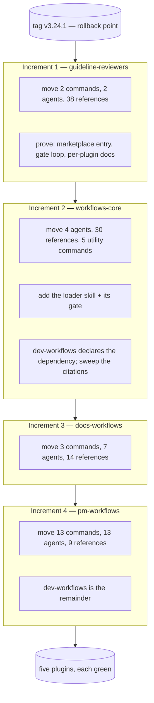

# Design: splitting the marketplace into five plugins

**Date:** 2026-09-02
**Status:** Design approved in brainstorming; not implemented.
**Scope:** the whole marketplace — `plugins/dev-workflows` becomes five plugins
**Rollback point:** tag `v3.24.1`, taken deliberately before this work
**Related:** `2026-08-29-docs-workflow-family-design.md`, whose implementation waits on this

---

## 1. Problem

`dev-workflows` carries 28 commands, 38 agents, 105 reference files, 43 documentation pages, 2 skills and 5 hooks. It is one plugin because it started as one, not because its contents belong together: the two guideline reviewers share nothing with the PRD pipeline, the BRD route shares nothing with `/vuln`, and someone who wants documentation workflows installs the whole of it.

The immediate trigger is the documentation-workflow family designed in `2026-08-29-docs-workflow-family-design.md`. Building it inside `dev-workflows` means writing every shared-reference citation as a direct file read and rewriting all of them later; born in the right plugin, they are written once. That design's D1 chose to extend rather than split on grounds its own §13.5 later weakened — the shared invariants *can* be shared, because Claude Code supports plugin dependencies natively.

**What makes this tractable now:** the specs-native pipeline has completed, so the tree is stable. Increment E landed, the tracker round-trip and `$VAULT_PATH` are gone, and the shared surface can be measured rather than guessed.

---

## 2. What the tree actually says

Measured at `v3.24.1`. Agents attributed by `subagent_type` dispatch (transitively, since agents dispatch agents); references by citation from commands and from agents, with each agent attributed to its dispatching commands' groups.

| Plugin | Commands | Agents | References |
|---|---|---|---|
| `workflows-core` | 5 | 4 | 30 |
| `pm-workflows` | 13 | 13 | 9 |
| `dev-workflows` | 5 | 12 | 14 |
| `docs-workflows` | 3 | 7 | 14 |
| `guideline-reviewers` | 2 | 2 | 38 |
| **Total** | **28** | **38** | **105** |

The totals reconcile exactly against the tree, with no remainder. Two findings shaped everything that follows.

**The core is tiny in agents and large in references.** Four agents of thirty-eight; thirty references of one hundred and five. The intuition — that the shared thing is the agents — is wrong, and it matters because **agents cross a plugin boundary for free and references do not** (§4). So the split's real work sits in the part that looked incidental.

**The guideline reviewers are a self-contained island.** Two commands, two agents, and 38 reference files — 36% of the reference weight — reading nothing outside themselves but a single shared `accessibility.md`. They do not even use model-routing; `CLAUDE.md` exempts them. Extracting them removes more bulk than any other single move and risks nothing.

---

## 3. Decisions

| # | Decision | Rationale |
|---|---|---|
| S1 | **Five plugins:** `workflows-core`, `pm-workflows`, `dev-workflows`, `docs-workflows`, `guideline-reviewers`. | The role model in `docs/roles-and-phases.md` already assigns every command a role, so the allocation is derived rather than invented. It resolves 27 of 28; `/release-notes` was the exception and is settled by S2. |
| S2 | **`/release-notes` goes to `docs-workflows`.** | Its PM assignment came from a tracker rule — a ticket's status could not advance without release notes — which no longer applies. It already resolves clones under `$REPOS_PATH`, which `docs-workflows` needs for `/document` regardless. And under the docs-family design its output is the evidence behind every What's-new page, so co-locating makes that integration intra-plugin instead of a cross-plugin contract. |
| S3 | **Core carries the five utility commands**, not only components. | `/feedback` and `/prompt` log friction about the plugin family itself and emit cost entries; `/statusline`, `/prompt-brainstorm` and `/prompt-grill-me` are equally family-meta. They belong wherever the shared machinery lives, and a dependency means anyone installing pm, dev or docs gets them automatically. |
| S4 | **`docs-grounder` is a core agent**, despite the name. | Nine consumers — eight in pm, one in docs — so it spans groups. It is dispatched from inside `references/docs-grounding.md` rather than by a command, which is why a direct-dispatch scan misses it. A scan that only reads commands would have put it in the wrong plugin. |
| S5 | **Shared references cross the boundary through one argument-taking loader skill, not 28 named wrappers.** | `${CLAUDE_PLUGIN_ROOT}` resolves to the *reading* plugin, so a dependency installs the core without granting file access. Skills do cross, and they take arguments (`$ARGUMENTS`, `$N`), so one skill serves every reference. The objection to a loader — a typo misfires silently where a named wrapper cannot — is answered by a gate rather than by 28 files (§6). |
| S6 | **Dependencies are declared bare-name**, tracking latest. | A version-ranged dependency resolves against *git tags*, and one repo tag cannot express five plugin versions — that would force per-plugin tags and a release-process change. While every plugin ships from one repository at one commit, ranges buy nothing. |
| S7 | **Each plugin owns its own `docs/` tree**, and `check-docs.sh` loops over the plugin list. | Documentation ships with the plugin that owns it, which is the point of splitting. The gate's inventory, orphan and prose-count checks already work per plugin; the change is mostly the loop. |
| S8 | **`dev-workflows` goes to 4.0.0; the four new plugins start at 1.0.0.** | Moving commands out breaks every `/dev-workflows:<cmd>` invocation, which is a major change. `pm-workflows` starting at 1.0.0 reads oddly given it inherits most of the history, but a version describes a plugin's own interface, not the provenance of its files. |
| S9 | **Build order: guidelines → core → docs → pm**, with `dev-workflows` as the remainder. | Separates two unknowns that a core-first order conflates. Guidelines needs no loader, no dependency and no citation rewrite, so it proves the multi-plugin plumbing — marketplace registration, the gate loop, per-plugin docs, installation — at zero risk. Core then introduces the genuinely new mechanisms against a repo where that plumbing is known to work. |
| S10 | **The namespaced sweep is a first-class step, gated in both directions.** | `subagent_type: "dev-workflows:<agent>"` and `/dev-workflows:<cmd>` appear throughout the commands, `CLAUDE.md`'s workflow map, 43 documentation pages and the next-phase-offer machinery. It is the largest mechanical risk in the job, and it is grep-able, which is what makes it safe rather than merely large. |

---

## 4. What crosses a plugin boundary

This is the distinction the whole design turns on.

| Shared thing | Crosses? | How |
|---|---|---|
| **Agents** | **Yes** | `subagent_type: "<plugin>:<agent>"`. Already in production: `/epics` and `/create-prd` invoke `prose-style:prose-style-checker` today |
| **Skills** | **Yes** | `Skill(skill: "<plugin>:<skill>")`, with arguments |
| **Commands** | N/A | User-facing; not invoked by other plugins |
| **Reference files** | **No** | `${CLAUDE_PLUGIN_ROOT}` resolves to the reading plugin's own directory. A dependency guarantees installation, never file access |
| **Hooks** | **No** | Each plugin ships its own; `${CLAUDE_PLUGIN_ROOT}` is correct as written |

So the cost of the split is **not** duplicated invariants. It is one mechanism for reading a core reference from another plugin, plus the sweep that switches every citation to it.

---

## 5. The loader skill

`workflows-core/skills/reference/SKILL.md`:

```markdown
---
name: reference
description: Read a shared workflows-core reference by name, and optionally execute one of its entry points.
user-invocable: false
allowed-tools: Read
---

Read `${CLAUDE_PLUGIN_ROOT}/references/$0.md` and treat it as the single source
of truth for the current step. When `$1` is present, execute that entry point of
it inline. Never paraphrase, summarise, or cache its contents.
```

Invoked from any dependent plugin:

```
Skill(skill: "workflows-core:reference", args: "finding-triage")
Skill(skill: "workflows-core:reference", args: "specs-repo-git specs-preflight")
```

Positional arguments are what let one skill serve both shapes of reference — the documents a command reads (`prd-format`, `prose-formatting`) and the procedures it executes (`specs-repo-git specs-preflight`, `phase-handoff require-on-main`). Without `$1` the procedures would each need their own wrapper, and the hybrid this replaces would be back.

**`model-routing` keeps its own named skill.** It is invoked by name at a fixed point in every pipeline command, its own description documents that contract, and collapsing it into the loader would lose a call site that is already correct.

---

## 6. Gate changes

Three of the repository's checks are plugin-aware and one new check is needed.

**`check-docs.sh` — parameterise `PLUGIN_REL`.** It is a single constant at line 20 driving eleven checks over 51 selftest cases. It becomes a list, and each check runs per plugin. Most checks already work per plugin unchanged: inventories in both directions, orphan pages, environment variables, table cells, prose counts.

Two need real thought rather than a loop:

- **Check 7** (`getting-started.md`'s install commands match the repo-root README verbatim) assumes one plugin. With five, the root README carries five install lines and each plugin's getting-started carries its own. The check becomes per-plugin: each plugin's install block must match *its* line in the root README.
- **Check 11** (the `/brd-*` `choices:` placeholder rule) follows the BRD commands into `pm-workflows`, and its family derivation reads `next-phase-offer.md`, which lands in core. The check must resolve a core reference from outside the plugin it is checking — a script-level concern, not a runtime one, since the gate reads the repository directly.

**A new check: the loader contract, in both directions.** Every `args:` string passed to `workflows-core:reference` must name a reference that exists in core, and every core reference must be reached by at least one caller. This is what buys back the typo-safety a named wrapper would have given, and it is the same both-directions shape the inventory checks already use.

**`check-id-grammar.sh` and `validate-catalog.py` need no change** — both are plugin-agnostic today (zero references to `dev-workflows` in either).

---

## 7. Build order



### Increment 1 — `guideline-reviewers`

Move `/api-guideline-reviewer`, `/guideline-reviewer`, their two agents, and `references/api-guidelines/**` plus `references/guidelines/**`. Register in `marketplace.json`. Give it its own `docs/` tree. `guidelines/accessibility.md` moves with the rest of the corpus. It is the one file the documentation family will later want — `/docs-brand` contrast-checks against it — but that family does not exist yet, so nothing is copied pre-emptively for a consumer that has no code. The decision is deferred to the point it becomes real (§10 Q1).

**Nothing here needs the loader, a dependency, or a citation rewrite.** That is the point: it proves plugin creation, registration, the `check-docs.sh` loop, per-plugin documentation and installation, with no coupling in play.

*Verification:* both commands run from the new plugin; `dev-workflows` has 26 commands and 67 references and its gates pass; the new plugin's gates pass.

### Increment 2 — `workflows-core`

Create the plugin with the four core agents, the thirty core references, the five utility commands, the `model-routing` skill and the new loader skill. `dev-workflows` declares `"dependencies": ["workflows-core"]`.

Then the sweep (S10): every `${CLAUDE_PLUGIN_ROOT}/references/<core-ref>` citation becomes a loader invocation, and every `subagent_type: "dev-workflows:<core-agent>"` becomes `"workflows-core:<core-agent>"`. Add the loader gate.

**This is the increment where everything unknown happens** — dependency resolution and auto-install, the loader, cross-plugin agent dispatch, and the largest sweep. Doing it second means the multi-plugin plumbing underneath is already proven.

*Verification:* a command that reads a core reference behaves identically to its pre-split run; the loader gate passes in both directions; installing `dev-workflows` alone pulls in `workflows-core`.

### Increment 3 — `docs-workflows`

Move `/document`, `/docs-profile`, `/release-notes`, their seven agents and fourteen references. Declares the core dependency. Its citations are rewritten as they move, not afterwards.

*Verification:* `/document` runs end to end from the new plugin against a real docs repo.

### Increment 4 — `pm-workflows`

The largest: thirteen commands, thirteen agents, nine references. `dev-workflows` is then simply what remains — no fifth step.

The BRD route hands off to `/create-prd` → `/create-ard` → `/specify` → `/design`, and that last arrow crosses from pm into dev. It works because `phase-handoff.md` is a core reference reached through the loader by both sides, but it is the one place where a phase boundary and a plugin boundary coincide, and it deserves an explicit end-to-end test rather than a gate.

*Verification:* the full pipeline runs across three plugins — a PRD authored in `pm-workflows`, designed in `dev-workflows`, documented in `docs-workflows`.

### Every increment

Gates green before the PR; the tree consistent at each step; independently revertible; `CLAUDE.md` updated in the same commit as the change it describes.

---

## 8. Non-goals

- **No behaviour changes.** Every command does exactly what it did at `v3.24.1`. A split that also improves something cannot be bisected when it breaks.
- **No per-plugin git tags** (S6). Revisit if ranged dependencies are ever wanted.
- **No repository split.** Five plugins, one repo, one commit stream.
- **No new commands.** The documentation family waits for increment 4 to finish.
- **No renaming of commands.** Bare `/idea` keeps working; only the namespaced form moves.

---

## 9. Risks

| Risk | Mitigation |
|---|---|
| **The sweep misses a citation**, and a command silently reads nothing | The loader gate fails in both directions, so an unreachable core reference and an unresolvable loader argument are both build failures. A missed *agent* prefix fails louder — dispatch of an unknown `subagent_type` is an error, not a silent skip |
| **A dependency does not auto-install**, leaving a plugin disabled | Increment 2 tests exactly this before three more plugins depend on it. Failure modes are named and loud (`dependency-unsatisfied`), and the fallback is one repository at one commit, so a manual install is always available |
| **`check-docs.sh`'s 51 selftest cases** need per-plugin fixtures | The largest hidden cost, and the reason increment 1 exists — it forces the loop into place while only two plugins are in play |
| **A core reference is actually two concerns**, one per plugin | Nothing splits a reference in this design. If one turns out to need splitting, that is a separate change, made deliberately and not during a move |
| **Increment 4 leaves the pm→dev handoff broken** | It is the one place a phase boundary and a plugin boundary coincide; it gets an explicit end-to-end test rather than reliance on a gate |
| **Someone's saved `/dev-workflows:idea` breaks** | True and intended — hence 4.0.0 (S8). The migration note names every moved command and its new namespace |
| **Rollback is needed mid-way** | `v3.24.1`, plus four independently revertible increments |

---

## 10. Open questions

1. **How does the documentation family reach `guidelines/accessibility.md`?** It moves into `guideline-reviewers` with the rest of the corpus, and `/docs-brand`'s contrast check will need it. Three answers are open — copy the one file, promote it to core, or have `docs-workflows` depend on `guideline-reviewers` — and the right one depends on whether a second shared file ever appears. Settle it when the docs family is built, not before.
2. **Where does `/frames` sit long-term?** It is allocated to `pm-workflows` because it indexes design frame sets under BRD, PRD and Epic folders. If `design-grounder` ever serves `dev-workflows` too, both move to core.
3. **Does the root README become a marketplace index** rather than one plugin's front page? Check 7's rework touches this, and the answer decides whether each plugin's `getting-started.md` links back to it.
