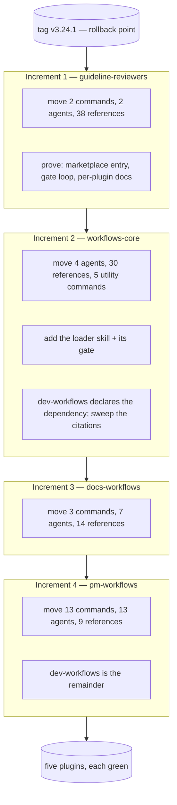

# Design: splitting the marketplace into five plugins

**Date:** 2026-09-02
**Status:** Design approved in brainstorming; not implemented.
**Scope:** the whole marketplace — `plugins/dev-workflows` becomes five plugins
**Rollback point:** tag `v3.24.1`, taken deliberately before this work
**Related:** `2026-08-29-docs-workflow-family-design.md`, whose implementation waits on this

---

## 1. Problem

`dev-workflows` carries 28 commands, 38 agents, 105 reference files, 43 documentation pages, 2 skills and 5 hooks. It is one plugin because it started as one, not because its contents belong together: the two guideline reviewers share nothing with the PRD pipeline, the BRD route shares nothing with `/vuln`, and someone who wants documentation workflows installs the whole of it.

The immediate trigger is the documentation-workflow family designed in `2026-08-29-docs-workflow-family-design.md`. Building it inside `dev-workflows` means writing every shared-reference citation as a direct file read and rewriting all of them later; born in the right plugin, they are written once. That design's D1 chose to extend rather than split on grounds its own §13.5 later weakened — the shared invariants *can* be shared, because Claude Code supports plugin dependencies natively.

**What makes this tractable now:** the specs-native pipeline has completed, so the tree is stable. Increment E landed, the tracker round-trip and `$VAULT_PATH` are gone, and the shared surface can be measured rather than guessed.

---

## 2. What the tree actually says

Measured at `v3.24.1`. Agents attributed by `subagent_type` dispatch (transitively, since agents dispatch agents); references by citation from commands and from agents, with each agent attributed to its dispatching commands' groups.

| Plugin | Commands | Agents | References |
|---|---|---|---|
| `workflows-core` | 6 | 4 | 31 |
| `pm-workflows` | 12 | 13 | 8 |
| `dev-workflows` | 5 | 12 | 14 |
| `docs-workflows` | 3 | 7 | 14 |
| `guideline-reviewers` | 2 | 2 | 38 |
| **Total** | **28** | **38** | **105** |

The totals reconcile exactly against the tree, with no remainder. Two findings shaped everything that follows.

**The core is tiny in agents and large in references.** Four agents of thirty-eight; thirty references of one hundred and five. The intuition — that the shared thing is the agents — is wrong, and it matters because **agents cross a plugin boundary for free and references do not** (§4). So the split's real work sits in the part that looked incidental.

**The guideline reviewers are a self-contained island.** Two commands, two agents, and 38 reference files — 36% of the reference weight — reading nothing outside themselves but a single shared `accessibility.md`. They do not even use model-routing; `CLAUDE.md` exempts them. Extracting them removes more bulk than any other single move and risks nothing.

---

## 3. Decisions

| # | Decision | Rationale |
|---|---|---|
| S1 | **Five plugins:** `workflows-core`, `pm-workflows`, `dev-workflows`, `docs-workflows`, `guideline-reviewers`. | The role model in `docs/roles-and-phases.md` already assigns every command a role, so the allocation is derived rather than invented. It resolves 27 of 28; `/release-notes` was the exception and is settled by S2. |
| S2 | **`/release-notes` goes to `docs-workflows`.** | Its PM assignment came from a tracker rule — a ticket's status could not advance without release notes — which no longer applies. It already resolves clones under `$REPOS_PATH`, which `docs-workflows` needs for `/document` regardless. And under the docs-family design its output is the evidence behind every What's-new page, so co-locating makes that integration intra-plugin instead of a cross-plugin contract. |
| S3 | **Core carries the five utility commands**, not only components. | `/feedback` and `/prompt` log friction about the plugin family itself and emit cost entries; `/statusline`, `/prompt-brainstorm` and `/prompt-grill-me` are equally family-meta. They belong wherever the shared machinery lives, and a dependency means anyone installing pm, dev or docs gets them automatically. |
| S4 | **`docs-grounder` is a core agent**, despite the name. | Nine consumers — eight in pm, one in docs — so it spans groups. It is dispatched from inside `references/docs-grounding.md` rather than by a command, which is why a direct-dispatch scan misses it. A scan that only reads commands would have put it in the wrong plugin. |
| S5 | **Shared references cross the boundary through one argument-taking loader skill, not 28 named wrappers.** | `${CLAUDE_PLUGIN_ROOT}` resolves to the *reading* plugin, so a dependency installs the core without granting file access. Skills do cross, and they take arguments (`$ARGUMENTS`, `$N`), so one skill serves every reference. The objection to a loader — a typo misfires silently where a named wrapper cannot — is answered by a gate rather than by 28 files (§6). |
| S6 | **Dependencies are declared bare-name**, tracking latest. | A version-ranged dependency resolves against *git tags*, and one repo tag cannot express five plugin versions — that would force per-plugin tags and a release-process change. While every plugin ships from one repository at one commit, ranges buy nothing. |
| S7 | **Each plugin owns its own `docs/` tree**, and `check-docs.sh` loops over the plugin list. | Documentation ships with the plugin that owns it, which is the point of splitting. The gate's inventory, orphan and prose-count checks already work per plugin; the change is mostly the loop. |
| S8 | **`dev-workflows` goes to 4.0.0; the four new plugins start at 1.0.0.** | Moving commands out breaks every `/dev-workflows:<cmd>` invocation, which is a major change. `pm-workflows` starting at 1.0.0 reads oddly given it inherits most of the history, but a version describes a plugin's own interface, not the provenance of its files. |
| S9 | **Build order: guidelines → core → docs → pm**, with `dev-workflows` as the remainder. | Separates two unknowns that a core-first order conflates. Guidelines needs no loader, no dependency and no citation rewrite, so it proves the multi-plugin plumbing — marketplace registration, the gate loop, per-plugin docs, installation — at zero risk. Core then introduces the genuinely new mechanisms against a repo where that plumbing is known to work. |
| S10 | **The namespaced sweep is a first-class step, gated in both directions.** | `subagent_type: "dev-workflows:<agent>"` and `/dev-workflows:<cmd>` appear throughout the commands, `CLAUDE.md`'s workflow map, 43 documentation pages and the next-phase-offer machinery. It is the largest mechanical risk in the job, and it is grep-able, which is what makes it safe rather than merely large. |
| S11 | **The cost boundary detector resolves against a namespace → command-set map shipped as a static manifest in core, and the deferred record carries its ceding plugin.** Both are required work inside increment 2, not follow-ups. | `cost-emission.md` §13.2 accepts a boundary only as `<this plugin>:<known command>`, and `session-cost.py`'s `load_command_names()` returns exactly one plugin's command set and one namespace from its own `plugin.json`. Both ceding commands — `/prompt-grill-me` and `/prompt-brainstorm` — land in `workflows-core` (S3). A cross-plugin replay then drops the claim (safe); a same-plugin replay matches it and swallows any intervening sibling's segment (§8.2, reproduced). A namespace list is insufficient because line 262 resolves both halves at once. See §8. |
| S12 | **`prose-style` becomes a declared dependency of `pm-workflows` and `docs-workflows`, and the graceful-skip branches are deleted.** | Its optionality is an artefact of plugin dependencies not existing when it was written, not a design intent — for `/epics` it is the **primary** style checker, so "skipped gracefully" means no style check at all. A declared dependency makes presence a guarantee (an unsatisfied one disables the plugin), which makes 22 skip branches across 18 files unreachable. Keeping unreachable branches is its own defect. Core does not declare it: core does not use it. |
| S13 | **`/frames` goes to `workflows-core`, and `grounding-format.md` with it.** | Design frame sets are already needed by the pm route and will be needed by dev — a bug-fix route, and screenshots arriving mid-implementation. That makes it a two-group surface, which is S4's rule. `design-grounder` stays in `pm-workflows` for now, because its only consumer today is `/brd-ground`; it moves to core when dev actually adopts it, not in anticipation. The two are coupled through an artefact in `$SPECS_PATH`, not through code, so they can sit in different plugins. |
| S14 | **The split is a breaking change requiring user action, and the CHANGELOG says so in a migration note.** | `claude plugin marketplace update` refreshes what is installed; it does not install plugins newly added to a catalogue. A user with `dev-workflows` installed gets `workflows-core` automatically (a declared dependency) and **loses** `/idea`, `/create-prd`, `/document` and the rest until they install `pm-workflows` and `docs-workflows` explicitly. The note lists every moved command and its new plugin. |
| S15 | **The root README becomes a marketplace index**, and each plugin's `getting-started.md` carries its own install block. | With five plugins there is no single front page. Check 7 becomes per-plugin: each plugin's install block must match *its* row in the root index (§6). |

---

## 4. What crosses a plugin boundary

This is the distinction the whole design turns on.

| Shared thing | Crosses? | How |
|---|---|---|
| **Agents** | **Yes** | `subagent_type: "<plugin>:<agent>"`. Already in production: `/epics` and `/create-prd` invoke `prose-style:prose-style-checker` today |
| **Skills** | **Yes** | `Skill(skill: "<plugin>:<skill>")`, with arguments |
| **Commands** | N/A | User-facing; not invoked by other plugins |
| **Reference files** | **No** | `${CLAUDE_PLUGIN_ROOT}` resolves to the reading plugin's own directory. A dependency guarantees installation, never file access |
| **Hooks** | **No** | Each plugin ships its own; `${CLAUDE_PLUGIN_ROOT}` is correct as written |

So the cost of the split is **not** duplicated invariants. It is one mechanism for reading a core reference from another plugin, plus the sweep that switches every citation to it.

---

## 5. The loader skill

**The property S5 rests on is verified, not assumed.** A plugin skill was invoked with arguments it does not declare, and the observed expansion was:

```
Base directory for this skill: …/ihudak-plugins/dev-workflows/3.24.1/skills/model-routing
… /home/…/.claude/plugins/cache/ihudak-plugins/dev-workflows/3.24.1/references/model-routing/classification.md
ARGUMENTS: PROBE_SENTINEL_7Q alpha beta gamma
```

Two facts, both load-bearing:

- **`${CLAUDE_PLUGIN_ROOT}` expands to the plugin that *owns* the skill**, as an absolute path — not to the caller's plugin. That is exactly what makes a core loader work: it reads core's references no matter which plugin's command invoked it.
- **Arguments reach a plugin skill body**, appended as a trailing `ARGUMENTS:` line — the documented append-fallback, now observed.

`workflows-core/skills/reference/SKILL.md`:

```markdown
---
name: reference
description: Read a shared workflows-core reference by name, and optionally execute one of its entry points.
user-invocable: false
allowed-tools: Read
---

The invocation arguments name one reference file and, optionally, one entry
point within it.

Read `${CLAUDE_PLUGIN_ROOT}/references/<the first argument>.md` and treat it as
the single source of truth for the current step. When a second argument is
present, execute that entry point of it inline. Never paraphrase, summarise, or
cache its contents.
```

Invoked from any dependent plugin:

```
Skill(skill: "workflows-core:reference", args: "finding-triage")
Skill(skill: "workflows-core:reference", args: "specs-repo-git specs-preflight")
```

**The body deliberately does not use `$ARGUMENTS` or `$N` substitution.** Those are documented, but no skill on a live machine carries a placeholder, so the branch is unverified — and a purpose-built probe could not test it because **skill discovery is bound to session start**: a skill written into an installed plugin returns `Unknown skill` until a fresh session begins. The append-fallback needs no substitution and *is* verified, so the design depends only on the branch that has been observed. (The session-start constraint is itself a fact increment 2's verification plan must accommodate — see §7.)

**There is no plugin-to-plugin call here that could fail.** The model is the invoker in both directions; `Skill(skill: "<plugin>:<skill>")` is identical whether the instruction came from core's own command or another plugin's. The only genuinely uncertain part was argument delivery, and that is now settled.

**`model-routing` keeps its own named skill.** It is invoked by name at a fixed point in every pipeline command, its own description documents that contract, and collapsing it into the loader would lose a call site that is already correct.

---

## 6. Gate changes

Three of the repository's checks are plugin-aware and one new check is needed.

**`check-docs.sh` — parameterise `PLUGIN_REL`.** It is a single constant at line 20 driving eleven checks over 51 selftest cases. It becomes a list, and each check runs per plugin. Most checks already work per plugin unchanged: inventories in both directions, orphan pages, environment variables, table cells, prose counts.

Two need real thought rather than a loop:

- **Check 7** (`getting-started.md`'s install commands match the repo-root README verbatim) assumes one plugin. With five, the root README carries five install lines and each plugin's getting-started carries its own. The check becomes per-plugin: each plugin's install block must match *its* line in the root README.
- **Check 11** (the `/brd-*` `choices:` placeholder rule) follows the BRD commands into `pm-workflows`, and its family derivation reads `next-phase-offer.md`, which lands in core. The check must resolve a core reference from outside the plugin it is checking — a script-level concern, not a runtime one, since the gate reads the repository directly.

**A new check: the loader contract, in both directions.** Every `args:` string passed to `workflows-core:reference` must name a reference that exists in core, and every core reference must be reached by at least one caller.

The justification is narrower than first stated. Because the argument arrives as a trailing line rather than being substituted into a path, **a typo surfaces as a file-not-found when the loader reads it — observable, not a silent misfire.** So the gate is not rescuing a dangerous failure mode; it is catching an unresolvable argument and an unreferenced core reference at build time instead of at run time. Still worth having, for the same reason every other inventory check here is, and it is the same both-directions shape.

**`check-id-grammar.sh` and `validate-catalog.py` need no change** — both are plugin-agnostic today (zero references to `dev-workflows` in either).

---

## 7. Build order



### Increment 1 — `guideline-reviewers`

Move `/api-guideline-reviewer`, `/guideline-reviewer`, their two agents, and `references/api-guidelines/**` plus `references/guidelines/**`. Register in `marketplace.json`. Give it its own `docs/` tree. `guidelines/accessibility.md` moves with the rest of the corpus. It is the one file the documentation family will later want — `/docs-brand` contrast-checks against it — but that family does not exist yet, so nothing is copied pre-emptively for a consumer that has no code. The decision is deferred to **increment 3**, where `docs-workflows` is created and the need becomes real — pinned to an increment rather than left in the open-questions list, so it cannot be forgotten.

**Nothing here needs the loader, a dependency, or a citation rewrite.** That is the point: it proves plugin creation, registration, the `check-docs.sh` loop, per-plugin documentation and installation, with no coupling in play.

*Verification:* both commands run from the new plugin; `dev-workflows` has 26 commands and 67 references and its gates pass; the new plugin's gates pass.

### Increment 2 — `workflows-core`

Create the plugin with the four core agents, the thirty-one core references, the six commands it carries (the five utilities plus `/frames`, S13), the `model-routing` skill and the new loader skill. `dev-workflows` declares `"dependencies": ["workflows-core"]`.

Then the sweep (S10): every `${CLAUDE_PLUGIN_ROOT}/references/<core-ref>` citation becomes a loader invocation, and every `subagent_type: "dev-workflows:<core-agent>"` becomes `"workflows-core:<core-agent>"`. Add the loader gate.

**This is the increment where everything unknown happens** — dependency resolution and auto-install, the loader, cross-plugin agent dispatch, and the largest sweep. Doing it second means the multi-plugin plumbing underneath is already proven.

**It also carries the cost-boundary fix (§8), which is required work here, not a follow-up.** Both ceding commands move into core in this increment, so the moment it lands every deferred claim becomes cross-plugin.

*Verification:* a command that reads a core reference behaves identically to its pre-split run; the loader gate passes in both directions; installing `dev-workflows` alone pulls in `workflows-core`; and the four §8.6 probe fixtures pass. **Skill discovery is bound to session start** (§5), so any check of a newly installed skill runs in a fresh session — a step the verification plan states explicitly rather than discovering as an `Unknown skill`. Verification also covers a deferred claim resolving from a different plugin, its segment terminating at an intervening sibling boundary, and both safety cases still rejecting a bare `/upgrade` and an unrelated plugin's namespace.

### Increment 3 — `docs-workflows`

Move `/document`, `/docs-profile`, `/release-notes`, their seven agents and fourteen references. Declares the core dependency. Its citations are rewritten as they move, not afterwards.

*Verification:* `/document` runs end to end from the new plugin against a real docs repo.

### Increment 4 — `pm-workflows`

The largest: twelve commands, thirteen agents, eight references. `dev-workflows` is then simply what remains — no fifth step.

The BRD route hands off to `/create-prd` → `/create-ard` → `/specify` → `/design`, and that last arrow crosses from pm into dev. It works because `phase-handoff.md` is a core reference reached through the loader by both sides, but it is the one place where a phase boundary and a plugin boundary coincide, and it deserves an explicit end-to-end test rather than a gate.

*Verification:* the full pipeline runs across three plugins — a PRD authored in `pm-workflows`, designed in `dev-workflows`, documented in `docs-workflows`.

### Before increment 1, and after the specs are approved

**Re-tag.** `v3.24.1` marks the tree before the design existed; the rollback point that matters is the **last agreed state of the specs**, since that is where a restarted attempt would begin. Merging the specs changes no plugin code, so the plugin version does not move and `v3.24.1` cannot be reused — the marker is therefore a purpose-named annotated tag, `pre-split`, rather than a version tag. `v3.24.1` stays what it is: a release marker.

### The migration note (S14)

The split is a **breaking change requiring user action**, and the CHANGELOG says so rather than leaving it to be discovered. `claude plugin marketplace update` refreshes what is installed; it does not install plugins newly added to a catalogue. Concretely, a user with `dev-workflows` installed and nothing else, after updating:

- **gains** `workflows-core` automatically — it is a declared dependency
- **keeps** `/design`, `/implement`, `/ready`, `/vuln`, `/upgrade`
- **loses** `/idea`, `/create-prd`, `/document`, every `/brd-*`, and the rest, until they install `pm-workflows` and `docs-workflows` explicitly

Bare command names are unaffected — `/idea` still resolves once its plugin is installed. Only the namespaced form moves. The note lists every command and its new plugin, and names the one-line install for each.

An **umbrella plugin** depending on all five would remove the manual step for people who want everything. It is deliberately **not** in this design — a sixth plugin whose only purpose is to undo the split's install story needs its own justification, and nobody has asked for it yet. Worth revisiting if the migration note proves annoying in practice.

### Every increment

Gates green before the PR; the tree consistent at each step; independently revertible; `CLAUDE.md` updated in the same commit as the change it describes.

---

## 8. The cost boundary detector (found by testing, corrected by testing)

A review of this design replayed a deferred cost claim through a simulated post-split plugin:

```
namespace        : docs-workflows
boundaries found : []
unmatched        : ['/prompt-grill-me']
notes            : ["no command boundary found in this window (namespace resolved as 'docs-workflows')"]
```

**Confirmed at two levels.** `cost-emission.md` §13.2 accepts a boundary only as `<this plugin>:<known command>`, "the namespace checked against the `name` in the plugin's own `plugin.json`". And `session-cost.py:262` resolves **both halves at once** — `ns == plugin_name and rest in known` — where `known` comes from `load_command_names(commands_dir)`, one plugin's command set. The detector is single-plugin by construction.

### 8.1 Which replays are affected, stated correctly

An earlier draft of this section claimed every deferred claim becomes cross-plugin after the split. **That was wrong, and self-contradictory**: S3 puts `/prompt` and `/feedback` in core and both emit cost, so a same-plugin replay is entirely possible — and if every replay really were cross-plugin, no claim would ever match and §8.2 could not happen at all. The two halves of the finding require opposite conditions. Correctly:

| Replay | Outcome |
|---|---|
| **Cross-plugin** — the next cost-emitting command after the cede is in pm / dev / docs | The claim does not resolve. Reported, dropped, spend stays with the replaying run (§13.4). **Errs safe** |
| **Same-plugin** — the next cost-emitting command is core's own `/prompt` or `/feedback` | The claim matches, and §8.2 applies. **This is the reachable defect** |

### 8.2 The segment defect — reproduced, and not a double count

With the grill ceding from core, `/dev-workflows:vuln` running between, and `/workflows-core:prompt` replaying:

```
boundaries seen   : ['/prompt-grill-me', '/prompt']     ← /vuln invisible
claim tokens      : 9000   (correct = 5000)
remainder tokens  :  800   (correct = 4800)
```

§13.3 gives each claim "the segment from its own boundary to **the next boundary of any kind**", and a sibling plugin's boundary is invisible to a single-plugin detector, so the claim swallows the sibling's 4000. **Measured, not inferred.**

**It is not a double count, and an earlier draft of this section said it was.** That case is unreachable: §3 advances the checkpoint on every tier and §13.4 deletes the deferred file **even when the claim is unmatched**, so the replaying run is necessarily the *first* cost-emitting command after the cede. An intervening command therefore cannot be one that self-measured — it must be one of the commands that emit no cost entry at all (`/vuln`, `/upgrade`, `/docs-profile`, `/statusline`, the two guideline reviewers).

What is actually taken is **the replaying run's own remainder**: a silent misattribution between two entries written by the same replay. Still a real defect, still silent — but no token is billed twice and no already-written entry is corrupted. The severity is lower than first stated, and the risk row reflects that.

### 8.3 Why "make the cost subsystem shared" is not the fix

`cost-emission.md`, `cost-prices.yaml` and `session-cost.py` are **already** core references and core scripts under this design. Moving the code changes nothing: the defect is in what the detector resolves *against*, not where it lives.

### 8.4 The fix, in two parts

**Part one — the accepted set becomes a namespace → command-set map, not a namespace list.** This is the part that makes cross-plugin resolution work, and a list is provably insufficient: line 262 resolves both halves, so widening namespaces while `known` still holds only the reading plugin's names still rejects `/dev-workflows:vuln`. Verified with the map in place: claim 5000, remainder 4800 — exactly right.

Both safety properties that forced the namespace rule survive the widening, verified explicitly rather than argued:

```
bare /upgrade minted a boundary?   False   (even though dev-workflows ships /upgrade)
superpowers:implement minted one?  False
```

The discipline is untouched — both halves still resolve against a held set, nothing is parsed.

**Part two — the deferred record carries its ceding plugin.** Its justification is *not* that it enables matching; the map alone already does that, demonstrated by a claim matching from `pm-workflows`. The real reason is that without it, matching is by **bare name across five plugins**, which is unambiguous only because S1 gives each command exactly one home. The field turns that from a coincidence of the current allocation into a guarantee that survives any future move:

```json
{"command": "/prompt-grill-me", "plugin": "workflows-core", "plugin_version": "1.0.0", …}
```

This still sits squarely inside §13.1's stated rule — a field belongs in the record when a replay cannot re-derive it once the run is over — but the thing it protects is uniqueness, not resolvability.

### 8.5 Where the map comes from — the one part no test covers

Building the map at runtime needs every sibling plugin's command set, and installed plugins live at `<cache>/<marketplace>/<plugin>/<version>/`. The probe faked this by passing sibling `commands/` directories explicitly. Two real options remain, and **the cache-path option is ruled out by this repository's own rule**: `CLAUDE.md` forbids hardcoding `~/.claude/plugins/...` paths, and a layout assumption is exactly that.

So: **core ships the map as a static manifest beside the script it feeds.** Every plugin in this marketplace is authored in one repository, so the five namespaces and their command sets are known at authoring time — no runtime discovery, no path assumption, and no cross-plugin file access, because `session-cost.py` lives in core alongside the manifest it reads.

**Verified, not reasoned.** The same two fixtures were replayed with a manifest in place of the faked sibling directories, and every result is identical:

| | sibling dirs | manifest |
|---|---|---|
| second-order claim / remainder | 5000 / 4800 | 5000 / 4800 |
| `/vuln` boundary seen | yes | yes |
| bare `/upgrade` rejected | yes | yes |
| `superpowers:implement` rejected | yes | yes |
| cross-plugin claim matched | yes | yes |

Two riders came back with it, and both make the design smaller:

- **The manifest is derived, not hand-maintained.** A hand-maintained list is the exact defect class `CLAUDE.md` warns about — but `check-docs.sh` already computes `cmd_names` per plugin, and S7 makes it loop over the plugin list, so "manifest equals derived inventory, in both directions" is **a few lines inside the existing loop**, not a seventh gate.
- **The manifest is also what fix part two resolves against.** `record.plugin` needs a set of valid plugin names, and the manifest's keys are exactly that set. The two halves of §8.4 compose into **one structure**, not two.

### 8.6 Verification

The review's four probe transcripts are adopted as fixtures rather than writing new ones. Two **discriminate**: `split2.jsonl` (the segment case) and `split3.jsonl` (both safety cases) — an implementation that widens namespaces without widening the per-namespace name sets **passes `split3` and fails `split2`**. That is precisely the `--selftest` contract §13.2 already imposes on its three existing disciplines: a case paired with the broken implementation it exists to catch.

---

## 9. Non-goals

- **No behaviour changes.** Every command does exactly what it did at `v3.24.1`. A split that also improves something cannot be bisected when it breaks.
- **No per-plugin git tags** (S6). Revisit if ranged dependencies are ever wanted.
- **No repository split.** Five plugins, one repo, one commit stream.
- **No new commands.** The documentation family waits for increment 4 to finish.
- **No renaming of commands.** Bare `/idea` keeps working; only the namespaced form moves.

---

## 10. Risks

| Risk | Mitigation |
|---|---|
| **The sweep misses a citation**, and a command silently reads nothing | The loader gate fails in both directions, so an unreachable core reference and an unresolvable loader argument are both build failures. A missed *agent* prefix fails louder — dispatch of an unknown `subagent_type` is an error, not a silent skip |
| **A dependency does not auto-install**, leaving a plugin disabled | Increment 2 tests exactly this before three more plugins depend on it. Failure modes are named and loud (`dependency-unsatisfied`), and the fallback is one repository at one commit, so a manual install is always available |
| **`check-docs.sh`'s 51 selftest cases** need per-plugin fixtures | The largest hidden cost, and the reason increment 1 exists — it forces the loop into place while only two plugins are in play |
| **A core reference is actually two concerns**, one per plugin | Nothing splits a reference in this design. If one turns out to need splitting, that is a separate change, made deliberately and not during a move |
| **Increment 4 leaves the pm→dev handoff broken** | It is the one place a phase boundary and a plugin boundary coincide; it gets an explicit end-to-end test rather than reliance on a gate |
| **Someone's saved `/dev-workflows:idea` breaks** | True and intended — hence 4.0.0 (S8). The migration note names every moved command and its new namespace |
| **The cost boundary fix is incomplete**, and a claim silently swallows a sibling command's segment | Reproduced and measured (§8.2), and bounded: it misattributes between two entries written by the same replay, never double-bills and never corrupts an entry already written. The fix is verified with the map in place, and increment 2 adopts the review's four probe transcripts as `--selftest` fixtures, two of which already discriminate |
| **Rollback is needed mid-way** | `v3.24.1`, plus four independently revertible increments |

---

## 11. Open questions

1. **How does the documentation family reach `guidelines/accessibility.md`?** It moves into `guideline-reviewers` with the rest of the corpus, and `/docs-brand`'s contrast check will need it. Three answers are open — copy the one file, promote it to core, or have `docs-workflows` depend on `guideline-reviewers` — and the right one depends on whether a second shared file ever appears. Settle it when the docs family is built, not before.
2. **Where does `/frames` sit long-term?** It is allocated to `pm-workflows` because it indexes design frame sets under BRD, PRD and Epic folders. If `design-grounder` ever serves `dev-workflows` too, both move to core.
*(The root-README question is settled by S15. The `accessibility.md` question is pinned to increment 3 rather than listed here.)*
