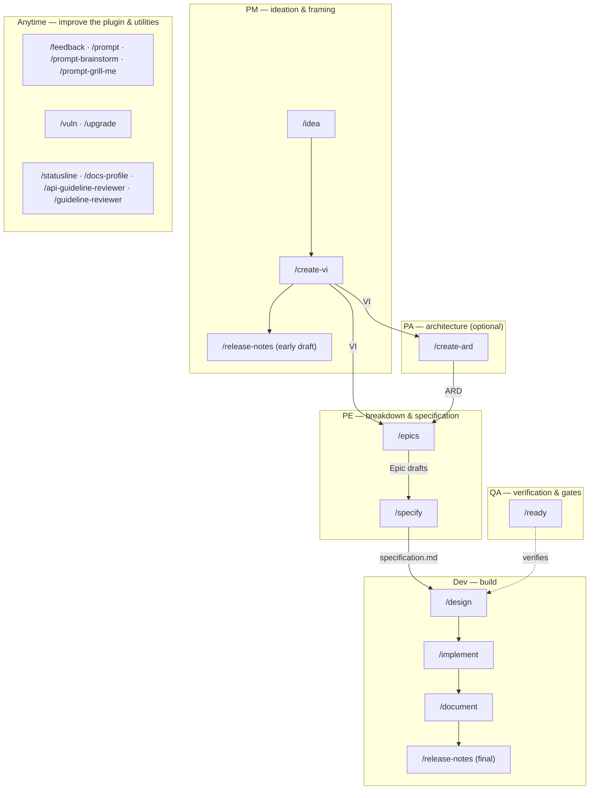

# dev-workflows

Twenty slash commands spanning idea refinement, VI authoring, architecture (ARD), Epic drafting, specification authoring, engineering design, readiness gating, structured implementation, one-shot doc edits, docs-repo profile scanning, Jira-driven feature documentation, release-notes drafting, vulnerability remediation, and dependency upgrades — plus API and UI guideline reviewers and feedback/prompt/statusline utilities — with Opus-backed risk planning, post-implementation code review, test regression detection, and prose-style / Opus doc review gates.

> Part of the `ihudak-plugins` marketplace — see the [repo-root setup guide](../../README.md) for marketplace install + prerequisites (env vars, `jira-workitem-import`, AI-Containers, first command).

## Commands

| Command | Description |
|---------|-------------|
| `/implement <VI-KEY \| Epic-KEY \| jira-export-dir \| description \| @paths> [focus-Epic-KEY]` | Structured code implementation: accepts the shared Jira-input grammar — a **JiraID** (VI or Epic), an **imported-Jira directory**, or a **direct prompt/`@file`** (also `@spec`/`@repo`), optionally with a **focus Epic** (`<VI> <Epic>`); for a multi-Epic VI it renders the progress-aware Epic picker (done-predicate = the Epic's Jira status) and implements **one Epic per run**. Then load + classify multi-source input (spec file/folder, Jira ticket folder, one or more repos) → classify risk → fan-out scan when multi-source → plan (Opus for SIGNIFICANT / HIGH-RISK) → branch → capture test baseline → implement → write and verify tests → Opus review → verify baseline → document. |
| `/document <JiraID \| jira-export-dir \| description [saas\|managed]>` | Accepts the shared Jira-input grammar — a **JiraID**, an **imported-Jira directory**, or a **direct prompt/`@file`** (plus the optional `saas\|managed` constraint). **Direct mode:** one-shot doc editing (single-file additions, README tweaks, Obsidian notes, formatting). No branch, no tests, no code review, no commit. Always SIMPLE or MODERATE. **Jira mode:** pass a Jira VI key or an imported-Jira directory to run the Jira-driven feature-documentation workflow end to end (resolves repos/specs, writes into the docs repo, branches/commits, and — opt-in — squashes, pushes, and drafts a PR). |
| `/docs-profile` | Scans a docs repo and writes/refreshes its docs-profile (`.dev-workflows/docs-profile.yml` + CLAUDE.md guidance) as a reviewable PR. Consumed by `/document` (Jira mode). |
| `/document <VI-KEY \| jira-export-dir> [focus-Epic-KEY] [saas\|managed]` | (Jira mode) Jira-driven feature documentation. Accepts the shared Jira-input grammar — a **JiraID** discovered under `$VAULT_PATH/jira-products/`, or an **imported-Jira directory** (works when `$VAULT_PATH` is unset) — optionally with a **focus Epic** (`<VI> <Epic>`, which scopes the change-driven phases to that Epic) plus the optional `saas\|managed` constraint. Phase 0 preflight-discovers the docs repo + profile (in-repo → built-in dynatrace-docs default → on-demand `/docs-profile`) and the VI's specs dir under `/workspace`. Phase 4.5 determines/confirms the applicable space(s); optional `saas\|managed` constraint scopes the run to one space. Reads the pre-exported Jira hierarchy from the vault, resolves PR URLs to local repos, runs parallel PR-diff summaries, synthesises docs, runs `docs-style-checker` + Opus `doc-reviewer` gates, writes into the docs repo. Phase 5.6 auto-discovers candidate images from spec files, `jira-reader` attachment enumeration, and a manual fallback. Phase 5.8 performs spec-grounded 3-way `Jira\|Spec\|Code` verification — discrepancies are escalated with a bug-report draft. When `image_policy` is `cdn_upload_required`, an interactive CDN handoff lets the user paste links immediately (real URLs substituted inline) with the existing async fallback when deferred. A `saas`/`managed` run routes per space and protects the other product's render with `{{#if project}}` conditionals or override-copies (Phase 6.3). Phase 6.5 then verifies the docs build and render (build + opt-in best-effort dev-server smoke-check + a pages-to-visit table), and Phase 8.5 finishes the run — squash, opt-in `git push`, and a host-aware copy-paste PR draft (never an API call). |
| `/epics <VI-KEY \| jira-export-dir> [focus-Epic-KEY]` | Jira-driven Epic drafting. Accepts the shared Jira-input grammar — a **VI key** (discovered under `$VAULT_PATH/jira-products/`) or an **imported-Jira directory** (works when `$VAULT_PATH` is unset); an explicit focus Epic (`<VI> <Epic>`) is honored as a refinement target — it re-drafts just that Epic. Reads the Value Increment + its existing Epics, optionally scans code repos for reusable capabilities and gaps, drafts one markdown file per new Epic under the vault (`jira-drafts/<VI-KEY>/`, or an `epic-drafts/<VI-KEY>/` dir beside the import when `$VAULT_PATH` is unset), gated by Opus `epic-reviewer`. cwd-agnostic; never branches or commits. |
| `/release-notes <KEY \| jira-export-dir> [focus-Epic-KEY]` | Jira-driven release-notes drafting. Accepts the shared Jira-input grammar — a **ticket key** or an **imported-Jira directory** (works when `$VAULT_PATH` is unset); an explicit focus Epic (`<VI> <Epic>`) scopes the draft to that Epic. Reads the ticket, optionally grounds in merged PR diffs, renders the dynatrace-docs authored release-notes body (`{{#context}}` + title + prose; no IDs, no `{{#internal-note}}`), runs a light `dt-style-checker` gate, and always writes a persistent draft **file** (the vault project folder when `$VAULT_PATH` is set, else beside the import) to paste into Jira. Never branches, commits, or writes into the docs repo. |
| `/idea <prompt \| @file \| JIRA-KEY> [--deep]` | Idea refinement (PM phase, front of the VI-creation flow). Ingests one source — an inline **prompt**, a **markdown file** (wikilinks + images followed), a **community post**, or an exported **RFE Jira ticket** (`$VAULT_PATH/jira-products/<KEY>`) — via the read-only `idea-reader` subagent (auto-detects type with provenance tags). Refines it through the embedded one-question-at-a-time grill — **bounded** (≤5 questions; leftover gaps → `[NEEDS CLARIFICATION]` capped at 3 + logged Assumptions) or **relentless** with `--deep` — and writes a lean one-page `idea.md` (per `references/idea-format.md`) to `$VAULT_PATH/Projects/<area>/<slug>/`, keyless, `status: refined` iff zero open clarifications remain. The grill is the quality gate (no reviewer at the idea stage). Adaptive next-phase offer toward `/create-vi`. Never writes to Jira, code, or the specs repo. |
| `/create-vi <JIRA-KEY> [@idea.md] [--lean\|--hybrid\|--full]` | VI authoring (PM phase, sub-project 2 of the VI-creation flow). Turns a refined `idea.md` + a **user-supplied Jira key** (empty workitem created first; mandatory) into a product-level **Value Increment** — a mandatory spine (Problem · Goal · Target audience · User Stories · Acceptance Criteria · Scope · Success Metrics) plus an adapt-in menu selected by `--lean\|--hybrid\|--full` and pulled only when the idea warrants it. Authored via a relentless grill against `references/vi-format.md`, gated by the Opus `vi-reviewer`, written to `$SPECS_PATH/specifications/<KEY>-<slug>/<KEY>_ValueIncrement.md` (relocated `idea.md` co-located; `sources` propagated from the idea's real provenance), branch+PR offer, and a documented paste-into-Jira + re-import round-trip. Product-level: no code scan, no repos. Offers `/release-notes`, `/create-ard`, and `/epics` as next steps (per `references/next-phase-offer.md`). |
| `/create-ard <VI-KEY> [<Epic-KEY>]` | Architecture authoring (Product Architect phase, sub-project 3 of the VI-creation flow). **Optional**; grounds on the mounted implementation repos (architect-driven discovery — cheap `$REPOS_PATH` listing + `theme→repo` proposal + ask + mount-or-descope + `code-scanner`; **no PRs**) and authors an **ARD** (Context · Grounding findings with real `file:line` · Architecture decisions `AD-N: Binds/Prevents/Rule` · Cross-repo map · Stack & invariants · Edge cases · Open questions · Deferred) against `references/ard-format.md`. Scoped via the two-key grammar: `<VI-KEY>` → VI-level; `<VI-KEY> <Epic-KEY>` → Epic-level (inherits the VI-level ARD read-only; a big Epic can split per area → `<EPIC>-<area>_ARD.md`). Gated by the Opus `ard-reviewer`; tiered hard model gate (like `/design`); written to `$SPECS_PATH/specifications/<KEY>-<slug>/`; branch+PR offer. New `pa` role. Offers `/epics`/`/specify` (VI) or `/specify`/`/design` (Epic) next. |
| `/specify <VI-KEY \| Epic-KEY \| jira-export-dir> [focus-Epic-KEY]` | Jira-driven specification authoring (PE phase). Accepts the shared Jira-input grammar — a Jira **Epic (or VI) key** or an **imported-Jira directory** — optionally followed by a **focus Epic key** (`<VI> <Epic>` / `<dir> <Epic>`) to target one Epic inside a multi-Epic VI; a bare nested Epic key alone auto-resolves to its parent VI. For a VI with ≥2 Epics and no Epic already selected, Phase 2 renders a progress-aware Epic picker (○ not started / ◐ in progress / ● done) before the full read, scoping the interview to that Epic's subtree. Reads the item from pre-exported markdown, lightly grounds in code (auto-derived repos, soft advisory gate), and authors an org-standard `specification.md` (problem → scope → user stories → acceptance criteria → test cases) through a relentless one-question-at-a-time grill — resolving open questions live and leaving genuinely unresolvable ones as `- [ ]`. Durable/resumable via `_session.md` + `_glossary.md`; gated by Opus `spec-reviewer`; renders HTML; offers a branch+PR handoff to the specs repo's main branch (`Published: no`) for the future `/design` dev take-over. `/epics` *splits* a VI into Epic drafts; `/specify` *authors one specification* for a single item (or, via the picker, one Epic within a VI). |
| `/design <VI-KEY \| Epic-KEY \| jira-export-dir> [focus-Epic-KEY]` | Jira-driven engineering design authoring (Dev phase). Takes over a merged `specification.md` from the specs repo's main branch and authors a reviewed engineering `design.md` through a relentless one-question-at-a-time grill that **challenges** the spec (recording an `## Engineering review` section + open questions back onto it) and **designs** the implementation, grounded strictly in the fully-mounted code (hard repo gate — unmounted repos stop the run). Accepts the shared Jira-input grammar (`<VI> <Epic>` / `<dir> <Epic>`); for a multi-Epic VI it renders the progress-aware Epic picker (done-predicate `design.md` exists). A tiered model gate hard-stops SIGNIFICANT/HIGH-RISK work not on Opus. Durable/resumable via `_design-session.md` + `_design-glossary.md`; gated by Opus `design-reviewer`; `design.md` open questions hard-block handoff; offers a branch+PR handoff (`design/<EPIC>-<eslug>` / `design/<VI>-<vslug>`) to the specs repo's main for `/implement`. Does not read Jira content — the spec is the source of truth. |

**Next-step guidance.** Every pipeline command ends its report with an adaptive `### Next step` recommendation naming the next command(s) and the owning role (PM / PA / PE / Team) — guidance only, never auto-invoked; omitted in a command's direct / doc-edit mode. The role-aware routing graph lives in `references/next-phase-offer.md`.

**Which docs command?** `/document` (direct mode) is for one-shot manual doc edits (no Jira, no branch/commit). `/document` (Jira mode) is the Jira-driven feature-documentation workflow end to end (resolves repos/specs, writes into the docs repo, branches/commits, and — opt-in — squashes, pushes, and drafts a PR). `/docs-profile` is a one-time profiler that generates a repo's `.dev-workflows/docs-profile.yml` (consumed by `/document` Jira mode).

Six of the seven dev-workflows commands — `/implement`, `/document` (both modes), `/epics`, `/release-notes`, `/specify`, and `/design` — classify tasks as SIMPLE / MODERATE / SIGNIFICANT / HIGH-RISK before acting (`/document` direct mode only ever lands SIMPLE or MODERATE; `/document` Jira mode is typically SIGNIFICANT; `/specify` Phase 1.5 is typically MODERATE; `/design` Phase 1.5 scales grill/section/review depth and gates the model tier). `/docs-profile` runs at a fixed SIGNIFICANT (no per-task classification). The three code-oriented commands (`/implement`, `/vuln`, `/upgrade`) also:
- Create a feature branch before touching any file
- Route SIGNIFICANT / HIGH-RISK work through Opus for planning and post-implementation review
- Gate the test run on the review verdict (no tests until BLOCK is cleared)
- Capture a pre-change test baseline and diff after changes

`/implement` adds test-writing (Phase 3.5) between implementation and review, then verifies the baseline.

## Workflow overview

The commands form a role-based pipeline. Each role has a starting command and hands a concrete artifact to the next role. `/idea → /create-vi` (PM) opens it; `/document` + `/release-notes` (Dev) close it.

| Role | Starts with | Consumes | Produces → where it lands |
|------|-------------|----------|---------------------------|
| **PM** | `/idea`, `/create-vi <KEY>`, `/release-notes <VI>` | a prompt / community post / RFE; then a refined `idea.md` + a JIRA-KEY | `<KEY>_ValueIncrement.md` in `$SPECS_PATH/specifications/<KEY>-<slug>/` (idea.md relocated in); an early release-notes draft in the vault; paste-to-Jira → re-import to `$VAULT_PATH/jira-products/<KEY>/` |
| **PA** *(optional)* | `/create-ard <VI> [<Epic>]` | the VI (and Epic) | `<VI>_ARD.md` / `<EPIC>-<area>_ARD.md` in the same specs feature folder |
| **PE** | `/epics <VI>`, `/specify <VI> [<Epic>]` | the VI (+ ARD, existing Epics) | Epic drafts in `$VAULT_PATH/jira-drafts/<VI-KEY>/`; `specification.md` on the specs-repo main (branch + PR) |
| **Dev** | `/design <VI> <Epic>`, `/implement <VI> <Epic>`, `/document <VI>`, `/release-notes <VI>` | the `specification.md` (+ ARD); `design.md`; the code repos | `design.md` on the specs-repo main; code + PR in `$REPOS_PATH`; product docs in the docs repo; the final release-notes draft in the vault |
| **QA** | `/ready <VI \| Epic>` (+ the Opus reviewer gate embedded in every authoring/build command) | the Jira status + the ARD / spec / design artifacts | a `SUPPORTED` / `PARTIAL` / `NOT-SUPPORTED` verdict — read-only; sets no status |

**Sources of truth & artifact homes**

- **Jira** is the source of truth for workflow *status*. The external `jira-workitem-import` tool imports the ticket tree into `$VAULT_PATH/jira-products/<KEY>/`; the plugin reads status but **never sets it**.
- **`$SPECS_PATH/specifications/<KEY>-<slug>/`** — the shared, team-visible home for the VI, ARD, `specification.md`, and `design.md`.
- **`$VAULT_PATH`** — your personal store: `Projects/<area>/<slug>/idea.md`, the imported `jira-products/` tree, `jira-drafts/<VI-KEY>/` Epic drafts, and release-notes drafts.
- **`$REPOS_PATH`** — the code clones (`/implement` works on branches + PRs here); product documentation is written into the external **docs repo**.
- **Plugin-generated artifacts live in the specs repo.** Feedback, cost, and follow-up files are written under `<VI-dir>/dev-workflows/` in `$SPECS_PATH` — `<KEY>-feedback.md`, `cost/<sid8>.md`, and `<KEY>-followups.md`. **Committing and pushing these alongside the specs is expected and encouraged** — team-visible feedback and cost transparency is the point, not clutter.

**Cross-cutting commands (any time)**

- **Plugin improvement — please use these.** `/feedback` logs a note about the plugin itself; `/prompt`, `/prompt-brainstorm`, and `/prompt-grill-me` turn a correction you just made into logged feedback plus a fix. This is how the plugin keeps getting better — run them whenever something felt off, on any command.
- **Standalone maintenance.** `/vuln` (CVE remediation) and `/upgrade` (dependency / runtime upgrades) run on their own, outside the VI pipeline.
- **Setup & repo tooling.** `/statusline` (install the status line — run this first), `/docs-profile` (bootstrap a docs repo's profile), `/api-guideline-reviewer` and `/guideline-reviewer` (Dynatrace API / UI compliance reviews).

*Legend: **Dev** is the plugin's "Team" lane; **QA** denotes verification and quality gates, not an artifact-authoring role; `/release-notes` appears twice because it serves a PM early draft (from the VI alone) and a Dev final draft (grounded in the merged PR diffs).*

## Session feedback

Beyond the workflow commands, dev-workflows captures **friction and improvement
signals about the plugin itself** and persists them per-VI into the specs repo,
so the plugin maintainer can aggregate feedback across engineers and plan
improvements. Capture is **silent and high-recall** — there is no approval gate;
curation is the maintainer's job, centrally, at analysis time.

- **Automatic.** The end-of-run maintenance phase of all eleven workflow commands
  (`/implement`, `/document`, `/epics`, `/vuln`, `/upgrade`, `/release-notes`,
  `/specify`, `/design`, `/idea`, `/create-vi`, `/create-ard`) projects the plugin-facing slice of the
  `impl-maintenance` report (command workflow improvements, new agents/skills,
  reference-doc gaps) into a feedback entry (`origin: auto`). A routine session
  with no plugin-facing signal writes nothing.
- **`/feedback <text>`** — a universal manual note about the plugin, tied to no
  command (`origin: manual`).
- **`/prompt <text>`** — capture a corrective interaction (a command produced
  something wrong; you fix it) as Friction + your verbatim prompt + the
  Resolution, then act on the correction directly (`origin: prompt`).
- **`/prompt-brainstorm <text>`** — same capture, then hand off to
  `superpowers:brainstorming`.
- **`/prompt-grill-me <text>`** — same capture, then grill the fix **inline** — a
  bounded one-question-at-a-time interrogation of the correction following the
  embedded grilling technique. Self-contained; no plugin dependency.

**Graceful degradation.** Persistence is **specs-first** (central aggregation is
the point) and deterministic: `$SPECS_PATH` VI dir
(`<VI-dir>/dev-workflows/<KEY>-feedback.md`) → `$SPECS_PATH/dev-workflows-feedback/`
→ a writable vault (with a loud "won't auto-aggregate to the maintainer" notice)
→ beside an imported Jira directory → report-only. It **never** writes into the
current working directory, and no capture phase ever fails the run. See
`references/feedback-emission.md`.

## Session cost reporting

dev-workflows records how many **dollars** a Value Increment cost across its
whole lifecycle — by **phase**, **role**, and **model** — persisted per-VI into
the specs repo so the maintainer can aggregate spend across engineers and teams.
Claude Code exposes no dollar figure to a command, so cost is **computed** from
transcript token usage (the main transcript + the session's subagents) times a
price table; an optional statusline snapshot cross-checks it.

- **Terminal cost phase** on the nine VI-lifecycle commands (`/idea`, `/create-vi`, `/create-ard`, `/specify`, `/epics`,
  `/design`, `/implement`, `/document`, `/release-notes`). It **always runs** and
  always advances a per-session **chained checkpoint** (each command's window
  starts where the previous one ended), so per-command costs sum to the session
  total. `/vuln` and `/upgrade` are out of scope (no VI to attribute to).
- **Per-invocation, append-only entries** in
  `<VI-dir>/dev-workflows/cost/<sid8>.md` — one file per session (`<sid8>` = the
  first 8 chars of the session id), so nothing merge-conflicts across many teams
  or one person's N sessions. Machine-friendly YAML (phase, role, per-model split,
  duration, `cost_computed_usd`, and — when the plugin statusline is installed
  and a prior checkpoint baseline is already recorded (i.e., not the session's
  first cost phase) — `cost_statusline_usd`). **No user name is ever written.**
- **Attribution** is a fixed per-command phase/role map, except `/release-notes`,
  whose phase/role is inferred from whether any `specification.md` / `design.md`
  exists under the VI (a PM's early bare-VI run vs. a dev's documenting re-run).
- **Graceful degradation** (specs-first, never the cwd): `$SPECS_PATH` VI dir →
  a pending file for keyless runs (opportunistically reconciled later) → a
  writable vault (with a "won't auto-aggregate" notice) → beside an imported Jira
  directory → report-only. The price table is overridable via
  `$DEV_WORKFLOWS_COST_PRICES`. See `references/cost-emission.md`.

## Statusline

`/statusline` installs the plugin's multi-line, truecolor status line (session
identity, git branch, context bar, cost, tokens, rate limits) into
`~/.claude/settings.json`. Installation is idempotent and backs up any existing
script and `statusLine` block before writing. Installing it also enables the
**Option B** cost cross-check: the shipped script writes a per-render
`{ts, cost_usd}` snapshot that the cost phase compares against its
transcript-computed estimate (a drift signal for refreshing the price table).

## `/implement` workflow

`/document` (both modes) and `/epics` never run tests and never touch production code. Only `/document` (Jira mode) can create a branch (opt-in at plan approval, and only when a docs repo is detected) — and, also opt-in, squash + `git push` it and emit a copy-paste PR draft (it never opens the PR via an API).

Additionally:

| Command | Description |
|---------|-------------|
| `/vuln CVE-XXXX-XXXXX[:JIRA-ID]` | Fix CVEs: research (NVD + baseline in parallel, then Detect per CVE) → classify → branch → fix → Opus review (SIGNIFICANT / HIGH-RISK) → compare baselines → PR. |
| `/upgrade component:version` | Upgrade dependencies: compat check → Opus plan (SIGNIFICANT / HIGH-RISK) → branch → apply → Opus review → compare. |

## Agents

Twenty-six reusable subagents (invoked internally by the commands). The six Opus-backed reviewers/planners are pinned; the rest have no fixed pin — their tier is assigned per the model-routing policy (mechanical → Sonnet, synthesis/review → Opus).

| Agent | Model | Description |
|-------|-------|-------------|
| `risk-planner` | Opus | Risk-weighted planner for SIGNIFICANT / HIGH-RISK tasks. Returns a structured plan with security, migration, API-stability, concurrency, dependency, rollback, and test-adequacy sections. Refuses SIMPLE / MODERATE and returns a re-classification notice instead. |
| `code-review` | Opus | Post-implementation reviewer — 8 dimensions (correctness, security, architecture, edge cases, migration, dependencies, test adequacy, rollback). Verdict: PASS / PASS WITH RECOMMENDATIONS / BLOCK. BLOCK gates the test run. |
| `doc-reviewer` | Opus | Product-documentation reviewer for `/document` — 11 dimensions including factual correctness, completeness vs plan, audience fit, structural integrity, YAML frontmatter, screenshots (both `image_policy` branches), snippets, actionability, source traceability, and style-check follow-through. |
| `epic-reviewer` | Opus | Epic-draft reviewer for `/epics` — 9 dimensions including goal clarity, testable acceptance criteria, scope boundaries, dependencies, non-duplication vs sibling Epics (BLOCKER), and reference-path evidence (when `code-scanner` output is provided). |
| `spec-reviewer` | Opus | Specification reviewer for `/specify` — checks problem/scope clarity, user-story and acceptance-criteria testability, test-case coverage, open-question resolution (BLOCKER on unresolved `- [ ]` items that could be resolved live), and adherence to the org-standard `specification.md` format. |
| `design-reviewer` | Opus | Engineering-design reviewer for `/design` — validates `design.md` against the `design-format` authority (section inclusion scaled by classification) and traceability to its `specification.md` (every in-scope requirement covered; BLOCKER on a gap), plus interface concreteness, seam/test-strategy soundness, architecture coherence, and risk coverage. Treats any unresolved `design.md` `- [ ]` open question as a BLOCKER. Verdict: PASS / PASS WITH RECOMMENDATIONS / BLOCK. |
| `test-baseliner` | per routing | Runs the test suite in `capture` or `verify` mode; `verify` diffs against a prior baseline and returns a structured regression report. Framework detection: Maven, Gradle, npm, pytest, Makefile. |
| `test-writer` | per routing | Writes tests for new or changed behaviour based on a diff. Never runs tests. Framework detection mirrors `test-baseliner`; returns "not detected" immediately if no framework is configured. |
| `review-fixer` | per routing | Applies BLOCKER / MAJOR findings from a `code-review` report; returns a structured fix report with a `Stop condition flag` so callers know whether to re-review. Used by `/implement`, `/vuln`, `/upgrade`. |
| `upgrade-planner` | per routing | Phase-1 compatibility planner for `/upgrade`: detects the component, resolves the target version (exact/minor/latest/lts/bare), and verifies compatibility with other components. Returns a structured upgrade plan or a conflict report. |
| `upgrade-executor` | per routing | Phase-2 executor for `/upgrade`: applies the plan for one component, runs the build, verifies tests via `test-baseliner`, and auto-fixes test-code breakage from the new version's API changes. |
| `vuln-research` | per routing | Read-only research phase of `/vuln`: NVD lookup, library detection, current-version discovery, and minimum-safe-version resolution. No side effects. |
| `vuln-fixer` | per routing | Fix phase of `/vuln`: captures a baseline, applies the minimal version bump, rebuilds, verifies tests, commits to a branch, and opens a PR. |
| `doc-fixer` | per routing | Applies BLOCKER / MAJOR findings from a `doc-reviewer`, `epic-reviewer`, or `docs-style-checker` report. Shared between `/document` and `/epics`. Returns the same `Stop condition flag` contract as `review-fixer`. |
| `docs-style-checker` | per routing | Runs the docs repo's project-configured prose linter (Vale via `.vale.ini`, `package.json` `*:lint` / `lint:*` script, markdownlint, or remark) on files written by `/document` Phase 6.3 and emits findings for `doc-fixer`. |
| `doc-planner` | per routing | Synthesises Jira data + per-repo diff summaries + confirmed write targets into a documentation checklist the writer follows and `doc-reviewer` checks against. Detects the repo's `image_policy` (`local` / `cdn_upload_required` / `ambiguous`). |
| `doc-location-finder` | per routing | Finds the write target(s) in a docs repo — `extend-existing`, `new-page-in-existing-section`, or `new-section` — with confidence scoring. Never writes content. |
| `doc-writer` | per routing | Writes product documentation for `/document` Phase 6.3 from a structured handoff file — applies the `doc-planner` checklist, approved per-page write strategies (conditional / override-copy / plain), discrepancy decisions, snippets, screenshots, frontmatter, and internal links. Write-only; never runs git. |
| `jira-reader` | per routing | Reads the pre-exported Jira markdown hierarchy (VI, Epics, Stories, Sub-tasks, Research, RFA) from `$VAULT_PATH/jira-products/<KEY>/`. Three depths (`full`, `vi-plus-epics`, `vi-only`). Parses PR URLs and classifies hosts (`github_cloud`, `bitbucket_cloud`, `bitbucket_server`, `other`). Read-only. Used by `/document`, `/epics`, `/release-notes`, and `/implement` (multi-source input). |
| `release-notes-writer` | per routing | Renders the dynatrace-docs authored release-notes body for a Jira VI or ticket: a `{{#context}}` label, `### title`, and customer-facing prose — one entry per declared release version. Emits no Jira IDs, no PR links, and no `{{#internal-note}}` block. Does not write files; returns the draft to the caller. Used by `/release-notes`. |
| `diff-summarizer` | per routing | Resolves a single repo's PR diffs and returns a doc-focused summary. GitHub uses the `gh` CLI when available; Bitbucket Cloud / Server + GitHub-fallback use local-git strategies (branch search, merge-commit grep, Jira-key commit grep). Designed for parallel invocation (caller caps at 4 concurrent). |
| `code-scanner` | per routing | Scans one repo for existing capabilities and gaps relative to themes (from an Epic or an implementation spec). Fanned out one-per-repo, cap 4 concurrent. Used by `/epics` and `/implement` (multi-source fan-out). |
| `epic-writer` | per routing | Writes child Epic-definition files for `/epics` Phase 6 from a structured handoff file — one file per Epic, following the Epic template, traceable to the `jira-reader` handoff and `code-scanner` evidence. Write-only (vault content); never commits. |
| `impl-maintenance` | per routing | Post-session lessons-learned analyst. Reads the session handoff, scans CLAUDE.md rules / hooks / reference docs / agents, and returns a structured Lessons Learned report with actionable suggestions. Suggest-only; does NOT write files. |
| `guideline-reviewer` | per routing | Reviews Dynatrace app code and UI for compliance with Dynatrace Experience Standards (GUIDElines). Checks AppHeader, DataTable, FilterField, Connections, Permissions, Settings, Dashboards, accessibility/WCAG, terminology, and Grail naming. |
| `api-guideline-reviewer` | per routing | Reviews OpenAPI specification files against Dynatrace REST API and IAM permission naming guidelines. Checks version consistency, required elements, naming conventions, IAM scope format, HTTP status codes, and schema composition. |

Agents are dispatched by `subagent_type` (e.g. `dev-workflows:risk-planner`). Claude Code loads each agent's file body as its system prompt and honours its `model:` frontmatter — so the six Opus gates (`risk-planner`, `code-review`, `doc-reviewer`, `epic-reviewer`, `spec-reviewer`, `design-reviewer`) run on Opus automatically, with no caller-side `model` override or file-path reference.

## Hooks

| Hook | Trigger | Description |
|------|---------|-------------|
| `notify-done` | Stop | Desktop notification when Claude Code finishes a turn. |
| `preload-context` | UserPromptSubmit | Matches `/implement`, `/document`, `/docs-profile`, `/epics`, `/release-notes`, `/vuln`, `/upgrade` (with at least one non-flag argument), then routes: full git context + model-routing reminder for `/implement`, `/vuln`, `/upgrade`; `$VAULT_PATH` + `$REPOS_PATH` + git branch (only if cwd is a git repo) for the Jira-mode commands (`/document` with a JiraID, `/epics`, `/release-notes`); silent pass-through for `/document` (direct mode) and `/docs-profile` (user manages git manually). |
| `test-notify` | PostToolUse:Bash | Parses test-command output and sends a desktop notification with pass/fail counts. |
| `changelog-owners-reminder` | PostToolUse:Edit\|Write\|MultiEdit | Warn-only `systemMessage` reminder when a dynatrace-docs content page is edited without a `changelog:` entry dated today, or (managed pages) without the required owners. Skips the changelog check for brand-new pages. Always exits 0. |

## Environment prerequisites

These commands run fine on a bare host, but they depend on a few external tools for their richest behaviour (per spec §17):

- **`gh auth login`** — required once on the host to enable `diff-summarizer`'s GitHub PR resolution path. Without it, GitHub URLs fall back to the local-git strategies (branch search → merge-commit grep → Jira-key grep) against the cloned repo. No hard failure.
- **No Bitbucket CLI is required or assumed.** Bitbucket Cloud and self-hosted Bitbucket Server URLs are resolved purely from the local clone — `diff-summarizer` never makes Bitbucket HTTPS calls.
- **`vale`** (optional but recommended) — when the target docs repo has `.vale.ini`, `docs-style-checker` invokes `vale` so the local check matches what the repo's CI runs. If `vale` is not on PATH, the agent falls back to the repo's `package.json` `*:lint` script, then to `dt-style-checker` from the `dt-style-guide` plugin. Style checks are always mandatory — `NOT_CONFIGURED` is returned only when no linter of any kind is available.
- **`dt-style-guide` plugin** (optional companion) — when `docs-style-checker` finds no repo-configured linter, `/document` (Jira mode) falls back to `dt-style-checker` from the `dt-style-guide` plugin (Dynatrace corporate style guide). `/epics` always uses `dt-style-checker` as its primary style gate (vault content has no repo linter). Both plugins are independently installable — without `dt-style-guide`, the fallback is skipped gracefully.
- **Recommended environment: [ihudak/ai-containers](https://github.com/ihudak/ai-containers).** The commands work best inside the AI Container, which:
  - Mounts every repository and the Obsidian vault under a single `/workspace` umbrella (`/workspace/<repo>`, vault at `/workspace/obsidian`), so the default `$REPOS_PATH` (`/workspace`) and exported `VAULT_PATH` just work. Repos are located by matching each PR's slug against `git remote get-url origin`, so a clone's directory name need not equal the slug.
  - Installs `gh` automatically.
  - Mounts `~/.config/gh` from the host, so `gh auth login` on the host is sufficient — no re-auth inside the container.

  Outside the AI Container the commands still function; set `$REPOS_PATH` (single dir or colon-separated list) to wherever your clones live, and manage `gh` installation and `gh auth login` yourself.
- **`SPECS_PATH`** — Optional, AI-Containers env var (same rules as `VAULT_PATH`; mounted to `/workspace/specs` in-container). The deterministic source for a Jira ticket's specifications, at `$SPECS_PATH/{specs|specifications|vis}/…/<KEY>{-|_}<slug>/…/*.md`. Used by `/implement` (required) and `/document` (additive).
- **Follow-up task & journal emission (all four Jira-driven commands).** At end-of-run, `/document`, `/release-notes`, `/epics`, and `/implement` persist their out-of-scope / manual-step follow-ups (files owned by other teams, implementation gaps, "paste into Jira", screenshots to upload) as durable Obsidian tasks — plus a `Journal.md` note when an item needs more than a task line — via a batch preview (`approve-all | select | cancel`). Self-contained: it works **without** the `obsidian-llm-wiki` plugin (it mirrors that plugin's task conventions internally). Without a writable vault it degrades gracefully down a ladder — `$VAULT_PATH` → the VI's `$SPECS_PATH` dir (`<VI-dir>/dev-workflows/<KEY>-followups.md`) → beside the imported Jira directory → report-only — and never writes into the current working directory. See `references/followup-emission.md`.
- The Jira hierarchy under `$VAULT_PATH/jira-products/<KEY>/` is produced by the [`jira-workitem-import`](https://github.com/ivan-gudak/jira-workitem-import) tool, which imports tickets from Jira and maintains the index.

## Skills

| Skill | Invocable | Description |
|-------|-----------|-------------|
| `model-routing` | commands only | Loads the task-complexity classification rules and model fallback chain for commands that cannot expand `${CLAUDE_PLUGIN_ROOT}` themselves. |
| `dynatrace-docs-frontmatter` | user + model | Applies dynatrace-docs frontmatter conventions (changelog entries; managed-docs owners) when editing pages under `dynatrace/_content/**` or `managed/_content/**`. Paired with the `changelog-owners-reminder` hook. |

## Reference docs

`references/` contains the vendored reference docs the commands consult:

- `references/model-routing/classification.md` — four-level complexity taxonomy, model fallback chain, and fan-out policy
- `references/source-truth.md` — implementation-vs-description discrepancy-escalation protocol (consulted by `doc-planner`, `doc-reviewer`, `release-notes-writer`)
- `references/fix-vuln/nvd-api.md` — NVD API shape, safe-version derivation
- `references/fix-vuln/build-systems.md` — build system detection rules
- `references/upgrade/ecosystems.md` — ecosystem detection and update commands
- `references/upgrade/compatibility.md` — compatibility constraints and known migrations
- `references/upgrade/lts-sources.md` — LTS lookup sources
- `references/handoff/` — per-agent handoff schemas (`code-scanner`, `diff-summarizer`, `impl-maintenance`, `jira-reader`, `release-notes-writer`, `test-baseliner`, `upgrade-executor`, `upgrade-planner`, `vuln-fixer`, `vuln-research`)
- `references/api-guidelines/` — Dynatrace REST API and IAM permission naming guidelines (consulted by `api-guideline-reviewer`)
- `references/guidelines/` — Dynatrace Experience Standards reference docs and checklist template (consulted by `guideline-reviewer`)
- `references/dynatrace-docs/multi-space-writing.md` — how `/document` (Jira mode) writes across the SaaS and Managed spaces while protecting the other space's render (conditional vs override-copy, docstack `ignore`, shared-registries lock-step, token correctness)
- `references/dynatrace-docs/render-verification.md` — how `/document` (Jira mode) Phase 6.5 verifies the written docs build and render (build-vs-boot, sequential dev-server smoke-check, the cross-space render-unchanged invariant, pages-to-visit table)
- `references/finish-and-handoff.md` — how `/document` (Jira mode) Phase 8.5 finishes a run (squash, opt-in push, host-aware copy-paste PR draft) and how Phase 6.2 adopts an inline-profiling branch
- `references/followup-emission.md` — the end-of-run follow-up task & journal emitter shared by `/document`, `/release-notes`, `/epics`, and `/implement` (task-line format, Jira-key → project-file resolution, notes / `Journal.md` placement, dedupe, the no-vault fallback ladder). Self-contained; mirrors obsidian-llm-wiki's `_shared/task-rules.md` + `vault-conventions.md`.
- `references/feedback-emission.md` — the session-feedback emitter shared by the automatic maintenance phases and the `/feedback` + `/prompt*` commands (entry format, the specs-first persistence ladder, append-only dedup + attribution, the plugin-facing predicate, and the `emit-auto` / `emit-manual` / `emit-prompt` caller contract). Self-contained; persists plugin signal to `$SPECS_PATH` for maintainer aggregation.
- `references/cost-emission.md` — the session-cost emitter shared by the terminal cost phase of the nine VI-lifecycle commands (session-artifact resolution, the chained-checkpoint model, `scripts/session-cost.py` invocation, the price table, the per-invocation entry format written to `<VI-dir>/dev-workflows/cost/<sid8>.md`, the specs-first ladder, pending/reconciliation, the optional statusline cross-check, attribution incl. the `/release-notes` inference, and the `emit-cost` caller contract). Self-contained; computes cost from transcript tokens × `references/cost-prices.yaml`.
- `references/dynatrace-docs/changelog-guidelines.md` — dynatrace-docs changelog writing rules + managed owners policy (consulted by the `dynatrace-docs-frontmatter` skill)
- `references/dynatrace-docs/managed-owners.txt` — managed-docs owner IDs unioned into `managed/_content/**` pages (read by the skill and the `changelog-owners-reminder` hook)

## Architecture (ARD) consumption

`/design`, `/implement`, and `/specify` respect the applicable **ARD** (produced by `/create-ard`) when one exists — resolved via `references/ard-resolution.md` (most-specific first: per-area → Epic-level → inherited VI-level `AD-N`). A design / implementation / spec that violates an `AD-N` Rule without a recorded "ARD deviation" (flagged to the architect) is a reviewer **BLOCKER**. When no ARD exists these commands behave exactly as before — the check is skipped — and `/vuln` / `/upgrade` are unaffected.

## Dependencies & companions

dev-workflows is self-contained — no command hard-requires another plugin. Recommended companions
(`superpowers`, `dt-style-guide`) and the external
[`jira-workitem-import`](https://github.com/ivan-gudak/jira-workitem-import) importer are documented in
[`references/dependencies.md`](references/dependencies.md); every relationship is convention +
runtime-resolve + graceful fallback.

## License

MIT — see [LICENSE](LICENSE).
