# dev-workflows

Six Claude Code slash commands for structured implementation, one-shot doc edits, docs-repo profile scanning, Jira-driven feature documentation and Epic drafting, vulnerability remediation, and dependency upgrades — with Opus-backed risk planning, post-implementation code review, test regression detection, and prose-style / Opus doc review gates.

## Commands

| Command | Description |
|---------|-------------|
| `/impl [args]` | Help / dispatcher — prints a summary of the `/impl:*` variants plus `/vuln` / `/upgrade` under "Related commands", then stops. Does NOT run any workflow. If you land here from muscle memory, re-invoke with the right variant. |
| `/impl:code <description \| @paths>` | Structured code implementation: load + classify multi-source input (spec file/folder, Jira ticket folder, one or more repos) → classify risk → fan-out scan when multi-source → plan (Opus for SIGNIFICANT / HIGH-RISK) → branch → capture test baseline → implement → write and verify tests → Opus review → verify baseline → document. |
| `/impl:docs <description>` | One-shot doc editing (single-file additions, README tweaks, Obsidian notes, formatting). No branch, no tests, no code review, no commit. Always SIMPLE or MODERATE. |
| `/impl:docs:profile` | Scans a docs repo and writes/refreshes its docs-profile (`.dev-workflows/docs-profile.yml` + CLAUDE.md guidance) as a reviewable PR. Consumed by `/impl:jira:docs`. |
| `/impl:jira:docs <VI-KEY>` | Jira-driven feature documentation. Reads the pre-exported Jira hierarchy from the vault, resolves PR URLs to local repos, runs parallel PR-diff summaries, synthesises docs, runs `docs-style-checker` (Vale-missing falls back to `dt-style-checker` — mandatory) + Opus `doc-reviewer` gates, writes into the current docs repo. Jira-vs-source discrepancies are escalated to the user (Phase 5.8) with a bug-report draft. |
| `/impl:jira:epics <VI-KEY>` | Jira-driven Epic drafting. Reads the Value Increment + its existing Epics, optionally scans code repos for reusable capabilities and gaps, drafts one markdown file per new Epic under the vault, gated by Opus `epic-reviewer`. Never branches or commits. |
| `/impl:jira:release-notes <KEY>` | Jira-driven release-notes drafting. Reads the ticket from the vault, optionally grounds in merged PR diffs, renders the dynatrace-docs authored release-notes body (`{{#context}}` + title + prose; no IDs, no `{{#internal-note}}`), runs a light `dt-style-checker` gate, and writes a persistent draft to paste into Jira. Never branches, commits, or writes into the docs repo. |

All five `/impl:*` workflow commands classify tasks as SIMPLE / MODERATE / SIGNIFICANT / HIGH-RISK before acting (the `/impl` dispatcher does not — it prints help and stops). The three code-oriented commands (`/impl:code`, `/vuln`, `/upgrade`) also:
- Create a feature branch before touching any file
- Route SIGNIFICANT / HIGH-RISK work through Opus for planning and post-implementation review
- Gate the test run on the review verdict (no tests until BLOCK is cleared)
- Capture a pre-change test baseline and diff after changes

`/impl:code` adds test-writing (Phase 3.5) between implementation and review, then verifies the baseline.

## `/impl:code` workflow

```mermaid
flowchart TD
    A["User runs /impl:code &lt;description&gt;"] --> H["preload-context hook injects<br/>model routing + git context"]
    H --> P0["Phase 0: Load + classify inputs<br/>inline text, @file, spec/Jira folders, repos"]
    P0 --> P1{"Phase 1:<br/>Any ambiguity?"}
    P1 -->|Yes| Q["Ask user with choices<br/>last choice: Other..."]
    Q --> P1
    P1 -->|No| C["Phase 1.5: Classify task via model-routing skill<br/>SIMPLE / MODERATE / SIGNIFICANT / HIGH-RISK"]

    C --> SCALE{"Pre-Phase 2:<br/>Multi-source input?<br/>(multi-repo or any folder)"}
    SCALE -->|No| C2["Use Phase 1.5 classification"]
    SCALE -->|Yes| FLOOR["Floor at SIGNIFICANT<br/>(overridable at approval)"]
    FLOOR --> F17["Phase 1.7: fan-out scan<br/>jira-reader + code-scanner xN (cap 4)<br/>→ synthesize summary"]
    F17 --> E2

    C2 -->|SIMPLE / MODERATE| E1["Explore codebase<br/>read-only subagent"]
    E1 --> SP["Phase 2A: Standard plan"]
    SP --> AP{"User approves plan?"}
    AP -->|Revise| SP
    AP -->|Cancel| STOP1["Stop + summarize"]
    AP -->|Approve| BR["Pre-Phase 3: Clean tree check<br/>stash/proceed/cancel if dirty<br/>create feature branch"]

    C2 -->|SIGNIFICANT / HIGH-RISK| E2["Explore codebase (read-only)<br/>or use Phase 1.7 fan-out summary"]
    E2 --> RP["Phase 2B: Opus risk-planner"]
    RP --> RC{"Planner reclassifies?"}
    RC -->|Accepted| SP
    RC -->|No / override| OP["Present Opus plan"]
    OP --> OPA{"User approves plan?"}
    OPA -->|Revise| RP
    OPA -->|Cancel| STOP2["Stop + summarize"]
    OPA -->|Approve| BR

    BR --> TB0["Pre-Phase 3.5:<br/>test-baseliner capture mode<br/>store original baseline"]

    TB0 -->|SIMPLE / MODERATE| IMPLA["Phase 3A: Implement directly"]
    IMPLA --> TW1["Phase 3.5: test-writer"]
    TW1 --> FW1{"Test framework detected?"}
    FW1 -->|No| ASKTEST1["Ask: specify command / skip / cancel"]
    FW1 -->|Yes| LB1["Run lint/build"]
    ASKTEST1 -->|Specify| LB1
    ASKTEST1 -->|Skip| OUT1["Verify outcome"]
    ASKTEST1 -->|Cancel| STOP3["Stop + summarize"]
    LB1 --> TV1["test-baseliner verify mode<br/>against original baseline"]
    TV1 --> REG1{"Regressions or new failures?"}
    REG1 -->|Yes, max 2 attempts| FIX1["Session model fixes<br/>rerun verify"]
    FIX1 --> TV1
    REG1 -->|No / accepted| OUT1

    TB0 -->|SIGNIFICANT / HIGH-RISK| IMPLB["Phase 3B: Implement<br/>do not run tests yet"]
    IMPLB --> TW2["test-writer before review<br/>tests included in review diff"]
    TW2 --> FW2{"Test framework detected?"}
    FW2 -->|No| ASKTEST2["Ask before Opus review:<br/>specify / skip / cancel"]
    FW2 -->|Yes| DIFF["Capture git diff + stat"]
    ASKTEST2 -->|Specify or skip| DIFF
    ASKTEST2 -->|Cancel| STOP4["Stop + summarize"]

    DIFF --> CR["Opus code-review"]
    CR --> VERDICT{"Review verdict"}
    VERDICT -->|Reclassification accepted| POSTREV["Treat as PASS"]
    VERDICT -->|PASS| POSTREV
    VERDICT -->|PASS WITH RECOMMENDATIONS| RF1["review-fixer fixes<br/>BLOCKER/MAJOR findings"]
    RF1 --> POSTREV
    VERDICT -->|BLOCK| RF2["review-fixer fixes<br/>BLOCKER/MAJOR findings"]
    RF2 --> REREV["One Opus re-review"]
    REREV --> RB{"Still BLOCK?"}
    RB -->|Yes| STOP5["Stop + ask user"]
    RB -->|No| POSTREV

    POSTREV --> LB2["Run Phase 3.5 after review gate clears<br/>lint/build + baseline verify"]
    LB2 --> TV2["test-baseliner verify mode<br/>against original baseline"]
    TV2 --> REG2{"Regressions or new failures?"}
    REG2 -->|Yes, max 2 attempts| FIX2["Session model fixes<br/>rerun verify"]
    FIX2 --> TV2
    REG2 -->|No / accepted| OUT2["Verify outcome + review verdict"]
    OUT2 --> REREV2{"Non-trivial test fixes<br/>and not down-classified?"}
    REREV2 -->|Yes| CR
    REREV2 -->|No| PH4

    OUT1 --> PH4["Phase 4: Post-implementation maintenance"]
    PH4 --> M1["Spawn 4 agents in parallel:<br/>Documentation, Knowledge base,<br/>Instructions, Session maintenance"]
    M1 --> PH5["Phase 5: Final Implementation Report"]
```

`/impl:docs`, `/impl:jira:docs`, and `/impl:jira:epics` never run tests and never touch production code. Only `/impl:jira:docs` can create a branch (opt-in at plan approval, and only when a docs repo is detected).

Additionally:

| Command | Description |
|---------|-------------|
| `/vuln CVE-XXXX-XXXXX[:JIRA-ID]` | Fix CVEs: research (NVD + baseline in parallel, then Detect per CVE) → classify → branch → fix → Opus review (SIGNIFICANT / HIGH-RISK) → compare baselines → PR. |
| `/upgrade component:version` | Upgrade dependencies: compat check → Opus plan (SIGNIFICANT / HIGH-RISK) → branch → apply → Opus review → compare. |

## Agents

Twenty-two reusable subagents (invoked internally by the commands). The four Opus-backed agents are explicit; the rest inherit the session's model.

| Agent | Model | Description |
|-------|-------|-------------|
| `risk-planner` | Opus | Risk-weighted planner for SIGNIFICANT / HIGH-RISK tasks. Returns a structured plan with security, migration, API-stability, concurrency, dependency, rollback, and test-adequacy sections. Refuses SIMPLE / MODERATE and returns a re-classification notice instead. |
| `code-review` | Opus | Post-implementation reviewer — 8 dimensions (correctness, security, architecture, edge cases, migration, dependencies, test adequacy, rollback). Verdict: PASS / PASS WITH RECOMMENDATIONS / BLOCK. BLOCK gates the test run. |
| `doc-reviewer` | Opus | Product-documentation reviewer for `/impl:jira:docs` — 11 dimensions including factual correctness, completeness vs plan, audience fit, structural integrity, YAML frontmatter, screenshots (both `image_policy` branches), snippets, actionability, source traceability, and style-check follow-through. |
| `epic-reviewer` | Opus | Epic-draft reviewer for `/impl:jira:epics` — 9 dimensions including goal clarity, testable acceptance criteria, scope boundaries, dependencies, non-duplication vs sibling Epics (BLOCKER), and reference-path evidence (when `code-scanner` output is provided). |
| `test-baseliner` | inherits | Runs the test suite in `capture` or `verify` mode; `verify` diffs against a prior baseline and returns a structured regression report. Framework detection: Maven, Gradle, npm, pytest, Makefile. |
| `test-writer` | inherits | Writes tests for new or changed behaviour based on a diff. Never runs tests. Framework detection mirrors `test-baseliner`; returns "not detected" immediately if no framework is configured. |
| `review-fixer` | inherits | Applies BLOCKER / MAJOR findings from a `code-review` report; returns a structured fix report with a `Stop condition flag` so callers know whether to re-review. Used by `/impl:code`, `/vuln`, `/upgrade`. |
| `upgrade-planner` | inherits | Phase-1 compatibility planner for `/upgrade`: detects the component, resolves the target version (exact/minor/latest/lts/bare), and verifies compatibility with other components. Returns a structured upgrade plan or a conflict report. |
| `upgrade-executor` | inherits | Phase-2 executor for `/upgrade`: applies the plan for one component, runs the build, verifies tests via `test-baseliner`, and auto-fixes test-code breakage from the new version's API changes. |
| `vuln-research` | inherits | Read-only research phase of `/vuln`: NVD lookup, library detection, current-version discovery, and minimum-safe-version resolution. No side effects. |
| `vuln-fixer` | inherits | Fix phase of `/vuln`: captures a baseline, applies the minimal version bump, rebuilds, verifies tests, commits to a branch, and opens a PR. |
| `doc-fixer` | inherits | Applies BLOCKER / MAJOR findings from a `doc-reviewer`, `epic-reviewer`, or `docs-style-checker` report. Shared between `/impl:jira:docs` and `/impl:jira:epics`. Returns the same `Stop condition flag` contract as `review-fixer`. |
| `docs-style-checker` | inherits | Runs the docs repo's project-configured prose linter (Vale via `.vale.ini`, `package.json` `*:lint` / `lint:*` script, markdownlint, or remark) on files written by `/impl:jira:docs` Phase 6 and emits findings for `doc-fixer`. |
| `doc-planner` | inherits | Synthesises Jira data + per-repo diff summaries + confirmed write targets into a documentation checklist the writer follows and `doc-reviewer` checks against. Detects the repo's `image_policy` (`local` / `cdn_upload_required` / `ambiguous`). |
| `doc-location-finder` | inherits | Finds the write target(s) in a docs repo — `extend-existing`, `new-page-in-existing-section`, or `new-section` — with confidence scoring. Never writes content. |
| `jira-reader` | inherits | Reads the pre-exported Jira markdown hierarchy (VI, Epics, Stories, Sub-tasks, Research, RFA) from `$VAULT_PATH/jira-products/<KEY>/`. Three depths (`full`, `vi-plus-epics`, `vi-only`). Parses PR URLs and classifies hosts (`github_cloud`, `bitbucket_cloud`, `bitbucket_server`, `other`). Read-only. Used by `/impl:jira:docs`, `/impl:jira:epics`, `/impl:jira:release-notes`, and `/impl:code` (multi-source input). |
| `release-notes-writer` | inherits | Renders the dynatrace-docs authored release-notes body for a Jira VI or ticket: a `{{#context}}` label, `### title`, and customer-facing prose — one entry per declared release version. Emits no Jira IDs, no PR links, and no `{{#internal-note}}` block. Does not write files; returns the draft to the caller. Used by `/impl:jira:release-notes`. |
| `diff-summarizer` | inherits | Resolves a single repo's PR diffs and returns a doc-focused summary. GitHub uses the `gh` CLI when available; Bitbucket Cloud / Server + GitHub-fallback use local-git strategies (branch search, merge-commit grep, Jira-key commit grep). Designed for parallel invocation (caller caps at 4 concurrent). |
| `code-scanner` | inherits | Scans one repo for existing capabilities and gaps relative to themes (from an Epic or an implementation spec). Fanned out one-per-repo, cap 4 concurrent. Used by `/impl:jira:epics` and `/impl:code` (multi-source fan-out). |
| `impl-maintenance` | inherits | Post-session lessons-learned analyst. Reads the session handoff, scans CLAUDE.md rules / hooks / reference docs / agents, and returns a structured Lessons Learned report with actionable suggestions. Suggest-only; does NOT write files. |
| `guideline-reviewer` | inherits | Reviews Dynatrace app code and UI for compliance with Dynatrace Experience Standards (GUIDElines). Checks AppHeader, DataTable, FilterField, Connections, Permissions, Settings, Dashboards, accessibility/WCAG, terminology, and Grail naming. |
| `api-guideline-reviewer` | inherits | Reviews OpenAPI specification files against Dynatrace REST API and IAM permission naming guidelines. Checks version consistency, required elements, naming conventions, IAM scope format, HTTP status codes, and schema composition. |

Agents are dispatched by `subagent_type` (e.g. `dev-workflows:risk-planner`). Claude Code loads each agent's file body as its system prompt and honours its `model:` frontmatter — so the four Opus gates (`risk-planner`, `code-review`, `doc-reviewer`, `epic-reviewer`) run on Opus automatically, with no caller-side `model` override or file-path reference.

## Hooks

| Hook | Trigger | Description |
|------|---------|-------------|
| `notify-done` | Stop | Desktop notification when Claude Code finishes a turn. |
| `preload-context` | UserPromptSubmit | Matches `/impl`, `/impl:code`, `/impl:docs`, `/impl:docs:profile`, `/impl:jira:docs`, `/impl:jira:epics`, `/impl:jira:release-notes`, `/vuln`, `/upgrade` (with at least one non-flag argument), then routes: full git context + model-routing reminder for `/impl:code`, `/vuln`, `/upgrade`; `$VAULT_PATH` + `$REPOS_PATH` + git branch (only if cwd is a git repo) for all three `/impl:jira:*` commands; silent pass-through for `/impl` (dispatcher only), `/impl:docs`, and `/impl:docs:profile` (user manages git manually). |
| `test-notify` | PostToolUse:Bash | Parses test-command output and sends a desktop notification with pass/fail counts. |
| `changelog-owners-reminder` | PostToolUse:Edit\|Write\|MultiEdit | Warn-only `systemMessage` reminder when a dynatrace-docs content page is edited without a `changelog:` entry dated today, or (managed pages) without the required owners. Skips the changelog check for brand-new pages. Always exits 0. |

## Environment prerequisites

These commands run fine on a bare host, but they depend on a few external tools for their richest behaviour (per spec §17):

- **`gh auth login`** — required once on the host to enable `diff-summarizer`'s GitHub PR resolution path. Without it, GitHub URLs fall back to the local-git strategies (branch search → merge-commit grep → Jira-key grep) against the cloned repo. No hard failure.
- **No Bitbucket CLI is required or assumed.** Bitbucket Cloud and self-hosted Bitbucket Server URLs are resolved purely from the local clone — `diff-summarizer` never makes Bitbucket HTTPS calls.
- **`vale`** (optional but recommended) — when the target docs repo has `.vale.ini`, `docs-style-checker` invokes `vale` so the local check matches what the repo's CI runs. If `vale` is not on PATH, the agent falls back to the repo's `package.json` `*:lint` script, then to `dt-style-checker` from the `dt-style-guide` plugin. Style checks are always mandatory — `NOT_CONFIGURED` is returned only when no linter of any kind is available.
- **`dt-style-guide` plugin** (optional companion) — when `docs-style-checker` finds no repo-configured linter, `/impl:jira:docs` falls back to `dt-style-checker` from the `dt-style-guide` plugin (Dynatrace corporate style guide). `/impl:jira:epics` always uses `dt-style-checker` as its primary style gate (vault content has no repo linter). Both plugins are independently installable — without `dt-style-guide`, the fallback is skipped gracefully.
- **Recommended environment: [ihudak/ai-containers](https://github.com/ihudak/ai-containers).** The commands work best inside the AI Container, which:
  - Mounts every repository and the Obsidian vault under a single `/workspace` umbrella (`/workspace/<repo>`, vault at `/workspace/obsidian`), so the default `$REPOS_PATH` (`/workspace`) and exported `VAULT_PATH` just work. Repos are located by matching each PR's slug against `git remote get-url origin`, so a clone's directory name need not equal the slug.
  - Installs `gh` automatically.
  - Mounts `~/.config/gh` from the host, so `gh auth login` on the host is sufficient — no re-auth inside the container.

  Outside the AI Container the commands still function; set `$REPOS_PATH` (single dir or colon-separated list) to wherever your clones live, and manage `gh` installation and `gh auth login` yourself.

## Skills

| Skill | Invocable | Description |
|-------|-----------|-------------|
| `model-routing` | commands only | Loads the task-complexity classification rules and model fallback chain for commands that cannot expand `${CLAUDE_PLUGIN_ROOT}` themselves. |
| `dynatrace-docs-frontmatter` | user + model | Applies dynatrace-docs frontmatter conventions (changelog entries; managed-docs owners) when editing pages under `dynatrace/_content/**` or `managed/_content/**`. Paired with the `changelog-owners-reminder` hook. |

## Reference docs

`references/` contains the vendored reference docs the commands consult:

- `references/model-routing/classification.md` — four-level complexity taxonomy, model fallback chain, and fan-out policy
- `references/source-truth.md` — implementation-vs-description discrepancy-escalation protocol (consulted by `doc-planner`, `doc-reviewer`, `release-notes-writer`)
- `references/fix-vuln/nvd-api.md` — NVD API shape, safe-version derivation
- `references/fix-vuln/build-systems.md` — build system detection rules
- `references/upgrade/ecosystems.md` — ecosystem detection and update commands
- `references/upgrade/compatibility.md` — compatibility constraints and known migrations
- `references/upgrade/lts-sources.md` — LTS lookup sources
- `references/handoff/` — per-agent handoff schemas (`code-scanner`, `diff-summarizer`, `impl-maintenance`, `jira-reader`, `release-notes-writer`, `test-baseliner`, `upgrade-executor`, `upgrade-planner`, `vuln-fixer`, `vuln-research`)
- `references/api-guidelines/` — Dynatrace REST API and IAM permission naming guidelines (consulted by `api-guideline-reviewer`)
- `references/guidelines/` — Dynatrace Experience Standards reference docs and checklist template (consulted by `guideline-reviewer`)
- `references/dynatrace-docs/changelog-guidelines.md` — dynatrace-docs changelog writing rules + managed owners policy (consulted by the `dynatrace-docs-frontmatter` skill)
- `references/dynatrace-docs/managed-owners.txt` — managed-docs owner IDs unioned into `managed/_content/**` pages (read by the skill and the `changelog-owners-reminder` hook)

## License

MIT — see [LICENSE](LICENSE).
