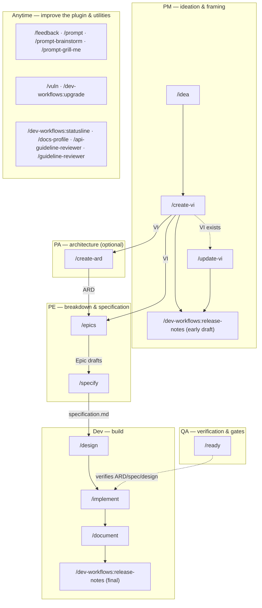
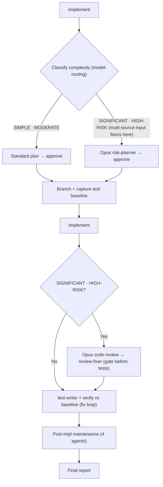

# dev-workflows

Twenty-one slash commands spanning idea refinement, VI authoring and updating, architecture (ARD), Epic drafting, specification authoring, engineering design, readiness gating, structured implementation, one-shot doc edits, docs-repo profile scanning, Jira-driven feature documentation, release-notes drafting, vulnerability remediation, and dependency upgrades — plus API and UI guideline reviewers and feedback/prompt/statusline utilities — with Opus-backed risk planning, post-implementation code review, test regression detection, and prose-style / Opus doc review gates.

> Part of the `ihudak-plugins` marketplace — see the [repo-root setup guide](../../README.md) for marketplace install + prerequisites (env vars, `jira-workitem-import`, AI-Containers, first command).

## Commands

| Command | Description |
|---------|-------------|
| `/implement <VI-KEY \| Epic-KEY \| jira-export-dir \| description \| @paths> [focus-Epic-KEY]` | Structured code implementation: accepts the shared Jira-input grammar — a **JiraID** (VI or Epic), an **imported-Jira directory**, or a **direct prompt/`@file`** (also `@spec`/`@repo`), optionally with a **focus Epic** (`<VI> <Epic>`); for a multi-Epic VI it renders the progress-aware Epic picker (done-predicate = the Epic's Jira status) and implements **one Epic per run**. Then load + classify multi-source input (spec file/folder, Jira ticket folder, one or more repos) → classify risk → fan-out scan when multi-source → plan (Opus for SIGNIFICANT / HIGH-RISK) → branch → capture test baseline → implement → write and verify tests → Opus review → verify baseline → document. |
| `/document <JiraID \| VI-KEY \| jira-export-dir \| description> [focus-Epic-KEY] [saas\|managed] [--counterpart <JiraID\|PR-url>]` | Accepts the shared Jira-input grammar — a **JiraID**, an **imported-Jira directory**, or a **direct prompt/`@file`** (plus the optional `saas\|managed` constraint). **Direct mode:** one-shot doc editing (single-file additions, README tweaks, Obsidian notes, formatting). No branch, no tests, no code review, no commit. Always SIMPLE or MODERATE. **Jira mode:** pass a Jira VI key or an imported-Jira directory to run the Jira-driven feature-documentation workflow end to end (resolves repos/specs, writes into the docs repo, branches/commits, and — opt-in — squashes, pushes, and drafts a PR). On a space-constrained run, `--counterpart` (or auto-discovery) grounds the doc on the other space's existing pages — read-only, never copied, never an image source. Phase 0 runs a toolchain preflight (stops a run whose linter/build tooling is absent), and every verification gate records a ledger row that `doc-reviewer` gates on — including a new `image_review` gate for its single, always-running image phase, which reviews both new screenshots and possibly-stale ones already on an extended page (listed per occurrence, swapped via CDN-URL replacement — an image is never refreshed in place). A deprecation or other hand-authored announcement can land on its real cross-cutting page (a profiled `announcement_pages` target) alongside the feature-subtree write. Rendered pages carry no Jira/PR provenance (traceability lives in the commit and the run handoff). Phase 8's `CLAUDE.md` / knowledge-base maintenance edits are only ever *proposed*; an accepted proposal is applied in a later phase, after the docs commit is sealed, and left uncommitted so it never rides the docs PR. |
| `/docs-profile` | Scans a docs repo and writes/refreshes its docs-profile (`.dev-workflows/docs-profile.yml` + CLAUDE.md guidance) as a reviewable PR. Consumed by `/document` (Jira mode). |
| `/epics <VI-KEY \| jira-export-dir> [focus-Epic-KEY]` | Jira-driven Epic drafting. Accepts the shared Jira-input grammar — a **VI key** (discovered under `$VAULT_PATH/jira-products/`) or an **imported-Jira directory** (works when `$VAULT_PATH` is unset); an explicit focus Epic (`<VI> <Epic>`) is honored as a refinement target — it re-drafts just that Epic. Reads the Value Increment + its existing Epics, optionally scans code repos for reusable capabilities and gaps, drafts one markdown file per new Epic under the vault (`jira-drafts/<VI-KEY>/`, or an `epic-drafts/<VI-KEY>/` dir beside the import when `$VAULT_PATH` is unset), gated by Opus `epic-reviewer`. cwd-agnostic; never branches or commits. |
| `/release-notes <KEY \| jira-export-dir> [focus-Epic-KEY]` | Jira-driven release-notes drafting. Accepts the shared Jira-input grammar — a **ticket key** or an **imported-Jira directory** (works when `$VAULT_PATH` is unset); an explicit focus Epic (`<VI> <Epic>`) scopes the draft to that Epic. Reads the ticket, optionally grounds in merged PR diffs, and renders **exactly one** dynatrace-docs release-notes Summary, shaped by the destination it routes to (per `references/release-note-types.md`) — a `{{#context}}` label + `### title` + prose for `feature-updates` / `breaking-changes`, or one bare past-tense sentence for `fixes` — plus an orthogonal deprecation note (end-of-life required, end-of-support optional) when triggered; no IDs, no `Change type:` line, no `{{#internal-note}}`. The `{{#context}}` label is the imported `release_notes_category` used verbatim, and the line is omitted when the import carries none. The Change Type is sourced from the import, else inferred, and is confirmed with you only on a low-confidence inference — by shape and destination, never by enum label. The run is gated on the imported `relevant_for_release_notes`. Runs a light `dt-style-checker` gate, and always writes a persistent draft **file** (the vault project folder when `$VAULT_PATH` is set, else beside the import) to paste into Jira. Never branches, commits, or writes into the docs repo. |
| `/idea <prompt \| @file \| JIRA-KEY> [--deep] [--ground-code [<repo>,…]] [--no-docs] [--no-prior-art]` | Idea refinement (PM phase, front of the VI-creation flow). Ingests one source — an inline **prompt**, a **markdown file** (wikilinks + images followed), a **community post**, or an exported **Jira ticket** (`$VAULT_PATH/jira-products/<KEY>`) — either product feedback (an RFE) or an existing **Value Increment** the idea extends, parallels, or rewrites (typed from the export's `issue_type`, never the project prefix) — via the read-only `idea-reader` subagent (auto-detects type with provenance tags). Also grounds, optionally, on `$DOCS_PATH` documentation and vault prior art (`references/vault-prior-art.md`; `vault-prior-art-finder`) — both disableable per run. With `--ground-code` it also grounds against mounted code — a `code-scanner` fan-out (cap 4) followed by a seeded narrow round per `references/model-routing/classification.md` §8.5 — writing what it finds to an optional `## Feasibility grounding` section with `file:line` citations. Off by default; a run that names a mounted repo gets one line suggesting the flag, never a prompt. Refines it through the embedded one-question-at-a-time grill — **bounded** (≤10 questions; leftover gaps → `[NEEDS CLARIFICATION]` capped at 3 + logged Assumptions) or **relentless** with `--deep` — and writes a lean one-page `idea.md` (per `references/idea-format.md`, incl. an optional `## Prior art` section) to `$VAULT_PATH/<container>/<slug>/` — the container derived from the source's own location, or from a high-confidence prior-art match via the Phase 4 gate — keyless, `status: refined` iff zero open clarifications remain. The grill is the quality gate (no reviewer at the idea stage). Adaptive next-phase offer toward `/create-vi`. Never writes to Jira or code; on a completed handoff (Phase 5) it relocates `idea.md` into `$SPECS_PATH/specifications/<KEY>-<slug>/` and, behind your consent, hands it off via `handoff-to-main` (`references/phase-handoff.md` §2) — declining leaves it relocated but not on the default branch, and `/create-vi <KEY>` will not find it until it is. |
| `/create-vi <JIRA-KEY> [@idea.md] [--from-vi <VI-KEY\|path>] [--lean\|--hybrid\|--full]` | VI authoring (PM phase, sub-project 2 of the VI-creation flow). Turns a refined `idea.md` + a **user-supplied Jira key** (empty workitem created first; mandatory) into a product-level **Value Increment** — a mandatory spine (Problem · Goal · Target audience · User Stories · Acceptance Criteria · Scope · Success Metrics) plus an adapt-in menu selected by `--lean\|--hybrid\|--full` and pulled only when the idea warrants it. Also grounds, optionally, on vault prior art (`references/vault-prior-art.md`) — disableable per run. Authored via a relentless grill against `references/vi-format.md`, gated by the Opus `vi-reviewer`, written to `$SPECS_PATH/specifications/<KEY>-<slug>/<KEY>_<slug>.md` (`sources` propagated from the idea's real provenance) — `<KEY>` alone derives `idea.md` from the resolved feature folder, in-contract and gated via `require-on-main` (`references/phase-handoff.md` §3); an explicit `@<path>` is out-of-contract, read in place, never relocated and never gated (`/idea` alone relocates). Branch+PR handoff via `handoff-to-main` (§2), and a documented paste-into-Jira + re-import round-trip. Release-notes fields (`release_versions`, `change_type`, `release_notes_category`) are NOT captured — they are Jira dropdowns the PM sets on the ticket and the importer returns on the round-trip. Product-level: no code scan, no repos. Offers `/release-notes`, `/create-ard`, and `/epics` as next steps (per `references/next-phase-offer.md`). An existing-VI call is redirected to `/update-vi`; `--from-vi <VI>` seeds a new VI from a sibling (read-only, recorded in `seeded_from_vi`). |
| `/update-vi <KEY> [@transcript ...]` | VI update/refresh (PM phase). Refreshes an **existing** Value Increment — routine refresh or an obstacle-driven re-do. Resolves the VI **Jira-import-first** (`$VAULT_PATH/jira-products/<KEY>`, the source of truth; 3-day freshness gate — the frozen `$SPECS_PATH` draft is secondary), grounds on the VI + comments + any ARD/spec/`@transcript`, updates it via a relentless grill against `references/vi-format.md`, gated by the Opus `vi-reviewer`. Writes **canonical + archived** revisions to `$SPECS_PATH/specifications/<KEY>-<slug>/` (`<KEY>_<slug>.md` latest; prior snapshot under `revisions/`), branch+PR offer, and a documented paste-into-Jira + re-import round-trip. Product-level: no code scan, no repos. |
| `/create-ard <VI-KEY> [<Epic-KEY>]` | Architecture authoring (Product Architect phase, sub-project 3 of the VI-creation flow). **Optional**; grounds on the mounted implementation repos (architect-driven discovery — cheap `$REPOS_PATH` listing + `theme→repo` proposal + ask + mount-or-descope + `code-scanner`; **no PRs**) and authors an **ARD** (Context · Grounding findings with real `file:line` · Architecture decisions `AD-N: Binds/Prevents/Rule` · Cross-repo map · Stack & invariants · Edge cases · Open questions · Deferred) against `references/ard-format.md`. Scoped via the two-key grammar: `<VI-KEY>` → VI-level; `<VI-KEY> <Epic-KEY>` → Epic-level (inherits the VI-level ARD read-only; a big Epic can split per area → `<EPIC>-<area>_ARD.md`). Gated by the Opus `ard-reviewer`; tiered hard model gate (like `/design`); written to `$SPECS_PATH/specifications/<KEY>-<slug>/`; branch+PR offer. New `pa` role. Offers `/epics`/`/specify` (VI) or `/specify`/`/design` (Epic) next. |
| `/specify <VI-KEY \| Epic-KEY \| jira-export-dir> [focus-Epic-KEY]` | Jira-driven specification authoring (PE phase). Accepts the shared Jira-input grammar — a Jira **Epic (or VI) key** or an **imported-Jira directory** — optionally followed by a **focus Epic key** (`<VI> <Epic>` / `<dir> <Epic>`) to target one Epic inside a multi-Epic VI; a bare nested Epic key alone auto-resolves to its parent VI. For a VI with ≥2 Epics and no Epic already selected, Phase 2 renders a progress-aware Epic picker (○ not started / ◐ in progress / ● done) before the full read, scoping the interview to that Epic's subtree. Reads the item from pre-exported markdown, lightly grounds in code (auto-derived repos, soft advisory gate), and authors an org-standard `specification.md` (problem → scope → user stories → acceptance criteria → test cases) through a relentless one-question-at-a-time grill — resolving open questions live and leaving genuinely unresolvable ones as `- [ ]`. Durable/resumable via `_session.md` + `_glossary.md`; gated by Opus `spec-reviewer`; renders HTML; offers a branch+PR handoff to the specs repo's main branch (`Published: no`) for the future `/design` dev take-over. `/epics` *splits* a VI into Epic drafts; `/specify` *authors one specification* for a single item (or, via the picker, one Epic within a VI). |
| `/design <VI-KEY \| Epic-KEY \| jira-export-dir> [focus-Epic-KEY]` | Jira-driven engineering design authoring (Dev phase). Takes over a merged `specification.md` from the specs repo's main branch and authors a reviewed engineering `design.md` through a relentless one-question-at-a-time grill that **challenges** the spec (recording an `## Engineering review` section + open questions back onto it) and **designs** the implementation, grounded strictly in the fully-mounted code (hard repo gate — unmounted repos stop the run). Accepts the shared Jira-input grammar (`<VI> <Epic>` / `<dir> <Epic>`); for a multi-Epic VI it renders the progress-aware Epic picker (done-predicate `design.md` exists). A tiered model gate hard-stops SIGNIFICANT/HIGH-RISK work not on Opus. Durable/resumable via `_design-session.md` + `_design-glossary.md`; gated by Opus `design-reviewer`; `design.md` open questions hard-block handoff; offers a branch+PR handoff (`design/<EPIC>-<eslug>` / `design/<VI>-<vslug>`) to the specs repo's main for `/implement`. Does not read Jira content — the spec is the source of truth. |
| `/ready <VI-KEY \| Epic-KEY \| jira-export-dir>` | Status-anchored readiness gate (QA). Reads the Jira status (the source of truth — never a custom field) and **verifies** it against the actual ARD / specification / design artifacts, returning a `SUPPORTED` / `PARTIAL` / `NOT-SUPPORTED` verdict via the Opus `readiness-reviewer`. Read-only for Jira status — never sets it; an artifact resolved via `require-on-main` (`references/phase-handoff.md` §3) but not yet on the default branch is recorded as a finding capping the verdict at `PARTIAL`, never a stop. Its only authored write, the `_readiness.md` snapshot, is committed and handed off via `handoff-to-main` (§2) only behind your consent, never automatically. |
| `/feedback <text>` | Log a manual note about the plugin itself (`origin: manual`), tied to no command. Part of the session-feedback improvement loop; persisted specs-first per `references/feedback-emission.md`. |
| `/prompt <text>` | Capture a corrective interaction (a command produced something wrong; you fix it) as Friction + verbatim prompt + Resolution (`origin: prompt`), then act on the correction directly. |
| `/prompt-brainstorm <text>` | Same capture as `/prompt`, then hand off to `superpowers:brainstorming`. |
| `/prompt-grill-me <text>` | Same capture as `/prompt`, then grill the fix **inline** — a bounded one-question-at-a-time interrogation following the embedded grilling technique. Self-contained; no plugin dependency. |
| `/dev-workflows:statusline` | Install the plugin's multi-line, truecolor status line into `~/.claude/settings.json` (idempotent; backs up any existing script + block). **Run this first** — use the fully-qualified name; the bare `/statusline` is Claude Code's own built-in command. Also enables the Option-B cost cross-check. |
| `/api-guideline-reviewer` | Standalone review command — reviews OpenAPI specification files against Dynatrace REST API + IAM permission naming guidelines. |
| `/guideline-reviewer` | Standalone review command — reviews Dynatrace app code and UI against the Dynatrace Experience Standards (GUIDElines). |

**Next-step guidance.** Every pipeline command ends its report with an adaptive `### Next step` recommendation naming the next command(s) and the owning role (PM / PA / PE / Team) — guidance only, never auto-invoked; omitted in a command's direct / doc-edit mode. The role-aware routing graph lives in `references/next-phase-offer.md`.

**Which docs command?** `/document` (direct mode) is for one-shot manual doc edits (no Jira, no branch/commit). `/document` (Jira mode) is the Jira-driven feature-documentation workflow end to end (resolves repos/specs, writes into the docs repo, branches/commits, and — opt-in — squashes, pushes, and drafts a PR). `/docs-profile` is a one-time profiler that generates a repo's `.dev-workflows/docs-profile.yml` (consumed by `/document` Jira mode).

**Counterpart-space grounding (`/document <VI> saas|managed`).** When you document one space, someone may already have written the *other* space's docs for the same feature. `/document` discovers that counterpart page (in-tree keyword search + `git log --grep`, or an explicit `--counterpart <JiraID|PR-url>` for an unmerged PR) and hands it to the writer as **read-only grounding** — concepts, terminology, and structure to consult, never text to copy and never screenshots to reuse (Managed and SaaS UIs differ; target images still come from `$VAULT_PATH`). If the counterpart page is already pulled into your target's render, the run tells you the space may already be covered.

**Documentation grounding (`$DOCS_PATH`).** When `$DOCS_PATH` (default `/workspace/docs`) is set and points at a readable directory containing at least one markdown file, `/idea`, `/create-vi`, `/update-vi`, `/create-ard`, `/specify`, `/epics`, and `/release-notes` ground automatically on the product's existing shipped documentation — via the read-only `docs-grounder` agent (see `references/docs-grounding.md`). Disable per-run with `--no-docs`, or point at a different root with `--docs <path>`. Grill commands rank the grounding into their existing gap list (never adding extra questions); writer commands attach the digest to the writer handoff. Every miss is a silent, non-blocking skip — the run behaves exactly as it does without `$DOCS_PATH` set. `/document` does not consume this grounding; it only uses `$DOCS_PATH` as a docs-repo discovery hint (see "Which docs command?" above).

**Vault prior-art grounding (`$VAULT_PATH`).** Unlike `$DOCS_PATH`, `$VAULT_PATH` has **no default** — it is a write root. When it is set and resolves to an existing directory with a `Projects/Products/` or `Projects/ideas/` subtree, `/idea` and `/create-vi` ground automatically on tracked initiatives that already cover, precede, parallel, or are superseded by the new work — via the read-only `vault-prior-art-finder` agent (see `references/vault-prior-art.md`). It searches `Projects/Products/**` and `Projects/ideas/**` — a few hundred markdown files, retrieved by `Glob`/`Grep` with no retrieval index. Disable per-run with `--no-prior-art`. Grill commands rank the resulting challenges into their existing gap list (never adding extra questions). Every miss is a silent, non-blocking skip.

**Code grounding (`--ground-code`, `/idea` only).** Off by default and never auto-triggered. `--ground-code` bare derives a repo set from the idea's themes and the directories under `${REPOS_PATH:-/workspace}` (one confirm gate); `--ground-code <repo>,<repo>` scans exactly those. Round 1 is the standard `code-scanner` fan-out (cap 4); a theme it leaves inconclusive gets **one** narrow follow-up round seeded with round 1's verified `file:line` anchors, per `references/model-routing/classification.md` §8.5 — there is no round 3. Findings enter the grill as facts, not questions, except one that contradicts the idea's premise, which competes for a question slot like any other challenge. They land in `idea.md`'s optional `## Feasibility grounding` section, never in `Signals & evidence` (which is demand evidence only).

Most pipeline commands classify tasks as SIMPLE / MODERATE / SIGNIFICANT / HIGH-RISK before acting via the `model-routing` skill — `/implement`, `/document` (both modes), `/epics`, `/release-notes`, `/idea`, `/create-vi`, `/create-ard`, `/specify`, `/design`, and `/ready` (`/document` direct mode only ever lands SIMPLE or MODERATE; `/document` Jira mode is typically SIGNIFICANT; `/specify` Phase 1.5 is typically MODERATE; `/design` Phase 1.5 scales grill/section/review depth and gates the model tier). `/docs-profile` runs at a fixed SIGNIFICANT (no per-task classification). The three code-oriented commands (`/implement`, `/vuln`, `/upgrade`) also:
- Create a feature branch before touching any file
- Route SIGNIFICANT / HIGH-RISK work through Opus for planning and post-implementation review
- Gate the test run on the review verdict (no tests until BLOCK is cleared)
- Capture a pre-change test baseline and diff after changes

`/implement` adds test-writing (Phase 3.5) between implementation and review, then verifies the baseline.

## Workflow overview

The commands form a role-based pipeline. Each role has a starting command and hands a concrete artifact to the next role. `/idea → /create-vi` (PM) opens it; `/document` + `/release-notes` (Dev) close it.

Names shown as `/dev-workflows:<command>` are the ones that collide with a Claude Code built-in of the same name — `/release-notes`, `/upgrade`, and `/statusline`. Typing the bare form reaches Claude Code's own command instead, so use the qualified form for those three. Every other command works either way. See rule 6 of `references/next-phase-offer.md`.

| Role | Starts with | Consumes | Produces → where it lands |
|------|-------------|----------|---------------------------|
| **PM** | `/idea`, `/create-vi <KEY>`, `/update-vi <KEY>`, `/release-notes <VI>` | a prompt / community post / RFE / existing VI; then a refined `idea.md` + a JIRA-KEY | `<KEY>_<slug>.md` in `$SPECS_PATH/specifications/<KEY>-<slug>/` (`/idea` relocates `idea.md` in; `/create-vi` reads it there, never relocating); an early release-notes draft in the vault; paste-to-Jira → re-import to `$VAULT_PATH/jira-products/<KEY>/` |
| **PA** *(optional)* | `/create-ard <VI> [<Epic>]` | the VI (and Epic) | `<VI>_ARD.md` / `<EPIC>-<area>_ARD.md` in the same specs feature folder |
| **PE** | `/epics <VI>`, `/specify <VI> [<Epic>]` | the VI (+ ARD, existing Epics) | Epic drafts in `$VAULT_PATH/jira-drafts/<VI-KEY>/`; `specification.md` on the specs-repo main (branch + PR) |
| **Dev** | `/design <VI> <Epic>`, `/implement <VI> <Epic>`, `/document <VI>`, `/release-notes <VI>` | the `specification.md` (+ ARD); `design.md`; the code repos | `design.md` on the specs-repo main; code + PR in `$REPOS_PATH`; product docs in the docs repo; the final release-notes draft in the vault |
| **QA** | `/ready <VI \| Epic>` (+ the Opus reviewer gate embedded in every authoring/build command) | the Jira status + the ARD / spec / design artifacts | a `SUPPORTED` / `PARTIAL` / `NOT-SUPPORTED` verdict — read-only; sets no status |

**`/specify` VI-level scope.** `/specify <VI>` (no focus Epic) is valid and stays in the PE lane — the `[<Epic>]` above is genuinely optional, it's just collapsed at this diagram's role-level granularity. For a VI with **≥2 Epics**, Phase 2 renders the Epic picker and offers three paths: pick one Epic (the usual per-Epic spec), explicitly **"Author one broad VI-level spec instead,"** or the tool's own recommendation, **"Split into Epics first with `/epics`, then re-import."** For a **single-Epic VI**, `/specify <VI>` auto-resolves to that Epic — there is no true VI-level path in that case. A broad VI-level spec writes one `specification.md` for the whole VI (branch `spec/<VI>-<vslug>` instead of `spec/<EPIC>-<eslug>`), and its `### Next step` recommendation points to `/epics <VI>` (still PE) rather than `/design <VI> <Epic>` (Dev).

**Sources of truth & artifact homes**

- **Jira** is the source of truth for workflow *status*. The external `jira-workitem-import` tool imports the ticket tree into `$VAULT_PATH/jira-products/<KEY>/`; the plugin reads status but **never sets it**.
- **`$SPECS_PATH/specifications/<KEY>-<slug>/`** — the shared, team-visible home for the VI, ARD, `specification.md`, and `design.md`.
- **`$VAULT_PATH`** — your personal store: `Projects/…/<slug>/idea.md` (depth per the container rule), the imported `jira-products/` tree, `jira-drafts/<VI-KEY>/` Epic drafts, and release-notes drafts.
- **`$REPOS_PATH`** — the code clones (`/implement` works on branches + PRs here); product documentation is written into the external **docs repo**.
- **Plugin-generated artifacts live in the specs repo.** Feedback, cost, and follow-up files are written under `<VI-dir>/dev-workflows/` in `$SPECS_PATH` — `<KEY>-feedback.md`, `cost/<sid8>.md`, and `<KEY>-followups.md`. **Committing and pushing these alongside the specs is expected and encouraged** — team-visible feedback and cost transparency is the point, not clutter.

**Cross-cutting commands (any time)**

- **Plugin improvement — please use these.** `/feedback` logs a note about the plugin itself; `/prompt`, `/prompt-brainstorm`, and `/prompt-grill-me` turn a correction you just made into logged feedback plus a fix. This is how the plugin keeps getting better — run them whenever something felt off, on any command.
- **Standalone maintenance.** `/vuln` (CVE remediation) and `/upgrade` (dependency / runtime upgrades) run on their own, outside the VI pipeline.
- **Setup & repo tooling.** `/dev-workflows:statusline` (install the status line — run this first; use the fully-qualified name, since the bare `/statusline` is Claude Code's own built-in command), `/docs-profile` (bootstrap a docs repo's profile), `/api-guideline-reviewer` and `/guideline-reviewer` (Dynatrace API / UI compliance reviews).

*Legend: **Dev** is the plugin's "Team" lane; **QA** denotes verification and quality gates, not an artifact-authoring role; `/release-notes` appears twice because it serves a PM early draft (from the VI alone) and a Dev final draft (grounded in the merged PR diffs).*

## Session feedback

Beyond the workflow commands, dev-workflows captures **friction and improvement
signals about the plugin itself** and persists them per-VI into the specs repo,
so the plugin maintainer can aggregate feedback across engineers and plan
improvements. Capture is **silent and high-recall** — there is no approval gate;
curation is the maintainer's job, centrally, at analysis time.

- **Automatic.** The end-of-run maintenance phase of all thirteen workflow commands
  (`/implement`, `/document`, `/epics`, `/vuln`, `/upgrade`, `/release-notes`,
  `/specify`, `/design`, `/idea`, `/create-vi`, `/update-vi`, `/create-ard`, `/ready`) projects the plugin-facing slice of the
  `impl-maintenance` report (command workflow improvements, new agents/skills,
  reference-doc gaps) into a feedback entry (`origin: auto`). A routine session
  with no plugin-facing signal writes nothing.
- **`/feedback <text>`** — a universal manual note about the plugin, tied to no
  command (`origin: manual`).
- **`/prompt <text>`** — capture a corrective interaction (a command produced
  something wrong; you fix it) as Friction + your verbatim prompt + the
  Resolution, then act on the correction directly (`origin: prompt`).
- **`/prompt-brainstorm <text>`** — same capture, then hand off to
  `superpowers:brainstorming`.
- **`/prompt-grill-me <text>`** — same capture, then grill the fix **inline** — a
  bounded one-question-at-a-time interrogation of the correction following the
  embedded grilling technique. Self-contained; no plugin dependency.

**Graceful degradation.** Persistence is **specs-first** (central aggregation is
the point) and deterministic: `$SPECS_PATH` VI dir
(`<VI-dir>/dev-workflows/<KEY>-feedback.md`) → `$SPECS_PATH/dev-workflows-feedback/`
→ a writable vault (with a loud "won't auto-aggregate to the maintainer" notice)
→ beside an imported Jira directory → report-only. It **never** writes into the
current working directory, and no capture phase ever fails the run. See
`references/feedback-emission.md`.

## Session cost reporting

dev-workflows records how many **dollars** a Value Increment cost across its
whole lifecycle — by **phase**, **role**, and **model** — persisted per-VI into
the specs repo so the maintainer can aggregate spend across engineers and teams.
Claude Code exposes no dollar figure to a command, so cost is **computed** from
transcript token usage (the main transcript + the session's subagents) times a
price table; an optional statusline snapshot cross-checks it.

- **Terminal cost phase** on the eleven VI-lifecycle commands (`/idea`, `/create-vi`, `/update-vi`, `/create-ard`, `/specify`, `/epics`,
  `/design`, `/implement`, `/ready`, `/document`, `/release-notes`). It **always runs** and
  always advances a per-session **chained checkpoint** (each command's window
  starts where the previous one ended), so per-command costs sum to the session
  total. `/vuln` and `/upgrade` are out of scope (no VI to attribute to).
- **Per-invocation, append-only entries** in
  `<VI-dir>/dev-workflows/cost/<sid8>.md` — one file per session (`<sid8>` = the
  first 8 chars of the session id), so nothing merge-conflicts across many teams
  or one person's N sessions. Machine-friendly YAML (phase, role, per-model split,
  duration, `cost_computed_usd`, and — when the plugin statusline is installed
  and a prior checkpoint baseline is already recorded (i.e., not the session's
  first cost phase) — `cost_statusline_usd`). **No user name is ever written.**
- **Attribution** is a fixed per-command phase/role map, except `/release-notes`,
  whose phase/role is inferred from whether any `specification.md` / `design.md`
  exists under the VI (a PM's early bare-VI run vs. a dev's documenting re-run).
- **Graceful degradation** (specs-first, never the cwd): `$SPECS_PATH` VI dir →
  a pending file for keyless runs (opportunistically reconciled later) → a
  writable vault (with a "won't auto-aggregate" notice) → beside an imported Jira
  directory → report-only. The price table is overridable via
  `$DEV_WORKFLOWS_COST_PRICES`. See `references/cost-emission.md`.

## Statusline

`/dev-workflows:statusline` installs the plugin's multi-line, truecolor status
line (session identity, git branch, context bar, cost, tokens, rate limits)
into `~/.claude/settings.json`. Installation is idempotent and backs up any
existing script and `statusLine` block before writing. Installing it also
enables the **Option B** cost cross-check: the shipped script writes a
per-render `{ts, cost_usd}` snapshot that the cost phase compares against its
transcript-computed estimate (a drift signal for refreshing the price table).

> Claude Code has a built-in `/statusline` command of its own (backed by the
> `statusline-setup` agent) that configures a plain, single-line status line.
> Because the plugin's command shares that name, the bare `/statusline`
> resolves to Claude Code's built-in flow, not this one — always invoke the
> fully-qualified `/dev-workflows:statusline` to install the plugin's status
> line.

## `/implement` workflow

`/document` (both modes) and `/epics` never run tests and never touch production code. Only `/document` (Jira mode) can create a branch (opt-in at plan approval, and only when a docs repo is detected) — and, also opt-in, squash + `git push` it and emit a copy-paste PR draft (it writes a draft rather than opening the PR — Bitbucket has no CLI that can; the GitHub-hosted specs repo does get a real PR, via `references/phase-handoff.md`).

When a `specification.md`/`design.md` is in scope on a SIGNIFICANT/HIGH-RISK run, `/implement` runs a **spec/design-conformance ("converge") check** — the Opus `code-review` traces every in-scope `[Uxx]`/`[ACxx]`/`[TCxx]` against the shipped diff, and unresolved `missing`/`contradicts` gaps are escalated as `- [ ]` notes back onto the spec/design. Bug-shaped tasks additionally follow `references/bug-diagnosis.md` — a red-capable repro before hypotheses, 3–5 ranked falsifiable hypotheses, and `[DEBUG-xxxx]` instrumentation stripped before the review diff is captured.

Additionally:

| Command | Description |
|---------|-------------|
| `/vuln CVE-XXXX-XXXXX[:JIRA-ID]` | Fix CVEs: research (NVD + baseline in parallel, then Detect per CVE) → classify → branch → fix → Opus review (SIGNIFICANT / HIGH-RISK) → compare baselines → PR. |
| `/upgrade component:version` | Upgrade dependencies: compat check → Opus plan (SIGNIFICANT / HIGH-RISK) → branch → apply → Opus review → compare. |

## Agents

Thirty-three reusable subagents (invoked internally by the commands). The nine Opus-backed reviewers/planners are pinned; the rest have no fixed pin — their tier is assigned per the model-routing policy (mechanical → Sonnet, synthesis/review → Opus).

| Agent | Model | Description |
|-------|-------|-------------|
| `risk-planner` | Opus | Risk-weighted planner for SIGNIFICANT / HIGH-RISK tasks. Returns a structured plan with security, migration, API-stability, concurrency, dependency, rollback, and test-adequacy sections. Refuses SIMPLE / MODERATE and returns a re-classification notice instead. |
| `code-review` | Opus | Post-implementation reviewer — 8 dimensions (correctness, security, architecture, edge cases, migration, dependencies, test adequacy, rollback). Verdict: PASS / PASS WITH RECOMMENDATIONS / BLOCK. BLOCK gates the test run. |
| `doc-reviewer` | Opus | Product-documentation reviewer for `/document` — 17 dimensions including factual correctness, completeness vs plan, audience fit, structural integrity (incl. anchor form), page structure conventions (callout scope + component-pattern fidelity), YAML frontmatter, screenshots (both `image_policy` branches, incl. stale-image swap completeness), snippets, actionability, source traceability (a Jira key or PR URL in a rendered page is a MAJOR — the rendered page carries no source provenance), cross-space grounding integrity, and style-check follow-through. |
| `epic-reviewer` | Opus | Epic-draft reviewer for `/epics` — 9 dimensions including goal clarity, testable acceptance criteria, scope boundaries, dependencies, non-duplication vs sibling Epics (BLOCKER), and reference-path evidence (when `code-scanner` output is provided). |
| `spec-reviewer` | Opus | Specification reviewer for `/specify` — checks problem/scope clarity, user-story and acceptance-criteria testability, test-case coverage, open-question resolution (BLOCKER on unresolved `- [ ]` items that could be resolved live), and adherence to the org-standard `specification.md` format. |
| `design-reviewer` | Opus | Engineering-design reviewer for `/design` — validates `design.md` against the `design-format` authority (section inclusion scaled by classification) and traceability to its `specification.md` (every in-scope requirement covered; BLOCKER on a gap), plus interface concreteness, seam/test-strategy soundness, architecture coherence, and risk coverage. Treats any unresolved `design.md` `- [ ]` open question as a BLOCKER. Verdict: PASS / PASS WITH RECOMMENDATIONS / BLOCK. |
| `vi-reviewer` | Opus | Value-Increment reviewer for `/create-vi` — validates the VI against `references/vi-format.md`: mandatory-spine completeness, testable acceptance criteria, scope/success-metric clarity, and hollow-prose / filler (MAJOR). Verdict: PASS / PASS WITH RECOMMENDATIONS / BLOCK. |
| `ard-reviewer` | Opus | Architecture-decision-record reviewer for `/create-ard` — checks each `AD-N` has a concrete Binds/Prevents/Rule, grounding findings cite real `file:line`, the cross-repo map is coherent, and open questions are surfaced. Verdict: PASS / PASS WITH RECOMMENDATIONS / BLOCK. |
| `readiness-reviewer` | Opus | Readiness reviewer for `/ready` — verifies the Jira status against the actual ARD/spec/design artifacts and returns a SUPPORTED / PARTIAL / NOT-SUPPORTED readiness verdict. Read-only; never sets Jira status. |
| `test-baseliner` | per routing | Runs the test suite in `capture` or `verify` mode; `verify` diffs against a prior baseline and returns a structured regression report. Framework detection: Maven, Gradle, npm, pytest, Makefile. |
| `test-writer` | per routing | Writes tests for new or changed behaviour based on a diff. Never runs tests. Framework detection mirrors `test-baseliner`; returns "not detected" immediately if no framework is configured. |
| `review-fixer` | per routing | Applies BLOCKER / MAJOR findings from a `code-review` report; returns a structured fix report with a `Stop condition flag` so callers know whether to re-review. Used by `/implement`, `/vuln`, `/upgrade`. |
| `upgrade-planner` | per routing | Phase-1 compatibility planner for `/upgrade`: detects the component, resolves the target version (exact/minor/latest/lts/bare), and verifies compatibility with other components. Returns a structured upgrade plan or a conflict report. |
| `upgrade-executor` | per routing | Phase-2 executor for `/upgrade`: applies the plan for one component, runs the build, verifies tests via `test-baseliner`, and auto-fixes test-code breakage from the new version's API changes. |
| `vuln-research` | per routing | Read-only research phase of `/vuln`: NVD lookup, library detection, current-version discovery, and minimum-safe-version resolution. No side effects. |
| `vuln-fixer` | per routing | Fix phase of `/vuln`: captures a baseline, applies the minimal version bump, rebuilds, verifies tests, commits to a branch, and opens a PR. |
| `doc-fixer` | per routing | Applies BLOCKER / MAJOR findings from a `doc-reviewer`, `epic-reviewer`, or `docs-style-checker` report. Shared between `/document` and `/epics`. Returns the same `Stop condition flag` contract as `review-fixer`. |
| `docs-style-checker` | per routing | Runs the docs repo's project-configured prose linter (Vale via `.vale.ini`, `package.json` `*:lint` / `lint:*` script, markdownlint, or remark) on files written by `/document` Phase 6.3 and emits findings for `doc-fixer`. |
| `doc-planner` | per routing | Synthesises Jira data + per-repo diff summaries + confirmed write targets into a documentation checklist the writer follows and `doc-reviewer` checks against. Detects the repo's `image_policy` (`local` / `cdn_upload_required` / `ambiguous`). |
| `doc-location-finder` | per routing | Finds the write target(s) in a docs repo — `extend-existing`, `new-page-in-existing-section`, or `new-section` — with confidence scoring. Never writes content. |
| `doc-writer` | per routing | Writes product documentation for `/document` Phase 6.3 from a structured handoff file — applies the `doc-planner` checklist, approved per-page write strategies (conditional / override-copy / plain), discrepancy decisions, snippets, screenshots, frontmatter, and internal links. Write-only; never runs git. |
| `counterpart-finder` | per routing | For a space-constrained `/document` run, finds the OTHER space's existing docs for the feature (in-tree keyword search + `git log --grep`, or an explicit `--counterpart` Jira/PR ref via the diff-summarizer resolver) and returns read-only grounding. Never writes; never an image source. |
| `jira-reader` | per routing | Reads the pre-exported Jira markdown hierarchy (VI, Epics, Stories, Sub-tasks, Research, RFA) from `$VAULT_PATH/jira-products/<KEY>/`. Three depths (`full`, `vi-plus-epics`, `vi-only`). Parses PR URLs and classifies hosts (`github_cloud`, `bitbucket_cloud`, `bitbucket_server`, `other`). Read-only. Used by `/document`, `/epics`, `/release-notes`, `/implement` (multi-source input), `/create-ard`, `/specify`, and `/ready`. |
| `idea-reader` | per routing | Read-only ingester for `/idea` — auto-detects the source type (inline prompt, markdown file with followed wikilinks/images, community post, or an exported Jira ticket — either an RFE or an existing Value Increment the idea extends, parallels, or rewrites) and returns a provenance-tagged normalization. Never writes files. |
| `docs-grounder` | per routing | Read-only documentation grounding on `$DOCS_PATH` for `/idea`, `/create-vi`, `/update-vi`, `/create-ard`, `/specify`, `/epics`, and `/release-notes` — retrieves via the `qmd` CLI (falls back to keyword-overlap + `git log --grep`) and returns a bounded digest of `docs_references` (positive grounding: same-feature / analogous-precedent / building-block facts) plus `docs_challenges` (reconciliation prompts, incl. `diverges_from_precedent`). Never writes; advisory only — not Opus-pinned. |
| `vault-prior-art-finder` | per routing | Read-only prior-art discovery on the vault for `/idea` and `/create-vi` — searches `Projects/Products/**` and `Projects/ideas/**` (excluding `Jira - <KEY>/` snapshots, Value Packs, and `_archive/`) and returns a bounded digest of `prior_art` matches (each classified by relation — `same_capability`, `predecessor_phase`, `analogous_precedent`, `supersedes_self`, `adjacent_initiative` — and status-resolved via `references/vault-prior-art.md`'s ladder) plus `prior_art_challenges` and a write-path `area_proposal`. Never writes; advisory only — not Opus-pinned. |
| `release-notes-writer` | per routing | Renders the dynatrace-docs authored release-notes body for a Jira VI or ticket — exactly ONE Summary per run, shaped by the destination it routes to: a `{{#context}}` label + `### title` + prose for `feature-updates` / `breaking-changes`, or one bare past-tense sentence for `fixes`. Emits no Jira IDs, no PR links, and no `{{#internal-note}}` block. Does not write files; returns the draft to the caller. Used by `/release-notes`. |
| `diff-summarizer` | per routing | Resolves a single repo's PR diffs and returns a doc-focused summary. GitHub uses the `gh` CLI when available; Bitbucket Cloud / Server + GitHub-fallback use local-git strategies (branch search, merge-commit grep, Jira-key commit grep). Designed for parallel invocation (caller caps at 4 concurrent). |
| `code-scanner` | per routing | Scans one repo for existing capabilities and gaps relative to themes (from an Epic, an implementation spec, or an idea's themes). Fanned out one-per-repo, cap 4 concurrent, with an optional narrow second round for themes round 1 left inconclusive (`classification.md` §8.5, used by `/idea` and `/implement`); evidence entries may carry an optional `lines` array when the match came from a grep hit. Used by `/epics`, `/implement` (multi-source fan-out), `/idea` (`--ground-code`, broad-then-narrow per `references/model-routing/classification.md` §8.5), `/create-ard`, `/specify`, and `/design`. |
| `epic-writer` | per routing | Writes child Epic-definition files for `/epics` Phase 6 from a structured handoff file — one file per Epic, following the Epic template, traceable to the `jira-reader` handoff and `code-scanner` evidence. Write-only (vault content); never commits. |
| `impl-maintenance` | per routing | Post-session lessons-learned analyst. Reads the session handoff, scans CLAUDE.md rules / hooks / reference docs / agents, and returns a structured Lessons Learned report with actionable suggestions. Suggest-only; does NOT write files. |
| `guideline-reviewer` | per routing | Reviews Dynatrace app code and UI for compliance with Dynatrace Experience Standards (GUIDElines). Checks AppHeader, DataTable, FilterField, Connections, Permissions, Settings, Dashboards, accessibility/WCAG, terminology, and Grail naming. |
| `api-guideline-reviewer` | per routing | Reviews OpenAPI specification files against Dynatrace REST API and IAM permission naming guidelines. Checks version consistency, required elements, naming conventions, IAM scope format, HTTP status codes, and schema composition. |

Agents are dispatched by `subagent_type` (e.g. `dev-workflows:risk-planner`). Claude Code loads each agent's file body as its system prompt and honours its `model:` frontmatter — so the nine Opus gates (`risk-planner`, `code-review`, `doc-reviewer`, `epic-reviewer`, `spec-reviewer`, `design-reviewer`, `vi-reviewer`, `ard-reviewer`, `readiness-reviewer`) run on Opus automatically, with no caller-side `model` override or file-path reference.

## Hooks

| Hook | Trigger | Description |
|------|---------|-------------|
| `notify-done` | Stop | Desktop notification when Claude Code finishes a turn. |
| `preload-context` | UserPromptSubmit | Matches `/implement`, `/document`, `/epics`, `/release-notes`, `/vuln`, `/upgrade` (with at least one non-flag argument), then routes: full git context + model-routing reminder for `/implement`, `/vuln`, `/upgrade`; `$VAULT_PATH` + `$REPOS_PATH` + git branch (only if cwd is a git repo) for the Jira-mode commands (`/document` with a JiraID, `/epics`, `/release-notes`); silent pass-through for `/document` (direct mode) and `/docs-profile` (user manages git manually). |
| `test-notify` | PostToolUse:Bash | Parses test-command output and sends a desktop notification with pass/fail counts. |
| `changelog-owners-reminder` | PostToolUse:Edit\|Write\|MultiEdit | Warn-only `systemMessage` reminder when a dynatrace-docs content page is edited without a `changelog:` entry dated today, or (managed pages) without the required owners. Skips the changelog check for brand-new pages. Always exits 0. |

## Environment prerequisites

These commands run fine on a bare host, but they depend on a few external tools for their richest behaviour (per spec §17):

- **`gh auth login`** — required once on the host to enable `diff-summarizer`'s GitHub PR resolution path. Without it, GitHub URLs fall back to the local-git strategies (branch search → merge-commit grep → Jira-key grep) against the cloned repo. No hard failure.
- **No Bitbucket CLI is required or assumed.** Bitbucket Cloud and self-hosted Bitbucket Server URLs are resolved purely from the local clone — `diff-summarizer` never makes Bitbucket HTTPS calls.
- **`vale`** (optional but recommended) — when the target docs repo has `.vale.ini`, `docs-style-checker` invokes `vale` so the local check matches what the repo's CI runs. If `vale` is not on PATH, the agent falls back to the repo's `package.json` `*:lint` script, then to `dt-style-checker` from the `dt-style-guide` plugin. Style checks are always mandatory — `NOT_CONFIGURED` is returned only when no linter of any kind is available.
- **`dt-style-guide` plugin** (optional companion) — when `docs-style-checker` finds no repo-configured linter, `/document` (Jira mode) falls back to `dt-style-checker` from the `dt-style-guide` plugin (Dynatrace corporate style guide). `/epics` always uses `dt-style-checker` as its primary style gate (vault content has no repo linter). Both plugins are independently installable — without `dt-style-guide`, the fallback is skipped gracefully.
- **`qmd`** (optional) — enables semantic retrieval for `docs-grounder`'s `$DOCS_PATH` documentation grounding (see "Documentation grounding" above). Without it, `docs-grounder` falls back to keyword-overlap + `git log --grep` matching — host users only; the AI Container installs `qmd` automatically.
- **Recommended environment: [ihudak/ai-containers](https://github.com/ihudak/ai-containers).** The commands work best inside the AI Container, which:
  - Mounts every repository and the Obsidian vault under a single `/workspace` umbrella (`/workspace/<repo>`, vault at `/workspace/vault`), so the default `$REPOS_PATH` (`/workspace`) and exported `VAULT_PATH` just work. Repos are located by matching each PR's slug against `git remote get-url origin`, so a clone's directory name need not equal the slug.
  - Installs `gh` automatically.
  - Mounts `~/.config/gh` from the host, so `gh auth login` on the host is sufficient — no re-auth inside the container.

  Outside the AI Container the commands still function; set `$REPOS_PATH` (single dir or colon-separated list) to wherever your clones live, and manage `gh` installation and `gh auth login` yourself.
- **`SPECS_PATH`** — Optional, AI-Containers env var (same rules as `VAULT_PATH`; mounted to `/workspace/specs` in-container). The deterministic source for a Jira ticket's specifications, at `$SPECS_PATH/{specs|specifications|vis}/…/<KEY>{-|_}<slug>/…/*.md`. Requirement varies by command: hard-required, no override (`choices: ["Set SPECS_PATH (enter the path)", "Cancel"]`) for `/design`, `/specify`, `/create-ard`, `/create-vi`, `/update-vi`, and `/ready` — each writes or reads its own deliverable there and has nowhere else to put it; required-with-override for `/implement` in Jira-driven mode only (prompts to point at a specs directory or "Proceed without specs — not recommended," logged as an assumption; direct-mode runs are exempt); additive/optional content grounding for `/document`, `/epics`, and `/release-notes` (richer when present, silent when absent); conditional deliverable content for `/idea` — `idea.md` relocates into `$SPECS_PATH` and hands off via `handoff-to-main` (`references/phase-handoff.md` §2) only once a Jira key exists (Phase 5), never a prerequisite for the run itself; and session-artifact bookkeeping only — no specs content read or written — for the remaining six (`/feedback`, `/prompt`, `/prompt-brainstorm`, `/prompt-grill-me`, `/upgrade`, `/vuln`), which — like all seventeen — degrade gracefully through `specs-repo-git.md`'s fallback ladder when it's unset.
- **Follow-up task & journal emission (all five Jira-driven commands).** At end-of-run, `/document`, `/release-notes`, `/epics`, `/implement`, and `/ready` persist their out-of-scope / manual-step follow-ups (files owned by other teams, implementation gaps, "paste into Jira", screenshots to upload) as durable Obsidian tasks — plus a `Journal.md` note when an item needs more than a task line — via a batch preview (`approve-all | select | cancel`). Self-contained: it works **without** the `obsidian-llm-wiki` plugin (it mirrors that plugin's task conventions internally). Without a writable vault it degrades gracefully down a ladder — `$VAULT_PATH` → the VI's `$SPECS_PATH` dir (`<VI-dir>/dev-workflows/<KEY>-followups.md`) → beside the imported Jira directory → report-only — and never writes into the current working directory. See `references/followup-emission.md`.
- **Specs-repo git completeness (all seventeen commands that write to `$SPECS_PATH`).** The specs repo maintains itself. At run start — as early as `$SPECS_PATH` is known (Phase 0 in most commands, Step 0 in `/vuln`, the shared mode-detection section in `/document`) — `specs-preflight` commits and pushes any artifacts a previous run left behind, retries a commit whose push failed, and settles the branch — switching away only from branches the plugin created, and standing still on anything else. As the run's last action — or, where a later phase cedes control to another skill or a long interactive stretch, immediately before that hand-off — `commit-artifacts` stages the bounded artifact paths, commits `<KEY|NOISSUE> Add dev-workflows session artifacts (<command>)`, and pushes; for the eight producing commands that opened a specs-repo pull request via `handoff-to-main` (`references/phase-handoff.md` §2), that push updates the PR they already opened. It is bounded to three path shapes inside `$SPECS_PATH`, never issues `git add -A` at repository scope, never force-pushes, never deletes a branch with `-D` or a lock file, and never fails the run. A detached HEAD blocks the commit outright and says so loudly — a commit made there would be unreachable and garbage-collectable, and reporting a SHA over it would be a failure that looked like success. See `references/specs-repo-git.md`.
- The Jira hierarchy under `$VAULT_PATH/jira-products/<KEY>/` is produced by the [`jira-workitem-import`](https://github.com/ivan-gudak/jira-workitem-import) tool, which imports tickets from Jira and maintains the index.

## Skills

| Skill | Invocable | Description |
|-------|-----------|-------------|
| `model-routing` | commands only | Loads the task-complexity classification rules and model fallback chain for commands that cannot expand `${CLAUDE_PLUGIN_ROOT}` themselves. |
| `dynatrace-docs-frontmatter` | user + model | Applies dynatrace-docs frontmatter conventions (changelog entries; managed-docs owners) when editing pages under `dynatrace/_content/**` or `managed/_content/**`. Paired with the `changelog-owners-reminder` hook. |

## Reference docs

`references/` contains the vendored reference docs the commands consult:

- `references/model-routing/classification.md` — four-level complexity taxonomy, model fallback chain, and fan-out policy
- `references/idea-format.md` — the lean one-page `idea.md` format authored by `/idea`
- `references/vi-format.md` — the Value-Increment format (mandatory spine + adapt-in menu) authored by `/create-vi`
- `references/vi-source-resolution.md` — `resolve-existing-vi`: Jira-import-first resolution of an existing VI with a 3-day freshness gate; consumed by `/update-vi` and `/create-vi --from-vi`
- `references/ard-format.md` — the ARD format (`AD-N: Binds/Prevents/Rule`) authored by `/create-ard`
- `references/specification-format.md` — the org-standard `specification.md` format authored by `/specify`
- `references/design-format.md` — the engineering `design.md` format authored by `/design`
- `references/bug-diagnosis.md` — bug-diagnosis discipline: a red-capable repro before hypothesising, 3–5 ranked falsifiable hypotheses, `[DEBUG-xxxx]` instrumentation with a mandatory cleanup gate, and a regression test at a correct seam
- `references/ard-resolution.md` — most-specific-first ARD resolution (per-area → Epic-level → inherited VI-level) consumed by `/create-ard`, `/design`, `/implement`, `/specify`, `/epics`, and `/ready`
- `references/grilling-technique.md` — the embedded bounded one-question-at-a-time grilling SSOT (used by `/idea`, `/create-vi`, `/update-vi`, `/create-ard`, `/specify`, `/design`, `/prompt-grill-me`)
- `references/next-phase-offer.md` — the role-aware next-step routing graph (PM → PA → PE → Team) emitted at the end of every pipeline command
- `references/session-hygiene.md` — the prepare-checkpoint + role-aware `/compact` vs `/clear` suggestion + `/rename` aid (guidance-only)
- `references/context-management.md` — mid-run context-window guidance cited by `/implement`
- `references/pre-lint.md` — the deterministic advisory pre-reviewer grep checks (universal + per-artifact)
- `references/prose-formatting.md` — never hard-wrap prose: each paragraph is one unbroken line, so Obsidian and IntelliJ soft-wrap it and a copy-paste into Jira/Grammarly needs no cleanup
- `references/escalation-rules.md` — canonical `choices:` prompt sets for the shared interactive escalation decision points (unresolved Jira key, unresolved / missing repo, dirty tree, refresh-blocked, reviewer BLOCK verdict)
- `references/jira-input-resolution.md` — the shared Jira-input grammar front-end (JiraID / imported-dir / prompt) resolution
- `references/workflow-states.md` — the readiness rubric + Jira-status → phase mapping consumed by `/ready`
- `references/dependencies.md` — recommended companions (`superpowers`, `dt-style-guide`) + the external `jira-workitem-import` importer; every relationship is convention + runtime-resolve + graceful fallback
- `references/source-truth.md` — implementation-vs-description discrepancy-escalation protocol (consulted by `doc-planner`, `doc-writer`, `doc-reviewer`, `release-notes-writer`, and `risk-planner`); §2 also covers a lifecycle-dates claim class (end-of-life / end-of-support / shutdown / sunset / availability), with a milestone-equivalence rule so semantically identical date phrasings are never flagged as discrepancies
- `references/release-note-types.md` — the release-note destination map (breaking-changes / feature-updates / fixes), the per-destination draft shape and prose rules, the deprecation-note rule, and Change Type sourcing
- `references/doc-structure-conventions.md` — the traceability boundary (rendered page carries no source provenance; the commit message and run handoff do), callout scope and adjacency (a callout sits with the option it qualifies, never trailing the whole set), and component-pattern fidelity (reuse the area's established content component for a recurring shape instead of an ad-hoc structure). Consumed by `doc-planner`, `doc-writer`, and `doc-reviewer`
- `references/branch-naming.md` — branch naming: the **repo's own documented convention wins** (read from its `CONTRIBUTING.md` / `README.md` / `DOCUMENTATION-GUIDELINES.md` / `CLAUDE.md`), with its segments classified and filled — an identity placeholder from the `$GIT_USER_INITIALS` → `git config user.initials` → existing-branch-inference → prompt ladder, an issue-key segment from the run's resolved Jira key, the description from each command's own slug rule; a pattern with no identity segment never gets one. Only when the repo documents nothing does the ladder supply the whole prefix (per-command fallback `feat/` / `docs/` / `fix/` / `chore/`). Consumed by `/implement`, `/document`, `/docs-profile`, `/upgrade`, and `/vuln` (via `vuln-fixer`)
- `references/toolchain-preflight.md` — the Phase 0 environment check: derives the run's required tool set from the resolved profile (`commands.*`, `commands.per_space.*`, `dev_servers`, `prerequisites`), the repo's config signals (`.vale.ini`, lockfiles, `node_modules/`, `.markdownlint.json`, `.remarkrc*`), and the repo's own documented `Prerequisites` section; maps each tool to the gates it powers so the run can state its outcome before it happens; prompts only when something is missing, recommending Cancel so a run started in the wrong container stops before writing. Consumed by `/document` (both modes)
- `references/gate-ledger.md` — the six-outcome vocabulary (`RAN` / `DEGRADED` / `FAILED` / `UNAVAILABLE` / `SKIPPED_BY_USER` / `NOT_APPLICABLE`) with **no orchestrator-assignable skip**: every non-run path ends in a named missing precondition, a named missing tool, or the user's verbatim decision. Carries the `/document` gate registry, the `UNAVAILABLE` conversion prompt, and the reviewer contract that makes a missing or unattributed row a BLOCKER. Consumed by `/document` (both modes); written generically for other commands to adopt
- `references/repo-verification-gates.md` — finding and extracting a docs repo's **own** pre-PR checklist (`CONTRIBUTING.md` `## PR checklist` and its equivalents) and turning it into the `repo_verification_gates` block: which headings to look for, which items are checkable against the written files, and the rule that a repo gate augments but never overrides a built-in reference. Applied by `doc-planner` in Jira mode and by the orchestrator itself in direct mode, which has no planner
- `references/docs-grounding.md` — `$DOCS_PATH` documentation grounding: the `resolve-docs-grounding` resolution gate (`${DOCS_PATH:-/workspace/docs}`, read-only, silent-skip), the `dispatch-docs-grounder` procedure, and the grill-rank / writer-attach consumption modes (consulted by `/idea`, `/create-vi`, `/update-vi`, `/create-ard`, `/specify`, `/epics`, `/release-notes`)
- `references/vault-prior-art.md` — vault prior-art discovery: entry points, search scope and its exclusions, the status-resolution ladder, container derivation, and the bounding caps
- `references/read-only-repos.md` — read-only repository mounts: the detection probe (`test -w` on the repo and `.git`, plus the `Read-only file system` error as a secondary trigger), what read-only mode skips (`fetch`/`pull`/`switch`/`remote set-head`, and the dirty-tree gate), write-free ref resolution and reading (`ls-tree`, `git grep <ref>`, `git show <ref>:<path>`), the 14-day staleness / ahead-of-ref escalation trigger, and the `prep` output contract (`read_only`, `scanned_ref`, `ref_committed_at`, `head_divergence`). Consumed by `code-scanner` and `diff-summarizer`, which emit the `prep` block; `docs-grounder` also consumes it (§1–§4 only — read-only detection, what to skip, ref resolution, reading at the ref) but returns a digest, not a `prep` block. The eight commands that dispatch those agents act on the returned `prep.read_only` via `references/escalation-rules.md`; no command cites this file directly. Writable mounts are unaffected: `git switch` and `git pull --ff-only` remain sanctioned prep on a writable clone
- `references/fix-vuln/nvd-api.md` — NVD API shape, safe-version derivation
- `references/fix-vuln/build-systems.md` — build system detection rules
- `references/upgrade/ecosystems.md` — ecosystem detection and update commands
- `references/upgrade/compatibility.md` — compatibility constraints and known migrations
- `references/upgrade/lts-sources.md` — LTS lookup sources
- `references/handoff/` — per-agent handoff schemas (`code-scanner`, `diff-summarizer`, `impl-maintenance`, `jira-reader`, `release-notes-writer`, `test-baseliner`, `upgrade-executor`, `upgrade-planner`, `vuln-fixer`, `vuln-research`)
- `references/api-guidelines/` — Dynatrace REST API and IAM permission naming guidelines (consulted by `api-guideline-reviewer`)
- `references/guidelines/` — Dynatrace Experience Standards reference docs and checklist template (consulted by `guideline-reviewer`)
- `references/dynatrace-docs/multi-space-writing.md` — how `/document` (Jira mode) writes across the SaaS and Managed spaces while protecting the other space's render (conditional vs override-copy, docstack `ignore`, shared-registries lock-step, token correctness)
- `references/dynatrace-docs/render-verification.md` — how `/document` (Jira mode) Phase 6.5 verifies the written docs build and render (build-vs-boot, sequential dev-server smoke-check, the cross-space render-unchanged invariant, pages-to-visit table)
- `references/finish-and-handoff.md` — how `/document` (Jira mode) Phase 8.5 finishes a run (squash, opt-in push, host-aware copy-paste PR draft) and how Phase 6.2 adopts an inline-profiling branch
- `references/followup-emission.md` — the end-of-run follow-up task & journal emitter shared by `/document`, `/release-notes`, `/epics`, `/implement`, and `/ready` (task-line format, Jira-key → project-file resolution, notes / `Journal.md` placement, dedupe, the no-vault fallback ladder). Self-contained; mirrors obsidian-llm-wiki's `_shared/task-rules.md` + `vault-conventions.md`.
- `references/feedback-emission.md` — the session-feedback emitter shared by the automatic maintenance phases and the `/feedback` + `/prompt*` commands (entry format, the specs-first persistence ladder, append-only dedup + attribution, the plugin-facing predicate, and the `emit-auto` / `emit-manual` / `emit-prompt` caller contract). Self-contained; persists plugin signal to `$SPECS_PATH` for maintainer aggregation.
- `references/cost-emission.md` — the session-cost emitter shared by the terminal cost phase of the eleven VI-lifecycle commands (session-artifact resolution, the chained-checkpoint model, `scripts/session-cost.py` invocation, the price table, the per-invocation entry format written to `<VI-dir>/dev-workflows/cost/<sid8>.md`, the specs-first ladder, pending/reconciliation, the optional statusline cross-check, attribution incl. the `/release-notes` inference, and the `emit-cost` caller contract). Self-contained; computes cost from transcript tokens × `references/cost-prices.yaml`.
- `references/specs-repo-git.md` — the two specs-repo git entry points shared by all seventeen commands that write into `$SPECS_PATH`: `specs-preflight` (run start — flush leftover artifacts, retry an unpushed artifact commit, settle the branch) and `commit-artifacts` (terminal — stage the bounded artifact paths, commit, push). Owns the bounded write authority (three path shapes; `^(idea|vi|ard|spec|design|ready)/` branches only), the three guards and their four-part notice contract, the branch-disposition table, and the `Specs repo:` outcome line. Always `git -C "$SPECS_PATH"`, never a `cd`; never force-pushes; never fails the run. Bounds bookkeeping paths only — a phase's deliverable commit is `references/phase-handoff.md`'s.
- `references/phase-handoff.md` — the two phase-boundary git entry points that make a phase deliverable finishable: `handoff-to-main` (§2 — commit, push, and open a pull request behind the caller's own consent choice) and `require-on-main` (§3 — a ten-state gate a consuming command runs in its own Phase 0, before any expensive work). Owns the six-prefix branch authority (`^(idea|vi|ard|spec|design|ready)/`), §3.4's row-F delegation table (an absent optional input always falls back to the caller's pre-existing behaviour, never a new prerequisite), and the §4.1 `Phase handoff:` outcome line. Inherits four of `specs-repo-git.md`'s hard rules unchanged and deliberately diverges on three (§1 rules 5–7: fatal-by-design, the carried `Co-Authored-By` trailer, and consent-gated rather than prompt-free). Eight producers call `handoff-to-main` (`/idea`, `/create-vi`, `/update-vi`, `/create-ard`, `/specify`, `/design`, `/implement`, `/ready`); seven consumers call `require-on-main` (`/create-vi`, `/create-ard`, `/specify`, `/design`, `/implement`, `/epics`, `/ready` — `/update-vi` deliberately excluded, its base is the Jira import)
- `references/dynatrace-docs/changelog-guidelines.md` — dynatrace-docs changelog writing rules + managed owners policy (consulted by the `dynatrace-docs-frontmatter` skill)
- `references/dynatrace-docs/managed-owners.txt` — managed-docs owner IDs unioned into `managed/_content/**` pages (read by the skill and the `changelog-owners-reminder` hook)
- `references/dynatrace-docs/docs-profile-schema.md` — the `.dev-workflows/docs-profile.yml` schema written by `/docs-profile`, including the `announcement_pages` block (`{postid, path, kinds}`) that names a repo's hand-authored, cross-cutting destination pages (deprecation / end-of-support / new-technology announcements) so `doc-location-finder` can propose one as an **additional** target alongside the feature-subtree write, and the `images.policy` CDN-immutability statement (a new or replacing screenshot is always a new URL; an image is never refreshed in place)
- `references/dynatrace-docs/docs-profile.default.yml` — the built-in dynatrace-docs default profile used when a repo has none, incl. its three built-in `announcement_pages` entries
- `references/dynatrace-docs/frontmatter-guidelines.md` — dynatrace-docs frontmatter rules (description length, content-type enum, i18n-priority) applied by `/document` (Jira mode)
- `references/dynatrace-docs/anchor-conventions.md` — one `{:#id}` per heading (multi-anchor unsupported), the four verified link forms (whole-page, cross-page-section, same-page-section, `{{#tabgroup anchor=}}`), the `pnpm docstack validate-anchors` contract, and the rule that a product `dt-url` deep link's anchor wins reconciliation. Consumed by `doc-writer`, `doc-reviewer`, and `doc-planner`

## Architecture (ARD) consumption

`/create-ard`, `/design`, `/implement`, `/specify`, `/epics`, and `/ready` respect the applicable **ARD** (produced by `/create-ard`, which also reads the inherited VI-level ARD on an Epic-level run) when one exists — resolved via `references/ard-resolution.md` (most-specific first: per-area → Epic-level → inherited VI-level `AD-N`). An artifact (design, implementation, spec, or Epic draft) that violates an `AD-N` Rule without a recorded "ARD deviation" (flagged to the architect) is a reviewer **BLOCKER**; `/ready` applies the same rule read-only, treating an unflagged violation in any artifact it reads as a BLOCKER for its own verdict. When no ARD exists these commands behave exactly as before — the check is skipped — and `/vuln` / `/upgrade` are unaffected.

## Dependencies & companions

dev-workflows is self-contained — no command hard-requires another plugin. Recommended companions
(`superpowers`, `dt-style-guide`) and the external
[`jira-workitem-import`](https://github.com/ivan-gudak/jira-workitem-import) importer are documented in
[`references/dependencies.md`](references/dependencies.md); every relationship is convention +
runtime-resolve + graceful fallback.

## License

MIT — see [LICENSE](LICENSE).
