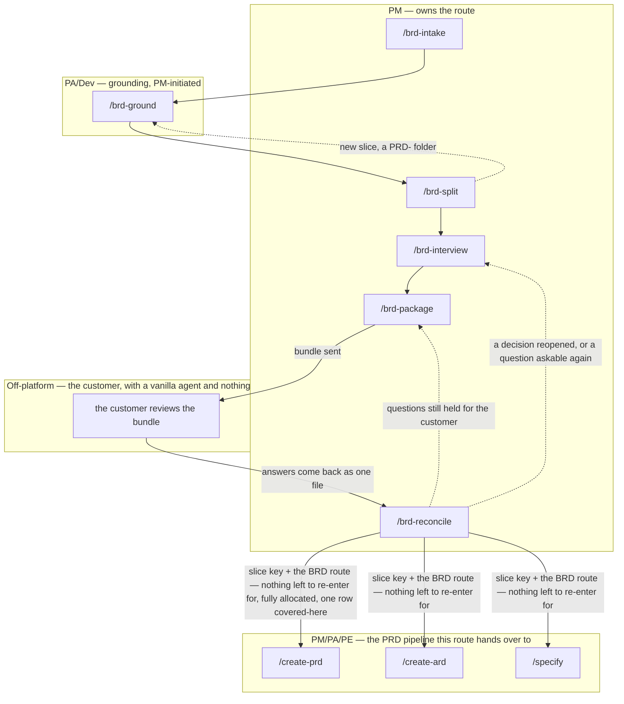

# BRD-to-PRD route

`/idea → /create-prd` starts from a prompt, file, community post, or existing PRD that the PM
already owns and can shape freely before anything is written down. The BRD-to-PRD route starts
somewhere the PM has far less control: a business requirements document the customer supplied,
handed over as-is — typically long, internally inconsistent in places, and not something a team
could build against without first finding out which of its claims are actually still true. This
route exists to turn that document into a requirement inventory every row of which has been
checked against real code and design, given a recorded fate, decided, and put back in front of the
customer who wrote it — before a PRD is ever written from it. It is PM-owned end to end: five of
its six commands run as PM, and the second step, `/brd-ground`, is PM-initiated but PA/Dev-executed
— it is the step that actually opens the mounted repositories and design assets to check a claim,
work that sits with PA/Dev rather than PM.

## The six commands, and where they hand over



**The right-hand box is not part of the route.** Its three nodes are the PRD pipeline's own
commands, drawn here because `/brd-reconcile` is where this route hands over to them and a reader
following the diagram needs somewhere to go next. The route itself is still the six `/brd-*`
commands: nothing in that box extracts a requirement, allocates a ledger row or opens a question —
each of the three only reads what this route already wrote, at its own altitude, and stamps
`consumed_by` on what it took.

**The `Off-platform` box is the route's defining feature, not a decoration.** Everything else in
the diagram is a command this plugin runs; that box is a wait, and nothing in the plugin can
shorten it. `/brd-package` renders a self-contained prompt and a de-Obsidianised bundle precisely
because the person on the other side has a vanilla agent and nothing installed — no plugin, no
skills, no MCP server — and cannot ask what a path means. Between the two solid edges crossing that
boundary, the package has to physically reach a customer and the customer has to answer, which is
why `/brd-reconcile` takes the returned file as an argument rather than looking for it: the route
resumes when somebody says *this file is the answer*, and not before.

The dashed edge from `/brd-split` closes the slice loop once, and only once. A slice re-enters
at `/brd-ground` and then runs `/brd-split` on itself in **allocate-only** mode: its ledger is
walked to a recorded fate, but no grandchild is created, because nesting is capped at one level. So
that loop is traversed at most twice for any requirement — once by the parent, once by the slice
that claimed it. The two dashed edges leaving `/brd-reconcile` are different in kind: they are not
capped, because a review can legitimately reopen a decision or leave a question the customer did
not answer, and either state is settled by running the command that owns it again.

`/brd-intake` copies the customer's document in verbatim and immutably, extracts a `[BR#n]`
requirement inventory, confirms candidate defects with a human, and writes a coverage ledger with
every row `unallocated`. `/brd-ground` pins every mounted repository to a verified commit and
grounds every `[BR#n]` claim against code and an exported design frame set, with every finding
independently re-derived before it counts as evidence. `/brd-split` gates on every finding carrying
a verifier verdict, proposes candidate slices, and walks every unallocated ledger row to one of
four recorded fates — assigning it to a named slice, deferring it, rejecting it
against a logged defect, or marking it superseded — until none remain `unallocated`. **A BRD is a
container and is never implementable itself**, so a split always confirms at least one slice; where
nothing clusters, the whole BRD becomes one. A slice is not a new route: it nests inside its BRD's
folder as the `PRD-` folder its PRD will be authored in, and re-enters at `/brd-ground` for its own
grounding pass, which is what the dashed loop above shows, and then at `/brd-split` to allocate its
own ledger. That second `/brd-split` runs in **allocate-only** mode: it offers a different four and
creates nothing, because nothing can exist below a slice but its Epics. `covered-by` is the resolution it does not offer — not because a slice may not carry one,
but because the one a slice carries is written by the parent's own walk: when that walk settles a
provisionally-claimed requirement on a different slice, the claim is withdrawn, the ledger row stays
(a ledger row is never deleted), and it records the sibling — or the parent — that took it. The cap
is on nesting, not on allocation: a slice's rows must reach a fate too, or the slice could never
become a PRD of its own.

`/brd-interview` then works the BRD's open questions to recorded decisions, one round at a time,
under a single rule: every question is tagged `[G]` / `[V]` / `[C]` before it is asked, and the tag
decides who may answer it — a `[G]` from the grounding findings and never a human, a `[V]` from the
delivery team with recorded argumentation, a `[C]` held for the customer. `/brd-package` takes the
register and the held `[C]` questions, attacks the package before the customer does, refuses to
build a bundle while any `[SR#n]` self-review finding is undisposed, and renders the prompt, the
delivery note, and the dated bundle. `/brd-reconcile` takes the file that comes back, freezes each
confirmed answer as a `[CD#n]` only once an operator has confirmed it against the customer's own
words, and then sweeps every dependent BRD and every artifact still asserting a position the answer
overturned.

**Where the route hands over is `/brd-reconcile`**: a BRD whose customer decisions are frozen and
whose tree holds nothing the review made false is the state the PRD pipeline is entered from.
the BRD route **ships** on `/create-prd`, `/create-ard` and `/specify`, and `/brd-reconcile`'s
next-step phase names all three — **against a slice key, and on a run that left nothing to re-enter
for.**

**The first condition is the level, and it is the one this increment added.** A BRD is a container:
`prd.md`, `ard.md` and `specification.md` are authored in the `PRD-` slice folders under it, one of
each per slice, and all three commands refuse a `BRD-` folder in their own Phase 0
(`CREATE_PRD_BRD_NOT_SLICED`, `CREATE_ARD_BRD_NOT_SLICED`, `SPECIFY_BRD_NOT_SLICED`). Reconciling a
**root** BRD therefore advances into its slices instead — `/brd-ground <SLICE-KEY>` once per
non-empty slice, each re-entering the route on its own key and reaching this same hand-over in its
own right — which is the dashed slice loop the diagram already draws.

That phase then resolves an `advance_ready`: a reopened decision, a `[C]` still held for the
customer, a finding the review left to re-derive, or a dependent it could only record all drop the
three advance options, because a `reopened` record may not be consumed downstream and all three
consume the register. On an advancing slice run, `/create-prd` on the BRD route carries one further condition —
the reconciled ledger leaves no row `unallocated` and at least one `covered-here` (the two refusals
its own Phase 0 raises) — while `/create-ard` on the BRD route and `/specify` on the BRD route carry none of
their own, since neither dispatches the folder read, neither gates a PRD and neither reads the ledger.
The difference is where the enforcement sits: the level test and `/create-prd`'s eligibility test are
each refused by the offered command's own Phase 0, whereas
nothing downstream refuses an unsettled register, so the advance/re-entry split is a judgement only
`/brd-reconcile` can make. **The diagram above draws all three**, as the three solid edges leaving
`/brd-reconcile` into the right-hand box. They are alternatives rather than a sequence: neither of
the other two waits on anything `/create-prd` on the BRD route produces, so an ARD or a specification can
be authored from a BRD whose ledger will never qualify for a PRD of its own. [Workflow overview](workflow.md) draws
the same three edges with the same labels, into the same three commands.

## Parameters

One row per command, derived from its own argument parsing — the flags below are exactly what each
command accepts today, not a preview of what a later increment adds. The first six rows are the
route; the last three are the handover the diagram draws, shown in their the BRD route form only —
each of those three also has a keyed form that this route never uses.

| Command | Required | Optional | Notes |
|---|---|---|---|
| `/brd-intake` | `<BRD-KEY> @<brd-file>` | `--sort-existing <dir>`, `--no-docs` | Source must already be markdown — a PDF or similar is rejected, never converted. `<BRD-KEY>` names a folder, never a tracker ticket |
| `/brd-ground` | `<BRD-KEY>` | `--depends-on <BRD-KEY>…`, `--rebaseline`, `--derivation-matrix` / `--no-derivation-matrix`, `--no-design`, `--no-docs` | Runs at either level — a BRD with a source document, or a slice. Needs `$REPOS_PATH` mounted; read-only against every repository it touches |
| `/brd-split` | `<BRD-KEY> [<instruction>]` | — | No flags. The optional trailing prose seeds the grouping and the walk's recommendation; it decides nothing. Walks every unallocated row to a fate at either level; on a slice, allocate-only |
| `/brd-interview` | `<BRD-KEY>` | `--round N` | Rounds are numbered, permanent and resumable. No flag continues at the first question with no terminal disposition; `--round N` resumes an open round, or re-opens a closed one with its cause recorded |
| `/brd-package` | `<BRD-KEY>` | `--depends-on <BRD-KEY>…` | Repeatable, and any key at either level is admissible; a mistyped one is warned and dropped, never fatal. Each prerequisite's own package is copied into the bundle, marked *not for re-review* |
| `/brd-reconcile` | `<BRD-KEY> @<review-file>` | — | The review is taken at whatever path it arrived on, inside `$SPECS_PATH` or not, and is never searched for: the operator names the file, because one this command picked is one nobody submitted |
| `/create-prd` | `<SLICE-KEY>` | `--lean`/`--hybrid`/`--full`, `--no-docs`, `@<idea.md>` | A `BRD-` container is refused. Otherwise offered only where the slice's own claimed rows leave none `unallocated` and one `covered-here`. Profile defaults to `--full`; `--from-prd` accepted |
| `/create-ard` | `<SLICE-KEY>` | `--no-docs` | A `BRD-` container is refused. Otherwise offered on any advancing slice run: it gates the slice's `prd.md` as the idea route does, reads no ledger. One address (`CREATE_ARD_ONE_ADDRESS`) |
| `/specify` | `<SLICE-KEY>` | `--no-docs` | A `BRD-` container is refused. Otherwise offered on the same terms as `/create-ard`. One address; a second token stops it (`SPECIFY_ONE_ADDRESS`) |

`--no-docs` appears on two of the six **route** rows and means the same thing on both: turn off the
optional grounding on shipped product documentation that `/brd-intake` and `/brd-ground` do when
`$DOCS_PATH` resolves. The other four route commands have no such flag because none of them does
docs grounding to turn off — `/brd-split` allocates requirements, and the last three work on
decisions already taken, on which a documentation page (a claim *about* behaviour, not the
behaviour) settles nothing. It reappears on all three **handover** rows, where it turns off that
same grounding in the authoring run itself rather than in the route. See
[`docs-grounding.md`](../references/docs-grounding.md) for the resolution gate and the two
consumption modes this route uses.

`<BRD-KEY>` follows the same shape everywhere in this route: `^[A-Z][A-Z0-9_]*(-\d+)+$`, checked
for shape only and never against a tracker — a BRD is a markdown file under `$SPECS_PATH`, not a
tracker ticket. **That shape is two segments or three**: a BRD owning its source document is keyed
`EPIC-008` and a slice of it `EPIC-008-01`, and the grammar prefers neither — a key's segment count
is a naming convention, never a depth declaration. Every command after `/brd-intake` accepts a key
at either of either level a `<BRD-KEY>` can name — a BRD folder directly under `specifications/`, or the `PRD-` folder of a slice inside it, and only `/brd-split` behaves differently
between them. The three handover rows resolve at either level too — and then **refuse the upper one**: a PRD, an
ARD and a specification are authored in a slice's `PRD-` folder, never in the `BRD-` container above
it.

**The BRD route is detected, never declared**, on all three of those rows. There is no flag and no
`<dir>` operand: each command takes one positional address, and where that address resolves to a
folder carrying `brd-link.md`, the run is on the BRD route and prints which route it entered before
doing anything else. A flag that could disagree with the folder it names would be one more
disagreement to have.

## What lands where

Every artifact lands under `$SPECS_PATH/specifications/BRD-<BRD-KEY>-<slug>/` (a slice gets its own
such folder inside its parent's — one level, and only one, per the addressing rule the whole route
shares):

```
specifications/BRD-<BRD-KEY>-<slug>/
├── brd/
│   ├── source/<basename>        # the customer's file, copied verbatim — never edited again
│   ├── brd-inventory.md         # [BR#n] rows, /brd-intake
│   └── brd-defect-log.md        # confirmed [DEF#n] entries, /brd-intake and /brd-reconcile
├── coverage-ledger.md           # one row per [BR#n]; /brd-intake writes it, /brd-split resolves it
├── grounding/
│   ├── baselines.md             # one dated entry per pinned repository, /brd-ground
│   ├── code-grounding.md        # [CG#n] findings, /brd-ground
│   └── design-grounding.md      # [DG#n] findings, /brd-ground (skipped or noted with --no-design)
├── design/                      # exported frame sets — one subdirectory each, images + an index
│   └── <frame-set>/             # what /brd-ground Phase 5 reads; no index means it is not read
├── attachments/                 # text/markdown sources a run copied in — written by /idea
├── brd-link.md                  # depends-on / parent-child links, /brd-ground, /brd-split, /brd-package
├── slices.md                    # slice rationale and deferral notes, /brd-split
├── decisions.md                 # the register: [VD#n] and [AS#n] from /brd-interview, [CD#n] from /brd-reconcile
├── interview/
│   ├── round-<N>.md             # one append-only record per round, /brd-interview
│   └── customer-questions.md    # the [C] questions held for the customer, /brd-interview
├── self-review-<date>.md        # every [SR#n] with its disposition, /brd-package
├── customer-review-prompt-<date>.md   # the self-contained prompt the customer pastes, /brd-package
├── customer-delivery-note-<date>.md   # the covering letter — the email, not a bundle document, /brd-package
├── bundle-<date>/               # the de-Obsidianised bundle actually sent, /brd-package
├── customer-review-<date>.md    # the returned review, copied in byte for byte, /brd-reconcile
├── reconciliation-<date>.md     # what the review changed and what still needs a human, /brd-reconcile
├── dev-workflows/                # session bookkeeping: resume pointer, feedback, cost entries
└── PRD-<CHILD-KEY>-<child-slug>/ # a slice /brd-split confirmed — where its PRD, ARD and spec are authored
```

Two of those entries are **reserved subdirectory names** rather than this route's own files, and both
are shared with the idea route: `design/` holds exported frame sets, one immediate subdirectory each,
images plus an index that [`grounding-format.md`](../references/grounding-format.md) §6.1 makes
mandatory — `design-grounder` returns `NO_INDEX` rather than read a frame set without one, because a
filename is not a reliable statement of what a frame shows. `attachments/` holds the text and markdown
sources a run copied into the folder; today [`/idea`](commands/idea.md) is its only writer. Neither
carries a key, neither is resolved by one, and both may appear at either level — a `BRD-` folder or a
`PRD-` folder inside it.

The dated artifacts are the ones to read carefully. **A dated bundle is never rewritten**, and a
superseded snapshot is bannered rather than edited: rewriting either destroys the only evidence of
what the reviewer of that date was actually looking at, after which every claim in their returned
review silently re-points at a document they never saw. `customer-review-<date>.md` carries the
**customer's** date, not the run's, and is committed before anything reads it.

A slice starts life with three of those files, all written by the parent's `/brd-split` run:
`brd-link.md`, a `brd/brd-inventory.md` holding the parent's rows it claims (copied verbatim — the
slice has no `brd/source/` and no `brd/brd-defect-log.md` of its own, and inherits both from its
parent), and a `coverage-ledger.md` with every row `unallocated`. That is what makes the dashed
loop above real: `/brd-ground` needs a ledger to gate on and an inventory to read, `/brd-intake`
never runs on a slice — there is no separate document to intake — and `/brd-split` is the only
command holding both the parent's rows and the allocation that says which of them the slice claims.
The slice keeps no `brd/` source or defect log of its own and reaches for its parent's, and that
reach is always exactly one hop: with nesting capped at one level, a slice's parent is always the
BRD that owns the customer's document. That one hop is live rather than theoretical — it is how a
`rejected: [DEF#n]` is resolved when `/brd-split` walks the slice's own ledger, and it is where a
slice's `/brd-reconcile` writes the defect resolutions its customer review settled.

Everything else a slice produces is its own. It holds its own register, its own `[C]` question set,
its own bundle and its own reconciliation record, and it reaches its decisions exactly as its
parent does — the last three commands of the route behave identically at both levels.

`--sort-existing <dir>` on `/brd-intake` additionally writes `prd-seed.md`, `ard-seed.md`, and
`spec-seed.md` at the BRD folder's own level — a one-time migration path for a package written by
hand before this route existed, not an output of the normal flow. **It is the only writer of any of
the three**, which is worth stating plainly because the BRD route on `/create-prd`, `/create-ard` and
`/specify` each reads one: a reconciled BRD normally holds no seed at all, so each of those runs
reports its seed absent as the **ordinary** case rather than as a gap. What actually carries content
to all three altitudes is `decisions.md` — every one of them reads the same register and filters it
by each record's `altitude` — together with the grounding findings, and, for `/specify`, the
derivation matrix appended to `code-grounding.md`. See [Workflow
overview](workflow.md) for where this route's artifact home sits relative to the rest of the
pipeline's, and [Roles and phases](roles-and-phases.md) for what each role owns across both routes.
