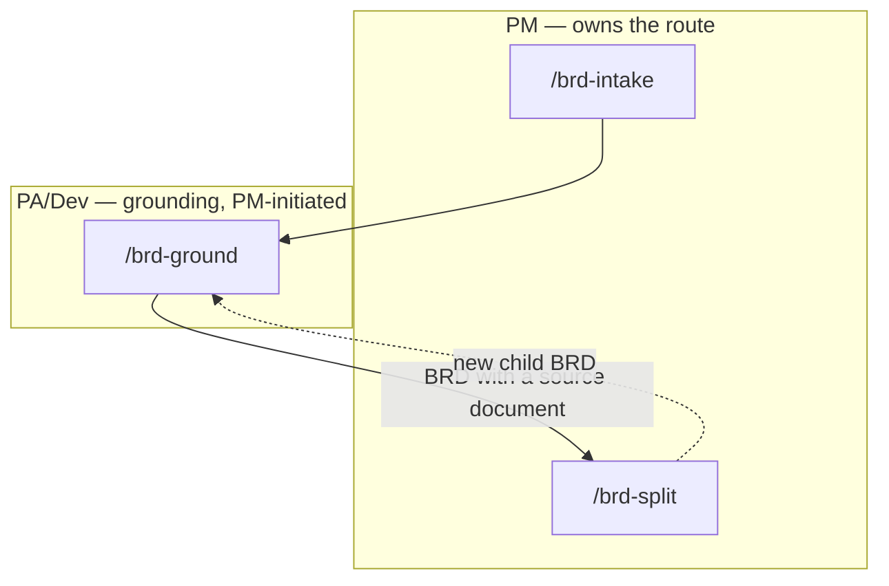

# BRD-to-PRD route

`/idea → /create-prd` starts from a prompt, file, community post, or existing PRD that the PM
already owns and can shape freely before anything is written down. The BRD-to-PRD route starts
somewhere the PM has far less control: a business requirements document the customer supplied,
handed over as-is — typically long, internally inconsistent in places, and not something a team
could build against without first finding out which of its claims are actually still true. This
route exists to turn that document into a requirement inventory every row of which has been
checked against real code and design, and given a recorded fate, before a PRD is ever written from
it. It is PM-owned end to end: `/brd-intake` and `/brd-split` run as PM, and the middle step,
`/brd-ground`, is PM-initiated but PA/Dev-executed — it is the step that actually opens the mounted
repositories and design assets to check a claim, work that sits with PA/Dev rather than PM.

## The three commands



The dashed edge runs one way only. A child BRD re-enters at `/brd-ground` and stops there: nesting
is capped at one level, so a slice is not itself sliceable and `/brd-split` refuses it. That is why
the solid `ground → split` edge is labelled — it is the path a BRD that owns its source document
takes, not the path a slice takes.

`/brd-intake` copies the customer's document in verbatim and immutably, extracts a `[BR#n]`
requirement inventory, confirms candidate defects with a human, and writes a coverage ledger with
every row `unallocated`. `/brd-ground` pins every mounted repository to a verified commit and
grounds every `[BR#n]` claim against code and an exported design frame set, with every finding
independently re-derived before it counts as evidence. `/brd-split` gates on every finding carrying
a verifier verdict, proposes candidate slices, and walks every unallocated ledger row to one of
five recorded fates — building here, assigning it to a named child BRD, deferring it, rejecting it
against a logged defect, or marking it superseded — until none remain `unallocated`. A child BRD a
split confirms is not a new route: it nests inside its parent's folder and re-enters at
`/brd-ground` for its own grounding pass, which is what the dashed loop above shows. It does not
re-enter at `/brd-split`: run on a slice, that command stops with `BRD_SPLIT_ON_SLICE`, and the
slice's own ledger rows stay `unallocated` — the parent's ledger is where those same requirements
already carry a fate, as `covered-by`.

**This is the whole route that ships in this increment.** The design behind it sketches further
phases — `/brd-interview`, `/brd-package`, `/brd-reconcile`, and a `--from-brd` switch on
`/create-prd` that would carry a grounded, split BRD into a PRD — but none of those exist yet, so
none of them appear above. Where this route currently ends, for any given BRD or slice, is
`/brd-split`: a ledger with no row left `unallocated`.

## Parameters

One row per command, derived from its own argument parsing — the flags below are exactly what each
command accepts today, not a preview of what a later increment adds.

| Command | Required | Optional | Notes |
|---|---|---|---|
| `/brd-intake` | `<BRD-KEY> @<brd-file>` | `--sort-existing <dir>` | Source must already be markdown — a PDF or similar is rejected, never converted. `<BRD-KEY>` names a folder, never a tracker ticket |
| `/brd-ground` | `<BRD-KEY>` | `--depends-on <BRD-KEY>…`, `--rebaseline`, `--derivation-matrix` / `--no-derivation-matrix`, `--no-design` | Runs at either level — a BRD with a source document, or a slice. Needs `$REPOS_PATH` mounted; read-only against every repository it touches |
| `/brd-split` | `<BRD-KEY>` | — | No flags. Runs only on a source-owning BRD; refuses a slice (`BRD_SPLIT_ON_SLICE`). Walks every unallocated row to a recorded fate; a child BRD nests inside the parent's folder |

`<BRD-KEY>` follows the same shape everywhere in this route: `^[A-Z][A-Z0-9_]*(-\d+)+$`, checked
for shape only and never against a tracker — a BRD is a markdown file under `$SPECS_PATH`, not a
Jira ticket.

## What lands where

Every artifact lands under `$SPECS_PATH/specifications/<BRD-KEY>-<slug>/` (a child BRD gets its own
such folder inside its parent's — one level, and only one, per the addressing rule the whole route
shares):

```
specifications/<BRD-KEY>-<slug>/
├── brd/
│   ├── source/<basename>        # the customer's file, copied verbatim — never edited again
│   ├── brd-inventory.md         # [BR#n] rows, /brd-intake
│   └── brd-defect-log.md        # confirmed [DEF#n] entries, /brd-intake
├── coverage-ledger.md           # one row per [BR#n]; /brd-intake writes it, /brd-split resolves it
├── grounding/
│   ├── baselines.md             # one dated entry per pinned repository, /brd-ground
│   ├── code-grounding.md        # [CG#n] findings, /brd-ground
│   └── design-grounding.md      # [DG#n] findings, /brd-ground (skipped or noted with --no-design)
├── brd-link.md                  # depends-on / parent-child links, /brd-ground and /brd-split
├── slices.md                    # slice rationale and deferral notes, /brd-split
├── dev-workflows/                # session bookkeeping: resume pointer, feedback, cost entries
└── <CHILD-KEY>-<child-slug>/    # a slice /brd-split confirmed — the same shape, one level only
```

A slice starts life with three of those files, all written by the parent's `/brd-split` run:
`brd-link.md`, a `brd/brd-inventory.md` holding the parent's rows it claims (copied verbatim — the
slice has no `brd/source/` and no `brd/brd-defect-log.md` of its own, and inherits both from its
parent), and a `coverage-ledger.md` with every row `unallocated`. That is what makes the dashed
loop above real: `/brd-ground` needs a ledger to gate on and an inventory to read, `/brd-intake`
never runs on a slice — there is no separate document to intake — and `/brd-split` is the only
command holding both the parent's rows and the allocation that says which of them the slice claims.
The slice keeps no `brd/` source or defect log of its own and reaches for its parent's, and that
reach is always exactly one hop: with nesting capped at one level, a slice's parent is always the
BRD that owns the customer's document.

`--sort-existing <dir>` on `/brd-intake` additionally writes `prd-seed.md`, `ard-seed.md`, and
`spec-seed.md` at the BRD folder's own level — a one-time migration path for a package written by
hand before this route existed, not an output of the normal flow. See [Workflow
overview](workflow.md) for where this route's artifact home sits relative to the rest of the
pipeline's, and [Roles and phases](roles-and-phases.md) for what each role owns across both routes.
