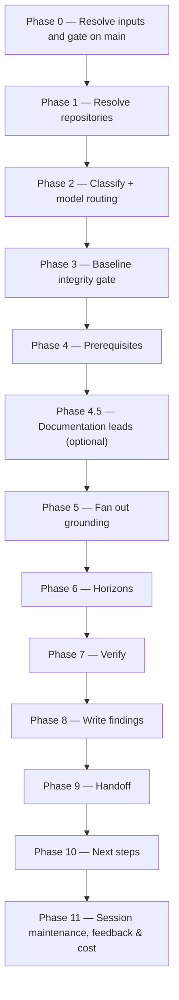

# /brd-ground

Pins every mounted repository to a verified commit, grounds every `[BR#n]` claim against code
(`code-grounder`) and an exported design frame set (`design-grounder`), independently re-derives
every finding (`grounding-verifier`, Opus), and assigns each finding a `current` / `will-change`
horizon against declared prerequisite BRDs.

## Who runs it

`/brd-ground` runs in the [pa](../roles-and-phases.md#pa--product-architecture) role,
cost-attribution phase `brd-to-prd` — the phase shared by every command of the BRD-to-PRD route. It
is the second command of that route, after [`/brd-intake`](brd-intake.md) and before
[`/brd-split`](brd-split.md), and it is the only one of the six that does not run as
[pm](../roles-and-phases.md#pm--product-management).

## Synopsis

```
/brd-ground <BRD-KEY> [--depends-on <BRD-KEY>…] [--derivation-matrix|--no-derivation-matrix] [--no-design] [--no-docs] [--rebaseline]
```

- **`<BRD-KEY>`** (mandatory) — the BRD (or slice) to ground. Resolved via `resolve-brd`, so a
  key at either of the two levels a BRD folder can occupy works; format-validated only, never
  checked against a tracker. Unlike [`/brd-split`](brd-split.md), this command refuses neither
  level.
- **`--depends-on <BRD-KEY>`** (optional, repeatable) — declares a prerequisite BRD. Persisted to
  `brd-link.md` additively across runs; the file may also be edited by hand.
- **`--derivation-matrix` / `--no-derivation-matrix`** (optional, mutually exclusive) — force the
  implementation-altitude data-source matrix on or off. Left unset, the command defaults it on for
  a BRD whose requirements read as reporting- or data-centric, and off otherwise.
- **`--no-design`** (optional) — skip the `design-grounder` pass even when an exported frame set
  is present.
- **`--no-docs`** (optional) — turn documentation grounding off for this run.
- **`--rebaseline`** (optional) — re-run grounding against code that has moved since the last
  pass. Supersedes the affected findings by id rather than renumbering them, so a citation into an
  already-sent package still resolves.

## How it runs



Four `dev-workflows` subagents are dispatched, all read-only against every repository or root they
touch: `docs-grounder` (Phase 4.5, read-only grounding on the shipped product docs — default ON
when `$DOCS_PATH` resolves, advisory, never a gate), `code-grounder` (Phase 5, one per repository,
≤4 concurrent), `design-grounder` (Phase 5, one per exported frame set, after every `code-grounder`
instance has returned — its fourth reconciliation class cites a `[CG#n]`), and
`grounding-verifier` (Phase 7, one per finding, pinned to Opus). `impl-maintenance` also runs, in
Phase 11, for session lessons-learned.

## What it needs

- **`<BRD-KEY>`** — mandatory; absent or malformed stops the run with `BRD_GROUND_NEEDS_KEY`.
- **This BRD's own inventory and ledger already on the specs repo's main branch.** `/brd-ground`
  gates `coverage-ledger.md` on `origin/<default>` via `require-on-main` before reading anything
  else; an unmerged pull request stops the run naming the branch/PR state. When nothing for the BRD
  is on any ref, the stop names the fix by level: a BRD with a source document of its own stops
  with `BRD_GROUND_NEEDS_INTAKE`, naming `/brd-intake`; a **slice** — a child BRD, recognised by
  the `parent:` field in its `brd-link.md` — stops with `BRD_GROUND_NEEDS_SPLIT`, naming
  `/brd-split` on the parent, because a slice has no source document of its own to intake and its
  ledger and inventory are written by the parent's split
  ([`brd-format.md`](../../references/brd-format.md) §2.1,
  [`coverage-ledger-format.md`](../../references/coverage-ledger-format.md) §3).
- **`$REPOS_PATH`** — required; resolved as one directory or a colon-separated list. No resolvable
  entry stops the run naming `REPOS_PATH`.
- **`$DOCS_PATH`** (optional, default `/workspace/docs`) — documentation grounding, resolved once
  in Phase 1 alongside the repo prompt and consumed **lead-only** in Phase 4.5. Missing,
  unreadable, or carrying no markdown file is a silent, non-blocking skip. Turned off with
  `--no-docs`. **A document is never evidence for a `[CG#n]`** — see the Phase 4.5 gate below.
- **A clean working tree per resolved repository.** The Phase 3 baseline-integrity gate runs
  `rev-parse HEAD`, a `diff --ignore-cr-at-eol --stat`, and a line-count check on anything
  `status --porcelain` reports, **before any finding is written**. Any non-empty content diff stops
  the run with `BRD_GROUND_DIRTY_TREE` — grounding a dirty tree would cite an unidentifiable
  snapshot.
- **`--rebaseline` when code has moved.** If a repository's `HEAD` has moved since the last
  recorded pin and `--rebaseline` was not given, the run stops with `BRD_GROUND_NEEDS_REBASELINE`
  rather than silently grounding against a snapshot the last package never saw.
- **A repository that stays put for the whole run.** If a resolved repository's `HEAD` moves
  *after* Phase 3 pinned it, the verifier refuses rather than verifying and the run stops with
  `BRD_GROUND_VERIFY_COMMIT_MISMATCH`, naming the finding, the pinned commit, and the `HEAD` it
  actually found. The remedy is a re-run from a clean tree **with `--rebaseline`**: Phase 3 appended
  that repository's pin to `grounding/baselines.md` before dispatching anything, so a plain re-run
  would find a recorded pin its `HEAD` no longer matches and stop again, this time with
  `BRD_GROUND_NEEDS_REBASELINE`. The same applies to a `code-grounder` dispatch that reports a
  moved `HEAD` in Phase 5.

## What it produces

Under the resolved `<BRD-KEY>-<slug>/` folder:

- `grounding/baselines.md` — one dated entry per repository: the pinned commit and how it was
  verified. `--rebaseline` appends rather than overwrites.
- `grounding/code-grounding.md` — every `[CG#n]` finding, plus the optional derivation matrix and,
  when documentation grounding ran, a `## Documentation divergences` section: one identifier-free
  prose entry per page that contradicts a verified `[CG#n]`, naming that finding by id.
- `grounding/design-grounding.md` — every `[DG#n]` finding, or a note explaining why design
  grounding did not run.
- `brd-link.md` — the `depends-on:` list, merged additively across runs.

Behind Phase 9's consent choice, these are committed, pushed, and a pull request opened against
the specs repo's default branch under the shared `brd/<BRD-KEY>-<slug>` branch prefix.

## Gates

- **Phase 0 — `require-on-main` on this BRD's inventory and ledger.** No grounding starts until
  whichever command wrote them has merged its output — `/brd-intake` for a BRD with a source
  document of its own, `/brd-split` on the parent for a slice; see "What it needs" above for the
  exact stop conditions.
- **Phase 3 — baseline integrity, run by the orchestrator itself, not delegated to an agent.**
  Every repository is pinned and proven clean in content — not merely in `git status` — before
  Phase 5 dispatches a single agent. `code-grounder` and `grounding-verifier` each separately
  re-verify their own pinned commit against `HEAD`, but that check alone cannot see a dirty
  working tree sitting around an otherwise-matching `HEAD`; this phase is what closes that gap.
- **Phase 4.5 — documentation is a lead and a divergence, never evidence.** No `[CG#n]` or
  `[DG#n]` may cite a documentation page in its `evidence`, under any verdict, in any phase.
  Grounding answers whether a claim is true of a *specific commit*
  ([`grounding-format.md`](../../references/grounding-format.md) §1), and a document is a claim
  *about* behaviour rather than the behaviour: citing one would let a confident, stale page satisfy
  a claim the code does not — exactly the failure the `NOT-PROVABLE` verdict exists to make
  sayable. The digest is therefore never passed into `code-grounder`, `design-grounder`, or
  `grounding-verifier`, whose input contracts carry no documentation field. The orchestrator uses
  it twice: as a **lead**, surfacing a page that names a subsystem no resolved repository covers so
  the operator can add that repository before Phase 5 dispatches; and as a **divergence**, recorded
  in Phase 8. A divergence gets **no identifier of its own** — it names the verified `[CG#n]` it
  diverges from instead, because a divergence is not an answer to a `[BR#n]` premise, and a new
  prefix would sit permanently unverified in a namespace where an unverified id blocks
  [`/brd-split`](brd-split.md) ([`grounding-format.md`](../../references/grounding-format.md) §8).
- **Phase 7 — `grounding-verifier` over every finding, pinned to Opus.** A finding without a
  verifier outcome is never treated as evidence. A `contradict` outcome rewrites the finding
  in place — same id, replaced verdict and evidence — so an existing citation keeps resolving; an
  `agree`/`extend`/`unprovable` outcome is recorded alongside the finding unchanged (`extend` also
  appends the additional evidence the verifier's own search turned up). Which anchor each finding
  is verified against depends on what it rests on: a `[CG#n]` and a class-4 `[DG#n]` are re-derived
  against the pinned repository, a class-1/2/3 `[DG#n]` against the frame set it was reconciled
  from — see [`grounding-format.md`](../../references/grounding-format.md) §8. A verifier that
  refuses rather than verifying (a moved `HEAD`, a repository or frame set no longer resolvable)
  stops the run before Phase 8 writes anything, so no finding is ever written without an outcome —
  which is what keeps `/brd-split`'s own verification gate reachable.

## Example

Ground a synthetic customer BRD once its intake pull request has merged:

```
/dev-workflows:brd-ground EPIC-008
```

The run resolves the BRD, gates its intake artifacts on main, resolves the repositories in scope
and the documentation root, pins and proves each repository clean, grounds every `[BR#n]` claim
against code and any exported design frames, independently re-derives every finding on Opus,
assigns horizons against any declared prerequisites, writes the findings, and offers to branch,
commit, push, and open a pull request. Its next-step offer branches on level, and names the mode
[`/brd-split`](brd-split.md) will run in: a BRD that owns its source document gets the full split; a
**slice** gets `allocate-only` — its ledger is walked to a recorded fate, but no child is created,
because nesting is capped at one level. `/brd-split` is not where the route ends: it hands on to
[`/brd-interview`](brd-interview.md).

## See also

- [Roles and phases](../roles-and-phases.md) — what the `pa` role owns and hands off.
- [`brd-addressing.md`](../../references/brd-addressing.md) — the `<BRD-KEY>` grammar and folder
  resolution this command uses by name (`brd-key-valid`, `resolve-brd`), including how a slice
  nests inside its parent.
- [`grounding-format.md`](../../references/grounding-format.md) — the authority for the finding
  record, the six verdicts, the two horizons, the `baseline-integrity` procedure this command's
  Phase 3 runs, and the four verification outcomes this command's Phase 7 acts on.
- [`coverage-ledger-format.md`](../../references/coverage-ledger-format.md) — the ledger line every
  `/brd-*` command's final report ends with.
- [`docs-grounding.md`](../../references/docs-grounding.md) — the `$DOCS_PATH` resolution gate,
  the `docs grounding:` line this command shows verbatim, and the lead-only consumption mode this
  command's Phase 4.5 applies.
- [`read-only-repos.md`](../../references/read-only-repos.md) — the read-only posture this command
  holds toward every repository it resolves.
- [Agents](../reference/agents.md) — the full contracts for `docs-grounder`, `code-grounder`,
  `design-grounder`, and `grounding-verifier`.
- [Session cost](../reference/session-cost.md), [Session feedback](../reference/session-feedback.md),
  and [Resume and checkpoints](../reference/resume-and-checkpoints.md) — the terminal Phase 11
  bookkeeping every run emits.
