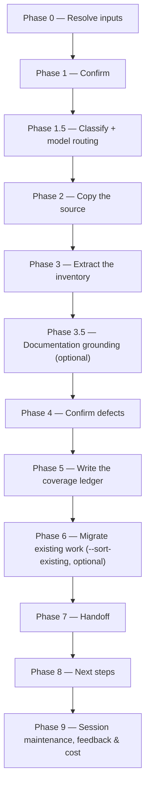

# /brd-intake

Copies a customer-supplied business requirements document into the specs repo verbatim, extracts a
`[BR#n]` requirement inventory, confirms the document's defects with a human, and writes a coverage
ledger where every requirement starts `unallocated`.

## Who runs it

`/brd-intake` runs in the [pm](../roles-and-phases.md#pm--product-management) role, cost-attribution
phase `brd-to-prd` — the phase shared by every command of the BRD-to-PRD route, the way `/idea` and
`/create-prd` share `prd-creation`. It is the first command of that route, before
[`/brd-ground`](brd-ground.md), [`/brd-split`](brd-split.md), [`/brd-interview`](brd-interview.md),
[`/brd-package`](brd-package.md) and [`/brd-reconcile`](brd-reconcile.md). Every one of them runs as
pm except `/brd-ground`, which runs as
[pa](../roles-and-phases.md#pa--product-architecture).

## Synopsis

```
/brd-intake <BRD-KEY> @<brd-file> [--sort-existing <dir>] [--no-docs]
```

- **`<BRD-KEY>`** (mandatory) — a short stable identifier for the BRD. Format-validated only
  (`^[A-Z][A-Z0-9_]*(-\d+)+$`); a BRD is a markdown file in `$SPECS_PATH`, never checked against a
  tracker.
- **`@<brd-file>`** (mandatory) — the customer's source document. Must already be markdown — a PDF,
  a Word document, or a slide deck is rejected rather than converted.
- **`[--sort-existing <dir>]`** (optional) — additionally migrate an already-hand-written package
  at `<dir>` into seed files. The source is still required and still gated (Phase 0) — this never
  replaces the extraction, it only adds Phase 6 on top of it.
- **`[--no-docs]`** (optional) — turn documentation grounding off for this run.

## How it runs



Two `dev-workflows` subagents are dispatched: `brd-reader` (Phase 3, frontmatter-pinned to Sonnet —
its extraction work is mechanical) and `docs-grounder` (Phase 3.5, read-only grounding on the
shipped product docs — default ON when `$DOCS_PATH` resolves, advisory, never a gate).
`impl-maintenance` also runs, in Phase 9, for session lessons-learned.

## What it needs

- **`<BRD-KEY>`** — mandatory; absent or malformed stops the run with `BRD_INTAKE_NEEDS_KEY`.
- **`@<brd-file>`** — mandatory; absent stops the run with `BRD_INTAKE_NEEDS_SOURCE`.
- **A markdown source.** A non-markdown source (a PDF chief among them) stops the run with
  `BRD_INTAKE_NEEDS_MARKDOWN` rather than being converted automatically — the source becomes
  immutable the moment it is intaken, and every `[BR#n]` this run writes anchors into it, so an
  unchecked machine conversion must never silently become the record of what the customer asked
  for. Converting is the operator's own step, done where the result can be checked against the
  original.
- **`$SPECS_PATH`** (required) — if unset, the run stops naming `SPECS_PATH`.
- **`$DOCS_PATH`** (optional, default `/workspace/docs`) — documentation grounding, resolved once
  in Phase 1 and consumed with grill-rank ranking over Phase 4's defect walk. Missing, unreadable,
  or carrying no markdown file is a silent, non-blocking skip. Turned off explicitly with
  `--no-docs`. The `/epics` consent-ordering exception does not apply here: `/brd-intake` runs no
  `require-on-main` gate, so resolving in the ordinary confirmation step already puts the one
  consent-bearing step ahead of every write.
- **No repos.** `/brd-intake` is cwd-agnostic and needs no `$REPOS_PATH` — grounding against code
  and design is `/brd-ground`'s job, run later.
- **No prior `/brd-*` deliverable.** `/brd-intake` is the entry point of the route: it consumes no
  earlier phase's artifact, so it runs no `require-on-main` gate in Phase 0, unlike every
  downstream `/brd-*` command.

## What it produces

Under `$SPECS_PATH/specifications/BRD-<BRD-KEY>-<slug>/` — the `BRD-` kind prefix is part of the
name the run creates ([addressing](../reference/references.md) §2):

- `brd/source/<basename>` — the customer's source, copied byte-for-byte and never edited again.
- `brd/brd-inventory.md` — one row per `[BR#n]`, each with its `source_anchor` and any confirmed
  `[DEF#n]` defects.
- `brd/brd-defect-log.md` — one entry per confirmed `[DEF#n]`, resolution `open`.
- `coverage-ledger.md` — one row per `[BR#n]`, disposition `unallocated` on every row.
- With `--sort-existing <dir>`: `prd-seed.md`, `ard-seed.md`, `spec-seed.md`, sorted by altitude
  from the hand-written package — seeds only, never findings.

Behind Phase 7's consent choice, these are committed, pushed, and a pull request opened against the
specs repo's default branch under a new `brd/<BRD-KEY>-<slug>` branch prefix.

## Gates

- **Phase 3 — `brd-reader`** (Sonnet, frontmatter-pinned). Read-only extraction: it proposes a
  `[BR#n]` row per requirement plus unconfirmed `defect_candidates`; it never decides a defect
  itself. `EMPTY` (no identifiable requirement) short-circuits Phase 4 and writes an empty ledger —
  and the run says so plainly, because the route stops on a claimless BRD: Phase 8 then offers a
  re-run of this command with a corrected source instead of offering `/brd-ground`, which would
  refuse the BRD. `NOT_FOUND` stops the run and surfaces the agent's exact message.
- **Phase 3.5 — `docs-grounder`** (optional). Read-only, advisory, never a gate. Its digest is
  consumed grill-rank: `docs_challenges` are ranked into the order Phase 4 walks its candidates,
  and one may be *raised* as an additional defect candidate — but only as `unsourced` (the
  requirement asserts current behaviour a shipped page corroborates or contradicts) or `ambiguity`
  (the BRD uses a term the docs use for something else). **A `[DEF#n]` is the only thing
  documentation can put on a `[BR#n]` row, and only Phase 4's human confirmation puts it there.**
  `docs_references` — what the product already ships and documents — is reported for `/brd-ground`
  to check against code, and written nowhere; the ledger's `evidence` column stays empty until
  grounding runs.
- **Phase 4 — interactive defect confirmation**, not an agent gate: every `defect_candidates` entry
  is walked one class at a time, in the fixed order [`brd-format.md`](../../references/brd-format.md)
  §3 lists its six classes, via `AskUserQuestion`, and only a confirmed candidate is assigned a
  `[DEF#n]` id. A rejected candidate is dropped, not recorded.
- **Phase 5 — the ledger gate downstream.** `/brd-intake` itself never blocks on the ledger — it
  only ever writes `unallocated` rows. The gate that gates on them (no `unallocated` row may
  survive) belongs to [`/brd-split`](brd-split.md), the route's third command.

## Example

Intake a synthetic customer BRD for a new BRD key:

```
/dev-workflows:brd-intake ACME-001 @customer-brd.md
```

The run resolves or creates the BRD folder, copies `customer-brd.md` verbatim into `brd/source/`,
dispatches `brd-reader` to extract the `[BR#n]` inventory, walks its defect candidates with you
class by class, writes the coverage ledger with every row `unallocated`, and offers to branch,
commit, push, and open a pull request.

## See also

- [Roles and phases](../roles-and-phases.md) — what the `pm` role owns and hands off.
- [`addressing.md`](../../references/addressing.md) — the `<BRD-KEY>` grammar and folder
  resolution this command uses by name (`key-valid`, `resolve-address`).
- [`brd-format.md`](../../references/brd-format.md) — the `[BR#n]` row shape, the immutability rule,
  and the six defect classes this command confirms against.
- [`coverage-ledger-format.md`](../../references/coverage-ledger-format.md) — the ledger row shape,
  the six dispositions, and the ledger line every `/brd-*` command's final report ends with.
- [`docs-grounding.md`](../../references/docs-grounding.md) — the `$DOCS_PATH` resolution gate,
  the `docs grounding:` line this command shows verbatim, and the grill-rank consumption mode.
- [Agents](../reference/agents.md) — `brd-reader`'s and `docs-grounder`'s full contracts.
- [Session cost](../reference/session-cost.md), [Session feedback](../reference/session-feedback.md),
  and [Resume and checkpoints](../reference/resume-and-checkpoints.md) — the terminal Phase 9
  bookkeeping every run emits.
