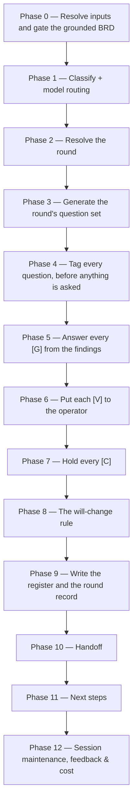

# /brd-interview

Turns a grounded, fully-allocated BRD into a **decided** one. It generates a round of open questions,
tags every one of them `[G]`, `[V]` or `[C]` **before a single one is asked**, answers every `[G]`
from the grounding findings without asking anybody, puts each `[V]` to the operator one at a time
with mandatory argumentation, and holds every `[C]` for the customer. It writes `decisions.md`, the
round's own record, and the `[C]` question set.

## Who runs it

`/brd-interview` runs in the [pm](../roles-and-phases.md#pm--product-management) role,
cost-attribution phase `brd-to-prd` — the phase shared by every command of the BRD-to-PRD route. It
is the fourth command of that route, after `/brd-intake`, `/brd-ground` and `/brd-split`.

## Synopsis

```
/brd-interview <BRD-KEY> [--round N]
```

- **`<BRD-KEY>`** (mandatory) — the BRD whose questions this run decides. A key at either of the two
  levels a BRD folder can occupy works, and both behave identically. Resolved via `resolve-address`;
  format-validated only, never checked against a tracker.
- **`--round N`** (optional) — target one round: resume it if it is open, or re-open it if it is
  closed, recorded as a re-open with its cause. With no flag the run continues at the first round
  still holding a question without a terminal disposition, and proposes a new one only if findings
  or decisions have changed since the last round closed.

There is **no `--no-docs` flag**, because this command does no documentation grounding at all — see
[What it does not do](#what-it-does-not-do).

## The tag decides who may answer

| Tag | Meaning | Who may answer |
|---|---|---|
| `[G]` | Answerable from code or design grounding | **Nobody.** The command answers it from the findings |
| `[V]` | A delivery-side design decision | The **operator**, with recorded argumentation. Never the customer |
| `[C]` | A genuine business decision | The **customer**, and only via a review package |

The two "never"s are rules, not tendencies, and the reasons they exist are in
[`interview-tagging.md`](../../references/interview-tagging.md) §1–§2. A `[G]` put to a person
returns their belief about the system rather than the system, and that belief then becomes a
requirement nobody re-checks; a `[V]` dressed as a `[C]` extracts authority the customer never meant
to give and cannot defend later.

**How the command guarantees the first of those** is a property of its phase order, not of its
prose. Tagging runs over the whole round before any asking phase opens; the phase that answers `[G]`
questions raises no prompt of any kind; the operator queue holds exactly what the tagging phase has
fixed — including a `[G]` re-tagged to `[V]`, which is re-tested there before it joins — and nothing
reaches it that has not been through that phase, nor anything at all once the queue opens; and a
`[G]` can leave the `[G]` set only by re-tagging, which re-enters at the tagging phase and is
admissible only against a named `NOT-PROVABLE` finding.

**The round is scoped to the rows this BRD is answerable for.** Questions are generated over the
ledger rows reading `covered-here`, `deferred-to`, `rejected` or `superseded-by` — never over a row
reading `covered-by: <OTHER-KEY>`, whose requirement that BRD owns and whose questions belong to its
own round ([`coverage-ledger-format.md`](../../references/coverage-ledger-format.md) §3.1). The set
is read off the `disposition` column rather than the inventory, because the two agree on a **slice**
and diverge on a **split parent**, whose inventory still holds every delegated row: generating from
the inventory is right at one level and silently over-broad at the other, and the cost is the same
requirement reaching the customer in two packages. A delegated row stays readable as context; what
it may not be is the thing asked about.

**A question carrying two tags is a defect in the question**, not a gap in the taxonomy: it is split
until each part carries exactly one, and the `[G]` part is answered first, because its answer
routinely changes what the business question should ask (§4). A question nobody can tag is
under-specified and is rewritten — never filed with a guessed tag.

## How it runs



A run that finds every round closed and nothing changed since the last one proposes no new round: it
reports that plainly and reaches the handoff with nothing to commit. `impl-maintenance` runs in the
terminal phase for session lessons-learned; no other subagent is dispatched — every finding this
command reads was already independently re-derived by `/brd-ground`'s own verifier pass.

## What it needs

- **`<BRD-KEY>`** — mandatory; absent or malformed stops the run with `BRD_INTERVIEW_NEEDS_KEY`. A
  malformed `--round` value stops with `BRD_INTERVIEW_BAD_ROUND` rather than quietly running a
  different round from the one asked for.
- **An existing BRD folder.** No folder for `<BRD-KEY>` — searched at `specifications/` and the one
  level below it — stops the run with `BRD_INTERVIEW_NOT_FOUND`, which names both ways a folder comes
  to exist rather than asserting one.
- **`/brd-ground`'s findings already merged to the specs repo's default branch.** `require-on-main`
  runs against `grounding/code-grounding.md` before anything else is read; an unmerged grounding pull
  request stops the run naming the branch/PR state, and a BRD never grounded at all stops naming the
  fix that actually applies: `BRD_INTERVIEW_NEEDS_GROUNDING` when the inventory holds at least one
  `[BR#n]` row and grounding has simply not run, and `BRD_INTERVIEW_EMPTY_INVENTORY` when it holds
  none — because then `/brd-ground` has nothing to ground and would stop on the same emptiness, so
  the fix is upstream (re-intake with a corrected source, or `/brd-split` on the parent for a
  slice).
- **Every finding verified.** A finding with no recorded verifier outcome is not evidence, and a
  decision's `evidence` list is a list of findings — so any such finding on file stops the run with
  `BRD_INTERVIEW_UNVERIFIED`.
- **A fully-allocated coverage ledger.** Any row still `unallocated` stops the run with
  `BRD_INTERVIEW_UNALLOCATED`, naming `/brd-split` as the fix.
- **At least one row this BRD is answerable for.** A BRD whose every ledger row reads `covered-by`
  delegated all of its requirements and kept none, so it has nothing of its own to decide and stops
  with `BRD_INTERVIEW_ALL_DELEGATED`. That is a finished state, not a missing step — the same BRD
  holds no PRD of its own either — and its inventory is *not* empty, which is why the
  empty-inventory gate above never sees it.
- **`$SPECS_PATH`** (required) — if unset, the run stops naming `SPECS_PATH`.
- **No repository, and no `$REPOS_PATH`.** Every `file:line` this command reads was already pinned
  and verified by `/brd-ground`, so nothing here opens a repository, and there is no baseline gate or
  dirty-tree stop.

## What it produces

Under the resolved BRD folder — `$SPECS_PATH/specifications/BRD-<BRD-KEY>-<slug>/` for a root
BRD, and the `PRD-<SLICE-KEY>-<slug>/` slice folder inside it for a slice
([addressing](../reference/references.md) §2, §6):

- `decisions.md` — the decision register: one block per `[VD#n]` delivery-team decision and per
  `[AS#n]` assumption, each carrying the eleven fields
  [`decision-register-format.md`](../../references/decision-register-format.md) §1 defines, with §7's
  account of which of them mean something different on an assumption. Ids are contiguous within their
  own prefix, assigned once, never renumbered, and never reused after a terminal status.
- `interview/round-<N>.md` — the round's append-only record: every question in the order it was
  written, its tag, every re-tag with the finding that caused it, every split with the parts it
  became, and each question's state — either a **terminal disposition** (*answered from findings*,
  *decided*, *answered by the customer*, *re-tagged*, *split*) or a **holding state** (*held for the
  customer*, *deferred*, *needs grounding*, *untagged*). This file is what makes a round resumable — an
  interrupted run returns to the first question carrying no terminal disposition rather than
  restarting the round.
- `interview/customer-questions.md` — the `[C]` questions held for the customer, each with the
  findings that bear on it and any `[G]` answer that already narrowed it.

**No `[CD#n]` is ever written by this command.** A customer decision enters the register only once
the customer has actually answered and an operator has confirmed the answer; the customer answering
and the register recording an answer are two separate acts.

Behind the handoff phase's consent choice, these are committed, pushed, and a pull request opened
against the specs repo's default branch under the shared `brd/<BRD-KEY>-<slug>` branch prefix.

## Gates

- **Phase 0 — grounding merged, findings verified, ledger allocated.** All three run before anything
  else is read. The allocation gate reads the **dispositions in the ledger file**, never the ledger
  line: the line's `unallocated` term is a resolved count that follows every `covered-by` row into
  the BRD it names — a child here, a sibling or the parent on a slice — so a fully-allocated parent
  routinely reports a non-zero term for work that belongs to another BRD's walk
  ([`coverage-ledger-format.md`](../../references/coverage-ledger-format.md) §6.1).
- **Phase 4 — the tagging gate.** Nothing is asked of anybody until every question in the round
  carries exactly one tag. A question that cannot be resolved into one of the three is left
  in the *untagged* holding state, with what is wrong with it recorded; it is never asked in that
  state.
- **Phase 5 — a re-tag needs a cause.** A `[G]` grounding cannot settle is re-tagged only against a
  named `NOT-PROVABLE` finding or an `unprovable` verifier outcome. A `[G]` no finding bears on at
  all is recorded as *needs grounding* and answered by a `/brd-ground` re-run — it is neither
  re-tagged nor asked, because a re-tag with no finding to name would manufacture the trail from "we
  asked the code" to "we asked a person" instead of recording its absence.
- **Phase 6 — argumentation is mandatory.** No `[VD#n]` is written without a reason that is not a
  restatement of the decision, not "to be filled in later", and not the name of whoever decided it.
  The test is whether a reader who was not in the room can say what would have to change for the
  answer to change.
- **Phase 8 — the will-change rule.** A decision whose `evidence` list is *entirely*
  `horizon: will-change` findings may not be closed. Three resolutions are offered and exactly three:
  re-base it on a `current` finding, make it explicitly `conditional_on` the prerequisite decision, or
  defer it with the blocking prerequisite named. Deleting the `will-change` finding is not one of
  them, and neither is re-filing the position as an assumption.
- **Round closure.** A round closes only when every question in it carries a **terminal**
  disposition. A holding state — *held for the customer*, *deferred*, *needs grounding*, *untagged* — is not one
  and keeps the round open, so a round never closes around a question the run promised to return to:
  not when the interesting ones are answered, not when the remainder was deferred, and not around a
  `[C]` still waiting on a customer. The resume rule and the closure rule are stated in the same
  vocabulary so they cannot drift apart.

## What it does not do

- **No documentation grounding, and no `--no-docs` flag.** `/brd-intake` and `/brd-ground` already
  ground this BRD against the shipped product documentation when `$DOCS_PATH` resolves; this command
  operates on decisions, and a documentation page settles none of them — it is a claim *about*
  behaviour, not the behaviour. There is nothing to switch off, so no flag exists to switch it.
- **It sends nothing to a customer.** The `[C]` questions are written to a file and held there;
  [`/brd-package`](brd-package.md) is the separate, consented run that carries them out, and
  [`/brd-reconcile`](brd-reconcile.md) is what records the answer once it comes back. A round holding
  a `[C]` stays open across both, because holding a question is not the customer answering it and the
  customer answering it is not the register recording an answer.
- **It changes no ledger disposition.** The final report's ledger line reports where allocation
  stands; allocation itself is `/brd-split`'s walk, and a row moves afterwards only when
  `/brd-reconcile` freezes a customer decision that settles it differently.

## Example

Work the first round of a synthetic customer BRD, once its split has merged:

```
/dev-workflows:brd-interview EPIC-008
```

The run gates on the grounding being merged and verified and the ledger being fully allocated, opens
round 1, generates its questions, tags every one of them, answers the `[G]`s from the findings,
walks the `[V]`s past the operator one at a time, holds the `[C]`s, writes the register, and offers
to branch, commit, push, and open a pull request. Its next-step offer names
[`/brd-package`](brd-package.md) **only when both of that command's own content gates would pass** —
every question in every round carrying a terminal disposition or held for the customer, *and* the
register actually holding something for a customer to decide. A round still holding a deferred,
needs-grounding or untagged question is offered another interview round or a re-grounding pass
instead. A BRD whose questions were all settled from the findings — nothing left for a customer at
all — is told plainly that it is decided and needs no customer review, and is offered a
`--rebaseline` grounding pass as the one thing that could make a new round askable; neither the
packaging step nor another round of this command is offered, because both would stop or report a
no-op. Re-opening a closed round
later, with its cause recorded:

```
/dev-workflows:brd-interview EPIC-008 --round 1
```

## See also

- [Roles and phases](../roles-and-phases.md) — what the `pm` role owns and hands off.
- [`interview-tagging.md`](../../references/interview-tagging.md) — the authority for the three tags,
  who may answer each, re-tagging and its recorded cause, the split that fixes an untaggable
  question, and how a round opens and closes.
- [`decision-register-format.md`](../../references/decision-register-format.md) — the `[VD#n]` /
  `[CD#n]` / `[AS#n]` record, the five statuses, the mandatory `argumentation`, `conditional_on`, and
  the will-change rule this command enforces.
- [`grounding-format.md`](../../references/grounding-format.md) — the finding record, the six
  verdicts, the two horizons, and §8's verification outcomes the Phase 0 gate depends on.
- [`addressing.md`](../../references/addressing.md) — the `<BRD-KEY>` grammar and folder
  resolution this command uses by name (`key-valid`, `resolve-address`).
- [`coverage-ledger-format.md`](../../references/coverage-ledger-format.md) — the dispositions the
  allocation gate reads, and §6's ledger line the final report ends with.
- [Agents](../reference/agents.md) — `impl-maintenance`'s full contract.
- [Session cost](../reference/session-cost.md), [Session feedback](../reference/session-feedback.md),
  and [Resume and checkpoints](../reference/resume-and-checkpoints.md) — the terminal bookkeeping
  every run emits.
