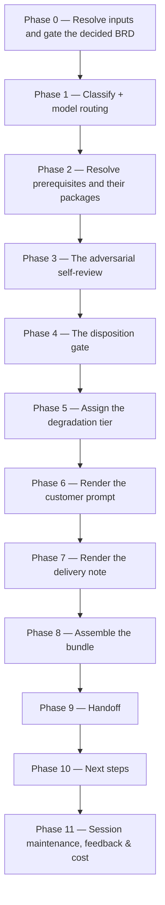

# /brd-package

Turns a **decided** BRD into a package a customer can actually review. It attacks the package before
the customer does, refuses to build anything while a single self-review finding is undisposed, then
renders a self-contained prompt and a de-Obsidianised bundle for a reviewer with **a vanilla agent
and nothing installed** — no plugin, no skills, no MCP server. It writes the self-review, the prompt,
the delivery note, and the dated bundle.

## Who runs it

`/brd-package` runs in the [pm](../roles-and-phases.md#pm--product-management) role,
cost-attribution phase `brd-to-prd` — the phase shared by every command of the BRD-to-PRD route. It
is the fifth command of that route, after `/brd-intake`, `/brd-ground`, `/brd-split` and
`/brd-interview`.

## Synopsis

```
/brd-package <BRD-KEY> [--depends-on <BRD-KEY>…]
```

- **`<BRD-KEY>`** (mandatory) — the BRD this run packages. A key at either of the two levels a BRD
  folder can occupy works, and both behave identically. Resolved via `resolve-address`;
  format-validated only, never checked against a tracker.
- **`--depends-on <BRD-KEY>`** (optional, repeatable) — declares a prerequisite BRD. Persisted
  additively to `brd-link.md`, never replacing what is already there. Any key at any level is
  admissible, so a slice depending on another BRD and a BRD depending on a sibling express
  identically. Each resolved prerequisite's own package is copied into the bundle and marked *not
  for re-review*, and each one whose decisions are not yet customer-reviewed is named to the
  customer under *what could still move*.

There is **no `--no-docs` flag**, because this command does no documentation grounding at all — see
[What it does not do](#what-it-does-not-do).

## Everything it emits is read outside your organisation

That single fact is what the command is built around. The customer's reviewer has the bundle and
whatever repositories they were able to obtain, and nothing else: no plugin to resolve a path
against, nobody to ask what a citation means, and no way to tell a missing file from a withheld one.
So the rendered prompt, the delivery note and every document in the bundle carry **no path rooted at
the plugin's install directory, no `references/…` citation, no slash command, no agent or skill name,
and no `§` section reference** — the rules in
[`bundle-packaging.md`](../../references/bundle-packaging.md) §1 and
[`customer-review-schema.md`](../../references/customer-review-schema.md) §1.

**How the command guarantees that** is a property of its phase order, not of its prose. The review
schema is rendered out of its own file from the boundary that file declares, never in full — the
part above the boundary is where that file deliberately keeps its citations. Every part of the
prompt is assembled from a named artifact rather than written fresh. The de-Obsidianising pass
renders a copy and never edits a source. And the plugin-free scan runs last, over the *finished*
text of the prompt, the note and every bundle document — a hit **stops the run and never sanitises**,
because a citation that reached the prompt reached it from a sentence that assumed a reader who has
this plugin, and deleting four characters leaves that assumption in place.

## How it runs



`brd-package-reviewer` is dispatched on Opus for the adversarial pass, and once more when a `fixed`
disposition changed the package the review was written against. `impl-maintenance` runs in the
terminal phase for session lessons-learned. No other subagent is dispatched.

## What it needs

- **`<BRD-KEY>`** — mandatory; absent or malformed stops the run with `BRD_PACKAGE_NEEDS_KEY`.
- **An existing BRD folder.** No folder for `<BRD-KEY>` — searched at `specifications/` and the one
  level below it — stops with `BRD_PACKAGE_NOT_FOUND`, which names both ways a folder comes to exist
  rather than asserting one.
- **`/brd-interview`'s register already merged to the specs repo's default branch.**
  `require-on-main` runs against `decisions.md` before anything else is read; an unmerged pull
  request stops the run naming the branch/PR state. Where the gate reports the register is on no ref
  at all, the run **splits a state the gate cannot**, as [`/brd-reconcile`](brd-reconcile.md) does on
  its own row F: no `decisions.md` in the folder means no interview ever ran
  (`BRD_PACKAGE_NEEDS_INTERVIEW`, run [`/brd-interview`](brd-interview.md)), while a register in the
  folder means the interview ran and its handoff was declined
  (`BRD_PACKAGE_REGISTER_NOT_HANDED_OFF`, land the files that are already on disk). The second must
  **not** send the operator back to `/brd-interview`: on an unchanged BRD that command opens no new
  round, stages nothing, and opens no pull request.
- **Every interview question settled, or held for the customer.** Any question still *deferred*,
  *needs grounding* or *untagged* stops with `BRD_PACKAGE_ROUND_UNSETTLED` — see
  [Gates](#gates) for why *held for the customer* is the one holding state this command admits.
- **Something for the customer to decide.** No `[C]` question, no open `[AS#n]` and no `[VD#n]` at
  all stops with `BRD_PACKAGE_NOTHING_TO_REVIEW` — reported as a **finished** state rather than a
  missing step, since every question was settled from verified findings and there is nothing to ask
  a customer. The stop says outright that another interview round is not the fix (it opens one only
  on a changed finding or a moved decision) and names the action that can change it:
  `/brd-ground <BRD-KEY> --rebaseline`, or a decision reopened or superseded in the register. A
  package carrying `[VD#n]` positions and no `[C]` question is legitimate and is packaged.
- **`$SPECS_PATH`** (required) — if unset, the run stops naming `SPECS_PATH`.
- **No repository, and no `$REPOS_PATH`.** Every commit this package cites was pinned and proven
  clean by `/brd-ground`; the repo→SHA table is read from that run's `baselines.md`, and the three
  pin-verification commands are handed to the customer's reviewer to run rather than re-run here.

## What it produces

Under `$SPECS_PATH/specifications/<BRD-KEY>-<slug>/`, all stamped with one date taken once:

| Artifact | What it is | In the bundle? |
|---|---|---|
| `self-review-<date>.md` | The adversarial pass: every `[SR#n]` with its class, target, attack and disposition, plus the per-pass account | **no** — see below |
| `customer-review-prompt-<date>.md` | The self-contained prompt the customer pastes, in the fixed eleven-part order, with the review schema inlined | yes |
| `bundle-<date>/` | De-Obsidianised plain markdown and images, plus a manifest and any dependency package | it *is* the bundle |
| `customer-delivery-note-<date>.md` | The covering letter, under a 200-word ceiling | **no** — it is the email, not a package document |

`brd-link.md` also gains any prerequisite this run declared, merged additively.

**The self-review never travels, and the reason is the disposition gate.** A `[SR#n]` disposed
`rejected-with-reason` has its reason recorded there and it "stays inside the delivery organisation";
the `[SR#n]` content the customer may see reaches them **filtered** — `accepted-risk` findings under
*where to attack us hardest*, `escalated-to-customer` findings under *the decisions the customer must
make*. Shipping the file would defeat that filter and hand the customer an internal disagreement to
referee. What the bundle *does* hold is an allow-list, not a deny-list, and
[`bundle-packaging.md`](../../references/bundle-packaging.md) §1.1 is its authority: the prompt; the
customer's own source document and defect log (the parent's on a slice); the inventory; the coverage
ledger; the three grounding files; the decision register; the `[C]` question set; each prerequisite
package; the images those reference; and the manifest. A document reaches the bundle only where a
part of the prompt sends the reviewer to it — everything else in the folder is a working record and
stays.

Behind the handoff phase's consent choice, these are committed, pushed, and a pull request opened
against the specs repo's default branch under the shared `brd/<BRD-KEY>-<slug>` branch prefix. The
committed bundle serves both delivery routes: a customer with repository access pulls it, and
everyone else gets one archive command printed with an absolute path at the end of the run.

## The prompt's eleven parts

Assembled from the package, never hand-written, in a fixed order that is not re-ordered or merged.

| # | Part | Filled from |
|---|---|---|
| 1 | Setup | the tier, the archive command, the assumed capability set, the OS note, and the one-new-file rule |
| 2 | What each package in the bundle is for | this BRD, plus each prerequisite package, marked *not for re-review* |
| 3 | Documents to review | the manifest, by filename |
| 4 | Code baselines and the verification procedure | `baselines.md`, with the three pin commands written out |
| 5 | The single most important claim to verify first | the finding the most decisions rest on — exactly one |
| 6 | Review scope | the coverage ledger's dispositions — the rows this BRD is answerable for, with every `covered-by` row named as another BRD's and explicitly not for review here |
| 7 | The decisions the customer must make | the `[C]` question set, every open `[AS#n]`, every escalated `[SR#n]` |
| 8 | What could still move | prerequisites not yet customer-reviewed, and every `conditional_on` position |
| 9 | Where to attack us hardest | every open `[AS#n]`, and every `accepted-risk` `[SR#n]` |
| 10 | The required output file, its exact name, and the inlined schema | the one-new-file rule, and the rendered schema |
| 11 | What this session cannot settle | the ledger, the prerequisites, and the review's own limits |

**Parts 8 and 9 are the two that are easy to lose and expensive to omit.** A package that names its
own weak points gets a review worth having; one that does not gets a rubber stamp. And a customer
being asked to accept positions built on a prerequisite nobody has reviewed yet is entitled to know
which positions those are, by identifier.

**Every open `[AS#n]` appears in both part 7 and part 9, deliberately.** Part 7 asks the customer to
decide it — an assumption corrected while it is still an assumption is the cheapest correction in the
whole loop. Part 9 invites them to attack it. Removing either copy as redundant always loses the
attack.

## Gates

- **Phase 0 — the register merged, the rounds settled, something to review.** All three run before
  anything else is read. The rounds gate admits exactly one holding state, *held for the customer*,
  and refuses the other three. That reading is forced: a round holding a `[C]` stays open **until the
  answer comes back through the package**, and the package is what this command builds, so requiring
  every round to be closed would deadlock the route. The other three holding states each name work
  that is still the delivery team's.
- **Phase 0 — a dated bundle is never rewritten.** A `bundle-<date>/` that already exists stops the
  run with `BRD_PACKAGE_BUNDLE_EXISTS`. Rewriting it destroys the only evidence of what the reviewer
  of that date was looking at, and the command cannot tell whether the existing directory was already
  sent — the operator can.
- **Phase 4 — the disposition gate.** No bundle is built while any `[SR#n]` is undisposed. The gate
  is keyed on **every finding carrying a non-`undisposed` value**, and on nothing else: the reviewer
  agent returns no severity and no PASS/BLOCK verdict by design, so the disposition is the only gate
  there is. The four values are `fixed`, `accepted-risk`, `escalated-to-customer` and
  `rejected-with-reason`; the picker carries no free-text entry, because a fifth disposition is one
  nothing downstream can read.
- **Phase 4 — a `fixed` correction re-opens the review, exactly once.** Correcting the package
  changes what the review was written against, so the reviewer runs again over the corrected package
  with the first pass in `prior_reviews`. Once, not until clean: an unbounded loop trades the
  customer's review for the delivery team's.
- **Phase 5 — the tier is assigned from what was shippable.** Full, Partial or Documents only, never
  promoted, never chosen by the reviewer, and never quietly Full because the repositories were
  *probably* at the right commit. A tier is not a quality grade: a documents-only review that states
  its tier can be weighed correctly, and a full-tier review that states nothing cannot be weighed at
  all. The picker carries no free-text entry either, for the same reason the `[SR#n]` one does not:
  a fourth tier is one neither the prompt nor a returned review's section 1 could state.
- **Phase 6 — the render boundary.** The schema is rendered from section 2 onward, and the run stops
  with `BRD_PACKAGE_SCHEMA_BOUNDARY` if that file no longer declares where its boundary falls. The
  rendered headings are renumbered so the customer's copy runs from 1 rather than visibly beginning
  at 2; that is safe because the schema refers to its own sections by name and never by number, which
  the render verifies by requiring the extracted body to contain no `§` at all.
- **Phases 6, 7 and 8 — the plugin-free scan.** Run over the finished prompt, the finished note and
  every bundle document. A hit stops the run with `BRD_PACKAGE_PROMPT_LEAK`, naming the token, the
  part it landed in and the artifact it came from. Requirement, finding, decision and assumption
  identifiers are **not** in the scan's classes and are meant to travel — they are how the returned
  review cites the package without minting identifiers of its own.
- **Phase 7 — the delivery note's 200-word ceiling.** A ceiling, not a target. Over it, the note is
  shortened and re-rendered; the two facts that are never trimmed are which file is the prompt and
  which file comes back.

## What it does not do

- **No documentation grounding, and no `--no-docs` flag.** `/brd-intake` and `/brd-ground` already
  ground this BRD against the shipped product documentation when `$DOCS_PATH` resolves. This command
  establishes no claim of its own at all — it renders what other commands recorded — so a
  documentation page could only introduce an ungrounded sentence into a bundle whose whole value is
  that every sentence in it is traceable. There is nothing to switch off, so no flag exists to switch
  it.
- **It sends nothing anywhere.** The bundle is written and, behind consent, committed; the delivery
  note is printed for pasting. Delivery is the operator's.
- **It writes no `[CD#n]`, and it ingests no returned review.**
  [`/brd-reconcile`](brd-reconcile.md) is what turns a returned answer into a confirmed customer
  decision, so the round holding each `[C]` stays open until that run records it.
- **It changes no ledger disposition.** The final report's ledger line reports where allocation
  stands; allocation itself is `/brd-split`'s walk, and a row moves afterwards only when
  `/brd-reconcile` freezes a customer decision that settles it differently.

## Example

Package a synthetic customer BRD once its interview round has settled, declaring one prerequisite:

```
/dev-workflows:brd-package EPIC-008 --depends-on EPIC-014
```

The run gates on `decisions.md` being merged and on every question carrying a terminal disposition or
being held for the customer, dispatches the adversarial reviewer, walks each `[SR#n]` to a
disposition, asks which tier the customer can be given, renders the prompt and the note, assembles
`bundle-<date>/` with the prerequisite's package copied in and marked *not for re-review*, and offers
to branch, commit, push and open a pull request. The report prints the delivery note in full, the
archive command with an absolute path, the repo→SHA table, and the ledger line.

## See also

- [Roles and phases](../roles-and-phases.md) — what the `pm` role owns and hands off.
- [`bundle-packaging.md`](../../references/bundle-packaging.md) — the authority for plugin-free
  construction, the de-Obsidianising pass, the three degradation tiers, the delivery note's ceiling,
  and where the bundle lands.
- [`customer-review-schema.md`](../../references/customer-review-schema.md) — the twelve sections the
  returned review carries, and the file whose body this command inlines from section 2 onward.
- [`decision-register-format.md`](../../references/decision-register-format.md) — the `[VD#n]` /
  `[CD#n]` / `[AS#n]` record, `conditional_on`, and the rule that every open assumption reaches the
  customer.
- [`interview-tagging.md`](../../references/interview-tagging.md) — the `[C]` tag, and the rule that
  a customer question reaches the customer only through this package.
- [`grounding-format.md`](../../references/grounding-format.md) — the finding record and the
  `baseline-integrity` commands the prompt hands the customer to re-run.
- [`coverage-ledger-format.md`](../../references/coverage-ledger-format.md) — the dispositions the
  review-scope part reads, and §6's ledger line the final report ends with.
- [Agents](../reference/agents.md) — `brd-package-reviewer`'s and `impl-maintenance`'s full
  contracts.
- [Session cost](../reference/session-cost.md), [Session feedback](../reference/session-feedback.md),
  and [Resume and checkpoints](../reference/resume-and-checkpoints.md) — the terminal bookkeeping
  every run emits.
