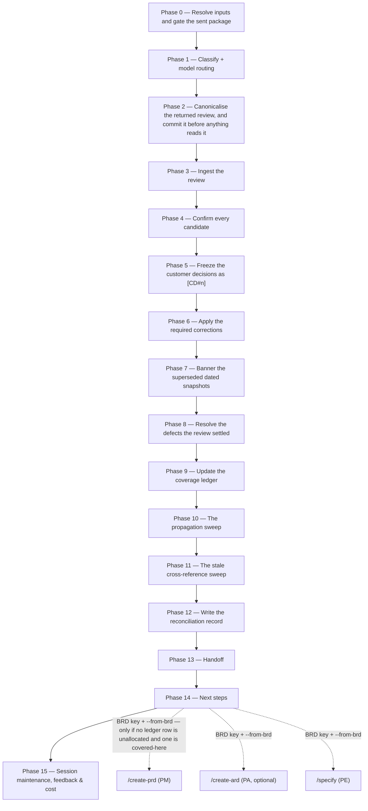

# /brd-reconcile

Takes the customer's returned review, freezes what they actually decided as `[CD#n]` records, and
then goes looking for everything in the tree that still asserts a position their answer overturned.
It is the command that closes the customer loop: the `[C]` questions `/brd-interview` held and
`/brd-package` sent stay open until this run confirms an answer to them.

## Who runs it

`/brd-reconcile` runs in the [pm](../roles-and-phases.md#pm--product-management) role,
cost-attribution phase `brd-to-prd` — the phase shared by every command of the BRD-to-PRD route. It
is the sixth and last command of that route, after `/brd-intake`, `/brd-ground`, `/brd-split`,
`/brd-interview` and `/brd-package`.

## Synopsis

```
/brd-reconcile <BRD-KEY> @<review-file>
```

- **`<BRD-KEY>`** (mandatory) — the BRD this review answers. A key at either of the two levels a BRD
  folder can occupy works, and both behave identically. Resolved via `resolve-brd`;
  format-validated only, never checked against a tracker.
- **`@<review-file>`** (mandatory) — the file the customer sent back, **at whatever path it arrived
  on**. It does not have to be inside `$SPECS_PATH`, and it is never searched for: the operator says
  which file is the review, because a file the command picked is a file nobody submitted as the
  customer's answer.

There is **no `--no-docs` flag**, because this command does no documentation grounding at all — see
[What it does not do](#what-it-does-not-do).

## No inferred decision becomes a `[CD#n]` without a human

That single rule is what the command is built around, and it is decision row D14: **normalising
prose into a decision register is inference, and promoting inference to customer authority silently
is the one way this workflow could fabricate a mandate the customer never gave.** A `[CD#n]` reads
downstream as frozen customer authority, decisions are built on it, and nothing on the page would
record that a sentence of prose was read into it by an agent.

**How the command guarantees it** is a property of its phase order, not of its prose:

- `customer-review-reader` is the only thing that reads the review, and it **cannot mint** — every
  free-text decision comes back a `candidate` with `confirmed: false`, and its hard rules forbid it
  any identifier in the delivery side's namespaces.
- The command **never widens that agent's mode**. It passes `auto`, or `free-text` where the operator
  says the file is prose, and never `schema`. There is no second dispatch to get a different answer.
- Confirmation runs to completion **before** the freeze phase opens, and the freeze phase reads the
  confirmed set and nothing else.
- Every candidate is put **one at a time, with its verbatim quotation**. There is no bulk
  confirmation, and that omission is required rather than permitted — the quotation is the whole
  mechanism, and batching turns a confirmation into a formality.
- A reason nobody gave is **never supplied**. A candidate returned `reason: not stated` cannot be
  frozen as `decided` by anyone in the run.

## How it runs



`customer-review-reader` is dispatched once, on the detection chain. `impl-maintenance` runs in the
terminal phase for session lessons-learned. No other subagent is dispatched.

## What it needs

- **`<BRD-KEY>` and `@<review-file>`** — either absent or malformed stops the run with
  `BRD_RECONCILE_NEEDS_KEY` or `BRD_RECONCILE_NEEDS_REVIEW`.
- **An existing BRD folder.** No folder for `<BRD-KEY>` — searched at `specifications/` and the one
  level below it — stops with `BRD_RECONCILE_NOT_FOUND`, which names both ways a folder comes to
  exist rather than asserting one.
- **A package already handed off to the specs repo's default branch.** `require-on-main` runs against
  the most recent `customer-review-prompt-<date>.md` before anything else is read, and an unmerged
  pull request stops the run naming the branch/PR state. The gate is the prompt rather than the
  register because the committed package is what makes a quotation in the returned review checkable
  against the version the customer actually received. Where the gate reports the prompt is on no ref
  at all, the run **splits a state the gate cannot**: no prompt in the folder means no package was
  ever built (`BRD_RECONCILE_NEEDS_PACKAGE`, run `/brd-package`), while a prompt in the folder means
  the package was built and its handoff declined (`BRD_RECONCILE_PACKAGE_NOT_HANDED_OFF`, land the
  files that are already on disk). The second must **not** send the operator back to `/brd-package`:
  that command will not rewrite a dated bundle, so it stops today and builds a *different* package on
  any other date.
- **`$SPECS_PATH`** (required) — if unset, the run stops naming `SPECS_PATH`.
- **No repository, and no `$REPOS_PATH`.** Every finding this run reads was pinned and independently
  re-derived by `/brd-ground`.

## What it produces

Under the BRD folder:

| Artifact | What it is |
|---|---|
| `customer-review-<date>.md` | The returned review, copied in byte for byte and committed **before** anything reads it. Stamped with the **customer's** date, not the run's; a second review of that date takes a `-<suffix>` |
| `reconciliation-<date>.md` | What changed, why, which ids, and what still needs a human. Stamped with the run's date; a second pass on the same day appends rather than overwriting |

And it updates, in place: `decisions.md` (the new `[CD#n]`, the superseded `[AS#n]`, the reopened
`[VD#n]`), the round record and the `[C]` question set, `coverage-ledger.md`, the defect log — **the
parent's**, when the run stands on a slice — every dated artifact it banners, every dependent BRD's
register the propagation sweep wrote, and every artifact the stale-reference sweep corrected.

The run makes **two** handoff offers, and they are two different questions: the first hands off the
customer's document, the second hands off what the run decided about it. Both land on one `brd/`
branch and one pull request, in the order they happened.

## The three id shapes section 7 can carry

A returned review's decision log answers what the package's *decisions the customer must make* part
put to it, and that part is filled from three sources — so the parser accepts three shapes, not two.

| Shape | Where it came from |
|---|---|
| a `[C]` question, by its round and position | the `[C]` question set `/brd-interview` held |
| an `[AS#n]` | every open assumption in the register |
| an `[SR#n]` | a self-review finding `/brd-package` disposed `escalated-to-customer` |

**The third is not an oversight to narrow away.** `/brd-package` puts an escalated finding to the
customer under its own `[SR#n]` rather than minting a `[C]`, precisely because minting one would put
a question to the customer that never went through the tag test. A parser accepting only the first
two would silently drop every answer to a finding the delivery team escalated on purpose — and the
drop would look like customer silence. A row citing none of the three is carried as `unmatched`.

## Gates

- **Phase 0 — the package merged.** Reconciling against a package that exists only in a working tree
  would freeze customer authority against a document nobody can produce later. Allocation and the
  interview rounds are **not** re-gated: both were gated upstream, and a second differently-worded
  copy of either rule would eventually disagree with the first.
- **Phase 2 — a returned review is never overwritten, and a second one that day is not refused.** A
  destination that already exists and is byte-identical is a resumed run and proceeds. One that
  **differs** is a second review carrying the same date — a corrected resend, or two reviewers on the
  customer side — which is ordinary, not an error: the run prompts for a disambiguating suffix and
  copies to `customer-review-<date>-<suffix>.md`. A date cannot disambiguate two files genuinely
  written the same day, and telling the operator to rename the incoming file would be telling them to
  record a date the review does not carry. Only declining to name a suffix stops the run
  (`BRD_RECONCILE_REVIEW_EXISTS`).
- **Phase 4 — the confirmation gate.** No `[CD#n]` is written while any decision the reader returned
  is unconfirmed. The four values are `confirm`, `correct`, `reject` and `ask-the-customer`; the
  picker carries no free-text entry and no bulk confirmation. That omission is enforceable because
  [`escalation-rules.md`](../../references/escalation-rules.md) carves this picker out **by name** —
  its standing "one permitted adjustment" would otherwise authorise adding a free-text box to the one
  picker through which customer authority enters the register. `Cancel` stops the run with **nothing
  frozen**: no record exists until the freeze phase, so a cancelled walk loses its confirmations and
  a re-run re-offers every candidate.
- **Phase 4 — a resumed run never re-asks what it already froze.** A candidate whose target already
  carries a `decided` `[CD#n]` from an earlier pass over the same review is skipped, because two
  customer answers to one question is a contradiction one record cannot hold. A target carrying an
  `open` `[CD#n]` is re-offered, and confirming it **completes that record** rather than minting a
  second id.
- **Phase 4 — a reason nobody gave.** A confirmed candidate whose reason is `not stated` takes one
  of exactly two routes: ask the customer and freeze nothing, or freeze it `status: open`, which puts
  the answer on the record and makes it unusable downstream until the reason arrives. Supplying the
  reason is not on the list — a supplied reason is the delivery team's argument recorded as the
  customer's, and it will be defended later as theirs. A question whose `[CD#n]` is `open` **keeps**
  its *held for the customer* state and its round stays open, so the next package asks for the
  missing reason; closing the round there would retire the only mechanism that would ever chase it.
- **Phase 6 — the correction gate.** Every section-12 row takes `applied`,
  `applied-with-deviation`, `refused-with-reason` or `deferred-to-next-round`.
- **Phase 7 — dated snapshots are bannered, never rewritten.** A banner is prepended; nothing beneath
  it changes. Rewriting a dated prompt or self-review to match a later position falsifies the record
  the customer's review responds to, and every quotation in that review then points at a sentence
  that no longer exists.
- **Every phase that writes into another BRD — one guard, not three.** Defect resolutions into a
  parent's log, sweep dispositions into a dependent's register, and stale-reference corrections into a
  sibling slice's artifacts are all cross-BRD writes, and each runs `require-on-main` against the
  target first. Any stopping row — including the artifact being on no ref at all — means **record,
  never write**, naming the intended change and the branch/PR state. It never stops the run: letting
  a dependent's open pull request block the prerequisite's own customer loop is the D20 failure
  arriving from the other direction.
- **Phase 10 — the sweep gate.** Every position the propagation sweep reaches takes
  `inherited-unchanged`, `reverted`, `reopened` or `withdrawn`, and an `inherited-unchanged` row is
  written too: an item checked and found unaffected and an item never reached are different facts. A
  resumed run skips what an earlier pass disposed **and wrote**, and re-sweeps in full every
  dependent that pass could only record — otherwise merging that dependent's pull request, which is
  exactly what unblocks the sweep, would never let it land.

## The two sweeps

**Propagation.** Every BRD whose `brd-link.md` declares `depends-on:` carrying this key is swept, at
either level. Decisions and assumptions carrying `conditional_on` are the **first** target and are
swept whether or not they cite a changed id — that is what the field is for, and the order is
load-bearing: the `conditional_on` pass is the complete one, found mechanically by a field, and
running the incomplete textual pass first makes the complete one an afterthought. A dependent whose
own register is in flight is **recorded, never written**, so nothing overwrites somebody else's open
pull request and no downstream BRD can stall the prerequisite's customer loop.

**Stale cross-references.** Rooted at the **parent's** folder, so a sibling slice is reached. Two
searches: the changed ids, matched whitespace-tolerantly because an identifier is routinely broken
across a line wrap; and prose asserting a now-superseded position with no id in it at all. The second
cannot be reduced to a pattern, and it is the one that matters — **updating a register while a value
document still states the old position is the characteristic failure of this step**, and the
contradiction is invisible from the register, which is the only place anybody looks.

## What it does not do

- **No documentation grounding, and no `--no-docs` flag.** `/brd-intake` and `/brd-ground` already
  ground this BRD against the shipped product documentation when `$DOCS_PATH` resolves. The whole
  content of this run is what the **customer** said; a documentation page is a claim about behaviour
  written by the delivery organisation, so consulting one here could only produce a sentence
  contradicting the one party whose authority the run is recording. There is nothing to switch off,
  so no flag exists to switch it.
- **It writes no finding.** A customer challenge to a code or design claim is recorded verbatim and
  named as needing a `/brd-ground` pass — a finding is not evidence until independently re-derived
  by a different agent, and this command re-derives nothing.
- **It never supersedes a `will-change` finding.** One whose prerequisite decision this run froze is
  named with `--rebaseline` as the fix; a supersession written here would have nothing on the other
  side of it.
- **It never allocates.** It may move a ledger row to `deferred-to`, `rejected` or `superseded-by`
  on a frozen customer decision, but `covered-here` and `covered-by` stay `/brd-split`'s walk — a
  customer decision is not a statement about which BRD in the delivery organisation owns the work —
  and no row ever returns to `unallocated`.
- **It never writes into another BRD's ledger, and it never mints a `[BR#n]`.** A requirement the
  customer asked for that no `[BR#n]` covers is recorded as needing a human, naming the two real
  routes: an amendment logged against the defect log, or a fresh source document through
  `/brd-intake`.
- **It never edits `brd/source/`.** The customer's document stays immutable; an amendment is held
  beside it as a defect-log resolution.
- **It never banners inside `bundle-<date>/`.** That directory is the permanent record of exactly
  what was sent and its whole value is that it is byte-identical to the customer's copy. An
  overturned bundle document is named in the reconciliation record instead.

## Where the route goes next

This is where the BRD-to-PRD route **hands over**, not where it ends. A reconciled BRD — decisions
frozen, dependents swept, every artifact under the parent checked — is the state the PRD pipeline
was waiting for, and Phase 14 offers all three `--from-brd` entry points against the same
`<BRD-KEY>`, each under the precondition the offered command actually enforces:

| Handover | Offered when | Why |
|---|---|---|
| [`/create-prd <BRD-KEY> --from-brd`](create-prd.md) (PM) | **Conditionally** — no ledger row still `unallocated`, and one `covered-here` | Exactly the two refusals its own Phase 0 raises; offering it otherwise hands over a run that stops immediately |
| [`/create-ard <BRD-KEY> --from-brd`](create-ard.md) (PA, optional) | **Unconditionally** | No `jira-reader`, so no tracker key; no PRD gate, so no wait on a PRD; and it reads neither `claims:` nor the ledger |
| [`/specify <BRD-KEY> --from-brd`](specify.md) (PE) | **Unconditionally** | The same three reasons, read out of its own Phase 0 rather than assumed symmetric with `/create-prd`'s |

Both `/create-prd` tests are read over the BRD's **own ledger rows** — `brd-link.md`'s `claims:`
narrows that set only on a slice, since a BRD owning its source document carries no such field — and
off the ledger **file**, never off a `ledger:` line, whose `unallocated` term is a resolved count
that also holds rows a child has not walked yet. Where either test fails the option is **dropped from
the array** rather than annotated, and the text says which one failed: a row still `unallocated` is
walked to a terminal disposition by [`/brd-split`](brd-split.md), while a BRD with no `covered-here`
row holds no PRD of its own at all — on a `covered-by` row the PRD is the named BRD's to author.

Each takes **one** key: a second positional is refused (`CREATE_ARD_BRD_NO_EPIC` / `SPECIFY_BRD_NO_EPIC`),
so neither of the optional two is ever offered with an Epic beside it. The three are **alternatives,
not a sequence** — neither of the unconditional two waits on the PRD — and none of them carries the
`<merge-clause>` placeholder, because none runs `require-on-main` against anything this command
writes ([`next-phase-offer.md`](../../references/next-phase-offer.md)). No option in Phase 14's array
carries `(Recommended)`: which one is right depends entirely on what the reconciliation left behind,
so each option states its own condition in its own text.

The same phase also offers the route's **re-entries** — another [`/brd-interview`](brd-interview.md)
round where this run reopened a decision, [`/brd-package`](brd-package.md) where questions remain for
the customer, [`/brd-ground --rebaseline`](brd-ground.md) where the review challenged a code claim,
and a second `/brd-reconcile` pass on this same review once a dependent recorded-not-written has its
own register on the default branch.

## Example

Reconcile the review that came back for a synthetic customer BRD, from wherever the attachment was
saved:

```
/dev-workflows:brd-reconcile EPIC-008 "@~/Downloads/EPIC-008 Customer Review 20260415.md"
```

The `@<review-file>` token is **quoted**, because the command parses its arguments positionally and
a returned review routinely arrives under a name with spaces in it — the same reason
[`/brd-package`](brd-package.md)'s customer-facing note tells reviewers to quote the filename they
send back. Unquoted, `Customer`, `Review` and `20260415.md` are three further positional tokens and
the path the run resolves is not the file the customer sent.

The run gates on the package being merged, copies the file to `customer-review-20260415.md` and
offers to commit it, dispatches `customer-review-reader`, surfaces every schema anomaly before
anything is confirmed, walks each candidate against its verbatim quotation, freezes the confirmed
answers as `[CD#n]` and closes their `[C]` questions, applies the review's required changes, banners
the dated prompt and self-review the answers overturned, writes `customer-amended 20260415` and
`withdrawn` rows to the defect log, moves the ledger rows the decisions settled, sweeps `EPIC-014`
and every other dependent starting with its `conditional_on` positions, sweeps every artifact under
the parent for the changed ids and for prose still asserting the old position, and writes
`reconciliation-<date>.md`.

Phase 14 then hands the route over. `EPIC-008`'s reconciled ledger leaves no row `unallocated` and
several `covered-here`, so all three exits are offered against that one key:

```
/dev-workflows:create-prd EPIC-008 --from-brd
/dev-workflows:create-ard EPIC-008 --from-brd
/dev-workflows:specify EPIC-008 --from-brd
```

Had the run left a row `unallocated`, or left none `covered-here`, the first line would be dropped
from the offer and the stop would say which test failed; the other two would still be offered.

## See also

- [Roles and phases](../roles-and-phases.md) — what the `pm` role owns and hands off.
- [`customer-review-schema.md`](../../references/customer-review-schema.md) — the twelve sections the
  returned review carries, and the one-new-file rule that makes section 12 the only channel for a
  change to a package document.
- [`decision-register-format.md`](../../references/decision-register-format.md) — the `[CD#n]` record,
  the mandatory `argumentation`, the two causes that may reopen a decision, and `conditional_on`.
- [`interview-tagging.md`](../../references/interview-tagging.md) — the `[C]` tag and the round
  vocabulary whose terminal disposition *answered by the customer* this command writes.
- [`coverage-ledger-format.md`](../../references/coverage-ledger-format.md) — the dispositions, and
  §6's roll-up behind the ledger line every run ends with.
- [`brd-format.md`](../../references/brd-format.md) — the four defect resolutions, two of which this
  command writes, and the slice's one-hop inheritance of its parent's defect log.
- [`bundle-packaging.md`](../../references/bundle-packaging.md) — why the committed bundle is the
  permanent record, and therefore why nothing inside it is bannered.
- [Agents](../reference/agents.md) — `customer-review-reader`'s and `impl-maintenance`'s full
  contracts.
- [Session cost](../reference/session-cost.md), [Session feedback](../reference/session-feedback.md),
  and [Resume and checkpoints](../reference/resume-and-checkpoints.md) — the terminal bookkeeping
  every run emits.
