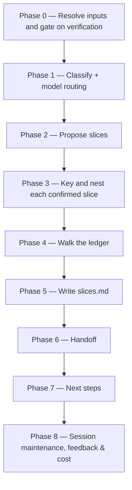

# /brd-split

Gates on every grounding finding carrying a verifier verdict, proposes candidate slices from the
grounded picture, keys and nests a child BRD folder per confirmed slice with its own
`brd-link.md`, then walks every unallocated coverage-ledger row one at a time through five
resolutions until none remain `unallocated`, and writes `slices.md` with the rationale for each
slice and each deferral.

## Who runs it

`/brd-split` runs in the [pm](../roles-and-phases.md#pm--product-management) role,
cost-attribution phase `brd-to-prd` — the phase shared by all three commands of the BRD-to-PRD
route (`/brd-intake`, `/brd-ground`, `/brd-split`). All three have now landed; `/brd-split` is the
last command of this route for increment 1.

## Synopsis

```
/brd-split <BRD-KEY>
```

- **`<BRD-KEY>`** (mandatory) — the BRD (or slice) to split and allocate. Resolved via
  `resolve-brd`, so a parent or a slice key both work; format-validated only, never checked
  against a tracker.

## How it runs



A BRD whose ledger has no `unallocated` row when Phase 0 checks it is a no-op: the run skips
straight from Phase 0 to Phase 6, which reports nothing to commit. `impl-maintenance` runs in
Phase 8 for session lessons-learned; no other subagent is dispatched — every finding this command
reads was already independently verified by `/brd-ground`'s own agents.

## What it needs

- **`<BRD-KEY>`** — mandatory; absent or malformed stops the run with `BRD_SPLIT_NEEDS_KEY`.
- **An existing BRD folder.** No folder for `<BRD-KEY>` stops the run with `BRD_SPLIT_NOT_FOUND`,
  naming `/brd-intake` as the fix.
- **`/brd-ground`'s findings already merged to the specs repo's default branch.** Phase 0 gates
  `grounding/code-grounding.md` on `origin/<default>` via `require-on-main` before reading
  anything else — an open, unmerged grounding pull request stops the run naming the branch/PR
  state, and a BRD that has never been grounded at all stops with `BRD_SPLIT_NEEDS_GROUNDING`,
  naming `/brd-ground` as the fix. This transitively also proves `/brd-intake`'s ledger reached
  main, since `/brd-ground` gates on it the same way before it will run.
- **Every finding verified.** A finding with no recorded verifier outcome (`agree` / `extend` /
  `contradict` / `unprovable`) is not evidence this command may act on. Any such finding on file
  stops the run with `BRD_SPLIT_UNVERIFIED: N findings have no verifier verdict — run
  /dev-workflows:brd-ground first.`
- **`$SPECS_PATH`** (required) — if unset, the run stops naming `SPECS_PATH`.

## What it produces

Under `$SPECS_PATH/specifications/<BRD-KEY>-<slug>/`:

- `coverage-ledger.md` — updated so no row remains `unallocated`: each row now reads
  `covered-here`, `covered-by: <CHILD-KEY>`, `deferred-to: <this BRD>`, `rejected: [DEF#n]`, or
  `superseded-by: [BR#n]`.
- `slices.md` — one block per confirmed slice (its key, its folder, and its buildable / blocked /
  depends-on rationale) plus one block per row deferred this run.
- One nested folder per confirmed slice still claiming at least one row after the walk,
  `<BRD-KEY>-<slug>/<CHILD-KEY>-<child-slug>/`, each holding three files: `brd-link.md` naming its
  parent and its claimed `[BR#n]` rows; `brd/brd-inventory.md`, the claimed rows copied verbatim
  from this BRD's inventory under a header naming the parent's `brd/source/`, which every
  `source_anchor` in it still resolves against
  ([`brd-format.md`](../../references/brd-format.md) §2.1); and its own `coverage-ledger.md` with
  every row `unallocated`. Those last two are what let the child re-enter the route: `/brd-ground`
  gates on the child's ledger and reads the child's inventory, and `/brd-intake` — the only other
  command that writes either — never runs on a slice, which has no document to intake. A slice
  whose every row ends up resolved elsewhere is either removed or kept empty with a recorded reason
  (Phase 4).

Behind Phase 6's consent choice, these are committed, pushed, and a pull request opened against
the specs repo's default branch under the shared `brd/<BRD-KEY>-<slug>` branch prefix — skipped
with a "nothing to commit" report on the no-op path.

## Gates

- **Phase 0 — grounding merged to main.** `require-on-main` against `grounding/code-grounding.md`
  runs before anything else is read — an unmerged grounding pull request, or a BRD never grounded
  at all, stops the run rather than acting on a deliverable that might still change underneath it.
- **Phase 0 — verification gate.** No slice is proposed and no row may be resolved `covered-here`
  against a claim no one has verified: every grounding finding on file must carry a verifier
  outcome before this command does anything else.
- **Phase 4 — the allocation walk.** The command cannot complete while any coverage-ledger row is
  `unallocated`. Every remaining row is presented one at a time via `AskUserQuestion`, through
  exactly five resolutions: build here (`covered-here`), assign to a named child
  (`covered-by`), defer to this BRD (`deferred-to`), reject citing a `[DEF#n]`, or mark superseded
  by another `[BR#n]`. `covered-here` is the resolution that makes the whole BRD PRD-eligible, and
  it is what an unsplit BRD reaches for every row — without it, a BRD nobody splits could never
  clear this gate.
- **Phase 4 — no child left claiming nothing.** A slice whose every proposed row ends the walk
  resolved elsewhere leaves its child folder claiming no requirement; the run resolves this before
  moving on, either removing that folder or keeping it with a recorded reason.
- **No-op on a fully-allocated ledger.** Re-running `/brd-split` once every row already has a
  disposition changes nothing; the run reports the ledger line and stops.

## Example

Split a synthetic customer BRD once its grounding pull request has merged:

```
/dev-workflows:brd-split EPIC-008
```

The run resolves the BRD, confirms every finding carries a verifier verdict, proposes candidate
slices from the buildable / blocked / depends-on picture grounding produced, keys and nests a
folder per confirmed slice, walks every remaining ledger row to one of the five resolutions,
writes `slices.md`, and offers to branch, commit, push, and open a pull request.

## See also

- [Roles and phases](../roles-and-phases.md) — what the `pm` role owns and hands off.
- [`brd-addressing.md`](../../references/brd-addressing.md) — the `<BRD-KEY>` grammar and folder
  resolution this command uses by name (`brd-key-valid`, `resolve-brd`), including how a slice
  nests inside its parent (§3), which this command is the one that actually creates.
- [`coverage-ledger-format.md`](../../references/coverage-ledger-format.md) — the authority for
  the ledger row shape, the six dispositions, the allocation gate this command enforces, and the
  PRD-eligibility rule that makes `covered-here` matter.
- [`grounding-format.md`](../../references/grounding-format.md) — §8's four verification outcomes,
  which this command's Phase 0 gate depends on.
- [Agents](../reference/agents.md) — `impl-maintenance`'s full contract.
- [Session cost](../reference/session-cost.md), [Session feedback](../reference/session-feedback.md),
  and [Resume and checkpoints](../reference/resume-and-checkpoints.md) — the terminal Phase 8
  bookkeeping every run emits.
