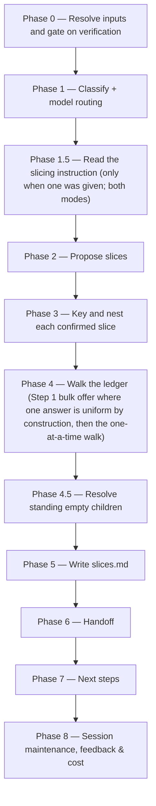

# /brd-split

Gates on every grounding finding carrying a verifier verdict, proposes candidate slices from the
grounded picture, keys and nests a `PRD-` folder per confirmed slice with its own
`brd-link.md`, an inventory of the rows it inherits, and an unallocated coverage ledger of its
own, then walks every unallocated coverage-ledger row one at a time through four
resolutions until none remain `unallocated`, and writes `slices.md` with the rationale for each
slice and each deferral. Where one answer is uniform by construction — exactly one slice standing —
the walk first offers to write that single disposition across every remaining row in one
confirmation, stating each row it would write and letting any of them be held back to the
one-at-a-time walk. Run on a **slice** it allocates but does not slice: the proposal and
child-creation phases are skipped and the walk offers its own four resolutions — the same count as `full` mode, a different set.

## Who runs it

`/brd-split` runs in the [pm](../roles-and-phases.md#pm--product-management) role,
cost-attribution phase `brd-to-prd` — the phase shared by every command of the BRD-to-PRD route. It
is the third command of that route, after [`/brd-intake`](brd-intake.md) and
[`/brd-ground`](brd-ground.md) and before [`/brd-interview`](brd-interview.md); it is not the last
one.

## Synopsis

```
/brd-split <BRD-KEY> [<instruction>]
```

- **`<BRD-KEY>`** (mandatory) — the BRD to split and allocate. A key naming either level a
  BRD folder can occupy works, and the level decides the run mode (below). Resolved via
  `resolve-address`; format-validated only, never checked against a tracker.
- **`<instruction>`** (optional) — every non-flag token after the key, joined verbatim: a slicing
  instruction in your own words, such as `cover orders and measurements in the first iteration` or
  `slice everything this BRD still holds that no child covers`. It is prose and is never validated
  against anything — what it means is settled against this BRD's own rows in Phase 1.5. Omit it and
  the command behaves exactly as it did before the argument existed, on every path.

## What an instruction does

**It seeds two things, and it decides nothing.** In `full` mode it seeds the Phase 2 grouping and the
Phase 4 walk's per-row recommendation; in `allocate-only`, where Phase 2 never runs, it seeds the
walk alone — which is what makes it a real argument on a slice rather than an ignored one.

**Phase 1.5 reads it in two steps.** *Step A* places every row the instruction plainly determines,
asking nothing: a set operation over the ledger (*everything no child covers*) resolves entirely
here. *Step B* grills only the residue — one question at a time, each with a recommended answer,
**capped at five and gated on a value test: ask only where one answer places more than one row.**

**The value test is the real gate, and the reason is the fallback.** Phase 4 settles every
unallocated row regardless — one at a time, or inside its Step 1 offer where that fires — and
Phase 2's picker lets you move rows by hand, so an unplaced row costs nothing you were not already
paying, and a question that disambiguates a single row spends a turn to save at most one prompt that
was coming anyway. What earns a question is a terminology decision that
moves several rows at once. That also sizes the cap: in [`/idea`](idea.md) an unresolved bounded
question ships as a marker inside the artifact, so ≤10 earns its length; here the residue has a free
fallback, so ≤5 does.

**The instruction proposes; the grounded picture constrains.** Where a placement puts a
`NOT-PROVABLE`, `REWRITTEN`, `FALSE-FRIEND` or `will-change` row into a group whose other rows are
buildable now, Phase 2 names those rows and asks whether to include them anyway, hold them back, or
decide row by row. Your grouping wins where you confirm it, and never silently — a slice that quietly
mixed a blocked row in with buildable ones would discard the one signal that makes a slice worth
carving.

**Nothing is invented for a row it could not place.** That row is left unclustered and walked with no
recommendation in Phase 4 — the same fate a row nothing clusters with already had, and the same
picker a run with no instruction has always shown. `slices.md` records the instruction verbatim
alongside how it was read.

## Two modes

Phase 0 step 5 reads the resolved folder's `brd-link.md` and sets the mode from its `parent:` field
— the only reliable signal, since a key's segment count is a naming convention rather than a depth
declaration.

| | `split_mode: full` | `split_mode: allocate-only` |
|---|---|---|
| Applies to | a BRD that owns its source document | a **slice** (`parent:` present) |
| Phase 1.5 — read the slicing instruction | runs (when one was given) | runs (when one was given) — it seeds the walk, not a grouping |
| Phase 2 — propose slices | runs | skipped |
| Phase 3 — key and nest children | runs | skipped — this is the child creation the one-level cap forbids |
| Phase 4 — walk the ledger | runs, **four** resolutions — no `covered-here` | runs, **four** — this walk offers no `covered-by` |
| Phase 4 Step 1 — the bulk offer | fires only when **exactly one** slice stands and ≥2 rows are unallocated; writes `covered-by: <that slice>` | fires whenever ≥2 rows are unallocated; writes `covered-here`, and carries the marker the per-row picker already carries |
| Phase 4.5 — resolve standing empty children | runs | skipped — a slice has no children |
| `rejected: [DEF#n]` resolves in | this BRD's own defect log | the **parent's** log, one hop ([`brd-format.md`](../../references/brd-format.md) §4) |
| Phase 7 — next steps | ground each **non-empty** child | **the route does not end here** — [`/brd-interview`](brd-interview.md) on this slice, Recommended; *Stop here* is the other option, not the only one |
| Announced? | no — the ordinary case | yes, `BRD_SPLIT_ON_SLICE`, a **notice, not a stop**, at Phase 0 and again in the final report |

A slice's walk offers no `covered-by`, and the reason is about **who writes** it, not about whether
a slice may carry one. On a slice the disposition names a **sibling under the same parent, or that
parent** — never a child, since no child can exist below a slice — only its Epics — and it records a **provisional claim
the parent's own walk withdrew**: Phase 3 writes a child's `claims:` provisionally, and where
Phase 4 settles a claimed requirement elsewhere the claim and the copied inventory row are withdrawn
while the ledger row stays and takes that walk's terminal disposition
([`coverage-ledger-format.md`](../../references/coverage-ledger-format.md) §2, §3). Every row a
slice's own walk stands on is a row that slice claims, so there is nothing for it to delegate. The
walk states that reason before its first row rather than presenting a shorter list without
explanation. **The cap is on nesting, not on allocation**: a slice whose rows could never leave
`unallocated` could never become PRD-eligible (§5), which is the deadlock the coverage ledger exists
to prevent.

## How it runs



A BRD whose ledger has no `unallocated` row when Phase 0 reads it is a no-op **only if it also
holds no child standing empty** — a two-part test taken in Phase 0's last step, in both run modes: the run then skips straight from Phase 0 to Phase 6, which reports
nothing to commit. Holding one, it is not a no-op — Phase 0 skips the walk it has no rows for and
runs Phase 4.5 alone, which is what keeps a child kept empty by an earlier run reachable by the one
command that can remove it. Deciding the no-op on the ledger alone made that child unreachable in
every run after the one that created it. `impl-maintenance` runs in
Phase 8 for session lessons-learned; no other subagent is dispatched — every finding this command
reads was already independently verified by `/brd-ground`'s own agents.

## What it needs

- **`<BRD-KEY>`** — mandatory; absent or malformed stops the run with `BRD_SPLIT_NEEDS_KEY`.
- **An existing BRD folder.** No folder for `<BRD-KEY>` — searched at `specifications/` and the
  the levels below it that `resolve-address` searches — stops the run with `BRD_SPLIT_NOT_FOUND`. That stop names both ways a folder
  comes to exist rather than asserting one: `/brd-intake` for a BRD with a source document of its
  own, `/brd-split` on the parent for a slice. With no folder there is no `brd-link.md` to say
  which of the two the key was meant to be, and a key's segment count is a naming convention, not a
  depth declaration.
- **Nothing more, at either level.** A key that resolves to a **slice** does not stop the run; it
  sets `allocate-only` (see "Two modes" above) and emits the `BRD_SPLIT_ON_SLICE` notice. What the
  one-level cap forbids is creating anything below a slice but its Epics
  ([`addressing.md`](../../references/addressing.md) §6): a slice of a slice would inherit
  `brd/source/` and a defect log from a parent that holds neither, so its inventory header would
  name a path that does not exist.
- **`/brd-ground`'s findings already merged to the specs repo's default branch.** Phase 0 gates
  `grounding/code-grounding.md` on `origin/<default>` via `require-on-main` before reading
  anything else — an open, unmerged grounding pull request stops the run naming the branch/PR
  state, and a BRD that has never been grounded at all stops naming the fix — but which fix depends
  on why no findings exist. With at least one `[BR#n]` row in the inventory, grounding simply has
  not run: `BRD_SPLIT_NEEDS_GROUNDING`, naming `/brd-ground`. With **no** row, there is nothing to
  ground and `/brd-ground` would stop on the same emptiness, so naming it would be a loop:
  `BRD_SPLIT_EMPTY_INVENTORY` instead, naming the upstream fix by run mode — `/brd-intake` over the
  same folder with a corrected source in `full` mode, `/brd-split` on the parent in `allocate-only`.
  This transitively also proves `/brd-intake`'s ledger reached main, since `/brd-ground` gates on it
  the same way before it will run.
- **Every finding verified.** A finding with no recorded verifier outcome (`agree` / `extend` /
  `contradict` / `unprovable`) is not evidence this command may act on. Any such finding on file
  stops the run with `BRD_SPLIT_UNVERIFIED: N findings have no verifier verdict — run
  /dev-workflows:brd-ground first.`
- **`$SPECS_PATH`** (required) — if unset, the run stops naming `SPECS_PATH`.

## What it produces

Under `$SPECS_PATH/specifications/<BRD-KEY>-<slug>/`:

- `coverage-ledger.md` — updated so no row remains `unallocated`: each row now reads
  `covered-by: <SLICE-KEY>`, `deferred-to: <this BRD>`, `rejected: [DEF#n]`, or
  `superseded-by: [BR#n]`.
- `slices.md` — one block per confirmed slice (its key, its folder, and the rationale that grouped
  its rows: the buildable / blocked / depends-on reading, or, for a group a slicing instruction
  placed, what in the instruction placed it); one block per row deferred this run; one block for the
  Phase 4 Step 1 bulk offer where it fired, naming what it wrote and what was held back; and, when the run
  was given an instruction, one block for the instruction itself — **verbatim**, with how it was
  read: which rows Phase 1.5's Step A placed directly, which the Step B grill settled and by what
  terminology decision, and which it could not place. That block is written whether or not the
  instruction produced a slice, because a reading that produced nothing is the one a later reader
  most needs, and the verbatim text is what shows whether the instruction or the reading was wrong.
In `allocate-only` mode the run writes exactly the first two of the following; Phase 3 never runs,
so no child folder is created.

- One nested folder per confirmed slice still claiming at least one row after the walk
  (`split_mode: full` only),
  `BRD-<KEY>-<slug>/PRD-<CHILD-KEY>-<child-slug>/`, each holding three files: `brd-link.md` naming its
  parent and its claimed `[BR#n]` rows; `brd/brd-inventory.md`, the claimed rows copied verbatim
  from this BRD's inventory under a header naming the parent's `brd/source/`, which every
  `source_anchor` in it still resolves against
  ([`brd-format.md`](../../references/brd-format.md) §2.1); and its own `coverage-ledger.md` with
  every row `unallocated`. The claim list is **provisional** until the walk ends: a row proposed for
  a child but settled elsewhere loses its claim and its inventory row, while its ledger row stays as
  an **orphan row** carrying the disposition the walk settled — including `covered-by: <SIBLING-KEY>`
  where another child took it. A ledger row is never deleted.

  Those last two files are what let the child re-enter the route: `/brd-ground`
  gates on the child's ledger and reads the child's inventory, and `/brd-intake` — the only other
  command that writes either — never runs on a slice, which has no document to intake. Those rows
  are then allocated by `/brd-split` run on the child itself, in `allocate-only` mode, which is what
  makes the child PRD-eligible. The same requirement carries a fate at both levels, saying two
  different things: `covered-by: <CHILD-KEY>` here records **which** BRD owns it, and the child's own
  row records **what that BRD decided to do with it**
  ([`coverage-ledger-format.md`](../../references/coverage-ledger-format.md) §3). A slice whose
  every row ends up resolved elsewhere is either removed or kept empty with a recorded reason
  (Phase 4.5).

Behind Phase 6's consent choice, these are committed, pushed, and a pull request opened against
the specs repo's default branch under the shared `brd/<BRD-KEY>-<slug>` branch prefix — skipped
with a "nothing to commit" report on the no-op path.

## Gates

- **Phase 0 — grounding merged to main.** `require-on-main` against `grounding/code-grounding.md`
  runs before anything else is read — an unmerged grounding pull request, or a BRD never grounded
  at all, stops the run rather than acting on a deliverable that might still change underneath it.
- **Phase 0 — verification gate.** No slice is proposed and no row is resolved
  against a claim no one has verified: every grounding finding on file must carry a verifier
  outcome before this command does anything else.
- **Phase 4 — the allocation walk.** The command cannot complete while any coverage-ledger row is
  `unallocated`. Every remaining row is presented one at a time via `AskUserQuestion`, through
  exactly four resolutions in `split_mode: full` — assign to a named
  slice (`covered-by`), defer to this BRD (`deferred-to`), reject citing a `[DEF#n]`, or mark
  superseded by another `[BR#n]`. `allocate-only` offers a different four: `covered-here` replaces
  `covered-by`, which is the one that walk does not offer. `covered-here` is what makes a **slice**
  PRD-eligible, and it is absent from the parent's picker because a BRD is a container that builds
  nothing itself — every row that must be built goes to a slice, and Phase 2 always produces at
  least one.
- **Phase 4 Step 1 — the bulk offer, and it is an offer.** Slicing is mandatory, so a whole BRD
  becoming one slice is the ordinary shape of this route: every row on the parent takes
  `covered-by: <the one slice>`, and every row on that slice then takes `covered-here`. Where that
  answer is fixed by construction — **exactly one** slice standing on a parent, any run on a slice —
  and two or more rows are still `unallocated`, the walk asks **once** instead of once per row. A
  forty-row BRD resolved to a single slice costs 40 + 40 = **80** prompts without it and **2** with
  it, across the same two runs and the same two pull requests.

  Three things keep it an offer rather than a mode. It **states what it will write** before you
  answer — the disposition spelled out, the count, every `[BR#n]` with the first line of its text,
  and the `brd-link.md` `claims:` entries it adds alongside. It is **refusable per row**: the second
  option takes a list of `[BR#n]` ids to hold back and walks exactly those one at a time, so three
  exceptions out of forty cost one offer, one naming prompt and three row prompts — **5**, not 40.
  And the **third option is the ordinary walk**, which is also where an answer the run cannot parse
  falls through to, so nothing is ever written in bulk that you were not shown and did not confirm.

  Its vocabulary is those two dispositions and no others: `deferred-to` needs a per-row rationale,
  `rejected` a `[DEF#n]`, and `superseded-by` a `[BR#n]`, and a bulk form of any of the three would
  either skip a prompt that carries content or copy one row's reason onto rows that do not share it.
  It does not fire where two or more slices stand — which slice owns a row is the per-row judgement
  the walk exists to take — nor on a single remaining row, where it would spend a prompt to save
  one. A row the run's `<instruction>` placed on a different disposition is excluded from the set
  and named in the offer, never absorbed by it. `slices.md` records that the offer fired, what it
  wrote, and what was held back, because the ledger rows read identically either way.
- **Phase 4.5 — no child left standing while claiming nothing** (`split_mode: full` only). The set is
  **every** child standing now, not only the ones this run created: a slice whose every proposed row
  ended the walk resolved elsewhere, and any child an earlier run left empty. A child with no
  recorded reason is offered removal (recommended); one already carrying a reason is offered keeping
  it (recommended), removing it now, or updating the reason — so a deliberate decision is not
  re-litigated, and removal stays reachable. Such a child's ledger is not necessarily empty — it
  keeps one terminal orphan row per withdrawn claim — but its `claims:` list is, which is what every
  stop naming this phase reacts to. The phase never gives a child rows: `covered-by` is
  Phase 4's, and only against a row still `unallocated`.
- **No-op on a fully-allocated ledger, with one exception.** Re-running `/brd-split` once every row
  already has a disposition changes nothing **unless** a child is standing empty, in which case
  Phase 4.5 still runs. Otherwise the run reports the ledger line and stops.

## Example

Split a synthetic customer BRD once its grounding pull request has merged:

```
/dev-workflows:brd-split EPIC-008
```

Or with a slicing instruction, which is the same run with Phase 1.5 in front of it:

```
/dev-workflows:brd-split EPIC-008 cover orders and measurements in the first iteration
```

Step A places the rows whose text names an order or a measurement; Step B asks at most five
questions, and only where one answer moves several rows — *the BRD writes "form" for an order record
and for a compliance artifact; which is meant in these six?* Phase 2 then proposes
`orders-and-measurements` as a slice, naming any row in it that grounding left `NOT-PROVABLE` or
`will-change` and asking whether to carry it anyway. Phase 4 walks each row with
`(Recommended — your instruction grouped this as an order)` on `covered-by`. A second run,
`/dev-workflows:brd-split EPIC-008 slice everything no child covers`, resolves entirely in Step A and
asks nothing.

The run resolves the BRD, confirms every finding carries a verifier verdict, proposes candidate
slices from the buildable / blocked / depends-on picture grounding produced, keys and nests a
folder per confirmed slice, walks every remaining ledger row to one of the four resolutions,
writes `slices.md`, and offers to branch, commit, push, and open a pull request. Its next-step offer
names two different keys: [`/brd-interview`](brd-interview.md) on the BRD just allocated — the route
continues past the split — and [`/brd-ground`](brd-ground.md) on each child the run created, once
this run's deliverables reach the specs repo's default branch — stated in the offer as the `<merge-clause>` placeholder ([`next-phase-offer.md`](../../references/next-phase-offer.md)) resolves it, since a no-op run and a declined handoff open no pull request to wait on.

## See also

- [Roles and phases](../roles-and-phases.md) — what the `pm` role owns and hands off.
- [`addressing.md`](../../references/addressing.md) — the `<BRD-KEY>` grammar and folder
  resolution this command uses by name (`key-valid`, `resolve-address`), including how a slice
  nests inside its parent and why that nesting — and only the nesting — is capped at one level
  (§3).
- [`coverage-ledger-format.md`](../../references/coverage-ledger-format.md) — the authority for
  the ledger row shape, the six dispositions, the allocation gate this command enforces, and the
  PRD-eligibility rule a slice's `covered-here` rows satisfy.
- [`grounding-format.md`](../../references/grounding-format.md) — §8's four verification outcomes,
  which this command's Phase 0 gate depends on.
- [Agents](../reference/agents.md) — `impl-maintenance`'s full contract.
- [Session cost](../reference/session-cost.md), [Session feedback](../reference/session-feedback.md),
  and [Resume and checkpoints](../reference/resume-and-checkpoints.md) — the terminal Phase 8
  bookkeeping every run emits.
