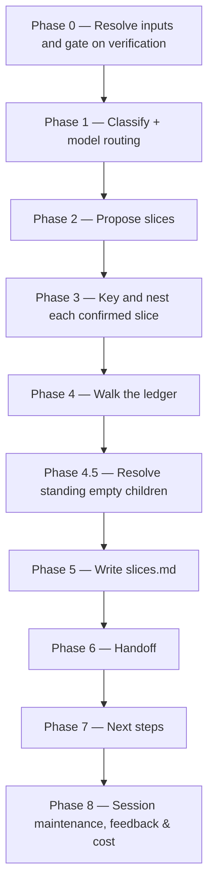

# /brd-split

Gates on every grounding finding carrying a verifier verdict, proposes candidate slices from the
grounded picture, keys and nests a child BRD folder per confirmed slice with its own
`brd-link.md`, an inventory of the rows it inherits, and an unallocated coverage ledger of its
own, then walks every unallocated coverage-ledger row one at a time through five
resolutions until none remain `unallocated`, and writes `slices.md` with the rationale for each
slice and each deferral. Run on a **slice** it allocates but does not slice: the proposal and
child-creation phases are skipped and the walk offers four resolutions instead of five.

## Who runs it

`/brd-split` runs in the [pm](../roles-and-phases.md#pm--product-management) role,
cost-attribution phase `brd-to-prd` — the phase shared by every command of the BRD-to-PRD route. It
is the third command of that route, after [`/brd-intake`](brd-intake.md) and
[`/brd-ground`](brd-ground.md) and before [`/brd-interview`](brd-interview.md); it is not the last
one.

## Synopsis

```
/brd-split <BRD-KEY>
```

- **`<BRD-KEY>`** (mandatory) — the BRD to split and allocate. A key at either of the two levels a
  BRD folder can occupy works, and the level decides the run mode (below). Resolved via
  `resolve-brd`; format-validated only, never checked against a tracker.

## Two modes

Phase 0 step 5 reads the resolved folder's `brd-link.md` and sets the mode from its `parent:` field
— the only reliable signal, since a key's segment count is a naming convention rather than a depth
declaration.

| | `split_mode: full` | `split_mode: allocate-only` |
|---|---|---|
| Applies to | a BRD that owns its source document | a **slice** (`parent:` present) |
| Phase 2 — propose slices | runs | skipped |
| Phase 3 — key and nest children | runs | skipped — this is the child creation the one-level cap forbids |
| Phase 4 — walk the ledger | runs, **five** resolutions | runs, **four** — no `covered-by` |
| Phase 4.5 — resolve standing empty children | runs | skipped — a slice has no children |
| `rejected: [DEF#n]` resolves in | this BRD's own defect log | the **parent's** log, one hop ([`brd-format.md`](../../references/brd-format.md) §4) |
| Phase 7 — next steps | ground each new child | **the route does not end here** — [`/brd-interview`](brd-interview.md) on this slice, Recommended; *Stop here* is the other option, not the only one |
| Announced? | no — the ordinary case | yes, `BRD_SPLIT_ON_SLICE`, a **notice, not a stop**, at Phase 0 and again in the final report |

`covered-by` is unavailable on a slice because it names a child BRD that builds the row and no child
can exist below a slice — so the disposition has nothing it could name
([`coverage-ledger-format.md`](../../references/coverage-ledger-format.md) §3). The walk states that
reason before its first row rather than presenting a shorter list without explanation. **The cap is
on nesting, not on allocation**: a slice whose rows could never leave `unallocated` could never
become PRD-eligible (§5), which is the deadlock the coverage ledger exists to prevent.

## How it runs



A BRD whose ledger has no `unallocated` row when Phase 0 reads it is a no-op **only if it also
holds no child standing empty** — a two-part test taken in Phase 0's last step, in both run modes: the run then skips straight from Phase 0 to Phase 6, which reports
nothing to commit. Holding one, it is not a no-op — Phase 0 skips the walk it has no rows for and
runs Phase 4.5 alone, which is what keeps a child kept empty by an earlier run reachable by the one
command that can remove it. Deciding the no-op on the ledger alone made that child unreachable in
every run after the one that created it. `impl-maintenance` runs in
Phase 8 for session lessons-learned; no other subagent is dispatched — every finding this command
reads was already independently verified by `/brd-ground`'s own agents.

## What it needs

- **`<BRD-KEY>`** — mandatory; absent or malformed stops the run with `BRD_SPLIT_NEEDS_KEY`.
- **An existing BRD folder.** No folder for `<BRD-KEY>` — searched at `specifications/` and the
  one level below it — stops the run with `BRD_SPLIT_NOT_FOUND`. That stop names both ways a folder
  comes to exist rather than asserting one: `/brd-intake` for a BRD with a source document of its
  own, `/brd-split` on the parent for a slice. With no folder there is no `brd-link.md` to say
  which of the two the key was meant to be, and a key's segment count is a naming convention, not a
  depth declaration.
- **Nothing more, at either level.** A key that resolves to a **slice** does not stop the run; it
  sets `allocate-only` (see "Two modes" above) and emits the `BRD_SPLIT_ON_SLICE` notice. What the
  one-level cap forbids is creating a child *below* a slice
  ([`brd-addressing.md`](../../references/brd-addressing.md) §3): a grandchild would inherit
  `brd/source/` and a defect log from a parent that holds neither, so its inventory header would
  name a path that does not exist.
- **`/brd-ground`'s findings already merged to the specs repo's default branch.** Phase 0 gates
  `grounding/code-grounding.md` on `origin/<default>` via `require-on-main` before reading
  anything else — an open, unmerged grounding pull request stops the run naming the branch/PR
  state, and a BRD that has never been grounded at all stops naming the fix — but which fix depends
  on why no findings exist. With at least one `[BR#n]` row in the inventory, grounding simply has
  not run: `BRD_SPLIT_NEEDS_GROUNDING`, naming `/brd-ground`. With **no** row, there is nothing to
  ground and `/brd-ground` would stop on the same emptiness, so naming it would be a loop:
  `BRD_SPLIT_EMPTY_INVENTORY` instead, naming the upstream fix by run mode — `/brd-intake` over the
  same folder with a corrected source in `full` mode, `/brd-split` on the parent in `allocate-only`.
  This transitively also proves `/brd-intake`'s ledger reached main, since `/brd-ground` gates on it
  the same way before it will run.
- **Every finding verified.** A finding with no recorded verifier outcome (`agree` / `extend` /
  `contradict` / `unprovable`) is not evidence this command may act on. Any such finding on file
  stops the run with `BRD_SPLIT_UNVERIFIED: N findings have no verifier verdict — run
  /dev-workflows:brd-ground first.`
- **`$SPECS_PATH`** (required) — if unset, the run stops naming `SPECS_PATH`.

## What it produces

Under `$SPECS_PATH/specifications/<BRD-KEY>-<slug>/`:

- `coverage-ledger.md` — updated so no row remains `unallocated`: each row now reads
  `covered-here`, `covered-by: <CHILD-KEY>`, `deferred-to: <this BRD>`, `rejected: [DEF#n]`, or
  `superseded-by: [BR#n]`.
- `slices.md` — one block per confirmed slice (its key, its folder, and its buildable / blocked /
  depends-on rationale) plus one block per row deferred this run.
In `allocate-only` mode the run writes exactly the first two of the following; Phase 3 never runs,
so no child folder is created.

- One nested folder per confirmed slice still claiming at least one row after the walk
  (`split_mode: full` only),
  `<BRD-KEY>-<slug>/<CHILD-KEY>-<child-slug>/`, each holding three files: `brd-link.md` naming its
  parent and its claimed `[BR#n]` rows; `brd/brd-inventory.md`, the claimed rows copied verbatim
  from this BRD's inventory under a header naming the parent's `brd/source/`, which every
  `source_anchor` in it still resolves against
  ([`brd-format.md`](../../references/brd-format.md) §2.1); and its own `coverage-ledger.md` with
  every row `unallocated`. Those last two are what let the child re-enter the route: `/brd-ground`
  gates on the child's ledger and reads the child's inventory, and `/brd-intake` — the only other
  command that writes either — never runs on a slice, which has no document to intake. Those rows
  are then allocated by `/brd-split` run on the child itself, in `allocate-only` mode, which is what
  makes the child PRD-eligible. The same requirement carries a fate at both levels, saying two
  different things: `covered-by: <CHILD-KEY>` here records **which** BRD owns it, and the child's own
  row records **what that BRD decided to do with it**
  ([`coverage-ledger-format.md`](../../references/coverage-ledger-format.md) §3). A slice whose
  every row ends up resolved elsewhere is either removed or kept empty with a recorded reason
  (Phase 4.5).

Behind Phase 6's consent choice, these are committed, pushed, and a pull request opened against
the specs repo's default branch under the shared `brd/<BRD-KEY>-<slug>` branch prefix — skipped
with a "nothing to commit" report on the no-op path.

## Gates

- **Phase 0 — grounding merged to main.** `require-on-main` against `grounding/code-grounding.md`
  runs before anything else is read — an unmerged grounding pull request, or a BRD never grounded
  at all, stops the run rather than acting on a deliverable that might still change underneath it.
- **Phase 0 — verification gate.** No slice is proposed and no row may be resolved `covered-here`
  against a claim no one has verified: every grounding finding on file must carry a verifier
  outcome before this command does anything else.
- **Phase 4 — the allocation walk.** The command cannot complete while any coverage-ledger row is
  `unallocated`. Every remaining row is presented one at a time via `AskUserQuestion`, through
  exactly five resolutions in `split_mode: full` — build here (`covered-here`), assign to a named
  child (`covered-by`), defer to this BRD (`deferred-to`), reject citing a `[DEF#n]`, or mark
  superseded by another `[BR#n]` — and the same four without `covered-by` in `allocate-only`. `covered-here` is the resolution that makes the whole BRD PRD-eligible, and
  it is what an unsplit BRD reaches for every row — without it, a BRD nobody splits could never
  clear this gate.
- **Phase 4.5 — no child left standing while claiming nothing** (`split_mode: full` only). The set is
  **every** child standing now, not only the ones this run created: a slice whose every proposed row
  ended the walk resolved elsewhere, and any child an earlier run left empty. A child with no
  recorded reason is offered removal (recommended); one already carrying a reason is offered keeping
  it (recommended), removing it now, or updating the reason — so a deliberate decision is not
  re-litigated, and removal stays reachable. The phase never gives a child rows: `covered-by` is
  Phase 4's, and only against a row still `unallocated`.
- **No-op on a fully-allocated ledger, with one exception.** Re-running `/brd-split` once every row
  already has a disposition changes nothing **unless** a child is standing empty, in which case
  Phase 4.5 still runs. Otherwise the run reports the ledger line and stops.

## Example

Split a synthetic customer BRD once its grounding pull request has merged:

```
/dev-workflows:brd-split EPIC-008
```

The run resolves the BRD, confirms every finding carries a verifier verdict, proposes candidate
slices from the buildable / blocked / depends-on picture grounding produced, keys and nests a
folder per confirmed slice, walks every remaining ledger row to one of the five resolutions,
writes `slices.md`, and offers to branch, commit, push, and open a pull request. Its next-step offer
names two different keys: [`/brd-interview`](brd-interview.md) on the BRD just allocated — the route
continues past the split — and [`/brd-ground`](brd-ground.md) on each child the run created, once
this run's deliverables reach the specs repo's default branch — stated in the offer as the `<merge-clause>` placeholder ([`next-phase-offer.md`](../../references/next-phase-offer.md)) resolves it, since a no-op run and a declined handoff open no pull request to wait on.

## See also

- [Roles and phases](../roles-and-phases.md) — what the `pm` role owns and hands off.
- [`brd-addressing.md`](../../references/brd-addressing.md) — the `<BRD-KEY>` grammar and folder
  resolution this command uses by name (`brd-key-valid`, `resolve-brd`), including how a slice
  nests inside its parent and why that nesting — and only the nesting — is capped at one level
  (§3).
- [`coverage-ledger-format.md`](../../references/coverage-ledger-format.md) — the authority for
  the ledger row shape, the six dispositions, the allocation gate this command enforces, and the
  PRD-eligibility rule that makes `covered-here` matter.
- [`grounding-format.md`](../../references/grounding-format.md) — §8's four verification outcomes,
  which this command's Phase 0 gate depends on.
- [Agents](../reference/agents.md) — `impl-maintenance`'s full contract.
- [Session cost](../reference/session-cost.md), [Session feedback](../reference/session-feedback.md),
  and [Resume and checkpoints](../reference/resume-and-checkpoints.md) — the terminal Phase 8
  bookkeeping every run emits.
