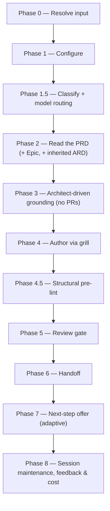

# /create-ard

Grounds on the mounted implementation repos it discovers and authors an Architecture Requirements/Decision Document (ARD) for a Product Requirements Document or one of its Epics, gated by an Opus review.

## Who runs it

`/create-ard` runs in the [pa](../roles-and-phases.md#pa--product-architecture) role, cost-attribution phase [architecture](../roles-and-phases.md#architecture) — an optional phase, since a simple, single-repo PRD may genuinely not need an ARD at all (Phase 0 step 5 offers an "optionality advisory" for exactly that case, and lets the architect proceed anyway).

## Synopsis

```
/create-ard <ADDRESS> [--no-docs]
```

`/create-ard <PRD-KEY>` authors a **PRD-level** ARD. `/create-ard <EPIC-KEY>` authors an **Epic-level** ARD, which inherits the PRD-level ARD read-only and layers its own `[AD#N]` decisions on top (an Epic/area decision wins on conflict — a real contradiction is caught by `ard-reviewer` at authoring time, not left for a downstream consumer to resolve). A bare `<Epic-KEY>` also resolves, auto-finding its parent PRD. `--no-docs` turns off the optional Phase 3 documentation-grounding pass.

- **The BRD route** — detected from the resolved folder's `brd-link.md`, never declared. It authors an ARD into the `PRD-` slice folder [`/brd-split`](brd-split.md) carved, from that folder's `ard-seed.md`. A `BRD-` container is refused with `CREATE_ARD_BRD_NOT_SLICED`: a BRD holds `brd/`, `grounding/`, `coverage-ledger.md` and `slices.md`, and no ARD.

## How it runs



Four `dev-workflows` subagents are dispatched: `docs-grounder` (Phase 3, read-only grounding on the shipped product docs — default ON when `$DOCS_PATH` resolves, advisory, never a gate), `code-scanner` (Phase 3, one instance per confirmed repo, up to 4 concurrent per batch), `ard-reviewer` (Phase 5, Opus-pinned), and `impl-maintenance` (Phase 8, session lessons-learned). The detection-tier agents run at `detection_model` (the §2.1 Sonnet chain); `ard-reviewer` runs at `review_model` (the §2 Opus chain, frontmatter-pinned, no override). The interview and the ARD authoring itself run inline on the session's own `current_model` rather than through a delegated subagent.

## What it needs

- **The PRD on the specs repo's default branch** — gated via `require-on-main` against `specifications/<PRD>-<vslug>/`. An unmerged PRD is a hard stop, naming the branch and any open pull request. An **absent** PRD is not a stop: the run falls back to reading the resolved folder directly through and reports that it did so — `/specify` reports an absent PRD the same way, though it has no fallback to make: it reads the item from the specs tree on every run regardless, and it means `/create-ard` never requires `/create-prd` to have run first.
- **`$SPECS_PATH`** (required) — if unset, the run stops naming `SPECS_PATH` and offers to enter a path or cancel.
- **A prior PRD-level ARD**, when the run is Epic-level — resolved via `../../references/ard-resolution.md`. `status: found` inherits its `[AD#N]` invariants read-only; `status: unmerged` stops, naming the branch and any pull request; `status: none` (the common case for a first ARD) proceeds unchanged.
- **Mounted repos under `$REPOS_PATH`** — `/create-ard`'s repo discovery (Phase 3) is **mandatory**, not opt-in: it always lists top-level directories under `$REPOS_PATH`, proposes a theme-to-repo mapping from the PRD/Epic's capability themes, and asks the architect to confirm, correct, or add to it. [`/idea`](idea.md)'s `--ground-code` runs the same cheap-discovery-then-propose-then-gate mechanism, but only behind that opt-in flag. A theme that maps to no obvious repo is asked about outright. A repo the architect can't mount is neither invented nor silently dropped — it is escalated (`choices: ["Mount now & re-scan", "Ground only the confirmed-mounted set (record the rest as open questions)", "Specify an absolute path for this repo", "Cancel"]`) and, if descoped, recorded as an open question in the ARD rather than disappearing.
- **`$DOCS_PATH`** (optional, default `/workspace/docs`) — documentation grounding, consumed with grill-rank ranking. Missing, unreadable, or carrying no markdown file is a silent, non-blocking skip. Turned off explicitly with `--no-docs`.

`/create-ard` never reads a pull request — there are no PRs yet at architecture time. It authors architecture only; it never writes code.

### The BRD route

With the BRD route the run is seeded by a BRD instead of a PRD, and what it needs changes accordingly:

- **No input outside the specs tree.** No command here reads outside `$SPECS_PATH`, and nothing is consulted — a BRD key names a folder under `$SPECS_PATH`, and handing it to a resolved folder lookup would fail on a key no tracker was ever asked for.
- **No PRD gate.** The PRD is not this route's content source and is read by nothing in the run, so gating it would turn an input this route never had into a prerequisite. What puts the seed on the default branch instead is the [`/brd-*` route](../brd-workflow.md)'s own handoff discipline, where each command lands its deliverable before the next will start.
- **The BRD folder's seed, register and findings** — `ard-seed.md` (the architecture altitude of the router; `prd-seed.md` and `spec-seed.md` belong to [`/create-prd`](create-prd.md) and [`/specify`](specify.md) and are not read), `decisions.md`, and the `[CG#n]`/`[DG#n]` records in `grounding/`. Any of them being absent is reported, never a stop. **A seed file is normally absent**, because nothing on the route writes one: the sole writer is `/brd-intake --sort-existing`, a migration path for a package authored by hand before the route existed. The register and the findings are what this route is really seeded from. A finding carrying no verifier outcome is not evidence: it seeds nothing and is never marked consumed.
- **A `PRD-` slice folder, and never a `BRD-` container.** The route is the slice [`/brd-split`](brd-split.md) carved — the folder carrying `brd-link.md` — because the artifact tree places `ard.md` only inside a PRD folder. A `BRD-` folder stops with `CREATE_ARD_BRD_NOT_SLICED` **on either route**, the moment the address resolves: the BRD route is detected from a `brd-link.md` and a root BRD folder need not carry one, so a route-conditioned refusal would let a container fall through. A legacy unprefixed folder has no prefix to test and is answered by positive evidence instead — `coverage-ledger.md` or `brd/brd-inventory.md` present and no `brd-link.md` naming a `parent:` — so a legacy idea-route PRD folder, which carries neither file, proceeds. The stop names the slices under it, one ARD each, or — where the BRD holds none — [`/brd-split`](brd-split.md) to carve one, with that command's own two conditions stated in the offer: it gates on verified grounding findings, and it is a no-op on a ledger with no `unallocated` row.
- **No coverage-ledger check.** PRD eligibility and the allocation gate govern authoring a *PRD*; an ARD is not that artifact, so this route does not read the ledger — the container refusal above is decided on the folder's kind, not on any row. That is a decision, not an omission — [`/create-prd`](create-prd.md) is where the gate lives.
- **Repo discovery starts from `grounding/baselines.md`** — the repositories `/brd-ground` already pinned — rather than from PRD themes. The architect still confirms, corrects and adds, and an unmounted repo still reaches the mount-or-descope gate.
- **A slice inherits its parent BRD's ARD** read-only, exactly as an Epic-level run inherits its PRD-level one. The parent comes from `brd-link.md`'s `parent:`, never from counting segments in the key — and on this route it is always there, since the container is refused.
- **Decisions are frozen.** The grill fills what the seed leaves unstated and may not reopen a `[VD#n]` or `[CD#n]`; open decisions and open `[AS#n]` assumptions reach the ARD's `## Open questions` under their own ids. Architecture-altitude decisions seed `[AD#N]` — where they pass `ard-format.md`'s hard-to-reverse / surprising / real-trade-off test; where they do not, the run says where the content went instead.

## What it produces

**ard.md** for a PRD-level run, or the Epic folder's **ard.md** (or **ard-\<area\>.md** per area, when a Phase 4 per-area split is chosen for a large Epic spanning separable components) for an Epic-level run — written against `../../references/ard-format.md` into the feature folder (`specifications/<PRD>-<vslug>/` or its `<EPIC>-<eslug>/` subfolder), applying the no-hard-wrap prose convention. Each `### [AD#N]` decision carries a `**Binds:**`, a `**Prevents:**`, and a testable `**Rule:**`. Behind Phase 6's consent choice, the ARD is committed, pushed, and a pull request opened against the specs repo's default branch.

**On the BRD route** the ARD is **ard.md**, written into the resolved `PRD-` slice folder beside the artifacts it was derived from, on a `ard/<SLICE-KEY>-<slug>` branch. Its `prd:`/`epic:` frontmatter carries the same pair the ARD resolver is given — the parent BRD's key with the slice's own as `epic:` — and `derived_from` names the PRD in that folder when there is one, else the `ard-seed.md` the ARD was actually authored from. That run also writes `consumed_by: ARD` onto the architecture-altitude decisions and the verified findings the ARD drew on — the only writes it makes into any BRD file — and commits `decisions.md` and the two `grounding/` files alongside the ARD, since an uncommitted consumption record is one no later run can read. `ard-seed.md` is read but never written: `consumed_by` is a field of a decision or finding *record*, and the seed holds neither, so its consumption is reported at file granularity instead.

**`[AD#N]` decisions bind six downstream commands** once the ARD is merged, each resolving it via `../../references/ard-resolution.md`: `/create-ard` itself (an Epic-level run inheriting its PRD-level ARD), [`/design`](design.md), [`/implement`](implement.md), [`/specify`](specify.md), [`/epics`](epics.md), and [`/ready`](ready.md). An `[AD#N]` `Rule` violated downstream without a recorded "ARD deviation" is a reviewer BLOCKER in whichever of those commands hit it.

## Gates

Phase 5 dispatches `ard-reviewer`, Opus-pinned by frontmatter (`model: opus`, no override), checking grounding integrity (every as-is claim cites a real `file:line`), `[AD#N]` well-formedness, non-contradiction of inherited PRD-level invariants, altitude purity (no per-repo solutions at PRD level), and recorded open questions. `PASS` / `PASS WITH RECOMMENDATIONS` proceeds. `BLOCK` triggers one inline fix cycle — the orchestrator/grill edits the ARD directly; there is no delegated fixer — and one re-review; if still `BLOCK`, each unresolved BLOCKER is escalated individually. Cap: one fix cycle plus one re-review.

Before the review, Phase 4.5 runs a structural pre-lint (`../../references/pre-lint.md`) — advisory only, never blocking — that inline-fixes mechanical issues (a duplicate `[AD#N]`, a stray placeholder) and leaves content gaps for the grill and the author to close.

## Example

Author a PRD-level ARD, grounding on the two repos the PRD's themes point at:

```
/dev-workflows:create-ard PRODUCT-1234
```

The run resolves the PRD from the merged PRD file where present, lists top-level directories under `$REPOS_PATH`, proposes a theme-to-repo mapping and asks you to confirm it, scans the confirmed repos with `code-scanner`, grills you relentlessly through Context, Grounding findings, Architecture decisions, Cross-repo approach, Stack & invariants, Edge cases & risks, and Open questions, runs the structural pre-lint, then `ard-reviewer`. On a passing verdict it offers to branch, commit, push, and open a pull request, then offers the adaptive next step — `/dev-workflows:epics PRODUCT-1234` if the PRD has no Epics yet, or `/dev-workflows:specify PRODUCT-1234` otherwise.

Author the ARD for a reconciled BRD slice instead:

```
/dev-workflows:create-ard EPIC-008-01
```

The run resolves `EPIC-008-01`'s folder one level under `specifications/`, reads `ard-seed.md`, the register and the verified findings, inherits the parent BRD's ARD if one is merged, proposes the repositories `grounding/baselines.md` already pinned, and grills **only the gaps** — every `[VD#n]` and `[CD#n]` the register holds as decided is an input the interview never reopens, because the customer signed it. Its next-step offer names `/dev-workflows:specify EPIC-008-01`; the second option is `/dev-workflows:epics EPIC-008-01` **only where the slice already holds an authored `prd.md`**, and `/dev-workflows:create-prd EPIC-008-01` where it does not. [`/epics`](epics.md) partitions a PRD and refuses a folder that holds none, and this route does not require one — `/create-prd` is not a prerequisite for `/create-ard` on it — so a slice carrying an ARD and no PRD is an ordinary state, not an error.

## See also

- [Roles and phases](../roles-and-phases.md) — what the `pa` role owns, an optional phase in the pipeline.
- [`/create-prd`](create-prd.md) — the upstream command that authors the PRD `/create-ard` reads.
- [`/epics`](epics.md), [`/specify`](specify.md), and [`/design`](design.md) — the downstream commands `/create-ard`'s Phase 7 offers, each of which consults the merged ARD once it lands.
- [`/ready`](ready.md) and [`/implement`](implement.md) — the two remaining consumers of `[AD#N]` invariants via `ard-resolution.md`.
- [Model routing](../reference/model-routing.md) — the classification and Opus fallback chain `ard-reviewer` runs under, plus the tiered hard model gate `/create-ard` applies for `SIGNIFICANT`/`HIGH-RISK` runs.
- [Session cost](../reference/session-cost.md), [Session feedback](../reference/session-feedback.md), and [Resume and checkpoints](../reference/resume-and-checkpoints.md) — the terminal Phase 8 bookkeeping every run emits.
- [`ard-format.md`](../../references/ard-format.md) — the canonical structure the ARD is authored and reviewed against.
- [`ard-resolution.md`](../../references/ard-resolution.md) — how the six downstream commands resolve and inherit `[AD#N]` invariants.
- [The BRD-to-PRD route](../brd-workflow.md) — the `/brd-*` commands that produce the register and findings the BRD route reads, and the customer sign-off that makes those decisions unreopenable here. They produce no `ard-seed.md`: the only writer of a seed file is `/brd-intake --sort-existing`, a migration path, so a reconciled BRD normally holds none and the architecture altitude arrives through the register and the findings.
