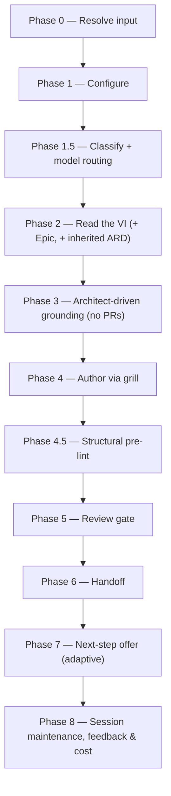

# /create-ard

Grounds on the mounted implementation repos it discovers and authors an Architecture Requirements/Decision Document (ARD) for a Value Increment or one of its Epics, gated by an Opus review.

## Who runs it

`/create-ard` runs in the [pa](../roles-and-phases.md#pa--product-architecture) role, cost-attribution phase [architecture](../roles-and-phases.md#architecture) — the plugin's one optional phase, since a simple, single-repo VI may genuinely not need an ARD at all (Phase 0 step 5 offers an "optionality advisory" for exactly that case, and lets the architect proceed anyway).

## Synopsis

```
/create-ard <VI-KEY> [<Epic-KEY>] [--no-docs]
```

`/create-ard <VI-KEY>` authors a **VI-level** ARD. `/create-ard <VI-KEY> <Epic-KEY>` authors an **Epic-level** ARD, which inherits the VI-level ARD read-only and layers its own `[AD#N]` decisions on top (an Epic/area decision wins on conflict — a real contradiction is caught by `ard-reviewer` at authoring time, not left for a downstream consumer to resolve). A bare `<Epic-KEY>` also resolves, auto-finding its parent VI. `--no-docs` turns off the optional Phase 3 documentation-grounding pass.

## How it runs



Four `dev-workflows` subagents are dispatched: `jira-reader` (Phase 2, only when no authored VI file is present on the specs repo's default branch), `code-scanner` (Phase 3, one instance per confirmed repo, up to 4 concurrent per batch), `ard-reviewer` (Phase 5, Opus-pinned), and `impl-maintenance` (Phase 8, session lessons-learned). The detection-tier agents run at `detection_model` (the §2.1 Sonnet chain); `ard-reviewer` runs at `review_model` (the §2 Opus chain, frontmatter-pinned, no override). The interview and the ARD authoring itself run inline on the session's own `current_model` rather than through a delegated subagent.

## What it needs

- **The VI on the specs repo's default branch** — gated via `require-on-main` against `specifications/<VI>-<vslug>/`. An unmerged VI is a hard stop, naming the branch and any open pull request. An **absent** VI is not a stop: the run falls back to reading the Jira export directly through `jira-reader`, and reports that it did so — this is the same fallback `/specify` uses, and it means `/create-ard` never requires `/create-vi` to have run first.
- **`$SPECS_PATH`** (required) — if unset, the run stops naming `SPECS_PATH` and offers to enter a path or cancel.
- **A prior VI-level ARD**, when the run is Epic-level — resolved via `../../references/ard-resolution.md`. `status: found` inherits its `[AD#N]` invariants read-only; `status: unmerged` stops, naming the branch and any pull request; `status: none` (the common case for a first ARD) proceeds unchanged.
- **Mounted repos under `$REPOS_PATH`** — `/create-ard`'s repo discovery (Phase 3) is **mandatory**, not opt-in: it always lists top-level directories under `$REPOS_PATH`, proposes a theme-to-repo mapping from the VI/Epic's capability themes, and asks the architect to confirm, correct, or add to it. [`/idea`](idea.md)'s `--ground-code` runs the same cheap-discovery-then-propose-then-gate mechanism, but only behind that opt-in flag. A theme that maps to no obvious repo is asked about outright. A repo the architect can't mount is neither invented nor silently dropped — it is escalated (`choices: ["Mount now & re-scan", "Ground only the confirmed-mounted set (record the rest as open questions)", "Specify an absolute path for this repo", "Cancel", "Other… (describe)"]`) and, if descoped, recorded as an open question in the ARD rather than disappearing.
- **`$DOCS_PATH`** (optional, default `/workspace/docs`) — documentation grounding, consumed with grill-rank ranking. Missing, unreadable, or carrying no markdown file is a silent, non-blocking skip. Turned off explicitly with `--no-docs`.

`/create-ard` never reads a pull request — there are no PRs yet at architecture time. It authors architecture only; it never writes code.

## What it produces

`<VI>_ARD.md` for a VI-level run, or `<EPIC>_ARD.md` (or `<EPIC>-<area>_ARD.md` per area, when a Phase 4 per-area split is chosen for a large Epic spanning separable components) for an Epic-level run — written against `../../references/ard-format.md` into the feature folder (`specifications/<VI>-<vslug>/` or its `<EPIC>-<eslug>/` subfolder), applying the no-hard-wrap prose convention. Each `### [AD#N]` decision carries a `**Binds:**`, a `**Prevents:**`, and a testable `**Rule:**`. Behind Phase 6's consent choice, the ARD is committed, pushed, and a pull request opened against the specs repo's default branch.

**`[AD#N]` decisions bind six downstream commands** once the ARD is merged, each resolving it via `../../references/ard-resolution.md`: `/create-ard` itself (an Epic-level run inheriting its VI-level ARD), [`/design`](design.md), [`/implement`](implement.md), [`/specify`](specify.md), [`/epics`](epics.md), and [`/ready`](ready.md). An `[AD#N]` `Rule` violated downstream without a recorded "ARD deviation" is a reviewer BLOCKER in whichever of those commands hit it.

## Gates

Phase 5 dispatches `ard-reviewer`, Opus-pinned by frontmatter (`model: opus`, no override), checking grounding integrity (every as-is claim cites a real `file:line`), `[AD#N]` well-formedness, non-contradiction of inherited VI-level invariants, altitude purity (no per-repo solutions at VI level), and recorded open questions. `PASS` / `PASS WITH RECOMMENDATIONS` proceeds. `BLOCK` triggers one inline fix cycle — the orchestrator/grill edits the ARD directly; there is no delegated fixer — and one re-review; if still `BLOCK`, each unresolved BLOCKER is escalated individually. Cap: one fix cycle plus one re-review.

Before the review, Phase 4.5 runs a structural pre-lint (`../../references/pre-lint.md`) — advisory only, never blocking — that inline-fixes mechanical issues (a duplicate `[AD#N]`, a stray placeholder) and leaves content gaps for the reviewer to catch.

## Example

Author a VI-level ARD, grounding on the two repos the VI's themes point at:

```
/dev-workflows:create-ard PROD-1234
```

The run resolves the VI (from the merged VI file if present, else the Jira export), lists top-level directories under `$REPOS_PATH`, proposes a theme-to-repo mapping and asks you to confirm it, scans the confirmed repos with `code-scanner`, grills you relentlessly through Context, Grounding findings, Architecture decisions, Cross-repo approach, Stack & invariants, Edge cases & risks, and Open questions, runs the structural pre-lint, then `ard-reviewer`. On a passing verdict it offers to branch, commit, push, and open a pull request, then offers the adaptive next step — `/dev-workflows:epics PROD-1234` if the VI has no Epics yet, or `/dev-workflows:specify PROD-1234` otherwise.

## See also

- [Roles and phases](../roles-and-phases.md) — what the `pa` role owns, the one optional phase in the pipeline.
- [`/create-vi`](create-vi.md) — the upstream command that authors the VI `/create-ard` reads.
- [`/epics`](epics.md), [`/specify`](specify.md), and [`/design`](design.md) — the downstream commands `/create-ard`'s Phase 7 offers, each of which consults the merged ARD once it lands.
- [`/ready`](ready.md) and [`/implement`](implement.md) — the two remaining consumers of `[AD#N]` invariants via `ard-resolution.md`.
- [Model routing](../reference/model-routing.md) — the classification and Opus fallback chain `ard-reviewer` runs under, plus the tiered hard model gate `/create-ard` applies for `SIGNIFICANT`/`HIGH-RISK` runs.
- [Session cost](../reference/session-cost.md), [Session feedback](../reference/session-feedback.md), and [Resume and checkpoints](../reference/resume-and-checkpoints.md) — the terminal Phase 8 bookkeeping every run emits.
- [`ard-format.md`](../../references/ard-format.md) — the canonical structure the ARD is authored and reviewed against.
- [`ard-resolution.md`](../../references/ard-resolution.md) — how the six downstream commands resolve and inherit `[AD#N]` invariants.
