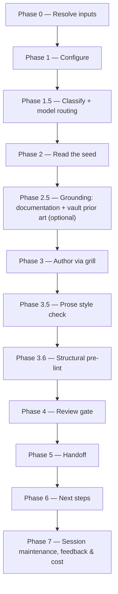

# /create-prd

Turns a refined `idea.md` — or a reconciled BRD's product-altitude seed, with `--from-brd` — plus a key into a high-quality, product-level Product Requirements Document, gated by an Opus review.

## Who runs it

`/create-prd` runs in the [pm](../roles-and-phases.md#pm--product-management) role, cost-attribution phase [prd-creation](../roles-and-phases.md#prd-creation) — the same phase [`/idea`](idea.md) emits, since the PRD it authors has no downstream specification or design yet.

## Synopsis

```
/create-prd <JIRA-KEY|BRD-KEY> [@idea.md] [--from-prd <PRD-KEY|path>] [--from-brd [<dir>]] [--lean|--hybrid|--full] [--no-docs] [--no-prior-art]
```

- **`<JIRA-KEY>`** (mandatory) — the key of an empty Jira workitem the user already created to get the ID. Format-validated only (`^[A-Z][A-Z0-9_]*-\d+$`); zero Jira API means its existence on the tracker is never checked.
- **Under `--from-brd` the same positional token is a BRD key** and is validated against `^[A-Z][A-Z0-9_]*(-\d+)+$` instead — a superset, so every key accepted before is still accepted, and a slice key such as `EPIC-008-01` is too. Shape only, never checked against a tracker.
- **`[@idea.md]`** (optional) — an explicit path to the idea source; see [What it needs](#what-it-needs) for how this differs from the default resolution.
- **`[--from-prd <PRD-KEY|path>]`** (optional) — seed a **new** PRD (still under the positional `<JIRA-KEY>`) with another PRD's structure, read read-only as grounding and adapted, never copied wholesale.
- **`[--from-brd [<dir>]]`** (optional) — a **switch, not a path**: the positional key already identifies the BRD and the folder resolution finds it at either level, so a path is only for a BRD folder outside the normal layout. Seeds the run from that folder's `prd-seed.md` and `decisions.md`. Mutually exclusive with `--from-prd` (two seeds for one PRD stops the run).
- **`[--lean|--hybrid|--full]`** — the profile controlling which adapt-in clusters are available; default `--hybrid`, or `--full` under `--from-brd`. `--full` is required for `[FR#N]` Functional Requirements; `--hybrid`/`--full` for `[UC#N]` Use Cases. An explicit flag always wins over the `--from-brd` default — and when that flag is `--lean` while the BRD's register still holds open decisions or assumptions, the run offers to switch rather than dropping them, because `--lean` is spine-only and has no `## Assumptions & open questions` for them to land in.
- **`[--no-docs]`** / **`[--no-prior-art]`** — each turns off one optional grounding source (Phase 2.5).

## How it runs



Three `dev-workflows` subagents are dispatched: `docs-grounder` (Phase 2.5, read-only grounding on the shipped product docs — default ON when `$DOCS_PATH` resolves, advisory, never a gate), `prd-reviewer` (Phase 4, Opus-pinned), and `impl-maintenance` (Phase 7, session lessons-learned), each against the model recorded in `model_routing`. A fourth agent, `prose-style:prose-style-checker`, runs in Phase 3.5 when the separate `prose-style` plugin is installed — a non-gating quality pass, not part of the dispatch count above because it ships in a different plugin.

## What it needs

- **`<JIRA-KEY>`** — mandatory; absent or malformed stops the run with `CREATE_PRD_NEEDS_KEY`, naming the required `/dev-workflows:create-prd <KEY> @<idea.md>` form.
- **`idea.md`**, resolved by a five-rung ladder that stops at the first hit (Phase 0). **The first two rungs gate differently, and the difference is easy to miss:**
  - **In-contract — `<KEY>`'s own feature folder.** This is the default when no `@path` is given. It is gated via `require-on-main`: absent falls through to the next rung without stopping ([`/idea`](idea.md) is not a prerequisite for `/create-prd`); present and merged onto the specs repo's default branch is used as-is, never relocated again ([`/idea`](idea.md) already did that); present on an unmerged plugin branch is a hard stop, naming the branch and any open pull request.
  - **Out-of-contract — an explicit `@<path>` argument.** Read exactly where it sits — never relocated, never gated via `require-on-main` at all — and reported once as out-of-contract.
  - The remaining rungs (a same-session [`/idea`](idea.md) output, a picker over recently-discovered `idea.md` files under `$VAULT_PATH/Projects`, or a manual path) are all out-of-contract, handled the same way as `@<path>`. If every rung is exhausted, the run proceeds with no idea and grills the PRD from scratch.
- **`$SPECS_PATH`** (required) — if unset, the run stops naming `SPECS_PATH` and offers to enter a path or cancel.
- **An existing PRD for `<KEY>`**, checked by a frontmatter glob in the feature folder. `/create-prd` is greenfield-only: if one is found, the run redirects to [`/dev-workflows:update-prd <KEY>`](update-prd.md) (or, with `--from-prd`, offers to update the existing PRD instead of seeding a fresh one).
- **The `--from-prd` seed** (optional) — resolved Jira-import-first with a 3-day freshness check; used read-only, never as content to copy.
- **Documentation grounding and vault prior art** (optional, on by default) — each turned off with `--no-docs` / `--no-prior-art`; a miss of either is always a silent skip, never a gate.
- **No repos.** `/create-prd` is cwd-agnostic and product-level — it never mounts or scans code.

### The `--from-brd` route

With `--from-brd` the run is seeded by a BRD instead of an idea, and what it needs changes accordingly:

- **A resolved BRD folder.** The positional key resolves it at either level (directly under `specifications/`, or one level deeper for a slice); the folder is never created here, and an unresolvable key stops with `CREATE_PRD_BRD_NOT_FOUND`, which names **both** ways a BRD folder comes into being — [`/brd-intake`](brd-intake.md) for one with a source document of its own, [`/brd-split`](brd-split.md) on the parent for a slice — rather than guessing, because a key's segment count is a naming convention and not a depth declaration. The PRD is written **into that folder**, beside the BRD artifacts.
- **`prd-seed.md` and `decisions.md`** — and only those. `ard-seed.md` and `spec-seed.md` are the architecture and implementation altitudes of the same router and belong to [`/create-ard`](create-ard.md) and [`/specify`](specify.md); reading either here is how a PRD would acquire the implementation detail `../../references/prd-format.md` forbids. Either file being absent is reported, never a stop.
- **No `idea.md`.** The five-rung ladder is skipped entirely — a rung-3 or rung-4 picker would offer an idea from an unrelated initiative. An explicit `@<path>` alongside `--from-brd` is still read, on the out-of-contract terms above, as extra grounding rather than as the seed.
- **A coverage ledger that permits a PRD here.** Two refusals, both read from `coverage-ledger.md`'s written dispositions and never from a reported `ledger:` line (that line is a resolved count and does not track the allocation gate):
  - **`CREATE_PRD_BRD_UNALLOCATED`** — a row of the gate set is still `unallocated`, so the allocation gate was never satisfied. The gate set is the BRD's **own ledger rows** — one per inventory `[BR#n]` on a BRD that owns its source document, which carries no `claims:` field at all; `brd-link.md`'s `claims:` narrows the set only on a slice. It names the rows and points at [`/brd-split`](brd-split.md), which is the command whose walk moves them — and says beside that offer that `/brd-split` itself gates on verified grounding findings, so a BRD that has only been intaken reaches it through [`/brd-ground`](brd-ground.md) first.
  - **`CREATE_PRD_BRD_NOT_ELIGIBLE`** — no row of that same gate set is `covered-here`, so this BRD holds no PRD of its own. The stop says **where the requirements went**, which is not always a list of children: when rows were delegated it names those children and which of them is not actually building the row; when the BRD was never split, or is a slice (where no row of the gate set can be delegated, since every row it claims is one the parent allocated to it), there is no child to name and it reports what each row actually resolved to instead of inventing one — a `deferred-to` row is a live obligation of this BRD, a `rejected` one is an obligation of nobody, and a `superseded-by` one was absorbed by the requirement that replaced it. It offers `/create-prd <CHILD-KEY> --from-brd` only for a child the one-hop resolution shows is really building its row, and in those two cases offers no command at all — re-running [`/brd-split`](brd-split.md) on a fully allocated ledger is a no-op, and nothing in the plugin turns a deferred row into a covered one. A fourth case is an **empty** gate set — a ledger with no row, or a slice claiming nothing — which reports the emptiness rather than a disposition and does name a command, since [`/brd-intake`](brd-intake.md) on a source-owning BRD and [`/brd-split`](brd-split.md) on the parent of a standing empty child are each a real next step there.

## What it produces

`<KEY>_<slug>.md`, written to `$SPECS_PATH/specifications/<KEY>-<slug>/` (the feature folder is auto-created on first write), authored against `../../references/prd-format.md` for the chosen profile. Frontmatter carries the propagated `sources`, `derived_from` (the idea's own path), `seeded_from_prd` (only when `--from-prd` was used), and `jira_key`. **Under `--from-brd` it is written into the BRD folder as `<BRD-KEY>_<slug>.md`** and carries `brd_key`, `brd_parent` (omitted when the BRD owns its source document) and `depends_on` (omitted when empty) instead of `derived_from`, recording the BRD identity and the customer-committed prerequisites on the PRD itself. Its `sources` ref is the customer's own document, resolved by level and never from `brd-link.md` (which carries no `source:` field): the single file under the BRD's `brd/source/`, or — on a slice, which holds none — the path the `source:` header of its `brd/brd-inventory.md` names, relative to the parent's folder ([`brd-format.md`](../../references/brd-format.md) §2.1). **No command consumes those three fields yet** — neither [`/epics`](epics.md) nor [`/ready`](ready.md) reads any of them, and wiring a consumer is separate work; they are written because provenance captured at authoring time is the precondition for any future consumer, which could not re-derive it from a BRD tree that had since moved on. `sources` then names the BRD's own source document. Keeping `brd_key` separate from `jira_key` is what lets the two differ: a three-segment BRD key is not a shape any tracker mints, so the Jira round-trip sets `jira_key` to the key the tracker actually gives the workitem, and [`/epics`](epics.md) — which accepts only a two-segment tracker key — still resolves. On that route `jira_key` is **not** authored with the PRD: it is written by the round-trip, so an absent `jira_key` beside a present `brd_key` says plainly that no tracker identity exists yet, which is what lets the next-step offers withhold the commands that need one instead of naming a key nothing can resolve. That run also writes `consumed_by: PRD` onto the product-altitude decisions the PRD actually took content from — the only write it makes into any BRD file — and commits `decisions.md` alongside the PRD, since an uncommitted consumption record is one no later run can read. `prd-seed.md` is read but never written: `consumed_by` is a field of a decision or finding *record*, and no authority fixes an item shape inside the seed, so its consumption is reported at file granularity instead of stamped. Behind Phase 5's consent choice, the PRD is committed, pushed, and a pull request opened against the specs repo's default branch. The PRD itself is **not yet visible to Jira** until the manual round-trip: paste the body into the Jira workitem (creating it under `--from-brd`, where it may not exist yet), record the key the tracker mints as `jira_key`, then re-import it to `$VAULT_PATH/jira-products/<jira_key>` — without all of it the downstream pipeline cannot read the PRD. The re-import path is built from `jira_key`, never from the key the run was invoked with: on the `/idea` route the two hold the same string, and under `--from-brd` `jira-products/<BRD-KEY>` is a path no importer can create. For the same reason the next-step offers differ by route: under `--from-brd` the PA option is [`/create-ard`](create-ard.md) `<BRD-KEY> --from-brd`, which reads the BRD folder in the specs repo and needs no export, while [`/epics`](epics.md) and [`/release-notes`](release-notes.md) take `jira_key` and are withheld until **both halves** of the round-trip are done — the paste that records a `jira_key`, and the re-import that creates the `jira-products/<jira_key>` export those two actually read. A key with no export behind it resolves to nothing, on this route and on the `/idea` route alike, so a recorded key alone is not enough to offer either.

## Gates

- **Phase 3.5 — Prose style check** (`prose-style:prose-style-checker`, when that plugin is installed). A quality enhancement, not a gate: MAJOR findings are fixed inline and the checker re-runs once; remaining MINOR/NIT findings are only reported. Skipped gracefully, with a note in the final report, when `prose-style` is not installed.
- **Phase 3.6 — Structural pre-lint** (`../../references/pre-lint.md`, run inline, no agent). Advisory only — mechanical findings are fixed inline, content gaps are left for the grill; it never blocks.
- **Phase 4 — `prd-reviewer`**, Opus-pinned by frontmatter (`model: opus`, no override), reviewing the whole PRD against `../../references/prd-format.md`. `PASS` / `PASS WITH RECOMMENDATIONS` proceeds. `BLOCK` triggers one inline fix cycle and one re-review; if still `BLOCK`, each unresolved BLOCKER is escalated per `../../references/escalation-rules.md`'s "Review verdict BLOCK" choices (provide manual fix notes, defer to a follow-up issue, override and accept, or cancel). If no Opus model resolves at all, the run degrades to the best available model and records the degradation rather than hard-blocking.

**Deliberately not captured:** `release_versions`, `change_type`, and `release_notes_category` are Jira-mirror fields — set as Jira dropdowns on the ticket and returned by the importer on the round-trip, never authored here. `prd-reviewer` neither requires nor validates them; [`/release-notes`](release-notes.md) reads two of the three (`change_type` and `release_notes_category`, as `imported_*`) and explicitly never parses `release_versions`; it is what reads them, from the import.

## Example

Author a Product Requirements Document for an already-created empty ticket, from a refined idea:

```
/dev-workflows:create-prd PRODUCT-1234 @idea.md --hybrid
```

The run resolves the feature folder, reads `idea.md` directly (no `idea-reader` — it is the plugin's own format), grounds it against docs and vault prior art, grills you relentlessly through the spine (Problem, Goal, Target audience, User Stories, Acceptance Criteria, Scope, Success Metrics) plus any adapt-in clusters the idea warrants, runs the style check and pre-lint, then `prd-reviewer`. On a passing verdict it offers to branch, commit, push, and open a pull request, and reminds you to paste the PRD into Jira and re-import it.

Author one from a reconciled BRD slice instead — no path, because the key resolves the folder:

```
/dev-workflows:create-prd EPIC-008-01 --from-brd
```

The run resolves `EPIC-008-01`'s folder one level under `specifications/`, checks its coverage ledger permits a PRD here at all, reads `prd-seed.md` and `decisions.md`, defaults to `--full`, and grills **only the gaps** — every `[VD#n]` and `[CD#n]` the register holds as decided is an input the interview never reopens, because the customer signed it. Open decisions and open `[AS#n]` assumptions reach the PRD as open questions under their own ids rather than being quietly settled.

## See also

- [Roles and phases](../roles-and-phases.md) — what the `pm` role owns and hands off at the `prd-creation` seam.
- [`/idea`](idea.md) — the upstream command that authors and relocates the `idea.md` this command consumes.
- [`/update-prd`](update-prd.md) — where an already-existing PRD for `<KEY>` is refreshed instead.
- [`/create-ard`](create-ard.md) and [`/epics`](epics.md) — the two role handoffs `/create-prd`'s Phase 6 offers.
- [Model routing](../reference/model-routing.md) — the classification and Opus fallback chain `prd-reviewer` runs under.
- [Session cost](../reference/session-cost.md), [Session feedback](../reference/session-feedback.md), and [Resume and checkpoints](../reference/resume-and-checkpoints.md) — the terminal Phase 7 bookkeeping every run emits.
- [`prd-format.md`](../../references/prd-format.md) — the canonical structure the PRD is authored and reviewed against.
- [The BRD-to-PRD route](../brd-workflow.md) — the six `/brd-*` commands that produce the `prd-seed.md` and `decisions.md` `--from-brd` reads, and the customer sign-off that makes those decisions unreopenable here.
