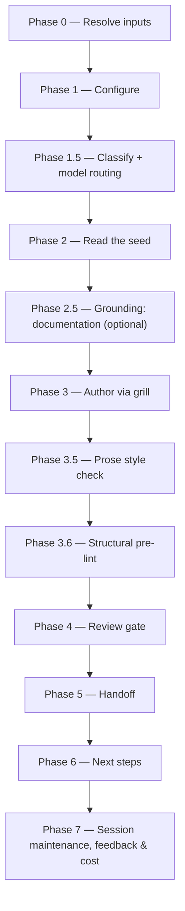

# /create-prd

Turns a refined `idea.md` — or a reconciled BRD's product-altitude seed, on the BRD route — plus a key into a high-quality, product-level Product Requirements Document, gated by an Opus review.

## Who runs it

`/create-prd` runs in the [pm](../roles-and-phases.md#pm--product-management) role, cost-attribution phase [prd-creation](../roles-and-phases.md#prd-creation) — the same phase [`/idea`](idea.md) emits, since the PRD it authors has no downstream specification or design yet.

## Synopsis

```
/create-prd <ADDRESS> [@idea.md] [--from-prd <PRD-KEY|path>] [--lean|--hybrid|--full] [--no-docs]
```

- **`<ADDRESS>`** (mandatory) — a key you choose, or an `@<path>` naming a folder in the specs tree. A key is validated against **the one grammar**, `^[A-Z][A-Z0-9_]*(-\d+)+$` ([`addressing.md`](../reference/references.md) §1), which fixes no depth: `ACME-77` and the slice key `EPIC-008-01` are equally valid. Shape only — nothing is looked up anywhere, because there is no tracker to look it up in.
- **The BRD route uses the same token and the same grammar.** It is detected, not declared: where the address resolves to a folder carrying `brd-link.md`, the run is on the BRD route and says so before doing anything.
- **`[@idea.md]`** (optional) — an explicit path to the idea source; see [What it needs](#what-it-needs) for how this differs from the default resolution.
- **`[--from-prd <PRD-KEY|path>]`** (optional) — seed a **new** PRD (still under the positional `<KEY>`) with another PRD's structure, read read-only as grounding and adapted, never copied wholesale.
- **The BRD route** — detected, never declared: where the resolved folder carries a `brd-link.md`, the run seeds the PRD from that BRD's `prd-seed.md` and `decisions.md`. There is no flag; a flag that could disagree with the folder it names is one more disagreement to have.
- **`[--lean|--hybrid|--full]`** — the profile controlling which adapt-in clusters are available; default `--hybrid`, or `--full` on the BRD route. `--full` is required for `[FR#N]` Functional Requirements; `--hybrid`/`--full` for `[UC#N]` Use Cases. An explicit flag always wins over the BRD route default — and when that flag is `--lean` while the BRD's register still holds open decisions or assumptions, the run offers to switch rather than dropping them, because `--lean` is spine-only and has no `## Assumptions & open questions` for them to land in.
- **`[--no-docs]`** — turns off documentation grounding (Phase 2.5).

## How it runs



Three `dev-workflows` subagents are dispatched: `docs-grounder` (Phase 2.5, read-only grounding on the shipped product docs — default ON when `$DOCS_PATH` resolves, advisory, never a gate), `prd-reviewer` (Phase 4, Opus-pinned), and `impl-maintenance` (Phase 7, session lessons-learned), each against the model recorded in `model_routing`. A fourth agent, `prose-style:prose-style-checker`, runs in Phase 3.5 when the separate `prose-style` plugin is installed — a non-gating quality pass, not part of the dispatch count above because it ships in a different plugin.

## What it needs

- **`<KEY>`** — mandatory; absent or malformed stops the run with `CREATE_PRD_NEEDS_KEY`, naming the required `/dev-workflows:create-prd <KEY> @<idea.md>` form.
- **`idea.md`**, resolved by a five-rung ladder that stops at the first hit (Phase 0). **The first two rungs gate differently, and the difference is easy to miss:**
  - **In-contract — `<KEY>`'s own feature folder.** This is the default when no `@path` is given. It is gated via `require-on-main`: absent falls through to the next rung without stopping ([`/idea`](idea.md) is not a prerequisite for `/create-prd`); present and merged onto the specs repo's default branch is used as-is, never relocated again ([`/idea`](idea.md) already did that); present on an unmerged plugin branch is a hard stop, naming the branch and any open pull request.
  - **Out-of-contract — an explicit `@<path>` argument.** Read exactly where it sits — never relocated, never gated via `require-on-main` at all — and reported once as out-of-contract.
  - The remaining rungs (a same-session [`/idea`](idea.md) output, or a manual path) are all out-of-contract, handled the same way as `@<path>`. If every rung is exhausted, the run proceeds with no idea and grills the PRD from scratch.
- **`$SPECS_PATH`** (required) — if unset, the run stops naming `SPECS_PATH` and offers to enter a path or cancel.
- **An existing PRD for `<KEY>`**, checked by a frontmatter glob in the feature folder. `/create-prd` is greenfield-only: if one is found, the run redirects to [`/dev-workflows:update-prd <KEY>`](update-prd.md) (or, with `--from-prd`, offers to update the existing PRD instead of seeding a fresh one).
- **The `--from-prd` seed** (optional) — resolved from the specs tree; used read-only, never as content to copy.
- **Documentation grounding** (optional, on by default) — turned off with `--no-docs`.
- **A resolved folder that is not a `BRD-` container.** `CREATE_PRD_BRD_NOT_SLICED` fires on a resolved `BRD-` folder **on either route**, the moment the feature folder resolves — before any ledger row is read, and before the prior-PRD check. It is deliberately not part of the BRD gate below: the BRD route is detected from a `brd-link.md`, a root BRD folder need not carry one, and a route-conditioned refusal would let `/create-prd <ROOT-BRD-KEY>` fall through to the idea route and write a PRD into the container. The test is the directory prefix — never the folder's asserted `kind:`, since a slice's `brd-link.md` asserts `kind: brd` while being exactly the folder a PRD belongs in, and never `prd.md`'s own `kind: prd`, since this run is the one about to write it. A folder that resolved through the legacy unprefixed fallback has no prefix to test, so it is answered by **positive evidence that it is a BRD** — it carries `coverage-ledger.md` or `brd/brd-inventory.md`, the two files only [`/brd-intake`](brd-intake.md) and [`/brd-split`](brd-split.md) write, and no `brd-link.md` naming a `parent:`. A legacy **idea-route** PRD folder carries neither file, so the refusal does not fire on it; testing for an *absent* `brd-link.md` instead would refuse it and then offer `/brd-split` on a folder with no coverage ledger to walk. The remedy is a directory listing rather than a ledger read: where the BRD holds slices it names them and offers `/create-prd <SLICE-KEY>` once each; where it holds none it offers [`/brd-split`](brd-split.md), carrying that command's own two conditions in the offer's text — it gates on verified grounding findings, and it is a **no-op** on a ledger with no `unallocated` row, in which case the stop says what the operator does instead ([`/brd-intake`](brd-intake.md) over the same folder rewrites the ledger unallocated; a wholly deferred or rejected ledger owes nobody a PRD and no command changes that).
- **No repos.** `/create-prd` is cwd-agnostic and product-level — it never mounts or scans code.

### The BRD route

With the BRD route the run is seeded by a BRD instead of an idea, and what it needs changes accordingly:

- **A resolved `PRD-` slice folder.** The positional key resolves a folder wherever it sits in the tree; only the slice `/brd-split` carved — the `PRD-` folder carrying `brd-link.md` — is a folder a PRD may be authored in, and the `BRD-` container above it is refused by the route-independent test above. The folder is never created here, and an unresolvable address stops with `CREATE_PRD_BRD_NOT_FOUND`, which names the run that produces a folder this command accepts — [`/brd-split`](brd-split.md) on the parent BRD — and says that a parent BRD, created by [`/brd-intake`](brd-intake.md), must be grounded and split before any slice exists. It never offers the container itself as a target, because the refusal above would then refuse what the remedy produced. The PRD is written **into that folder**, beside the BRD artifacts.
- **`prd-seed.md` and `decisions.md`** — and only those. `ard-seed.md` and `spec-seed.md` are the architecture and implementation altitudes of the same router and belong to [`/create-ard`](create-ard.md) and [`/specify`](specify.md); reading either here is how a PRD would acquire the implementation detail `../../references/prd-format.md` forbids. Either file being absent is reported, never a stop. **A seed file is normally absent**, because nothing on the route writes one: the sole writer is `/brd-intake --sort-existing`, a migration path for a package authored by hand before the route existed. The register is what this route is really seeded from.
- **No `idea.md`.** The five-rung ladder is skipped entirely — a rung-3 or rung-4 picker would offer an idea from an unrelated initiative. An explicit `@<path>` alongside the BRD route is still read, on the out-of-contract terms above, as extra grounding rather than as the seed.
- **A coverage ledger that permits a PRD in this slice.** Two further refusals, **slice-only** now that the container stops one step earlier, both read from `coverage-ledger.md`'s written dispositions and never from a reported `ledger:` line (that line is a resolved count and does not track the allocation gate):
  - **`CREATE_PRD_BRD_UNALLOCATED`** — a row of the gate set is still `unallocated`, so the allocation gate was never satisfied. The gate set is the slice's own ledger rows, narrowed by its `brd-link.md` `claims:`. It names the rows and points at [`/brd-split`](brd-split.md), which is the command whose walk moves them and on a slice runs allocate-only — and says beside that offer that `/brd-split` itself gates on verified grounding findings, so a slice that has only been carved reaches it through [`/brd-ground`](brd-ground.md) first.
  - **`CREATE_PRD_BRD_NOT_ELIGIBLE`** — no row of that same gate set is `covered-here`, so this slice holds no PRD of its own. The delegated case — rows a parent's walk wrote `covered-by` — is now the container refusal's to report, one step earlier, so this stop covers the two shapes a slice reaches. Where the gate set is non-empty it names no sibling and reports what each row actually resolved to instead of inventing one: a `deferred-to` row is a live obligation of this slice, a `rejected` one is an obligation of nobody, and a `superseded-by` one was absorbed by the requirement that replaced it — and it offers no command at all, because re-running [`/brd-split`](brd-split.md) on a fully allocated ledger is a no-op and nothing in the plugin turns a deferred row into a covered one. Where the gate set is **empty** — a slice claiming nothing — it reports the emptiness rather than a disposition and does name a command, since the keep-or-remove [`/brd-split`](brd-split.md) on the parent is a real next step for a standing empty child.

## What it produces

**prd.md**, written to the PRD folder under `$SPECS_PATH/specifications/` (the folder is auto-created on first write), authored against `../../references/prd-format.md` for the chosen profile. Frontmatter carries the propagated `sources`, `derived_from` (the idea's own path), `seeded_from_prd` (only when `--from-prd` was used), and `key`. **On the BRD route it is written into the resolved `PRD-` slice folder as **prd.md**** and carries `brd_key`, `brd_parent` (always present, since the route resolves a slice and a slice always has a `parent:`) and `depends_on` (omitted when empty) instead of `derived_from`, recording the BRD identity and the customer-committed prerequisites on the PRD itself. Its `sources` ref is the customer's own document, and never `brd-link.md` (which carries no `source:` field): a slice holds no `brd/source/` of its own, so the ref is the path the `source:` header of its `brd/brd-inventory.md` names, relative to the parent's folder ([`brd-format.md`](../../references/brd-format.md) §2.1). **No command consumes those three fields yet** — neither [`/epics`](epics.md) nor [`/ready`](ready.md) reads any of them, and wiring a consumer is separate work; they are written because provenance captured at authoring time is the precondition for any future consumer, which could not re-derive it from a BRD tree that had since moved on. `sources` then names the BRD's own source document. `key` is authored on this route too, set to the `<SLICE-KEY>` — the same key that names the folder the PRD is written into. `brd_key` is kept as a separate field because it records *provenance* rather than identity, and there is no second identity to keep straight: one namespace, one grammar, no depth fixed, so [`/epics`](epics.md) resolves a slice key exactly as it resolves a two-segment one. That run also writes `consumed_by: PRD` onto the product-altitude decisions the PRD actually took content from — the only write it makes into any BRD file — and commits `decisions.md` alongside the PRD, since an uncommitted consumption record is one no later run can read. `prd-seed.md` is read but never written: `consumed_by` is a field of a decision or finding *record*, and no authority fixes an item shape inside the seed, so its consumption is reported at file granularity instead of stamped. Behind Phase 5's consent choice, the PRD is committed, pushed, and a pull request opened against the specs repo's default branch. Every downstream command reads it from there — there is nothing to publish it to and nothing to import it back from, which is why the next-step offers below are unconditional.

## Gates

- **Phase 3.5 — Prose style check** (`prose-style:prose-style-checker`, when that plugin is installed). A quality enhancement, not a gate: MAJOR findings are fixed inline and the checker re-runs once; remaining MINOR/NIT findings are only reported. Skipped gracefully, with a note in the final report, when `prose-style` is not installed.
- **Phase 3.6 — Structural pre-lint** (`../../references/pre-lint.md`, run inline, no agent). Advisory only — mechanical findings are fixed inline, content gaps are left for the grill; it never blocks.
- **Phase 4 — `prd-reviewer`**, Opus-pinned by frontmatter (`model: opus`, no override), reviewing the whole PRD against `../../references/prd-format.md`. `PASS` / `PASS WITH RECOMMENDATIONS` proceeds. `BLOCK` triggers one inline fix cycle and one re-review; if still `BLOCK`, each unresolved BLOCKER is escalated per `../../references/escalation-rules.md`'s "Review verdict BLOCK" choices (provide manual fix notes, defer to a follow-up issue, override and accept, or cancel). If no Opus model resolves at all, the run degrades to the best available model and records the degradation rather than hard-blocking.

**Not asked for here:** `release_versions`, `change_type` and `release_notes_category` are authored fields rather than the tracker dropdowns they once were, but the place each is *known* is [`/release-notes`](release-notes.md) — it infers and confirms `change_type` and `release_notes_category` in its own grill, and takes `release_versions` from its `--version` flag or that grill. `/create-prd` writes whichever the operator volunteers and invents none; `prd-reviewer` neither requires nor validates them, since each may legitimately be unknown at authoring time.

## Example

Author a Product Requirements Document for an already-created empty ticket, from a refined idea:

```
/dev-workflows:create-prd PRODUCT-1234 @idea.md --hybrid
```

The run resolves the feature folder, reads `idea.md` directly (no `idea-reader` — it is the plugin's own format), grounds it against the documentation, grills you relentlessly through the spine (Problem, Goal, Target audience, User Stories, Acceptance Criteria, Scope, Success Metrics) plus any adapt-in clusters the idea warrants, runs the style check and pre-lint, then `prd-reviewer`. On a passing verdict it offers to branch, commit, push, and open a pull request.

Author one from a reconciled BRD slice instead — no path, because the key resolves the folder:

```
/dev-workflows:create-prd EPIC-008-01
```

The run resolves `EPIC-008-01`'s `PRD-` slice folder one level under `specifications/`, confirms it is a slice and not the `BRD-` container above it, checks its coverage ledger permits a PRD here at all, reads `prd-seed.md` and `decisions.md`, defaults to `--full`, and grills **only the gaps** — every `[VD#n]` and `[CD#n]` the register holds as decided is an input the interview never reopens, because the customer signed it. Open decisions and open `[AS#n]` assumptions reach the PRD as open questions under their own ids rather than being quietly settled.

## See also

- [Roles and phases](../roles-and-phases.md) — what the `pm` role owns and hands off at the `prd-creation` seam.
- [`/idea`](idea.md) — the upstream command that authors the `idea.md` this command consumes, in the folder this command then resolves.
- [`/update-prd`](update-prd.md) — where an already-existing PRD for `<KEY>` is refreshed instead.
- [`/create-ard`](create-ard.md) and [`/epics`](epics.md) — the two role handoffs `/create-prd`'s Phase 6 offers.
- [Model routing](../reference/model-routing.md) — the classification and Opus fallback chain `prd-reviewer` runs under.
- [Session cost](../reference/session-cost.md), [Session feedback](../reference/session-feedback.md), and [Resume and checkpoints](../reference/resume-and-checkpoints.md) — the terminal Phase 7 bookkeeping every run emits.
- [`prd-format.md`](../../references/prd-format.md) — the canonical structure the PRD is authored and reviewed against.
- [The BRD-to-PRD route](../brd-workflow.md) — the six `/brd-*` commands that produce the `decisions.md` the BRD route reads, and the customer sign-off that makes those decisions unreopenable here. They produce no `prd-seed.md`: the only writer of a seed file is `/brd-intake --sort-existing`, a migration path, so a reconciled BRD normally holds none and the register is the whole of what the BRD route is seeded from.
