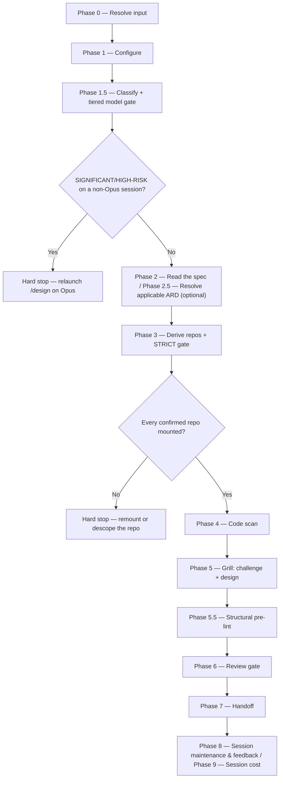

# /design

Takes over a merged specification from the specs repo's main branch, grounds strictly in the fully-mounted implementation code, and authors a reviewed engineering `design.md` through a relentless grill that challenges the spec and designs the implementation.

## Who runs it

`/design` runs in the [dev](../roles-and-phases.md#dev--build-verify-and-deliver) role, cost-attribution phase [planning](../roles-and-phases.md#planning) — being in this phase means an engineering `design.md` is being authored from a merged specification, grounded strictly in the mounted code.

## Synopsis

```
/design <PRD-KEY | dir> [<Epic-KEY>] [--design-twice]
```

`/design` is **address-required** — a plain prompt with no positional address stops with `DESIGN_NEEDS_KEY`. Resolution supplies the address and nothing else: the requirements source of truth is the merged `specification.md` in the specs repo.

**The Epic is the unit of work — one `design.md` per invocation, no fan-out.** When `focus_key` is already set, that Epic is the scope. When it is `null`, `/design` inspects the resolved PRD directory in the specs repo itself: a flat `specification.md` there (a stand-alone Epic, or a broad PRD-level spec) means one design at that level; Epic subfolders are enumerated by which ones already carry a `specification.md` merged to main, and rendered as a progress-aware picker — ○ not started (a specification exists but no design and no in-progress session), ◐ in progress (a design session exists but no `design.md` yet, selectable as a resume), ● done (`design.md` exists, shown greyed, offering *revise* instead of a fresh run). Exactly one spec'd Epic auto-selects with no picker. `--design-twice` forces the Phase 5 interface fan-out even when no contested-interface signal fired — the run says which interface it forced it on, and skips the offer described below entirely.

## How it runs

`/design` has 13 `## Phase` headings. The diagram below picks out the two decision nodes worth knowing before you run the command — the Opus-tier session requirement and the strict repo-mount gate. They are not the run's only stopping conditions: the `require-on-main` specification gate and an `unmerged` ARD both stop it too, and both are described under `## What it needs`.



Four subagents are dispatched along this path: `code-scanner` (Phase 4, one instance per confirmed repo, batched up to 4 concurrent), `interface-designer` (Phase 5, three parallel takes, only when the fan-out runs), `design-reviewer` (Phase 6, the Opus review gate), and `impl-maintenance` (Phase 8, session lessons-learned). `code-scanner`, `interface-designer`, and `impl-maintenance` all run at the caller's `detection_model` — the Sonnet chain — never on a fixed pin; `design-reviewer` keeps its frontmatter Opus pin regardless of classification. The grill and the `design.md`/`specification.md` authoring itself run **inline** on the session's own `current_model`, not through a delegated subagent — which is exactly why the Phase 1.5 tiered gate exists: unlike `design-reviewer`, there is no subagent this run can fall back on to get Opus judgment if the session itself isn't running on one.

Phase 5 conducts the design as a relentless, one-question-at-a-time interview running two intertwined tracks: it **challenges the spec** — recording every substantive challenge back onto `specification.md` under a new `## Engineering review` section, raising acceptance-criteria or test-case changes as proposals rather than unilateral rewrites — and it **designs the implementation**, authoring each `design.md` section as the interview settles it. When the interview reaches an interface decision that is *contested* — two or more plausible adapters for the same seam, an interface spanning a process or network boundary, three or more callers sharing the shape, or two or more candidate shapes already recorded in the design session with none eliminated (`../../references/design-format.md` `## Seams`) — it offers a three-take `interface-designer` fan-out: one take per constraint (minimise the interface, maximise flexibility, optimise for the most common caller), dispatched in parallel and compared on named axes — depth, locality, seam placement — rather than impressions. `--design-twice` forces this same fan-out and skips the offer, because a user who typed the flag has already given the answer the offer would ask for. **Declining the offer costs nothing:** the interview simply continues, and `design.md`'s unconditional `### Alternatives considered` requirement is satisfied by hand, exactly as it would have been anyway.

## What it needs

- **`$SPECS_PATH`** — must resolve; `/design` reads `specification.md` from there and writes `design.md` back into the same feature folder. If unset, the run stops and asks for a path.
- **A PRD or Epic**, via the shared front-end — a direct prompt is rejected outright (`DESIGN_NEEDS_KEY`); `/design` has no non-tracker behaviour.
- **The merged `specification.md` itself**, gated on the specs repo's main branch. **This is the one gated input in the pipeline that genuinely stops on absence** (`../../references/phase-handoff.md` §3): every other producer's optional input falls back to prior behavior when absent and reports it, but here no specification anywhere is a hard stop — `no specification.md exists yet for this item — run /dev-workflows:specify for it and merge it to the specs repo main first.` An *unmerged* spec (an open pull request, not yet on main) also stops, naming the branch and any PR — the same stop every other gated input applies.
- **An optional ARD** (Phase 2.5) — `status: none` skips silently; `status: unmerged` stops, naming the branch/PR; `status: found` carries its invariants into the grill, and a necessary deviation is recorded as an `## ARD deviations` section plus an open question, never edited into the ARD itself.
- **Every implementation repo the design must span**, mounted under `$REPOS_PATH` — Phase 3's **STRICT** gate. Unlike `/specify`'s soft repo gate, which proceeds without a repo it cannot resolve, `/design` hard-stops on any confirmed repo that isn't mounted: it must see all implementation repos to design against them, so the developer either remounts and re-scans, or explicitly removes the repo from scope.
- **An Opus-tier session for `SIGNIFICANT`/`HIGH-RISK` work** — Phase 1.5's tiered model gate. Because the grill and the `design.md` authoring both run inline rather than through a delegated subagent, a risky classification on a non-Opus session is a **hard** gate: the run stops and requires relaunching on Opus (resumable from `_design-session.md`), with an explicit, logged override to proceed anyway. `SIMPLE`/`MODERATE` work on a non-Opus session gets only a soft advisory. See [Model routing](../reference/model-routing.md) for the full fallback chain and why this differs from `/specify` and `/create-prd`, which degrade to the best available model instead of stopping.

## What it produces

`design.md` (flat, alongside `specification.md`), authored against `../../references/design-format.md`; the amended `specification.md` (its new `## Engineering review` section and open-question edits); `_design-session.md` (the interview record, including every live interface candidate as it arose, not only the settled one); and `_design-glossary.md` (ambiguous terms captured during the grill). Phase 7 refuses to write a handoff while `design.md` still carries any unresolved open question — the decision-completeness gate.

Behind a consent choice, Phase 7 hands the feature folder off via `handoff-to-main`: a branch (`design/<EPIC>-<eslug>` for a per-Epic or stand-alone-Epic design, `design/<PRD>-<vslug>` for a broad PRD-level design), commit, push, and an opened pull request to main. Merged-to-main is what `/implement` gates on next. For a per-Epic design selected from a multi-Epic PRD's picker, Phase 7 additionally offers "Next Epic" once the write/commit completes — re-opening the picker minus the just-completed Epic (now showing done) and looping back through Phases 2–7 for the next selection; this does not apply to a stand-alone Epic, a single-Epic PRD, or a broad PRD-level design.

## Gates

Phase 6 dispatches `design-reviewer` (Opus, frontmatter-pinned) against `design.md`, `specification.md`, the classification, and any ARD invariants. **Any unresolved open question in `design.md` is a BLOCKER by policy** — this is the gate a `/design` run actually hits, since the interview is required to resolve every open question to zero before Phase 6, pushing a genuinely undecidable one onto the spec instead. On `BLOCK`, the orchestrator/grill fixes the BLOCKER findings inline (no delegated writer) and re-reviews once; `MAJOR` / `MINOR` / `NIT` findings — those surfaced under a `PASS WITH RECOMMENDATIONS` verdict — are deferred to the final report. Cap: one fix cycle plus one re-review — an unresolved BLOCKER after that is escalated individually rather than looped on. See [Model routing](../reference/model-routing.md) for the Opus fallback chain `design-reviewer` resolves against.

Ahead of the review, Phase 5.5 runs a structural pre-lint against the drafted `design.md` — advisory only, and it never blocks: it surfaces findings and inline-fixes the mechanical ones (a stray placeholder token), leaving content gaps for the grill to resolve. The two gates covered under "What it needs" — Phase 1.5's tiered model gate and Phase 3's STRICT repo gate — are the run-stopping ones; Phase 6 is the only gate that can send the run back for a fix cycle rather than stopping it outright.

## Example

Design a per-Epic implementation for an Epic whose specification is already merged:

```
/dev-workflows:design PRODUCT-1234 EPIC-98760
```

The run resolves `EPIC-98760` as the focus Epic within PRD `PRODUCT-1234`, gates its `specification.md` on the specs repo's main branch, resolves any ARD, derives and confirms the implementation repos, hard-stops if any is unmounted, scans the confirmed set, then grills you through challenging the spec and designing the implementation — offering the three-take interface fan-out if a seam turns out contested. Once `design-reviewer` passes, it offers to branch, commit, push, and open a pull request; once that pull request is merged, `/dev-workflows:implement PRODUCT-1234 EPIC-98760` can start.

## See also

- [Roles and phases](../roles-and-phases.md) — what the `dev` role owns, including the one exception where an absent gated input stops the run rather than falling back.
- [`/specify`](specify.md) — the upstream command whose merged `specification.md` `/design` requires before it will start.
- [`/implement`](implement.md) — the downstream command that will not start against this design until its pull request is merged.
- [Model routing](../reference/model-routing.md) — the classification, the Opus fallback chain, and why `/design`'s tiered gate stops rather than degrades.
- [Session cost](../reference/session-cost.md) and [Session feedback](../reference/session-feedback.md) — the terminal Phase 8–9 bookkeeping every run emits.
- [`design-format.md`](../../references/design-format.md) — the canonical structure `design.md` is authored against, including the `## Seams` section's contested-interface signals.
- [`ard-resolution.md`](../../references/ard-resolution.md) — how the optional ARD is resolved and inherited.
