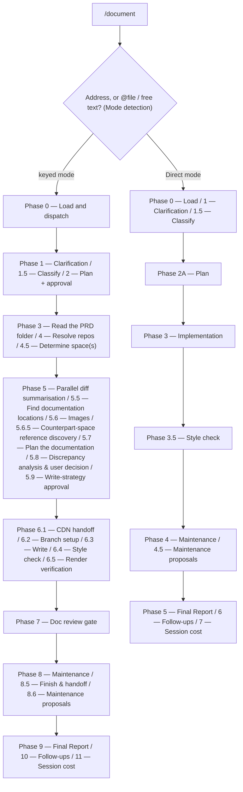

# /document

Writes or updates product documentation — either a full keyed feature-documentation run, or a small one-shot doc edit.

## Who runs it

`/document` runs in the [dev](../roles-and-phases.md#dev--build-verify-and-deliver) role, cost-attribution phase [documenting](../roles-and-phases.md#documenting) — being in this phase means product documentation is being written or updated for a shipped feature. Both of its modes emit the same fixed `phase: documenting, role: dev` pair to the cost report; unlike [`/release-notes`](release-notes.md), which infers its phase from whether engineering artifacts exist yet, `/document` never has to infer anything — a documentation run is dev-phase work regardless of which mode wrote it.

## Synopsis

```
/document <PRODUCT-NNNN>
/document <@file | free-text doc-edit description>
```

**A reader needs to know which mode a run is in before anything else on this page applies.** `/document` selects between two structurally different pipelines from the first argument token, and everything below — inputs, outputs, and gates — differs by mode:

- **Keyed mode (Mode A)** — the first token is a single positional address: a `<KEY>` matching [`addressing.md`](../../references/addressing.md) §1's grammar, or an `@<path>` naming a folder in the specs tree. The resolved folder supplies the PRD and the specs this run documents from.
- **Direct mode (Mode B)** — everything else: a leading `@file` token, free-text prose, or a directory outside the specs tree. This is the **one-shot doc-edit** pipeline: apply a described change to existing pages with no address and no PR resolution at all.

Keyed mode takes the address and nothing else. Where each page is written follows from the page itself: Phase 5.5 resolves every write target against the content roots the resolved profile declares, and Phase 6.3 writes each page into the root that owns it. A repo whose profile declares several content roots is handled the same way — a page is edited where it lives, and the per-root lint, build, and dev-server commands are selected from the root that owns it.

For writing child Epic drafts from a PRD, use [`/epics`](epics.md). For release notes, use [`/release-notes`](release-notes.md) — `/document` never writes release-notes or what's-new pages, since those are generated from the tracker by the docs team's own automation. For a change that touches both code and docs, use [`/implement`](implement.md) instead of either mode of this command.

## How it runs

`/document` has **37 `## Phase` headings — more than any other command in the plugin** (`/epics`, the next-largest, has 20). Almost all of that comes from running two pipelines under one name: 26 phases belong to keyed mode, 11 to direct mode, each numbered from its own Phase 0. A 37-node diagram would not be a diagram, it would be the file, so the graph below shows the shape a reader actually navigates — the mode split, then each mode's own phases collapsed into the steps a reader experiences as one decision or one unit of work.



The `MD` fork is the command's own `## Mode detection` section, run once before either pipeline starts. Both branches share one thing ahead of the split: a `specs-preflight` pass against `$SPECS_PATH`, run before dispatch so it covers Mode B as well as Mode A.

Nine `dev-workflows` subagents are dispatched, none shared by both modes except `docs-style-checker`, `doc-fixer`, and `impl-maintenance`. Keyed-mode-only: the folder read (Phase 3, `depth: full`), `diff-summarizer` (Phase 5, up to 4 concurrent per batch), `doc-location-finder` (Phase 5.5), `doc-planner` (Phase 5.7, pinned to the Opus `planning_model` chain), `doc-writer` (Phase 6.3, also Opus-pinned — the sole author of the written pages; the orchestrator prepares its handoff and commits its output, but never writes pages itself), and `doc-reviewer` (Phase 7, Opus-pinned by its own frontmatter). Shared by both modes: `docs-style-checker` (Phase 6.4 in keyed mode, Phase 3.5 in direct mode), `doc-fixer` (invoked from the style-check phase in either mode, plus Phase 7 in keyed mode), and `impl-maintenance` (Phase 8 in keyed mode, Phase 4 in direct mode, alongside three general-purpose maintenance agents in a single dispatch). Direct mode additionally dispatches a read-only general-purpose exploration agent at Phase 2A before drafting its plan — so even the lighter pipeline dispatches well over the two-subagent floor.

## What it needs

**Direct mode** needs the doc-edit description itself — an `@file` or free text — and expects the content to already be in the user's head or the file, not scattered across PRD sections and PR diffs; that's the boundary with keyed mode. It works from whatever `cwd` is: when `cwd` is not a git repository, Phase 0 records all three of direct mode's gates and skips the checklist extraction, rather than stopping the run. Its toolchain preflight is sourced only from the repo's own config signals and documented `Prerequisites` — there is no profile in direct mode, since a profile is a keyed-mode/docs-repo concept.

**keyed mode** needs:
- **A resolved address** — a key or an `@<path>` naming a folder in the specs tree. Keyed mode never gates this PRD on being merged anywhere: nothing in the command calls `require-on-main`, so it reads the PRD folder directly regardless of what specs artifacts exist or where they live.
- **A writable docs repository**, resolved cwd-preferred: the git root of `cwd` when it carries a docs signal (a `*:build`/`*:lint`/`docs:*` script, a `.docstack/`/`mkdocs.yml`/`antora.yml`/`.vale.ini`/`DOCUMENTATION-GUIDELINES.md` file, or any `_snippets/` directory), else the `$DOCS_PATH` hint (default `/workspace/docs`), else a docs repo discovered under `$REPOS_PATH` by signal (an in-repo profile, or a docs signal — never by repository name), else an explicit ask. A resolved path that fails `test -w` stops the run with `REPO_NOT_WRITEABLE`.
- **A docs-profile** — loaded in-repo, from the built-in default (which applies only to a repo shaped like the bundled worked example), or generated on demand by an inline `/docs-profile` run for any other repo that has none; a custom repo whose profiling run is cancelled stops with `PROFILE_REQUIRED`.
- **Additive `specs`** (optional, from `$SPECS_PATH` or a passed directory) — never gated; an empty list proceeds without prompting. When present, it feeds Phase 5.8's three-way PRD/spec/code discrepancy check instead of the plain PRD/code two-way one.
- **Mounted repos under `$REPOS_PATH`**, matched to each in-scope PR by its `git remote get-url origin` slug. A slug with zero matches is never silently dropped — it is escalated once, in a single consolidated gate covering every missing repo in the run, not one prompt per slug.

## What it produces

**Direct mode** produces edits to the target file(s) in `cwd`, left **uncommitted** — the user manages git manually for a doc edit, and this mode creates no branch and no commit, ever. It always runs its four Phase 4 maintenance agents (documentation, knowledge base, instructions, `impl-maintenance`) and, on any accepted proposal, applies it uncommitted alongside the doc edit. It ends with a Phase 5 report; there is no next-step recommendation printed, since a one-shot edit has no PRD to hand off.

**keyed mode** produces one or more product-doc pages, written by `doc-writer` into the resolved docs repo at the confirmed write targets. When the write context is `docs_repo` (or a `non_docs_repo` the user confirmed), Phase 6.2 creates a feature branch before writing, the orchestrator commits `doc-writer`'s output, and Phase 8.5 squashes the run into clean history and offers a push plus pull request; for `obsidian` or `plain_dir` contexts nothing is ever branched or committed there. When Phase 5.8 records a `document-as-spec`, `skip-and-report`, or qualifying `document-as-code` decision, a `<KEY>-implementation-gaps.md` bug-report draft is also written to the ticket's vault project folder. The run ends with a Phase 9 Final Report (PRD folder summary, repos analysed, PRs in scope, output files, branch, the verification-gates table, render verification, review verdict and triage, the four maintenance summaries, screenshots staged for manual upload, implementation gaps, deferred items) followed by Phase 10 follow-ups and Phase 11 session cost.

Independent of either mode's own writes, the terminal `commit-artifacts` step commits only `$SPECS_PATH`'s bounded session-artifact paths — never the docs write target, which is always a separate repository.

## Gates

**`docs-style-checker` is mandatory in both modes** and dispatched unconditionally — the orchestrator never skips it on its own judgement of which linters are installed. It runs the repo's primary linter (Vale or equivalent) and, when the `prose-style` plugin is installed, `prose-style-checker` as a complementary semantic pass, merging both finding sets; violations go to `doc-fixer`.

Every gate's outcome is recorded in a run-scoped `gate_ledger` with six possible outcomes — `RAN`, `DEGRADED`, `FAILED`, `UNAVAILABLE`, `SKIPPED_BY_USER`, `NOT_APPLICABLE` — and no outcome is orchestrator-assignable to mean "I decided this wasn't necessary": `UNAVAILABLE` must be converted to one of the other five before the run proceeds, `SKIPPED_BY_USER` must carry the user's decision verbatim, and `NOT_APPLICABLE` must name the unmet precondition. **Every gate in the registry appends its row when that gate completes; a missing row, an unconverted `UNAVAILABLE`, or an unattributed skip is a `doc-reviewer` BLOCKER.** keyed mode's registry has seven gate ids:

| Gate | Precondition |
|---|---|
| `toolchain_preflight` | always (after profile resolution) |
| `source_truth_verification` | ≥1 entry in `code_repos` |
| `style_check` | ≥1 file written |
| `repo_checklist` | the repo publishes authoring/verification guidance |
| `build_check` | write context is a buildable repo |
| `render_smoke_check` | buildable repo with ≥1 affected page |
| `image_review` | ≥1 candidate image, to add or possibly stale |

**Direct mode registers exactly three of those seven** — `toolchain_preflight`, `repo_checklist`, and `style_check` — and the other four never appear at all, not even as `NOT_APPLICABLE`: direct mode has no Phase 5.8, no Phase 5.6, and no Phase 6.5 to produce them.

**Keyed mode alone gates on `doc-reviewer`** (Phase 7, Opus-pinned by its own frontmatter). Its findings are triaged by the orchestrator — each verified at the location it names, dismissals recorded with a reason — before `doc-fixer` ever sees them ([`finding-triage.md`](../../references/finding-triage.md)); `BLOCK` invokes `doc-fixer` for BLOCKER/MAJOR findings and one re-review, capped at one fix cycle plus one re-review. **Direct mode has no `doc-reviewer` gate at all, and therefore no BLOCKER fix cycle, no re-review, and no finding triage in this mode** — a style-linter violation is a deterministic match with nothing to trace, so there is nothing for a triage step to adjudicate. Because nothing downstream would catch a coverage gap, an `UNAVAILABLE` `style_check` row in direct mode is surfaced directly to the user as the gate-ledger §5 conversion prompt — the only place the gap appears, since there is no reviewer to raise it as a BLOCKER instead. Direct mode also runs none of [`/implement`](implement.md)'s code-oriented verification machinery: no `test-baseliner` captures a test baseline, no `test-writer` writes tests, and no `code-review` gate runs at all — direct mode edits prose, not code, so there is nothing for any of the three to do.

Keyed mode also runs a Phase 5.8 **discrepancy analysis** whenever the PRD narrative, the (optional) spec, and the code disagree — an analysis table is presented and the user decides per claim or in one batch which phrasing to document; nothing is ever auto-resolved. It makes zero direct API calls for PR resolution: GitHub may use the `gh` CLI (which wraps the API), Bitbucket is pure local `git`, and every resolution runs against clones under `$REPOS_PATH` matched by `git remote get-url origin` slug. And its branch policy classifies the **resolved `docs_repo_path`**, not `cwd` — Phase 6.2 branches only when that classification lands on `docs_repo` or a user-confirmed `non_docs_repo`.

## Example

Document a shipped PRD once every Epic under it is implemented (keyed mode):

```
/dev-workflows:document PRODUCT-1234
```

The run resolves the docs repo and profile, asks for output path / PR filter / screenshot intent, classifies (typically `SIGNIFICANT`), reads the PRD folder, resolves the PR repos, determines the applicable space(s), summarises the diffs in parallel, locates write targets, reviews images, plans the documentation, resolves any PRD/spec/code discrepancy, writes the pages via `doc-writer`, runs the style check and render verification, gates on `doc-reviewer`, and closes with the four maintenance agents plus the Final Report — recommending `/dev-workflows:release-notes <PRD>` next, once every Epic is documented.

A same-session typo fix on an unrelated page runs direct mode instead — `/dev-workflows:document @note.md` or a free-text description — which skips address and PR resolution entirely, explores the target file and its neighbours, plans, edits, runs the mandatory style check, and ends with a report; no branch, no commit, and no reviewer gate.

## See also

- [Roles and phases](../roles-and-phases.md) — what the `dev` role owns, including why both of this command's modes emit the same fixed `documenting`/`dev` cost attribution.
- [`/implement`](implement.md) — the command to use instead for a change that touches both code and docs.
- [`/epics`](epics.md) — writes child Epic drafts from a PRD; a different output from either mode of this command.
- [`/release-notes`](release-notes.md) — the recommended next step once a PRD is fully documented, and the sibling command whose own phase/role IS inferred rather than fixed.
- [Model routing](../reference/model-routing.md) — the classification rules, and the `doc-planner` / `doc-writer` / `doc-reviewer` Opus pins used in keyed runs only.
- [Session cost](../reference/session-cost.md), [Session feedback](../reference/session-feedback.md), and [Follow-ups](../reference/follow-ups.md) — the terminal bookkeeping both modes emit, at Phase 9–11 in keyed mode and Phase 5–7 in direct mode.
- [`finding-triage.md`](../../references/finding-triage.md) — the triage step run between `doc-reviewer` and `doc-fixer` in keyed runs only.
- [`gate-ledger.md`](../../references/gate-ledger.md) — the six verification-gate outcomes, the full per-mode gate registry, and the reviewer-BLOCKER rule for a missing or unconverted row.
- [`source-truth.md`](../../references/source-truth.md) — the PRD-vs-spec-vs-code discrepancy-escalation protocol Phase 5.8 runs.
- [`repo-verification-gates.md`](../../references/repo-verification-gates.md) — how a docs repo's own pre-PR checklist is extracted into the `repo_checklist` gate.
