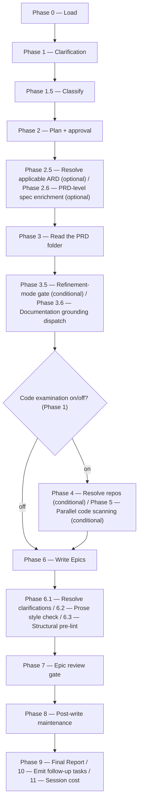

# /epics

Reads a Product Requirements Document from the resolved folder in the specs tree, optionally scans code repos, and drafts reviewed child Epic definitions.

## Who runs it

`/epics` runs in the [pe](../roles-and-phases.md#pe--product-engineering) role, cost-attribution phase [epic-refinement](../roles-and-phases.md#epic-refinement) — being in this phase means a PRD is being broken down into child Epic drafts.

## Synopsis

```
/epics <ADDRESS> [--no-docs]
```

The positional input is a **single address** — a `<KEY>`, or an `@<path>` naming a folder in the specs tree — resolved by [`addressing.md`](../../references/addressing.md) §3.

**`/epics` accepts exactly two shapes and refuses everything else.** A `PRD-` folder partitions into new Epics; an `EPIC-` folder **that has a PRD above it** re-refines that Epic. A **stand-alone `EPIC-` folder** — one with no PRD above it — is refused (`EPICS_EPIC_NOT_UNDER_PRD`), and so is a **`BRD-` container** (`EPICS_BRD_NOT_SLICED`, taken on the directory prefix before any read, naming the `PRD-` slices under it, one set of Epics each). Where the folder resolved through the legacy unprefixed fallback and carries no prefix to read, the same refusal is taken on positive evidence that the folder is a BRD — it carries `coverage-ledger.md` or `brd/brd-inventory.md` and no `brd-link.md` naming a `parent:` — the one rule `/create-prd`, `/create-ard` and `/specify` share, stated in [`coverage-ledger-format.md`](../reference/references.md) §5.1. A legacy **idea-route** PRD folder carries neither file, so the refusal does not fire on it. **Epics come from a PRD only**, and `/epics` is the only command in the plugin that creates an `EPIC-` folder — [`/create-ard`](create-ard.md) and [`/specify`](specify.md) both stop on an absent one rather than minting it.

**The gate is `prd.md`'s own `kind: prd`, never the folder's asserted `kind:`.** A `PRD-` slice folder carved by [`/brd-split`](brd-split.md) asserts `kind: brd` in its `brd-link.md`, so a gate on the asserted kind would refuse every slice and accept nothing. [`/create-prd`](create-prd.md) cannot take this test — it is the run that writes `prd.md` — but `/epics` can, because by the time it runs the PRD exists. The Epic side is the same test one level down: `epic.md`'s own `kind: epic`. Neither reads a directory name, so a legacy unprefixed folder is classified exactly as a prefixed one is. A `PRD-` folder in which no PRD has been authored yet is refused too (`EPICS_NO_PRD`). That stop names [`/create-prd`](create-prd.md) **only where that command can run**: it refuses three shapes, not one, and on a BRD-route slice the two data refusals on the slice's own ledger are tested first — a row still `unallocated` names [`/brd-split`](brd-split.md) on the slice instead, a slice claiming nothing names `/brd-split` on the parent, and a fully-allocated slice with no `covered-here` row names **no command at all**, because `/create-prd`'s own branch for that state names none either. An idea-route PRD folder has no ledger and takes `/create-prd <KEY>` directly.

## How it runs

`/epics` has 20 `## Phase` headings — the second-most in the plugin, after `/document`'s 37. The diagram below collapses adjacent phases that form one user-visible step, and shows the one real fork that changes which phases run at all: whether code examination is on.



Six `dev-workflows` subagents are dispatched: `docs-grounder` (Phase 3.6, read-only grounding on the shipped product docs — default ON when `$DOCS_PATH` resolves, advisory, never a gate), `code-scanner` (Phase 5, one instance per confirmed repo, up to 4 concurrent, only when code scan is ON), `epic-writer` (Phase 6, the sole author of the Epic drafts), `doc-fixer` (Phases 6.2 and 7, fixing style violations and surviving BLOCKER/MAJOR review findings), `epic-reviewer` (Phase 7, Opus-pinned), and `impl-maintenance` (Phase 8, session lessons-learned). The detection-tier agents (and `epic-writer` when the run is `MODERATE`) run at `detection_model`; `epic-reviewer` keeps its frontmatter Opus pin.

## What it needs

- **A PRD folder, or an Epic folder under one** — a `mode: direct` prompt is rejected outright (`EPICS_NEEDS_KEY`), and so are the two shapes above: a stand-alone `EPIC-` folder and a `BRD-` container. An `EPIC-` address sets `focus_key` (Phase 0 step 1b) and switches the run to `mode: refine`, with `prd_dir` resolved to the Epic folder's parent; a `PRD-` address leaves `focus_key` null and drafts the full partition.
- **An optional PRD-level `specification.md`** — this is `/epics`' `require-on-main`-gated input (Phase 2.6, `commands/epics.md:180`); the PRD-level ARD below is gated too, via `../../references/ard-resolution.md`, which resolves `status: unmerged` through `require-on-main` as well. **Absent** is a silent skip (`vi_spec_present: false`) — the common case, since `/specify` usually runs per-Epic *after* `/epics` — with no prompt and no extra output. **Unmerged** is a hard stop, naming the branch and any open pull request: a spec that exists but hasn't landed on the default branch is weaker grounding than the one about to arrive, and Epics drafted against it would need redoing.
- **An optional PRD-level ARD** (Phase 2.5), resolved via `../../references/ard-resolution.md` with `epic: null` (Epics don't exist yet). `status: none` skips silently and proceeds exactly as before; `status: unmerged` stops, naming the branch and any pull request; `status: found` carries its `[AD#N]` invariants into both `epic-writer` and `epic-reviewer`.
- **`$DOCS_PATH`** (optional, default `/workspace/docs`) — resolved in Phase 2, **before** the Phase 2.5/2.6 ARD and spec gates, a deliberate ordering exception to the usual gate-first sequencing: it is the run's only consent-bearing step (an index build or a capped refresh), so it must resolve before any of the run's real work, rather than risk a later phase stopping after that consent work already happened. Missing, unreadable, or empty is a silent, non-blocking skip. Turned off with `--no-docs`.
- **Mounted repos under `$REPOS_PATH`** — only consulted when code examination is ON (default). The repo list is auto-derived from sibling/parent Epics' `implementation.md` records, or entered manually. A repo that resolves to zero matches is escalated, never silently dropped; an entirely empty resolved list still lets the run proceed without a code scan if the user chooses.

## What it produces

One `EPIC-<PRD-KEY>-NN-<eslug>/` folder per new or refined Epic under the resolved PRD folder, each holding `epic.md`. The key is minted as the next unused two-digit segment, proposed and overridable, validated and re-prompted rather than coerced. `_coverage.md` is PRD-holistic and lands beside `prd.md`, never inside an Epic folder.

**`/epics` never creates a branch.** Its git writes are confined to `$SPECS_PATH`, and only to its bounded session-artifact paths — the Epic drafts themselves are never committed by this command at all; git hygiene of the write target is the user's own responsibility. This is unlike the fourteen commands that do offer a branch + commit + push + pull-request handoff for their own deliverable — [`/idea`](idea.md), [`/create-prd`](create-prd.md), [`/update-prd`](update-prd.md), [`/create-ard`](create-ard.md), [`/specify`](specify.md), [`/design`](design.md), [`/implement`](implement.md), [`/ready`](ready.md), and the six commands of the BRD-to-PRD route.

## Gates

Phase 7 dispatches `epic-reviewer`, Opus-pinned, checking goal clarity, acceptance-criteria testability, scope boundaries, and non-duplication with existing Epics under the parent PRD. Findings are triaged by the orchestrator (`../../references/finding-triage.md`) before `doc-fixer` ever sees them — each finding verified at the location it names, every dismissal recorded with a reason, survivors only handed to the fixer. `BLOCK` invokes `doc-fixer` for BLOCKER/MAJOR findings and re-reviews once, passing the fixer's own report back as `claims_file` so the re-review falsifies the fixer's account rather than assuming it; an unresolved BLOCKER after that cycle is escalated individually. `PASS WITH RECOMMENDATIONS` fixes MAJOR findings only; `PASS` proceeds. Cap: one fix cycle plus one re-review.

Ahead of the review, Phase 6.2 runs `prose-style-checker` as the **primary** style checker — not a fallback, since Epic definitions are specs-tree content with no repo-side prose linter to fall back from. It is skipped gracefully, with a note in the final report, when the separate `prose-style` plugin is not installed. Phase 6.3 then runs a structural pre-lint (`../../references/pre-lint.md`) — advisory only, checking required headings, Given/When/Then acceptance criteria, and the `[NEEDS CLARIFICATION]` cap.

## Example

Split a PRD with two existing Epics not yet covering all its scope:

```
/dev-workflows:epics PRODUCT-1234
```

The run resolves the PRD, asks for the output directory and whether to scan code (default on, repos auto-derived from sibling Epics' PR links), resolves any PRD-level ARD and specification, reads the PRD folder at `prd-plus-epics` depth, scans the confirmed repos in batches of up to 4, delegates the drafting to `epic-writer`, runs the Prose style check and structural pre-lint, then `epic-reviewer`. On a passing verdict it reports the Epics written and `_coverage.md`'s gap list, and recommends `/dev-workflows:specify <EPIC>` per drafted Epic as the next step — one address, the Epic's own — Epic drafting itself was never committed, so publishing the Epics to a tracker remains a manual step.

## See also

- [Roles and phases](../roles-and-phases.md) — what the `pe` role owns, including `/epics`' Phase 2.6 gate, which always targets the PRD dir's `specification.md` rather than a nested per-Epic one, since Epics don't exist yet when `/epics` runs.
- [`/create-prd`](create-prd.md) and [`/create-ard`](create-ard.md) — the upstream commands whose PRD and (optional) ARD `/epics` reads.
- [`/specify`](specify.md) — the downstream command normally run once per drafted Epic; a PRD with 0 Epics that reaches `/specify` first is itself offered a link back to `/epics`, but nothing gates the order.
- [Model routing](../reference/model-routing.md) — the classification rules and the `epic-reviewer` Opus pin.
- [Session cost](../reference/session-cost.md), [Session feedback](../reference/session-feedback.md), and [Follow-ups](../reference/follow-ups.md) — the terminal Phase 9–11 bookkeeping every run emits.
- [`ard-resolution.md`](../../references/ard-resolution.md) — how the optional PRD-level ARD is resolved and inherited.
- [`finding-triage.md`](../../references/finding-triage.md) — the triage step run between `epic-reviewer` and `doc-fixer`.
