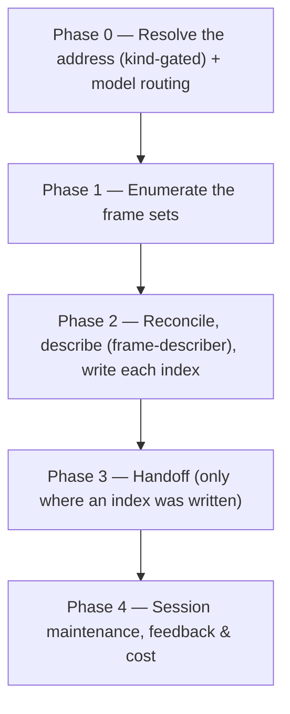

# /frames

(Re)builds the frame-set index of one resolved folder — for every `design/<frame-set>/` subdirectory it holds, it lists the images, reads the index already there, describes the frames no row accounts for, and writes the index.

## Who runs it

Anyone who put frames in the specs tree, at any point in the pipeline. `design/` is a reserved subdirectory of **any** folder under `specifications/` — a BRD folder, a PRD folder, or an Epic folder alike — so `/frames` resolves all three ([`addressing.md`](../../references/addressing.md) §3, with no kind narrowing). [Workflow overview](../workflow.md#cross-cutting-commands) groups it under the anytime commands: it advances no phase and belongs to no role's step.

It emits a session-cost entry all the same, with `phase`/`role` inferred from the resolved folder's own `kind` — a BRD folder's frame set is [`brd-to-prd`](../roles-and-phases.md#brd-to-prd)/`pm` spend, a PRD or Epic folder's is [`prd-creation`](../roles-and-phases.md#prd-creation)/`pm`. Describing forty frames is real work, and a run that measured nothing would not be free — its spend would roll into whatever command ran next.

## Why it exists

[`grounding-format.md`](../../references/grounding-format.md) §6.1 makes a frame set's index **mandatory and its absence unrecoverable**: `design-grounder` returns `NO_INDEX` rather than reading a set without one, because a filename is not a reliable statement of what a frame shows.

That is strict on purpose, and it left the obvious workflow with no way out. A human exports the frames of a screen flow, drops the folder into `design/`, and has a set the plugin refuses to read — recoverable only by hand-authoring an index. [`/idea`](idea.md) writes one for the images it vendors, and nothing else did. `/frames` is the repair.

## Synopsis

```
/frames <KEY>|@<path>
```

One address, resolved with the same resolver every keyed command uses: a key, or `@<path>` to the folder or to a file inside it. No kind is passed, because `design/` is reserved at every level.

## How it runs



## What it needs

- **A folder that already exists, of one of the three kinds.** This command indexes; it creates no folder and refuses an address that resolves to none. An ambiguous key is a hard stop naming every match, and an address that resolves to something other than a BRD, PRD or Epic folder is refused by name — pointing `@<path>` at a frame *inside* a set resolves to the set, not to the folder that holds it, so the refusal says which folder to pass instead.
- **One address, and no flags.** `/frames` defines none; a second address or a `--flag` is a stop rather than a silent discard, because a discarded second address is a folder you believe was indexed and was not.
- **An address is mandatory.** Absent or malformed, the run stops before anything is read.
- **`$SPECS_PATH`** — the specs-preflight step at Phase 0 settles the branch before anything is written; silent when the repo is already clean and on its default branch.
- **Nothing else.** No PRD, no BRD, no code repo, no docs repo, and no Opus.

## What it produces

One `index.md` per frame set, in the format [`grounding-format.md`](../../references/grounding-format.md) §6.2 fixes — the same format and the same reconciliation contract [`/idea`](idea.md) Phase 4.5 follows, so two writers never leave one directory holding an index neither would have written. The index is rebuilt from the set **as it stands on disk**: every existing row whose image is still there is preserved verbatim, a row is appended for each frame this run described, a row whose image is gone is dropped and reported, and a frame the run could not account for gets `_no description on record_` and is reported.

Descriptions come from the `frame-describer` agent, which looks at the frames and returns one plain-language description each — an agent whose whole tool list is `Read`, `Glob`, `Grep`, so it cannot write the index it describes into. The command hands the frames to it rather than opening them itself, so every description in an index is one that something which actually saw the frame produced, and "transcribed, never inferred" is a rule about copying rather than a hope about restraint.

The indexes are deliverables, so they reach the default branch through the [phase handoff](../../references/phase-handoff.md) — each named as one literal path, behind the usual consent choice. Declining leaves them written and on no ref; they still work locally, because a grounding run reads a frame set from the working tree.

## The cap

**Forty frames described per run**, counted across every set the run touches. [`/idea`](idea.md) caps at six because reading a mockup is incidental to writing a brief; this command is invoked *to* index, so six would make it useless on the first real export it met.

**What counts as a frame** is the extension set [`grounding-format.md`](../../references/grounding-format.md) §6.2 fixes — `.png`, `.jpg`, `.jpeg`, `.gif`, `.svg`, `.webp`. One vocabulary, shared with [`/idea`](idea.md), because two writers of one index listing by two different sets would each drop the other's rows as frames that had gone missing. Anything else in the directory is not a frame, gets no row, and is named once in the report so it is visibly not indexed rather than invisibly absent.

**Where nothing is written, nothing is created.** A folder with no `design/`, a `design/` holding no subdirectory, and a frame set holding no frames are all clean outcomes reported as such — no directory is created, no index is written, and no handoff is offered, because there would be nothing to open a pull request for. Images dropped *directly* into `design/` rather than into a set are called out with the fix: a set is a subdirectory of `design/`.

**An index under another name** — a manifest, a captions file, a README enumerating the frames — is reported and left byte-for-byte alone. This command did not author that file's shape and will not edit it, so it writes its own `index.md` beside it and the report names both. `index.md` is the name every writer of this format writes.

When the cap bites, every remaining frame still gets a row — `_no description on record_`, with `cap` as its reason — and the index is still **valid and complete**, because it is written once after every row is resolved. The run says how many frames it left, and a re-run describes the next forty: a row carrying that placeholder holds no description to preserve, so the next writer that can obtain one fills it. A hundred-frame set converges in three runs and is readable after the first.

## Gates

No reviewer, and nothing to review — an index states what a directory holds. The checkpoints are the specs-repo git guards (`specs-preflight` at the start, `commit-artifacts` at the end, [`specs-repo-git.md`](../../references/specs-repo-git.md)) and the handoff's own consent choice. Nothing in the run is fatal: a frame that will not open, a set that could not be described, an index that could not be written — each is recorded and the run moves to the next set.

## What it is not

**Indexing makes frames readable; grounding makes them `[DG#n]` findings.** `/frames` dispatches no `design-grounder`, produces no finding, cites no requirement, and never reaches `grounding-verifier`. Design grounding on the `/idea` route remains deliberately unbuilt — §6.1 says so, and this command keeps it true. The one command that grounds a frame set is [`/brd-ground`](brd-ground.md), on the BRD route.

It is also not `/design-index`, deliberately. [`/design`](design.md) is the engineering-design workflow, and a name adjacent to it would send an operator who wanted an index into the wrong command. *Frame set* and *frame* are §6.1's own vocabulary.

## Example

```
/dev-workflows:frames ACME-77
```

Resolves `PRD-ACME-77-<slug>/`, finds `design/checkout-flow/` holding eleven PNGs and no index, describes all eleven, and writes `design/checkout-flow/index.md` with eleven rows — then offers to open a pull request for that one file.

## See also

- [`grounding-format.md`](../../references/grounding-format.md) — §6.1 reserves `design/` and makes each set's index mandatory; §6.2 is the index format and the reconciliation contract both writers execute.
- [`/idea`](idea.md) — the other writer: it indexes the images it vendors into `design/idea-sources/`, and leaves a `_no description on record_` row for any frame it cannot speak for.
- [`/brd-ground`](brd-ground.md) — the one command that *reads* a frame set as evidence, through `design-grounder`.
- [Agents](../reference/agents.md) — `frame-describer`, the bounded read this command dispatches once per set.
- [`addressing.md`](../../references/addressing.md) — the resolver that turns one address into a folder of any kind.
