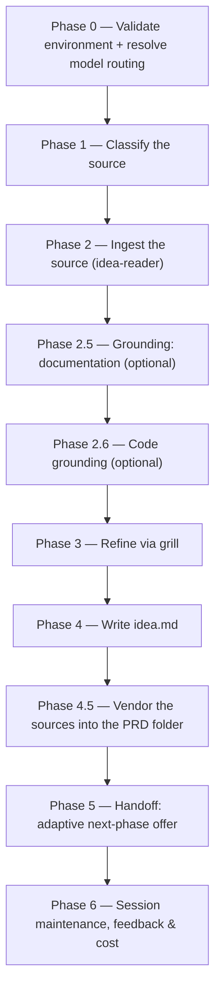

# /idea

Refines one raw source — a prompt, a file, a community post, or a saved file — into a lean `idea.md` brief that seeds [`/create-prd`](create-prd.md).

## Who runs it

`/idea` runs in the [pm](../roles-and-phases.md#pm--product-management) role, cost-attribution phase [prd-creation](../roles-and-phases.md#prd-creation) — the same phase [`/create-prd`](create-prd.md) emits, since at this point in the pipeline no specification or design exists yet for the item being refined.

## Synopsis

```
/idea <PRD-KEY> [<prompt> | @<file>] [--deep] [--ground-code [<repo>,…]] [--no-docs]
```

The single positional argument is classified into one of four source forms (Phase 1), by precedence:

- **An inline prompt** — plain text with no recognised flags stripped from it; the argument text itself becomes the raw idea.
- **A markdown file or `@wikilink`** — an existing `.md` path, including a community post (typically under `Projects/Products/…`, tagged `community-post`) or a previously-written `idea.md` handed back for re-refinement. Its `[[wikilinks]]` are followed **two levels deep**, and the images it links are **read** — see [What it reads](#what-it-reads).
- **A saved community post** — a markdown file the operator downloaded. It is read for its demand signals (upvotes, duplicate reports, the shape of the complaint); nothing fetches a URL.

Three flags: `--deep` switches the grill from bounded (≤10 questions) to relentless (runs to convergence, no cap); `--ground-code` adds an optional code-grounding pass; `--no-docs` turns documentation grounding off.

## How it runs



Four subagents are dispatched along this path: `idea-reader` (Phase 2, ingests the source), `docs-grounder` (Phase 2.5, read-only grounding on the shipped product docs — default ON when `$DOCS_PATH` resolves, advisory, never a gate), `code-scanner` (Phase 2.6, one instance per confirmed repo, only when `--ground-code` is given), and `impl-maintenance` (Phase 6, session lessons-learned). All four run at the caller's `detection_model` — the §2.1 Sonnet chain — never on a fixed pin; the interactive grill and the authoring itself run inline on the session's own `current_model` rather than through a delegated subagent.

## What it reads

When the source is a markdown file, `idea-reader` does not stop at that one file.

- **Wikilinks, two levels deep.** The source's own `[[links]]`, and the links on *those* pages. Depth 3 is never reached.
- **Linked images, read — not just listed.** Every image the source or a followed page links is enumerated; the first six are opened and described in a line or two, so the run knows what a linked mockup actually shows instead of only where it lives.
- **Bounded, and every bound reported.** Twelve files in total across the whole traversal (the source counting as the first) and six images. The same file is never read twice, so a link cycle — A links B, B links back to A — is a silent skip rather than an error or a loop. Whatever the caps left out is named in the final report: each unfollowed link with its reason (`cap` or `depth`), each unopened image with its reason (`cap`, `unreadable`, or `not_an_image`). Nothing is truncated quietly.
- **Nothing here is fatal.** A broken wikilink, a missing image, a file that will not open — each is noted and the run carries on, exactly as a broken wikilink always has.

**What a read image counts as: context, not evidence.** It informs the questions the grill asks and the prose the brief ends up with. It is not a design-grounding finding, needs no index file describing the frames, and gets no verifier pass — a frame is what somebody drew, not what the product does, so nothing seen in one is written into `idea.md` as fact unless you confirm it during the grill. Design grounding proper (`[DG#n]` findings over an exported frame set) belongs to a different route and is not part of `/idea`.

## What it vendors

The specs repo is the system of record, so a brief whose links point at the folder the source happened
to live in is a record only its author can follow. After `idea.md` is written, the run **copies the
sources it actually read into the same PRD folder and rewrites `idea.md`'s links onto the copies**.

- **Text and markdown → `attachments/`.** The source file itself, and every page the wikilink
  traversal followed.
- **Images → `design/idea-sources/`.** Every image the reader opened, together with an `index.md`
  saying what each frame shows — written from the reader's own descriptions, transcribed and never
  invented.
- **Nothing else, ever.** No PDF, no archive, no other binary. A linked file that is neither
  text/markdown nor an image keeps its link exactly as written and is named in the final report.
- **Only what was read.** A link past the twelve-file or six-image cap, a broken link, an image that
  would not open — none of them is copied, each of them is reported, and none of them is fatal.
- **Names never collide silently.** A second file with the same basename becomes `notes_01.md`, a
  third `notes_02.md`, and a suffix is never appended to a suffix. A copy whose content is already
  there byte-for-byte is reused rather than duplicated, so a re-run does not grow the folder.
- **Nothing empty is created.** A run over a bare prompt has nothing to copy and creates neither
  directory.

The copies and the index are handed to the handoff alongside `idea.md`, so they reach the default
branch with it rather than sitting on one machine.

**The index does not mean `/idea` grounds designs.** `design/` is the frame-set directory the
grounding contract reserves, and its index is mandatory there — a frame set without one is refused
outright, so writing the images without it would leave a directory nothing could ever read. Writing an
index makes the frame set readable; it does not make anything read it. No design-grounding finding,
index consultation, or verifier pass exists on this route, and that capability remains deliberately
unbuilt.

## What it needs

- **A PRD key** — the first positional argument, validated for shape and checked against nothing. It names the folder `idea.md` will live in, which is why it is required up front: there is nowhere keyless to write.
- **The idea source itself** — read by `idea-reader`. A key that does not resolve, or a path that does not exist, stops the run and offers to re-enter the source or cancel; this is an environment/user halt, not a plugin gap.
- **`$DOCS_PATH`** (optional, default `/workspace/docs`) — documentation grounding. Missing, unreadable, or carrying no markdown file is a silent, non-blocking skip: `docs grounding: OFF`, never an error. Turned off explicitly with `--no-docs`.
- *(Prior-art discovery over a personal store it searched. Prior art now means a PRD you hand the command yourself, as a path.)*
- **`--ground-code` repo(s)** (optional) — only runs when the flag is given. A named repo that is not mounted is neither invented nor silently dropped — it is escalated and, if declined, carried forward by name with its themes left unverified. With no flag at all, the run instead does one cheap detection pass and prints at most one advisory line naming a repo the idea mentions; it never scans.
- **`$SPECS_PATH`** — not needed to start the run at all, and an unresolvable path is a silent no-op rather than a stop. It is touched twice: `specs-preflight` runs against it at the end of Phase 0 (which can emit a guard notice and set `specs_git: blocked` for the whole run), and it becomes load-bearing from Phase 5 onward, when the `idea.md` already written there is handed off to git.

## What it produces

`idea.md`, authored against `../../references/idea-format.md`, written into `PRD-<KEY>-<slug>/` under `$SPECS_PATH/specifications/` on the first write and never relocated afterwards. [`/create-prd`](create-prd.md) finds it there.

Beside it, where the source had anything to vendor: `attachments/<name>` for each text or markdown
source that was read, `design/idea-sources/<name>` for each image that was opened, and
`design/idea-sources/index.md` naming what each frame shows. See [What it vendors](#what-it-vendors).

**Nothing relocates it, at any point.** The key is a mandatory argument precisely so the brief lands in its final folder on the first write, and [`/create-prd <KEY>`](create-prd.md) finds `idea.md` at that path afterward and never moves it either — an explicit `@<path>` argument to [`/create-prd`](create-prd.md) is a separate, out-of-contract read that is likewise never relocated.

## Gates

`/idea` has no reviewer agent — its bounded grill is the gate. By default the grill asks at most 10 questions across the ranked ambiguity gaps (problem clarity, target users, desired outcome, scope, evidence sufficiency, success signal, terminology) and then stops; any remaining high-impact gaps become `[NEEDS CLARIFICATION]` markers in `idea.md`, capped at 3, with reasonable defaults recorded as Assumptions instead. `--deep` removes the bound and runs the grill to convergence. There is no style check and no structural pre-lint in this command — both first appear in [`/create-prd`](create-prd.md). A `status: draft` `idea.md` (any open `[NEEDS CLARIFICATION]`) is never handed off, regardless of what else the run resolved.

## Example

Refine an inline prompt, grounding it against the mounted frontend repo:

```
/dev-workflows:idea PRODUCT-1234 "Add a dark-mode toggle to the settings page" --ground-code frontend
```

The run validates the key, classifies the argument as a prompt, ingests it via `idea-reader`, grounds it against the documentation when `$DOCS_PATH` resolves, grills it, and writes `idea.md` into the resolved folder. The key is not optional — without it the run stops before Phase 1.

Refine a note that links a mockup and a couple of related pages:

```
/dev-workflows:idea PRODUCT-1234 @notes/dark-mode.md
```

Here the reader walks that note's `[[wikilinks]]` two levels out, opens the images it links, and hands the grill both the prose and what the frames show — then reports anything the twelve-file or six-image cap left behind.

## See also

- [Roles and phases](../roles-and-phases.md) — what the `pm` role owns and hands off at the `prd-creation` seam.
- [`/create-prd`](create-prd.md) — the next phase; finds `idea.md` in the folder `/idea` wrote it into, once `/idea` has handed it off.
- [Model routing](../reference/model-routing.md) — the classification and model-fallback rules `/idea` applies in Phase 0.
- [Session cost](../reference/session-cost.md) and [Session feedback](../reference/session-feedback.md) — the terminal Phase 6 bookkeeping every run emits.
- [`idea-format.md`](../../references/idea-format.md) — the canonical structure `idea.md` is authored against, and the *Vendored sources* rules for `attachments/`, `design/idea-sources/`, the collision suffix, and the link rewriting.
- [`grounding-format.md`](../../references/grounding-format.md) — §6.1 reserves `design/` for exported frame sets and makes each set's index mandatory, which is why `/idea` writes one for the images it vendors.
- [`docs-grounding.md`](../../references/docs-grounding.md) — the documentation-grounding resolution gate and how a grill command consumes its digest.
