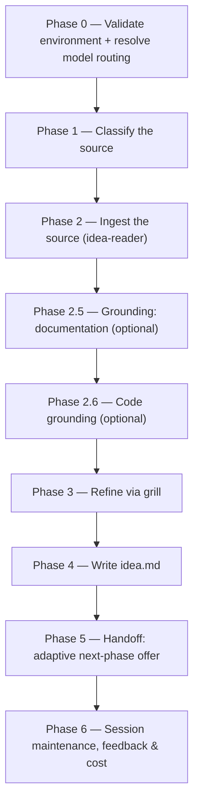

# /idea

Refines one raw source — a prompt, a file, a community post, or a saved file — into a lean `idea.md` brief that seeds [`/create-prd`](create-prd.md).

## Who runs it

`/idea` runs in the [pm](../roles-and-phases.md#pm--product-management) role, cost-attribution phase [prd-creation](../roles-and-phases.md#prd-creation) — the same phase [`/create-prd`](create-prd.md) emits, since at this point in the pipeline no specification or design exists yet for the item being refined.

## Synopsis

```
/idea <PRD-KEY> [<prompt> | @<file>] [--deep] [--ground-code [<repo>,…]] [--no-docs]
```

The single positional argument is classified into one of four source forms (Phase 1), by precedence:

- **An inline prompt** — plain text with no recognised flags stripped from it; the argument text itself becomes the raw idea.
- **A markdown file or `@wikilink`** — an existing `.md` path, including a community post (typically under `Projects/Products/…`, tagged `community-post`) or a previously-written `idea.md` handed back for re-refinement.
- **A saved community post** — a markdown file the operator downloaded. It is read for its demand signals (upvotes, duplicate reports, the shape of the complaint); nothing fetches a URL.

Three flags: `--deep` switches the grill from bounded (≤10 questions) to relentless (runs to convergence, no cap); `--ground-code` adds an optional code-grounding pass; `--no-docs` turns documentation grounding off.

## How it runs



Four subagents are dispatched along this path: `idea-reader` (Phase 2, ingests the source), `docs-grounder` (Phase 2.5, read-only grounding on the shipped product docs — default ON when `$DOCS_PATH` resolves, advisory, never a gate), `code-scanner` (Phase 2.6, one instance per confirmed repo, only when `--ground-code` is given), and `impl-maintenance` (Phase 6, session lessons-learned). All three run at the caller's `detection_model` — the §2.1 Sonnet chain — never on a fixed pin; the interactive grill and the authoring itself run inline on the session's own `current_model` rather than through a delegated subagent.

## What it needs

- **A PRD key** — the first positional argument, validated for shape and checked against nothing. It names the folder `idea.md` will live in, which is why it is required up front: there is nowhere keyless to write.
- **The idea source itself** — read by `idea-reader`. A key that does not resolve, or a path that does not exist, stops the run and offers to re-enter the source or cancel; this is an environment/user halt, not a plugin gap.
- **`$DOCS_PATH`** (optional, default `/workspace/docs`) — documentation grounding. Missing, unreadable, or carrying no markdown file is a silent, non-blocking skip: `docs grounding: OFF`, never an error. Turned off explicitly with `--no-docs`.
- *(Prior-art discovery over a personal store it searched. Prior art now means a PRD you hand the command yourself, as a path.)*
- **`--ground-code` repo(s)** (optional) — only runs when the flag is given. A named repo that is not mounted is neither invented nor silently dropped — it is escalated and, if declined, carried forward by name with its themes left unverified. With no flag at all, the run instead does one cheap detection pass and prints at most one advisory line naming a repo the idea mentions; it never scans.
- **`$SPECS_PATH`** — not needed to start the run at all, and an unresolvable path is a silent no-op rather than a stop. It is touched twice: `specs-preflight` runs against it at the end of Phase 0 (which can emit a guard notice and set `specs_git: blocked` for the whole run), and it becomes load-bearing from Phase 5 onward, when the `idea.md` already written there is handed off to git.

## What it produces

`idea.md`, authored against `../../references/idea-format.md`, written into `PRD-<KEY>-<slug>/` under `$SPECS_PATH/specifications/` on the first write and never relocated afterwards. [`/create-prd`](create-prd.md) finds it there.

**Nothing relocates it, at any point.** The key is a mandatory argument precisely so the brief lands in its final folder on the first write, and [`/create-prd <KEY>`](create-prd.md) finds `idea.md` at that path afterward and never moves it either — an explicit `@<path>` argument to [`/create-prd`](create-prd.md) is a separate, out-of-contract read that is likewise never relocated.

## Gates

`/idea` has no reviewer agent — its bounded grill is the gate. By default the grill asks at most 10 questions across the ranked ambiguity gaps (problem clarity, target users, desired outcome, scope, evidence sufficiency, success signal, terminology) and then stops; any remaining high-impact gaps become `[NEEDS CLARIFICATION]` markers in `idea.md`, capped at 3, with reasonable defaults recorded as Assumptions instead. `--deep` removes the bound and runs the grill to convergence. There is no style check and no structural pre-lint in this command — both first appear in [`/create-prd`](create-prd.md). A `status: draft` `idea.md` (any open `[NEEDS CLARIFICATION]`) is never handed off, regardless of what else the run resolved.

## Example

Refine an inline prompt, grounding it against the mounted frontend repo:

```
/dev-workflows:idea "Add a dark-mode toggle to the settings page" --ground-code frontend
```

The run validates the key, classifies the argument as a prompt, ingests it via `idea-reader`, grounds it against the documentation when `$DOCS_PATH` resolves, grills it, and writes `idea.md` into the resolved folder.

## See also

- [Roles and phases](../roles-and-phases.md) — what the `pm` role owns and hands off at the `prd-creation` seam.
- [`/create-prd`](create-prd.md) — the next phase; finds `idea.md` in the folder `/idea` wrote it into, once `/idea` has handed it off.
- [Model routing](../reference/model-routing.md) — the classification and model-fallback rules `/idea` applies in Phase 0.
- [Session cost](../reference/session-cost.md) and [Session feedback](../reference/session-feedback.md) — the terminal Phase 6 bookkeeping every run emits.
- [`idea-format.md`](../../references/idea-format.md) — the canonical structure `idea.md` is authored against.
- [`docs-grounding.md`](../../references/docs-grounding.md) — the documentation-grounding resolution gate and how a grill command consumes its digest.
