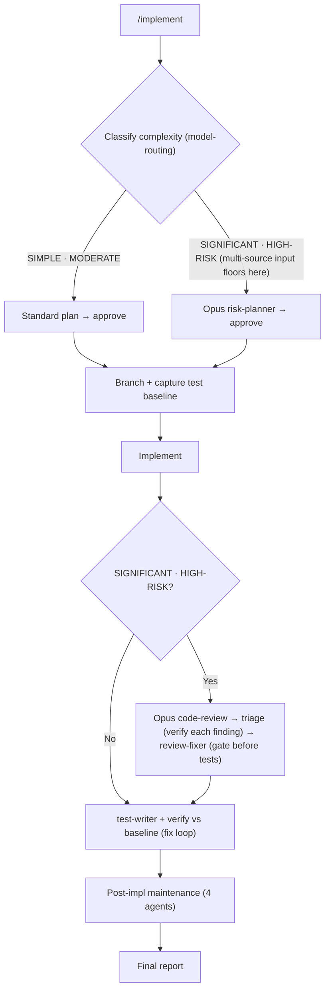

# /implement

Classifies a task's risk, creates a branch, plans and implements the change, writes tests, runs an Opus code review, and performs post-session maintenance.

## Who runs it

`/implement` runs in the [dev](../roles-and-phases.md#dev--build-verify-and-deliver) role, cost-attribution phase [implementation](../roles-and-phases.md#implementation) — being in this phase means code is actually being written, tested, and reviewed.

## Synopsis

```
/implement <ADDRESS> | <prompt> [@file…] [@spec-folder] [@repo…] [--no-commit]
```

`$ARGUMENTS` resolves to one of two modes: **keyed** when a positional address is present — a `<KEY>`, or an `@<path>` naming a folder in the specs tree — and **direct** otherwise (free-text or `@file`). The keyed branch resolves through [`addressing.md`](../../references/addressing.md) §3, the same entry point `/document` uses.

`/implement` implements **one Epic per run**. When the resolved item already names a focus Epic (a bare Epic key — the folder's own `kind` sets the altitude, and no second positional is accepted), that Epic is the scope. When the PRD is bare, a cheap folder read classifies it: a stand-alone Epic proceeds directly; a PRD with exactly one Epic sets that Epic as the scope automatically; a PRD with two or more Epics renders a **progress-aware picker** — each row showing the Epic's own artifacts (`specification.md` but no `design.md` → ○ not started; `design.md` present but no `implementation.md` → ◐ in progress, selectable and where the default cursor lands, since a merged design is exactly what this command wants; `implementation.md` present → ● done, greyed and not default-selectable, and selecting it offers to implement again), plus the explicit choice to implement one broad PRD-level slice instead; a PRD with no Epics offers to split with `/dev-workflows:epics` first, or to implement a broad PRD-level slice. Selecting an Epic scopes that run only — there is no "next Epic" loop, because code-writing is heavy and branchy enough that each run targets one Epic.

## How it runs

`/implement` has 19 `## Phase` headings. Rather than walk every one, the diagram below deliberately names none of them: it compresses the whole run into its two real decision points instead of naming each phase.



`IN` covers Phase 0 through Phase 1.8 — loading and classifying the input, the Phase 0.5 readiness pre-flight, clarification, and, only when the input is multi-source, the Phase 1.6 floor at SIGNIFICANT and the Phase 1.7 fan-out scan it triggers. `BR` covers Pre-Phase 3 (branch creation) and Pre-Phase 3.5 (test-baseline capture) together — the baseline is always captured immediately after branching and before any file is edited, on either path. `RV` is Phase 3B's review-triage-fixer sequence — note that `test-writer` runs *inside* it, at step 4a, before the review diff is captured, so the Opus review sees code and tests together. `TS` is what Phase 3.5 adds after `RV` clears: lint/build, the `test-baseliner` verify against the captured baseline, and the fix loop. `MT` is Phase 4's four maintenance agents. `RP` is the Phase 5 Final Report — folded into it is Phase 4.5 (a silent no-op unless Phase 3B's review escalated spec/design conformance notes onto the source spec/design; otherwise its handoff outcome line appears in the report's own `### Spec/design conformance` section), which runs between Phase 4 and `RP` and is not separately pictured. Two more phases sit in the same gap and are likewise not pictured: Phase 4.6, the code-repo handoff that commits the work and — behind a consent choice — pushes it and opens a pull request, and Phase 4.7, which appends this run's refs to `implementation.md` on a keyed run. Two further terminal phases run after `RP`: Phase 6 (follow-up tasks) and Phase 7 (session cost, plus the terminal artifact commit).

Seven `dev-workflows` subagents are dispatched: `code-scanner` (Phase 1.7, only when the input is multi-source — one `code-scanner` per repo, capped at 4 concurrent, plus a seeded round 2 for any theme round 1 left inconclusive), `risk-planner` (Phase 2B, `SIGNIFICANT`/`HIGH-RISK` only), `test-baseliner` (captured in Pre-Phase 3.5, verified again in Phase 3.5), `test-writer` (Phase 3.5, or step 4a of Phase 3B before the review diff is captured), `code-review` (Phase 3B), `review-fixer` (Phase 3B, only on a `BLOCK` or `PASS WITH RECOMMENDATIONS` verdict), and `impl-maintenance` (Phase 4). All but `risk-planner` and `code-review` run at the caller's `detection_model` — the Sonnet chain; those two keep their frontmatter Opus pin regardless of classification. Phase 4 also dispatches three general-purpose agents (a documentation review, a knowledge-base review, and an instructions review) alongside `impl-maintenance` — all four in a single message, independent of each other.

## What it needs

- **The resolved input itself** — read via the shared front-end (Phase 0). If the primary description is a design doc (`/design`'s output) carrying unresolved open questions, `/implement` refuses to proceed by default — a design must be decision-complete before implementation; overriding is logged in the Final Report. A `specification.md`-level open question is exempt, since the design phase is where those are meant to resolve.
- **Specs, for keyed runs.** When the front-end resolves no `specs` directory at all, `/implement` prompts for one rather than planning blind. Direct-mode runs are exempt — the prompt or spec file supplied is the instruction.
- **Any in-scope `specification.md`/`design.md`, gated on `$SPECS_PATH`'s main** (Phase 0). An *unmerged* one (an open pull request, not yet on main) is a hard stop, naming `$SPECS_PATH` explicitly since `/implement` stands in a code repo, not the specs repo. An **absent** one is not a stop at all — the run behaves exactly as it did before this gate existed, and a direct-prompt run, which resolves no in-scope spec, is unaffected either way. This is the reverse of `/design`'s `specification.md`, which stops on absence (see the [`/design`](design.md) page).
- **The multi-source rule** (Phase 1.6): more than one code repo, or any directory input (a PRD folder or a spec folder), floors classification at `SIGNIFICANT` — overridable at plan approval — and triggers the Phase 1.7 fan-out scan in place of the single Explore subagent. **A referenced directory that is missing, or that is neither a recognized folder type nor a git repo, is always surfaced to the user immediately and never silently skipped** — the run asks whether to continue without it or stop.
- **An optional ARD** (Phase 1.8, keyed runs only) — `status: none` skips; `status: unmerged` stops, naming `$SPECS_PATH` explicitly; `status: found` carries its invariants as implementation guardrails, passed to `code-review` as `applicable_ard` on the `SIGNIFICANT`/`HIGH-RISK` path (guidance only on `SIMPLE`/`MODERATE`, which has no review gate).
- **A clean working tree**, or explicit consent to stash or proceed dirty, before Pre-Phase 3 creates the feature branch — never implemented directly on the default branch.

## What it produces

Code changes on a freshly created feature branch — named per the target repo's own documented convention, or `<prefix>/<key>-<slug>` as the fallback — **committed** in Phase 4.6 without asking, then pushed and opened as a pull request behind a three-option consent choice (push + PR recommended, push only, or neither). The commit subject ends with `[<key>]` and carries a `Work-Item:` trailer where the folder has one, which is what lets `/document` and `/release-notes` find the work later. A run whose review or tests did not clear is committed like any other, and still *offered* for push and pull request under the same consent choice — a failed gate never downgrades what you are offered. What changes is the pull request itself: it is opened as a draft whose body leads with a DO-NOT-MERGE line naming the blocking fact. `--no-commit` skips the phase entirely and leaves everything in the working tree.

Four Phase 4 maintenance outputs, always collected together: a documentation update (or an explicit "no update required"), a knowledge-base entry, an instructions (`CLAUDE.md`) update, and an `impl-maintenance` Lessons Learned report. On a `SIGNIFICANT`/`HIGH-RISK` run with a spec/design in scope, unresolved `missing`/`contradicts` findings from `code-review`'s conformance dimension are escalated as open-question notes written back onto the source `specification.md`/`design.md` (Phase 3B step 7.5) and, behind a consent choice, handed off onto the specs repo's main branch (Phase 4.5) — a silent no-op when nothing was escalated, which covers every `SIMPLE`/`MODERATE` run and every run with no spec/design in scope.

A structured Phase 5 Final Report (classification, branch, files changed, review verdict and triage, spec/design conformance, deferred items, next step); Phase 6 follow-up tasks for any qualifying manual or out-of-scope items; and Phase 7's session-cost entry plus the terminal commit of `$SPECS_PATH`'s bounded session-artifact paths — never the code repo this run just changed.

## Gates

Pre-Phase 3.5 captures a test baseline **before any source file is edited**, on both the `SIMPLE`/`MODERATE` and `SIGNIFICANT`/`HIGH-RISK` paths. On `SIGNIFICANT`/`HIGH-RISK` work, Phase 3B's Opus `code-review` runs **before** tests, never after — the plugin's invariant is that tests never run on risky work until the review returns a non-`BLOCK` verdict. Between the review and `review-fixer`, the orchestrator runs its own finding triage (`../../references/finding-triage.md`) — each finding verified at the location it names, kept or dismissed, every dismissal recorded with a reason that disposes of that finding's own claim; `review-fixer` is handed **survivors only**, and dismissed findings never reach it. `review-fixer` fixes `BLOCKER` and `MAJOR` findings; a `BLOCK` verdict gets one re-review after the fix cycle, and a still-`BLOCK` result stops the run rather than looping.

`test-writer` is **mandatory** for any code change; when no test framework is detected, the run asks the user to specify a command or explicitly skip (logged in the Final Report) rather than silently proceeding without tests. The Phase 3.5 fix loop caps at two attempts; regressions still present after that are surfaced to the user rather than looped on.

## Example

Implement one Epic from a multi-Epic PRD whose specification and design are already merged:

```
/dev-workflows:implement PRODUCT-1234 EPIC-98760
```

The run resolves `EPIC-98760` as the focus Epic, gates its in-scope `specification.md`/`design.md` on the specs repo's main branch, classifies the task (typically `SIGNIFICANT` once a merged design is in scope), delegates planning to `risk-planner`, creates a feature branch, captures the test baseline, implements, writes tests, runs the Opus code review and triage, verifies against the baseline, and closes with the four Phase 4 maintenance agents and the Final Report — recommending the next Epic, or `/dev-workflows:document` once every Epic under the PRD is implemented.

## See also

- [Roles and phases](../roles-and-phases.md) — what the `dev` role owns, including how an unmerged in-scope spec/design stops the run while an absent one does not.
- [`/design`](design.md) — the upstream command whose merged `design.md` `/implement` gates on when it's in scope (a resolved `specification.md` with no `design.md` yet is gated the same way, independently).
- [`/document`](document.md) — the downstream command, run once every Epic under the PRD is implemented.
- [Model routing](../reference/model-routing.md) — the classification rules, the multi-source floor, and the Opus fallback chain `risk-planner` and `code-review` resolve against.
- [Session cost](../reference/session-cost.md), [Session feedback](../reference/session-feedback.md), and [Follow-ups](../reference/follow-ups.md) — the terminal Phase 5–7 bookkeeping every run emits.
- [`finding-triage.md`](../../references/finding-triage.md) — the triage step run between `code-review` and `review-fixer`.
- [`ard-resolution.md`](../../references/ard-resolution.md) — how the optional ARD is resolved and inherited as implementation guardrails.
