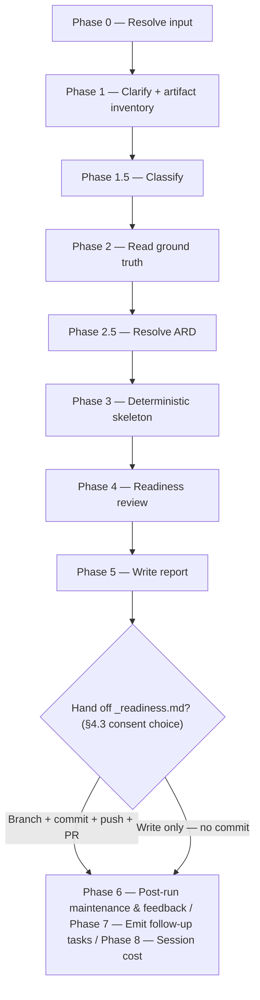

# /ready

Verifies whether the ARD, specification, and design artifacts on record actually justify a PRD or Epic's declared Jira status — read-only for that status, and it never stops on an artifact it can't confirm.

## Who runs it

`/ready` runs in the [dev](../roles-and-phases.md#dev--build-verify-and-deliver) role, cost-attribution phase [readiness](../roles-and-phases.md#readiness) — being in this phase means a Jira status is being checked against the ARD / spec / design record, never changed.

## Synopsis

```
/ready <PRD-KEY | Epic-KEY | jira-export-dir> [<Epic-KEY>]
```

`$ARGUMENTS` is a **single positional address** — a `<KEY>`, or an `@<path>` naming a folder in the specs tree. The resolved folder's kind decides the altitude: a `PRD-` folder is a PRD-level run, an `EPIC-` folder an Epic-level one. The two-key form is retired, because the second key was always derivable from the first.

## How it runs

`/ready` has 11 `## Phase` headings. The diagram below collapses the deterministic, orchestrator-inline phases and shows the one real decision the run makes after it already has a verdict in hand: whether to commit and hand off the readiness snapshot.



Three `dev-workflows` subagents are dispatched: the folder read (Phase 2, `depth: prd-plus-epics` — the authoritative status and requirement source), `readiness-reviewer` (Phase 4, the sole judgment-heavy delegate — Opus, frontmatter-pinned, dispatched regardless of classification), and `impl-maintenance` (Phase 6, session lessons-learned). `/ready` has **no delegated writer or implementation subagent** — Phase 3's coverage map, status-expectation checklist, and repo-availability check are built mechanically, orchestrator-inline, from Phase 2's Jira read and Phase 1's artifact inventory. the folder read and `impl-maintenance` run at `detection_model` — the Sonnet chain; `readiness-reviewer` keeps its frontmatter Opus pin regardless of classification, falling to the Sonnet floor (recorded as a degradation) only when no Opus is available at all. Classification is typically `MODERATE` — bounded scope, a single PRD or Epic, read-only, no code changes — escalating to `SIGNIFICANT` only for an unusually large multi-Epic PRD whose coverage chain spans many Epics and repos.

## What it needs

- **A Jira PRD or Epic** via the shared front-end — a `mode: direct` prompt is rejected outright (`READY_NEEDS_JIRA`); `/ready` has no non-Jira behavior.
- **`$SPECS_PATH`** — must resolve; `/ready` reads the ARD/spec/design artifacts from there and writes `_readiness.md` back into the same feature folder. If unset, the run stops and asks for a path.
- **A clean specs-repo checkout on `main`/`master`** — `/ready` reads artifacts from a clean default branch, never a branch of its own; a dirty or non-main checkout triggers a warn-and-ask rather than a silent read, because it may show unmerged, in-flight artifacts as if they were the handed-off truth.
- **The gated ARD/spec/design themselves — the one place in the pipeline these gates never stop.** Every other consumer of `require-on-main` (`../../references/phase-handoff.md` §3) and `../../references/ard-resolution.md` stops when a gated artifact resolves off the specs repo's default branch. `/design`'s `specification.md` is the extreme case of that rule — the one gated input that genuinely stops on absence, not merely on being unmerged. `/ready` is the mirror opposite for every artifact it checks: an artifact authored only on a branch, or on `main` but unconfirmed, or unverifiable against any ref, becomes a readiness finding that caps the verdict at `PARTIAL`; an artifact that is absent outright is recorded as a coverage gap. Reporting readiness is `/ready`'s whole function, so a run that stops instead of reporting has failed at the one thing it exists to do.
- **An optional ARD** (Phase 2.5, via `ard-resolution.md`) — `status: none` skips the ARD-conformance dimension entirely; `status: found` carries its `[AD#N]` invariants into the review; `status: unmerged` carries the same invariants forward **and never stops** — the one exemption `ard-resolution.md`'s no-regression rule names — adding an "ARD authored, not handed off" finding instead.
- **Mounted repos under `$REPOS_PATH`, best-effort presence only.** Phase 3(c) derives candidate repo names from Epic pull-request links, any `design.md`'s confirmed-repos header, and any ARD's `grounded_repos:` frontmatter, then checks which are mounted. This is informative context for the reviewer, never a hard gate — unlike `/design`'s Phase 3, `/ready` never dispatches `code-scanner` and never scans code.

## What it produces

A `SUPPORTED` / `PARTIAL` / `NOT-SUPPORTED` verdict with a requirement coverage roll-up (N/M requirements covered, each `❌` gap named) and the full `readiness-reviewer` Findings section, by dimension. `/ready` **authors nothing** in the PRD/Epic/ARD/spec/design sense — its only authored write is `_readiness.md`, overwritten on every run at the PRD dir (PRD-level check) or the Epic subdir (Epic-level check).

`_readiness.md` is committed and handed off only behind the `phase-handoff.md` §4.3 consent choice, creating `ready/<KEY>-<slug>` — never automatically. Declining leaves it uncommitted; the terminal `commit-artifacts` step stages only `$SPECS_PATH`'s bounded session-artifact paths and never `_readiness.md` itself.Phase 7 additionally emits one follow-up per named readiness gap on a `PARTIAL`/`NOT-SUPPORTED` verdict, plus a standing reminder to reconcile the Jira status with the artifacts; a clean `SUPPORTED` run qualifies no follow-ups at all.

## Gates

Phase 4 dispatches `readiness-reviewer` — Opus, frontmatter-pinned, mandatory on every run regardless of classification — with the Phase 3 mechanical skeleton (coverage map, status-expectation checklist, repo availability), the Phase 2 declared status exactly as read, and the Phase 2.5 `applicable_ard` when one resolved. No verdict is written or reported without it. `readiness-reviewer` is the plugin's **only reviewer that does joint cross-artifact analysis** — every other Opus reviewer (`prd-reviewer`, `ard-reviewer`, `epic-reviewer`, `spec-reviewer`, `design-reviewer`, plus `code-review` and `doc-reviewer`) is scoped to judging one artifact's own quality; several also read a companion artifact for traceability or non-contradiction (`design-reviewer` reads the source `specification.md`, `ard-reviewer` reads an inherited PRD-level ARD, `spec-reviewer` reads `applicable_ard`, `epic-reviewer` reads sibling Epics), but none of them synthesizes a verdict across artifacts the way `readiness-reviewer` does.

Because `/ready` authors nothing, there is no fixer to dispatch and no `BLOCK`/re-review cycle — the gate's outcome *is* the verdict and its Findings section, not a pass/fail loop feeding a fix. A `⚠` artifact state (authored on a branch, unconfirmed on main, or unverifiable against any ref) is recorded as a `MAJOR`-or-worse finding for the reviewer's "Status consistency" dimension, but it never stops the run — it only caps how high the verdict can land.

## Example

Check whether an Epic is really ready to move into `Refined`:

```
/dev-workflows:ready PRODUCT-1234 EPIC-98760
```

The run resolves `EPIC-98760` as the focus Epic, reads it and the PRD's artifacts via the folder read, resolves any applicable ARD, locates the Epic's `specification.md`/`design.md` and checks each against the specs repo's default branch (never stopping on what it finds), builds the coverage map and status-expectation checklist, and dispatches `readiness-reviewer`. It prints the verdict with its coverage roll-up and Findings, writes `_readiness.md` into the Epic subdir, and offers to commit and hand it off — declining leaves the snapshot written but uncommitted.

## See also

- [Roles and phases](../roles-and-phases.md) — what the `dev` role owns, including the handover-model exception `/ready` gets: the sole caller allowed to keep going past a stop every other command treats as fatal, and why verification is not a lane of its own.
- [`/design`](design.md) — the opposite extreme on the same gate: `/design` stops outright when its `specification.md` is absent, the only gated input in the pipeline that does, while `/ready` reads that same class of artifacts and never stops on any of them.
- [`/create-ard`](create-ard.md) and [`/specify`](specify.md) — the upstream commands whose ARD and `specification.md` `/ready` verifies (via `design.md`, whose upstream is `/design`, in the same chain).
- [Model routing](../reference/model-routing.md) — the classification rules and the `readiness-reviewer` Opus pin, including its Sonnet-floor fallback.
- [Session cost](../reference/session-cost.md), [Session feedback](../reference/session-feedback.md), and [Follow-ups](../reference/follow-ups.md) — the terminal Phase 6–8 bookkeeping every run emits.
- [`phase-handoff.md`](../../references/phase-handoff.md) and [`ard-resolution.md`](../../references/ard-resolution.md) — the gates `/ready` reads but is the one caller that never stops on.
- [`workflow-states.md`](../../references/workflow-states.md) — the PRD and Epic status ladders, expected-artifacts columns, and readiness targets `readiness-reviewer` applies.
