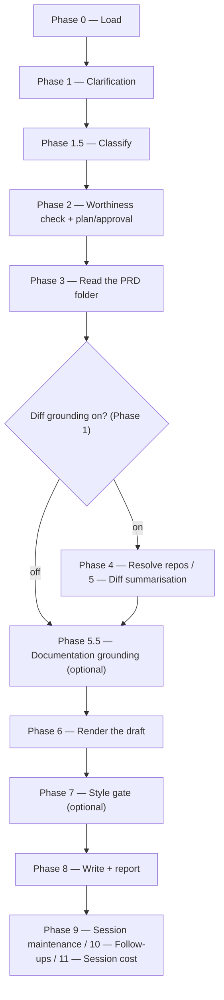

# /release-notes

Drafts a customer-facing release-notes summary for a resolved Product Requirements Document or ticket, for the PM to publish wherever their release-notes field.

## Who runs it

`/release-notes` is the plugin's one **dual-role** command — the same command runs at two different points in a PRD's life, and `emit-cost` tells them apart by inference rather than by a fixed label. `references/cost-emission.md` §7 gives the discriminator, and it is deliberately narrow: **the presence of downstream engineering artifacts** — any `specification.md` or `design.md` under the PRD's specs dir. **None present** → phase [prd-creation](../roles-and-phases.md#prd-creation), role [pm](../roles-and-phases.md#pm--product-management) — the PRD exists but no engineering work has started, and Epics may or may not exist yet. **Either present** → phase [documenting](../roles-and-phases.md#documenting), role [dev](../roles-and-phases.md#dev--build-verify-and-deliver) — the dev re-run, once a specification or design is in scope.

**Epic presence is deliberately not part of the signal.** A PRD can have drafted Epics — via [`/epics`](epics.md) — while still entirely in PM/PE hands: nothing about an Epic draft implies engineering has started on it. Keying the discriminator on Epics would misattribute that ordinary PM-phase PRD as a dev run. Specs and designs are the right signal because they can only exist once [`/specify`](specify.md) or [`/design`](design.md) has actually run against the PRD — an Epic drafted by `/epics` never gets close to producing either.

**What differs between the two runs is narrower than the phase label suggests.** The command asks the same questions, reads the same PRD hierarchy, offers the same optional diff grounding, and runs the same style gate regardless of which phase it infers — there is no branch in `/release-notes`'s own phases keyed on `run_phase`. The one place it matters is the **Feature update** documentation link: on the PM run the feature isn't built yet, so no link is offered or asked for at all; on the dev run, the author may supply a redirect short link that will later point at the page `/document` publishes. Everything else — the draft's shape, its destination, its style check — is identical either way.

## Synopsis

```
/release-notes <ADDRESS> [--version <v>] [--no-docs]
```

`/release-notes` is **address-required** — there is no free-text or `@file` input; a prompt with no positional address stops with `RELEASE_NOTES_NEEDS_KEY`. The address is a `<KEY>`, or an `@<path>` naming a folder in the specs tree; [`addressing.md`](../../references/addressing.md) §3 resolves either.

## How it runs

`/release-notes` has 14 `## Phase` headings.



The `d1` fork is the Phase 1 diff-grounding choice, default OFF — the PRD alone is usually enough for a release note; it decides the folder read's `depth` before Phase 3 even runs (`prd-only` when off, `full` when on, so PR links are collected), and only Phase 4's repo resolution and Phase 5's `diff-summarizer` batches are actually skipped on the "off" path.

Three `dev-workflows` subagents are dispatched: `docs-grounder` (Phase 5.5, read-only grounding on the shipped product docs — default ON when `$DOCS_PATH` resolves, advisory, never a gate), `release-notes-writer` (Phase 6, the sole author of the rendered draft), and `impl-maintenance` (Phase 9, alongside no other maintenance agents — `/release-notes` has none of `/document`'s or `/implement`'s three general-purpose maintenance dispatches). `diff-summarizer` (Phase 5) is a fifth agent, dispatched only when diff grounding is on. `prose-style-checker` and `prose-fixer` (Phase 7) belong to the separate `prose-style` plugin and run only when it's installed.

## What it needs

- **A resolved address** — a key or an `@<path>` naming a folder in the specs tree, resolved directory; `mode: direct` is rejected outright.
- **The `relevant_for_release_notes` flag**, read from the resolved folder's PRD frontmatter before the folder read even runs. An explicit `false`/`no` stops the run with `RELEASE_NOTES_NOT_RELEVANT` — overridable, since a PM may still want to draft ahead of the flag. An **absent** value proceeds silently: the field defaults to true, and absent is never treated as false.
- **Optional diff grounding** (default OFF) — when turned on, `$REPOS_PATH` and a PR-status filter are resolved the same way `/document` resolves them, and a repo that resolves to zero matches is put to you as a choice rather than resolved silently; a repo you then skip degrades the grounding for that repo and never the run.
- **Optional `$DOCS_PATH` grounding** (Phase 5.5), resolved once in Phase 2 alongside plan approval — read-only, never a gate.
- **For a deprecating change, an end-of-life date.** A deprecation note is required whenever the PRD deprecates a capability or is itself a deprecation, and it always needs an end-of-life date — the end-of-support date is optional. A missing end-of-life date is never invented: it becomes a `deprecation_eol` gap the command asks the user about, with a `<!-- TODO: end-of-life date -->` placeholder in the draft until it's answered.

## What it produces

**Where it lands.** `release-notes.md` in the resolved PRD folder, appended as a section: the Change Type selects `## Breaking changes`, `## Feature updates` or `## Fixes`, and those sit under a heading for the release version (`--version <v>`, else asked; `## Unreleased` when declined). The three former destination *files* are those three sections — the taxonomy is unchanged, only where a draft lands.

**The authored body only** — never an identifier, a PR link, a `Change type:` line, or a `{{#internal-note}}` block, since the docs automation adds that metadata wrapper when it publishes. For a titled destination (`## Feature updates` / `## Breaking changes`) that's the category label (the PRD's own `release_notes_category`, used verbatim, or omitted entirely when the PRD carries none), an `### title`, and customer-facing prose; under `## Fixes` it's **one bare past-tense sentence**, with no label and no title. Exactly **one** Summary is ever produced per run — never one block per declared release version — and no title or prose in it ever names the release version itself; the version is a separate field the PM sets.

The **section** is resolved from the PRD's `change_type` when it carries one, else inferred from the change's nature, with a low-confidence inference confirmed by its consequence (the shape and destination file) rather than by presenting the bare enum label. A deprecating change carries its required end-of-life date (and optional end-of-support date) as a trailing note in the Summary.The Phase 8 report states where it landed and reminds the user to publish it wherever their release notes are published. `/release-notes` also drafts an implementation-gaps bug report when `release-notes-writer` returns a PRD-vs-source discrepancy, resolved through the same per-claim decision table `/document` (keyed mode) Phase 5.8 uses.

## Gates

**Light gate only.** There is no Opus review, no tests, and no branch created by this command — `specs-preflight` may switch `$SPECS_PATH` between branches that already exist and were created by the plugin, but it creates none. The one optional gate is a **style check** (Phase 7): when the user chose it and the `prose-style` plugin is installed, `prose-style-checker` runs against the rendered draft and, on the auto-fix choice, `prose-fixer` applies safe fixes; when `prose-style` is not installed, the phase is skipped with a note in the report rather than blocked on.

**The worthiness gate is the run's real stop point**, and it fires before any of the run's expensive work — though not before *anything*: Phase 0 resolves the input, Phase 1 asks every user-facing question, and Phase 1.5 classifies, all ahead of it. Phase 2 then reads `relevant_for_release_notes` straight from the imported PRD frontmatter — never from the authored specs draft — and an explicit `false` halts the run with `RELEASE_NOTES_NOT_RELEVANT` unless the user overrides it.

The run makes **zero external API calls**: PR URLs (when diff grounding is on) are identifiers only, GitHub resolution may use the `gh` CLI, Bitbucket is pure local `git`, and the folder read is strictly read-only.

## Example

One invocation, two runs — the command is the same either time, and only the inferred phase differs.

**The PM's early run**, with the PRD opened and nothing specified or designed yet:

```
/dev-workflows:release-notes PRODUCT-1234
```

The run checks `relevant_for_release_notes`, asks about diff grounding (default: PRD content only) and the release version, classifies as `MODERATE`, reads the PRD, resolves `$DOCS_PATH` grounding if configured, and finds neither `specification.md` nor `design.md` under the PRD's specs dir — so it infers `run_phase: pm` and renders the draft via `release-notes-writer` with no documentation redirect link, because the feature isn't built and there is no page to point at yet. It then runs the optional style gate and writes the persistent draft with a reminder to publish it.

**The dev's later re-run**, once a specification or design is on record:

```
/dev-workflows:release-notes PRODUCT-1234
```

Byte for byte the same command, and every step above happens the same way. The single difference is what the specs dir now contains: `run_phase` infers as `dev`, so the draft may carry a documentation redirect short link. Same destination question, same classification, same style gate, same publish reminder.

## See also

- [Roles and phases](../roles-and-phases.md) — the `pm` and `dev` roles this command straddles, and what distinguishes the `prd-creation` and `documenting` cost phases.
- [`/create-prd`](create-prd.md) — the upstream command that produces the PRD a PM-phase run of `/release-notes` typically drafts from.
- [`/document`](document.md) — the command whose eventual published page a dev-phase run's documentation link points at; the sibling command whose own phase/role is fixed rather than inferred.
- [`/epics`](epics.md) — Epic drafting; deliberately excluded from the `/release-notes` phase/role discriminator even though it can run before or after this command.
- [Model routing](../reference/model-routing.md) — the classification rules; `/release-notes` is always `MODERATE`.
- [Session cost](../reference/session-cost.md), [Session feedback](../reference/session-feedback.md), and [Follow-ups](../reference/follow-ups.md) — the terminal Phase 9–11 bookkeeping every run emits.
- [`release-note-types.md`](../../references/release-note-types.md) — the section map, the per-section draft shape and prose rules, and the deprecation-note rule `release-notes-writer` applies.
- [`cost-emission.md`](../../references/cost-emission.md) — §7's full phase/role inference this page's `## Who runs it` section is derived from.
