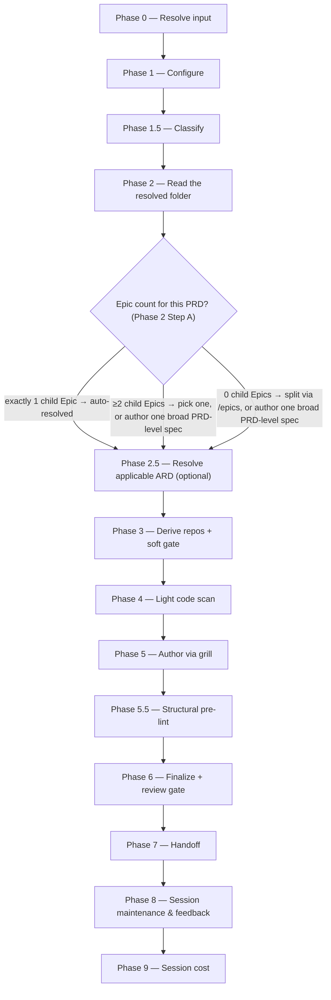

# /specify

Reads the resolved Epic or PRD folder, lightly grounds in code, and authors an org-standard `specification.md` through a relentless grill.

## Who runs it

`/specify` runs in the [pe](../roles-and-phases.md#pe--product-engineering) role, cost-attribution phase [specification](../roles-and-phases.md#specification) — being in this phase means an org-standard `specification.md` is being authored for one item, lightly grounded in code.

## Synopsis

```
/specify <ADDRESS> [--no-docs]
```

**The BRD route** — where the resolved folder carries a `brd-link.md`, the run authors the specification for a reconciled BRD slice. A `BRD-` container is refused (`SPECIFY_BRD_NOT_SLICED`). Detected, not a path**: the positional token is then a **BRD key**, validated against `^[A-Z][A-Z0-9_]*(-\d+)+$` (so a three-segment slice key such as `EPIC-008-01` is as valid as `EPIC-008`) and resolved to a folder at either level under `specifications/`, so a path is only for a BRD folder outside the normal layout. It takes **one key**: a second positional key stops the run (`SPECIFY_BRD_NO_EPIC`), because a BRD has no Epics yet and the seeds live only at a BRD's own level. Everything in the paragraphs below about pickers, Epic counts and the resolved folder describes the keyed route only — BRD-route runs none of it.

Key distinction from [`/epics`](epics.md): `/epics` *splits* a PRD into Epic drafts; `/specify` *authors one specification* for a single item. **The PRD-level path is genuinely valid, not a fallback of last resort**: `/specify <PRD>` with no focus Epic stays in the PE lane and produces one broad `specification.md` at the PRD dir. What Phase 2 does with a bare PRD key depends on how many child Epics it has:

- **A PRD with exactly 1 Epic** — no picker; that Epic auto-resolves as the focus, with a one-line notice.
- **A PRD with ≥2 Epics** — Phase 2 renders a progress-aware picker: one row per child Epic (marked ○ not started / ◐ in progress / ● done), plus an explicit **"Author one broad PRD-level spec instead"** choice.
- **A PRD with 0 Epics** — offered `choices: ["Split into Epics first with /dev-workflows:epics (Recommended)", "Author one broad PRD-level spec now", "Cancel"]`. `/epics` writes the Epic folders into this PRD folder, where `/specify` sees them immediately.

**There is no fourth case.** An Epic always has a PRD above it — [`/epics`](epics.md) is the only command that creates an `EPIC-` folder, and it writes every one of them under a PRD folder — so a top-level `EPIC-` folder with no PRD above it is no longer a shape `/specify` resolves. A per-Epic feature folder that does not exist is a stop (`SPECIFY_EPIC_NOT_FOUND`) naming `/dev-workflows:epics <PRD>`, never a directory this command creates.

An explicit `<PRD-Key> <Epic-Key>` (or `<dir> <Epic-Key>`) skips the picker entirely — the Epic is already chosen. `--no-docs` turns off the optional Phase 4 documentation-grounding pass.

## How it runs



Four `dev-workflows` subagents are dispatched: `docs-grounder` (Phase 4, read-only grounding on the shipped product docs — default ON when `$DOCS_PATH` resolves, advisory, never a gate), `code-scanner` (Phase 4, one instance per mounted candidate repo, up to 4 concurrent per batch — deliberately **light** relative to `/epics`' scan, grounding for feasibility rather than a full reuse audit), `spec-reviewer` (Phase 6, Opus-pinned), and `impl-maintenance` (Phase 8, session lessons-learned). The grill and the `specification.md` authoring itself run inline on `current_model` rather than through a delegated subagent.

## What it needs

- **An Epic or PRD address** — a prompt with no address is rejected outright (`SPECIFY_NEEDS_KEY`); `/specify` has no non-tracker behaviour.
- **The PRD on the specs repo's default branch** — gated via `require-on-main` against `specifications/<PRD>-<vslug>/`. An unmerged PRD is a hard stop, naming the branch and any open pull request. An **absent** PRD is not a stop: `/specify`'s existing specs-tree behaviour is unaffected, and the run reports that it is specifying from the export directly — the same fallback `/create-ard` uses.
- **`$SPECS_PATH`** (required) — `/specify` writes under `$SPECS_PATH/specifications/`, the specs repo; unset stops the run naming `SPECS_PATH`, with no fallback.
- **An optional ARD** for this item (Phase 2.5), resolved via `../../references/ard-resolution.md` with the PRD and the resolved focus Epic. `status: none` skips silently; `status: unmerged` stops, naming the branch and any pull request; `status: found` keeps the spec's user stories and scope consistent with its `[AD#N]` invariants during the grill, passed to `spec-reviewer` as `applicable_ard`.
- **Mounted repos under `$REPOS_PATH`** — candidates are auto-derived from the PRD's capability themes and linked PR URLs. An *unresolved* repo slug (zero or ambiguous matches) hard-escalates before Phase 4 runs at all. A resolved-but-unmounted repo, by contrast, only **soft-gates**: it becomes an open question in `_session.md` and the run proceeds with the remaining mounted repos — the specification just can't cite the ungrounded one until it's mounted and the run is re-invoked.
- **`$DOCS_PATH`** (optional, default `/workspace/docs`) — consumed with grill-rank ranking in Phase 4. Missing, unreadable, or empty is a silent, non-blocking skip. Turned off with `--no-docs`.
- **A prior `_session.md`** (optional) — if one exists in the resolved feature folder, Phase 1 offers resume-vs-fresh; on resume, Phase 5 begins at the first unsettled stage instead of the header.

### The BRD route

On the BRD route the run is seeded by a reconciled BRD, and what it needs changes accordingly:

- **No input outside the specs tree.** Nothing is dispatched against a tracker, Phase 2's granularity picker never renders, and `SPECIFY_NEEDS_KEY` is unreachable — that stop reports the front-end returning `mode: direct`, and the front-end does not run. A BRD key names a folder under `$SPECS_PATH` and was never checked against a tracker.
- **No PRD gate.** On the keyed route the merged PRD is a grounding *confirmation*, not a content source; here the content source is the BRD folder, and the PRD is read by nothing in the run. Gating it would turn an input this route never had into a prerequisite. The [`/brd-*` route](../brd-workflow.md)'s own handoff discipline is what puts the seed on the default branch.
- **The BRD folder's seed, register and findings** — `spec-seed.md` (the implementation altitude of the router; `prd-seed.md` and `ard-seed.md` belong to [`/create-prd`](create-prd.md) and [`/create-ard`](create-ard.md) and are not read), `decisions.md`, the `[CG#n]`/`[DG#n]` records in `grounding/`, and **the derivation matrix**, which lives appended to `grounding/code-grounding.md` rather than in a file of its own. Any of them being absent is reported, never a stop. **A seed file is normally absent**, because nothing on the route writes one: the sole writer is `/brd-intake --sort-existing`, a migration path for a package authored by hand before the route existed. The register, the findings and the matrix are what this route is really seeded from. A finding carrying no verifier outcome is not evidence: it grounds nothing and is never marked consumed.
- **A `PRD-` slice folder, and never a `BRD-` container.** The route is the slice [`/brd-split`](brd-split.md) carved — the folder carrying `brd-link.md`. A `BRD-` folder stops with `SPECIFY_BRD_NOT_SLICED` **on either route**, the moment the address resolves — the BRD route is detected from a `brd-link.md` and a root BRD folder need not carry one, so a route-conditioned refusal would let a container fall through. A BRD is a container, and its requirements are specified in the slices under it, one specification each. The stop names those slices, or — where the BRD holds none — [`/brd-split`](brd-split.md) to carve one, with that command's own two conditions stated in the offer: it gates on verified grounding findings, and it is a no-op on a ledger with no `unallocated` row.
- **No coverage-ledger check.** PRD eligibility and the allocation gate govern authoring a *PRD*; a specification is not that artifact, so this route does not read the ledger — the container refusal above is decided on the folder's kind, not on any row. That is a decision, not an omission — [`/create-prd`](create-prd.md) is where the gate lives.
- **Repo candidates come from `grounding/baselines.md`** — the repositories `/brd-ground` already pinned — rather than from PRD themes and PR URLs, which this route has none of. The soft gate for an unmounted repo is unchanged.
- **The ARD is resolved from `brd-link.md`'s `parent:`**, never from counting segments in the key: the route resolves a slice and nothing else, so the pair is always the parent's key with the slice's own as the Epic — the same pair `/create-ard` on the BRD route writes into the ARD's frontmatter.
- **Decisions are frozen.** The grill fills what the seed leaves unstated and may not reopen a `[VD#n]` or `[CD#n]`; open decisions and open `[AS#n]` assumptions reach the spec as `- [ ]` open questions under their own ids, which is also what keeps the header's count honest.

## What it produces

`specification.md` (`Published: no`), `idea.md` (pre-spec brainstorming provenance derived from the scoped item text), `_session.md`, `_glossary.md`, and a rendered `.html` mirror — written into the feature folder: the Epic subfolder for a per-Epic spec, or the PRD dir itself for a broad PRD-level spec. `specification.md` is authored against `../../references/specification-format.md` through five ordered stages: Problem statement, Scope, User stories, Acceptance criteria (EARS phrasing), and Test cases — each stage's own numbered-ID scheme is the spec/design namespace `specification-format.md` defines, deliberately separate from a PRD's `[US#N]`-style grammar. Behind Phase 7's consent choice, the whole feature folder is committed, pushed, and a pull request opened against the specs repo's default branch — **merged-to-main is what makes the spec visible to Devs and to [`/design`](design.md)**, which reads it from `main` only, never from a branch. `Published: yes` is a separate, human-only freeze step outside this command's scope.

**On the BRD route** the same files land flat in the resolved `PRD-` slice folder on a `spec/<SLICE-KEY>-<slug>` branch, with one omission: **no `idea.md`**, because there is no PRD text to derive one from and the folder already holds the committed provenance this spec was built from. That run also writes `consumed_by: specification` onto the implementation-altitude decisions and the verified findings the spec drew on — the only writes it makes into any BRD file — and commits `decisions.md` and the two `grounding/` files alongside the spec. `spec-seed.md` is read but never written, and the derivation matrix is not a record either, so both are reported at file granularity rather than stamped. The next-step offer names [`/design`](design.md) **only** when a resolved folder resolves for the BRD key itself — which is what makes the key and the folder resolve to the same work — and otherwise names no command.

## Gates

Phase 6 dispatches `spec-reviewer`, Opus-pinned by frontmatter (`model: opus`, no override), checking per-stage quality, cross-stage consistency, coverage, and identifier integrity. `BLOCK` fixes the BLOCKER findings inline — the orchestrator/grill edits `specification.md` directly; there is no delegated writer to re-dispatch — and re-reviews once; an unresolved BLOCKER after that cycle is escalated individually, with "Defer" appending a `## Refinement notes` section to the spec itself. `MAJOR`/`MINOR`/`NIT` under `PASS WITH RECOMMENDATIONS` are deferred to the final report with no mandatory fix cycle. Cap: one fix cycle plus one re-review.

Ahead of the review, Phase 5.5 runs a structural pre-lint (`../../references/pre-lint.md`) — advisory only — checking the Universal checks and the spec block, including that the header's `Open questions` count matches the actual `- [ ]` count.

## Example

Author a specification for a single Epic already selected:

```
/dev-workflows:specify EPIC-98761
```

The run resolves the PRD and the named focus Epic (skipping the picker, since it was given explicitly), reads the full Epic subtree, resolves any applicable ARD, derives and lightly scans mounted repos, grills you relentlessly through Problem statement → Scope → User stories → Acceptance criteria → Test cases, runs the structural pre-lint, then `spec-reviewer`. On a passing verdict it offers to branch, commit, push, and open a pull request; if this Epic came from a multi-Epic PRD's picker, it then offers to loop straight into the next sibling Epic.

Author the specification for a reconciled BRD slice instead:

```
/dev-workflows:specify EPIC-008-01
```

The run resolves `EPIC-008-01`'s folder one level under `specifications/`, reads `spec-seed.md`, the register, the verified findings and any derivation matrix, resolves the ARD under the parent's key with this slice as the Epic, scans the repositories `grounding/baselines.md` pinned, and grills **only the gaps** — every `[VD#n]` and `[CD#n]` the register holds as decided is an input the interview never reopens, because the customer signed it. A `NEW-CAPTURE` matrix row is work this spec must deliver and lands in `## Scope` and an EARS acceptance criterion, not in a footnote.

## See also

- [Roles and phases](../roles-and-phases.md) — what the `pe` role owns, including the two "absent falls back, unmerged stops" gates it shares with [`/create-ard`](create-ard.md).
- [`/epics`](epics.md) — the upstream command that splits a PRD into the child Epics `/specify` is typically run once per; a PRD with 0 Epics is offered a link back here.
- [`/create-ard`](create-ard.md) — the optional upstream command whose `[AD#N]` invariants `/specify` inherits when present.
- [`/design`](design.md) — the downstream command that refuses to start until this command's `specification.md` is merged to the specs repo's default branch.
- [Model routing](../reference/model-routing.md) — the classification rules and the `spec-reviewer` Opus pin.
- [Session cost](../reference/session-cost.md), [Session feedback](../reference/session-feedback.md), and [Resume and checkpoints](../reference/resume-and-checkpoints.md) — the terminal Phase 8–9 bookkeeping every run emits.
- [`specification-format.md`](../../references/specification-format.md) — the canonical structure `specification.md` is authored and reviewed against.
- [`ard-resolution.md`](../../references/ard-resolution.md) — how the optional ARD is resolved and inherited.
- [The BRD-to-PRD route](../brd-workflow.md) — the `/brd-*` commands that produce the register, findings and derivation matrix the BRD route reads, and the customer sign-off that makes those decisions unreopenable here. They produce no `spec-seed.md`: the only writer of a seed file is `/brd-intake --sort-existing`, a migration path, so a reconciled BRD normally holds none and the implementation altitude arrives through the register, the findings and the matrix.
