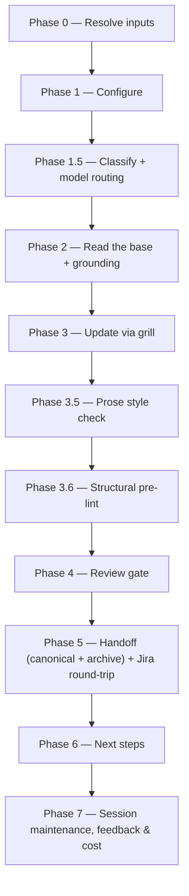

# /update-prd

Refreshes an existing Product Requirements Document against its Jira source — routine updates and the rarer obstacle-driven re-do alike — gated by the same Opus review as [`/create-prd`](create-prd.md).

## Who runs it

`/update-prd` runs in the [pm](../roles-and-phases.md#pm--product-management) role, cost-attribution phase [prd-update](../roles-and-phases.md#prd-update) — distinct from `prd-creation` because this command refreshes an existing PRD rather than authoring one from scratch.

## Synopsis

```
/update-prd <KEY> [@transcript-or-notes ...] [--no-docs]
```

- **`<KEY>`** (mandatory) — the existing PRD's Jira key. Format-validated only (`^[A-Z][A-Z0-9_]*-\d+$`).
- **`[@transcript-or-notes ...]`** (optional) — one or more paths to a transcript or notes file, read as secondary, read-only grounding for the grill.
- **`[--no-docs]`** — turns off documentation grounding for the run (see [What it needs](#what-it-needs)).

## How it runs



Three `dev-workflows` subagents are dispatched: `docs-grounder` (Phase 2, read-only grounding on the shipped product docs — default ON when `$DOCS_PATH` resolves, advisory, never a gate), `prd-reviewer` (Phase 4, Opus-pinned), and `impl-maintenance` (Phase 7, session lessons-learned), each against the model recorded in `model_routing`. A fourth agent, `prose-style:prose-style-checker`, runs in Phase 3.5 exactly as it does in [`/create-prd`](create-prd.md) — a non-gating quality pass from a separate plugin, not counted in the dispatch total above.

## What it needs

- **`<KEY>`** — mandatory; absent or malformed stops the run with `UPDATE_VI_NEEDS_KEY`.
- **`$SPECS_PATH`** (required) — if unset, the run stops naming `SPECS_PATH` and offers to enter a path or cancel.
- **The re-imported Jira PRD**, at `$VAULT_PATH/jira-products/<KEY>` (body + `-comments.md`) — the run's **authoritative base**, resolved Jira-import-first. Not yet imported stops the run and asks you to import it first; imported but stale (older than 3 days) offers a re-import rather than stopping outright.
- **Secondary grounding** (all optional and read-only): a frozen specs-repo draft (`<KEY>_*.md`), any `*_ARD.md`, `specification.md`, and the `@transcript`/notes path(s) passed on the command line. None of these gate the run. Where a discovered `*_ARD.md` or `specification.md` is not on the specs repo's default branch, the Phase 1 confirmation flags it as unapproved — advisory only, never a reason to stop.
- **Documentation grounding** (optional, on by default) — turned off with `--no-docs`; a miss is a silent skip, never a gate.
- **No repos.** `/update-prd` is cwd-agnostic and product-level — it never mounts or scans code.

**`/update-prd` is the one authoring command deliberately excluded from `require-on-main`.** It never executes that consumer entry point at all, on any input. Its authoritative base is the Jira import (above), not a gated specs artifact, so subjecting the secondary grounding to `require-on-main` would block a legitimate refresh purely because an unrelated ARD happened to sit on an unmerged branch — the command reports that state instead of stopping on it.

## What it produces

- The **canonical** PRD, overwritten in place at `<feature-folder>/<KEY>_<slug>.md`, with `revision_of` (the archived snapshot's path) and `built_from_import` (the Jira-import date the update was built from) added to its frontmatter.
- An **archived snapshot** of the prior canonical PRD, written first, before the overwrite, to `<feature-folder>/revisions/<KEY>_<slug>_<YYYYMMDD>.md` (a same-day second revision is suffixed `-2`, `-3`, …).
- Behind Phase 5's consent choice, both files are committed, pushed, and a pull request opened against the specs repo's default branch.
- A **Jira round-trip reminder** (manual, not automated): paste the updated body back into the Jira workitem `<KEY>`, then re-import it to `$VAULT_PATH/jira-products/<KEY>` — skipping either step leaves the update diverged from Jira again.

## Gates

- **Phase 3.5 — Prose style check**, mirroring [`/create-prd`](create-prd.md) exactly: `prose-style:prose-style-checker` applies MAJOR fixes inline and re-runs once; a non-gating quality pass, skipped gracefully when the `prose-style` plugin is not installed.
- **Phase 3.6 — Structural pre-lint** (`../../references/pre-lint.md`), advisory only — mechanical findings fixed inline, content gaps left for the grill.
- **Phase 4 — `prd-reviewer`**, Opus-pinned by frontmatter (`model: opus`, no override), reviewing the whole updated PRD against `../../references/prd-format.md`. `PASS` / `PASS WITH RECOMMENDATIONS` proceeds. `BLOCK` triggers one inline fix cycle and one re-review; a persistent `BLOCK` is escalated per `../../references/escalation-rules.md`'s "Review verdict BLOCK" choices, exactly as in [`/create-prd`](create-prd.md).

## Example

Refresh a PRD with new call notes, after the specs draft has already been reviewed once:

```
/dev-workflows:update-prd PRODUCT-1234 @call-notes.md
```

The run resolves the feature folder, pulls the current Jira-imported PRD plus its comments as the authoritative base, reads the call notes as secondary grounding, confirms the scope of the update (refresh vs. re-do), grills you relentlessly while diffing against the base rather than starting from blank, runs the style check and pre-lint, then `prd-reviewer`. On a passing verdict it archives the prior PRD, writes the refreshed canonical PRD, offers to open a pull request, and reminds you to paste the update into Jira and re-import it.

## See also

- [Roles and phases](../roles-and-phases.md) — what the `pm` role owns and hands off at the `prd-update` seam.
- [`/create-prd`](create-prd.md) — the greenfield sibling that authors a PRD from scratch; this command's Phase 0 does not redirect to it — an unimported `<KEY>` stops and asks you to run the workitem importer first.
- [`/create-ard`](create-ard.md), [`/specify`](specify.md), [`/epics`](epics.md), and [`/release-notes`](release-notes.md) — the role re-runs `/update-prd`'s Phase 6 offers when an ARD, spec, or release note already exists.
- [Model routing](../reference/model-routing.md) — the classification and Opus fallback chain `prd-reviewer` runs under.
- [Session cost](../reference/session-cost.md), [Session feedback](../reference/session-feedback.md), and [Resume and checkpoints](../reference/resume-and-checkpoints.md) — the terminal Phase 7 bookkeeping every run emits.
- [`prd-format.md`](../../references/prd-format.md) — the canonical structure the PRD is updated and reviewed against.
- [`prd-source-resolution.md`](../../references/prd-source-resolution.md) — the Jira-import-first resolution ladder Phase 0 executes.
