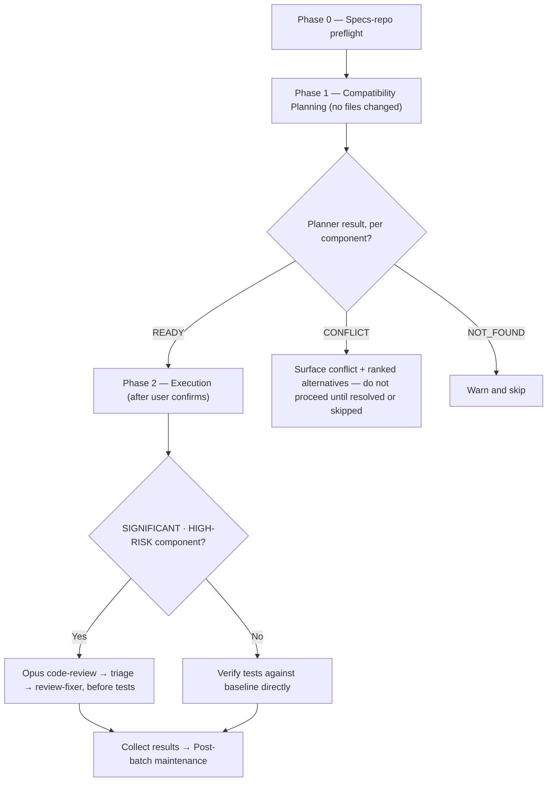

# /upgrade

Upgrades libraries, frameworks, runtimes, or build tools to specified or latest versions — planning compatibility for every requested component before touching a single file, then executing each one in turn.

## Who runs it

`/upgrade` runs **outside the PRD pipeline** — it has no cost-attribution phase and no role. It emits **no cost attribution at all**: it has no Product Requirements Document to attribute spend to, and `references/cost-emission.md` never mentions it ( The `phase:` values it does pass to `upgrade-planner` and `upgrade-executor` — `full`, `verify-resume`, `regression-resume` — belong to a completely different vocabulary: the model-routing **resume protocol**, saying how much of a single component's own re-entered work must be redone after a review or a failed test, not where a run sits in the product lifecycle. The two vocabularies share the field name `phase` and nothing else — see [Roles and phases](../roles-and-phases.md#cost-attribution-phases) for the fuller distinction.

## Synopsis

```
/upgrade <component[:exact|:minor|:latest|:lts]> [<component…>]
```

Each token is a bare `component` (highest version compatible with everything else already in the repo) or `component:1.2.3` (exact), `component:minor` (latest patch on the current minor), `component:latest` (latest stable), or `component:lts` (latest LTS, resolved via `../../references/upgrade/lts-sources.md`; asked of the user on lookup failure). A component can be a library, a framework, a language runtime, a build tool, or a path like `.github/workflows`. Multiple components upgrade in one run, planned together so cross-component conflicts surface before anything is written.

## How it runs

`/upgrade` has 3 `## Phase` headings. The diagram below shows both real decisions the run makes: what a component's compatibility plan resolved to, and whether that component's classification gates tests behind an Opus review.



**The run is safe to execute because planning and execution are two separate agents with a user confirmation gate between them.** Phase 1 dispatches `upgrade-planner` once per requested component, in parallel — it detects the component in the repo, resolves the requested target version, and verifies compatibility with every *other* component in the repo, **before anything is written to disk**. Only once every `READY` plan is confirmed by the user does Phase 2 begin: `upgrade-executor` then applies the approved plan for one component at a time, sequentially, to avoid conflicting edits to shared dependency files. For every component classified `SIGNIFICANT`/`HIGH-RISK`, Phase 1 additionally dispatches `risk-planner` (Opus, frontmatter-pinned) before execution to plan around blast radius, migration order, and rollback. `upgrade-planner`, `upgrade-executor` (on `SIMPLE`/`MODERATE`), and `test-baseliner` run at `detection_model` — the Sonnet chain; `risk-planner` and `code-review` keep their frontmatter Opus pins.

## What it needs

- **One or more component tokens**, each with an optional version-resolution suffix — see the Synopsis grammar above.
- **The target repo** — its build files, runtime version files, and CI YAML are inventoried against `../../references/upgrade/ecosystems.md` to detect current versions.
- **`$SPECS_PATH`** — for the Phase 0 specs-repo preflight and the terminal artifact commit; this repo is never the one being upgraded, and the code repo is untouched by any specs-repo step.
- **A confirmed plan before any file changes.** Phase 1 never modifies files, and Phase 2 never touches a file before the upgrade branch exists — a dirty working tree at that point is surfaced (stash, proceed, or cancel) rather than upgraded over silently.

## What it produces

Upgraded component version(s) applied on a freshly created feature branch, **each component committed on its own** as soon as its gates settle (step 6.5) — so a batch that dies part-way still has the finished components committed on a branch that bisects — and the branch pushed once for the batch behind a three-option consent choice (push + PR recommended, push only, or neither) in step 7.5. `--no-commit` skips both steps and leaves everything in the working tree.

No cost entry is ever written (see [Who runs it](#who-runs-it) above), and no `resume.md` is written for `/upgrade` — its durable state is already the branch on disk, not a PRD-scoped artifact. The terminal `commit-artifacts` step still runs, committing only `$SPECS_PATH`'s bounded session-artifact paths — never the code repo `/upgrade` just changed.

## Gates

Phase 2 prep captures **one** test baseline before any component executes, reused for the whole batch rather than re-captured per component. For each `SIGNIFICANT`/`HIGH-RISK` component, once `upgrade-executor` returns `AWAITING_REVIEW`, the Opus `code-review` gate runs **before any test verification** — the plugin's invariant that tests never run on risky work until review returns a non-`BLOCK` verdict. Between the review and any fixer dispatch, the orchestrator runs its own finding triage (`../../references/finding-triage.md`) — each finding verified at the location it names, kept or dismissed, every dismissal recorded with a reason; `review-fixer` is handed **survivors only**. A `BLOCK` or `PASS WITH RECOMMENDATIONS` verdict invokes `review-fixer` for the surviving `BLOCKER`/`MAJOR` findings, then one re-review against the refreshed diff; a still-`BLOCK` result stops work on that component rather than looping. `SIMPLE`/`MODERATE` components skip this gate entirely and verify tests directly.

A `TEST_REGRESSION` result on either path hands the decision to the orchestrator (never the executor, which cannot prompt): keep the upgrade and leave the failures for later, revert and skip the component, or investigate further — looping at the orchestrator until a decision is made.

## Example

Upgrade a framework to its latest stable release and a runtime to its latest LTS in one run:

```
/dev-workflows:upgrade springboot:latest java:lts
```

`upgrade-planner` runs both components in parallel, resolving `springboot`'s highest stable release and `java`'s current LTS, and checking each against the other's plan for conflicts. Once both plans are confirmed, a feature branch is created, a single test baseline is captured, and Phase 2 executes `springboot` then `java` in sequence — `springboot`'s major bump typically routes through `risk-planner` and the Opus review gate before tests, `java`'s LTS bump may or may not, depending on the API-surface change `upgrade-planner` found. Each component is committed as its own gates settle, the branch is pushed once, and the run closes with the Upgrade Summary table, the `Code repo:` outcome line for the code repository, the `impl-maintenance` report, and the `Specs repo:` outcome line for the bounded session-artifact commit.

## See also

- [`/vuln`](vuln.md) — the plugin's other maintenance command outside the PRD pipeline, sharing the same no-cost-attribution fact, the same resume-phase vocabulary, and the same review/triage/fixer/test gate shape for CVEs instead of version bumps.
- [`/implement`](implement.md) — the pipeline command `/upgrade` borrows its review machinery from: `risk-planner`, `code-review`, `review-fixer`, and `../../references/finding-triage.md`.
- [Roles and phases](../roles-and-phases.md#cost-attribution-phases) — the closing note distinguishing the cost-attribution `phase:` vocabulary from the resume-protocol `phase:` vocabulary `/upgrade` passes.
- [Session cost](../reference/session-cost.md) — states plainly that `/vuln` and `/upgrade` emit no cost attribution at all.
- [Session feedback](../reference/session-feedback.md) — how the terminal `emit-auto` step persists plugin-facing lessons from this run.
- [Resume and checkpoints](../reference/resume-and-checkpoints.md) — why `/upgrade` writes no `resume.md` and gets a plain end-of-run `/compact` suggestion instead.
- [Model routing](../reference/model-routing.md) — the per-component classification rules and the Opus fallback chain `risk-planner`/`code-review` resolve against.
- [`finding-triage.md`](../../references/finding-triage.md) — the triage step run between `code-review` and `review-fixer`.
