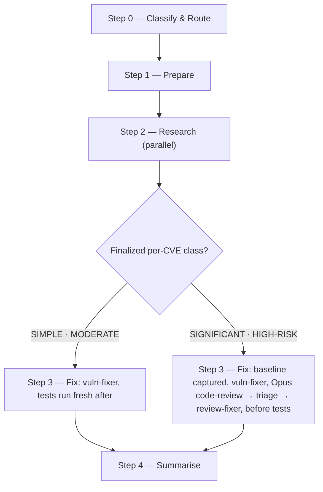

# /vuln

Researches CVEs via NVD, applies dependency and code fixes one at a time, and verifies each fix with an Opus code review and tests.

## Who runs it

`/vuln` runs **outside the PRD pipeline** — it has no cost-attribution phase and no role. It emits **no cost attribution at all**: it has no Product Requirements Document to attribute spend to, and `references/cost-emission.md` never mentions it ( The `phase:` values it does pass to `vuln-research` and `vuln-fixer` — `full`, `verify-resume`, `regression-resume` — belong to a completely different vocabulary: the model-routing **resume protocol**, saying how much of a single command's own re-entered work must be redone after a review or a failed test, not where a run sits in the product lifecycle. The two vocabularies share the field name `phase` and nothing else — see [Roles and phases](../roles-and-phases.md#cost-attribution-phases) for the fuller distinction.

## Synopsis

```
/vuln <JIRA-ID:CVE-ID | CVE-ID> [<JIRA-ID:CVE-ID | CVE-ID>…]
```

Each argument token is either `JIRA-ID:CVE-ID` (e.g. `PROJ-2423:CVE-2023-46604`) or a bare `CVE-ID` (e.g. `CVE-2023-46604`) — multiple tokens fix multiple CVEs in one run. A non-CVE token (`CWE-*`, an OWASP pattern) is filtered out with a warning rather than passed through. Every token is parsed and every CVE researched **before** any fix is applied.

## How it runs

`/vuln` is the plugin's **only `## Step N` command** — five steps, where every other command that uses either heading dialect uses `## Phase N` (the two standalone reviewers, `/api-guideline-reviewer` and `/guideline-reviewer`, use neither — they carry no top-level headings at all); the diagram below adapts its Step headings rather than reproducing them verbatim — it drops Step 0's "(mandatory)" qualifier, and splits Step 3's single heading into two rewritten labels, one per classification path.



Two `dev-workflows` subagents are dispatched explicitly by name in Step 2 and Step 3: `vuln-research` (Step 2, one instance per valid CVE, single batched message) and `vuln-fixer` (Step 3, one CVE at a time — sequential, to avoid conflicting edits to the same dependency files). The `SIGNIFICANT`/`HIGH-RISK` path additionally dispatches `test-baseliner` (baseline capture before any fix), `code-review` (Opus, frontmatter-pinned) and, on a surviving finding, `review-fixer` — the same review/triage/fixer machinery `/implement` and `/upgrade` use. Classification (Step 0) is **per CVE**, based on the size of the required repository change from the research report, not the CVE category alone — research starts under a provisional `MODERATE` routing block and the classification is finalized once the fix shape is known, before any fix is applied.

## What it needs

- **One or more CVE tokens**, each optionally paired with a Jira ID. A token with no Jira ID falls back to the repo's own `NOJIRA`/`NO-JIRA` convention, detected from recent branch names and commit history in Step 1.
- **The target repo(s)** — inferred from the working context; each `vuln-research`/`vuln-fixer` dispatch carries an absolute repo path.
- **`$SPECS_PATH`** — for the Step 0 specs-repo preflight and the terminal artifact commit; this repo is never the one being fixed, and the code repo is untouched by any specs-repo step.
- **A test suite `test-baseliner` can run**, for the `SIGNIFICANT`/`HIGH-RISK` path's pre-fix baseline and post-fix verification.

## What it produces

One feature branch, commit, and pull request **per fixed CVE, in the code repo itself** — `vuln-fixer` never pushes directly to `main`/`master`. Branch and commit conventions are resolved per `../../references/branch-naming.md`, preferring the repo's own documented convention. A Step 4 result table (CVE, library, version change, classification, result, PR) and a `### Review triage` section naming every finding reviewed and dismissed, with reasons, for CVEs that went through Opus review. An `impl-maintenance` Lessons Learned report, always tagged `Command run: /vuln`.

No cost entry is ever written (see [Who runs it](#who-runs-it) above), and no `resume.md` is written for `/vuln` — its durable state is already the branch and PR on disk, not a PRD-scoped artifact. The terminal `commit-artifacts` step still runs, committing only `$SPECS_PATH`'s bounded session-artifact paths — never the code repo `vuln-fixer` just fixed.

## Gates

For each `SIGNIFICANT`/`HIGH-RISK` CVE, Step 3 captures a test baseline **before any fix is applied**, then dispatches `vuln-fixer` with review gating enabled. On `AWAITING_REVIEW`, the Opus `code-review` gate runs **before any test verification** — the plugin's invariant that tests never run on risky work until review returns a non-`BLOCK` verdict. Between the review and any fixer dispatch, the orchestrator runs its own finding triage (`../../references/finding-triage.md`) — each finding verified at the location it names, kept or dismissed, every dismissal recorded with a reason; `review-fixer` is handed **survivors only**. A `BLOCK` or `PASS WITH RECOMMENDATIONS` verdict invokes `review-fixer` for the surviving `BLOCKER`/`MAJOR` findings, then one re-review against the refreshed diff; a still-`BLOCK` result stops work on that CVE rather than looping. The `SIMPLE`/`MODERATE` path skips this gate entirely — `vuln-fixer` fixes and runs tests fresh, with no Opus review.

A `TEST_REGRESSION` result on either path hands the decision to the orchestrator (never the fixer, which cannot prompt): apply the fix anyway and flag the failures, revert and skip the CVE, or investigate further — looping at the orchestrator until a decision is made.

## Example

Fix one CVE tied to a Jira ticket and one bare CVE in the same run:

```
/dev-workflows:vuln PROJ-2423:CVE-2023-46604 CVE-2024-99999
```

Both CVEs are researched in parallel via `vuln-research`; each `READY` result is finalized to a classification and fixed sequentially — `PROJ-2423:CVE-2023-46604` typically as a dependency-only `MODERATE` bump with tests run fresh, `CVE-2024-99999` escalated if its fix requires code changes, gated by Opus review and triage before tests. Step 4 prints the result table, review triage, and the `impl-maintenance` report; the run closes with the `Specs repo:` outcome line for the bounded session-artifact commit.

## See also

- [`/upgrade`](upgrade.md) — the plugin's other maintenance command outside the PRD pipeline, sharing the same no-cost-attribution fact, the same resume-phase vocabulary, and the same review/triage/fixer/test gate shape for version bumps instead of CVEs.
- [`/implement`](implement.md) — the pipeline command `/vuln` borrows its review machinery from: `code-review`, `review-fixer`, and `../../references/finding-triage.md`.
- [Roles and phases](../roles-and-phases.md#cost-attribution-phases) — the closing note distinguishing the cost-attribution `phase:` vocabulary from the resume-protocol `phase:` vocabulary `/vuln` passes.
- [Session cost](../reference/session-cost.md) — states plainly that `/vuln` and `/upgrade` emit no cost attribution at all.
- [Session feedback](../reference/session-feedback.md) — how the terminal `emit-auto` step persists plugin-facing lessons from this run.
- [Resume and checkpoints](../reference/resume-and-checkpoints.md) — why `/vuln` writes no `resume.md` and gets a plain end-of-run `/compact` suggestion instead.
- [Model routing](../reference/model-routing.md) — the per-CVE classification rules and the Opus fallback chain `code-review` resolves against.
- [`finding-triage.md`](../../references/finding-triage.md) — the triage step run between `code-review` and `review-fixer`.
