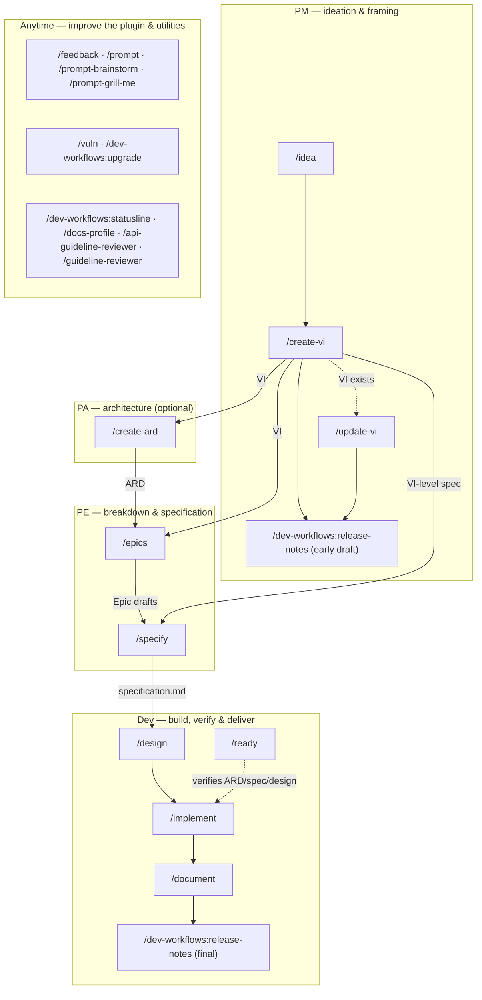

# Workflow overview

This is the dev-workflows pipeline top to bottom — every command shown here, in the order the roles typically hand work to each other. `/idea → /create-vi` opens a Value Increment; `/document` and `/release-notes` close it out.

The diagram draws the ARD reaching `/epics`, but that is one of five consumers: `/epics`, `/specify`, `/design`, `/implement`, and `/ready` all resolve the applicable ARD once it exists. The edge is drawn once to keep the diagram readable, not because the others do not consult it.

The diagram above shows where each command sits in the pipeline; [Roles and phases](roles-and-phases.md) says what each role is accountable for and what it hands over at each seam.

**Three command names collide with a Claude Code built-in of the same name: `/release-notes`, `/upgrade`, and `/statusline`.** Typing the bare form reaches Claude Code's own command instead of the plugin's, so use the qualified form — `/dev-workflows:release-notes`, `/dev-workflows:upgrade`, `/dev-workflows:statusline` — for those three. No other command in this plugin is known to collide today, so the rest work either way, and the diagram above spells out the qualified form only where it is required.

## Roles

| Role | Runs | Produces → lands at |
|---|---|---|
| **PM** | `/idea`, `/create-vi`, `/update-vi`, and an early `/release-notes` | `idea.md` in `$VAULT_PATH`, then the VI in `$SPECS_PATH/specifications/<KEY>-<slug>/` |
| **PA** | `/create-ard` (optional) | the ARD, in the same specs feature folder as the VI |
| **PE** | `/epics`, `/specify` | Epic drafts in `$VAULT_PATH/jira-drafts/<VI-KEY>/`; `specification.md` on the specs repo's default branch |
| **Dev** | `/design`, `/implement`, `/document`, `/ready`, and a final `/release-notes` | `design.md` on the specs repo's default branch; code on a branch in `$REPOS_PATH`, left uncommitted; product docs in the docs repo; a read-only readiness verdict that sets no status |

See [Roles and phases](roles-and-phases.md) for what each role owns, consumes, and hands off — this table only shows where the commands sit.

## Artifact homes

- **`$SPECS_PATH/specifications/<KEY>-<slug>/`** — the shared, team-visible home for the VI, the ARD, `specification.md`, and `design.md`. Each authoring command lands its file here, then hands it onto the specs repo's default branch for the next command to find.
- **`$VAULT_PATH`** — the personal store: `idea.md` before a Jira key exists, the imported `jira-products/<KEY>/` tree, `jira-drafts/<VI-KEY>/` Epic drafts, and release-notes drafts.
- **`$REPOS_PATH`** — the mounted code clones. `/implement` and, outside the VI pipeline, `/upgrade` work here on a feature branch but leave changes uncommitted; `/vuln`, also outside the VI pipeline, is the one that commits and opens a pull request, per fixed CVE. Product documentation itself is written into the external docs repo, not here.
- **Plugin bookkeeping** — feedback and session-cost files — lives under `<VI-dir>/dev-workflows/` inside `$SPECS_PATH`, committed and pushed alongside the specs artifacts it describes. Follow-up tasks are the one exception: they land in your vault first and reach this directory only when no vault is available — see [Follow-ups](reference/follow-ups.md) for the full ladder.

## Sources of truth

- **Jira** is the source of truth for workflow *status* — [`workflow-states.md`](../references/workflow-states.md), which owns the VI and Epic status ladders, says so outright and stores no status of its own, only interprets one. An external import tool pulls the ticket tree into `$VAULT_PATH/jira-products/<KEY>/`, every command reads the status from there, and none writes it back. `/ready` is the command that looks most like an exception and is not one: it verifies a declared status against the ARD/spec/design record and reports, rather than changing it.
- **The specs repo's default branch** is the source of truth for whether a phase's deliverable is actually *done*. A producing command lands its artifact there; the next command in the chain refuses to start expensive work until it finds the artifact on that branch, not merely written to disk. See [Roles and phases](roles-and-phases.md) for what happens when the artifact is on an unmerged branch instead, or missing entirely.

## Cross-cutting commands

These run outside the role pipeline above, at any time:

- **Plugin improvement.** `/feedback` logs a note about the plugin itself; `/prompt`, `/prompt-brainstorm`, and `/prompt-grill-me` turn a correction you just made into logged feedback plus a fix.
- **Standalone maintenance.** `/vuln` (CVE remediation) and `/upgrade` (dependency / runtime upgrades) run on their own, outside the VI pipeline.
- **Setup and review utilities.** `/statusline` (install the status line — run this first), `/docs-profile` (bootstrap a docs repo's profile), `/api-guideline-reviewer` and `/guideline-reviewer` (API / UI compliance reviews).
