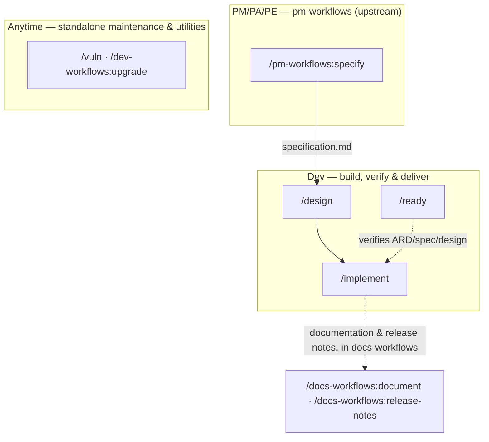

# Workflow overview

This is the `dev-workflows` pipeline top to bottom — every command shown here, in the order the roles typically hand work to each other. This plugin's spine picks up from `specification.md`, which the companion `pm-workflows` plugin's PRD → architecture → Epic breakdown → specification ladder (and its six-command BRD-to-PRD route) lands on the specs repo's default branch: `/design → /implement` carries it the rest of the way to shipped code, `/ready` verifies the artifacts alongside that spine, and the companion `docs-workflows` plugin closes the PRD out with `/docs-workflows:document` and `/docs-workflows:release-notes`.

The diagram draws `specification.md` reaching `/design` alone, but `/implement` and `/ready` also resolve the applicable ARD and the in-scope `specification.md`/`design.md` once they exist — the edge is drawn once to keep the diagram readable, not because the others do not consult those artifacts.

One node in this diagram is not this plugin's command and is drawn for continuity only: `/pm-workflows:specify`, where this plugin's spine picks up. It ships in the companion `pm-workflows` plugin, alongside `/idea`, `/create-prd`, `/update-prd`, `/create-ard`, `/epics`, and the six-command BRD-to-PRD route that feeds it — that plugin's own Workflow overview page carries the full upstream diagram. The combined `/docs-workflows:document · /docs-workflows:release-notes` handoff hanging off `/implement` ships in the companion `docs-workflows` plugin and is documented there.

The diagram above shows where each command sits in the pipeline; [Roles and phases](roles-and-phases.md) says what each role is accountable for and what it hands over at each seam.

**One command name in this plugin collides with a Claude Code built-in of the same name: `/upgrade`.** Typing the bare form reaches Claude Code's own command instead of the plugin's, so use the qualified `/dev-workflows:upgrade`. `/release-notes`, drawn here for context, collides the same way and is qualified `/docs-workflows:release-notes`; `/statusline` collides too and is qualified `/workflows-core:statusline`. Each ships in a companion plugin. No other command in this plugin is known to collide today, so the rest work either way, and the diagram above spells out the qualified form only where it is required.

## Roles

| Role | Runs | Produces → lands at |
|---|---|---|
| **Dev** | `/design`, `/implement`, `/ready` (then `/docs-workflows:document` and a final `/docs-workflows:release-notes`) | `design.md` on the specs repo's default branch; code committed on a branch in `$REPOS_PATH`, pushed with a PR on consent; a read-only readiness verdict that sets no status |
| **Anytime** | `/vuln`, `/upgrade` | a fixed CVE or a completed upgrade, committed on a feature branch in `$REPOS_PATH` |

The PM, PA, and PE roles that produce this plugin's own input — `specification.md` — ship in the companion `pm-workflows` plugin; see [Roles and phases](roles-and-phases.md) for where this plugin's spine picks up and that plugin's own Roles and phases page for what each of those three roles owns.

## Artifact homes

- **`$SPECS_PATH/specifications/PRD-<KEY>-<slug>/`** — the shared, team-visible home for `specification.md` and `design.md`, in the `EPIC-` folders below the PRD folder (a BRD route puts the same PRD folder one level down, inside `BRD-<KEY>-<slug>/`, per the companion `pm-workflows` plugin's own conventions). `/design` lands its file here, then hands it onto the specs repo's default branch for `/implement` to find.
- **`$REPOS_PATH`** — the mounted code clones. `/implement`, `/upgrade`, and `/vuln` each work here on a feature branch and each finish it the same way ([`code-handoff.md`](reference/references.md)): the work is committed without asking, and pushing it and opening a pull request sit behind one consent choice per run. `/vuln` does that once per fixed CVE, `/upgrade` commits once per component and pushes once for the batch.
- **Plugin bookkeeping** — feedback and session-cost files — lives under `<PRD-dir>/dev-workflows/` inside `$SPECS_PATH`, committed and pushed alongside the specs artifacts it describes. Follow-up tasks are the one exception: they land in the PRD folder beside the artifacts they are about — see [Follow-ups](reference/follow-ups.md) for the full ladder.

## Sources of truth

- **The artifacts** are the source of truth for workflow *status* — [`workflow-states.md`](../references/workflow-states.md) is read in the direction its *expected artifacts* column supports, and `/ready` derives the phase from what is on disk. An operator who keeps a tracker can still check a declared status against it with `/ready --claimed "<status>"`.
- **The specs repo's default branch** is the source of truth for whether a phase's deliverable is actually *done*. A producing command lands its artifact there; the next command in the chain refuses to start expensive work until it finds the artifact on that branch, not merely written to disk. See [Roles and phases](roles-and-phases.md) for what happens when the artifact is on an unmerged branch instead, or missing entirely.

## Cross-cutting commands

These ship in companion plugins and run against the same specs tree, outside this plugin's own role pipeline:

- **In `workflows-core`.** The status line, the specs-tree frame-set indexer, and the plugin-feedback commands: `/workflows-core:statusline`, `/workflows-core:frames`, `/workflows-core:feedback`, `/workflows-core:prompt`, `/workflows-core:prompt-brainstorm` and `/workflows-core:prompt-grill-me`.
- **In `docs-workflows`.** Documentation, the docs-repo profile, and the release note: `/docs-workflows:document`, `/docs-workflows:docs-profile` and `/docs-workflows:release-notes`.
- **In `pm-workflows`.** The PRD → architecture → Epic breakdown → specification ladder this plugin's spine picks up from, and the six-command BRD-to-PRD route that feeds it — `/pm-workflows:idea`, `/pm-workflows:create-prd`, `/pm-workflows:update-prd`, `/pm-workflows:create-ard`, `/pm-workflows:epics`, `/pm-workflows:specify`, and the six `/pm-workflows:brd-*` commands.
