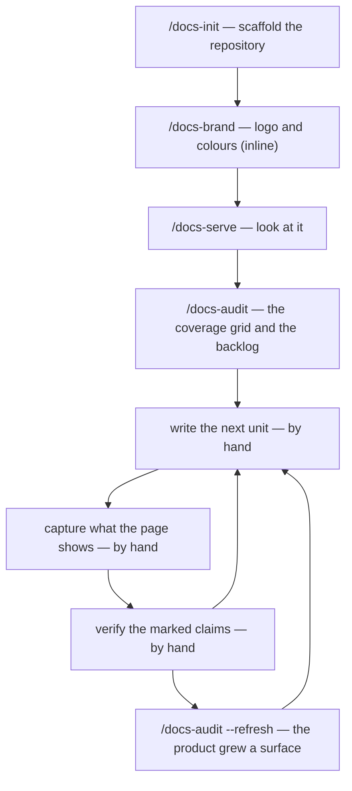

# docs-workflows

Seven slash commands for a product's documentation and release notes: `/docs-init` scaffolds a documentation repository for a project that has none — one that builds, serves, lints and carries a profile — `/docs-audit` enumerates what documentation that product is missing, into a coverage grid and a prioritised backlog, `/document` synthesises product documentation from a resolved PRD's implementation diffs (or makes a one-shot prose edit in direct mode), `/docs-profile` bootstraps and refreshes the machine-readable profile `/document` consumes, `/docs-brand` extracts a logo and a rough colour pair from a product's own code and applies them to the docs site, `/docs-serve` runs a profiled repo's dev server and reports a URL that opens from the host, and `/release-notes` drafts a destination-shaped release-notes entry from the same PRD folder. It depends on the shared `workflows-core` foundation and on `prose-style` for its style-check gate.

> Part of the `ihudak-plugins` marketplace — see the [repo-root setup guide](../../README.md) for marketplace install + prerequisites.

## What it does

| Role | Commands | What it does |
|------|---------|--------------|
| Dev | [`/document`](docs/commands/document.md) | Document a feature from its PRD and the diffs that shipped it, gated on a style check and an Opus review — or make a one-shot prose edit in direct mode, style-checked only. |
| PM / Dev | [`/release-notes`](docs/commands/release-notes.md) | Draft the one Summary that announces a change, shaped by the destination it resolves to: breaking change, feature update, or fix. |
| Docs | [`/docs-init`](docs/commands/docs-init.md) | Scaffold a docs repository for a project that has none: a product-shaped page skeleton, two builds, Vale, CI gates, and the profile `/document`, `/docs-serve`, `/docs-brand` and `/docs-audit` read. |
| Docs | [`/docs-audit`](docs/commands/docs-audit.md) | Enumerate what documentation the product is missing — from its own code and the specs tree — into a coverage grid and a prioritised backlog, gated on an Opus backlog review. |
| Anytime — setup | [`/docs-profile`](docs/commands/docs-profile.md), [`/docs-brand`](docs/commands/docs-brand.md), [`/docs-serve`](docs/commands/docs-serve.md) | Write the profile `/document` reads; extract a logo and colours from the code and apply them to the site; or start, stop, or check the dev server — each a reviewable PR where it writes one. |

## Documentation workflow

Four of those commands stand a portal up and keep it honest about what it is still missing, and the work between them is done by hand. The cold-start trio — `/docs-init`, `/docs-brand`, `/docs-serve` — shipped first, and `/docs-audit` followed with the coverage grid and the backlog. **The iteration stage has not shipped**: turning a unit of that backlog into a published page is a manual procedure today. Writing the page, capturing what it shows and walking its claims are each specified for a later command, and each is written out step by step in [The documentation route](docs/docs-workflow.md), which is the page to read next.

`/document`, `/release-notes` and `/docs-profile` sit outside that loop: the first two work against a delta once a feature has shipped, and the third describes a documentation repository this plugin did not scaffold. [Workflow overview](docs/workflow.md) draws all seven together.

Eleven agents and twenty-one reference pages carry the docs-repo discovery, diff summarising, doc planning, doc writing and doc review that `/document` and `/release-notes` draw from; the `docs-scaffold-reviewer` that `/docs-init` and `/docs-brand` share reviews a scaffold diff, never a page, and the three `/docs-audit` dispatches — `docs-auditor`, `ia-planner` and `docs-audit-reviewer` — enumerate surfaces, plan the backlog and then review it. `/docs-profile` and `/docs-serve` dispatch none of these eleven agents: each executes the reference pages it needs directly — `repo-resolution.md` and the profile schema for both, plus `render-verification.md`, `toolchain-preflight.md` and `scaffold-tree.md` for `/docs-serve` — and `/docs-profile`'s repository scan runs on general-purpose subagents of its own. Those twenty-one markdown pages plus two bundled data files — `default-owners.txt` and `docs-profile.default.yml`, which the commands, the skill and a hook read as data rather than open as prose — are the **twenty-three files** under `references/`; that is the whole of the difference between the page count and the file count, and [References](docs/reference/references.md) does the arithmetic file by file. Alongside them ship the `docs-frontmatter` skill `/docs-profile` points a repository at, and two advisory hooks — one injecting specs context on a `/document` or `/release-notes` prompt, one reminding about a docs page's changelog and owners frontmatter.

## Documentation

| Page | What's there |
|------|--------------|
| [Documentation index](docs/README.md) | The full "I want to…" lookup table, plus the command, agent, and reference inventories. |
| [Getting started](docs/getting-started.md) | Install, environment variables, your first `/docs-profile` and `/document` runs. |
| [Workflow overview](docs/workflow.md) | The seven commands as one diagram, and the two modes of `/document`. |
| [The documentation route](docs/docs-workflow.md) | The ordered procedure from an empty repository to a populated portal, with every manual step written out. |
| [Agents](docs/reference/agents.md) | The subagent inventory the commands dispatch internally. |
| [References](docs/reference/references.md) | The reference-doc inventory under `references/`, and the one bundled skill. |
| [Environment](docs/reference/environment.md) | Every environment variable the plugin reads. |
| [Hooks](docs/reference/hooks.md) | The two bundled hooks, what each injects or reminds about, and why neither blocks Claude. |
| [Session cost](docs/reference/session-cost.md) | Which commands emit a cost entry, what they charge to, and where it lands. |

## Recommended environment

Mount every repository, your docs clone and your specs repo under one `/workspace`, matching this plugin's defaults, with [`ihudak/ai-containers`](https://github.com/ihudak/ai-containers). Outside a container the commands still work — set `$REPOS_PATH`, `$DOCS_PATH` and `$SPECS_PATH` yourself; see [Environment](docs/reference/environment.md).

## License

MIT — see [LICENSE](LICENSE).
