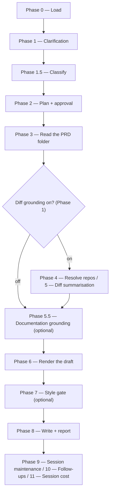

# /release-notes

Drafts a customer-facing release-notes summary for a resolved Product Requirements Document or ticket, for the PM to publish wherever their release notes are published.

## Who runs it

`/release-notes` is the plugin's one **dual-role** command — the same command runs at two different points in a PRD's life, and `emit-cost` tells them apart by inference rather than by a fixed label. `workflows-core:cost-emission` §7 gives the discriminator, and it is deliberately narrow: **the presence of downstream engineering artifacts** — any `specification.md` or `design.md` under the PRD's specs dir. **None present** → phase `prd-creation`, role `pm` — the PRD exists but no engineering work has started, and Epics may or may not exist yet. **Either present** → phase `documenting`, role `dev` — the dev re-run, once a specification or design is in scope.

**Epic presence is deliberately not part of the signal.** A PRD can have drafted Epics — via `/product-workflows:epics` — while still entirely in PM/PE hands: nothing about an Epic draft implies engineering has started on it. Keying the discriminator on Epics would misattribute that ordinary PM-phase PRD as a dev run. Specs and designs are the right signal because they can only exist once `/product-workflows:specify` or `/dev-workflows:design` has actually run against the PRD — an Epic drafted by `/product-workflows:epics` never gets close to producing either.

**What differs between the two runs is narrower than the phase label suggests.** The command asks the same questions, reads the same PRD hierarchy, offers the same optional diff grounding, and runs the same style gate regardless of which phase it infers — there is no branch in `/release-notes`'s own phases keyed on `run_phase`. The one place it matters is the **Feature update** documentation link: on the PM run the feature isn't built yet, so no link is offered or asked for at all; on the dev run, the author may supply a redirect short link that will later point at the page `/document` publishes. Everything else — the draft's shape, its destination, its style check — is identical either way.

## Synopsis

```
/release-notes <ADDRESS> [--version <v>] [--no-docs] [--docs <path>]
```

`/release-notes` is **address-required** — there is no free-text or `@file` input; a prompt with no positional address stops with `RELEASE_NOTES_NEEDS_KEY`. The address is a `<KEY>`, or an `@<path>` naming a folder in the specs tree; `workflows-core:addressing` §3 resolves either.

## How it runs

`/release-notes` has 14 `## Phase` headings.



The `d1` fork is the Phase 1 diff-grounding choice, default OFF — the PRD alone is usually enough for a release note. It decides whether Phase 3's diff-source step runs at all — the `implementation.md` read and the `git log --grep` commit scan that build the refs — and Phase 4's repo resolution and Phase 5's `diff-summarizer` batches go with it; Phase 3's read of the PRD itself runs either way. No phase collects a PR link: a ref carries no URL, no host classification and no `gh` requirement.

Three subagents are dispatched: `workflows-core:docs-grounder` (Phase 5.5, read-only grounding on the shipped product docs — default ON when `$DOCS_PATH` resolves, advisory, never a gate), `release-notes-writer` (Phase 6, the sole author of the rendered draft), and `workflows-core:impl-maintenance` (Phase 9, alongside no other maintenance agents — `/release-notes` has none of `/document`'s or `/dev-workflows:implement`'s three general-purpose maintenance dispatches). `diff-summarizer` (Phase 5) is a fourth agent, dispatched only when diff grounding is on. `prose-style-checker` and `prose-fixer` (Phase 7) belong to the separate `prose-style` plugin, a declared dependency of this one, so neither is ever skipped for want of a plugin — but they are not gated alike: `prose-style-checker` runs whenever the user keeps the style gate, while `prose-fixer` runs only when that pass returns violations *and* the user chose auto-fix, so "report only" keeps the gate and never reaches the fixer.

## What it needs

- **A resolved address** — a key or an `@<path>` naming a PRD or Epic folder in the specs tree; `mode: direct` is rejected outright. An Epic folder's PRD is read from the PRD folder above it, and the draft then covers that Epic's changes; `release-notes.md` is the PRD folder's either way.
- **Optional diff grounding** (default OFF) — when turned on, `$REPOS_PATH` is resolved the same way `/document` resolves it, and clones are matched by `git remote` against the repo slugs the implementation record and the commit scan named; a repo that resolves to zero matches is put to you as a choice rather than resolved silently, and a repo you then skip degrades the grounding for that repo and never the run.
- **Optional `$DOCS_PATH` grounding** (Phase 5.5), resolved once in Phase 2 alongside plan approval — read-only, never a gate.
- **For a deprecating change, an end-of-life date.** A deprecation note is required whenever the PRD deprecates a capability or is itself a deprecation, and it always needs an end-of-life date — the end-of-support date is optional. A missing end-of-life date is never invented: it becomes a `deprecation_eol` gap the command asks the user about, with a `<!-- TODO: end-of-life date -->` placeholder in the draft until it's answered.

## What it produces

**Where it lands.** `release-notes.md` in the resolved PRD folder, appended as a section: the Change Type selects `## Breaking changes`, `## Feature updates` or `## Fixes`, and those sit under a heading for the release version one level above them (`--version <v>`, else asked; `# Unreleased` when declined), each titled draft's `### title` sitting below its section. The three former destination *files* are those three sections — the taxonomy is unchanged, only where a draft lands. Each draft sits under an HTML-comment scope line naming the PRD's key, or the Epic's on an Epic address, and the date; it renders as nothing and is not part of what you paste. It is how a later run with diff grounding on takes its boundary per scope: from each implementation record it reads only the blocks dated after the latest note covering that record — a note for the PRD covers every Epic's, a note for an Epic that Epic's alone — so a note drafted for one Epic does not hide another Epic's earlier work. The commit scan beside the record keeps to the same boundary: it drops every commit a block names and keeps only those dated after the latest note covering the record whose key they carry, or on its day, so work an earlier note described does not come back as unrecorded.

**The authored body only** — never an identifier, a PR link, a `Change type:` line, or a `{{#internal-note}}` block, since the docs automation adds that metadata wrapper when it publishes. For a titled destination (`## Feature updates` / `## Breaking changes`) that's the category label (the PRD's own `release_notes_category`, used verbatim, or omitted entirely when the PRD carries none), an `### title`, and customer-facing prose; under `## Fixes` it's **one bare past-tense sentence**, with no label and no title. Exactly **one** Summary is ever produced per run — never one block per declared release version — and no title or prose in it ever names the release version itself; the version is the `#` heading the draft is filed under.

The **section** is resolved from the PRD's `change_type` when it carries one that routes — `not applicable` does not, nor does `Bug fix` on a deprecating change, and neither stops the run — else inferred from the change's nature, with a low-confidence inference confirmed by its consequence (the shape and the section it lands under) rather than by presenting the bare enum label. A deprecating change carries its required end-of-life date (and optional end-of-support date) as a trailing note in the Summary. The Phase 8 report states where it landed and reminds the user to publish it wherever their release notes are published. `/release-notes` also drafts an implementation-gaps bug report when `release-notes-writer` returns a PRD-vs-source discrepancy, resolved through the same per-claim decision table `/document` (keyed mode) Phase 5.8 uses.

## Gates

**Light gate only.** There is no Opus review, no tests, and no branch created by this command — `specs-preflight` may switch `$SPECS_PATH` between branches that already exist and were created by the plugin, but it creates none. The one optional gate is a **style check** (Phase 7): when the user chose it, `prose-style-checker` runs against the rendered draft and, on the auto-fix choice, `prose-fixer` applies safe fixes. Both work on a scratch copy of the draft, so neither touches a section an earlier run appended, and the command names the specs repository to the checker as the repository whose rules apply: the draft is checked under the house-style overlay the specs repository keeps in `.prose-style/rules/`, as `release-notes.md` itself would be, rather than under the rules of the repository the session happens to stand in. The report's style line names the rule set applied. That input arrived in `prose-style` 0.4.0, which echoes it back; this plugin declares `prose-style` with no version range, and where an older checker runs its output carries no echo, and the report records the style check `DEGRADED`, saying the specs repository's rules may not have applied and that `prose-style` needs updating. Optional here means the user's own answer in Phase 1 — `prose-style` is a declared dependency, so the phase never skips itself for want of a plugin.

**The run has no worthiness gate, and there is no content state in which it refuses to draft.** One existed and was retired: it read a `relevant_for_release_notes` flag off the PRD and stopped on an explicit `false` or `no`. Every PRD is relevant for release notes, so the flag asked a question with one answer and the only value that changed anything was one nobody should write; the field is retired in `workflows-core:prd-format` and a value left in an existing PRD is read by nothing. The run refuses only on its address: Phase 0 stops with `RELEASE_NOTES_NEEDS_KEY` where the prompt carries no positional address at all, stops naming every match where one resolves ambiguously, and raises the shared re-enter/cancel escalation where one resolves to nothing, or to a folder holding no PRD — in Phase 0 a BRD container, whose PRDs sit in its slices, each named as an address to re-enter, or a folder it cannot place at any level, and in Phase 3 a PRD folder with no `prd.md`. Whether a note is worth drafting is the decision of whoever runs the command.

The run makes **zero external API calls**: Phase 3 builds its refs with no URL and no host classification, every diff is taken by local `git` against a clone under `$REPOS_PATH`, and the folder read is strictly read-only.

## Example

One invocation, two runs — the command is the same either time, and only the inferred phase differs.

**The PM's early run**, with the PRD opened and nothing specified or designed yet:

```
/docs-workflows:release-notes PRODUCT-1234
```

The run asks about diff grounding (default: PRD content only) and the release version, classifies as `MODERATE`, reads the PRD, resolves `$DOCS_PATH` grounding if configured, and finds neither `specification.md` nor `design.md` under the PRD's specs dir — so it infers `run_phase: pm` and renders the draft via `release-notes-writer` with no documentation redirect link, because the feature isn't built and there is no page to point at yet. It then runs the optional style gate and writes the persistent draft with a reminder to publish it.

**The dev's later re-run**, once a specification or design is on record:

```
/docs-workflows:release-notes PRODUCT-1234
```

Byte for byte the same command, and every step above happens the same way. The single difference is what the specs dir now contains: `run_phase` infers as `dev`, so the draft may carry a documentation redirect short link. Same destination, same classification, same style gate, same publish reminder.

## See also

- Roles and phases — the `pm` and `dev` roles this command straddles, and what distinguishes the `prd-creation` and `documenting` cost phases. The page that defines all four is `dev-workflows`'s `docs/roles-and-phases.md`; `workflows-core`'s page of the same name carries `prd-creation` but neither role nor the `documenting` phase.
- `/product-workflows:create-prd` — the upstream command that produces the PRD a PM-phase run of `/release-notes` typically drafts from; it ships in the companion pipeline plugin.
- [`/document`](document.md) — the command whose eventual published page a dev-phase run's documentation link points at; the sibling command whose own phase/role is fixed rather than inferred.
- `/product-workflows:epics` — Epic drafting; deliberately excluded from the `/release-notes` phase/role discriminator even though it can run before or after this command.
- `workflows-core:model-routing/classification` — the classification rules; `/release-notes` is always `MODERATE`.
- [Session cost](../reference/session-cost.md) — the terminal Phase 9–11 bookkeeping every run emits. The other two emitters have pages elsewhere: session feedback in `workflows-core`, follow-ups in `dev-workflows`.
- [`release-note-types.md`](../../references/release-note-types.md) — the section map, the per-section draft shape and prose rules, and the deprecation-note rule `release-notes-writer` applies.
- `workflows-core:cost-emission` — §7's full phase/role inference this page's `## Who runs it` section is derived from.
