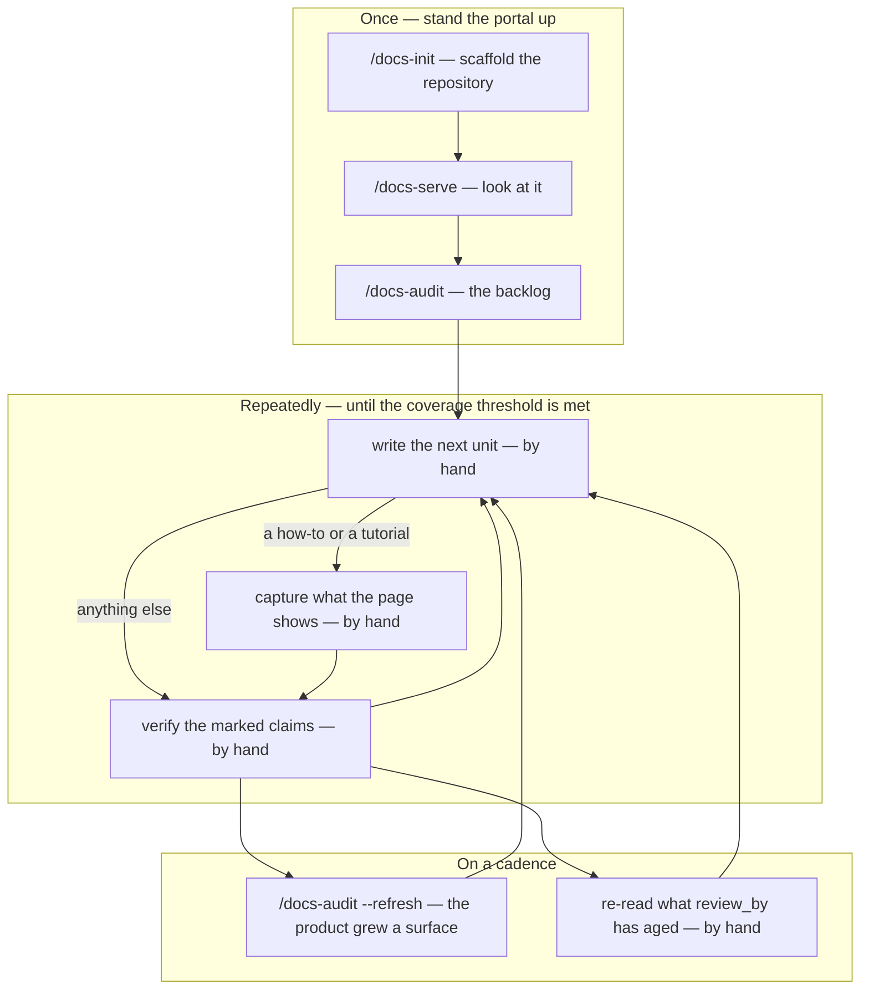

# The documentation route

A portal is not finished when it builds. [`/docs-init`](commands/docs-init.md) gives you a site that builds, lints and serves with a stub in every section, and [`/docs-audit`](commands/docs-audit.md) gives you a prioritised list of every page that site is missing — and then you are holding a backlog with no stated order to work through it. This page is that order: from an empty repository to a portal whose coverage grid says the work is done, step by step, with the parts no command runs written out as the procedure a person actually follows.

**Four of the eight steps below run a command. The other four you do by hand, and this page says how.** Read *by hand* as **no command of this plugin does that step for you** — not as *no command helps*: [`/document`](commands/document.md) will draft and style-check a page you describe to it, and step 4 says which half of the work that leaves with you. Where a later release will automate a step it is named at the end of that step, as what changes later and never as something to type. **Nothing on this page asks you to run a command that is not installed.**

## The route



Every node carrying *by hand* is a step nothing in this plugin runs for you, and the loop in the middle is three of them on purpose: the commands on either side derive what a portal ought to contain and measure what it does, and neither of those is the act of writing a page about a product for a person who has never used it. [Workflow overview](workflow.md) draws all seven of this plugin's commands and where each sits; this page draws only the ones on this route, plus the work between them.

---

## Once, to stand the portal up

### 1. `/docs-init` — scaffold the repository

```
/docs-workflows:docs-init /workspace/docs
```

Confirm the code repositories the portal documents — that set becomes the denominator every later coverage figure is a fraction of, and where you confirm one it is written into the profile, so the audit in step 3 does not have to ask again. Approve the logo and colour pair [`/docs-brand`](commands/docs-brand.md) extracts when the run offers them; it never applies branding silently. The run commits the scaffold on a branch and drafts a pull-request message, and **it never pushes and never merges** — pushing the branch, opening the pull request and merging it are yours. What you have afterwards is a content tree with a stub in every section saying what belongs there, two builds over it — a public site and an internal one, or one if you passed `--public-only` — a linter, a CI workflow carrying the visibility gates, and `.dev-workflows/docs-profile.yml`. The run verifies both builds, the linter and the visibility gate against built output; it never starts a server, which is what step 2 is for.

A documentation repository that already exists does not need this step. Run [`/docs-profile`](commands/docs-profile.md) against it instead — that writes the same profile the rest of this route reads — and start at step 2.

### 2. `/docs-serve` — look at it

```
/docs-workflows:docs-serve
```

It starts the repository's own dev server and reports a URL; opening it is yours. **Expect the caveated one.** `/docs-serve` reports the profile's `public_base_url` where one is recorded and the in-container address with an explicit caveat where none is — and `/docs-init` deliberately does not invent that value, so on this route, one step after the scaffold, the caveated address is the case you will get. Inside a container it will not open from your browser until somebody records the real host mapping in `dev_servers.servers[].public_base_url`; until then, reach the port your container publishes.

This step is here because seeing the empty portal is what makes the rest of the route concrete — a skeleton of stubs reads very differently on a screen than in a directory listing.

### 3. `/docs-audit` — the backlog, and the first real decision

```
/docs-workflows:docs-audit
```

The run enumerates the surfaces the product has, crosses each with the page types it earns, ranks the result and writes `.dev-workflows/docs-backlog.yml`. **Then read what it printed, because everything downstream obeys that file.** Three things are yours to settle before you write a line of prose:

- **The top twenty units and the `priority_reason` under each.** Correct the ones that are wrong. A reason you edit is preserved by every later run — the test is mechanical, so nothing has to guess what you touched.
- **The tutorial candidates.** Which journey a role should learn first is the one judgement no scan can make, so the run proposes and you pick, by setting `picked: true` on a `tutorial_candidates[]` entry. The pick becomes a real unit on the **next `--refresh` run** (step 7), once each and never twice.
- **Commit the file.** The run leaves it in the working tree and neither branches nor commits in the documentation repository; the backlog is meant to be tracked and reviewed in a pull request like anything else. Where one of your project's own `.gitignore` rules catches the path, the run names the rule and the file it is in and writes the backlog anyway, rather than force-adding past a rule your project chose. Getting it committed is then yours to decide — changing the rule is the cleaner answer, and forcing the add is the other one.

**A run that enumerated no surface at all writes no backlog**, and that is not a failure: no plan is made, an existing file is left exactly as it was, and the report says whether the product genuinely has none of these things or the scan could not tell. Settle that before step 4, which has nothing to open otherwise.

[The documentation backlog](reference/docs-backlog.md) is what each block holds; [the coverage model](reference/docs-coverage-model.md) is what the words in it mean.

---

## Then, repeatedly, until the coverage threshold is met

These three steps are the loop, and no command of this plugin runs any of them end to end.

### 4. Write the next unit — by hand

Take the highest-priority unit whose `status` is `missing` **and whose `blocked_by` is empty**. That second half is not a formality: a run records `blocked_by` and leaves the `status` alone, so a blocked unit is still `missing` and a selection made on `status` alone picks it. `[surface-removed]` means the last `--refresh` no longer found that unit's surface — and since a refresh re-derives `surfaces[]`, the row the next paragraph sends you to is gone with it — while `[page-missing]` means its recorded page is not where the backlog says. Both are judgements a run cannot make and left for you: a surface vanishing is as likely to be a repository nobody mounted as a feature genuinely removed. Settle the token before you write against the unit, and the list is open, so a unit may carry a token somebody added by hand for a reason of their own.

**What the unit tells you.** Its `type` is the shape of the page — the four user types are the Diátaxis quadrants (`tutorial`, `how-to`, `reference`, `explanation`) and the four engineering types take the shape their own tradition fixes: an `architecture` page is an arc42 or C4 section, a `decision` page is a MADR record, a `runbook` is a runbook, and `api-reference` is generated API reference. Its `audience` decides what its claims may rest on. Where the unit names a `surface`, that row in `surfaces[]` carries the `evidence[]` list of the files to read; where the unit's `surface` is `null` — a page somebody added by hand for something the code does not imply — the evidence is on the **unit** instead, in its own `evidence` list. [Evidence and walkthroughs](reference/docs-evidence.md) is what those files entitle you to assert: a claim about what a user sees is settled by looking at it, and a claim about how the system is put together is settled by reading the code, and swapping the two is how a page ends up confidently wrong about the half nobody checked.

**What you write.** Create the page under the section its surface belongs to, in the content root the profile declares for it. Then its frontmatter, and one line beneath it — and everything after the first entry below is what steps 6 and 8 actually depend on, rather than decoration:

- **The four keys this family reserves** — `type`, `audience`, `visibility`, and **`unit: <the unit's id>`**, which is the link in both directions: it is what a later `--refresh` matches the page back to, and without it the run has no way to connect the page it can see to the unit that asked for it.
- **`evidence:`** — what the page's claims rest on, one entry per source, in the three-kind shape [Evidence and walkthroughs](reference/docs-evidence.md) fixes. **A `code` entry carries a `ref`, and where the evidence came from a surface this frontmatter is where that `ref` first gets written**: a surface's `evidence[]` rows carry a repository and a path and no commit, so the commit to record is that repository's entry in the backlog's own `sources[]`, which is the commit the scan actually read. (A `surface: null` unit's own `evidence` list already carries its refs — copy them across.) Step 6 re-reads the code *at the ref the evidence entry records*, so a page written without one leaves that step nothing to read against.
- **`review_by`** — a date. Step 8 is entirely "sort your pages by this and re-read what has aged", and nothing anywhere on this route sets it for you, so a page written without one is a page that step can never surface.
- **The internal marker, where the page is internal.** Every file under `docs/internal/` carries `<!-- docs-visibility: internal -->` as its **first line after the frontmatter**. It is an HTML comment because it has to survive into the built output, where the CI marker gate greps for it — a frontmatter key would be consumed by the renderer and never reach the artefact. A hand-written internal page missing it fails nothing at all and silently weakens that gate, which is the only defence against an internal snippet leaking into a public page.

Mark every claim you could not ground with `[NEEDS CLARIFICATION: why]`, in the prose, where a reader meets it — a marked claim is never quietly smoothed into a fact, and a page ships with its markers showing rather than being held back over one unresolved sentence.

**Watch `visibility` against `page_path`.** The two-build split decides by path: a page is internal because it sits under `docs/internal/`, and nothing in either build reads the `visibility` value. So a unit marked `visibility: internal` whose `page_path` is outside that tree describes a page that **ships publicly**, with both build gates green. Set the pair in one edit. [Documentation visibility](reference/docs-visibility.md) is the model behind it.

**Then update the unit**: `page_path` to where you put the page, and `status: drafted`. Do this now rather than later — the two costs of not doing it are real, and both are yours to carry:

- **The loop re-selects the unit.** Step 4 picks on `status: missing`, so a unit left `missing` with a page already written is the unit this step hands you again on the next pass, and again after that, until a `--refresh` reconciles it. Nothing on this route runs a refresh between iterations; step 7 is on a cadence.
- **It routes past step 6.** A `--refresh` that finds a page carrying the unit's id reads the page first, and lands the unit on `drafted` where it carries a marker — but straight on `published` where it carries none, without anybody having walked a claim. The schema allows that edge deliberately, and states what it rests on: your tag that the page is done, and no walkthrough. A coverage figure raised that way is only as good as that tag.

**What helps today.** [`/document`](commands/document.md) in direct mode will apply a described edit to pages and run the style check over them, which is real work off your hands — but it reads no backlog: it does not open the unit, does not write the `unit:` key, and does not move a `status`. The prose is its half; the unit is yours.

*Later: `/docs-write` is specified to take the highest-priority missing unit and draft it, leaving it `drafted` with its unresolved claims marked. It is not part of this release.*

### 5. Capture what the page shows — by hand

A `how-to` or a `tutorial` needs the sequence of screens it describes, and **that sequence is not derivable from routes** — which is why this step exists whether or not a command ever runs it.

**Walk the flow in a real environment** and screenshot each step the page describes. Where the unit names a `walkthrough`, follow it; nothing in this release composes one, so a unit has one only because somebody wrote it. Where there is none, walk the flow yourself and consider writing the file as you go — the format is frozen now so that a browser driver can execute the very same file later, without anybody rewriting it.

A walkthrough lives at **`<top>/.dev-workflows/walkthroughs/<id>.yml`**, where `<top>` is the git top level of the documentation repository — the same home as the backlog and the profile, and not the content root, which matters where the site sits in a `site/` or `website/` directory below it. The unit records the **id** and never the path. This is the whole shape:

```yaml
walkthrough:
  id: W-001
  unit: U-001
  role: customer
  environment: docker              # which environment it was written against
preconditions:
  - "catalog seeded"
  - "signed in as customer"
steps:
  - n: 1
    action: navigate               # navigate | click | type | select | wait — and no sixth
    target: "/orders/new"
    expect: { kind: heading, text: "New order" }
captures:
  - { slot: img-order-form, after_step: 1, shows: "the empty order form" }
```

**The action vocabulary is closed at those five words**, because a driver has to implement every one of them and a verb a writer invented is a verb no driver supports; a step you cannot express with the five is worth reporting rather than working around. `expect.kind` is deliberately *not* closed. Each entry in `captures` names a **slot** — a placeholder you leave in the page, which the screenshot you take then fills — so `slot` is the name that connects the image you produce to the place it belongs.

**Where the images go is the profile's `images.policy`, and it has three values — check which one your repository records before you save anything:**

| `images.policy` | Where a screenshot goes | Replacing one |
|---|---|---|
| `in-repo` (the scaffold's default) | Committed under `images.root` (default `docs/assets`) and referenced by relative path — **but an internal-only image goes under `docs/internal/` instead**, see below | Overwrite the same path — one path per slot, never a new filename beside the old one |
| `object-store` | An S3-compatible bucket; every public-build URL must resolve under `images.public_prefix`, internal media under `images.internal_prefix` | Overwrite in place, as above — and sweep orphans, since deleting a page does not delete its objects |
| `cdn` | You upload it and supply the URL; no binary is ever committed | A CDN URL is immutable, so a replacement is a **new** URL and the page edit is a URL swap |

Under `in-repo`, `images.max_bytes` (default 300 KB) is the CI budget checked per image, and one over it fails that check — prefer SVG, then an optimised PNG. `images.root` and `images.max_bytes` mean nothing under the other two policies, and `images.public_prefix` means nothing under `in-repo`.

**Under `in-repo`, an image only internal pages may see belongs under `docs/internal/` and never under `images.root`.** This is the trap in the step, and it is invisible from inside the repository: a file under `images.root` is copied into **both** builds whether or not any page references it, because MkDocs copies the content tree and does not trace references. So a screenshot of an internal screen, saved to the shared assets directory and referenced only by an internal page, **ships in the public site** — and neither CI gate fires. The first sees no cross-link, because there is no link; the second greps the public output for the visibility marker, which an image cannot carry. Knowing the rule alone is not enough here, which is why the mechanism is spelled out: the instinct that an unreferenced file is harmless is exactly the instinct that is wrong. The same separation that drops internal *pages* from the public build drops internal *files*, and it works on path and on nothing else. [Documentation visibility](reference/docs-visibility.md) is the whole model.

*Later: `/docs-capture` is specified to drive the capture and fill the slots a walkthrough names. It is not part of this release.*

### 6. Verify the marked claims — by hand

**For a user page**, walk the steps in a real environment and answer each one:

| Answer | Means | You also write down |
|---|---|---|
| `confirmed` | it did what the step said it would | nothing |
| `differs` | it worked, and showed something else | **the text you actually saw** — required |
| `blocked` | you could not establish what the step did | why: a precondition unmet, an environment that would not start, an expected result you had no way to check |

**Writing the observed text down on a `differs` is what pays for the exercise.** "Step 4 failed" sends somebody back to the environment to find out what it says instead; "step 4 shows *Create order*, not *New order*" **is** the page edit, already written by the person who was looking at the screen. A `differs` with nothing written down is an incomplete answer — do not record it until you have the text in front of you.

Answers go back into the walkthrough file, on the step they belong to, and **each of the two extra fields belongs to exactly one outcome**: `observed` carries the text you saw and is written on a `differs` and on nothing else; `note` carries the reason and is written on a `blocked` and on nothing else. A note on a `confirmed` step is a comment nothing has a rule for.

```yaml
  - n: 2
    action: click
    target: { label: "Add item" }
    expect: { kind: visible, label: "Item details" }
    result: { outcome: differs, observed: "Line item details" }
  - n: 3
    action: click
    target: { label: "Submit" }
    expect: { kind: visible, label: "Order placed" }
    result: { outcome: blocked, note: "payment sandbox would not come up" }
```

**For an engineering page**, re-read the code at the ref the evidence entry records, and again at today's commit. There is no environment to stand up and nothing to walk — the reading is the whole of it.

**Then dispose of each marker.** A claim that survives becomes prose and its `[NEEDS CLARIFICATION]` marker comes off, because the claim has been settled. One that does not **stays marked** and ships marked — there is no third disposition, and "the page is being published now, so let us tidy that up" is not one of them.

**Then set the status, and the two cases end differently.** A page you resolved every marker on goes `status: verified`, and then `published` when the page actually ships. **A page still carrying a marker takes `drafted` and stops there** — it may be merged and deployed with the marker showing, which is what *ships marked* means, but its unit may not reach `published` by any route: not the ordinary one, which runs through `verified`, and not the `--refresh` reconciliation, which reads the page, finds the marker and lands the unit on `drafted` itself. Resolve the marker and the unit moves on; until then the grid says, correctly, that this one is not finished.

**`verified → published` has no command behind it in any specification of this family, now or later** — that transition is a branch merged and a site deployed, which happens in your repository. It is worth knowing which arrow that is, because `published` is the state the coverage fraction counts, and there is deliberately no arrow from `drafted` straight to it: if there were, the grid could go green over pages the family knows it never walked.

*Later: `/docs-verify` is specified to render the checklist, take the answers and write them back. It is not part of this release.*

---

## Then, on a cadence

### 7. `/docs-audit --refresh` — when the product grows a surface

```
/docs-workflows:docs-audit --refresh
```

Run it after a new integration, a new role or a new release, so the denominator grows with the product rather than freezing at day one. It re-derives the sources, the surfaces and every coverage figure against today's code, and it is read-only about your edits: every unit you added stands, your tutorial picks stand, a `priority_reason` you corrected stands with the re-derived one reported beside it rather than written over it, and a candidate you marked `picked: true` becomes a unit — once, with its id recorded so no later run mints a second page for the same journey. A unit whose surface has left the scan is marked `blocked_by: [surface-removed]` and reported rather than deleted, and one whose recorded page is no longer there gets `[page-missing]` the same way; a surface vanishing is as likely to be a repository nobody mounted as a feature genuinely removed, and only you can tell those apart.

### 8. Re-read what `review_by` has aged — by hand

`review_by` in a page's frontmatter is the calendar backstop for the rot no diff can see: a product renamed, a process changed, a policy that moved, none of which touches a line of the code a page's evidence points at. Sort your pages by that date and re-read what has aged past it. A page that is still right takes a new date; one that is not goes back to step 4, and a claim you can no longer ground is marked rather than left standing.

*Later: `/docs-drift` is specified to watch the evidence side of this — diffing a surface's evidence paths between the ref the backlog recorded and today, and re-queueing the units that fan out from it. The calendar side stays a human judgement either way, so this step does not disappear when that command ships.*

---

## What to expect, stated honestly

The four user page types do not cost the same, and one of the four prioritisation signals — *write first what can be grounded now* — leans the ranking the same way:

| Page type | What it takes |
|---|---|
| `reference`, `explanation` | Ground almost entirely from code; little human input beyond the writing |
| `how-to` | Drafts from code, and **requires** a capture — a sequence of screens is not derivable from routes |
| `tutorial` | Needs a human to choose the journey first (step 3), then a capture |

So the realistic order front-loads reference and explanation — which is also where a reader with no documentation at all gets the most immediate value, and the cheapest way to make a portal stop being empty. It is a lean and not a rule: the signal that outweighs every other is *does this page's absence block the primary journey*, which points squarely at how-tos, and a separate rule biases a **high-churn** surface away from step-by-step toward explanation and reference because those survive churn. A ranked backlog is the resultant of all four signals, not of this table.

**Done is a threshold, not a feeling.** Every unit whose `priority` number is at or below the backlog's `threshold` — priorities 1 and 2, at the seeded value of 2 — has reached `published`, and every claim on the pages behind them is either evidence-backed or visibly marked. **Those two halves are not independent:** a page that still carries a marker ships with it showing, and its unit stays at `drafted` and counts toward nothing, so *visibly marked* describes what a page may look like on its way to done and never what a `published` unit rests on. The threshold is a number you set: the first run seeds it at 2 and says so, `--threshold <n>` sets it, and every later run writes back whatever you left there.

## See also

- [`/docs-init`](commands/docs-init.md) — step 1: what the scaffold writes and what it leaves on the branch.
- [`/docs-serve`](commands/docs-serve.md) — step 2: starting, stopping and checking the dev server.
- [`/docs-audit`](commands/docs-audit.md) — steps 3 and 7: the flags, the phases, the gates and every failure mode.
- [`/document`](commands/document.md) — the two modes, and what direct mode does with the prose in step 4.
- [The documentation backlog](reference/docs-backlog.md) — the file this route is worked through: each block, the status lifecycle, what the coverage fraction counts.
- [The coverage model](reference/docs-coverage-model.md) — surfaces, the page types a surface earns, and what decides the order.
- [Evidence and walkthroughs](reference/docs-evidence.md) — what a claim may rest on, what a marked claim looks like, and how to walk a checklist.
- [Documentation visibility](reference/docs-visibility.md) — the two-build public/internal split behind step 4's `visibility` warning.
- [Workflow overview](workflow.md) — all seven commands of this plugin, including the ones off this route.
- [Getting started](getting-started.md) — install, the environment variables, and a first run end to end.
