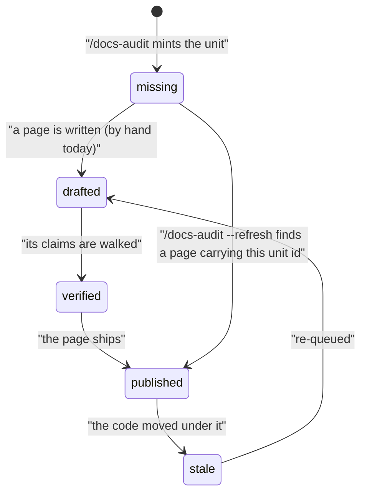

# The documentation backlog

The audit's output is one file: **`.dev-workflows/docs-backlog.yml`**, a list of every page your product could have, what each one is about, which ones exist, and what order the rest are worth writing in. It is not a report you read once — it is a file you keep, edit, argue with in a pull request, and re-run the audit against.

This page explains what is in it and how to work with it. The runnable version — the one `/docs-audit` and its agents execute — is the plugin's own `references/docs-audit/backlog-format.md`. The vocabulary the file is written in (what a surface is, what a page type is, what decides priority) is on [the coverage model page](docs-coverage-model.md).

## Where it lives, and why it is committed

The backlog sits at **the git top level of your docs repository**, in `.dev-workflows/`, beside the profile `/docs-profile` writes and the state file `/docs-serve` keeps. That is one home and not a per-site one: if your repository publishes two sites — a `site/` beside the code, a `website/` in a monorepo — there is still **one backlog**, because the denominator is your product's surfaces and publishing twice does not give you a second set of them.

**It is tracked in git and reviewed in a pull request**, exactly like the profile beside it. The scaffold's `.gitignore` ignores only `/docs-serve`'s state file by name and deliberately not the `.dev-workflows/` directory, so a backlog written there is committed like anything else.

**Editing it by hand is normal.** It is one of the five ways a page gets into the backlog, and the intended way for anything the code does not imply — a migration guide, a policy page, a comparison, the question a customer actually asked. Because the file is reviewed like code, a hand-added page is a proposal somebody can disagree with rather than a private note.

## What is in it

| Block | Holds | Written by |
|---|---|---|
| `sources` | Every repository the run scanned, with the commit it was scanned at | The audit |
| `surfaces` | The denominator — every thing in the product documentation could be about | The audit |
| `units` | One entry per page: what it is about, who for, what type, what priority, what state | The audit, then you |
| `tutorial_candidates` | Proposed first journeys, one per role. **You pick** by setting `picked: true` | Proposed by the audit, picked by you |
| `coverage` | A fraction per audience-and-type cell | The audit, derived from `units` |
| `threshold` | The priority at or above which "done" applies | You |

Two things in that table are worth reading twice. **`sources` records a commit, not just a path** — that is what later makes it possible to say the code has moved since a page was written, rather than only that the code exists. And **`tutorial_candidates` is the one block the audit will not decide for you**: which journey a role should learn first is a judgement no scan can make, so the audit proposes and you pick by editing the file.

Your picks are safe from the next run. A `--refresh` keeps every candidate entry that is already there, word for word, and only appends candidates for a role that has none — so `picked: true` is never quietly undone. When a picked candidate becomes a real unit, the run writes that unit's id back onto the candidate, which is what stops the next run from minting a second page for the same journey.

## The states a page moves through

Every unit carries a `status`. These are the transitions, and the only ones:

**Two of those seven transitions have a command behind them today, and both are `/docs-audit`.** The initial run mints units as `missing`; a `--refresh` run marks a unit `published` when it finds a page already carrying that unit's id. Most of the rest are drawn for commands that make it up the road — `drafted` and `verified` belong to the writing and verification commands of the next spec, `stale` to the drift command of the one after — and **until those ship, you move a unit by editing the file.** The diagram shows the model, not seven pieces of automation you have today.

**One arrow has no command behind it in any of the three specs, now or later: `verified → published`.** That is the page shipping — a branch merged, a site deployed — which happens in your repository rather than in a command here. **You mark a unit `published`**, today and after the rest of the family lands. It is worth knowing which arrow that is, because `published` is the state the coverage fraction counts.

**There is deliberately no arrow from `drafted` to `published`, and that missing arrow is doing real work.** `drafted` means a page exists whose claims have not been walked — the writing pass leaves markers behind exactly where it could not confirm something. If a page could go straight from there to `published`, the coverage figure would go green over the pages nobody checked, which is the one number in this file worth having. The only route runs through `verified`.

The arrow from `missing` to `published` is not that same jump under another name. It fires only when a page already exists carrying the unit's id — which means **a person wrote that page and tagged it**, and the audit is recording their judgement rather than making one of its own. Worth knowing what it rests on, though: that tag, and no walkthrough. The page's `review_by` date and the evidence rules are what catch it later.

## What the coverage fraction counts

`coverage` reports, per audience-and-type cell, **the fraction of that cell's units that have reached `published`**. Not the fraction whose page exists. A unit can have a written page, a `page_path` and a status of `drafted`, and contribute **nothing** to the numerator — which is the point: a coverage grid that counted prose would be green the moment somebody typed, and this one only moves when a page has been checked and shipped.

Every figure is recomputed from the `units` list in the same run that writes it. If you hand-edit a status, the number is stale until the next run; re-running the audit is what settles it.

## One trap worth knowing before you hand-edit

A unit carries both `visibility` (`public` or `internal`) and `page_path`. They look independent and are not. **The two-build split decides by path**: a page is internal because it sits under `docs/internal/`, which is what the public build drops. Nothing in either build reads `visibility`.

So a unit marked `visibility: internal` whose `page_path` is outside `docs/internal/` describes **a page that ships publicly**, and no build will complain — the link gate passes because nothing crosses a boundary, and the marker gate passes because the page carries no internal marker to find. The field says one thing and the artefact does another. If you set `visibility: internal` by hand, put the path under the internal tree in the same edit; the review gate checks the pair, because neither field is wrong on its own.

## What a run will never do to this file

- **Delete a unit.** A `--refresh` that can no longer find a unit's surface marks it `blocked_by: [surface-removed]` and reports it, leaving the status alone. A surface vanishing from a scan is as likely to be a repository that was not mounted as a feature that was really removed, and a run cannot tell those apart. Deleting it is your call.
- **Write a coverage figure it did not derive from the units in the same run.**
- **Mint a second unit for a tutorial candidate it has already minted one for.**
- **Overwrite your tutorial picks.**

## See also

- [The coverage model](docs-coverage-model.md) — surfaces, page types, and what decides the order pages get written in.
- [Evidence and walkthroughs](docs-evidence.md) — what a page's claims are allowed to rest on, and how a claim gets checked.
