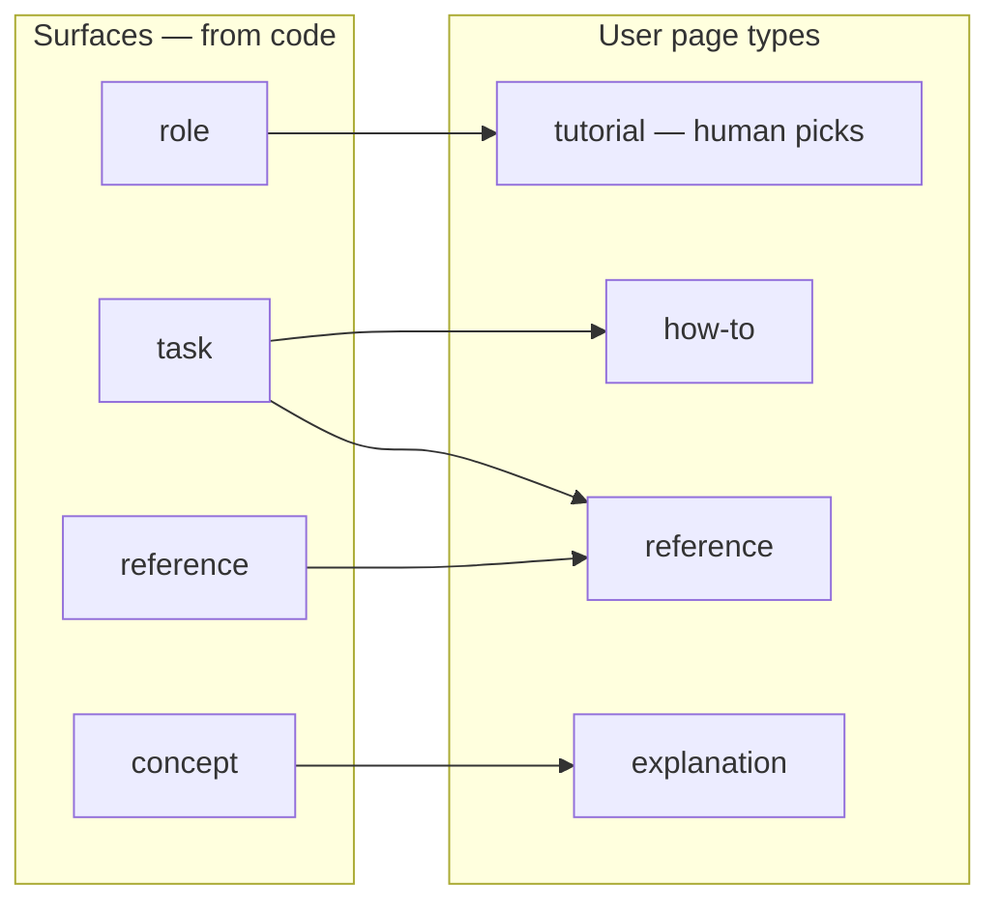

# The coverage model

An audit cannot tell you what documentation is missing without first agreeing what "all of it" would have been. That set is the **denominator**, and this family builds it from the product's own code rather than from anybody's memory of what the product does. This page explains the two nouns the backlog is written in — a **surface** and a **unit** — how they differ, what decides which units get written first, and what "done" means when documentation work has no natural end.

The runnable version of everything here lives in the plugin's own `references/docs-audit/coverage-model.md`, which the audit command and its agents read. This page is the same model written for a person.

## Surfaces: what the audit counts

A **surface** is a thing in the product that documentation can be about, found by scanning the code. There are seven kinds, and each one is derived from a different part of a repository:

| Surface kind | Found in the code as | What it earns |
|---|---|---|
| `role` | The authorisation model — roles, permissions, policy objects | A roles page, and an axis on every user page |
| `task` | Routes, controller actions, UI flows, forms | A how-to guide |
| `concept` | Domain models, the vocabulary the code itself uses, state machines | An explanation page |
| `reference` | API endpoints, configuration keys, jobs, data schemas, the CLI | A reference page |
| `service` | Deployables, containers, external integrations | An engineering architecture page |
| `decision` | Architecture decision records already in the specs repo | An engineering decision record |
| `release` | Release-notes drafts under the specs tree, grouped by version | A "What's new" page per major version, plus its maintenance page |

**Roles are a dimension, not an extra.** "What can somebody in this role actually do?" is the question user documentation exists to answer, which is why a walkthrough is always written for a role rather than for a generic user.

Because surfaces come out of a scan, the audit is careful about one distinction: a theme the scan could not resolve is **named as unresolved**, never filed as a surface with pages missing. "Missing" is a claim that a page does not exist; "unresolved" is a claim that the scan could not tell. Treating the second as the first fills your backlog with work nobody has verified is real.

## Pages: what a surface earns

The second axis of the grid is the page **type** — `tutorial`, `how-to`, `reference` or `explanation` for a reader using the product, and `architecture`, `decision`, `runbook` or `api-reference` for a reader building it. Coverage is a grid of `(surface, audience, type)` cells, each one of `exists`, `missing` or `stale`. Three of the four user types follow from the surface kind:

The engineering axis is smaller and is best read as a list rather than drawn:

| Engineering type | Usually earned by | Answers |
|---|---|---|
| `architecture` | A `service` surface | How the parts fit together, and where this one sits |
| `decision` | A `decision` surface | What was decided, and what was given up for it |
| `runbook` | A `service` surface, for example | What to do when this breaks at three in the morning |
| `api-reference` | A `reference` surface | The exact shape of an interface, field by field |

**Read that middle column as the usual case, not as a fixed mapping.** Which types a surface earns is a judgement made per surface, exactly as it is on the user axis: a service that nobody operates by hand earns no runbook, and one service can earn an architecture page and a runbook both. A table read as one arrow per type is the mechanical cross-product *Surfaces and units are two tables, on purpose* rejects below.

Both halves of the vocabulary — the user four above and the engineering four here — behave the same way in one respect worth stating on its own. **Every one of these eight type names is a property of a page, not a plan for your navigation.** A page answers one kind of question, and a page answering two is two pages — but the site a reader lands on is organised by what the product does, not by the eight type names. Applying the type vocabulary to your folder tree is the most common way to get a portal that is technically correct and impossible to browse.

## Tutorials are the one thing that does not automate

A how-to follows from a task, an explanation from a concept, a reference page from an endpoint. A **tutorial** does not follow from anything: it is a curated first journey for a role — which of the many things somebody can do is the one worth learning first, and in what order — and no amount of scanning tells you that.

So the audit proposes and you pick. It writes its candidates — the shortest path through the highest-value tasks for each role — into a `tutorial_candidates:` block in the backlog file, and you choose by editing that file. It is deliberately not an interactive prompt: there is one candidate journey per role, so the list has no fixed length, and you are already in this file correcting the reasoning on the top-ranked units.

## Surfaces and units are two tables, on purpose

A surface is a thing in the product. A **unit** is one page about it — one unit, one page. The backlog keeps them apart because one surface usually earns several pages, and because staleness is detected **per surface** and then fans out to every unit that surface feeds: one detection, many consequences.

A unit is created by crossing a surface with the types that surface **actually earns**, which is a judgement rather than a multiplication. `order-placement` is a `task` surface: it earns a how-to, and probably a reference page for the endpoint behind it. It does not earn an architecture page. Crossing every surface with all eight page types instead would give each one eight units, nearly all of them pages nobody should write — and each of those, left unwritten, is then counted as missing.

Five things put a unit in the backlog, and only the first three happen on their own:

| # | How | Automatic | What it adds |
|---|---|---|---|
| 1 | The first audit run | Yes | Every unit the scanned surfaces earn — this is where a backlog comes from on day one |
| 2 | A later `--refresh` run | Yes | Units for surfaces that did not exist before, and existing pages matched back to their units |
| 3 | A drift run, when that command ships | Yes | No new units — it moves existing ones to `stale` and re-queues them |
| 4 | Tutorial selection | No | The candidates you picked by editing the backlog |
| 5 | You, editing the backlog file | No | Anything the code does not imply: a migration guide, a policy, a comparison, a customer's actual question |

Path 5 is meant to be used. The backlog is a tracked file reviewed in a pull request precisely so that hand-adding a page is a normal act rather than a workaround.

**It has one consequence worth knowing before you use it.** Drift watches a unit's `surface`. A hand-written unit either attaches to a surface that already exists — and is then watched like everything else — or it sets `surface: null` and gives its evidence by hand, in which case **nothing can tell you when it has gone out of date** and the page relies on its `review_by` date alone. That is a fair trade for a page with no code behind it, but it is a trade, so every run reports how many `surface: null` units you have. The number is there to be watched.

## What gets written first

Every unit carries a rank and a written reason for it. Four signals feed the rank:

1. **Does its absence block the main journey?** Can somebody in this role do the main thing at all without this page? This carries the most weight, because a missing page here is a product that cannot be used.
2. **How many roles touch the surface?** A page that serves four roles is worth more than one that serves a single specialist.
3. **Can it be grounded now?** Write first what can be verified. A page that cannot be checked against the code is a page that ships wrong.
4. **How much does it churn?** Measured from commit density on the surface's own paths. High churn lowers the rank.

**The fourth signal ranks, and never excludes.** A part of the product that is still moving is still a part people meet today; dropping it from the backlog does not save the work, it only hides the gap. So when something churns heavily *and* blocks the main journey, the page is written — what changes is its **type**. The audit biases away from step-by-step instructions and screenshots, which go stale with the next redesign, toward explanation and reference, which describe what a thing is. It records that it did so on the unit itself, as `churn_adapted: true` with the reason beside it: a decision you can see and disagree with rather than one baked silently into a type.

## What "done" means

Documentation work has no natural end, so this family defines one:

> **Done** = every backlog unit at or above a priority threshold you choose has a published page, and every claim on those pages is either evidence-backed or visibly marked.

The backlog reports coverage as a fraction per audience-and-type cell, which is what makes that sentence checkable. "We wrote a lot of docs" is not a completion criterion. A coverage grid with a threshold is.
