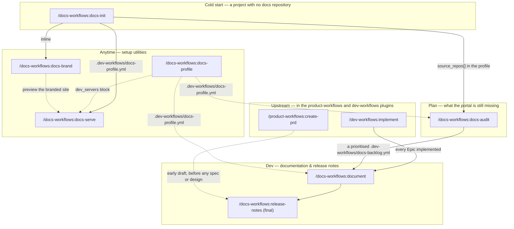

# Workflow overview

`docs-workflows` carries the documentation tail of the pipeline the companion `product-workflows` and `dev-workflows` plugins drive. Every command it ships is shown below. The spine is short: once a Product Requirements Document's Epics are implemented, `/docs-workflows:document` writes the product documentation and `/docs-workflows:release-notes` drafts the note that announces it. Before that spine can run at all there has to be a documentation repository, and `/docs-workflows:docs-init` is the cold-start command that creates one — a portal skeleton that builds, serves, lints and carries a profile — running `/docs-workflows:docs-brand` inline as one of its own phases. `/docs-workflows:docs-profile`, `/docs-workflows:docs-brand`, and `/docs-workflows:docs-serve` also stand alone outside the spine — setup utilities reached at any point: the first teaches `/document` what an existing documentation repository looks like, the second extracts a logo and a rough colour pair from the product's own code and applies them to the docs site, and the third runs that repository's own dev server so you can look at it. Between the cold start and the spine sits `/docs-workflows:docs-audit`, which answers what the portal is still missing: against a documentation repository that already exists, it reads the code repositories the profile records and the specs tree, and writes a coverage grid and a prioritised backlog into that repository for a person to work through — so it runs after `/docs-init` on a fresh portal, and at any later point on one that has been filling up.

Two nodes are drawn for continuity and are not this plugin's commands: `/dev-workflows:implement` ships in the companion `dev-workflows` plugin and `/product-workflows:create-prd` in the companion `product-workflows` plugin, and each is documented there.

**One command name here collides with a Claude Code built-in of the same name: `/release-notes`.** Typing the bare form reaches Claude Code's own command instead of this one, so use the qualified `/docs-workflows:release-notes`. `/document`, `/docs-init`, `/docs-audit`, `/docs-profile`, `/docs-brand`, and `/docs-serve` are not known to collide today, so the rest work either way, and the diagram above spells out the qualified form throughout because that form always works.

## The two modes of `/document`

`/document` is one command with two modes, selected by its first argument token, and the difference between them is the whole shape of the run.

| Mode | Selected by | What it does | Gates |
|---|---|---|---|
| Keyed | a positional address — a key, or `@<path>` naming a folder in the specs tree | Reads the resolved PRD folder, resolves the repos its implementation record and commit scan name, summarises the refs they record in parallel, locates write targets, plans, writes | Style check, then an Opus `doc-reviewer` review |
| Direct | no positional address — an `@file`, free text, or a plain directory | A one-shot prose edit on whatever the argument names | Style check only — no reviewer, and Phase 3 creates no branch and no commit of the edit |

A change that touches both code and docs is `/dev-workflows:implement`'s, not either mode of this command.

## Where each command writes

- **A documentation repository** — `/docs-init` creates one: the page skeleton, both build configs, `.vale.ini` and its vocabulary, the CI workflow, and `.dev-workflows/docs-profile.yml`, all on a branch it commits and drafts a pull request for and never pushes. `/document` writes pages there and, in keyed mode, finishes on a branch with an opt-in push and a copy-paste pull-request draft. `/docs-profile` writes `.dev-workflows/docs-profile.yml` and complementary `CLAUDE.md` guidance there, as a reviewable pull request; it never pushes or auto-merges. `/docs-brand` writes theme colours, CSS variables, and copied logo/favicon assets there — the same branch-commit-drafted-PR discipline as `/docs-profile`, standalone; folded into `/docs-init`'s own single PR when run `--inline`. `/docs-serve` writes only a pid/port record under that same `.dev-workflows/`, so `--stop` and `--status` work in a later session — never a page, never a branch, never a commit. `/docs-audit` writes `.dev-workflows/docs-backlog.yml` there, and the profile's `source_repos[]` key where that key was absent, and nothing else — no page, and no branch and no commit either: the backlog is left in the working tree for you to review and commit with the rest of your work.
- **`$SPECS_PATH`** — session bookkeeping, and the drafts a run leaves beside a PRD: the cost, feedback and follow-up entries `/document`, `/release-notes`, `/docs-init`, `/docs-audit`, and a standalone `/docs-brand` run emit, and drafts such as `/document`'s `pr-draft.md` and `<KEY>-implementation-gaps.md` and `/release-notes`' `release-notes.md`, each committed by the terminal step bounded to those paths. A screenshot `/document` stages there for manual upload is kept out of `git status` instead, being a copy kept only until you upload it. `/release-notes` derives where its draft goes rather than asking — its Phase 1 sets it to `release-notes.md` in the resolved PRD folder, where the draft is appended under the release version's heading and the section its change type selects — and it writes nothing in a docs or code repository or in the current working directory, where it is not the specs repository; the draft is the authored body only, the metadata wrapper being the docs automation's. A run with no PRD to attribute to — `/docs-init`, `/docs-audit`, a standalone `/docs-brand`, and `/document` in direct mode — files its cost and feedback per docs repository under `documentation/<docs-repo-slug>/` rather than in the pending queue, and keeps its follow-ups in its own report. `/docs-profile` and `/docs-serve` run no specs-preflight and no terminal commit, so neither writes anything here at all; an `--inline` `/docs-brand` run emits nothing of its own either, since its cost belongs to the caller's entry. None of the seven writes a pipeline artifact there.

## Sources of truth

- **The PRD folder** is what a keyed run reads: the Product Requirements Document itself, plus the implementation record and commit scan that name the diffs to summarise. See [Getting started](getting-started.md) for what has to be in place before a keyed run works at all.
- **The resolved docs profile** is what tells `/document` where a page belongs, what frontmatter it carries, and how to verify the render. In-repo first, then the bundled default, then on-demand profiling.

See the [documentation index](README.md) for the per-command pages and the agent, reference and environment inventories.
