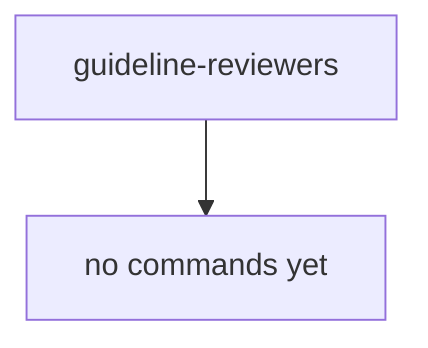

# Workflow

`guideline-reviewers` ships no commands yet — this page is a placeholder that will grow into a real command diagram once the review commands move in. For now it shows only that the plugin exists.

