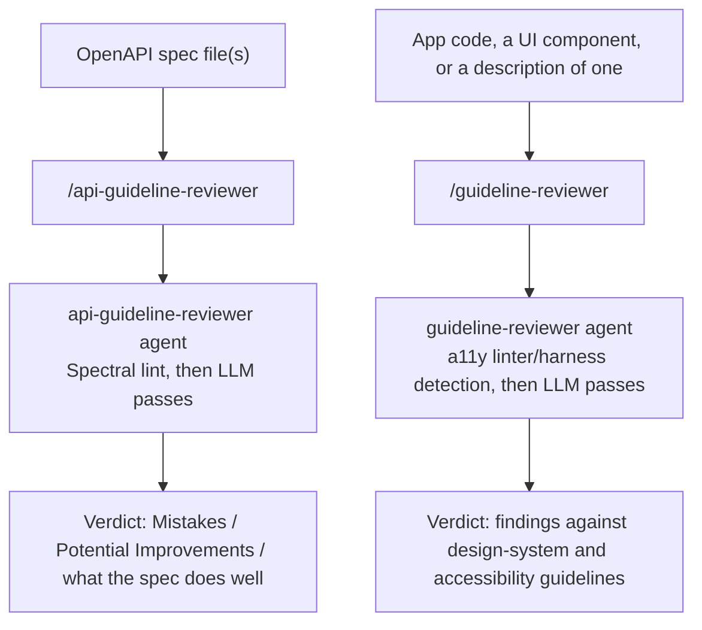

# Workflow

`guideline-reviewers` ships two standalone review commands. Neither consumes a workflow artifact or produces one, and neither reads or writes `$SPECS_PATH` — each is a single dispatch to its own subagent, which prints a verdict directly.

- [`/api-guideline-reviewer`](commands/api-guideline-reviewer.md) reviews one or more OpenAPI spec files against the bundled REST API and IAM permission-naming guidelines in `references/api-guidelines/`, running a deterministic Spectral lint first where a Spectral CLI is available on the reviewer's machine.
- [`/guideline-reviewer`](commands/guideline-reviewer.md) reviews app code or a UI against the bundled design-system and accessibility guidelines in `references/guidelines/`, wrapping whatever accessibility tooling the target repo already configures rather than re-encoding a rule set.

Both commands are exempt from the model-routing classification the sibling `dev-workflows` plugin's pipeline commands apply — there is no role, no cost-attribution phase, and no `model_routing` block on either command. Each is documented on its own page; see the [documentation index](README.md) for everything else, including the two variables that let an organization layer its own rules over the bundled baseline.
